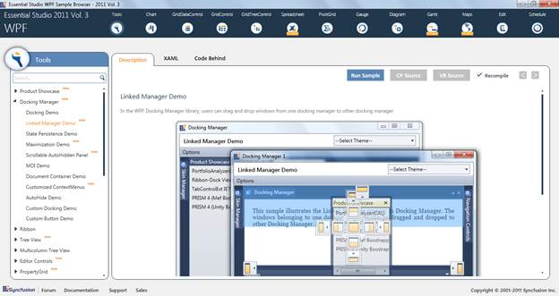

::: {style="DISPLAY: none"}
{#d2h_url_template}{#d2h_package_url style="WIDTH: 0px; DISPLAY: none; HEIGHT: 0px"}
:::

::: {.d2h_secondary_topic style="PADDING-BOTTOM: 10pt; MARGIN: 0pt; PADDING-LEFT: 0pt; PADDING-RIGHT: 0pt; PADDING-TOP: 0pt"}
##### Getting started {#getting-started style="tab-stops: 0pt"}

Samples Link

To view samples:

1.   Click **Start**\--\>**All Programs**\--\>**Syncfusion**\--\>**Essential Studio** \<version number\> \--\>**Dashboard**. (Refer section 2.2)

2.    In the Dashboard window, click Run Locally Installed Samples for WPF under User Interface Edition panel.

{border="0"}

Figure 366: Sample Browser

 

The WPF Sample Browser window is displayed.

 

[]{#related-topics}
:::
