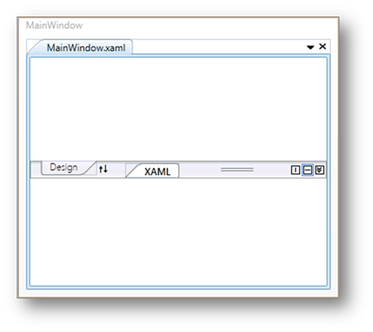

::: {style="DISPLAY: none"}
{#d2h_url_template}{#d2h_package_url style="WIDTH: 0px; DISPLAY: none; HEIGHT: 0px"}
:::

::: {.d2h_secondary_topic style="PADDING-BOTTOM: 10pt; MARGIN: 0pt; PADDING-LEFT: 0pt; PADDING-RIGHT: 0pt; PADDING-TOP: 0pt"}
#### Getting Started {#getting-started style="tab-stops: 0pt"}

Feature Summary

This section guides you on getting started with TabSplitter control.

Appearance and Structure of the TabSplitter Control

TabSplitter is similar to the VS 2008 style split view of tabbed groups with features like swapping, collapse and expansion of tab groups.

{border="0"}

Figure 1014: Structure of TabSplitter Control

[]{#related-topics}
:::
