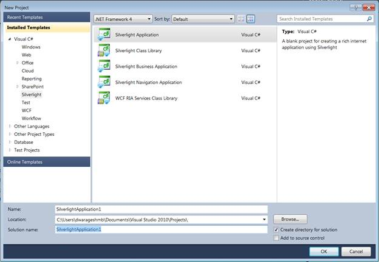
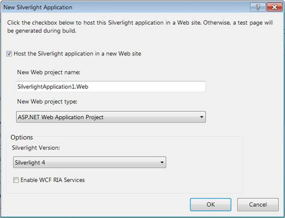
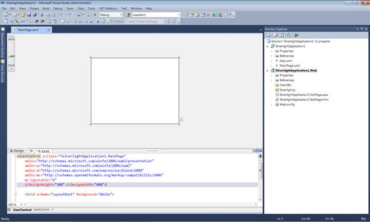
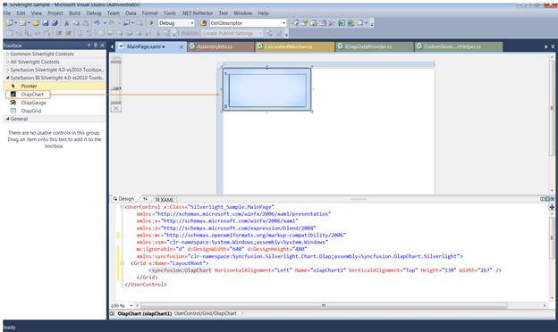
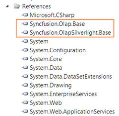
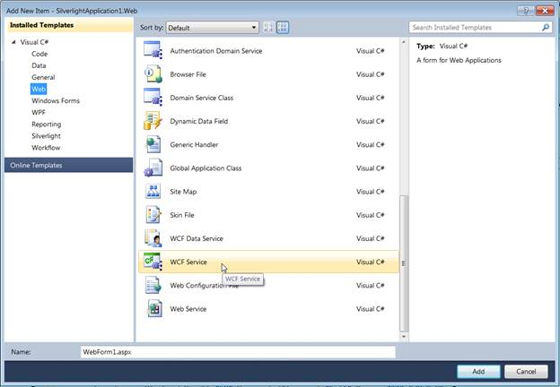
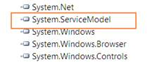
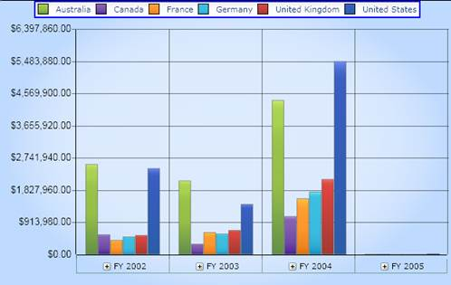

::: {style="DISPLAY: none"}
{#d2h_url_template}{#d2h_package_url style="WIDTH: 0px; DISPLAY: none; HEIGHT: 0px"}
:::

::::: {#nsbanner .d2h_main_nsbanner style="BORDER-BOTTOM: #999999 1px solid; POSITION: relative; PADDING-BOTTOM: 0px; BACKGROUND-COLOR: transparent; PADDING-LEFT: 0px; PADDING-RIGHT: 0px; DISPLAY: none; BORDER-TOP: #999999 1px solid; PADDING-TOP: 0px; LEFT: 0px"}
:::: {#TitleRow .d2h_main_titlerow style="PADDING-BOTTOM: 4px; BACKGROUND-COLOR: transparent; PADDING-LEFT: 22px; WIDTH: 100%; PADDING-RIGHT: 10px; DISPLAY: none; PADDING-TOP: 4px"}
::: {#ienav .d2h_main_ienav style="DISPLAY: none"}
{#D2HPrevious .D2HPreviousEnabled}  {#D2HNext .D2HNextEnabled}
:::
::::
:::::

:::: {#nstext .d2h_main_nstext style="PADDING-BOTTOM: 10px; BACKGROUND-COLOR: transparent; PADDING-LEFT: 22px; PADDING-RIGHT: 10px; HEIGHT: 100%; OVERFLOW: auto; PADDING-TOP: 5px" hasuserbackground="true" valign="bottom"}
::: {#d2h_breadcrumbs .d2h_breadcrumbs}
[Essential Studio User Guide Documentation](ms-xhelp:///?Id=12457748-09e3-4d74-a240-8e049cedf030){.d2h_breadcrumbsNormal}[ \> ]{.d2h_breadcrumbsLinkSeparator}[Business Intelligence Edition](ms-xhelp:///?Id=fdf33dd8-62b2-47b9-ad7b-fc50e590bca5){.d2h_breadcrumbsNormal}[ \> ]{.d2h_breadcrumbsLinkSeparator}[Essential BI Silverlight](ms-xhelp:///?Id=c006b39c-6aa2-4637-b7de-3e7b6cb3f9f9){.d2h_breadcrumbsNormal}[ \> ]{.d2h_breadcrumbsLinkSeparator}[Essential BI Chart]{.d2h_breadcrumbsContentsOnly}
:::

# Getting Started {#getting-started style="tab-stops: 0pt"}

The steps to get started are as follows:

1.   Click the **Start** menu, and then click **Microsoft Visual Studio 2010**.

2.   From the File menu, select **New Project**. The New Project dialog box is displayed as shown below.

[]{style="FONT-FAMILY: 'Trebuchet MS','sans-serif'; COLOR: #15428b; FONT-SIZE: 9pt"} 

{border="0"}

 

Figure 8: New Project Dialog Box

[]{style="FONT-FAMILY: 'Calibri','sans-serif'"} 

3.   Select the **Silverlight Application** by navigating to the Silverlight node and then click **OK**.

4.   Host the Silverlight application on the Website.

{border="0"}

 

Figure 9:  Hosting Silverlight Application in Web

[]{style="FONT-FAMILY: 'Calibri','sans-serif'"} 

5.   Click **OK**, to create a web project as well as a Silverlight project, as shown below.

[]{style="FONT-FAMILY: 'Trebuchet MS','sans-serif'; COLOR: #15428b; FONT-SIZE: 9pt"} 

{border="0"}

 

Figure 10: Web and Silverlight Project

[]{style="FONT-FAMILY: 'Calibri','sans-serif'"} 

6.   Drag and drop the **OlapChart** from the toolbox to the MainPage.xaml.

[]{style="FONT-FAMILY: 'Calibri','sans-serif'"} 

 

 

 

{border="0"}

 

Figure 11: OlapChart in Designer Page

 

7.   Add the following two assemblies as references to the web project:

[·      ]{style="FONT-FAMILY: Symbol"}Syncfusion.Olap.Base

[·      ]{style="FONT-FAMILY: Symbol"}Syncfusion.OlapSilverlight.BaseWrapper

[o  ]{style="FONT-FAMILY: 'Courier New'; COLOR: #15428b; FONT-SIZE: 9pt"}[]{style="FONT-FAMILY: 'Trebuchet MS','sans-serif'; COLOR: #15428b; FONT-SIZE: 9pt"}

{border="0"}

 

Figure 12: References you need to add to the web project[]{style="FONT-FAMILY: 'Calibri','sans-serif'"}

[]{style="FONT-FAMILY: 'Calibri','sans-serif'"} 

8.   Add a WCF Service to the Web project by right-clicking the **Project -\> Add New Item -\> WCF Service**.

 

[{border="0"}]{style="FONT-FAMILY: 'Calibri','sans-serif'"}

 

Figure 13: Add New Item (WCF Service)

[]{style="FONT-FAMILY: 'Calibri','sans-serif'"} 

[]{style="FONT-FAMILY: 'Calibri','sans-serif'"} 

9.   Inherit the newly added WCF service with the IOlapDataProvider and explicitly implement the IOlapDataProvider. The connection to the database is done with the help of the WCF service. The service has to be created and instantiated as described below.

[]{style="FONT-FAMILY: 'Trebuchet MS','sans-serif'; COLOR: #15428b; FONT-SIZE: 9pt"} 

The WCF Service has to implement the IOlapDataProvider interface and for implementing this interface, we require the OlapDataProvider, which can be instantiated by passing the connection string.

The code snippet is displayed below:

+-------------------------------------------------------------------------------------------------------------------------------------------------------------------------------------------------------------------------------------------------+
| **[\[C#\]]{style="FONT-FAMILY: 'Courier New'"}**                                                                                                                                                                                                |
|                                                                                                                                                                                                                                                 |
| [public]{style="FONT-FAMILY: 'Courier New'; COLOR: blue"}[ [class]{style="COLOR: blue"} [OlapManager]{style="COLOR: #2b91af"} : [IOlapDataProvider]{style="COLOR: #2b91af"}]{style="FONT-FAMILY: 'Courier New'"}                                |
|                                                                                                                                                                                                                                                 |
| [{]{style="FONT-FAMILY: 'Courier New'"}                                                                                                                                                                                                         |
|                                                                                                                                                                                                                                                 |
| [        Syncfusion.OlapSilverlight.Manager.[OlapDataProvider]{style="COLOR: #2b91af"} dataManager;]{style="FONT-FAMILY: 'Courier New'"}                                                                                                        |
|                                                                                                                                                                                                                                                 |
| []{style="FONT-FAMILY: 'Courier New'"}                                                                                                                                                                                                          |
|                                                                                                                                                                                                                                                 |
| [        [///]{style="COLOR: gray"}[ ]{style="COLOR: green"}[\<summary\>]{style="COLOR: gray"}]{style="FONT-FAMILY: 'Courier New'"}                                                                                                             |
|                                                                                                                                                                                                                                                 |
| [        [///]{style="COLOR: gray"}[ Initializes a new instance of the ]{style="COLOR: green"}[\<see cref=\"OlapManager\"/\>]{style="COLOR: gray"}[ class.]{style="COLOR: green"}]{style="FONT-FAMILY: 'Courier New'"}                          |
|                                                                                                                                                                                                                                                 |
| [        [///]{style="COLOR: gray"}[ ]{style="COLOR: green"}[\</summary\>]{style="COLOR: gray"}]{style="FONT-FAMILY: 'Courier New'"}                                                                                                            |
|                                                                                                                                                                                                                                                 |
| [        [public]{style="COLOR: blue"} OlapManager()]{style="FONT-FAMILY: 'Courier New'"}                                                                                                                                                       |
|                                                                                                                                                                                                                                                 |
| [        {]{style="FONT-FAMILY: 'Courier New'"}                                                                                                                                                                                                 |
|                                                                                                                                                                                                                                                 |
| [            [string]{style="COLOR: blue"} connectionString = [\"DataSource=localhost;Initial Catalog=Adventure Works DW\"]{style="COLOR: #a31515"};]{style="FONT-FAMILY: 'Courier New'"}                                                       |
|                                                                                                                                                                                                                                                 |
| [            [// Instantiating the OlapDataProvider with Connection String]{style="COLOR: green"}]{style="FONT-FAMILY: 'Courier New'"}                                                                                                          |
|                                                                                                                                                                                                                                                 |
| [            dataManager = [new]{style="COLOR: blue"} [OlapDataProvider]{style="COLOR: #2b91af"}(connectionString);]{style="FONT-FAMILY: 'Courier New'"}                                                                                        |
|                                                                                                                                                                                                                                                 |
| [        }]{style="FONT-FAMILY: 'Courier New'"}                                                                                                                                                                                                 |
|                                                                                                                                                                                                                                                 |
| []{style="FONT-FAMILY: 'Courier New'"}                                                                                                                                                                                                          |
|                                                                                                                                                                                                                                                 |
| [        #region]{style="FONT-FAMILY: 'Courier New'; COLOR: blue"}[ IOlapDataProvider Members]{style="FONT-FAMILY: 'Courier New'"}                                                                                                              |
|                                                                                                                                                                                                                                                 |
| []{style="FONT-FAMILY: 'Courier New'"}                                                                                                                                                                                                          |
|                                                                                                                                                                                                                                                 |
| [        [///]{style="COLOR: gray"}[ ]{style="COLOR: green"}[\<summary\>]{style="COLOR: gray"}]{style="FONT-FAMILY: 'Courier New'"}                                                                                                             |
|                                                                                                                                                                                                                                                 |
| [        [///]{style="COLOR: gray"}[ Executing the CellSet by passing OlapReport]{style="COLOR: green"}]{style="FONT-FAMILY: 'Courier New'"}                                                                                                    |
|                                                                                                                                                                                                                                                 |
| [        [///]{style="COLOR: gray"}[ ]{style="COLOR: green"}[\</summary\>]{style="COLOR: gray"}]{style="FONT-FAMILY: 'Courier New'"}                                                                                                            |
|                                                                                                                                                                                                                                                 |
| [        [///]{style="COLOR: gray"}[ ]{style="COLOR: green"}[\<param name=\"report\"\>]{style="COLOR: gray"}[The report.]{style="COLOR: green"}[\</param\>]{style="COLOR: gray"}]{style="FONT-FAMILY: 'Courier New'"}                           |
|                                                                                                                                                                                                                                                 |
| [        [///]{style="COLOR: gray"}[ ]{style="COLOR: green"}[\<returns\>\</returns\>]{style="COLOR: gray"}]{style="FONT-FAMILY: 'Courier New'"}                                                                                                 |
|                                                                                                                                                                                                                                                 |
| [        [public]{style="COLOR: blue"} Syncfusion.OlapSilverlight.Data.[CellSet]{style="COLOR: #2b91af"} ExecuteOlapReport(Syncfusion.OlapSilverlight.Reports.[OlapReport]{style="COLOR: #2b91af"} report)]{style="FONT-FAMILY: 'Courier New'"} |
|                                                                                                                                                                                                                                                 |
| [        {]{style="FONT-FAMILY: 'Courier New'"}                                                                                                                                                                                                 |
|                                                                                                                                                                                                                                                 |
| [            Syncfusion.OlapSilverlight.Data.[CellSet]{style="COLOR: #2b91af"} cellSet = [this]{style="COLOR: blue"}.dataManager.ExecuteOlapReport(report);]{style="FONT-FAMILY: 'Courier New'"}                                                |
|                                                                                                                                                                                                                                                 |
| [            [// Closing the Provider Connection]{style="COLOR: green"}]{style="FONT-FAMILY: 'Courier New'"}                                                                                                                                    |
|                                                                                                                                                                                                                                                 |
| [            [this]{style="COLOR: blue"}.dataManager.DataProvider.CloseConnection();]{style="FONT-FAMILY: 'Courier New'"}                                                                                                                       |
|                                                                                                                                                                                                                                                 |
| [            [return]{style="COLOR: blue"} cellSet;]{style="FONT-FAMILY: 'Courier New'"}                                                                                                                                                        |
|                                                                                                                                                                                                                                                 |
| [        }]{style="FONT-FAMILY: 'Courier New'"}                                                                                                                                                                                                 |
|                                                                                                                                                                                                                                                 |
| []{style="FONT-FAMILY: 'Courier New'"}                                                                                                                                                                                                          |
|                                                                                                                                                                                                                                                 |
| [        [///]{style="COLOR: gray"}[ ]{style="COLOR: green"}[\<summary\>]{style="COLOR: gray"}]{style="FONT-FAMILY: 'Courier New'"}                                                                                                             |
|                                                                                                                                                                                                                                                 |
| [        [///]{style="COLOR: gray"}[ Executing the CellSet by passing MDX Query]{style="COLOR: green"}]{style="FONT-FAMILY: 'Courier New'"}                                                                                                     |
|                                                                                                                                                                                                                                                 |
| [        [///]{style="COLOR: gray"}[ ]{style="COLOR: green"}[\</summary\>]{style="COLOR: gray"}]{style="FONT-FAMILY: 'Courier New'"}                                                                                                            |
|                                                                                                                                                                                                                                                 |
| [        [///]{style="COLOR: gray"}[ ]{style="COLOR: green"}[\<param name=\"mdxQuery\"\>]{style="COLOR: gray"}[The MDX query.]{style="COLOR: green"}[\</param\>]{style="COLOR: gray"}]{style="FONT-FAMILY: 'Courier New'"}                      |
|                                                                                                                                                                                                                                                 |
| [        [///]{style="COLOR: gray"}[ ]{style="COLOR: green"}[\<returns\>\</returns\>]{style="COLOR: gray"}]{style="FONT-FAMILY: 'Courier New'"}                                                                                                 |
|                                                                                                                                                                                                                                                 |
| [        [public]{style="COLOR: blue"} Syncfusion.OlapSilverlight.Data.[CellSet]{style="COLOR: #2b91af"} ExecuteMdxQuery([string]{style="COLOR: blue"} mdxQuery)]{style="FONT-FAMILY: 'Courier New'"}                                           |
|                                                                                                                                                                                                                                                 |
| [        {]{style="FONT-FAMILY: 'Courier New'"}                                                                                                                                                                                                 |
|                                                                                                                                                                                                                                                 |
| [            Syncfusion.OlapSilverlight.Data.[CellSet]{style="COLOR: #2b91af"} cellSet = [this]{style="COLOR: blue"}.dataManager.ExecuteMdxQuery(mdxQuery);]{style="FONT-FAMILY: 'Courier New'"}                                                |
|                                                                                                                                                                                                                                                 |
| [            [// Closing the Provider Connection]{style="COLOR: green"}]{style="FONT-FAMILY: 'Courier New'"}                                                                                                                                    |
|                                                                                                                                                                                                                                                 |
| [            [this]{style="COLOR: blue"}.dataManager.DataProvider.CloseConnection();]{style="FONT-FAMILY: 'Courier New'"}                                                                                                                       |
|                                                                                                                                                                                                                                                 |
| [            [return]{style="COLOR: blue"} cellSet;]{style="FONT-FAMILY: 'Courier New'"}                                                                                                                                                        |
|                                                                                                                                                                                                                                                 |
| [        }]{style="FONT-FAMILY: 'Courier New'"}                                                                                                                                                                                                 |
|                                                                                                                                                                                                                                                 |
| []{style="FONT-FAMILY: 'Courier New'"}                                                                                                                                                                                                          |
|                                                                                                                                                                                                                                                 |
| [        [public]{style="COLOR: blue"} [MemberCollection]{style="COLOR: #2b91af"} GetChildMembers([string]{style="COLOR: blue"} memberUniqueName, [string]{style="COLOR: blue"} cubeName)]{style="FONT-FAMILY: 'Courier New'"}                  |
|                                                                                                                                                                                                                                                 |
| [        {]{style="FONT-FAMILY: 'Courier New'"}                                                                                                                                                                                                 |
|                                                                                                                                                                                                                                                 |
| [            [throw]{style="COLOR: blue"} [new]{style="COLOR: blue"} [NotImplementedException]{style="COLOR: #2b91af"}();]{style="FONT-FAMILY: 'Courier New'"}                                                                                  |
|                                                                                                                                                                                                                                                 |
| [        }]{style="FONT-FAMILY: 'Courier New'"}                                                                                                                                                                                                 |
|                                                                                                                                                                                                                                                 |
| []{style="FONT-FAMILY: 'Courier New'"}                                                                                                                                                                                                          |
|                                                                                                                                                                                                                                                 |
| [        [public]{style="COLOR: blue"} [CubeSchema]{style="COLOR: #2b91af"} GetCubeSchema([string]{style="COLOR: blue"} cubeName)]{style="FONT-FAMILY: 'Courier New'"}                                                                          |
|                                                                                                                                                                                                                                                 |
| [        {]{style="FONT-FAMILY: 'Courier New'"}                                                                                                                                                                                                 |
|                                                                                                                                                                                                                                                 |
| [            [throw]{style="COLOR: blue"} [new]{style="COLOR: blue"} [NotImplementedException]{style="COLOR: #2b91af"}();]{style="FONT-FAMILY: 'Courier New'"}                                                                                  |
|                                                                                                                                                                                                                                                 |
| [        }]{style="FONT-FAMILY: 'Courier New'"}                                                                                                                                                                                                 |
|                                                                                                                                                                                                                                                 |
| []{style="FONT-FAMILY: 'Courier New'"}                                                                                                                                                                                                          |
|                                                                                                                                                                                                                                                 |
| [        [public]{style="COLOR: blue"} [CubeInfoCollection]{style="COLOR: #2b91af"} GetCubes()]{style="FONT-FAMILY: 'Courier New'"}                                                                                                             |
|                                                                                                                                                                                                                                                 |
| [        {]{style="FONT-FAMILY: 'Courier New'"}                                                                                                                                                                                                 |
|                                                                                                                                                                                                                                                 |
| [            [throw]{style="COLOR: blue"} [new]{style="COLOR: blue"} [NotImplementedException]{style="COLOR: #2b91af"}();]{style="FONT-FAMILY: 'Courier New'"}                                                                                  |
|                                                                                                                                                                                                                                                 |
| [        }]{style="FONT-FAMILY: 'Courier New'"}                                                                                                                                                                                                 |
|                                                                                                                                                                                                                                                 |
| []{style="FONT-FAMILY: 'Courier New'"}                                                                                                                                                                                                          |
|                                                                                                                                                                                                                                                 |
| [        [public]{style="COLOR: blue"} [MemberCollection]{style="COLOR: #2b91af"} GetLevelMembers([string]{style="COLOR: blue"} levelUniqueName, [string]{style="COLOR: blue"} cubeName)]{style="FONT-FAMILY: 'Courier New'"}                   |
|                                                                                                                                                                                                                                                 |
| [        {]{style="FONT-FAMILY: 'Courier New'"}                                                                                                                                                                                                 |
|                                                                                                                                                                                                                                                 |
| [            [throw]{style="COLOR: blue"} [new]{style="COLOR: blue"} [NotImplementedException]{style="COLOR: #2b91af"}();]{style="FONT-FAMILY: 'Courier New'"}                                                                                  |
|                                                                                                                                                                                                                                                 |
| [        }]{style="FONT-FAMILY: 'Courier New'"}                                                                                                                                                                                                 |
|                                                                                                                                                                                                                                                 |
| []{style="FONT-FAMILY: 'Courier New'"}                                                                                                                                                                                                          |
|                                                                                                                                                                                                                                                 |
| [        #endregion]{style="FONT-FAMILY: 'Courier New'; COLOR: blue"}[]{style="FONT-FAMILY: 'Courier New'"}                                                                                                                                     |
|                                                                                                                                                                                                                                                 |
| [}]{style="FONT-FAMILY: 'Courier New'"}**[]{style="FONT-FAMILY: 'Courier New'"}**                                                                                                                                                               |
|                                                                                                                                                                                                                                                 |
| []{style="FONT-FAMILY: 'Courier New'; COLOR: #15428b"}                                                                                                                                                                                          |
+-------------------------------------------------------------------------------------------------------------------------------------------------------------------------------------------------------------------------------------------------+

[]{style="FONT-FAMILY: 'Trebuchet MS','sans-serif'; COLOR: #15428b; FONT-SIZE: 9pt"} 

+----------------------------------------------------------------------------------------------------------------------------------------------------------------------------------------------------------------------------------------------------------------------------------------------------------------------------------------------------------------------------------+
| **[\[VB\]]{style="FONT-FAMILY: 'Courier New'"}**                                                                                                                                                                                                                                                                                                                                 |
|                                                                                                                                                                                                                                                                                                                                                                                  |
| **[]{style="FONT-FAMILY: 'Courier New'"}**                                                                                                                                                                                                                                                                                                                                       |
|                                                                                                                                                                                                                                                                                                                                                                                  |
| [Public]{style="FONT-FAMILY: 'Courier New'; COLOR: blue"}[ [Class]{style="COLOR: blue"} OlapManager]{style="FONT-FAMILY: 'Courier New'"}                                                                                                                                                                                                                                         |
|                                                                                                                                                                                                                                                                                                                                                                                  |
| [       [Implements]{style="COLOR: blue"} IOlapDataProvider]{style="FONT-FAMILY: 'Courier New'"}                                                                                                                                                                                                                                                                                 |
|                                                                                                                                                                                                                                                                                                                                                                                  |
| [            [Private]{style="COLOR: blue"} dataManager [As]{style="COLOR: blue"} Syncfusion.OlapSilverlight.Manager.OlapDataProvider]{style="FONT-FAMILY: 'Courier New'"}                                                                                                                                                                                                       |
|                                                                                                                                                                                                                                                                                                                                                                                  |
| []{style="FONT-FAMILY: 'Courier New'"}                                                                                                                                                                                                                                                                                                                                           |
|                                                                                                                                                                                                                                                                                                                                                                                  |
| [            [\'\'\' \<summary\>]{style="COLOR: green"}]{style="FONT-FAMILY: 'Courier New'"}                                                                                                                                                                                                                                                                                     |
|                                                                                                                                                                                                                                                                                                                                                                                  |
| [            [\'\'\' Initializes a new instance of the \<see cref=\"OlapManager\"/\> class.]{style="COLOR: green"}]{style="FONT-FAMILY: 'Courier New'"}                                                                                                                                                                                                                          |
|                                                                                                                                                                                                                                                                                                                                                                                  |
| [            [\'\'\' \</summary\>]{style="COLOR: green"}]{style="FONT-FAMILY: 'Courier New'"}                                                                                                                                                                                                                                                                                    |
|                                                                                                                                                                                                                                                                                                                                                                                  |
| [            [Public]{style="COLOR: blue"} [Sub]{style="COLOR: blue"} [New]{style="COLOR: blue"}()]{style="FONT-FAMILY: 'Courier New'"}                                                                                                                                                                                                                                          |
|                                                                                                                                                                                                                                                                                                                                                                                  |
| [                  [Dim]{style="COLOR: blue"} connectionString [As]{style="COLOR: blue"} [String]{style="COLOR: blue"} = \"DataSource=localhost;Initial Catalog=Adventure Works DW\"]{style="FONT-FAMILY: 'Courier New'"}                                                                                                                                                        |
|                                                                                                                                                                                                                                                                                                                                                                                  |
| [                  [\' Instantiating the OlapDataProvider with Connection String]{style="COLOR: green"}]{style="FONT-FAMILY: 'Courier New'"}                                                                                                                                                                                                                                     |
|                                                                                                                                                                                                                                                                                                                                                                                  |
| [                  dataManager = [New]{style="COLOR: blue"} OlapDataProvider(connectionString)]{style="FONT-FAMILY: 'Courier New'"}                                                                                                                                                                                                                                              |
|                                                                                                                                                                                                                                                                                                                                                                                  |
| [            [End]{style="COLOR: blue"} [Sub]{style="COLOR: blue"}]{style="FONT-FAMILY: 'Courier New'"}                                                                                                                                                                                                                                                                          |
|                                                                                                                                                                                                                                                                                                                                                                                  |
| []{style="FONT-FAMILY: 'Courier New'"}                                                                                                                                                                                                                                                                                                                                           |
|                                                                                                                                                                                                                                                                                                                                                                                  |
| [            [#Region]{style="COLOR: blue"} \"IOlapDataProvider Members\"]{style="FONT-FAMILY: 'Courier New'"}                                                                                                                                                                                                                                                                   |
|                                                                                                                                                                                                                                                                                                                                                                                  |
| []{style="FONT-FAMILY: 'Courier New'"}                                                                                                                                                                                                                                                                                                                                           |
|                                                                                                                                                                                                                                                                                                                                                                                  |
| [            [\'\'\' \<summary\>]{style="COLOR: green"}]{style="FONT-FAMILY: 'Courier New'"}                                                                                                                                                                                                                                                                                     |
|                                                                                                                                                                                                                                                                                                                                                                                  |
| [            [\'\'\' Executing the CellSet by passing OlapReport]{style="COLOR: green"}]{style="FONT-FAMILY: 'Courier New'"}                                                                                                                                                                                                                                                     |
|                                                                                                                                                                                                                                                                                                                                                                                  |
| [            [\'\'\' \</summary\>]{style="COLOR: green"}]{style="FONT-FAMILY: 'Courier New'"}                                                                                                                                                                                                                                                                                    |
|                                                                                                                                                                                                                                                                                                                                                                                  |
| [            [\'\'\' \<param name=\"report\"\>The report.\</param\>]{style="COLOR: green"}]{style="FONT-FAMILY: 'Courier New'"}                                                                                                                                                                                                                                                  |
|                                                                                                                                                                                                                                                                                                                                                                                  |
| [            [\'\'\' \<returns\>\</returns\>]{style="COLOR: green"}]{style="FONT-FAMILY: 'Courier New'"}                                                                                                                                                                                                                                                                         |
|                                                                                                                                                                                                                                                                                                                                                                                  |
| [            [Public]{style="COLOR: blue"} [Function]{style="COLOR: blue"} ExecuteOlapReport([ByVal]{style="COLOR: blue"} report [As]{style="COLOR: blue"} Syncfusion.OlapSilverlight.Reports.OlapReport) [As]{style="COLOR: blue"} Syncfusion.OlapSilverlight.Data.CellSet]{style="FONT-FAMILY: 'Courier New'"}                                                                 |
|                                                                                                                                                                                                                                                                                                                                                                                  |
| [                  [Dim]{style="COLOR: blue"} cellSet [As]{style="COLOR: blue"} Syncfusion.OlapSilverlight.Data.CellSet = [Me]{style="COLOR: blue"}.dataManager.ExecuteOlapReport(report)]{style="FONT-FAMILY: 'Courier New'"}                                                                                                                                                   |
|                                                                                                                                                                                                                                                                                                                                                                                  |
| [                  [\' Closing the Provider Connection]{style="COLOR: green"}]{style="FONT-FAMILY: 'Courier New'"}                                                                                                                                                                                                                                                               |
|                                                                                                                                                                                                                                                                                                                                                                                  |
| [                  [Me]{style="COLOR: blue"}.dataManager.DataProvider.CloseConnection()]{style="FONT-FAMILY: 'Courier New'"}                                                                                                                                                                                                                                                     |
|                                                                                                                                                                                                                                                                                                                                                                                  |
| [                  [Return]{style="COLOR: blue"} cellSet]{style="FONT-FAMILY: 'Courier New'"}                                                                                                                                                                                                                                                                                    |
|                                                                                                                                                                                                                                                                                                                                                                                  |
| [            [End]{style="COLOR: blue"} [Function]{style="COLOR: blue"}]{style="FONT-FAMILY: 'Courier New'"}                                                                                                                                                                                                                                                                     |
|                                                                                                                                                                                                                                                                                                                                                                                  |
| []{style="FONT-FAMILY: 'Courier New'"}                                                                                                                                                                                                                                                                                                                                           |
|                                                                                                                                                                                                                                                                                                                                                                                  |
| [            [\'\'\' \<summary\>]{style="COLOR: green"}]{style="FONT-FAMILY: 'Courier New'"}                                                                                                                                                                                                                                                                                     |
|                                                                                                                                                                                                                                                                                                                                                                                  |
| [            [\'\'\' Executing the CellSet by passing MDX Query]{style="COLOR: green"}]{style="FONT-FAMILY: 'Courier New'"}                                                                                                                                                                                                                                                      |
|                                                                                                                                                                                                                                                                                                                                                                                  |
| [            [\'\'\' \</summary\>]{style="COLOR: green"}]{style="FONT-FAMILY: 'Courier New'"}                                                                                                                                                                                                                                                                                    |
|                                                                                                                                                                                                                                                                                                                                                                                  |
| [            [\'\'\' \<param name=\"mdxQuery\"\>The MDX query.\</param\>]{style="COLOR: green"}]{style="FONT-FAMILY: 'Courier New'"}                                                                                                                                                                                                                                             |
|                                                                                                                                                                                                                                                                                                                                                                                  |
| [            [\'\'\' \<returns\>\</returns\>]{style="COLOR: green"}]{style="FONT-FAMILY: 'Courier New'"}                                                                                                                                                                                                                                                                         |
|                                                                                                                                                                                                                                                                                                                                                                                  |
| [            [Public]{style="COLOR: blue"} [Function]{style="COLOR: blue"} ExecuteMdxQuery([ByVal]{style="COLOR: blue"} mdxQuery [As]{style="COLOR: blue"} [String]{style="COLOR: blue"}) [As]{style="COLOR: blue"} Syncfusion.OlapSilverlight.Data.CellSet]{style="FONT-FAMILY: 'Courier New'"}                                                                                 |
|                                                                                                                                                                                                                                                                                                                                                                                  |
| [                  [Dim]{style="COLOR: blue"} cellSet [As]{style="COLOR: blue"} Syncfusion.OlapSilverlight.Data.CellSet = [Me]{style="COLOR: blue"}.dataManager.ExecuteMdxQuery(mdxQuery)]{style="FONT-FAMILY: 'Courier New'"}                                                                                                                                                   |
|                                                                                                                                                                                                                                                                                                                                                                                  |
| [                  [\' Closing the Provider Connection]{style="COLOR: green"}]{style="FONT-FAMILY: 'Courier New'"}                                                                                                                                                                                                                                                               |
|                                                                                                                                                                                                                                                                                                                                                                                  |
| [                  [Me]{style="COLOR: blue"}.dataManager.DataProvider.CloseConnection()]{style="FONT-FAMILY: 'Courier New'"}                                                                                                                                                                                                                                                     |
|                                                                                                                                                                                                                                                                                                                                                                                  |
| [                  [Return]{style="COLOR: blue"} cellSet]{style="FONT-FAMILY: 'Courier New'"}                                                                                                                                                                                                                                                                                    |
|                                                                                                                                                                                                                                                                                                                                                                                  |
| [            [End]{style="COLOR: blue"} [Function]{style="COLOR: blue"}]{style="FONT-FAMILY: 'Courier New'"}                                                                                                                                                                                                                                                                     |
|                                                                                                                                                                                                                                                                                                                                                                                  |
| []{style="FONT-FAMILY: 'Courier New'"}                                                                                                                                                                                                                                                                                                                                           |
|                                                                                                                                                                                                                                                                                                                                                                                  |
| [            [Public]{style="COLOR: blue"} [Function]{style="COLOR: blue"} GetChildMembers([ByVal]{style="COLOR: blue"} memberUniqueName [As]{style="COLOR: blue"} [String]{style="COLOR: blue"}, [ByVal]{style="COLOR: blue"} cubeName [As]{style="COLOR: blue"} [String]{style="COLOR: blue"}) [As]{style="COLOR: blue"} MemberCollection]{style="FONT-FAMILY: 'Courier New'"} |
|                                                                                                                                                                                                                                                                                                                                                                                  |
| [                  [Throw]{style="COLOR: blue"} [New]{style="COLOR: blue"} NotImplementedException()]{style="FONT-FAMILY: 'Courier New'"}                                                                                                                                                                                                                                        |
|                                                                                                                                                                                                                                                                                                                                                                                  |
| [            [End]{style="COLOR: blue"} [Function]{style="COLOR: blue"}]{style="FONT-FAMILY: 'Courier New'"}                                                                                                                                                                                                                                                                     |
|                                                                                                                                                                                                                                                                                                                                                                                  |
| []{style="FONT-FAMILY: 'Courier New'"}                                                                                                                                                                                                                                                                                                                                           |
|                                                                                                                                                                                                                                                                                                                                                                                  |
| [            [Public]{style="COLOR: blue"} [Function]{style="COLOR: blue"} GetCubeSchema([ByVal]{style="COLOR: blue"} cubeName [As]{style="COLOR: blue"} [String]{style="COLOR: blue"}) [As]{style="COLOR: blue"} CubeSchema]{style="FONT-FAMILY: 'Courier New'"}                                                                                                                |
|                                                                                                                                                                                                                                                                                                                                                                                  |
| [                  [Throw]{style="COLOR: blue"} [New]{style="COLOR: blue"} NotImplementedException()]{style="FONT-FAMILY: 'Courier New'"}                                                                                                                                                                                                                                        |
|                                                                                                                                                                                                                                                                                                                                                                                  |
| [            [End]{style="COLOR: blue"} [Function]{style="COLOR: blue"}]{style="FONT-FAMILY: 'Courier New'"}                                                                                                                                                                                                                                                                     |
|                                                                                                                                                                                                                                                                                                                                                                                  |
| []{style="FONT-FAMILY: 'Courier New'"}                                                                                                                                                                                                                                                                                                                                           |
|                                                                                                                                                                                                                                                                                                                                                                                  |
| [            [Public]{style="COLOR: blue"} [Function]{style="COLOR: blue"} GetCubes() [As]{style="COLOR: blue"} CubeInfoCollection]{style="FONT-FAMILY: 'Courier New'"}                                                                                                                                                                                                          |
|                                                                                                                                                                                                                                                                                                                                                                                  |
| [                  [Throw]{style="COLOR: blue"} [New]{style="COLOR: blue"} NotImplementedException()]{style="FONT-FAMILY: 'Courier New'"}                                                                                                                                                                                                                                        |
|                                                                                                                                                                                                                                                                                                                                                                                  |
| [            [End]{style="COLOR: blue"} [Function]{style="COLOR: blue"}]{style="FONT-FAMILY: 'Courier New'"}                                                                                                                                                                                                                                                                     |
|                                                                                                                                                                                                                                                                                                                                                                                  |
| []{style="FONT-FAMILY: 'Courier New'"}                                                                                                                                                                                                                                                                                                                                           |
|                                                                                                                                                                                                                                                                                                                                                                                  |
| [            [Public]{style="COLOR: blue"} [Function]{style="COLOR: blue"} GetLevelMembers([ByVal]{style="COLOR: blue"} levelUniqueName [As]{style="COLOR: blue"} [String]{style="COLOR: blue"}, [ByVal]{style="COLOR: blue"} cubeName [As]{style="COLOR: blue"} [String]{style="COLOR: blue"}) [As]{style="COLOR: blue"} MemberCollection]{style="FONT-FAMILY: 'Courier New'"}  |
|                                                                                                                                                                                                                                                                                                                                                                                  |
| [                  [Throw]{style="COLOR: blue"} [New]{style="COLOR: blue"} NotImplementedException()]{style="FONT-FAMILY: 'Courier New'"}                                                                                                                                                                                                                                        |
|                                                                                                                                                                                                                                                                                                                                                                                  |
| [            [End]{style="COLOR: blue"} [Function]{style="COLOR: blue"}]{style="FONT-FAMILY: 'Courier New'"}                                                                                                                                                                                                                                                                     |
|                                                                                                                                                                                                                                                                                                                                                                                  |
| []{style="FONT-FAMILY: 'Courier New'"}                                                                                                                                                                                                                                                                                                                                           |
|                                                                                                                                                                                                                                                                                                                                                                                  |
| [            [#End Region]{style="COLOR: blue"}]{style="FONT-FAMILY: 'Courier New'"}                                                                                                                                                                                                                                                                                             |
|                                                                                                                                                                                                                                                                                                                                                                                  |
| [ [End]{style="COLOR: blue"} [Class]{style="COLOR: blue"}]{style="FONT-FAMILY: 'Courier New'"}                                                                                                                                                                                                                                                                                   |
|                                                                                                                                                                                                                                                                                                                                                                                  |
| []{style="FONT-FAMILY: 'Courier New'"}                                                                                                                                                                                                                                                                                                                                           |
+----------------------------------------------------------------------------------------------------------------------------------------------------------------------------------------------------------------------------------------------------------------------------------------------------------------------------------------------------------------------------------+

[]{style="FONT-FAMILY: 'Trebuchet MS','sans-serif'; COLOR: #15428b; FONT-SIZE: 9pt"} 

[]{style="FONT-FAMILY: 'Courier New'"} 

10.  Include the Custom Binding and the Service endpoint address in the Web.Config file.

[]{style="FONT-FAMILY: 'Trebuchet MS','sans-serif'; COLOR: #15428b; FONT-SIZE: 9pt"} 

+---------------------------------------------------------------------------------------------------------------------------------------------------------------------------------------------------------------------------------------------------------------------------------------------------------------------------------------------------------------------------------------------------------------------------------------------------------------------------------------------------------------------------------------------------------------------------------------------------------------------------------------+
| **[\[XML\]]{style="FONT-FAMILY: 'Courier New'"}**                                                                                                                                                                                                                                                                                                                                                                                                                                                                                                                                                                                     |
|                                                                                                                                                                                                                                                                                                                                                                                                                                                                                                                                                                                                                                       |
| [     \<!\--]{style="FONT-FAMILY: 'Courier New'; COLOR: blue"}[Binding]{style="FONT-FAMILY: 'Courier New'; COLOR: green"}[\--\>]{style="FONT-FAMILY: 'Courier New'; COLOR: blue"}[\                                                                                                                                                                                                                                                                                                                                                                                                                                                   |
| [      \<]{style="COLOR: blue"}[bindings]{style="COLOR: #a31515"}[\>]{style="COLOR: blue"}\                                                                                                                                                                                                                                                                                                                                                                                                                                                                                                                                           |
| [        \<]{style="COLOR: blue"}[customBinding]{style="COLOR: #a31515"}[\>]{style="COLOR: blue"}\                                                                                                                                                                                                                                                                                                                                                                                                                                                                                                                                    |
| [          \<]{style="COLOR: blue"}[binding]{style="COLOR: #a31515"}[ ]{style="COLOR: blue"}[name]{style="COLOR: red"}[=]{style="COLOR: blue"}\"[binaryHttpBinding]{style="COLOR: blue"}\"[\>]{style="COLOR: blue"}\                                                                                                                                                                                                                                                                                                                                                                                                                  |
| [            \<]{style="COLOR: blue"}[binaryMessageEncoding]{style="COLOR: #a31515"}[/\>]{style="COLOR: blue"}\                                                                                                                                                                                                                                                                                                                                                                                                                                                                                                                       |
| [            \<]{style="COLOR: blue"}[httpTransport]{style="COLOR: #a31515"}[ ]{style="COLOR: blue"}[maxReceivedMessageSize]{style="COLOR: red"}[=]{style="COLOR: blue"}\"[2147483647]{style="COLOR: blue"}\"[/\>]{style="COLOR: blue"}\                                                                                                                                                                                                                                                                                                                                                                                              |
| [          \</]{style="COLOR: blue"}[binding]{style="COLOR: #a31515"}[\>]{style="COLOR: blue"}\                                                                                                                                                                                                                                                                                                                                                                                                                                                                                                                                       |
| [        \</]{style="COLOR: blue"}[customBinding]{style="COLOR: #a31515"}[\>]{style="COLOR: blue"}\                                                                                                                                                                                                                                                                                                                                                                                                                                                                                                                                   |
| [      \</]{style="COLOR: blue"}[bindings]{style="COLOR: #a31515"}[\>]{style="COLOR: blue"}\                                                                                                                                                                                                                                                                                                                                                                                                                                                                                                                                          |
|  \                                                                                                                                                                                                                                                                                                                                                                                                                                                                                                                                                                                                                                    |
| [      \<!---]{style="COLOR: blue"}[Endpoint Address]{style="COLOR: green"}[\--\>]{style="COLOR: blue"}\                                                                                                                                                                                                                                                                                                                                                                                                                                                                                                                              |
| [      \<]{style="COLOR: blue"}[services]{style="COLOR: #a31515"}[\>]{style="COLOR: blue"}\                                                                                                                                                                                                                                                                                                                                                                                                                                                                                                                                           |
| [        \<]{style="COLOR: blue"}[service]{style="COLOR: #a31515"}[ ]{style="COLOR: blue"}[name]{style="COLOR: red"}[=]{style="COLOR: blue"}\"[SilverlightApplication1.Web.OlapManager]{style="COLOR: blue"}\"[ \>]{style="COLOR: blue"}\                                                                                                                                                                                                                                                                                                                                                                                             |
| [          \<]{style="COLOR: blue"}[endpoint]{style="COLOR: #a31515"}[ ]{style="COLOR: blue"}[address]{style="COLOR: red"}[=]{style="COLOR: blue"}\"[binary]{style="COLOR: blue"}\"[ ]{style="COLOR: blue"}[binding]{style="COLOR: red"}[=]{style="COLOR: blue"}\"[customBinding]{style="COLOR: blue"}\"[ ]{style="COLOR: blue"}[bindingConfiguration]{style="COLOR: red"}[=]{style="COLOR: blue"}\"[binaryHttpBinding]{style="COLOR: blue"}\"[ ]{style="COLOR: blue"}[contract]{style="COLOR: red"}[=]{style="COLOR: blue"}\"[Syncfusion.OlapSilverlight.Manager.IOlapDataProvider]{style="COLOR: blue"}\"[\>]{style="COLOR: blue"}\ |
| [          \</]{style="COLOR: blue"}[endpoint]{style="COLOR: #a31515"}[\>]{style="COLOR: blue"}\                                                                                                                                                                                                                                                                                                                                                                                                                                                                                                                                      |
| [        \</]{style="COLOR: blue"}[service]{style="COLOR: #a31515"}[\>]{style="COLOR: blue"}\                                                                                                                                                                                                                                                                                                                                                                                                                                                                                                                                         |
| [      \</]{style="COLOR: blue"}[services]{style="COLOR: #a31515"}[\>]{style="COLOR: blue"}]{style="FONT-FAMILY: 'Courier New'"}                                                                                                                                                                                                                                                                                                                                                                                                                                                                                                      |
+---------------------------------------------------------------------------------------------------------------------------------------------------------------------------------------------------------------------------------------------------------------------------------------------------------------------------------------------------------------------------------------------------------------------------------------------------------------------------------------------------------------------------------------------------------------------------------------------------------------------------------------+

**[]{style="FONT-FAMILY: 'Cambria','serif'; COLOR: #4f81bd"}** 

11.  Add the System.ServiceModel assembly as a reference for the Silverlight Project.

 

**[]{style="FONT-FAMILY: 'Trebuchet MS','sans-serif'; COLOR: #15428b; FONT-SIZE: 9pt"}** 

 

 

{border="0"}

 

Figure 14: Adding ServiceModel reference to Silverlight project[]{style="FONT-FAMILY: 'Calibri','sans-serif'"}

 

12.  Service instantiation in the Silverlight Project (MainPage.xaml.cs).

            a. Declare IOlapDataProvider for Service instantiation.

[]{style="FONT-FAMILY: 'Calibri','sans-serif'"} 

+--------------------------------------------------------------------------------------------------------------------------------------+
| **[\[C#\]]{style="FONT-FAMILY: 'Courier New'"}**                                                                                     |
|                                                                                                                                      |
| [// Declaring the IOlapDataProvider for service instantiation]{style="FONT-FAMILY: 'Courier New'; COLOR: green"}[\                   |
|         [IOlapDataProvider]{style="COLOR: #2b91af"} DataProvider = [null]{style="COLOR: blue"};]{style="FONT-FAMILY: 'Courier New'"} |
+--------------------------------------------------------------------------------------------------------------------------------------+

[]{style="FONT-FAMILY: 'Calibri','sans-serif'"} 

+------------------------------------------------------------------------------------------------------------------------------------------------------------------+
| **[\[VB\]]{style="FONT-FAMILY: 'Calibri','sans-serif'"}**                                                                                                        |
|                                                                                                                                                                  |
| [\' Declaring the IOlapDataProvider for service instantiation]{style="FONT-FAMILY: 'Courier New'; COLOR: green"}[]{style="FONT-FAMILY: 'Courier New'"}           |
|                                                                                                                                                                  |
| [      [Dim]{style="COLOR: blue"} DataProvider [As]{style="COLOR: blue"} IOlapDataProvider = [Nothing]{style="COLOR: blue"}]{style="FONT-FAMILY: 'Courier New'"} |
|                                                                                                                                                                  |
| []{style="FONT-FAMILY: 'Courier New'"}                                                                                                                           |
+------------------------------------------------------------------------------------------------------------------------------------------------------------------+

[]{style="FONT-FAMILY: 'Calibri','sans-serif'"} 

  b. Specify the custom binding and Instantiate the DataProvider from the ChannelFactory.

[]{style="FONT-FAMILY: 'Calibri','sans-serif'"} 

+---------------------------------------------------------------------------------------------------------------------------------------------------------------------------------------------------------------------------------------------------------------------------------------------------------------------------------------------------------------------------------------+
| **[\[C#\]]{style="FONT-FAMILY: 'Courier New'"}**                                                                                                                                                                                                                                                                                                                                      |
|                                                                                                                                                                                                                                                                                                                                                                                       |
| [private]{style="FONT-FAMILY: 'Courier New'; COLOR: blue"}[ [void]{style="COLOR: blue"} InitializeConnection()\                                                                                                                                                                                                                                                                       |
|          {\                                                                                                                                                                                                                                                                                                                                                                           |
|             System.ServiceModel.Channels.[Binding]{style="COLOR: #2b91af"} customBinding = [new]{style="COLOR: blue"} [CustomBinding]{style="COLOR: #2b91af"}([new]{style="COLOR: blue"} [BinaryMessageEncodingBindingElement]{style="COLOR: #2b91af"}(), [new]{style="COLOR: blue"} [HttpTransportBindingElement]{style="COLOR: #2b91af"} { MaxReceivedMessageSize = 2147483647 });\ |
|             [EndpointAddress]{style="COLOR: #2b91af"} address = [new]{style="COLOR: blue"} [EndpointAddress]{style="COLOR: #2b91af"}([new]{style="COLOR: blue"} [Uri]{style="COLOR: #2b91af"}([App]{style="COLOR: #2b91af"}.Current.Host.Source + [\"../../../../OlapManager.svc/binary\"]{style="COLOR: #a31515"}));\                                                                |
|             [ChannelFactory]{style="COLOR: #2b91af"}\<[IOlapDataProvider]{style="COLOR: #2b91af"}\> clientChannel = [new]{style="COLOR: blue"} [ChannelFactory]{style="COLOR: #2b91af"}\<[IOlapDataProvider]{style="COLOR: #2b91af"}\>(customBinding, address);\                                                                                                                      |
|             DataProvider = clientChannel.CreateChannel();\                                                                                                                                                                                                                                                                                                                            |
|          }]{style="FONT-FAMILY: 'Courier New'"}                                                                                                                                                                                                                                                                                                                                       |
+---------------------------------------------------------------------------------------------------------------------------------------------------------------------------------------------------------------------------------------------------------------------------------------------------------------------------------------------------------------------------------------+

[]{style="FONT-FAMILY: 'Calibri','sans-serif'"} 

+---------------------------------------------------------------------------------------------------------------------------------------------------------------------------------------------------------------------------------------------------------------------------------------------------------------------------------------------------------------------------------------------------------+
| **[\[VB\]]{style="FONT-FAMILY: 'Courier New'"}**                                                                                                                                                                                                                                                                                                                                                        |
|                                                                                                                                                                                                                                                                                                                                                                                                         |
| [Private]{style="FONT-FAMILY: 'Courier New'; COLOR: blue"}[ [Sub]{style="COLOR: blue"} InitializeConnection()]{style="FONT-FAMILY: 'Courier New'"}                                                                                                                                                                                                                                                      |
|                                                                                                                                                                                                                                                                                                                                                                                                         |
| [                  [Dim]{style="COLOR: blue"} customBinding [As]{style="COLOR: blue"} System.ServiceModel.Channels.Binding = [New]{style="COLOR: blue"} CustomBinding([New]{style="COLOR: blue"} BinaryMessageEncodingBindingElement(), [New]{style="COLOR: blue"} HttpTransportBindingElement [With]{style="COLOR: blue"} {.MaxReceivedMessageSize = 2147483647})]{style="FONT-FAMILY: 'Courier New'"} |
|                                                                                                                                                                                                                                                                                                                                                                                                         |
| [                  [Dim]{style="COLOR: blue"} address [As]{style="COLOR: blue"} EndpointAddress = [New]{style="COLOR: blue"} EndpointAddress([New]{style="COLOR: blue"} Uri(App.Current.Host.Source & [\"../../../../OlapManager.svc/binary\"]{style="COLOR: #a31515"}))]{style="FONT-FAMILY: 'Courier New'"}                                                                                           |
|                                                                                                                                                                                                                                                                                                                                                                                                         |
| [                  [Dim]{style="COLOR: blue"} clientChannel [As]{style="COLOR: blue"} ChannelFactory([Of]{style="COLOR: blue"} IOlapDataProvider) = [New]{style="COLOR: blue"} ChannelFactory([Of]{style="COLOR: blue"} IOlapDataProvider)(customBinding, address)]{style="FONT-FAMILY: 'Courier New'"}                                                                                                 |
|                                                                                                                                                                                                                                                                                                                                                                                                         |
| [                  DataProvider = clientChannel.CreateChannel()]{style="FONT-FAMILY: 'Courier New'"}                                                                                                                                                                                                                                                                                                    |
|                                                                                                                                                                                                                                                                                                                                                                                                         |
| [         [End]{style="COLOR: blue"} [Sub]{style="COLOR: blue"}]{style="FONT-FAMILY: 'Courier New'"}                                                                                                                                                                                                                                                                                                    |
+---------------------------------------------------------------------------------------------------------------------------------------------------------------------------------------------------------------------------------------------------------------------------------------------------------------------------------------------------------------------------------------------------------+

[]{style="FONT-FAMILY: 'Trebuchet MS','sans-serif'; COLOR: #15428b; FONT-SIZE: 9pt"} 

13.  Create the Report.

[]{style="FONT-FAMILY: 'Trebuchet MS','sans-serif'; COLOR: #15428b; FONT-SIZE: 9pt"} 

For creating reports there is a report object called OlapReport. OlapReport contains CategoricalItems, SeriesItems, SlicerItems, and FilterItems.

 

It is associated with the OlapDataManager as the currentreport property. When a report is set to the current report then an event is triggered and the control renders based on the current report that is set.

 

The report can be defined in code as follows:

[]{style="FONT-FAMILY: 'Trebuchet MS','sans-serif'; COLOR: #15428b; FONT-SIZE: 9pt"} 

[]{style="FONT-FAMILY: 'Calibri','sans-serif'"} 

+-------------------------------------------------------------------------------------------------------------------------------------------------------------------------------------+
| **[\[C#\]]{style="FONT-FAMILY: 'Courier New'"}**                                                                                                                                    |
|                                                                                                                                                                                     |
| [        [///]{style="COLOR: gray"}[ ]{style="COLOR: green"}[\<summary\>]{style="COLOR: gray"}\                                                                                     |
|         [///]{style="COLOR: gray"}[ OlapReport with Cateogorical and Series Elements]{style="COLOR: green"}\                                                                        |
|         [///]{style="COLOR: gray"}[ ]{style="COLOR: green"}[\</summary\>]{style="COLOR: gray"}\                                                                                     |
|         [///]{style="COLOR: gray"}[ ]{style="COLOR: green"}[\<returns\>\</returns\>]{style="COLOR: gray"}\                                                                          |
|         [private]{style="COLOR: blue"} [OlapReport]{style="COLOR: #2b91af"} CreateOlapReport()\                                                                                     |
|         {\                                                                                                                                                                          |
|             [// Instantiating the OlapReport]{style="COLOR: green"}\                                                                                                                |
|             [OlapReport]{style="COLOR: #2b91af"} olapReport = [new]{style="COLOR: blue"} [OlapReport]{style="COLOR: #2b91af"}();\                                                   |
|             [// Specifying the Current cube name]{style="COLOR: green"}\                                                                                                            |
|             olapReport.CurrentCubeName = [\"Adventure Works\"]{style="COLOR: #a31515"};\                                                                                            |
|  \                                                                                                                                                                                  |
|             [DimensionElement]{style="COLOR: #2b91af"} dimensionElementColumn = [new]{style="COLOR: blue"} [DimensionElement]{style="COLOR: #2b91af"}();\                           |
|             [//Specifying the Name for the Dimension Element]{style="COLOR: green"}\                                                                                                |
|             dimensionElementColumn.Name = [\"Customer\"]{style="COLOR: #a31515"};\                                                                                                  |
|             dimensionElementColumn.HierarchyName = [\"Customer Geography\"]{style="COLOR: #a31515"};\                                                                               |
|             [//Adding the level Elemenet along with the Hierarchy Name]{style="COLOR: green"}\                                                                                      |
|             dimensionElementColumn.AddLevel([\"Customer Geography\"]{style="COLOR: #a31515"}, [\"Country\"]{style="COLOR: #a31515"});\                                              |
|  \                                                                                                                                                                                  |
|             [DimensionElement]{style="COLOR: #2b91af"} dimensionElementRow = [new]{style="COLOR: blue"} [DimensionElement]{style="COLOR: #2b91af"}();\                              |
|             [//Specifying the Name for Dimension Element]{style="COLOR: green"}\                                                                                                    |
|             dimensionElementRow.Name = [\"Date\"]{style="COLOR: #a31515"};\                                                                                                         |
|             [//Adding the level Elemenet along with the Hierarchy Name]{style="COLOR: green"}\                                                                                      |
|             dimensionElementRow.AddLevel([\"Fiscal\"]{style="COLOR: #a31515"}, [\"Fiscal Year\"]{style="COLOR: #a31515"});\                                                         |
|  \                                                                                                                                                                                  |
|             [MeasureElements]{style="COLOR: #2b91af"} measureElementColumn = [new]{style="COLOR: blue"} [MeasureElements]{style="COLOR: #2b91af"}();\                               |
|             [// Specifying the Measure Elements]{style="COLOR: green"}\                                                                                                             |
|             measureElementColumn.Elements.Add([new]{style="COLOR: blue"} [MeasureElement]{style="COLOR: #2b91af"} { Name = [\"Internet Sales Amount\"]{style="COLOR: #a31515"} });\ |
|  \                                                                                                                                                                                  |
|             [// Adding Column Members]{style="COLOR: green"}\                                                                                                                       |
|             olapReport.CategoricalElements.Add([new]{style="COLOR: blue"} [Item]{style="COLOR: #2b91af"} { ElementValue = dimensionElementColumn });\                               |
|             [///]{style="COLOR: gray"}[Adding Measure Element]{style="COLOR: green"}\                                                                                               |
|             olapReport.CategoricalElements.Add([new]{style="COLOR: blue"} [Item]{style="COLOR: #2b91af"} { ElementValue = measureElementColumn });\                                 |
|             [///]{style="COLOR: gray"}[Adding Row Members]{style="COLOR: green"}\                                                                                                   |
|             olapReport.SeriesElements.Add([new]{style="COLOR: blue"} [Item]{style="COLOR: #2b91af"} { ElementValue = dimensionElementRow });\                                       |
|  \                                                                                                                                                                                  |
|             [return]{style="COLOR: blue"} olapReport;\                                                                                                                              |
|         }]{style="FONT-FAMILY: 'Courier New'"}                                                                                                                                      |
|                                                                                                                                                                                     |
| []{style="FONT-FAMILY: 'Courier New'"}                                                                                                                                              |
+-------------------------------------------------------------------------------------------------------------------------------------------------------------------------------------+

[]{style="FONT-FAMILY: 'Calibri','sans-serif'"} 

+------------------------------------------------------------------------------------------------------------------------------------------------------------------------------------------------------+
| **[\[VB\]]{style="FONT-FAMILY: 'Courier New'"}**                                                                                                                                                     |
|                                                                                                                                                                                                      |
| [\'\'\' \<summary\>]{style="FONT-FAMILY: 'Courier New'; COLOR: green"}[]{style="FONT-FAMILY: 'Courier New'"}                                                                                         |
|                                                                                                                                                                                                      |
| [            [\'\'\' OlapReport with Cateogorical and Series Elements]{style="COLOR: green"}]{style="FONT-FAMILY: 'Courier New'"}                                                                    |
|                                                                                                                                                                                                      |
| [            [\'\'\' \</summary\>]{style="COLOR: green"}]{style="FONT-FAMILY: 'Courier New'"}                                                                                                        |
|                                                                                                                                                                                                      |
| [            [\'\'\' \<returns\>\</returns\>]{style="COLOR: green"}]{style="FONT-FAMILY: 'Courier New'"}                                                                                             |
|                                                                                                                                                                                                      |
| [            [Private]{style="COLOR: blue"} [Function]{style="COLOR: blue"} CreateOlapReport() [As]{style="COLOR: blue"} OlapReport]{style="FONT-FAMILY: 'Courier New'"}                             |
|                                                                                                                                                                                                      |
| [                  [\' Instantiating the OlapReport]{style="COLOR: green"}]{style="FONT-FAMILY: 'Courier New'"}                                                                                      |
|                                                                                                                                                                                                      |
| [                  [Dim]{style="COLOR: blue"} olapReport [As]{style="COLOR: blue"} OlapReport = [New]{style="COLOR: blue"} OlapReport()]{style="FONT-FAMILY: 'Courier New'"}                         |
|                                                                                                                                                                                                      |
| [                  [\' Specifying the Current cube name]{style="COLOR: green"}]{style="FONT-FAMILY: 'Courier New'"}                                                                                  |
|                                                                                                                                                                                                      |
| [                  olapReport.CurrentCubeName = \"Adventure Works\"]{style="FONT-FAMILY: 'Courier New'"}                                                                                             |
|                                                                                                                                                                                                      |
| []{style="FONT-FAMILY: 'Courier New'"}                                                                                                                                                               |
|                                                                                                                                                                                                      |
| [                  [Dim]{style="COLOR: blue"} dimensionElementColumn [As]{style="COLOR: blue"} DimensionElement = [New]{style="COLOR: blue"} DimensionElement()]{style="FONT-FAMILY: 'Courier New'"} |
|                                                                                                                                                                                                      |
| [                  [\'Specifying the Name for the Dimension Element]{style="COLOR: green"}]{style="FONT-FAMILY: 'Courier New'"}                                                                      |
|                                                                                                                                                                                                      |
| [                  dimensionElementColumn.Name = \"Customer\"]{style="FONT-FAMILY: 'Courier New'"}                                                                                                   |
|                                                                                                                                                                                                      |
| [                  dimensionElementColumn.HierarchyName = \"Customer Geography\"]{style="FONT-FAMILY: 'Courier New'"}                                                                                |
|                                                                                                                                                                                                      |
| [                  [\'Adding the level Elemenet along with the Hierarchy Name]{style="COLOR: green"}]{style="FONT-FAMILY: 'Courier New'"}                                                            |
|                                                                                                                                                                                                      |
| [                  dimensionElementColumn.AddLevel(\"Customer Geography\", \"Country\")]{style="FONT-FAMILY: 'Courier New'"}                                                                         |
|                                                                                                                                                                                                      |
| []{style="FONT-FAMILY: 'Courier New'"}                                                                                                                                                               |
|                                                                                                                                                                                                      |
| [                  [Dim]{style="COLOR: blue"} dimensionElementRow [As]{style="COLOR: blue"} DimensionElement = [New]{style="COLOR: blue"} DimensionElement()]{style="FONT-FAMILY: 'Courier New'"}    |
|                                                                                                                                                                                                      |
| [                  [\'Specifying the Name for Dimension Element]{style="COLOR: green"}]{style="FONT-FAMILY: 'Courier New'"}                                                                          |
|                                                                                                                                                                                                      |
| [                  dimensionElementRow.Name = \"Date\"]{style="FONT-FAMILY: 'Courier New'"}                                                                                                          |
|                                                                                                                                                                                                      |
| [                  [\'Adding the level Elemenet along with the Hierarchy Name]{style="COLOR: green"}]{style="FONT-FAMILY: 'Courier New'"}                                                            |
|                                                                                                                                                                                                      |
| [                  dimensionElementRow.AddLevel(\"Fiscal\", \"Fiscal Year\")]{style="FONT-FAMILY: 'Courier New'"}                                                                                    |
|                                                                                                                                                                                                      |
| []{style="FONT-FAMILY: 'Courier New'"}                                                                                                                                                               |
|                                                                                                                                                                                                      |
| [                  [Dim]{style="COLOR: blue"} measureElementColumn [As]{style="COLOR: blue"} MeasureElements = [New]{style="COLOR: blue"} MeasureElements()]{style="FONT-FAMILY: 'Courier New'"}     |
|                                                                                                                                                                                                      |
| [                  [\' Specifying the Measure Elements]{style="COLOR: green"}]{style="FONT-FAMILY: 'Courier New'"}                                                                                   |
|                                                                                                                                                                                                      |
| [                  measureElementColumn.Elements.Add([New]{style="COLOR: blue"} MeasureElement [With]{style="COLOR: blue"} {.Name = \"Internet Sales Amount\"})]{style="FONT-FAMILY: 'Courier New'"} |
|                                                                                                                                                                                                      |
| []{style="FONT-FAMILY: 'Courier New'"}                                                                                                                                                               |
|                                                                                                                                                                                                      |
| [                  [\' Adding Column Members]{style="COLOR: green"}]{style="FONT-FAMILY: 'Courier New'"}                                                                                             |
|                                                                                                                                                                                                      |
| [                  olapReport.CategoricalElements.Add([New]{style="COLOR: blue"} Item [With]{style="COLOR: blue"} {.ElementValue = dimensionElementColumn})]{style="FONT-FAMILY: 'Courier New'"}     |
|                                                                                                                                                                                                      |
| [                  [\'\'\'Adding Measure Element]{style="COLOR: green"}]{style="FONT-FAMILY: 'Courier New'"}                                                                                         |
|                                                                                                                                                                                                      |
| [                  olapReport.CategoricalElements.Add([New]{style="COLOR: blue"} Item [With]{style="COLOR: blue"} {.ElementValue = measureElementColumn})]{style="FONT-FAMILY: 'Courier New'"}       |
|                                                                                                                                                                                                      |
| [                  [\'\'\'Adding Row Members]{style="COLOR: green"}]{style="FONT-FAMILY: 'Courier New'"}                                                                                             |
|                                                                                                                                                                                                      |
| [                  olapReport.SeriesElements.Add([New]{style="COLOR: blue"} Item [With]{style="COLOR: blue"} {.ElementValue = dimensionElementRow})]{style="FONT-FAMILY: 'Courier New'"}             |
|                                                                                                                                                                                                      |
| []{style="FONT-FAMILY: 'Courier New'"}                                                                                                                                                               |
|                                                                                                                                                                                                      |
| [                  [Return]{style="COLOR: blue"} olapReport]{style="FONT-FAMILY: 'Courier New'"}                                                                                                     |
|                                                                                                                                                                                                      |
| [            [End]{style="COLOR: blue"} [Function]{style="COLOR: blue"}]{style="FONT-FAMILY: 'Courier New'"}                                                                                         |
|                                                                                                                                                                                                      |
| []{style="FONT-FAMILY: 'Courier New'"}                                                                                                                                                               |
+------------------------------------------------------------------------------------------------------------------------------------------------------------------------------------------------------+

[]{style="FONT-FAMILY: 'Calibri','sans-serif'"} 

14.  Data Binding.

[]{style="FONT-FAMILY: 'Trebuchet MS','sans-serif'; COLOR: #15428b; FONT-SIZE: 9pt"} 

The following code snippet explains how you can bind the data source with the OlapChart control.

[]{style="FONT-FAMILY: 'Trebuchet MS','sans-serif'; COLOR: #15428b; FONT-SIZE: 9pt"} 

[]{style="FONT-FAMILY: 'Calibri','sans-serif'"} 

+---------------------------------------------------------------------------------------------------------------------------------------------------------------------------------------------------------------------------------------------------------------------------------------------------------+
| **[\[C#\]]{style="FONT-FAMILY: 'Courier New'"}**                                                                                                                                                                                                                                                        |
|                                                                                                                                                                                                                                                                                                         |
| [      ]{style="FONT-FAMILY: 'Courier New'"}[ [///]{style="COLOR: gray"}[ ]{style="COLOR: green"}[\<summary\>]{style="COLOR: gray"}\                                                                                                                                                                    |
|         [///]{style="COLOR: gray"}[ Handles the Loaded event of the MainPage control.]{style="COLOR: green"}\                                                                                                                                                                                           |
|         [///]{style="COLOR: gray"}[ ]{style="COLOR: green"}[\</summary\>]{style="COLOR: gray"}\                                                                                                                                                                                                         |
|         [///]{style="COLOR: gray"}[ ]{style="COLOR: green"}[\<param name=\"sender\"\>]{style="COLOR: gray"}[The source of the event.]{style="COLOR: green"}[\</param\>]{style="COLOR: gray"}\                                                                                                           |
|         [///]{style="COLOR: gray"}[ ]{style="COLOR: green"}[\<param name=\"e\"\>]{style="COLOR: gray"}[The ]{style="COLOR: green"}[\<see cref=\"System.Windows.RoutedEventArgs\"/\>]{style="COLOR: gray"}[ instance containing the event data.]{style="COLOR: green"}[\</param\>]{style="COLOR: gray"}\ |
|         [void]{style="COLOR: blue"} MainPage_Loaded([object]{style="COLOR: blue"} sender, [RoutedEventArgs]{style="COLOR: #2b91af"} e)\                                                                                                                                                                 |
|         {\                                                                                                                                                                                                                                                                                              |
|             [// Initailizing the connection]{style="COLOR: green"}\                                                                                                                                                                                                                                     |
|             [this]{style="COLOR: blue"}.InitializeConnection();\                                                                                                                                                                                                                                        |
|             [// Instantiating the OlapDataManager]{style="COLOR: green"}\                                                                                                                                                                                                                               |
|             [OlapDataManager]{style="COLOR: #2b91af"} olapDataManager = [new]{style="COLOR: blue"} [OlapDataManager]{style="COLOR: #2b91af"}();\                                                                                                                                                        |
|             [// Specifying the DataProvider for OlapDataManager]{style="COLOR: green"}\                                                                                                                                                                                                                 |
|             olapDataManager.DataProvider = [this]{style="COLOR: blue"}.DataProvider;\                                                                                                                                                                                                                   |
|             [// Set Current report for OlapDataManager]{style="COLOR: green"}\                                                                                                                                                                                                                          |
|             olapDataManager.SetCurrentReport(CreateOlapReport());\                                                                                                                                                                                                                                      |
|             [// Specifying the OlapDataManager for OlapChart]{style="COLOR: green"}\                                                                                                                                                                                                                    |
|             [this]{style="COLOR: blue"}.olapChart1.OlapDataManager = olapDataManager;\                                                                                                                                                                                                                  |
|             [// DataBinding]{style="COLOR: green"}\                                                                                                                                                                                                                                                     |
|             [this]{style="COLOR: blue"}.olapChart1.DataBind();\                                                                                                                                                                                                                                         |
|         }]{style="FONT-FAMILY: 'Courier New'"}                                                                                                                                                                                                                                                          |
|                                                                                                                                                                                                                                                                                                         |
| []{style="FONT-FAMILY: 'Courier New'"}                                                                                                                                                                                                                                                                  |
+---------------------------------------------------------------------------------------------------------------------------------------------------------------------------------------------------------------------------------------------------------------------------------------------------------+

[]{style="FONT-FAMILY: 'Calibri','sans-serif'"} 

+----------------------------------------------------------------------------------------------------------------------------------------------------------------------------------------------------------------------------------------------------------------------------------------------------+
| **[\[VB\]]{style="FONT-FAMILY: 'Courier New'"}**                                                                                                                                                                                                                                                   |
|                                                                                                                                                                                                                                                                                                    |
| [\'\'\' \<summary\>]{style="FONT-FAMILY: 'Courier New'; COLOR: green"}[]{style="FONT-FAMILY: 'Courier New'"}                                                                                                                                                                                       |
|                                                                                                                                                                                                                                                                                                    |
| [            [\'\'\' Handles the Loaded event of the MainPage control.]{style="COLOR: green"}]{style="FONT-FAMILY: 'Courier New'"}                                                                                                                                                                 |
|                                                                                                                                                                                                                                                                                                    |
| [            [\'\'\' \</summary\>]{style="COLOR: green"}]{style="FONT-FAMILY: 'Courier New'"}                                                                                                                                                                                                      |
|                                                                                                                                                                                                                                                                                                    |
| [            [\'\'\' \<param name=\"sender\"\>The source of the event.\</param\>]{style="COLOR: green"}]{style="FONT-FAMILY: 'Courier New'"}                                                                                                                                                       |
|                                                                                                                                                                                                                                                                                                    |
| [            [\'\'\' \<param name=\"e\"\>The \<see cref=\"System.Windows.RoutedEventArgs\"/\> instance containing the event data.\</param\>]{style="COLOR: green"}]{style="FONT-FAMILY: 'Courier New'"}                                                                                            |
|                                                                                                                                                                                                                                                                                                    |
| [            [Private]{style="COLOR: blue"} [Sub]{style="COLOR: blue"} MainPage_Loaded([ByVal]{style="COLOR: blue"} sender [As]{style="COLOR: blue"} [Object]{style="COLOR: blue"}, [ByVal]{style="COLOR: blue"} e [As]{style="COLOR: blue"} RoutedEventArgs)]{style="FONT-FAMILY: 'Courier New'"} |
|                                                                                                                                                                                                                                                                                                    |
| [                  [\' Initailizing the connection]{style="COLOR: green"}]{style="FONT-FAMILY: 'Courier New'"}                                                                                                                                                                                     |
|                                                                                                                                                                                                                                                                                                    |
| [                  [Me]{style="COLOR: blue"}.InitializeConnection()]{style="FONT-FAMILY: 'Courier New'"}                                                                                                                                                                                           |
|                                                                                                                                                                                                                                                                                                    |
| [                  [\' Instantiating the OlapDataManager]{style="COLOR: green"}]{style="FONT-FAMILY: 'Courier New'"}                                                                                                                                                                               |
|                                                                                                                                                                                                                                                                                                    |
| [                  [Dim]{style="COLOR: blue"} olapDataManager [As]{style="COLOR: blue"} OlapDataManager = [New]{style="COLOR: blue"} OlapDataManager()]{style="FONT-FAMILY: 'Courier New'"}                                                                                                        |
|                                                                                                                                                                                                                                                                                                    |
| [                  [\' Specifying the DataProvider for OlapDataManager]{style="COLOR: green"}]{style="FONT-FAMILY: 'Courier New'"}                                                                                                                                                                 |
|                                                                                                                                                                                                                                                                                                    |
| [                  olapDataManager.DataProvider = [Me]{style="COLOR: blue"}.DataProvider]{style="FONT-FAMILY: 'Courier New'"}                                                                                                                                                                      |
|                                                                                                                                                                                                                                                                                                    |
| [                  [\' Set Current report for OlapDataManager]{style="COLOR: green"}]{style="FONT-FAMILY: 'Courier New'"}                                                                                                                                                                          |
|                                                                                                                                                                                                                                                                                                    |
| [                  olapDataManager.SetCurrentReport(CreateOlapReport())]{style="FONT-FAMILY: 'Courier New'"}                                                                                                                                                                                       |
|                                                                                                                                                                                                                                                                                                    |
| [                  [\' Specifying the OlapDataManager for OlapChart]{style="COLOR: green"}]{style="FONT-FAMILY: 'Courier New'"}                                                                                                                                                                    |
|                                                                                                                                                                                                                                                                                                    |
| [                  [Me]{style="COLOR: blue"}.olapChart1.OlapDataManager = olapDataManager]{style="FONT-FAMILY: 'Courier New'"}                                                                                                                                                                     |
|                                                                                                                                                                                                                                                                                                    |
| [                  [\' DataBinding]{style="COLOR: green"}]{style="FONT-FAMILY: 'Courier New'"}                                                                                                                                                                                                     |
|                                                                                                                                                                                                                                                                                                    |
| [                  [Me]{style="COLOR: blue"}.olapChart1.DataBind()]{style="FONT-FAMILY: 'Courier New'"}                                                                                                                                                                                            |
|                                                                                                                                                                                                                                                                                                    |
| [            [End]{style="COLOR: blue"} [Sub]{style="COLOR: blue"}]{style="FONT-FAMILY: 'Courier New'"}                                                                                                                                                                                            |
|                                                                                                                                                                                                                                                                                                    |
| []{style="FONT-FAMILY: 'Courier New'"}                                                                                                                                                                                                                                                             |
+----------------------------------------------------------------------------------------------------------------------------------------------------------------------------------------------------------------------------------------------------------------------------------------------------+

[]{style="FONT-FAMILY: 'Calibri','sans-serif'"} 

{border="0"}

 

Figure 15: OlapChart Control with OLAP Data

[]{#related-topics}
::::
