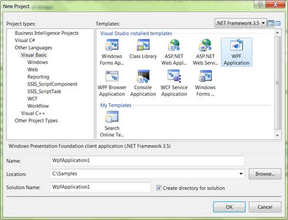
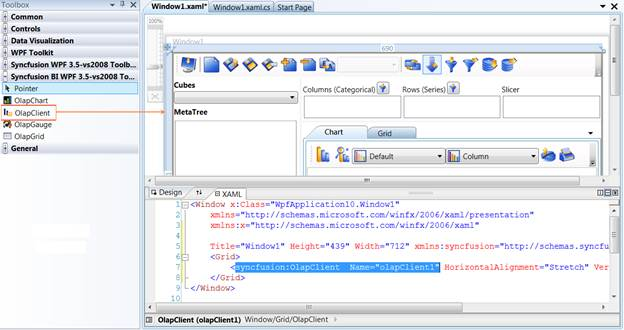

::: {style="DISPLAY: none"}
{#d2h_url_template} {#d2h_package_url style="WIDTH: 0px; DISPLAY: none; HEIGHT: 0px"}
:::

::::: {#nsbanner .d2h_main_nsbanner style="BORDER-BOTTOM: #999999 1px solid; POSITION: relative; PADDING-BOTTOM: 0px; BACKGROUND-COLOR: transparent; PADDING-LEFT: 0px; PADDING-RIGHT: 0px; DISPLAY: none; BORDER-TOP: #999999 1px solid; PADDING-TOP: 0px; LEFT: 0px"}
:::: {#TitleRow .d2h_main_titlerow style="PADDING-BOTTOM: 4px; BACKGROUND-COLOR: transparent; PADDING-LEFT: 22px; WIDTH: 100%; PADDING-RIGHT: 10px; DISPLAY: none; PADDING-TOP: 4px"}
::: {#ienav .d2h_main_ienav style="DISPLAY: none"}
{#D2HPrevious .D2HPreviousEnabled}  {#D2HNext .D2HNextEnabled}
:::
::::
:::::

:::: {#nstext .d2h_main_nstext style="PADDING-BOTTOM: 10px; BACKGROUND-COLOR: transparent; PADDING-LEFT: 22px; PADDING-RIGHT: 10px; HEIGHT: 100%; OVERFLOW: auto; PADDING-TOP: 5px" hasuserbackground="true" valign="bottom"}
::: {#d2h_breadcrumbs .d2h_breadcrumbs}
[Essential Studio User Guide Documentation](ms-xhelp:///?Id=12457748-09e3-4d74-a240-8e049cedf030){.d2h_breadcrumbsNormal} [ \> ]{.d2h_breadcrumbsLinkSeparator} [Business Intelligence Edition](ms-xhelp:///?Id=fdf33dd8-62b2-47b9-ad7b-fc50e590bca5){.d2h_breadcrumbsNormal} [ \> ]{.d2h_breadcrumbsLinkSeparator} [Essential BI WPF](ms-xhelp:///?Id=41e3d586-d922-4a01-8272-679fe4ae7343){.d2h_breadcrumbsNormal} [ \> ]{.d2h_breadcrumbsLinkSeparator} [Essential BI Client]{.d2h_breadcrumbsContentsOnly}
:::

# Getting Started {#getting-started style="tab-stops: 0pt"}

 

To create OLAP Client for WPF:

 

1.   Click **Start -\> All Programs -\> Microsoft Visual Studio 2008 or Microsoft Visual Studio 2010**

2.   Now navigate to **File -\> New Project**. The New Project dialog box appears.

[]{style="FONT-FAMILY: 'Calibri','sans-serif'"} 

{border="0"}

Figure 7: New Project Dialog window

 

3.   Select **WPF Application** in the **New Project** dialog box and click OK. A new WPF application gets created.

4.   In the new WPF application's tool box you can find the OLAP Client control under the tab named "Syncfusion BI WPF \<3.5-vs2008 or 4.0-vs2010\> Toolbox \<Essential studio version number\>". Drag and drop the OLAP Client control onto the window.

The following assemblies will be automatically referenced in your application.

[·      ]{style="FONT-FAMILY: Symbol"}Syncfusion.Chart.WPF

[·      ]{style="FONT-FAMILY: Symbol"}Syncfusion.Shared.WPF

[·      ]{style="FONT-FAMILY: Symbol"}Syncfusion.Olap.Base

[·      ]{style="FONT-FAMILY: Symbol"}Syncfusion.OlapChart.WPF

[·      ]{style="FONT-FAMILY: Symbol"}Syncfusion.OlapGrid.WPF

[·      ]{style="FONT-FAMILY: Symbol"}Syncfusion.OlapSampleUtils

[·      ]{style="FONT-FAMILY: Symbol"}Syncfusion.OlapTools.WPF

[·      ]{style="FONT-FAMILY: Symbol"}Syncfusion.Tools.WPF

[]{style="FONT-FAMILY: 'Calibri','sans-serif'; COLOR: black"} 

{border="0"}

Figure 8: Adding OLAP Client to an Application

 

+-------------------------------------------------------------------------------------------------------------------------------------------------------------------------------------------------------------------------------------------------------------------------------------------------------------------------------------------------------------------------------------------------------------------------------------------------------------------------------------------------------------------------------------------------------------------------------------------------------------------------------------------------------------------------------------------------------------+
| [\[XAML\]]{style="FONT-FAMILY: 'Courier New'"}                                                                                                                                                                                                                                                                                                                                                                                                                                                                                                                                                                                                                                                              |
|                                                                                                                                                                                                                                                                                                                                                                                                                                                                                                                                                                                                                                                                                                             |
| []{style="FONT-FAMILY: 'Courier New'"}                                                                                                                                                                                                                                                                                                                                                                                                                                                                                                                                                                                                                                                                      |
|                                                                                                                                                                                                                                                                                                                                                                                                                                                                                                                                                                                                                                                                                                             |
| [\<]{style="FONT-FAMILY: 'Courier New'; COLOR: blue"} [syncfusion]{style="FONT-FAMILY: 'Courier New'; COLOR: #a31515"} [:]{style="FONT-FAMILY: 'Courier New'; COLOR: blue"} [OlapClient]{style="FONT-FAMILY: 'Courier New'; COLOR: #a31515"} []{style="FONT-FAMILY: 'Courier New'; COLOR: black"} [Name]{style="FONT-FAMILY: 'Courier New'; COLOR: red"} [=\"olapClient1\"]{style="FONT-FAMILY: 'Courier New'; COLOR: blue"} [ HorizontalAlignment]{style="FONT-FAMILY: 'Courier New'; COLOR: red"} [=\"Stretch\"]{style="FONT-FAMILY: 'Courier New'; COLOR: blue"} [ VerticalAlignment]{style="FONT-FAMILY: 'Courier New'; COLOR: red"} [=\"Stretch\"/\>]{style="FONT-FAMILY: 'Courier New'; COLOR: blue"} |
|                                                                                                                                                                                                                                                                                                                                                                                                                                                                                                                                                                                                                                                                                                             |
| []{style="FONT-FAMILY: 'Courier New'"}                                                                                                                                                                                                                                                                                                                                                                                                                                                                                                                                                                                                                                                                      |
+-------------------------------------------------------------------------------------------------------------------------------------------------------------------------------------------------------------------------------------------------------------------------------------------------------------------------------------------------------------------------------------------------------------------------------------------------------------------------------------------------------------------------------------------------------------------------------------------------------------------------------------------------------------------------------------------------------------+

[]{style="FONT-FAMILY: 'Calibri','sans-serif'"} 

5.   The height, width and other properties of OLAP Client control are set through the property window or manually in the source code as well as in the code behind region. For example, the height and width property, set in the source code region is shown below:

**[]{style="FONT-FAMILY: 'Calibri','sans-serif'; COLOR: black"}**  

+----------------------------------------------------------------------------------------------------------------------------------------------------------------------------------------------------------------------------------------------------------------------------------------------------------------------------------------------------------------------------------------------------------------------------------------------------------------------------------------------------------------------------------------------------------------------------------------------------------------------------------------------------------------------------+
| [\[XAML\]]{style="FONT-FAMILY: 'Courier New'"}                                                                                                                                                                                                                                                                                                                                                                                                                                                                                                                                                                                                                             |
|                                                                                                                                                                                                                                                                                                                                                                                                                                                                                                                                                                                                                                                                            |
| []{style="FONT-FAMILY: 'Courier New'"}                                                                                                                                                                                                                                                                                                                                                                                                                                                                                                                                                                                                                                     |
|                                                                                                                                                                                                                                                                                                                                                                                                                                                                                                                                                                                                                                                                            |
| [\<]{style="FONT-FAMILY: 'Courier New'; COLOR: blue"} [syncfusion]{style="FONT-FAMILY: 'Courier New'; COLOR: #a31515"} [:]{style="FONT-FAMILY: 'Courier New'; COLOR: blue"} [OlapClient]{style="FONT-FAMILY: 'Courier New'; COLOR: #a31515"} []{style="FONT-FAMILY: 'Courier New'; COLOR: black"} [Name]{style="FONT-FAMILY: 'Courier New'; COLOR: red"} [=\"olapClient1\"]{style="FONT-FAMILY: 'Courier New'; COLOR: blue"} [ Height]{style="FONT-FAMILY: 'Courier New'; COLOR: red"} [=\"600\"]{style="FONT-FAMILY: 'Courier New'; COLOR: blue"} [ Width]{style="FONT-FAMILY: 'Courier New'; COLOR: red"} [=\"700\"/\>]{style="FONT-FAMILY: 'Courier New'; COLOR: blue"} |
|                                                                                                                                                                                                                                                                                                                                                                                                                                                                                                                                                                                                                                                                            |
| []{style="FONT-FAMILY: 'Courier New'"}                                                                                                                                                                                                                                                                                                                                                                                                                                                                                                                                                                                                                                     |
+----------------------------------------------------------------------------------------------------------------------------------------------------------------------------------------------------------------------------------------------------------------------------------------------------------------------------------------------------------------------------------------------------------------------------------------------------------------------------------------------------------------------------------------------------------------------------------------------------------------------------------------------------------------------------+

[]{style="FONT-FAMILY: 'Calibri','sans-serif'"} 

[]{style="FONT-FAMILY: 'Calibri','sans-serif'"} 

6.   Now navigate to the code-behind file. In order to bind the OLAP Client control with cube data, the *OlapDataManager* is instantiated first through any one of the methods in the page load event. The *OlapDataManager* containsthe connection details, current report, cube name, cube schema and pivotengine for rendering the client control. Then it is assigned to **OLAP  client datamanager**and databind is done.

[]{style="FONT-FAMILY: 'Trebuchet MS','sans-serif'; COLOR: #15428b; FONT-SIZE: 9pt"} 

Binding OLAP Client to the server

**[]{style="FONT-FAMILY: 'Calibri','sans-serif'"}**  

+-------------------------------------------------------------------------------------------------------------------------------------------------------------------------------------------------------------------------------------------------------------------------------------------------------------------------------------------------------------------------------------------------------------------------------------------------------------------------------------------------------------------------------------------------------------------+
| [\[C#\]]{style="FONT-FAMILY: 'Courier New'"}                                                                                                                                                                                                                                                                                                                                                                                                                                                                                                                      |
|                                                                                                                                                                                                                                                                                                                                                                                                                                                                                                                                                                   |
| []{style="FONT-FAMILY: 'Courier New'"}                                                                                                                                                                                                                                                                                                                                                                                                                                                                                                                            |
|                                                                                                                                                                                                                                                                                                                                                                                                                                                                                                                                                                   |
| [OlapDataManager]{style="FONT-FAMILY: 'Courier New'; COLOR: #2b91af"} [ olapDataManager = ]{style="FONT-FAMILY: 'Courier New'; COLOR: black"} [new]{style="FONT-FAMILY: 'Courier New'; COLOR: blue"} []{style="FONT-FAMILY: 'Courier New'; COLOR: black"} [OlapDataManager]{style="FONT-FAMILY: 'Courier New'; COLOR: #2b91af"} [(]{style="FONT-FAMILY: 'Courier New'; COLOR: black"} [\"Data  source=localhost; Initial Catalog=Adventure Works DW\"]{style="FONT-FAMILY: 'Courier New'; COLOR: #a31515"} [);]{style="FONT-FAMILY: 'Courier New'; COLOR: black"} |
|                                                                                                                                                                                                                                                                                                                                                                                                                                                                                                                                                                   |
| [this]{style="FONT-FAMILY: 'Courier New'; COLOR: blue"} [.olapClient1.OlapDataManager = olapDataManager;]{style="FONT-FAMILY: 'Courier New'; COLOR: black"} **[]{style="FONT-FAMILY: 'Courier New'"}**                                                                                                                                                                                                                                                                                                                                                            |
|                                                                                                                                                                                                                                                                                                                                                                                                                                                                                                                                                                   |
| [this]{style="FONT-FAMILY: 'Courier New'; COLOR: blue"} [.olapClient1.DataBind();]{style="FONT-FAMILY: 'Courier New'; COLOR: black"} **[]{style="FONT-FAMILY: 'Courier New'"}**                                                                                                                                                                                                                                                                                                                                                                                   |
|                                                                                                                                                                                                                                                                                                                                                                                                                                                                                                                                                                   |
| []{style="FONT-FAMILY: 'Courier New'"}                                                                                                                                                                                                                                                                                                                                                                                                                                                                                                                            |
+-------------------------------------------------------------------------------------------------------------------------------------------------------------------------------------------------------------------------------------------------------------------------------------------------------------------------------------------------------------------------------------------------------------------------------------------------------------------------------------------------------------------------------------------------------------------+

**[]{style="FONT-FAMILY: 'Calibri','sans-serif'; COLOR: black"}**  

+-------------------------------------------------------------------------------------------------------------------------------------------------------------------------------------------------------------------------------------------------------------------------------------------------------------------------------------------------------------------------------------------------------------------------------------------------------------------------------------------------------------------------------------------------------------------+
| [\[VB\]]{style="FONT-FAMILY: 'Courier New'"}                                                                                                                                                                                                                                                                                                                                                                                                                                                                                                                      |
|                                                                                                                                                                                                                                                                                                                                                                                                                                                                                                                                                                   |
| []{style="FONT-FAMILY: 'Courier New'; COLOR: blue"}                                                                                                                                                                                                                                                                                                                                                                                                                                                                                                               |
|                                                                                                                                                                                                                                                                                                                                                                                                                                                                                                                                                                   |
| [Dim]{style="FONT-FAMILY: 'Courier New'; COLOR: blue"} [ olapDataManager ]{style="FONT-FAMILY: 'Courier New'; COLOR: black"} [As]{style="FONT-FAMILY: 'Courier New'; COLOR: blue"} [ OlapDataManager = ]{style="FONT-FAMILY: 'Courier New'; COLOR: black"} [New]{style="FONT-FAMILY: 'Courier New'; COLOR: blue"} [ OlapDataManager(]{style="FONT-FAMILY: 'Courier New'; COLOR: black"} [\"Data source=localhost; Initial Catalog=Adventure Works DW\"]{style="FONT-FAMILY: 'Courier New'; COLOR: #a31515"} [)]{style="FONT-FAMILY: 'Courier New'; COLOR: black"} |
|                                                                                                                                                                                                                                                                                                                                                                                                                                                                                                                                                                   |
| [Me]{style="FONT-FAMILY: 'Courier New'; COLOR: blue"} [.olapClient1.OlapDataManager = olapDataManager]{style="FONT-FAMILY: 'Courier New'; COLOR: black"}                                                                                                                                                                                                                                                                                                                                                                                                          |
|                                                                                                                                                                                                                                                                                                                                                                                                                                                                                                                                                                   |
| [Me]{style="FONT-FAMILY: 'Courier New'; COLOR: blue"} [.olapClient1.DataBind()]{style="FONT-FAMILY: 'Courier New'; COLOR: black"} **[]{style="FONT-FAMILY: 'Courier New'; COLOR: black"}**                                                                                                                                                                                                                                                                                                                                                                        |
+-------------------------------------------------------------------------------------------------------------------------------------------------------------------------------------------------------------------------------------------------------------------------------------------------------------------------------------------------------------------------------------------------------------------------------------------------------------------------------------------------------------------------------------------------------------------+

 

Binding OLAP Client to Offline Cube

**[]{style="FONT-FAMILY: 'Calibri','sans-serif'"}**  

+--------------------------------------------------------------------------------------------------------------------------------------------------------------------------------------------------------------------------------------------------------------------------------------------------------------------------------------------------------------------------------------------------------------------------------------------------------------------------------------------------------------------------------------------------------+
| [\[C#\]]{style="FONT-FAMILY: 'Courier New'"}                                                                                                                                                                                                                                                                                                                                                                                                                                                                                                           |
|                                                                                                                                                                                                                                                                                                                                                                                                                                                                                                                                                        |
| []{style="FONT-FAMILY: 'Courier New'"}                                                                                                                                                                                                                                                                                                                                                                                                                                                                                                                 |
|                                                                                                                                                                                                                                                                                                                                                                                                                                                                                                                                                        |
| [OlapDataManager]{style="FONT-FAMILY: 'Courier New'; COLOR: #2b91af"} [ olapDataManager = ]{style="FONT-FAMILY: 'Courier New'; COLOR: black"} [new]{style="FONT-FAMILY: 'Courier New'; COLOR: blue"} []{style="FONT-FAMILY: 'Courier New'; COLOR: black"} [OlapDataManager]{style="FONT-FAMILY: 'Courier New'; COLOR: #2b91af"} [(]{style="FONT-FAMILY: 'Courier New'; COLOR: black"} [\"Datasource=AdventureWorks.cub; Provider=msolap;\"]{style="FONT-FAMILY: 'Courier New'; COLOR: #a31515"} [);]{style="FONT-FAMILY: 'Courier New'; COLOR: black"} |
|                                                                                                                                                                                                                                                                                                                                                                                                                                                                                                                                                        |
| [this]{style="FONT-FAMILY: 'Courier New'; COLOR: blue"} [.olapClient1.OlapDataManager = olapDataManager;]{style="FONT-FAMILY: 'Courier New'; COLOR: black"}                                                                                                                                                                                                                                                                                                                                                                                            |
|                                                                                                                                                                                                                                                                                                                                                                                                                                                                                                                                                        |
| [this]{style="FONT-FAMILY: 'Courier New'; COLOR: blue"} [.olapClient1.DataBind();]{style="FONT-FAMILY: 'Courier New'; COLOR: black"}                                                                                                                                                                                                                                                                                                                                                                                                                   |
|                                                                                                                                                                                                                                                                                                                                                                                                                                                                                                                                                        |
| []{style="FONT-FAMILY: 'Courier New'"}                                                                                                                                                                                                                                                                                                                                                                                                                                                                                                                 |
+--------------------------------------------------------------------------------------------------------------------------------------------------------------------------------------------------------------------------------------------------------------------------------------------------------------------------------------------------------------------------------------------------------------------------------------------------------------------------------------------------------------------------------------------------------+

**[]{style="FONT-FAMILY: 'Calibri','sans-serif'; COLOR: black"}**  

+---------------------------------------------------------------------------------------------------------------------------------------------------------------------------------------------------------------------------------------------------------------------------------------------------------------------------------------------------------------------------------------------------------------------------------------------------------------------------------------------------------------------------------------------------------+
| [\[VB\]]{style="FONT-FAMILY: 'Courier New'"}                                                                                                                                                                                                                                                                                                                                                                                                                                                                                                            |
|                                                                                                                                                                                                                                                                                                                                                                                                                                                                                                                                                         |
| []{style="FONT-FAMILY: 'Courier New'"}                                                                                                                                                                                                                                                                                                                                                                                                                                                                                                                  |
|                                                                                                                                                                                                                                                                                                                                                                                                                                                                                                                                                         |
| [Dim]{style="FONT-FAMILY: 'Courier New'; COLOR: blue"} [ olapDataManager ]{style="FONT-FAMILY: 'Courier New'; COLOR: black"} [As]{style="FONT-FAMILY: 'Courier New'; COLOR: blue"} [ OlapDataManager = ]{style="FONT-FAMILY: 'Courier New'; COLOR: black"} [New]{style="FONT-FAMILY: 'Courier New'; COLOR: blue"} [ OlapDataManager(]{style="FONT-FAMILY: 'Courier New'; COLOR: black"} [\"Datasource=AdventureWorks.cub; Provider=msolap;\"]{style="FONT-FAMILY: 'Courier New'; COLOR: #a31515"} [)]{style="FONT-FAMILY: 'Courier New'; COLOR: black"} |
|                                                                                                                                                                                                                                                                                                                                                                                                                                                                                                                                                         |
| [Me]{style="FONT-FAMILY: 'Courier New'; COLOR: blue"} [.olapClient1.OlapDataManager = olapDataManager]{style="FONT-FAMILY: 'Courier New'; COLOR: black"}                                                                                                                                                                                                                                                                                                                                                                                                |
|                                                                                                                                                                                                                                                                                                                                                                                                                                                                                                                                                         |
| [Me]{style="FONT-FAMILY: 'Courier New'; COLOR: blue"} [.olapClient1.DataBind()]{style="FONT-FAMILY: 'Courier New'; COLOR: black"}                                                                                                                                                                                                                                                                                                                                                                                                                       |
|                                                                                                                                                                                                                                                                                                                                                                                                                                                                                                                                                         |
| []{style="FONT-FAMILY: 'Courier New'"}                                                                                                                                                                                                                                                                                                                                                                                                                                                                                                                  |
+---------------------------------------------------------------------------------------------------------------------------------------------------------------------------------------------------------------------------------------------------------------------------------------------------------------------------------------------------------------------------------------------------------------------------------------------------------------------------------------------------------------------------------------------------------+

**[]{style="FONT-FAMILY: 'Calibri','sans-serif'"}**  

Binding OLAP Client to the server using Data Provider

**[]{style="FONT-FAMILY: 'Calibri','sans-serif'"}**  

+----------------------------------------------------------------------------------------------------------------------------------------------------------------------------------------------------------------------------------------------------------------------------------------------------------------------------------------------------------------------------------------------------------+
| [\[C#\]]{style="FONT-FAMILY: 'Courier New'"}                                                                                                                                                                                                                                                                                                                                                             |
|                                                                                                                                                                                                                                                                                                                                                                                                          |
| []{style="FONT-FAMILY: 'Courier New'"}                                                                                                                                                                                                                                                                                                                                                                   |
|                                                                                                                                                                                                                                                                                                                                                                                                          |
| [AdomdDataProvider]{style="FONT-FAMILY: 'Courier New'; COLOR: #2b91af"} [ dataProvider = ]{style="FONT-FAMILY: 'Courier New'; COLOR: black"} [new]{style="FONT-FAMILY: 'Courier New'; COLOR: blue"} []{style="FONT-FAMILY: 'Courier New'; COLOR: black"} [AdomdDataProvider]{style="FONT-FAMILY: 'Courier New'; COLOR: #2b91af"} [(connectionString);]{style="FONT-FAMILY: 'Courier New'; COLOR: black"} |
|                                                                                                                                                                                                                                                                                                                                                                                                          |
| [OlapDataManager]{style="FONT-FAMILY: 'Courier New'; COLOR: #2b91af"} [ olapDataManager = ]{style="FONT-FAMILY: 'Courier New'; COLOR: black"} [new]{style="FONT-FAMILY: 'Courier New'; COLOR: blue"} []{style="FONT-FAMILY: 'Courier New'; COLOR: black"} [OlapDataManager]{style="FONT-FAMILY: 'Courier New'; COLOR: #2b91af"} [(dataProvider);]{style="FONT-FAMILY: 'Courier New'; COLOR: black"}      |
|                                                                                                                                                                                                                                                                                                                                                                                                          |
| [this]{style="FONT-FAMILY: 'Courier New'; COLOR: blue"} [.olapClient1.OlapDataManager = olapDataManager;]{style="FONT-FAMILY: 'Courier New'; COLOR: black"}                                                                                                                                                                                                                                              |
|                                                                                                                                                                                                                                                                                                                                                                                                          |
| [ this]{style="FONT-FAMILY: 'Courier New'; COLOR: blue"} [.olapClient1.DataBind();]{style="FONT-FAMILY: 'Courier New'; COLOR: black"}                                                                                                                                                                                                                                                                    |
|                                                                                                                                                                                                                                                                                                                                                                                                          |
| []{style="FONT-FAMILY: 'Courier New'"}                                                                                                                                                                                                                                                                                                                                                                   |
+----------------------------------------------------------------------------------------------------------------------------------------------------------------------------------------------------------------------------------------------------------------------------------------------------------------------------------------------------------------------------------------------------------+

**[]{style="FONT-FAMILY: 'Calibri','sans-serif'; COLOR: black"}**  

+-----------------------------------------------------------------------------------------------------------------------------------------------------------------------------------------------------------------------------------------------------------------------------------------------------------------------------------------------------------------------------------------------------------+
| [\[VB\]]{style="FONT-FAMILY: 'Courier New'"}                                                                                                                                                                                                                                                                                                                                                              |
|                                                                                                                                                                                                                                                                                                                                                                                                           |
| []{style="FONT-FAMILY: 'Courier New'"}                                                                                                                                                                                                                                                                                                                                                                    |
|                                                                                                                                                                                                                                                                                                                                                                                                           |
| [Dim]{style="FONT-FAMILY: 'Courier New'; COLOR: blue"} [ dataProvider ]{style="FONT-FAMILY: 'Courier New'; COLOR: black"} [As]{style="FONT-FAMILY: 'Courier New'; COLOR: blue"} [ AdomdDataProvider = ]{style="FONT-FAMILY: 'Courier New'; COLOR: black"} [New]{style="FONT-FAMILY: 'Courier New'; COLOR: blue"} [ AdomdDataProvider(connectionString)]{style="FONT-FAMILY: 'Courier New'; COLOR: black"} |
|                                                                                                                                                                                                                                                                                                                                                                                                           |
| [Dim]{style="FONT-FAMILY: 'Courier New'; COLOR: blue"} [ olapDataManager ]{style="FONT-FAMILY: 'Courier New'; COLOR: black"} [As]{style="FONT-FAMILY: 'Courier New'; COLOR: blue"} [ OlapDataManager = ]{style="FONT-FAMILY: 'Courier New'; COLOR: black"} [New]{style="FONT-FAMILY: 'Courier New'; COLOR: blue"} [ OlapDataManager(dataProvider)]{style="FONT-FAMILY: 'Courier New'; COLOR: black"}      |
|                                                                                                                                                                                                                                                                                                                                                                                                           |
| [Me]{style="FONT-FAMILY: 'Courier New'; COLOR: blue"} [.olapClient1.OlapDataManager = olapDataManager]{style="FONT-FAMILY: 'Courier New'; COLOR: black"}                                                                                                                                                                                                                                                  |
|                                                                                                                                                                                                                                                                                                                                                                                                           |
| [ Me]{style="FONT-FAMILY: 'Courier New'; COLOR: blue"} [.olapClient1.DataBind()]{style="FONT-FAMILY: 'Courier New'; COLOR: black"}                                                                                                                                                                                                                                                                        |
|                                                                                                                                                                                                                                                                                                                                                                                                           |
| []{style="FONT-FAMILY: 'Courier New'"}                                                                                                                                                                                                                                                                                                                                                                    |
+-----------------------------------------------------------------------------------------------------------------------------------------------------------------------------------------------------------------------------------------------------------------------------------------------------------------------------------------------------------------------------------------------------------+

**[]{style="FONT-FAMILY: 'Calibri','sans-serif'"}**  

**[ {border="0"} ]{style="FONT-FAMILY: 'Calibri','sans-serif'; FONT-SIZE: 12pt"}** [ ]{style="FONT-FAMILY: 'Calibri','sans-serif'; COLOR: black"} **Tip**: Users can also connect a Server or Offline cube through the connection option dialog window.

More:

[ ]{#related-topics}

[{border="0" align="absMiddle"}Connection Option](ms-xhelp:///?Id=1c15afa7-8953-4462-878b-324a0a416a00){style="TEXT-DECORATION: none"}

[{border="0" align="absMiddle"}Elaborate Structure of the Client WPF](ms-xhelp:///?Id=cfe35a1f-ed68-4214-832d-74cecb046784){style="TEXT-DECORATION: none"}

[{border="0" align="absMiddle"}OLAP Client WPF Elements](ms-xhelp:///?Id=3a1e8d38-9b4a-4c83-89c0-4214cc149c24){style="TEXT-DECORATION: none"}
::::
