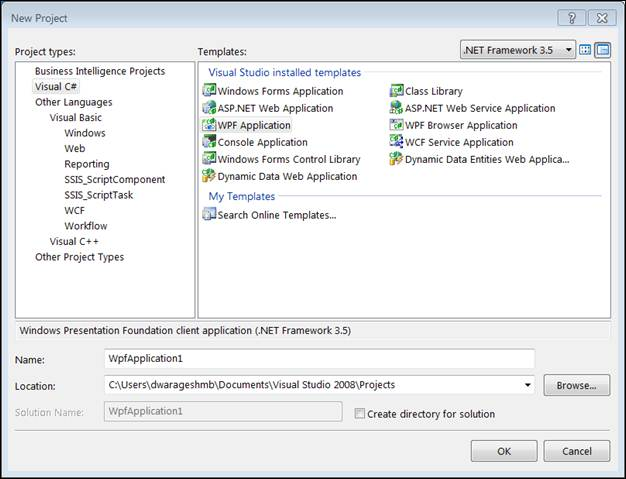
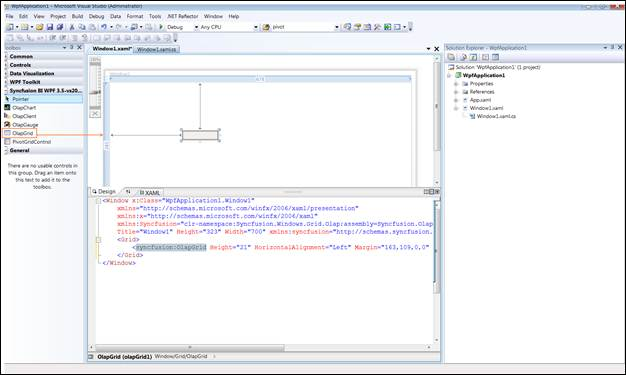
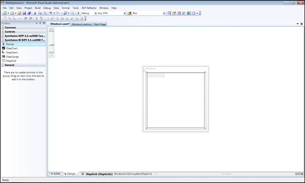
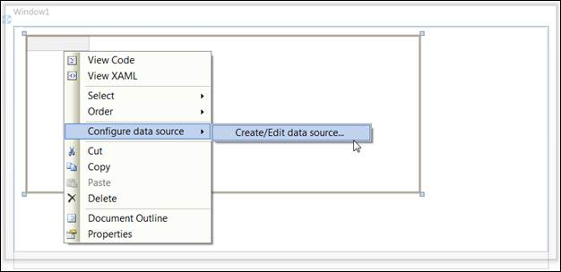
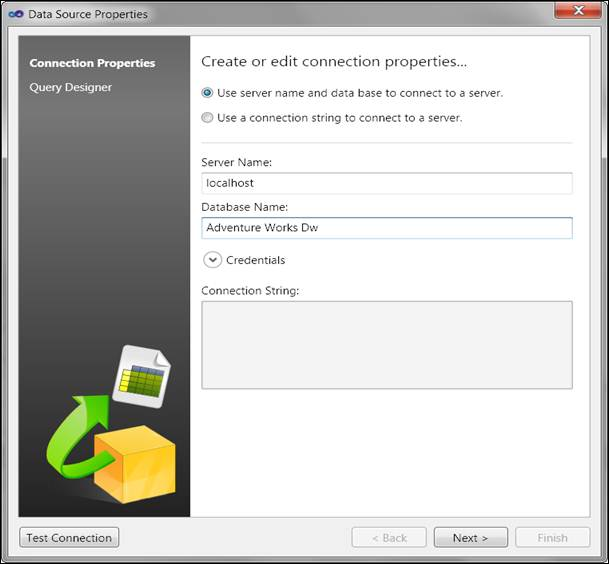
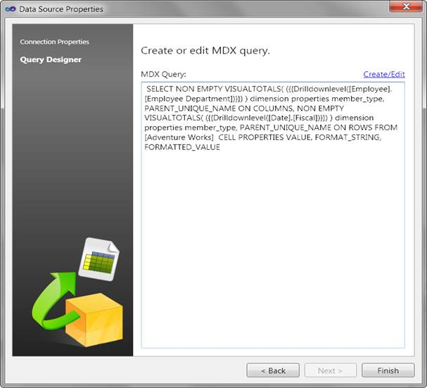
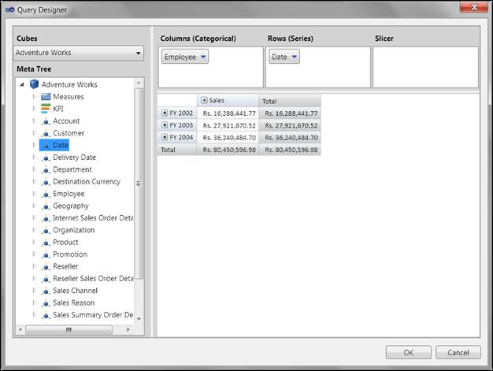
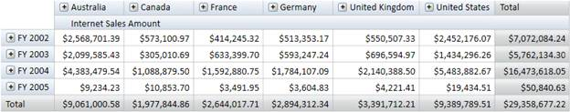

::: {style="DISPLAY: none"}
{#d2h_url_template} {#d2h_package_url style="WIDTH: 0px; DISPLAY: none; HEIGHT: 0px"}
:::

::::: {#nsbanner .d2h_main_nsbanner style="BORDER-BOTTOM: #999999 1px solid; POSITION: relative; PADDING-BOTTOM: 0px; BACKGROUND-COLOR: transparent; PADDING-LEFT: 0px; PADDING-RIGHT: 0px; DISPLAY: none; BORDER-TOP: #999999 1px solid; PADDING-TOP: 0px; LEFT: 0px"}
:::: {#TitleRow .d2h_main_titlerow style="PADDING-BOTTOM: 4px; BACKGROUND-COLOR: transparent; PADDING-LEFT: 22px; WIDTH: 100%; PADDING-RIGHT: 10px; DISPLAY: none; PADDING-TOP: 4px"}
::: {#ienav .d2h_main_ienav style="DISPLAY: none"}
{#D2HPrevious .D2HPreviousEnabled}  {#D2HNext .D2HNextEnabled}
:::
::::
:::::

:::: {#nstext .d2h_main_nstext style="PADDING-BOTTOM: 10px; BACKGROUND-COLOR: transparent; PADDING-LEFT: 22px; PADDING-RIGHT: 10px; HEIGHT: 100%; OVERFLOW: auto; PADDING-TOP: 5px" hasuserbackground="true" valign="bottom"}
::: {#d2h_breadcrumbs .d2h_breadcrumbs}
[Essential Studio User Guide Documentation](ms-xhelp:///?Id=12457748-09e3-4d74-a240-8e049cedf030){.d2h_breadcrumbsNormal} [ \> ]{.d2h_breadcrumbsLinkSeparator} [Business Intelligence Edition](ms-xhelp:///?Id=fdf33dd8-62b2-47b9-ad7b-fc50e590bca5){.d2h_breadcrumbsNormal} [ \> ]{.d2h_breadcrumbsLinkSeparator} [Essential BI WPF](ms-xhelp:///?Id=41e3d586-d922-4a01-8272-679fe4ae7343){.d2h_breadcrumbsNormal} [ \> ]{.d2h_breadcrumbsLinkSeparator} [Essential BI Grid]{.d2h_breadcrumbsContentsOnly}
:::

# Getting Started {#getting-started style="tab-stops: 0pt"}

To get started:

1.   Click the **Start** menu, and then click Microsoft Visual Studio 2008.

2.   On the **File** menu, click **New Project**. The **New Project** dialog box appears as follows.

 

{border="0"}

Figure 4: New Project Dialog Box

[]{style="FONT-SIZE: 11pt"} 

3.   Select **WPF Application** and click **OK**.

4.   Drag the **OlapGrid** control from the **Syncfusion BI WPF Toolbox** onto the **Design** page.

 

{border="0"}

Figure 5: OlapGrid in XAML page

[]{style="FONT-SIZE: 11pt"} 

{border="0"}

Figure 6: OlapGrid Appearance in Design page

5.   Add the following namespace in the code-behind part:

 

[·      ]{style="FONT-FAMILY: Symbol"}Syncfusion.Windows.Grid.Olap

[·      ]{style="FONT-FAMILY: Symbol"}Syncfusion.Olap.Manager

[·      ]{style="FONT-FAMILY: Symbol"}Syncfusion.Olap.Reports

[·      ]{style="FONT-FAMILY: Symbol"}Syncfusion.Olap.Engine

 

6.   Data Binding to OlapGrid:

 

**OlapGrid** requires **OlapDataManager** in order to fetch data from OLAP Server. The OlapDataManager should be either instantiated with Connection String or AdomdDataProvider so as to establish connection with the server.

 

For creating reports we have a report object called OlapReport. OlapReport contains **Categorical Items**, **Series Items**, **Slicer Items** and **Filter Items**. It is associated with OlapDataManager as the current report property. Whenever a report is set to the current report then an event is triggered and the control renders based on the current report that is set.

 

Designer Data Binding:

**OlapGrid** can be bound to OLAP Data in Designer also. With the help of designer, data binding becomes easier as it does not require a single line code from the user. Perform the following steps to bind the grid in designer:

 

a)  Right-click the **OlapGrid** control in **Design** page, choose **Create/Edit** datasource from **Configure data source** menu.

[]{style="FONT-SIZE: 11pt"} 

{border="0"}

Figure 7: OlapGrid Configure data source

[]{style="FONT-SIZE: 11pt"} 

b)  This will open a data source editor wizard. ****

c)  From the data source wizard; select the connection type: ****

*i.  * If you want to connect to an Offline cube, select ***Use an offline cube***. Browse and select an offline cube.****

*ii. * If you want to connect to SSAS, select ***Use connection string to connect to a server.*** Specify the necessary information to connect to the server.****

{border="0"}

Figure 8: Data source properties window

 

d)  Click ***Next*** to proceed. It will display the ***Query Designer*** window.****

e)  The ***Query Designer*** displays the MDX query, if it had been created before. ****

{border="0"}

[Figure ]{style="FONT-FAMILY: 'Trebuchet MS','sans-serif'"} [9]{style="FONT-FAMILY: 'Trebuchet MS','sans-serif'"} [: Query Designer with MDX query]{style="FONT-FAMILY: 'Trebuchet MS','sans-serif'"}

[]{style="FONT-FAMILY: 'Trebuchet MS','sans-serif'; COLOR: black; FONT-SIZE: 11pt"} 

f)  Click the ***Create/Edit*** link on the top right side of the query text box for modifying/designing a query. ****

It will launch the GUI based query generator window with Drag and drop dimensions, measures and KPIs as required. It will show the instant update of the query result.****

{border="0"}

Figure 10:  GUI based Query designer (Query editor)

***[]{style="FONT-SIZE: 11pt"}***  

g)  Click ***Ok*** to accept the changes made to the query and ***Cancel*** to revert the changes made to the query.****

h)  Click ***Finish*** to commit the changes.****

i)   Run the application.

 

-Or-

 

Code behind Data Binding:

 

+---------------------------------------------------------------------------------------------------------------------------------------------------------------+
| \[C#\]                                                                                                                                                        |
|                                                                                                                                                               |
|                                                                                                                                                               |
|                                                                                                                                                               |
| [protected]{style="COLOR: blue"} [void]{style="COLOR: blue"} Window_Loaded([object]{style="COLOR: blue"} sender, [RoutedEventArgs]{style="COLOR: #2b91af"} e) |
|                                                                                                                                                               |
| {                                                                                                                                                             |
|                                                                                                                                                               |
|         [// Specifying the connection string]{style="COLOR: green"}                                                                                           |
|                                                                                                                                                               |
|         [string]{style="COLOR: blue"} connectionString = [\"DataSource = localhost;Initial Catalog=Adventure Works DW\"]{style="COLOR: #a31515"};             |
|                                                                                                                                                               |
|         [// Instantiating the OlapDataManager with connection string]{style="COLOR: green"}                                                                   |
|                                                                                                                                                               |
|         [OlapDataManager]{style="COLOR: #2b91af"} olapDataManager = [new]{style="COLOR: blue"}[OlapDataManager]{style="COLOR: #2b91af"}(connectionString);    |
|                                                                                                                                                               |
|         [// Set current report to OlapDataManager   ]{style="COLOR: green"}                                                                                   |
|                                                                                                                                                               |
|         olapDataManager.SetCurrentReport(CreateOlapReport());                                                                                                 |
|                                                                                                                                                               |
|         [// Specifying the DataSource for OlapGrid]{style="COLOR: green"}                                                                                     |
|                                                                                                                                                               |
|         [this]{style="COLOR: blue"}.OlapGrid1.OlapDataManager = olapDataManager;                                                                              |
|                                                                                                                                                               |
|         [// DataBinding]{style="COLOR: green"}                                                                                                                |
|                                                                                                                                                               |
|         [this]{style="COLOR: blue"}.OlapGrid1.DataBind();                                                                                                     |
|                                                                                                                                                               |
| }                                                                                                                                                             |
|                                                                                                                                                               |
|                                                                                                                                                               |
+---------------------------------------------------------------------------------------------------------------------------------------------------------------+

[]{style="FONT-SIZE: 11pt"} 

+-------------------------------------------------------------------------------------------------------------------------------------------------------------------------------------------------------------------------------------------------+
| \[VB\]                                                                                                                                                                                                                                          |
|                                                                                                                                                                                                                                                 |
|                                                                                                                                                                                                                                                 |
|                                                                                                                                                                                                                                                 |
| [Protected]{style="COLOR: blue"} [Sub]{style="COLOR: blue"} Window_Loaded([ByVal]{style="COLOR: blue"} sender [As]{style="COLOR: blue"}[Object]{style="COLOR: blue"}, [ByVal]{style="COLOR: blue"} e [As]{style="COLOR: blue"} RoutedEventArgs) |
|                                                                                                                                                                                                                                                 |
|                    [\' Specifying the connection string]{style="COLOR: green"}                                                                                                                                                                  |
|                                                                                                                                                                                                                                                 |
|                    [Dim]{style="COLOR: blue"} connectionString [As]{style="COLOR: blue"}[String]{style="COLOR: blue"} = [\"DataSource = localhost;Initial Catalog=Adventure Works DW\"]{style="COLOR: #a31515"}                                 |
|                                                                                                                                                                                                                                                 |
|                    [\' Instantiating the OlapDataManager with connection string]{style="COLOR: green"}                                                                                                                                          |
|                                                                                                                                                                                                                                                 |
|                    [Dim]{style="COLOR: blue"} olapDataManager [As]{style="COLOR: blue"} OlapDataManager = [New]{style="COLOR: blue"} OlapDataManager(connectionString)                                                                          |
|                                                                                                                                                                                                                                                 |
|                     [\' Set current report to OlapDataManager   ]{style="COLOR: green"}                                                                                                                                                         |
|                                                                                                                                                                                                                                                 |
|                    olapDataManager.SetCurrentReport(CreateOlapReport())                                                                                                                                                                         |
|                                                                                                                                                                                                                                                 |
|                    [\' Specifying the DataSource for OlapGrid]{style="COLOR: green"}                                                                                                                                                            |
|                                                                                                                                                                                                                                                 |
|                    [Me]{style="COLOR: blue"}.OlapGrid1.OlapDataManager = olapDataManager                                                                                                                                                        |
|                                                                                                                                                                                                                                                 |
|                    [\' DataBinding]{style="COLOR: green"}                                                                                                                                                                                       |
|                                                                                                                                                                                                                                                 |
|                    [Me]{style="COLOR: blue"}.OlapGrid1.DataBind()                                                                                                                                                                               |
|                                                                                                                                                                                                                                                 |
|  [End]{style="COLOR: blue"}[Sub]{style="COLOR: blue"}                                                                                                                                                                                           |
|                                                                                                                                                                                                                                                 |
|                                                                                                                                                                                                                                                 |
+-------------------------------------------------------------------------------------------------------------------------------------------------------------------------------------------------------------------------------------------------+

[]{style="FONT-SIZE: 11pt"} 

[Click here for Sample Report]{.UGHyperlink} []{.UGHyperlink}

[]{style="FONT-SIZE: 11pt"} 

{border="0"}

 

Figure 11: OlapGrid control with OLAP Data

[]{#related-topics}
::::
