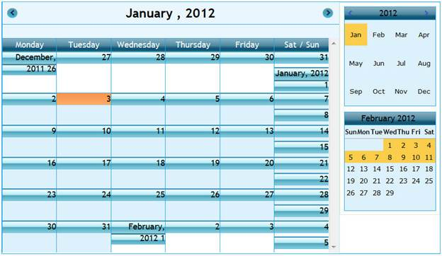
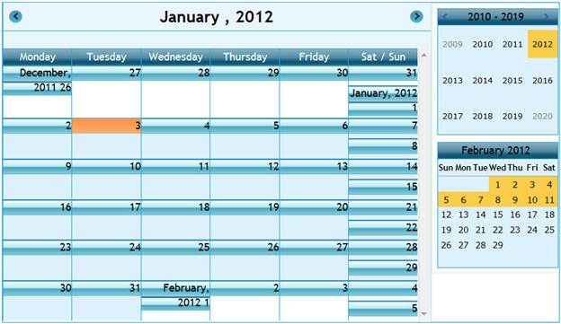
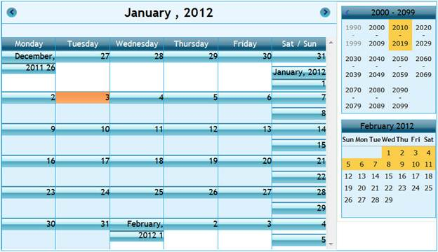

::: {style="DISPLAY: none"}
{#d2h_url_template}{#d2h_package_url style="WIDTH: 0px; DISPLAY: none; HEIGHT: 0px"}
:::

::: {.d2h_secondary_topic style="PADDING-BOTTOM: 10pt; MARGIN: 0pt; PADDING-LEFT: 0pt; PADDING-RIGHT: 0pt; PADDING-TOP: 0pt"}
##### Getting Started {#getting-started style="tab-stops: 0pt"}

Feature Summary

Calendar zooming navigation property allows navigating the months and years in a quick manner. If we are currently using the month view in the calendar, the schedule will also be in month view so we are able to see all the appointments for the particular month.  

The following figure gives you an overview of calendar zooming navigation in Essential Schedule.

{border="0"}

Figure 33: Schedule with Calendar Zooming in Month View**[]{style="FONT-STYLE: normal"}**

 

{border="0"}

Figure 34: Schedule with Calendar Zooming in Year View**[]{style="FONT-STYLE: normal"}**

 

{border="0"}

Figure 35: Schedule with Calendar Zooming in 10-Year View**[]{style="FONT-STYLE: normal"}**

 

 

Sample Installation Location

Installed drive (C:)\\Program Files\\Syncfusion\\Essential Studio\\9.4.0.62\\Samples 

 

Viewing Samples

To view the samples:

1.  [Open the **Syncfusion Dashboard**.]{style="FONT-FAMILY: 'Arial','sans-serif'"}

2.  [Click the **ASP.NET** drop-down list and select **Run Locally Installed Samples**.]{style="FONT-FAMILY: 'Arial','sans-serif'"}

3.  [Navigate to **Advanced Features** \> **Calendar Zooming**.]{style="FONT-FAMILY: 'Arial','sans-serif'"}

 

[]{#related-topics}
:::
