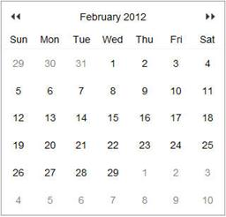
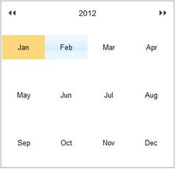
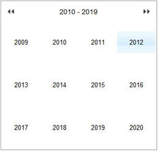
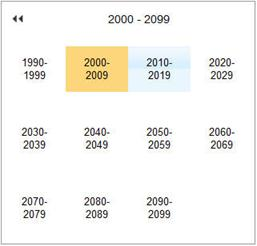

::: {style="DISPLAY: none"}
{#d2h_url_template}{#d2h_package_url style="WIDTH: 0px; DISPLAY: none; HEIGHT: 0px"}
:::

::: {.d2h_secondary_topic style="PADDING-BOTTOM: 10pt; MARGIN: 0pt; PADDING-LEFT: 0pt; PADDING-RIGHT: 0pt; PADDING-TOP: 0pt"}
##### Getting Started {#getting-started style="tab-stops: 0pt"}

Feature Summary

Calendar Navigation Mode property allows navigating the months and years in quick manner. In that we have two client side events and two server side events for Zoom in and Zoom Out.

The following figure gives you an overview of zooming navigation in Calendar:

 

\
{border="0"}  {border="0"}

Day View                                  Month View

 

{border="0"}  {border="0"}

Year View                                      10 Years View

 

Figure 126: Calendar Zooming with Day, Month, Year, and 10-Year Views

Where do I find Installed samples?

Sample Installation Location

Installed drive (C:) \\Program Files\\Syncfusion\\Essential Studio\\9.4.0.62\\Samples 

Viewing Samples

 To view the samples:

1.  [Open the **Syncfusion Dashboard**.]{style="FONT-FAMILY: 'Arial','sans-serif'"}

2.  [Click the **ASP.NET** drop-down list and select **Run Locally Installed Samples**.]{style="FONT-FAMILY: 'Arial','sans-serif'"}

3.  [Navigate to **Calendar** \> **Calendar Zooming**.]{style="FONT-FAMILY: 'Arial','sans-serif'"}

 

[]{#related-topics}
:::
