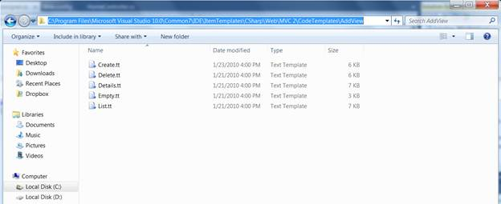

::: {style="DISPLAY: none"}
{#d2h_url_template}{#d2h_package_url style="WIDTH: 0px; DISPLAY: none; HEIGHT: 0px"}
:::

:::: {.d2h_secondary_topic style="PADDING-BOTTOM: 10pt; MARGIN: 0pt; PADDING-LEFT: 0pt; PADDING-RIGHT: 0pt; PADDING-TOP: 0pt"}
#### Global Reference {#global-reference style="tab-stops: 0pt"}

 

These templates can be placed to the following location;

 

** \[Visual Studio Install Directory\]\\Common7\\IDE\\ItemTemplates\\\[CSharp \| VisualBasic\]\\Web\\MVC2\\CodeTemplates\\**

::: {style="BORDER-BOTTOM: windowtext 1pt solid; BORDER-LEFT: medium none; PADDING-BOTTOM: 1pt; MARGIN-TOP: 9pt; PADDING-LEFT: 0pt; PADDING-RIGHT: 0pt; MARGIN-BOTTOM: 9pt; BORDER-TOP: windowtext 1pt solid; BORDER-RIGHT: medium none; PADDING-TOP: 1pt"}
 

{border="0"} Note: If we place the templates here, templates are visible in any MVC Application.

 
:::

{border="0"}

Figure 17: Common Location to paste the Custom Syncfusion T4 Templates

[]{#related-topics}
::::
