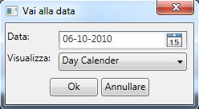

::: {style="DISPLAY: none"}
{#d2h_url_template}{#d2h_package_url style="WIDTH: 0px; DISPLAY: none; HEIGHT: 0px"}
:::

:::: {.d2h_secondary_topic style="PADDING-BOTTOM: 10pt; MARGIN: 0pt; PADDING-LEFT: 0pt; PADDING-RIGHT: 0pt; PADDING-TOP: 0pt"}
##### "Go to Date" Window {#go-to-date-window style="tab-stops: 0pt"}

 

Table 10: Go to Date

::: {align="center"}
  ------------------------ ------------
  Names in Resource File   Values
  GoToDateWindowHeader     Go to Date
  GoToDateWindowDate       Date
  GoToDateWindowShowIn     Show In
  ------------------------ ------------
:::

 

 

{border="0"}

Figure 36: Go to Date

 

[]{#related-topics}
::::
