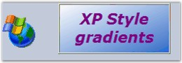

::: {style="DISPLAY: none"}
{#d2h_url_template}{#d2h_package_url style="WIDTH: 0px; DISPLAY: none; HEIGHT: 0px"}
:::

:::: {.d2h_secondary_topic style="PADDING-BOTTOM: 10pt; MARGIN: 0pt; PADDING-LEFT: 0pt; PADDING-RIGHT: 0pt; PADDING-TOP: 0pt"}
#### GradientLabel {#gradientlabel style="tab-stops: 0pt"}

[]{style="COLOR: #15428b"} 

The **GradientLabel** class provides a way to create fancy and appealing labels in your forms.

 

The GradientLabel class is fully compatible with the Windows Forms label that it derives from and gets most of its uniqueness from the **BrushInfo** class that is used for the **GradientLabel.BackgroundColor** property.

 

The **GradientLabel.Border3DStyle** is another property that can specify the look and feel of the GradientLabel.

[]{style="COLOR: #15428b"} 

{border="0"}

[]{style="COLOR: #15428b"} 

Figure 600: GradientLabel Control

[]{style="COLOR: #15428b"} 

The .NET framework provides a label control typically used to provide descriptive text for a control. The Essential Tools\' GradientLabel control provides an easy way to display labels with attractive shades and backgrounds.

[]{style="COLOR: #15428b"} 

::: {style="BORDER-BOTTOM: windowtext 1pt solid; BORDER-LEFT: medium none; PADDING-BOTTOM: 1pt; MARGIN-TOP: 9pt; PADDING-LEFT: 0pt; PADDING-RIGHT: 0pt; MARGIN-BOTTOM: 9pt; BORDER-TOP: windowtext 1pt solid; BORDER-RIGHT: medium none; PADDING-TOP: 1pt"}
{border="0"} Note: All the other functions of the GradientLabel is the same as the System.Windows.Forms.Label control in the Windows Forms library.
:::

[]{style="COLOR: #15428b"} 

See Also

[]{style="COLOR: #15428b"} 

More:

[ ]{#related-topics}

[{border="0" align="absMiddle"}Features](ms-xhelp:///?Id=c9518522-10e5-4691-949f-2dd1712189de){style="TEXT-DECORATION: none"}

[{border="0" align="absMiddle"}Creating GradientLabel](ms-xhelp:///?Id=2e2ad679-44e9-4254-8a48-9f478729e07f){style="TEXT-DECORATION: none"}

[{border="0" align="absMiddle"}Concepts and Features](ms-xhelp:///?Id=3f632ba1-f7fa-488b-9364-471d145d072b){style="TEXT-DECORATION: none"}
::::
