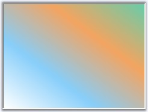

::: {style="DISPLAY: none"}
{#d2h_url_template}{#d2h_package_url style="WIDTH: 0px; DISPLAY: none; HEIGHT: 0px"}
:::

::: {.d2h_secondary_topic style="PADDING-BOTTOM: 10pt; MARGIN: 0pt; PADDING-LEFT: 0pt; PADDING-RIGHT: 0pt; PADDING-TOP: 0pt"}
#### GradientPanel {#gradientpanel style="tab-stops: 0pt"}

[]{#p452}[]{style="COLOR: #15428b"} 

GradientPanel is a panel-derived control that acts as a container for other controls. It is used to group a collection of controls and it has the ability to have a custom background gradient using an array of colors.

[]{style="COLOR: #15428b"} 

{border="0"}

[]{style="COLOR: #15428b"} 

Figure 387: GradientPanel Control

More:

[ ]{#related-topics}

[{border="0" align="absMiddle"}Features Overview](ms-xhelp:///?Id=726fd078-827c-4c63-a9a6-ea2a5da83c3d){style="TEXT-DECORATION: none"}

[{border="0" align="absMiddle"}Creating GradientPanel](ms-xhelp:///?Id=e5d421b5-66df-40fa-852d-81ae057f8b6a){style="TEXT-DECORATION: none"}

[{border="0" align="absMiddle"}Through Designer](ms-xhelp:///?Id=2e104351-b52e-4b52-a1ff-3fd1218ba2d6){style="TEXT-DECORATION: none"}

[{border="0" align="absMiddle"}Concepts and Features](ms-xhelp:///?Id=5ef17e60-f490-47a3-934a-bd8e9b99e646){style="TEXT-DECORATION: none"}
:::
