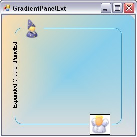

::: {style="DISPLAY: none"}
{#d2h_url_template}{#d2h_package_url style="WIDTH: 0px; DISPLAY: none; HEIGHT: 0px"}
:::

::: {.d2h_secondary_topic style="PADDING-BOTTOM: 10pt; MARGIN: 0pt; PADDING-LEFT: 0pt; PADDING-RIGHT: 0pt; PADDING-TOP: 0pt"}
#### GradientPanelExt {#gradientpanelext style="tab-stops: 0pt"}

[]{style="COLOR: #15428b"} 

The GradientPanelExt is an enhanced version of the GradientPanel control. The GradientPanelExt borders can be rounded to any extent as needed. The control also supports hosting of primitives, in any of the panel borders. These primitives cover a wide range from text to any .NET control. The gradient colors applied to the GradientPanelExt apply to the primitives as well. These are no limitations on the number of these primitives.

[]{style="FONT-SIZE: 8pt"} 

 {border="0"}

Figure 397: GradientPanelExt  with Primitives

**[]{style="COLOR: #15428b"}** 

See also

[]{style="COLOR: #15428b"} 

More:

[ ]{#related-topics}

[{border="0" align="absMiddle"}Features Overview](ms-xhelp:///?Id=67095a43-ceeb-447b-8147-fff2f87eba3b){style="TEXT-DECORATION: none"}

[{border="0" align="absMiddle"}Creating GradientPanelExt](ms-xhelp:///?Id=23f525c2-c710-4238-9058-260cbffb88e7){style="TEXT-DECORATION: none"}

[{border="0" align="absMiddle"}Concepts and Features](ms-xhelp:///?Id=e3da9f3b-8c11-4b44-9135-22d2f65aee6b){style="TEXT-DECORATION: none"}

[{border="0" align="absMiddle"}GradientPanelExt Events](ms-xhelp:///?Id=df5cd3bf-6913-4cd3-a409-b6f8ffa9d3fb){style="TEXT-DECORATION: none"}
:::
