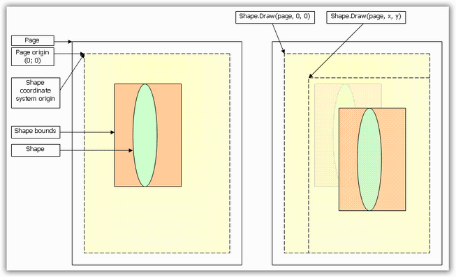

::: {style="DISPLAY: none"}
{#d2h_url_template}{#d2h_package_url style="WIDTH: 0px; DISPLAY: none; HEIGHT: 0px"}
:::

::: {.d2h_secondary_topic style="PADDING-BOTTOM: 10pt; MARGIN: 0pt; PADDING-LEFT: 0pt; PADDING-RIGHT: 0pt; PADDING-TOP: 0pt"}
##### Graphic Elements {#graphic-elements style="tab-stops: 0pt"}

[]{style="FONT-FAMILY: 'Trebuchet MS','sans-serif'; COLOR: #15428b; FONT-SIZE: 9pt"} 

These include the basic functionality of drawing elements on the canvas (PdfGraphics). As a result, you can draw such objects on pages or any other object that has graphics context (PdfTemplate etc). Graphics elements are simple and does not span several pages.

 

Layout

 

**PdfLayoutElement** class provides an ability to draw contents on several pages. This functionality is described in the [[Pagination]{.UGHyperlink}](ms-xhelp:///?Id=916beb29-6918-444b-850f-bc07109db4a3) section.

[]{style="FONT-FAMILY: 'Trebuchet MS','sans-serif'; COLOR: #15428b; FONT-SIZE: 9pt"} 

Shapes

[]{style="FONT-FAMILY: 'Trebuchet MS','sans-serif'; COLOR: #15428b; FONT-SIZE: 9pt"} 

**PdfShapeElement** class provides the basic functionality of simple graphics primitives (like lines, rectangles, etc.). It is derived from LayoutElement, which enables every shape to span several pages. The basic graphics primitives are as follows:

[]{style="FONT-FAMILY: 'Trebuchet MS','sans-serif'; COLOR: #15428b; FONT-SIZE: 9pt"} 

[·      ]{style="FONT-FAMILY: Symbol"}Line

[·      ]{style="FONT-FAMILY: Symbol"}Rectangle

[·      ]{style="FONT-FAMILY: Symbol"}Polygon

[·      ]{style="FONT-FAMILY: Symbol"}Arc

[·      ]{style="FONT-FAMILY: Symbol"}Bezier Curve

[·      ]{style="FONT-FAMILY: Symbol"}Ellipse

[·      ]{style="FONT-FAMILY: Symbol"}Path

[·      ]{style="FONT-FAMILY: Symbol"}PdfTemplate

[·      ]{style="FONT-FAMILY: Symbol"}Pie

[·      ]{style="FONT-FAMILY: Symbol"}Image

[]{style="FONT-FAMILY: 'Trebuchet MS','sans-serif'; COLOR: #15428b; FONT-SIZE: 9pt"} 

Each shape can be drawn by its own **Draw** method or by using an appropriate method of the **PdfGraphics** class (like DrawLine, DrawRectangle, etc.). Each shape has its own coordinate system (which is equal to a page coordinate system). Coordinates of the shape are set in that coordinate system. When the shape is going to be drawn by using its **Draw** method, its coordinate system is translated by the coordinates set to the Draw method. So, whenever the shape is going to be drawn, take its own coordinate system into consideration.

 

The following screen shot illustrates the shape drawing behavior.

 

{border="0"}

Figure 26: Shape drawing behavior

 

[]{#related-topics}
:::
