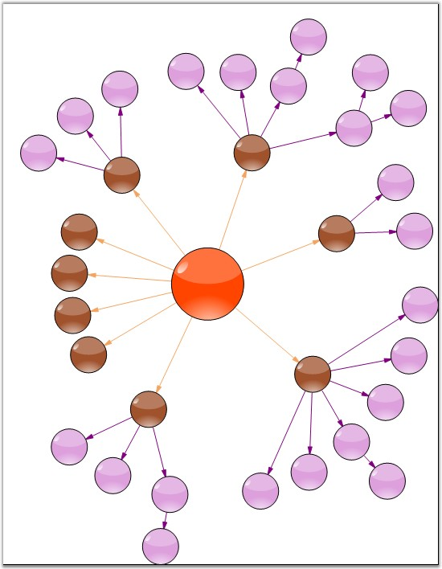

::: {style="DISPLAY: none"}
{#d2h_url_template}{#d2h_package_url style="WIDTH: 0px; DISPLAY: none; HEIGHT: 0px"}
:::

:::: {.d2h_secondary_topic style="PADDING-BOTTOM: 10pt; MARGIN: 0pt; PADDING-LEFT: 0pt; PADDING-RIGHT: 0pt; PADDING-TOP: 0pt"}
#### Graph Layout {#graph-layout style="tab-stops: 0pt"}

 

The **GraphLayoutManager** is an abstract base class that can be used for implementing layout managers for diagrams composed primarily of nodes forming connected graphs. The GraphLayoutManager implements the infrastructure for initializing, validating and creating the diagram graph by enumerating the diagram model\'s child nodes. It also enables positioning diagram nodes using the layout strategies provided by specialized directed tree layout managers that derive from it.

 

The event of the Graph Layout Manager class is:

[]{style="FONT-FAMILY: 'Trebuchet MS','sans-serif'; COLOR: #15428b; FONT-SIZE: 9pt"} 

::: {align="center"}
  ----------------------- ---------------------------------------------------------------------------------
  Event                   Description
  PreferredLayout Event   Event provides the application a chance to customize the layout of the diagram.
  ----------------------- ---------------------------------------------------------------------------------
:::

[]{style="FONT-FAMILY: 'Trebuchet MS','sans-serif'; COLOR: #15428b; FONT-SIZE: 9pt"} 

Programmatically, it is implemented as follows.

[]{style="FONT-FAMILY: 'Trebuchet MS','sans-serif'; COLOR: #15428b; FONT-SIZE: 9pt"} 

+---------------------------------------------------------------------------------------------------------------------------------------------------------------------------------------------------------------------------+
| **[\[C#\]]{style="FONT-FAMILY: 'Courier New'; COLOR: black"}**                                                                                                                                                            |
|                                                                                                                                                                                                                           |
| **[]{style="FONT-FAMILY: 'Courier New'; COLOR: black"}**                                                                                                                                                                  |
|                                                                                                                                                                                                                           |
| [RadialTreeLayoutManager dtlm = [new]{style="COLOR: blue"} RadialTreeLayoutManager([this]{style="COLOR: blue"}.diagram1.Model, 0, 20, 20);]{style="FONT-FAMILY: 'Courier New'"}                                           |
|                                                                                                                                                                                                                           |
| [dtlm.PreferredLayout += [new]{style="COLOR: blue"} PreferredLayoutEventHandler(dtlm_PreferredLayout);]{style="FONT-FAMILY: 'Courier New'"}                                                                               |
|                                                                                                                                                                                                                           |
| [this]{style="FONT-FAMILY: 'Courier New'; COLOR: blue"}[.diagram1.LayoutManager = dtlm;]{style="FONT-FAMILY: 'Courier New'"}                                                                                              |
|                                                                                                                                                                                                                           |
| [this]{style="FONT-FAMILY: 'Courier New'; COLOR: blue"}[.diagram1.LayoutManager.UpdateLayout([null]{style="COLOR: blue"});]{style="FONT-FAMILY: 'Courier New'"}                                                           |
|                                                                                                                                                                                                                           |
| [this]{style="FONT-FAMILY: 'Courier New'; COLOR: blue"}[.diagram1.UpdateView();]{style="FONT-FAMILY: 'Courier New'"}                                                                                                      |
|                                                                                                                                                                                                                           |
| []{style="FONT-FAMILY: 'Courier New'"}                                                                                                                                                                                    |
|                                                                                                                                                                                                                           |
| [private]{style="FONT-FAMILY: 'Courier New'; COLOR: blue"}[ [void]{style="COLOR: blue"} dtlm_PreferredLayout([object]{style="COLOR: blue"} sender, PreferredLayoutEventArgs evtArgs)]{style="FONT-FAMILY: 'Courier New'"} |
|                                                                                                                                                                                                                           |
| [ {]{style="FONT-FAMILY: 'Courier New'"}                                                                                                                                                                                  |
|                                                                                                                                                                                                                           |
| [       [if]{style="COLOR: blue"} (evtArgs.IsGraphUnderLayout)]{style="FONT-FAMILY: 'Courier New'"}                                                                                                                       |
|                                                                                                                                                                                                                           |
| [       {]{style="FONT-FAMILY: 'Courier New'"}                                                                                                                                                                            |
|                                                                                                                                                                                                                           |
| [            evtArgs.ResizeGraphNodes = [false]{style="COLOR: blue"};]{style="FONT-FAMILY: 'Courier New'"}                                                                                                                |
|                                                                                                                                                                                                                           |
| [            evtArgs.Location = [new]{style="COLOR: blue"} [PointF]{style="COLOR: teal"}(150,150);]{style="FONT-FAMILY: 'Courier New'"}                                                                                   |
|                                                                                                                                                                                                                           |
| [            evtArgs.Size = [new]{style="COLOR: blue"} [SizeF]{style="COLOR: teal"}(100, 100);]{style="FONT-FAMILY: 'Courier New'"}                                                                                       |
|                                                                                                                                                                                                                           |
| [       }]{style="FONT-FAMILY: 'Courier New'"}                                                                                                                                                                            |
|                                                                                                                                                                                                                           |
| [ }]{style="FONT-FAMILY: 'Courier New'"}                                                                                                                                                                                  |
+---------------------------------------------------------------------------------------------------------------------------------------------------------------------------------------------------------------------------+

[]{style="FONT-FAMILY: 'Courier New'"} 

+----------------------------------------------------------------------------------------------------------------------------------------------------------------------------------------------------------------------------------------------------------------------------------------------------------------------------------------+
| **[\[VB\]]{style="FONT-FAMILY: 'Courier New'; COLOR: black"}**                                                                                                                                                                                                                                                                         |
|                                                                                                                                                                                                                                                                                                                                        |
| **[]{style="FONT-FAMILY: 'Courier New'; COLOR: black"}**                                                                                                                                                                                                                                                                               |
|                                                                                                                                                                                                                                                                                                                                        |
| [Dim]{style="FONT-FAMILY: 'Courier New'; COLOR: blue"}[ dtlm [As]{style="COLOR: blue"} [New]{style="COLOR: blue"} RadialTreeLayoutManager([Me]{style="COLOR: blue"}.diagram1.Model, 0, 20, 20)]{style="FONT-FAMILY: 'Courier New'"}                                                                                                    |
|                                                                                                                                                                                                                                                                                                                                        |
| [AddHandler]{style="FONT-FAMILY: 'Courier New'; COLOR: blue"}[ dtlm.PreferredLayout, [AddressOf]{style="COLOR: blue"} dtlm_PreferredLayout]{style="FONT-FAMILY: 'Courier New'"}                                                                                                                                                        |
|                                                                                                                                                                                                                                                                                                                                        |
| [Me]{style="FONT-FAMILY: 'Courier New'; COLOR: blue"}[.diagram1.LayoutManager = dtlm]{style="FONT-FAMILY: 'Courier New'"}                                                                                                                                                                                                              |
|                                                                                                                                                                                                                                                                                                                                        |
| [Me]{style="FONT-FAMILY: 'Courier New'; COLOR: blue"}[.diagram1.LayoutManager.UpdateLayout([Nothing]{style="COLOR: blue"})]{style="FONT-FAMILY: 'Courier New'"}                                                                                                                                                                        |
|                                                                                                                                                                                                                                                                                                                                        |
| [Me]{style="FONT-FAMILY: 'Courier New'; COLOR: blue"}[.diagram1.UpdateView()]{style="FONT-FAMILY: 'Courier New'"}                                                                                                                                                                                                                      |
|                                                                                                                                                                                                                                                                                                                                        |
| []{style="FONT-FAMILY: 'Courier New'"}                                                                                                                                                                                                                                                                                                 |
|                                                                                                                                                                                                                                                                                                                                        |
| [Private]{style="FONT-FAMILY: 'Courier New'; COLOR: blue"}[ [Sub]{style="COLOR: blue"} dtlm_PreferredLayout([ByVal]{style="COLOR: blue"} sender [As]{style="COLOR: blue"} [Object]{style="COLOR: blue"}, [ByVal]{style="COLOR: blue"} evtArgs [As]{style="COLOR: blue"} PreferredLayoutEventArgs)]{style="FONT-FAMILY: 'Courier New'"} |
|                                                                                                                                                                                                                                                                                                                                        |
| [    [If]{style="COLOR: blue"} evtArgs.IsGraphUnderLayout [Then]{style="COLOR: blue"}]{style="FONT-FAMILY: 'Courier New'"}                                                                                                                                                                                                             |
|                                                                                                                                                                                                                                                                                                                                        |
| [        evtArgs.ResizeGraphNodes = [False]{style="COLOR: blue"}]{style="FONT-FAMILY: 'Courier New'"}                                                                                                                                                                                                                                  |
|                                                                                                                                                                                                                                                                                                                                        |
| [        evtArgs.Location = [New]{style="COLOR: blue"} PointF(150, 150)]{style="FONT-FAMILY: 'Courier New'"}                                                                                                                                                                                                                           |
|                                                                                                                                                                                                                                                                                                                                        |
| [        evtArgs.Size = [New]{style="COLOR: blue"} SizeF(100, 100)]{style="FONT-FAMILY: 'Courier New'"}                                                                                                                                                                                                                                |
|                                                                                                                                                                                                                                                                                                                                        |
| [    [End]{style="COLOR: blue"} [If]{style="COLOR: blue"}]{style="FONT-FAMILY: 'Courier New'"}                                                                                                                                                                                                                                         |
|                                                                                                                                                                                                                                                                                                                                        |
| [End]{style="FONT-FAMILY: 'Courier New'; COLOR: blue"}[ [Sub]{style="COLOR: blue"}]{style="FONT-FAMILY: 'Courier New'"}                                                                                                                                                                                                                |
+----------------------------------------------------------------------------------------------------------------------------------------------------------------------------------------------------------------------------------------------------------------------------------------------------------------------------------------+

[]{style="FONT-FAMILY: 'Trebuchet MS','sans-serif'; COLOR: #15428b; FONT-SIZE: 9pt"} 

{border="0"}

*[]{style="FONT-FAMILY: 'Trebuchet MS','sans-serif'; COLOR: #15428b; FONT-SIZE: 9pt"}* 

*[]{style="FONT-FAMILY: 'Trebuchet MS','sans-serif'; COLOR: #15428b; FONT-SIZE: 9pt"}* 

Figure 23: Graph Layout Manager

***[]{style="FONT-FAMILY: 'Trebuchet MS','sans-serif'; COLOR: #15428b; FONT-SIZE: 9pt"}*** 

**[See Also]{style="FONT-FAMILY: 'Trebuchet MS','sans-serif'; COLOR: #15428b"}**

[]{style="FONT-FAMILY: 'Trebuchet MS','sans-serif'; COLOR: #15428b; FONT-SIZE: 9pt"} 

[Table Layout]{.UGHyperlink}[, ]{.UGHyperlink}[Directed Tree Layout]{.UGHyperlink}[, ]{.UGHyperlink}[Hierarchical Layout]{.UGHyperlink}[, ]{.UGHyperlink}[Subgraph Tree Layout]{.UGHyperlink}[, ]{.UGHyperlink}[Radial Tree Layout]{.UGHyperlink}[, ]{.UGHyperlink}[Symmetric Layout]{.UGHyperlink}[, ]{.UGHyperlink}[OrgChart Layout]{.UGHyperlink}[, ]{.UGHyperlink}[Updating the Layout]{.UGHyperlink}[]{.UGHyperlink}

[]{#related-topics}
::::
