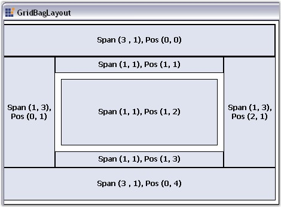

::: {style="DISPLAY: none"}
{#d2h_url_template}{#d2h_package_url style="WIDTH: 0px; DISPLAY: none; HEIGHT: 0px"}
:::

::: {.d2h_secondary_topic style="PADDING-BOTTOM: 10pt; MARGIN: 0pt; PADDING-LEFT: 0pt; PADDING-RIGHT: 0pt; PADDING-TOP: 0pt"}
#### GridBagLayout {#gridbaglayout style="tab-stops: 0pt"}

[]{style="COLOR: #15428b"} 

**GridBagLayout** is a Layout Manager which allows us to arrange the Child controls in a virtual grid of rows and columns. But, unlike the GridLayout, the size of the columns / rows can vary and the Child controls may span more than one cell.

[]{style="COLOR: #15428b"} 

{border="0"}

[]{style="COLOR: #15428b"} 

Figure 690: Buttons Laid Out Using GridBagLayout

[]{style="COLOR: #15428b"} 

The GridBagLayout is the most configurable of all the Layout Managers, providing users various options to layout Child controls within the notion of a virtual grid of rows and columns. Deriving from the Layout Manager base, the GridBagLayout inherits all the functionality that the Layout Manager type exposes.

[]{style="COLOR: #15428b"} 

GridBagLayout is also used to layout the following controls:

[]{style="COLOR: #15428b"} 

[·      ]{style="FONT-FAMILY: Symbol"}Navigation Buttons of the Wizard control.

[·      ]{style="FONT-FAMILY: Symbol"}Buttons of the Calculator control.

[]{style="COLOR: #15428b"} 

A Sample which demonstrates the GridBagLayout is available in the below sample installation path.

 

..My Documents\\Syncfusion\\EssentialStudio\\Version Number\\Windows\\Tools.Windows\\Samples\\2.0\\Layout Manager Package\\LayoutManagers

[]{style="COLOR: #15428b"} 

See Also

[]{style="COLOR: #4a5c8c"} 

[Creating a Simple Layout]{.UGHyperlink}[, ]{.UGHyperlink}

More:

[ ]{#related-topics}

[{border="0" align="absMiddle"}Configuring Child Controls](ms-xhelp:///?Id=aec3ffe8-af54-4cca-b6de-d94a3145b645){style="TEXT-DECORATION: none"}

[{border="0" align="absMiddle"}Rearranging the Controls laid out by GridBagLayout](ms-xhelp:///?Id=7cd7e9b9-d516-4ef3-bfbb-b55999e11b7c){style="TEXT-DECORATION: none"}
:::
