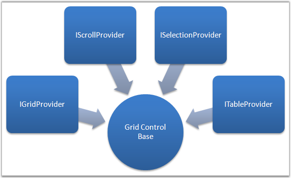
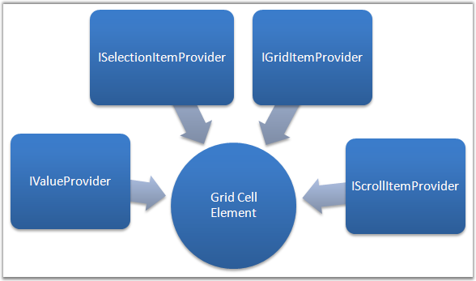
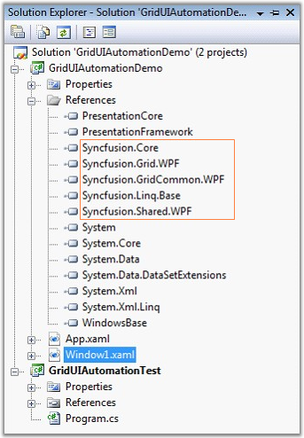
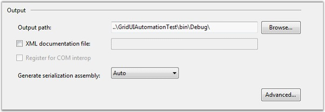

::: {style="DISPLAY: none"}
{#d2h_url_template}{#d2h_package_url style="WIDTH: 0px; DISPLAY: none; HEIGHT: 0px"}
:::

:::::: {.d2h_secondary_topic style="PADDING-BOTTOM: 10pt; MARGIN: 0pt; PADDING-LEFT: 0pt; PADDING-RIGHT: 0pt; PADDING-TOP: 0pt"}
#### []{#p249}Grid Control UI Automation Support {#grid-control-ui-automation-support style="tab-stops: 0pt"}

Microsoft UI Automation provides a single, generalized interface that automation clients can examine or use to operate the user interfaces of a variety of platforms and frameworks. For more information, see [[http://msdn.microsoft.com/en-us/library/cc165614.aspx]{.UGHyperlink}](http://msdn.microsoft.com/en-us/library/cc165614.aspx).

 

With the Grid control, UI Automation is enabled for writing testable applications. It involves the patterns below.

 

{border="0"}

Figure 111: Grid UI Automation Providers

 

Grid control is customized for maximum performance, and thus the visuals are always virtualized. Automation Elements are generated for these live visuals alone. The different sets of automation providers implemented, provide access to the inner elements.

 

Following are the different sets of identifiers that can be obtained for the Grid:

 

[·      ]{style="FONT-FAMILY: Symbol"}GridPattern

[·      ]{style="FONT-FAMILY: Symbol"}TablePattern

[·      ]{style="FONT-FAMILY: Symbol"}SelectionPattern

[·      ]{style="FONT-FAMILY: Symbol"}ScrollPattern

 

Each cell in the grid is considered as an Automation Element, which in itself has some providers implemented. The following figure displays the different sets of identifiers for a Grid Cell Element.

 

[]{#p250}{border="0"}

Figure 112: Grid Cell Element Automation Provider

 

Following are the different set of identifiers that can be obtained for each Grid Cell Element:

**[]{style="COLOR: #15428b"}** 

[·      ]{style="FONT-FAMILY: Symbol"}GridItemPattern

[·      ]{style="FONT-FAMILY: Symbol"}ValuePattern

[·      ]{style="FONT-FAMILY: Symbol"}SelectionItemPattern

[·      ]{style="FONT-FAMILY: Symbol"}ScrollItemPattern

**[]{style="COLOR: #15428b"}** 

::: {style="BORDER-BOTTOM: windowtext 1pt solid; BORDER-LEFT: medium none; PADDING-BOTTOM: 1pt; MARGIN-TOP: 9pt; PADDING-LEFT: 0pt; PADDING-RIGHT: 0pt; MARGIN-BOTTOM: 9pt; BORDER-TOP: windowtext 1pt solid; BORDER-RIGHT: medium none; PADDING-TOP: 1pt"}
{border="0"}Note: With NUnit or any other test frameworks, using TestApi from codeplex.com makes it quite easy to write unit tests. We are not recommending/fixing any issues with TestApi, it is an open source library from Microsoft.
:::

**[]{style="COLOR: #15428b"}** 

Using UI Automation Patterns

 

Let us walkthrough the following sample application that demonstrates the usage of UI Automation using a Console application.

 

API Usage

 

Setting up an Automation Sample is very useful to understand the usage of API for Automation Peer in Grid control. Automation Elements are run on a different thread from the main GUI thread.

 

The following set of instructions illustrates the same.

 

1.   Create a WPF sample application with references added up for Syncfusion assemblies.

 

{border="0"}

Figure 113: Syncfusion Assemblies referenced in the WPF Application

**[]{style="COLOR: #15428b"}** 

2.   Create a console project as shown below.

**[]{style="COLOR: #15428b"}** 

+----------------------------------------------------------------------------------------------------------------------------------------------------------------------------------------------------------------------------------------------------------------------------------------------------------------------------------------------------------------------------------------------------------------------------------------------------------------------------------------------------------------------------------------------------------------------------------------------------------+
| [\[XAML\]]{style="FONT-FAMILY: 'Courier New'; COLOR: black"}                                                                                                                                                                                                                                                                                                                                                                                                                                                                                                                                             |
|                                                                                                                                                                                                                                                                                                                                                                                                                                                                                                                                                                                                          |
| **[]{style="FONT-FAMILY: 'Courier New'; COLOR: blue"}**                                                                                                                                                                                                                                                                                                                                                                                                                                                                                                                                                  |
|                                                                                                                                                                                                                                                                                                                                                                                                                                                                                                                                                                                                          |
| [\<]{style="FONT-FAMILY: 'Courier New'; COLOR: blue"}[Grid]{style="FONT-FAMILY: 'Courier New'; COLOR: #a31515"}[\>]{style="FONT-FAMILY: 'Courier New'; COLOR: blue"}                                                                                                                                                                                                                                                                                                                                                                                                                                     |
|                                                                                                                                                                                                                                                                                                                                                                                                                                                                                                                                                                                                          |
| [    ]{style="FONT-FAMILY: 'Courier New'; COLOR: #a31515"}[\<]{style="FONT-FAMILY: 'Courier New'; COLOR: blue"}[ScrollViewer]{style="FONT-FAMILY: 'Courier New'; COLOR: #a31515"}[ CanContentScroll]{style="FONT-FAMILY: 'Courier New'; COLOR: red"}[=\"True\"]{style="FONT-FAMILY: 'Courier New'; COLOR: blue"}[ HorizontalScrollBarVisibility]{style="FONT-FAMILY: 'Courier New'; COLOR: red"}[=\"Auto\"]{style="FONT-FAMILY: 'Courier New'; COLOR: blue"}[ VerticalScrollBarVisibility]{style="FONT-FAMILY: 'Courier New'; COLOR: red"}[=\"Auto\"\>]{style="FONT-FAMILY: 'Courier New'; COLOR: blue"} |
|                                                                                                                                                                                                                                                                                                                                                                                                                                                                                                                                                                                                          |
| [        ]{style="FONT-FAMILY: 'Courier New'; COLOR: #a31515"}[\<]{style="FONT-FAMILY: 'Courier New'; COLOR: blue"}[syncfusion]{style="FONT-FAMILY: 'Courier New'; COLOR: #a31515"}[:]{style="FONT-FAMILY: 'Courier New'; COLOR: blue"}[GridControl]{style="FONT-FAMILY: 'Courier New'; COLOR: #a31515"}[ x]{style="FONT-FAMILY: 'Courier New'; COLOR: red"}[:]{style="FONT-FAMILY: 'Courier New'; COLOR: blue"}[Name]{style="FONT-FAMILY: 'Courier New'; COLOR: red"}[=\"grid\" /\>]{style="FONT-FAMILY: 'Courier New'; COLOR: blue"}                                                                   |
|                                                                                                                                                                                                                                                                                                                                                                                                                                                                                                                                                                                                          |
| [    ]{style="FONT-FAMILY: 'Courier New'; COLOR: #a31515"}[\</]{style="FONT-FAMILY: 'Courier New'; COLOR: blue"}[ScrollViewer]{style="FONT-FAMILY: 'Courier New'; COLOR: #a31515"}[\>]{style="FONT-FAMILY: 'Courier New'; COLOR: blue"}                                                                                                                                                                                                                                                                                                                                                                  |
|                                                                                                                                                                                                                                                                                                                                                                                                                                                                                                                                                                                                          |
| [\</]{style="FONT-FAMILY: 'Courier New'; COLOR: blue"}[Grid]{style="FONT-FAMILY: 'Courier New'; COLOR: #a31515"}[\>]{style="FONT-FAMILY: 'Courier New'; COLOR: blue"}                                                                                                                                                                                                                                                                                                                                                                                                                                    |
+----------------------------------------------------------------------------------------------------------------------------------------------------------------------------------------------------------------------------------------------------------------------------------------------------------------------------------------------------------------------------------------------------------------------------------------------------------------------------------------------------------------------------------------------------------------------------------------------------------+

**[]{style="FONT-FAMILY: 'Courier New'"}** 

+--------------------------------------------------------------------------------------------------------------------------------------------------------------------------------------------+
| [\[C#\]]{style="FONT-FAMILY: 'Courier New'; COLOR: black"}                                                                                                                                 |
|                                                                                                                                                                                            |
| **[]{style="FONT-FAMILY: 'Courier New'; COLOR: blue"}**                                                                                                                                    |
|                                                                                                                                                                                            |
| [private]{style="FONT-FAMILY: 'Courier New'; COLOR: blue"}[ [void]{style="COLOR: blue"} InitGrid()]{style="FONT-FAMILY: 'Courier New'"}                                                    |
|                                                                                                                                                                                            |
| [{]{style="FONT-FAMILY: 'Courier New'"}                                                                                                                                                    |
|                                                                                                                                                                                            |
| [    [var]{style="COLOR: blue"} model = [this]{style="COLOR: blue"}.grid.Model;]{style="FONT-FAMILY: 'Courier New'"}                                                                       |
|                                                                                                                                                                                            |
| [    model.RowCount = 10;]{style="FONT-FAMILY: 'Courier New'"}                                                                                                                             |
|                                                                                                                                                                                            |
| [    model.ColumnCount = 10;]{style="FONT-FAMILY: 'Courier New'"}                                                                                                                          |
|                                                                                                                                                                                            |
| [    model.QueryCellInfo += (s, e) =\>]{style="FONT-FAMILY: 'Courier New'"}                                                                                                                |
|                                                                                                                                                                                            |
| [    {]{style="FONT-FAMILY: 'Courier New'"}                                                                                                                                                |
|                                                                                                                                                                                            |
| [        e.Style.CellValue = [string]{style="COLOR: blue"}.Format([\"Cell {0} / {1}\"]{style="COLOR: #a31515"}, e.Cell.RowIndex, e.Cell.ColumnIndex);]{style="FONT-FAMILY: 'Courier New'"} |
|                                                                                                                                                                                            |
| [    };]{style="FONT-FAMILY: 'Courier New'"}                                                                                                                                               |
|                                                                                                                                                                                            |
| [}]{style="FONT-FAMILY: 'Courier New'"}                                                                                                                                                    |
+--------------------------------------------------------------------------------------------------------------------------------------------------------------------------------------------+

**[]{style="COLOR: #15428b"}** 

3.   Enter the path where the output of the Window sample has to be saved, in the Output path field.

 

{border="0"}

Figure 114: Specifying the Output Path

**[]{style="COLOR: #15428b"}** 

::: {style="BORDER-BOTTOM: windowtext 1pt solid; BORDER-LEFT: medium none; PADDING-BOTTOM: 1pt; MARGIN-TOP: 9pt; PADDING-LEFT: 0pt; PADDING-RIGHT: 0pt; MARGIN-BOTTOM: 9pt; BORDER-TOP: windowtext 1pt solid; BORDER-RIGHT: medium none; PADDING-TOP: 1pt"}
{border="0"}Note: Mention the output path as the Console application\'s bin\\Debug directory.
:::

 

The following sample code uses TestApi assemblies.

 

+----------------------------------------------------------------------------------------------------------------------------------------------------------------------------------------------------------------------------------------------------------------+
| [\[C#\]]{style="FONT-FAMILY: 'Courier New'; COLOR: black"}                                                                                                                                                                                                     |
|                                                                                                                                                                                                                                                                |
| **[]{style="FONT-FAMILY: 'Courier New'; COLOR: blue"}**                                                                                                                                                                                                        |
|                                                                                                                                                                                                                                                                |
| [// Initialization Code.]{style="FONT-FAMILY: 'Courier New'; COLOR: green"}                                                                                                                                                                                    |
|                                                                                                                                                                                                                                                                |
| [private]{style="FONT-FAMILY: 'Courier New'; COLOR: blue"}[ [static]{style="COLOR: blue"} AutomationElement GetGridAut([out]{style="COLOR: blue"} AutomatedApplication app)]{style="FONT-FAMILY: 'Courier New'"}                                               |
|                                                                                                                                                                                                                                                                |
| [{]{style="FONT-FAMILY: 'Courier New'"}                                                                                                                                                                                                                        |
|                                                                                                                                                                                                                                                                |
| [    [string]{style="COLOR: blue"} sampleAppPath = [\"GridUIAutomationDemo.exe\"]{style="COLOR: #a31515"};]{style="FONT-FAMILY: 'Courier New'"}                                                                                                                |
|                                                                                                                                                                                                                                                                |
| [    app = [new]{style="COLOR: blue"} OutOfProcessApplication([new]{style="COLOR: blue"} OutOfProcessApplicationSettings]{style="FONT-FAMILY: 'Courier New'"}                                                                                                  |
|                                                                                                                                                                                                                                                                |
| [    {]{style="FONT-FAMILY: 'Courier New'"}                                                                                                                                                                                                                    |
|                                                                                                                                                                                                                                                                |
| [        ProcessStartInfo = [new]{style="COLOR: blue"} ProcessStartInfo(sampleAppPath),]{style="FONT-FAMILY: 'Courier New'"}                                                                                                                                   |
|                                                                                                                                                                                                                                                                |
| [        ApplicationImplementationFactory = [new]{style="COLOR: blue"} UIAutomationOutOfProcessApplicationFactory()]{style="FONT-FAMILY: 'Courier New'"}                                                                                                       |
|                                                                                                                                                                                                                                                                |
| [    });]{style="FONT-FAMILY: 'Courier New'"}                                                                                                                                                                                                                  |
|                                                                                                                                                                                                                                                                |
| [    app.Start();]{style="FONT-FAMILY: 'Courier New'"}                                                                                                                                                                                                         |
|                                                                                                                                                                                                                                                                |
| [    app.WaitForMainWindow([TimeSpan]{style="COLOR: #2b91af"}.FromSeconds(15));]{style="FONT-FAMILY: 'Courier New'"}                                                                                                                                           |
|                                                                                                                                                                                                                                                                |
| [    [var]{style="COLOR: blue"} rootElement = app.MainWindow [as]{style="COLOR: blue"} AutomationElement;]{style="FONT-FAMILY: 'Courier New'"}                                                                                                                 |
|                                                                                                                                                                                                                                                                |
| [    [var]{style="COLOR: blue"} grid = rootElement.AsQueryable(TreeScope.Descendants).First(o =\> o.ClassName == [\"GridControl\"]{style="COLOR: #a31515"} && o.ControlType ==                     ControlType.DataGrid);]{style="FONT-FAMILY: 'Courier New'"} |
|                                                                                                                                                                                                                                                                |
| [    [return]{style="COLOR: blue"} grid;]{style="FONT-FAMILY: 'Courier New'"}                                                                                                                                                                                  |
|                                                                                                                                                                                                                                                                |
| [}]{style="FONT-FAMILY: 'Courier New'"}                                                                                                                                                                                                                        |
+----------------------------------------------------------------------------------------------------------------------------------------------------------------------------------------------------------------------------------------------------------------+

**[]{style="FONT-FAMILY: 'Courier New'"}** 

::: {style="BORDER-BOTTOM: windowtext 1pt solid; BORDER-LEFT: medium none; PADDING-BOTTOM: 1pt; MARGIN-TOP: 9pt; PADDING-LEFT: 0pt; PADDING-RIGHT: 0pt; MARGIN-BOTTOM: 9pt; BORDER-TOP: windowtext 1pt solid; BORDER-RIGHT: medium none; PADDING-TOP: 1pt"}
Note: We have added minimal set of Linq-to-UIAutomation classes that would translate the LINQ query for searching the AutomationElement from the root hierarchy. With Linq-To-UIAutomation library, only First method is supported now.
:::

 

The Grid Automation element is obtained.

 

Obtaining the Automation Pattern

 

Once you get the actual Grid\'s Automation Element, you can then make use of different Patterns supported by the control. The following code example illustrates the same.

 

+--------------------------------------------------------------------------------------------------------------------------------------------------------+
| [\[C#\]]{style="FONT-FAMILY: 'Courier New'; COLOR: black"}                                                                                             |
|                                                                                                                                                        |
| **[]{style="FONT-FAMILY: 'Courier New'; COLOR: blue"}**                                                                                                |
|                                                                                                                                                        |
| [var gridPattern = grid.GetCurrentPattern(GridPatternIdentifiers.Pattern) [as]{style="COLOR: blue"} GridPattern;]{style="FONT-FAMILY: 'Courier New'"}  |
|                                                                                                                                                        |
| [var item = gridPattern.GetItem(1, 1);]{style="FONT-FAMILY: 'Courier New'"}                                                                            |
|                                                                                                                                                        |
| [if]{style="FONT-FAMILY: 'Courier New'; COLOR: blue"}[ (item != [null]{style="COLOR: blue"})]{style="FONT-FAMILY: 'Courier New'"}                      |
|                                                                                                                                                        |
| [{]{style="FONT-FAMILY: 'Courier New'"}                                                                                                                |
|                                                                                                                                                        |
| [    [object]{style="COLOR: blue"} value = [null]{style="COLOR: blue"};]{style="FONT-FAMILY: 'Courier New'"}                                           |
|                                                                                                                                                        |
| [    item.TryGetCurrentPattern(ValuePatternIdentifiers.Pattern, [out]{style="COLOR: blue"} value);]{style="FONT-FAMILY: 'Courier New'"}                |
|                                                                                                                                                        |
| [    var valueProvider = value [as]{style="COLOR: blue"} ValuePattern;]{style="FONT-FAMILY: 'Courier New'"}                                            |
|                                                                                                                                                        |
| [    var cellValue = valueProvider.Current.Value;]{style="FONT-FAMILY: 'Courier New'"}                                                                 |
|                                                                                                                                                        |
| [    [Console]{style="COLOR: #2b91af"}.WriteLine([\"Item at \[1,1\] - {0}\"]{style="COLOR: #a31515"}, cellValue);]{style="FONT-FAMILY: 'Courier New'"} |
|                                                                                                                                                        |
| [}]{style="FONT-FAMILY: 'Courier New'"}                                                                                                                |
+--------------------------------------------------------------------------------------------------------------------------------------------------------+

 

 

 

[]{#related-topics}
::::::
