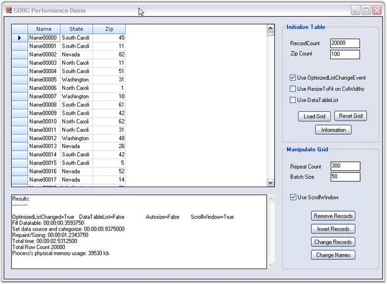
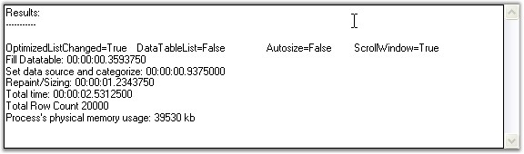

::: {style="DISPLAY: none"}
{#d2h_url_template}{#d2h_package_url style="WIDTH: 0px; DISPLAY: none; HEIGHT: 0px"}
:::

::: {.d2h_secondary_topic style="PADDING-BOTTOM: 10pt; MARGIN: 0pt; PADDING-LEFT: 0pt; PADDING-RIGHT: 0pt; PADDING-TOP: 0pt"}
#### Grid Data Bound Grid Performance {#grid-data-bound-grid-performance style="tab-stops: 0pt"}

[]{style="FONT-FAMILY: 'Trebuchet MS','sans-serif'; COLOR: #15428b; FONT-SIZE: 9pt"} 

Essential Grid Data Bound Grid can handle large amount of data without a performance hit.

[]{style="FONT-FAMILY: 'Trebuchet MS','sans-serif'; COLOR: #15428b; FONT-SIZE: 9pt"} 

{border="0"}

[]{style="FONT-FAMILY: 'Trebuchet MS','sans-serif'; COLOR: #15428b; FONT-SIZE: 9pt"} 

*[Figure ]{style="FONT-SIZE: 9pt"}[226]{style="FONT-SIZE: 9pt"}[: Grid Data Bound Grid]{style="FONT-SIZE: 9pt"}*

[]{style="FONT-FAMILY: 'Trebuchet MS','sans-serif'; COLOR: #15428b; FONT-SIZE: 9pt"} 

For more details, refer the sample under the following path from our sample browser:

 

***\<Install Location\>\\Syncfusion\\EssentialStudio\\\[Version Number\]\\Windows\\Grid.Windows\\Samples\\2.0\\Data Bound\\Grid Performance Demo***

 

**Example**

 

The Grid can be loaded by specifying the number of record and using the options-Use OptimizedListChangeEvent, Use ResizeToFit on ColWidths and Use DataTableList.

 

In the Initialize Table group box

[]{style="FONT-FAMILY: 'Trebuchet MS','sans-serif'; COLOR: #15428b; FONT-SIZE: 9pt"} 

[·      ]{style="FONT-FAMILY: Symbol"}**Use OptimizedListChangeEvent**--Selecting this option ensures that the grid data is updated using the IBindingList.ListChanged instead of the CurrencyManager change events.

[·      ]{style="FONT-FAMILY: Symbol"}**Use ResizeToFit on ColWidths**--Selecting this option ensures column width is resized to fit the cell content after the data is loaded.

[·      ]{style="FONT-FAMILY: Symbol"}**Use DataTableList**-Selecting this option ensures that the Syncfusion.Collections.DataTableWrapperList is used as the data source instead of the data table. The DataTableWrapperList is an IBindingList collection that wraps a data table and provides optimized access to the rows of the data table in turn improving the performance when inserting records into an existing table holding many records.

 

In the Manipulate Grid group box

 

[·      ]{style="FONT-FAMILY: Symbol"}The Repeat Count and the Batch Size can be specified in order to check the performance in batch updates.

[·      ]{style="FONT-FAMILY: Symbol"}Selecting the Use ScrollWindow check box invalidates only the inserted or removed rows instead of invalidating the whole Grid.

[·      ]{style="FONT-FAMILY: Symbol"}The Insert Records, Remove Records and Change Records buttons let you check the performance when inserting, removing or changing the records in the underlying data table. Once the data is loaded after the batch update, you will be able to see the performance and the memory usage in a text box, as shown below.

[]{style="FONT-FAMILY: 'Trebuchet MS','sans-serif'; COLOR: #15428b; FONT-SIZE: 9pt"} 

{border="0"}

***[]{style="FONT-FAMILY: 'Trebuchet MS','sans-serif'; COLOR: #15428b; FONT-SIZE: 9pt"}*** 

*[Figure ]{style="FONT-SIZE: 9pt"}[227]{style="FONT-SIZE: 9pt"}[: Grid Performance Check]{style="FONT-SIZE: 9pt"}*

 

[]{#p386} 

 

[]{#related-topics}
:::
