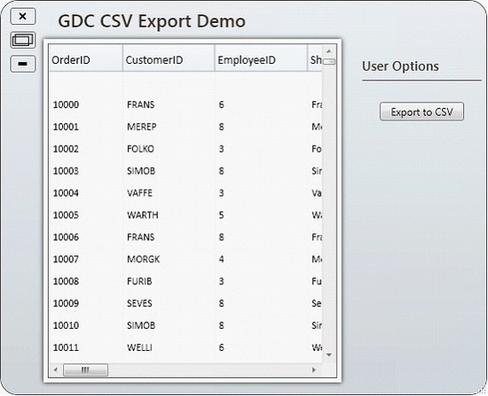
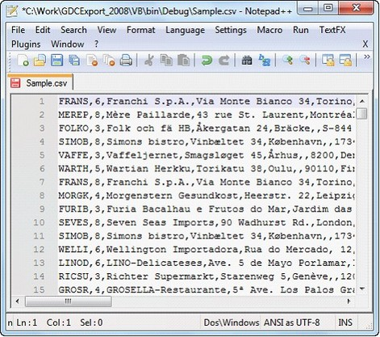

::: {style="DISPLAY: none"}
{#d2h_url_template}{#d2h_package_url style="WIDTH: 0px; DISPLAY: none; HEIGHT: 0px"}
:::

::: {.d2h_secondary_topic style="PADDING-BOTTOM: 10pt; MARGIN: 0pt; PADDING-LEFT: 0pt; PADDING-RIGHT: 0pt; PADDING-TOP: 0pt"}
#### GridDataControl Export to CSV[]{style="BACKGROUND: white"} {#griddatacontrol-export-to-csv style="tab-stops: 0pt"}

[The ExportToCSV method of the GridModelExportExtensions class enables GridDataControl to easily be exported to CSV format.]{style="BACKGROUND: white"}

[]{style="BACKGROUND: white"} 

[To enable exporting, ]{style="FONT-FAMILY: 'Calibri','sans-serif'"}[the following .dll files must be added along with the default .dll files in the reference folder:]{style="BACKGROUND: white"}

[]{style="BACKGROUND: white"} 

[·      ]{style="FONT-FAMILY: Symbol"}[Syncfusion.XlsIO.Base]{style="BACKGROUND: white"}

[·      ]{style="FONT-FAMILY: Symbol"}[Syncfusion.XlsIO.WPF ]{style="BACKGROUND: white"}

[·      ]{style="FONT-FAMILY: Symbol"}[Syncfusion.GridConverter.Wpf]{style="BACKGROUND: white"}

**[]{style="BACKGROUND: white; COLOR: #15428b"}** 

[Converting GridDataControl to CSV format]{style="BACKGROUND: white"}

[]{style="BACKGROUND: white"} 

You can convert the entire content of a grid control to a CSV file by using the following code:

 

+---------------------------------------------------------------------------------------------------------------------------------------------------------------+
| [\[C#\]]{style="FONT-FAMILY: 'Calibri','sans-serif'"}                                                                                                         |
|                                                                                                                                                               |
| []{style="FONT-FAMILY: 'Calibri','sans-serif'; BACKGROUND: white; COLOR: black"}                                                                              |
|                                                                                                                                                               |
| [this]{style="FONT-FAMILY: 'Courier New'; COLOR: blue"}[.gdc.Model.ExportToCSV([\"Sample.csv\"]{style="COLOR: #a31515"})]{style="FONT-FAMILY: 'Courier New'"} |
+---------------------------------------------------------------------------------------------------------------------------------------------------------------+

[]{style="FONT-FAMILY: 'Calibri','sans-serif'; BACKGROUND: white; COLOR: black"} 

+-------------------------------------------------------------------------------------------------------------------------------------------------------------+
| [\[VB\]]{style="FONT-FAMILY: 'Calibri','sans-serif'; BACKGROUND: white; COLOR: black"}                                                                      |
|                                                                                                                                                             |
| []{style="FONT-FAMILY: 'Calibri','sans-serif'; BACKGROUND: white; COLOR: black"}                                                                            |
|                                                                                                                                                             |
| [Me]{style="FONT-FAMILY: 'Courier New'; COLOR: blue"}[.gdc.Model.ExportToCSV([\"Sample.csv\"]{style="COLOR: #a31515"})]{style="FONT-FAMILY: 'Courier New'"} |
+-------------------------------------------------------------------------------------------------------------------------------------------------------------+

[]{style="FONT-FAMILY: 'Calibri','sans-serif'; BACKGROUND: white; COLOR: black"} 

When the code runs, the following output displays.

[]{style="COLOR: #15428b"} 

{border="0"}

Figure 242: GridDataControl Ready for Export

[]{style="BACKGROUND: white"} 

When you are ready to export the entire grid, click Export to CSV; the grid content will then be converted to CSV format.

 

[]{style="FONT-FAMILY: 'Calibri','sans-serif'"} 

{border="0"}

Figure 243: Exported Grid Content in CSV Format

[]{style="COLOR: #15428b"} 

 

 

 

[]{#related-topics}
:::
