::: {style="DISPLAY: none"}
{#d2h_url_template}{#d2h_package_url style="WIDTH: 0px; DISPLAY: none; HEIGHT: 0px"}
:::

::: {.d2h_secondary_topic style="PADDING-BOTTOM: 10pt; MARGIN: 0pt; PADDING-LEFT: 0pt; PADDING-RIGHT: 0pt; PADDING-TOP: 0pt"}
#### Grid Designer {#grid-designer style="tab-stops: 0pt"}

[]{style="FONT-FAMILY: 'Trebuchet MS','sans-serif'; COLOR: #15428b; FONT-SIZE: 9pt"} 

The Grid Grouping control has strong designer support. You can control all aspects of the grid\'s appearance through the designer. Additional commands (verbs) will let you save layouts and restore them. You can also use a preview feature that will let you load data into your control and then further set the Grid Grouping control properties that can be persisted as design-time properties.

 

Clicking the Preview and Edit verb will allow you to view the Grid Grouping control, populated with data along with a companion property grid as seen in the picture below. It also displays help description for the properties that are being selected. You can use the property grid to change the Grid Grouping control\'s properties and see the effect immediately upon the populated control. When you close the preview, you will have the option of saving any changed properties to the property grid in the designer. We will use this Preview and Edit support to see the effects of setting the various TableOption properties.

[]{style="FONT-FAMILY: 'Trebuchet MS','sans-serif'; COLOR: #15428b; FONT-SIZE: 9pt"} 

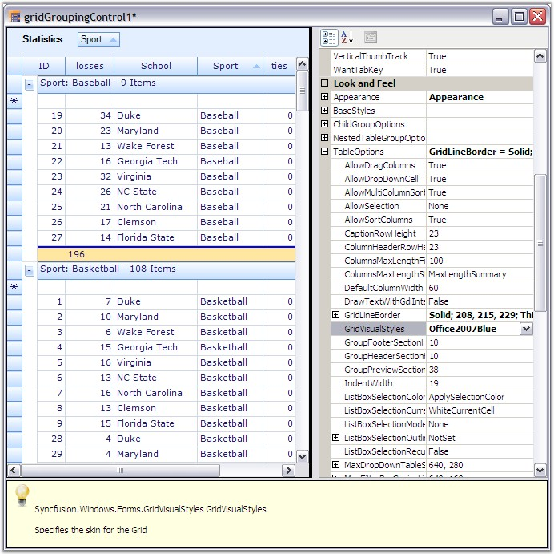{border="0"}

[]{style="FONT-FAMILY: 'Trebuchet MS','sans-serif'; COLOR: #15428b; FONT-SIZE: 9pt"} 

*[Figure ]{style="FONT-SIZE: 9pt"}[386]{style="FONT-SIZE: 9pt"}[: Preview and Edit Support]{style="FONT-SIZE: 9pt"}*

[]{style="FONT-SIZE: 8pt"} 

Grid Designer presents populated Grid Grouping control along with a property grid listing out the related properties. It also includes an integrated help feature to display a brief description on the property selected. You will be able to set any kind of properties using the designer so that you could see the results immediately. Here is a brief discussion on how to work with grid elements through the designer.

[]{style="FONT-FAMILY: 'Verdana','sans-serif'; FONT-SIZE: 8pt"} 

**Grouping**

[]{style="FONT-FAMILY: 'Verdana','sans-serif'; FONT-SIZE: 8pt"} 

Designer provides full drag/drop capability so that you could be able to group the records by dragging a column header and dropping it into the GroupDropArea, provided the GroupDropArea is enabled by setting **ShowGroupDropArea** to true. Likewise you can group the data against any number of columns across the tables when multiple nested tables are used.

**[]{style="FONT-SIZE: 8pt"}** 

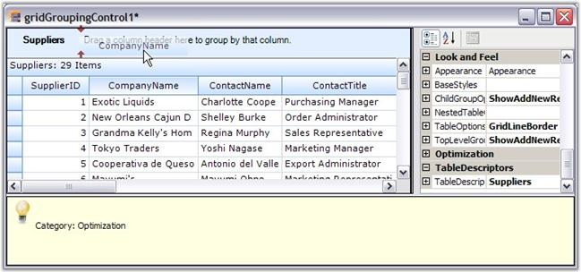{border="0"}

[]{style="FONT-FAMILY: 'Trebuchet MS','sans-serif'; COLOR: #15428b; FONT-SIZE: 9pt"} 

*[Figure ]{style="FONT-SIZE: 9pt"}[387]{style="FONT-SIZE: 9pt"}[: Dragging a column header to group grid by that Column]{style="FONT-SIZE: 9pt"}*

[]{style="FONT-FAMILY: 'Trebuchet MS','sans-serif'; COLOR: #15428b; FONT-SIZE: 9pt"} 

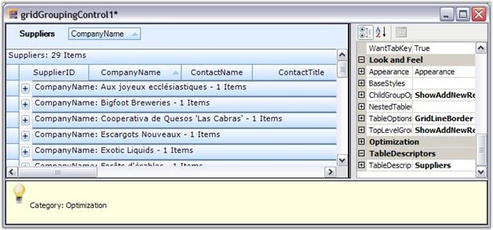{border="0"}

[]{style="FONT-FAMILY: 'Trebuchet MS','sans-serif'; COLOR: #15428b; FONT-SIZE: 9pt"} 

*[Figure ]{style="FONT-SIZE: 9pt"}[388]{style="FONT-SIZE: 9pt"}[: Grouped Grid]{style="FONT-SIZE: 9pt"}*

**[]{style="FONT-FAMILY: 'Trebuchet MS','sans-serif'; COLOR: #15428b; FONT-SIZE: 9pt"}** 

You can also use **TableDescriptor.GroupedColumns** property to add groups where you need to specify the column names based on which the table has to be grouped.

[]{style="FONT-FAMILY: 'Trebuchet MS','sans-serif'; COLOR: #15428b; FONT-SIZE: 9pt"} 

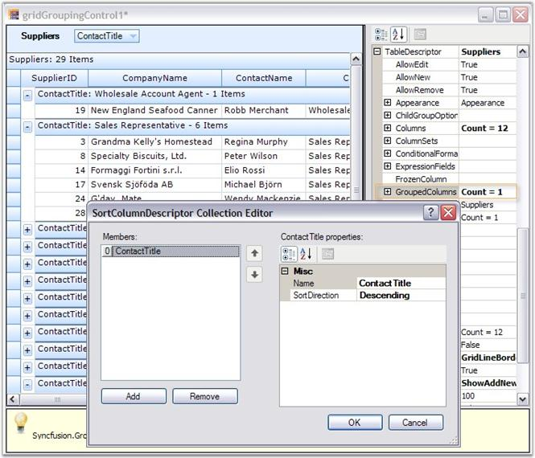{border="0"}

***[]{style="FONT-FAMILY: 'Trebuchet MS','sans-serif'; COLOR: #15428b; FONT-SIZE: 9pt"}*** 

*[Figure ]{style="FONT-SIZE: 9pt"}[389]{style="FONT-SIZE: 9pt"}[: Grouping Columns by adding Groups]{style="FONT-SIZE: 9pt"}*

**[]{style="FONT-SIZE: 8pt"}** 

Sorting

 

Sorting can be done on the table data by simply clicking the desired column header by which the values need to be sorted. Once sorting is done, the grouping grid displays a ListSortIcon in the respective column header to indicate the Sort Direction. You could also make use of the TableDescriptor.SortedColumns property to perform sorting on table data wherein you need to provide the column to be sorted and a sort order.

**[]{style="FONT-SIZE: 8pt"}** 

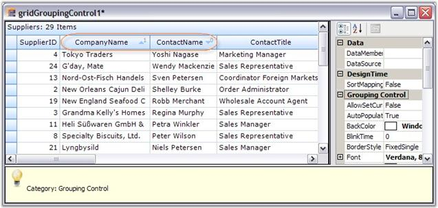{border="0"}

[]{style="FONT-FAMILY: 'Trebuchet MS','sans-serif'; COLOR: #15428b; FONT-SIZE: 9pt"} 

*[Figure ]{style="FONT-SIZE: 9pt"}[390]{style="FONT-SIZE: 9pt"}[: Sorted Grid highlighting the Sorted Column]{style="FONT-SIZE: 9pt"}****[s]{style="FONT-FAMILY: 'Trebuchet MS','sans-serif'; COLOR: #15428b; FONT-SIZE: 9pt"}***

[]{style="FONT-FAMILY: 'Trebuchet MS','sans-serif'; COLOR: #15428b; FONT-SIZE: 9pt"} 

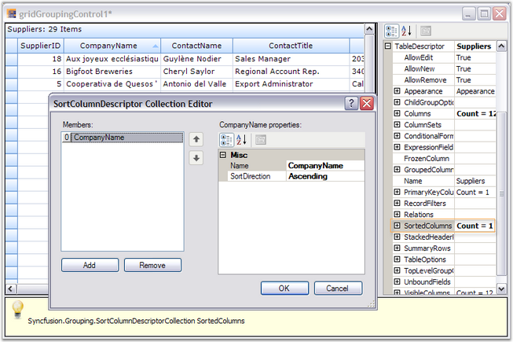{border="0"}

[]{style="FONT-FAMILY: 'Trebuchet MS','sans-serif'; COLOR: #15428b; FONT-SIZE: 9pt"} 

*[Figure ]{style="FONT-SIZE: 9pt"}[391]{style="FONT-SIZE: 9pt"}[: Sorted Grid showing the SortedColumns Editor]{style="FONT-SIZE: 9pt"}*

 

Summaries

[]{style="FONT-FAMILY: 'Verdana','sans-serif'; FONT-SIZE: 8pt"} 

Summaries can be added in the designer itself by accessing the property, TableDescriptor.SummaryRows property. You can add as many summary rows as you need, each with a desired number of summary columns where you can specify the type of summary, summary format, the column based on whose values the summary has to be calculated and the like for each of the summary columns.

**[]{style="FONT-SIZE: 8pt"}** 

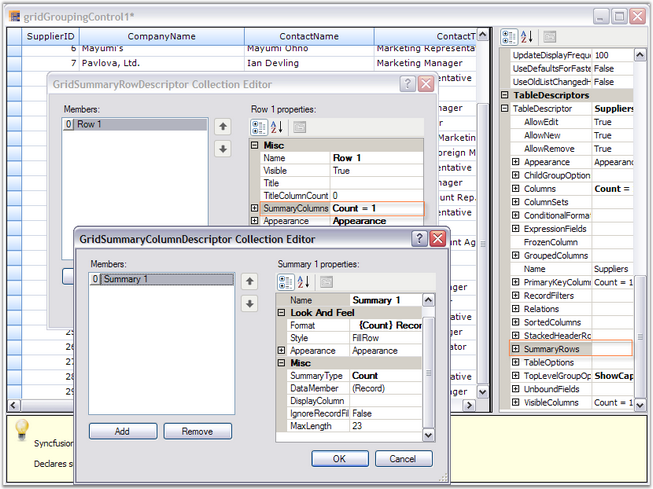{border="0"}

[]{style="FONT-FAMILY: 'Trebuchet MS','sans-serif'; COLOR: #15428b; FONT-SIZE: 9pt"} 

*[Figure ]{style="FONT-SIZE: 9pt"}[392]{style="FONT-SIZE: 9pt"}[: Adding Summary Rows]{style="FONT-SIZE: 9pt"}****[]{style="FONT-FAMILY: 'Trebuchet MS','sans-serif'; COLOR: #15428b; FONT-SIZE: 9pt"}***

[]{style="FONT-FAMILY: 'Trebuchet MS','sans-serif'; COLOR: #15428b; FONT-SIZE: 9pt"} 

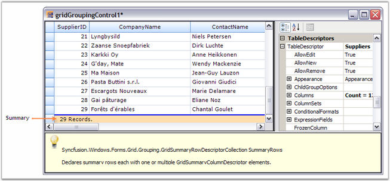{border="0"}

[]{style="FONT-FAMILY: 'Trebuchet MS','sans-serif'; COLOR: #15428b; FONT-SIZE: 9pt"} 

*[Figure ]{style="FONT-SIZE: 9pt"}[393]{style="FONT-SIZE: 9pt"}[: Grouping Grid displaying Summary]{style="FONT-SIZE: 9pt"}*

[]{style="FONT-FAMILY: 'Trebuchet MS','sans-serif'; COLOR: #15428b; FONT-SIZE: 9pt"} 

Record Filters

 

By using the TableDescriptor.RecordFilters property, you can add row filters for your grid table. Once you have specified the filter criteria and the column name whose values have to be checked against the given criteria, the grouping grid will display only the subset of records that satisfy the given criteria.

[]{style="FONT-FAMILY: 'Trebuchet MS','sans-serif'; COLOR: #15428b; FONT-SIZE: 9pt"} 

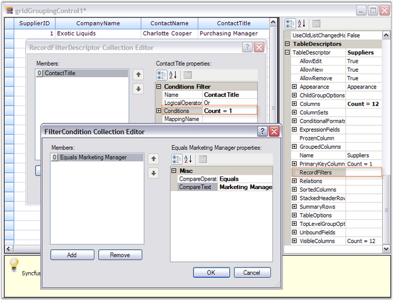{border="0"}

[]{style="FONT-FAMILY: 'Trebuchet MS','sans-serif'; COLOR: #15428b; FONT-SIZE: 9pt"} 

*[Figure ]{style="FONT-SIZE: 9pt"}[394]{style="FONT-SIZE: 9pt"}[: Adding row filters through RecordFilters Property]{style="FONT-SIZE: 9pt"}****[]{style="FONT-FAMILY: 'Trebuchet MS','sans-serif'; COLOR: #15428b; FONT-SIZE: 9pt"}***

[]{style="FONT-FAMILY: 'Trebuchet MS','sans-serif'; COLOR: #15428b; FONT-SIZE: 9pt"} 

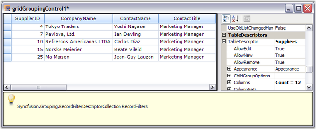{border="0"}

[]{style="FONT-FAMILY: 'Trebuchet MS','sans-serif'; COLOR: #15428b; FONT-SIZE: 9pt"} 

*[Figure ]{style="FONT-SIZE: 9pt"}[395]{style="FONT-SIZE: 9pt"}[: Filtered Grid]{style="FONT-SIZE: 9pt"}*

**[]{style="FONT-FAMILY: 'Trebuchet MS','sans-serif'; FONT-SIZE: 8pt"}** 

Grid Grouping control provides an **AutoFilterRow** which can be enabled by setting the **ShowFilterBar** property to true. Once it is done, you must enable **AllowFilter** property for the desired columns to enable filtering on those columns.

[]{style="FONT-SIZE: 8pt"} 

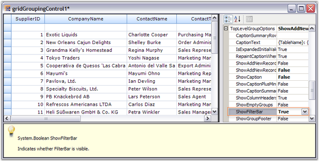{border="0"}

[]{style="FONT-FAMILY: 'Trebuchet MS','sans-serif'; COLOR: #15428b; FONT-SIZE: 9pt"} 

*[Figure ]{style="FONT-SIZE: 9pt"}[396]{style="FONT-SIZE: 9pt"}[: Grid with Auto-Filter Row Enabled]{style="FONT-SIZE: 9pt"}*

[]{style="FONT-FAMILY: 'Trebuchet MS','sans-serif'; COLOR: #15428b; FONT-SIZE: 9pt"} 

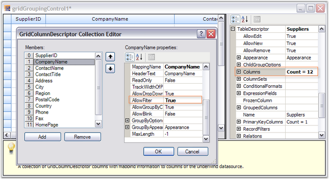{border="0"}

[]{style="FONT-FAMILY: 'Trebuchet MS','sans-serif'; COLOR: #15428b; FONT-SIZE: 9pt"} 

*[Figure ]{style="FONT-SIZE: 9pt"}[397]{style="FONT-SIZE: 9pt"}[: Setting AllowFilter property for \'CompanyName\' Column]{style="FONT-SIZE: 9pt"}*

[]{style="FONT-FAMILY: 'Trebuchet MS','sans-serif'; COLOR: #15428b; FONT-SIZE: 9pt"} 

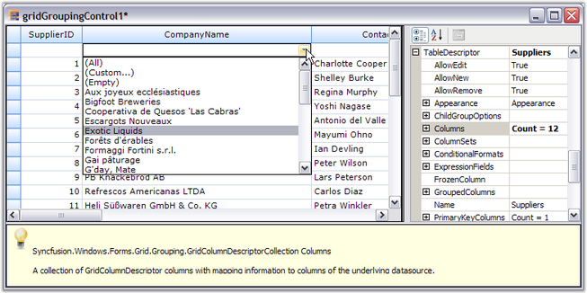{border="0"}

[]{style="FONT-FAMILY: 'Trebuchet MS','sans-serif'; COLOR: #15428b; FONT-SIZE: 9pt"} 

*[Figure ]{style="FONT-SIZE: 9pt"}[398]{style="FONT-SIZE: 9pt"}[: FilterBar drop down showing filtering options for the column \'CompanyName\']{style="FONT-SIZE: 9pt"}*

[]{style="FONT-FAMILY: 'Trebuchet MS','sans-serif'; COLOR: #15428b; FONT-SIZE: 9pt"} 

Expression Fields

 

When there is a need to display calculated values based on the values on other fields in the same record, ExpressionFields would be the right choice to use. ExpressionFields can be created by using the TableDescriptor.ExpressionFields property. This will open an editor wherein you can add any number of expression fields each with its own expression used to calculate the results.

[]{style="FONT-SIZE: 8pt"} 

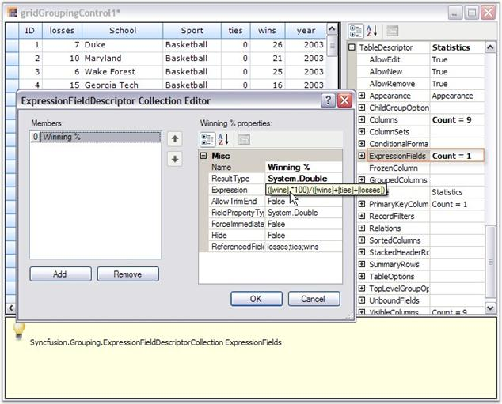{border="0"}

[]{style="FONT-FAMILY: 'Trebuchet MS','sans-serif'; COLOR: #15428b; FONT-SIZE: 9pt"} 

*[Figure ]{style="FONT-SIZE: 9pt"}[399]{style="FONT-SIZE: 9pt"}[:  Adding an Expression Field]{style="FONT-SIZE: 9pt"}*

*[]{style="FONT-SIZE: 9pt"}* 

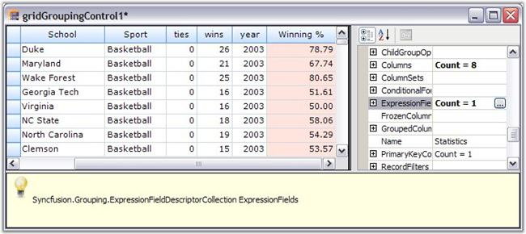{border="0"}

[]{style="FONT-FAMILY: 'Trebuchet MS','sans-serif'; COLOR: #15428b; FONT-SIZE: 9pt"} 

*[Figure ]{style="FONT-SIZE: 9pt"}[400]{style="FONT-SIZE: 9pt"}[: Grouping Grid showing the ExpressionField \'Winning%\']{style="FONT-SIZE: 9pt"}*

[]{style="FONT-FAMILY: 'Trebuchet MS','sans-serif'; COLOR: #15428b; FONT-SIZE: 9pt"} 

Relations

 

It is possible to specify the relation to be used across the tables in case multiple tables are used. It can done by accessing the TableDescriptor.Relations property wherein you can specify the relation type, name of the child table, relation keys consisting of the keys in parent and child tables and other information necessary to setup the relation.

**[]{style="FONT-SIZE: 8pt"}** 

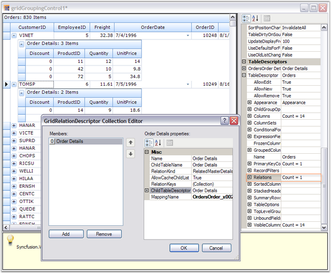{border="0"}

[]{style="FONT-FAMILY: 'Trebuchet MS','sans-serif'; COLOR: #15428b; FONT-SIZE: 9pt"} 

*[Figure ]{style="FONT-SIZE: 9pt"}[401]{style="FONT-SIZE: 9pt"}[: Hierarchical Grid with RelationKind \'RelatedMasterDetails\']{style="FONT-SIZE: 9pt"}*

[]{style="FONT-SIZE: 8pt"} 

Appearance

 

The appearance of every grid element can be customized by accessing the Appearance property. It allows you to set GridStyleInfo properties like cell type, value, back color, font, etc. for grid cells. It holds a sub tree of different grid elements each with its own set of formatting properties. For instance, when you want to set appearance for alternate record field cell, you can make use of Appearance.AlternateRecordFieldCell property; if you want to customize summary cells, you will have to use Appearance.SummaryFieldCell or related property.

**[]{style="FONT-FAMILY: 'Trebuchet MS','sans-serif'; FONT-SIZE: 8pt"}** 

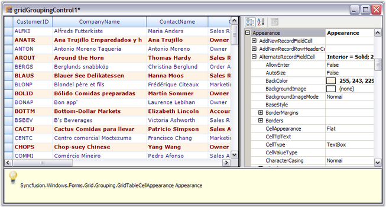{border="0"}

[]{style="FONT-FAMILY: 'Trebuchet MS','sans-serif'; COLOR: #15428b; FONT-SIZE: 9pt"} 

*[Figure ]{style="FONT-SIZE: 9pt"}[402]{style="FONT-SIZE: 9pt"}[: Grid Designer showing the appearance settings for AlternateRecordFieldCell]{style="FONT-SIZE: 9pt"}*

 

Skins

 

You can change the appearance and behavior of every grid element to provide grid with a rich look and feel by setting skins. Grouping Grid currently offers five such skins: Office2007Blue, Office2007Silver, Office2007Black, Office2003 and SystemTheme(Default XP theme). To set a skin, the GridVisualStyles property which is under TableOptions section is used. It lists the possible skin options in a drop down, which will make the entire grid redrawn with the chosen style.

[]{style="FONT-FAMILY: 'Trebuchet MS','sans-serif'; COLOR: #15428b; FONT-SIZE: 9pt"} 

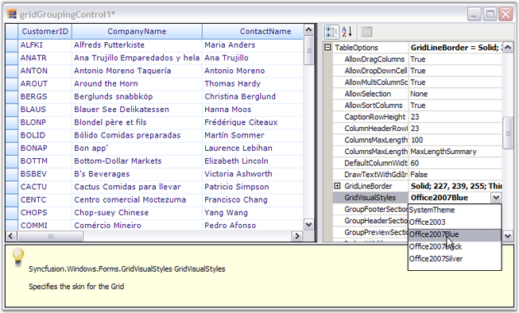{border="0"}

[]{style="FONT-FAMILY: 'Trebuchet MS','sans-serif'; COLOR: #15428b; FONT-SIZE: 9pt"} 

*[Figure ]{style="FONT-SIZE: 9pt"}[403]{style="FONT-SIZE: 9pt"}[: Grid Designer displaying the possible skins in a Drop Down]{style="FONT-SIZE: 9pt"}*

[]{style="FONT-FAMILY: 'Trebuchet MS','sans-serif'; COLOR: #15428b; FONT-SIZE: 9pt"} 

See Also

**[]{style="FONT-FAMILY: 'Trebuchet MS','sans-serif'; COLOR: #4a5c8c; FONT-SIZE: 8pt"}** 

[Grouping]{.UGHyperlink}[,]{style="FONT-FAMILY: 'Trebuchet MS','sans-serif'; COLOR: black; FONT-SIZE: 9pt"}[ Sorting]{.UGHyperlink}[,]{style="FONT-FAMILY: 'Trebuchet MS','sans-serif'; COLOR: black; FONT-SIZE: 9pt"}[ ]{style="FONT-FAMILY: 'Trebuchet MS','sans-serif'; COLOR: blue; FONT-SIZE: 9pt"}[Summaries]{.UGHyperlink}[,]{style="FONT-FAMILY: 'Trebuchet MS','sans-serif'; COLOR: black; FONT-SIZE: 9pt"}[ ]{style="FONT-FAMILY: 'Trebuchet MS','sans-serif'; COLOR: blue; FONT-SIZE: 9pt"}[Record Filters]{.UGHyperlink}[,]{style="FONT-FAMILY: 'Trebuchet MS','sans-serif'; COLOR: black; FONT-SIZE: 9pt"}[ ]{style="FONT-FAMILY: 'Trebuchet MS','sans-serif'; COLOR: blue; FONT-SIZE: 9pt"}[Expression Fields]{.UGHyperlink}[,]{style="FONT-FAMILY: 'Trebuchet MS','sans-serif'; COLOR: black; FONT-SIZE: 9pt"}[ ]{style="FONT-FAMILY: 'Trebuchet MS','sans-serif'; COLOR: blue; FONT-SIZE: 9pt"}[Relations]{.UGHyperlink}[,]{style="FONT-FAMILY: 'Trebuchet MS','sans-serif'; COLOR: black; FONT-SIZE: 9pt"}[ ]{style="FONT-FAMILY: 'Trebuchet MS','sans-serif'; COLOR: blue; FONT-SIZE: 9pt"}[Appearance]{.UGHyperlink}[, ]{style="FONT-FAMILY: 'Trebuchet MS','sans-serif'; COLOR: black; FONT-SIZE: 9pt"}[Grid Skins]{.UGHyperlink}[]{style="FONT-FAMILY: 'Trebuchet MS','sans-serif'; COLOR: black; FONT-SIZE: 9pt"}

 

[]{#p476} 

 

[]{#related-topics}
:::
