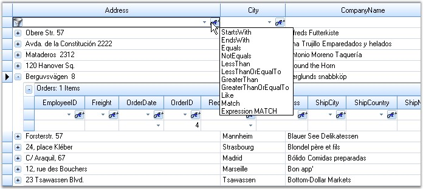
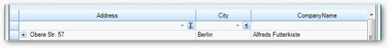
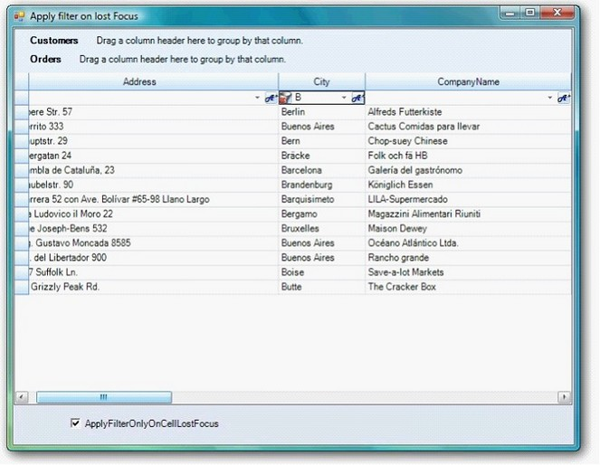

::: {style="DISPLAY: none"}
{#d2h_url_template}{#d2h_package_url style="WIDTH: 0px; DISPLAY: none; HEIGHT: 0px"}
:::

::::: {#nsbanner .d2h_main_nsbanner style="BORDER-BOTTOM: #999999 1px solid; POSITION: relative; PADDING-BOTTOM: 0px; BACKGROUND-COLOR: transparent; PADDING-LEFT: 0px; PADDING-RIGHT: 0px; DISPLAY: none; BORDER-TOP: #999999 1px solid; PADDING-TOP: 0px; LEFT: 0px"}
:::: {#TitleRow .d2h_main_titlerow style="PADDING-BOTTOM: 4px; BACKGROUND-COLOR: transparent; PADDING-LEFT: 22px; WIDTH: 100%; PADDING-RIGHT: 10px; DISPLAY: none; PADDING-TOP: 4px"}
::: {#ienav .d2h_main_ienav style="DISPLAY: none"}
{#D2HPrevious .D2HPreviousEnabled}  {#D2HNext .D2HNextEnabled}
:::
::::
:::::

:::: {#nstext .d2h_main_nstext style="PADDING-BOTTOM: 10px; BACKGROUND-COLOR: transparent; PADDING-LEFT: 22px; PADDING-RIGHT: 10px; HEIGHT: 100%; OVERFLOW: auto; PADDING-TOP: 5px" hasuserbackground="true" valign="bottom"}
::: {#d2h_breadcrumbs .d2h_breadcrumbs}
[Essential Studio User Guide Documentation](ms-xhelp:///?Id=12457748-09e3-4d74-a240-8e049cedf030){.d2h_breadcrumbsNormal}[ \> ]{.d2h_breadcrumbsLinkSeparator}[User Interface Edition](ms-xhelp:///?Id=c29296b7-531c-413b-a0ec-488ca1f7f669){.d2h_breadcrumbsNormal}[ \> ]{.d2h_breadcrumbsLinkSeparator}[Essential Windows](ms-xhelp:///?Id=e60759d8-47a4-4570-9d7a-16a68d63f2ea){.d2h_breadcrumbsNormal}[ \> ]{.d2h_breadcrumbsLinkSeparator}[Essential Grid]{.d2h_breadcrumbsContentsOnly}[ \> ]{.d2h_breadcrumbsLinkSeparator}[Grid Controls](ms-xhelp:///?Id=bf2d70d7-33dc-4c67-a55d-4fcf8d51dc2b){.d2h_breadcrumbsNormal}[ \> ]{.d2h_breadcrumbsLinkSeparator}[Grid Helper Classes](ms-xhelp:///?Id=fc684465-b246-4aea-b668-e0c0084c9590){.d2h_breadcrumbsNormal}
:::

### Grid Dynamic Filter {#grid-dynamic-filter style="tab-stops: 0pt"}

[]{style="FONT-FAMILY: 'Trebuchet MS','sans-serif'; COLOR: #15428b; FONT-SIZE: 9pt"} 

The **GridDynamicFilter** class is used to wire a custom filter bar to the Grid Grouping control by replacing the default filter bar. The existing filter bar logic is extended to make the filter easy to use. This feature displays filtered results as you type each character.

 

The new filter bar adds two cell buttons, **Filter** button and **Clear Filter** button, inside every filter bar cell. The Filter button is used to display a list of the available Compare Operators in a drop down. The selected operator will then be associated with the value present in the filter bar cell to form a filter string. The Clear Filter button, as its name indicates, clears the record filters of the respective column. This button will be displayed for a filter bar cell, only when that particular cell is in focus.

 

The following code example illustrates how to invoke the Grid Dynamic Filter.

[]{style="FONT-FAMILY: 'Trebuchet MS','sans-serif'; COLOR: #15428b; FONT-SIZE: 9pt"} 

1.   Using C#

[]{style="FONT-FAMILY: 'Trebuchet MS','sans-serif'; COLOR: #15428b; FONT-SIZE: 9pt"} 

+------------------------------------------------------------------------------------------------------------------------------------------------------------------------------------+
| **[\[C#\]]{style="FONT-FAMILY: 'Courier New'; COLOR: black"}**                                                                                                                     |
|                                                                                                                                                                                    |
| []{style="FONT-FAMILY: 'Courier New'; COLOR: black"}                                                                                                                               |
|                                                                                                                                                                                    |
| [GridEngineFactory.Factory = [new]{style="COLOR: blue"} Syncfusion.GridHelperClasses.[AllowResizingIndividualRows]{style="COLOR: #2b91af"}();]{style="FONT-FAMILY: 'Courier New'"} |
+------------------------------------------------------------------------------------------------------------------------------------------------------------------------------------+

[]{style="FONT-FAMILY: 'Trebuchet MS','sans-serif'; COLOR: #15428b; FONT-SIZE: 9pt"} 

2.   Using VB.NET

[]{style="FONT-FAMILY: 'Trebuchet MS','sans-serif'; COLOR: #15428b; FONT-SIZE: 9pt"} 

+---------------------------------------------------------------------------------------------------------------------------------------------------------+
| **[\[VB.NET\]]{style="FONT-FAMILY: 'Courier New'; COLOR: black"}**                                                                                      |
|                                                                                                                                                         |
| []{style="FONT-FAMILY: 'Courier New'; COLOR: black"}                                                                                                    |
|                                                                                                                                                         |
| [GridEngineFactory.Factory = [New]{style="COLOR: blue"} Syncfusion.GridHelperClasses.AllowResizingIndividualRows()]{style="FONT-FAMILY: 'Courier New'"} |
+---------------------------------------------------------------------------------------------------------------------------------------------------------+

[]{style="FONT-FAMILY: 'Trebuchet MS','sans-serif'; COLOR: #15428b; FONT-SIZE: 9pt"} 

The following screen shot illustrates Grid Grouping control with filter drop down.

[]{style="FONT-FAMILY: 'Trebuchet MS','sans-serif'; COLOR: #15428b; FONT-SIZE: 9pt"} 

{border="0"}

[]{style="FONT-FAMILY: 'Trebuchet MS','sans-serif'; COLOR: #15428b; FONT-SIZE: 9pt"} 

*[Figure ]{style="FONT-SIZE: 9pt"}[444]{style="FONT-SIZE: 9pt"}[: Grid Grouping control with Filter Drop Down]{style="FONT-SIZE: 9pt"}*

**[]{style="FONT-FAMILY: 'Trebuchet MS','sans-serif'; COLOR: #15428b; FONT-SIZE: 9pt"}** 

**[]{style="FONT-FAMILY: 'Trebuchet MS','sans-serif'; COLOR: #15428b; FONT-SIZE: 9pt"}** 

 Support to Save and Load Compare Operators State in Grid Dynamic Filter

**GridDynamicFilter** in **GridGroupingControl** is now enhanced a functionality to serialize/de-serialize the **compareoperator** images in button. This can be achieved by handling the following method calls.

+--------------------------------------------------------------------------------------+
| []{style="FONT-FAMILY: 'Courier New'"}                                               |
|                                                                                      |
| [\<code\>filter.LoadCompareOperator();\</code\>]{style="FONT-FAMILY: 'Courier New'"} |
|                                                                                      |
| [\<code\>filter.SaveCompareOperator();\</code\>]{style="FONT-FAMILY: 'Courier New'"} |
+--------------------------------------------------------------------------------------+

[]{style="FONT-FAMILY: 'Times New Roman','serif'; FONT-SIZE: 12pt"} 

When the code runs, the following output displays.

[]{style="FONT-FAMILY: 'Times New Roman','serif'; FONT-SIZE: 12pt"} 

{border="0"}

*[Figure ]{style="FONT-SIZE: 9pt"}[445]{style="FONT-SIZE: 9pt"}[: CompareOperator states restored in respective columns ]{style="FONT-SIZE: 9pt"}*

*[]{style="FONT-SIZE: 9pt"}* 

Apply Filter Only on Lost Focus in GridDynamicFilter

ApplyFilterOnlyOnCellLostFocus property enables you to turn off/on the filtering on each key stroke in GridDynamicFilter.

Set ApplyFilterOnlyOnCellLostFocus property to true to filter only when the filter cell lost focus.

This disables filtering for each key stroke including Enter, arrow keys, and tab keys.

Defaults value is false and allows filtering for each key stroke.

The following code illustrates how to add ApplyFilterOnlyOnCellLostFocus property.

+-----------------------------------------------------------------------------------------------------------+
| **[\[C#\]]{style="FONT-FAMILY: 'Courier New'; COLOR: black"}**                                            |
|                                                                                                           |
| **[]{style="FONT-FAMILY: 'Courier New'; COLOR: black"}**                                                  |
|                                                                                                           |
| [  GridDynamicFilter filter = new GridDynamicFilter();]{style="FONT-FAMILY: 'Courier New'; COLOR: black"} |
|                                                                                                           |
| [  filter.ApplyFilterOnlyOnCellLoseFocus= true;]{style="FONT-FAMILY: 'Courier New'; COLOR: black"}        |
+-----------------------------------------------------------------------------------------------------------+

[]{style="FONT-FAMILY: 'Trebuchet MS','sans-serif'; COLOR: #376092; FONT-SIZE: 9pt"} 

when the code runs, the following output displays.

[]{style="FONT-FAMILY: 'Trebuchet MS','sans-serif'; COLOR: #376092; FONT-SIZE: 9pt"} 

{border="0"}

*[Figure ]{style="FONT-SIZE: 9pt"}[446]{style="FONT-SIZE: 9pt"}[: Filter on Lost Focus on lost focus]{style="FONT-SIZE: 9pt"}*

 

[]{#p533} 

 

[]{#related-topics}
::::
