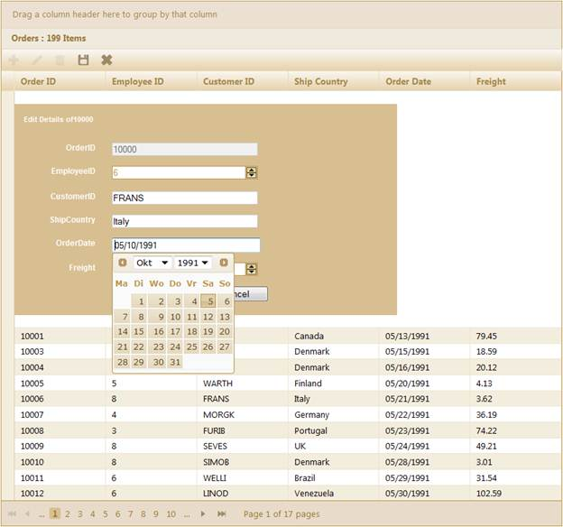
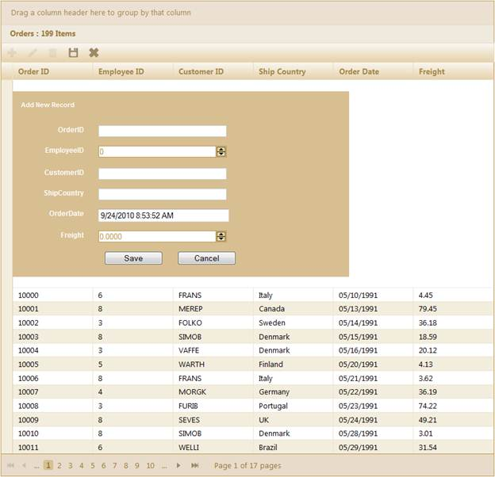
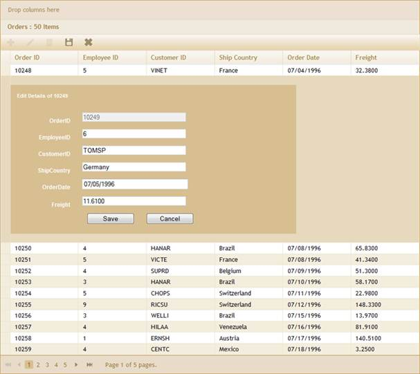
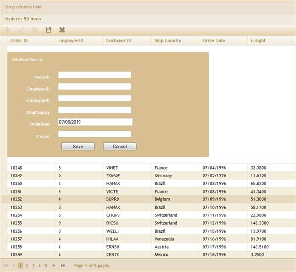

::: {style="DISPLAY: none"}
{#d2h_url_template}{#d2h_package_url style="WIDTH: 0px; DISPLAY: none; HEIGHT: 0px"}
:::

:::: {.d2h_secondary_topic style="PADDING-BOTTOM: 10pt; MARGIN: 0pt; PADDING-LEFT: 0pt; PADDING-RIGHT: 0pt; PADDING-TOP: 0pt"}
##### Grid EditMode Configuration {#grid-editmode-configuration style="tab-stops: 0pt"}

 

[·      ]{style="FONT-FAMILY: Symbol"}Essential Grid provides three modes for editing. To set the edit form mode of editing, use the **EditMode()** method.

 

+---------------------------------------------------------------------------------------------------------------------------------------------------------------------------------------------------------------------------------------------------------------+
| **[View \[ASPX\]]{style="FONT-FAMILY: 'Courier New'"}**                                                                                                                                                                                                       |
|                                                                                                                                                                                                                                                               |
| [\<%]{style="FONT-FAMILY: 'Courier New'; BACKGROUND: yellow"}[=]{style="FONT-FAMILY: 'Courier New'; COLOR: blue"}[Html.Syncfusion().Grid\<[EditableOrder]{style="COLOR: #2b91af"}\>([\"Grid1\"]{style="COLOR: #a31515"})]{style="FONT-FAMILY: 'Courier New'"} |
|                                                                                                                                                                                                                                                               |
| [                         .Datasource(Model)]{style="FONT-FAMILY: 'Courier New'"}                                                                                                                                                                             |
|                                                                                                                                                                                                                                                               |
| [                         .Caption([\"Orders\"]{style="COLOR: #a31515"})                         ]{style="FONT-FAMILY: 'Courier New'"}                                                                                                                        |
|                                                                                                                                                                                                                                                               |
| [                        .Editing( edit=\>{]{style="FONT-FAMILY: 'Courier New'"}                                                                                                                                                                              |
|                                                                                                                                                                                                                                                               |
| **[edit.EditMode([GridEditMode]{style="COLOR: #2b91af"}.InlineForm);]{style="FONT-FAMILY: 'Courier New'"}**                                                                                                                                                   |
|                                                                                                                                                                                                                                                               |
| [                                                ]{style="FONT-FAMILY: 'Courier New'"}                                                                                                                                                                        |
|                                                                                                                                                                                                                                                               |
| [                        })                      ]{style="FONT-FAMILY: 'Courier New'"}                                                                                                                                                                        |
|                                                                                                                                                                                                                                                               |
| [    [%\>]{style="BACKGROUND: yellow"}]{style="FONT-FAMILY: 'Courier New'"}                                                                                                                                                                                   |
+---------------------------------------------------------------------------------------------------------------------------------------------------------------------------------------------------------------------------------------------------------------+

 

 

+------------------------------------------------------------------------------------------------------------------------------------------------------------------------------------------------------------+
| **[View \[cshtml\]]{style="FONT-FAMILY: 'Courier New'"}**                                                                                                                                                  |
|                                                                                                                                                                                                            |
| [\@{]{style="FONT-FAMILY: 'Courier New'; BACKGROUND: yellow"}[ Html.Syncfusion().Grid\<[EditableOrder]{style="COLOR: #2b91af"}\>([\"Grid1\"]{style="COLOR: #a31515"})]{style="FONT-FAMILY: 'Courier New'"} |
|                                                                                                                                                                                                            |
| [                         .Datasource(Model)]{style="FONT-FAMILY: 'Courier New'"}                                                                                                                          |
|                                                                                                                                                                                                            |
| [                         .Caption([\"Orders\"]{style="COLOR: #a31515"})                         ]{style="FONT-FAMILY: 'Courier New'"}                                                                     |
|                                                                                                                                                                                                            |
| [                        .Editing( edit=\>{]{style="FONT-FAMILY: 'Courier New'"}                                                                                                                           |
|                                                                                                                                                                                                            |
| **[edit.EditMode([GridEditMode]{style="COLOR: #2b91af"}.InlineForm);]{style="FONT-FAMILY: 'Courier New'"}**                                                                                                |
|                                                                                                                                                                                                            |
| [                                                ]{style="FONT-FAMILY: 'Courier New'"}                                                                                                                     |
|                                                                                                                                                                                                            |
| [                        }).Render();                     ]{style="FONT-FAMILY: 'Courier New'"}                                                                                                            |
|                                                                                                                                                                                                            |
| [    [}]{style="BACKGROUND: yellow"}]{style="FONT-FAMILY: 'Courier New'"}                                                                                                                                  |
+------------------------------------------------------------------------------------------------------------------------------------------------------------------------------------------------------------+

 

If you configure the edit mode as **EditForm**, the grid will appear in the editing mode displayed below.

{border="0"}

Figure 141: Grid with Inline Form Editing

**[]{style="FONT-FAMILY: 'Myriad Pro','sans-serif'"}** 

{border="0"}

Figure 142: Grid with Inline Form Insert Mode

 

10.  If you want to use the **TemplateForm** mode, follow the steps displayed below.

 

[·      ]{style="FONT-FAMILY: Symbol"}Create the template in partial view, as displayed below.

 

+--------------------------------------------------------------------------------------------------------------------------------------------------------------------------------------------------------------------------------------------------------------------------------------------------------------+
| **[View \[ASCX\]]{style="FONT-FAMILY: 'Courier New'"}**                                                                                                                                                                                                                                                      |
|                                                                                                                                                                                                                                                                                                              |
| []{style="FONT-FAMILY: 'Courier New'; COLOR: blue"}                                                                                                                                                                                                                                                          |
|                                                                                                                                                                                                                                                                                                              |
| [\<]{style="FONT-FAMILY: 'Courier New'; COLOR: blue"}[fieldset]{style="FONT-FAMILY: 'Courier New'; COLOR: maroon"}[\>]{style="FONT-FAMILY: 'Courier New'; COLOR: blue"}[]{style="FONT-FAMILY: 'Courier New'"}                                                                                                |
|                                                                                                                                                                                                                                                                                                              |
| [    [\<]{style="COLOR: blue"}[legend]{style="COLOR: maroon"}[\>]{style="COLOR: blue"}Fields[\</]{style="COLOR: blue"}[legend]{style="COLOR: maroon"}[\>]{style="COLOR: blue"}]{style="FONT-FAMILY: 'Courier New'"}                                                                                          |
|                                                                                                                                                                                                                                                                                                              |
| [    [\<]{style="COLOR: blue"}[div]{style="COLOR: maroon"} [class]{style="COLOR: red"}[=\"tablediv\"\>]{style="COLOR: blue"}]{style="FONT-FAMILY: 'Courier New'"}                                                                                                                                            |
|                                                                                                                                                                                                                                                                                                              |
| [        [\<]{style="COLOR: blue"}[div]{style="COLOR: maroon"} [class]{style="COLOR: red"}[=\"rowdiv\"\>]{style="COLOR: blue"}]{style="FONT-FAMILY: 'Courier New'"}                                                                                                                                          |
|                                                                                                                                                                                                                                                                                                              |
| [            [\<]{style="COLOR: blue"}[div]{style="COLOR: maroon"} [class]{style="COLOR: red"}[=\"celldiv\"]{style="COLOR: blue"} [style]{style="COLOR: red"}[=\"]{style="COLOR: blue"}[height]{style="COLOR: red"}[: auto\"\>]{style="COLOR: blue"}]{style="FONT-FAMILY: 'Courier New'"}                    |
|                                                                                                                                                                                                                                                                                                              |
| [                [\<]{style="COLOR: blue"}[div]{style="COLOR: maroon"} [class]{style="COLOR: red"}[=\"editor-label\"\>]{style="COLOR: blue"}]{style="FONT-FAMILY: 'Courier New'"}                                                                                                                            |
|                                                                                                                                                                                                                                                                                                              |
| [                    [\<%]{style="BACKGROUND: yellow"}[=]{style="COLOR: blue"} Html.Syncfusion().LabelFor(model =\> model.OrderID) [%\>]{style="BACKGROUND: yellow"}]{style="FONT-FAMILY: 'Courier New'"}                                                                                                    |
|                                                                                                                                                                                                                                                                                                              |
| [                [\</]{style="COLOR: blue"}[div]{style="COLOR: maroon"}[\>]{style="COLOR: blue"}]{style="FONT-FAMILY: 'Courier New'"}                                                                                                                                                                        |
|                                                                                                                                                                                                                                                                                                              |
| [                [\<]{style="COLOR: blue"}[div]{style="COLOR: maroon"} [class]{style="COLOR: red"}[=\"editor-field\"\>]{style="COLOR: blue"}]{style="FONT-FAMILY: 'Courier New'"}                                                                                                                            |
|                                                                                                                                                                                                                                                                                                              |
| [                    [\<%]{style="BACKGROUND: yellow"}[=]{style="COLOR: blue"} Html.Syncfusion().TextBoxFor(model =\> model.OrderID) [%\>]{style="BACKGROUND: yellow"}]{style="FONT-FAMILY: 'Courier New'"}                                                                                                  |
|                                                                                                                                                                                                                                                                                                              |
| [                    [\<%]{style="BACKGROUND: yellow"}[=]{style="COLOR: blue"} Html.Syncfusion().ValidationMessageFor(model =\> model.OrderID) [%\>]{style="BACKGROUND: yellow"}]{style="FONT-FAMILY: 'Courier New'"}                                                                                        |
|                                                                                                                                                                                                                                                                                                              |
| [                [\</]{style="COLOR: blue"}[div]{style="COLOR: maroon"}[\>]{style="COLOR: blue"}]{style="FONT-FAMILY: 'Courier New'"}                                                                                                                                                                        |
|                                                                                                                                                                                                                                                                                                              |
| [            [\</]{style="COLOR: blue"}[div]{style="COLOR: maroon"}[\>]{style="COLOR: blue"}]{style="FONT-FAMILY: 'Courier New'"}                                                                                                                                                                            |
|                                                                                                                                                                                                                                                                                                              |
| [            [\<]{style="COLOR: blue"}[div]{style="COLOR: maroon"} [class]{style="COLOR: red"}[=\"celldiv\"]{style="COLOR: blue"} [style]{style="COLOR: red"}[=\"]{style="COLOR: blue"}[height]{style="COLOR: red"}[: auto\"\>]{style="COLOR: blue"}]{style="FONT-FAMILY: 'Courier New'"}                    |
|                                                                                                                                                                                                                                                                                                              |
| [                [\<]{style="COLOR: blue"}[div]{style="COLOR: maroon"} [class]{style="COLOR: red"}[=\"editor-label\"\>]{style="COLOR: blue"}]{style="FONT-FAMILY: 'Courier New'"}                                                                                                                            |
|                                                                                                                                                                                                                                                                                                              |
| [                    [\<%]{style="BACKGROUND: yellow"}[=]{style="COLOR: blue"} Html.Syncfusion().LabelFor(model =\> model.CustomerID) [%\>]{style="BACKGROUND: yellow"}]{style="FONT-FAMILY: 'Courier New'"}                                                                                                 |
|                                                                                                                                                                                                                                                                                                              |
| [                [\</]{style="COLOR: blue"}[div]{style="COLOR: maroon"}[\>]{style="COLOR: blue"}]{style="FONT-FAMILY: 'Courier New'"}                                                                                                                                                                        |
|                                                                                                                                                                                                                                                                                                              |
| [                [\<]{style="COLOR: blue"}[div]{style="COLOR: maroon"} [class]{style="COLOR: red"}[=\"editor-field\"\>]{style="COLOR: blue"}]{style="FONT-FAMILY: 'Courier New'"}                                                                                                                            |
|                                                                                                                                                                                                                                                                                                              |
| [                    [\<%]{style="BACKGROUND: yellow"}[=]{style="COLOR: blue"} Html.Syncfusion().TextBoxFor(model =\> model.CustomerID) [%\>]{style="BACKGROUND: yellow"}]{style="FONT-FAMILY: 'Courier New'"}                                                                                               |
|                                                                                                                                                                                                                                                                                                              |
| [                    [\<%]{style="BACKGROUND: yellow"}[=]{style="COLOR: blue"} Html.Syncfusion().ValidationMessageFor(model =\> model.CustomerID) [%\>]{style="BACKGROUND: yellow"}]{style="FONT-FAMILY: 'Courier New'"}                                                                                     |
|                                                                                                                                                                                                                                                                                                              |
| [                [\</]{style="COLOR: blue"}[div]{style="COLOR: maroon"}[\>]{style="COLOR: blue"}]{style="FONT-FAMILY: 'Courier New'"}                                                                                                                                                                        |
|                                                                                                                                                                                                                                                                                                              |
| [            [\</]{style="COLOR: blue"}[div]{style="COLOR: maroon"}[\>]{style="COLOR: blue"}]{style="FONT-FAMILY: 'Courier New'"}                                                                                                                                                                            |
|                                                                                                                                                                                                                                                                                                              |
| [        [\</]{style="COLOR: blue"}[div]{style="COLOR: maroon"}[\>]{style="COLOR: blue"}]{style="FONT-FAMILY: 'Courier New'"}                                                                                                                                                                                |
|                                                                                                                                                                                                                                                                                                              |
| [        [\<]{style="COLOR: blue"}[div]{style="COLOR: maroon"} [class]{style="COLOR: red"}[=\"rowdiv\"\>]{style="COLOR: blue"}]{style="FONT-FAMILY: 'Courier New'"}                                                                                                                                          |
|                                                                                                                                                                                                                                                                                                              |
| [            [\<]{style="COLOR: blue"}[div]{style="COLOR: maroon"} [class]{style="COLOR: red"}[=\"celldiv\"]{style="COLOR: blue"} [style]{style="COLOR: red"}[=\"]{style="COLOR: blue"}[height]{style="COLOR: red"}[: auto\"\>]{style="COLOR: blue"}]{style="FONT-FAMILY: 'Courier New'"}                    |
|                                                                                                                                                                                                                                                                                                              |
| [                [\<]{style="COLOR: blue"}[div]{style="COLOR: maroon"} [class]{style="COLOR: red"}[=\"editor-label\"\>]{style="COLOR: blue"}]{style="FONT-FAMILY: 'Courier New'"}                                                                                                                            |
|                                                                                                                                                                                                                                                                                                              |
| [                    [\<%]{style="BACKGROUND: yellow"}[=]{style="COLOR: blue"} Html.Syncfusion().LabelFor(model =\> model.EmployeeID) [%\>]{style="BACKGROUND: yellow"}]{style="FONT-FAMILY: 'Courier New'"}                                                                                                 |
|                                                                                                                                                                                                                                                                                                              |
| [                [\</]{style="COLOR: blue"}[div]{style="COLOR: maroon"}[\>]{style="COLOR: blue"}]{style="FONT-FAMILY: 'Courier New'"}                                                                                                                                                                        |
|                                                                                                                                                                                                                                                                                                              |
| [                [\<]{style="COLOR: blue"}[div]{style="COLOR: maroon"} [class]{style="COLOR: red"}[=\"editor-field\"\>]{style="COLOR: blue"}]{style="FONT-FAMILY: 'Courier New'"}                                                                                                                            |
|                                                                                                                                                                                                                                                                                                              |
| [                    [\<%]{style="BACKGROUND: yellow"}[=]{style="COLOR: blue"} Html.Syncfusion().TextBoxFor(model =\> model.EmployeeID) [%\>]{style="BACKGROUND: yellow"}]{style="FONT-FAMILY: 'Courier New'"}                                                                                               |
|                                                                                                                                                                                                                                                                                                              |
| [                    [\<%]{style="BACKGROUND: yellow"}[=]{style="COLOR: blue"} Html.Syncfusion().ValidationMessageFor(model =\> model.EmployeeID) [%\>]{style="BACKGROUND: yellow"}]{style="FONT-FAMILY: 'Courier New'"}                                                                                     |
|                                                                                                                                                                                                                                                                                                              |
| [                [\</]{style="COLOR: blue"}[div]{style="COLOR: maroon"}[\>]{style="COLOR: blue"}]{style="FONT-FAMILY: 'Courier New'"}                                                                                                                                                                        |
|                                                                                                                                                                                                                                                                                                              |
| [            [\</]{style="COLOR: blue"}[div]{style="COLOR: maroon"}[\>]{style="COLOR: blue"}]{style="FONT-FAMILY: 'Courier New'"}                                                                                                                                                                            |
|                                                                                                                                                                                                                                                                                                              |
| [            [\<]{style="COLOR: blue"}[div]{style="COLOR: maroon"} [class]{style="COLOR: red"}[=\"celldiv\"]{style="COLOR: blue"} [style]{style="COLOR: red"}[=\"]{style="COLOR: blue"}[height]{style="COLOR: red"}[: auto\"\>]{style="COLOR: blue"}]{style="FONT-FAMILY: 'Courier New'"}                    |
|                                                                                                                                                                                                                                                                                                              |
| [                [\<]{style="COLOR: blue"}[div]{style="COLOR: maroon"} [class]{style="COLOR: red"}[=\"editor-label\"\>]{style="COLOR: blue"}]{style="FONT-FAMILY: 'Courier New'"}                                                                                                                            |
|                                                                                                                                                                                                                                                                                                              |
| [                    [\<%]{style="BACKGROUND: yellow"}[=]{style="COLOR: blue"} Html.Syncfusion().LabelFor(model =\> model.ShipName) [%\>]{style="BACKGROUND: yellow"}]{style="FONT-FAMILY: 'Courier New'"}                                                                                                   |
|                                                                                                                                                                                                                                                                                                              |
| [                [\</]{style="COLOR: blue"}[div]{style="COLOR: maroon"}[\>]{style="COLOR: blue"}]{style="FONT-FAMILY: 'Courier New'"}                                                                                                                                                                        |
|                                                                                                                                                                                                                                                                                                              |
| [                [\<]{style="COLOR: blue"}[div]{style="COLOR: maroon"} [class]{style="COLOR: red"}[=\"editor-field\"\>]{style="COLOR: blue"}]{style="FONT-FAMILY: 'Courier New'"}                                                                                                                            |
|                                                                                                                                                                                                                                                                                                              |
| [                    [\<%]{style="BACKGROUND: yellow"}[=]{style="COLOR: blue"} Html.Syncfusion().TextBoxFor(model =\> model.ShipName) [%\>]{style="BACKGROUND: yellow"}]{style="FONT-FAMILY: 'Courier New'"}                                                                                                 |
|                                                                                                                                                                                                                                                                                                              |
| [                    [\<%]{style="BACKGROUND: yellow"}[=]{style="COLOR: blue"} Html.Syncfusion().ValidationMessageFor(model =\> model.ShipName) [%\>]{style="BACKGROUND: yellow"}]{style="FONT-FAMILY: 'Courier New'"}                                                                                       |
|                                                                                                                                                                                                                                                                                                              |
| [                [\</]{style="COLOR: blue"}[div]{style="COLOR: maroon"}[\>]{style="COLOR: blue"}]{style="FONT-FAMILY: 'Courier New'"}                                                                                                                                                                        |
|                                                                                                                                                                                                                                                                                                              |
| [            [\</]{style="COLOR: blue"}[div]{style="COLOR: maroon"}[\>]{style="COLOR: blue"}]{style="FONT-FAMILY: 'Courier New'"}                                                                                                                                                                            |
|                                                                                                                                                                                                                                                                                                              |
| [        [\</]{style="COLOR: blue"}[div]{style="COLOR: maroon"}[\>]{style="COLOR: blue"}]{style="FONT-FAMILY: 'Courier New'"}                                                                                                                                                                                |
|                                                                                                                                                                                                                                                                                                              |
| [        [\<]{style="COLOR: blue"}[div]{style="COLOR: maroon"} [class]{style="COLOR: red"}[=\"rowdiv\"\>]{style="COLOR: blue"}]{style="FONT-FAMILY: 'Courier New'"}                                                                                                                                          |
|                                                                                                                                                                                                                                                                                                              |
| [            [\<]{style="COLOR: blue"}[div]{style="COLOR: maroon"} [class]{style="COLOR: red"}[=\"celldiv\"]{style="COLOR: blue"} [style]{style="COLOR: red"}[=\"]{style="COLOR: blue"}[height]{style="COLOR: red"}[: auto\"\>]{style="COLOR: blue"}]{style="FONT-FAMILY: 'Courier New'"}                    |
|                                                                                                                                                                                                                                                                                                              |
| [                [\<]{style="COLOR: blue"}[div]{style="COLOR: maroon"} [class]{style="COLOR: red"}[=\"editor-label\"\>]{style="COLOR: blue"}]{style="FONT-FAMILY: 'Courier New'"}                                                                                                                            |
|                                                                                                                                                                                                                                                                                                              |
| [                    [\<%]{style="BACKGROUND: yellow"}[=]{style="COLOR: blue"} Html.Syncfusion().LabelFor(model =\> model.ShipAddress) [%\>]{style="BACKGROUND: yellow"}]{style="FONT-FAMILY: 'Courier New'"}                                                                                                |
|                                                                                                                                                                                                                                                                                                              |
| [                [\</]{style="COLOR: blue"}[div]{style="COLOR: maroon"}[\>]{style="COLOR: blue"}]{style="FONT-FAMILY: 'Courier New'"}                                                                                                                                                                        |
|                                                                                                                                                                                                                                                                                                              |
| [                [\<]{style="COLOR: blue"}[div]{style="COLOR: maroon"} [class]{style="COLOR: red"}[=\"editor-field\"\>]{style="COLOR: blue"}]{style="FONT-FAMILY: 'Courier New'"}                                                                                                                            |
|                                                                                                                                                                                                                                                                                                              |
| [                    [\<%]{style="BACKGROUND: yellow"}[=]{style="COLOR: blue"} Html.Syncfusion().TextBoxFor(model =\> model.ShipAddress) [%\>]{style="BACKGROUND: yellow"}]{style="FONT-FAMILY: 'Courier New'"}                                                                                              |
|                                                                                                                                                                                                                                                                                                              |
| [                    [\<%]{style="BACKGROUND: yellow"}[=]{style="COLOR: blue"} Html.Syncfusion().ValidationMessageFor(model =\> model.ShipAddress) [%\>]{style="BACKGROUND: yellow"}]{style="FONT-FAMILY: 'Courier New'"}                                                                                    |
|                                                                                                                                                                                                                                                                                                              |
| [                [\</]{style="COLOR: blue"}[div]{style="COLOR: maroon"}[\>]{style="COLOR: blue"}]{style="FONT-FAMILY: 'Courier New'"}                                                                                                                                                                        |
|                                                                                                                                                                                                                                                                                                              |
| [            [\</]{style="COLOR: blue"}[div]{style="COLOR: maroon"}[\>]{style="COLOR: blue"}]{style="FONT-FAMILY: 'Courier New'"}                                                                                                                                                                            |
|                                                                                                                                                                                                                                                                                                              |
| [            [\<]{style="COLOR: blue"}[div]{style="COLOR: maroon"} [class]{style="COLOR: red"}[=\"celldiv\"]{style="COLOR: blue"} [style]{style="COLOR: red"}[=\"]{style="COLOR: blue"}[height]{style="COLOR: red"}[: auto\"\>]{style="COLOR: blue"}]{style="FONT-FAMILY: 'Courier New'"}                    |
|                                                                                                                                                                                                                                                                                                              |
| [                [\<]{style="COLOR: blue"}[div]{style="COLOR: maroon"} [class]{style="COLOR: red"}[=\"editor-label\"\>]{style="COLOR: blue"}]{style="FONT-FAMILY: 'Courier New'"}                                                                                                                            |
|                                                                                                                                                                                                                                                                                                              |
| [                    [\<%]{style="BACKGROUND: yellow"}[=]{style="COLOR: blue"} Html.Syncfusion().LabelFor(model =\> model.ShipCity) [%\>]{style="BACKGROUND: yellow"}]{style="FONT-FAMILY: 'Courier New'"}                                                                                                   |
|                                                                                                                                                                                                                                                                                                              |
| [                [\</]{style="COLOR: blue"}[div]{style="COLOR: maroon"}[\>]{style="COLOR: blue"}]{style="FONT-FAMILY: 'Courier New'"}                                                                                                                                                                        |
|                                                                                                                                                                                                                                                                                                              |
| [                [\<]{style="COLOR: blue"}[div]{style="COLOR: maroon"} [class]{style="COLOR: red"}[=\"editor-field\"\>]{style="COLOR: blue"}]{style="FONT-FAMILY: 'Courier New'"}                                                                                                                            |
|                                                                                                                                                                                                                                                                                                              |
| [                    [\<%]{style="BACKGROUND: yellow"}[=]{style="COLOR: blue"} Html.Syncfusion().TextBoxFor(model =\> model.ShipCity) [%\>]{style="BACKGROUND: yellow"}]{style="FONT-FAMILY: 'Courier New'"}                                                                                                 |
|                                                                                                                                                                                                                                                                                                              |
| [                    [\<%]{style="BACKGROUND: yellow"}[=]{style="COLOR: blue"} Html.Syncfusion().ValidationMessageFor(model =\> model.ShipCity) [%\>]{style="BACKGROUND: yellow"}]{style="FONT-FAMILY: 'Courier New'"}                                                                                       |
|                                                                                                                                                                                                                                                                                                              |
| [                [\</]{style="COLOR: blue"}[div]{style="COLOR: maroon"}[\>]{style="COLOR: blue"}]{style="FONT-FAMILY: 'Courier New'"}                                                                                                                                                                        |
|                                                                                                                                                                                                                                                                                                              |
| [            [\</]{style="COLOR: blue"}[div]{style="COLOR: maroon"}[\>]{style="COLOR: blue"}]{style="FONT-FAMILY: 'Courier New'"}                                                                                                                                                                            |
|                                                                                                                                                                                                                                                                                                              |
| [        [\</]{style="COLOR: blue"}[div]{style="COLOR: maroon"}[\>]{style="COLOR: blue"}]{style="FONT-FAMILY: 'Courier New'"}                                                                                                                                                                                |
|                                                                                                                                                                                                                                                                                                              |
| [        [\<]{style="COLOR: blue"}[div]{style="COLOR: maroon"} [class]{style="COLOR: red"}[=\"rowdiv\"\>]{style="COLOR: blue"}]{style="FONT-FAMILY: 'Courier New'"}                                                                                                                                          |
|                                                                                                                                                                                                                                                                                                              |
| [            [\<]{style="COLOR: blue"}[div]{style="COLOR: maroon"} [class]{style="COLOR: red"}[=\"celldiv\"]{style="COLOR: blue"} [style]{style="COLOR: red"}[=\"]{style="COLOR: blue"}[height]{style="COLOR: red"}[: auto\"\>]{style="COLOR: blue"}]{style="FONT-FAMILY: 'Courier New'"}                    |
|                                                                                                                                                                                                                                                                                                              |
| [                [\<]{style="COLOR: blue"}[div]{style="COLOR: maroon"} [class]{style="COLOR: red"}[=\"editor-label\"\>]{style="COLOR: blue"}]{style="FONT-FAMILY: 'Courier New'"}                                                                                                                            |
|                                                                                                                                                                                                                                                                                                              |
| [                    [\<%]{style="BACKGROUND: yellow"}[=]{style="COLOR: blue"} Html.Syncfusion().LabelFor(model =\> model.ShipRegion) [%\>]{style="BACKGROUND: yellow"}]{style="FONT-FAMILY: 'Courier New'"}                                                                                                 |
|                                                                                                                                                                                                                                                                                                              |
| [                [\</]{style="COLOR: blue"}[div]{style="COLOR: maroon"}[\>]{style="COLOR: blue"}]{style="FONT-FAMILY: 'Courier New'"}                                                                                                                                                                        |
|                                                                                                                                                                                                                                                                                                              |
| [                [\<]{style="COLOR: blue"}[div]{style="COLOR: maroon"} [class]{style="COLOR: red"}[=\"editor-field\"\>]{style="COLOR: blue"}]{style="FONT-FAMILY: 'Courier New'"}                                                                                                                            |
|                                                                                                                                                                                                                                                                                                              |
| [                    [\<%]{style="BACKGROUND: yellow"}[=]{style="COLOR: blue"} Html.Syncfusion().TextBoxFor(model =\> model.ShipRegion) [%\>]{style="BACKGROUND: yellow"}]{style="FONT-FAMILY: 'Courier New'"}                                                                                               |
|                                                                                                                                                                                                                                                                                                              |
| [                    [\<%]{style="BACKGROUND: yellow"}[=]{style="COLOR: blue"} Html.Syncfusion().ValidationMessageFor(model =\> model.ShipRegion) [%\>]{style="BACKGROUND: yellow"}]{style="FONT-FAMILY: 'Courier New'"}                                                                                     |
|                                                                                                                                                                                                                                                                                                              |
| [                [\</]{style="COLOR: blue"}[div]{style="COLOR: maroon"}[\>]{style="COLOR: blue"}]{style="FONT-FAMILY: 'Courier New'"}                                                                                                                                                                        |
|                                                                                                                                                                                                                                                                                                              |
| [            [\</]{style="COLOR: blue"}[div]{style="COLOR: maroon"}[\>]{style="COLOR: blue"}]{style="FONT-FAMILY: 'Courier New'"}                                                                                                                                                                            |
|                                                                                                                                                                                                                                                                                                              |
| [            [\<]{style="COLOR: blue"}[div]{style="COLOR: maroon"} [class]{style="COLOR: red"}[=\"celldiv\"]{style="COLOR: blue"} [style]{style="COLOR: red"}[=\"]{style="COLOR: blue"}[height]{style="COLOR: red"}[: auto\"\>]{style="COLOR: blue"}]{style="FONT-FAMILY: 'Courier New'"}                    |
|                                                                                                                                                                                                                                                                                                              |
| [                [\<]{style="COLOR: blue"}[div]{style="COLOR: maroon"} [class]{style="COLOR: red"}[=\"editor-label\"\>]{style="COLOR: blue"}]{style="FONT-FAMILY: 'Courier New'"}                                                                                                                            |
|                                                                                                                                                                                                                                                                                                              |
| [                    [\<%]{style="BACKGROUND: yellow"}[=]{style="COLOR: blue"} Html.Syncfusion().LabelFor(model =\> model.ShipCountry) [%\>]{style="BACKGROUND: yellow"}]{style="FONT-FAMILY: 'Courier New'"}                                                                                                |
|                                                                                                                                                                                                                                                                                                              |
| [                [\</]{style="COLOR: blue"}[div]{style="COLOR: maroon"}[\>]{style="COLOR: blue"}]{style="FONT-FAMILY: 'Courier New'"}                                                                                                                                                                        |
|                                                                                                                                                                                                                                                                                                              |
| [                [\<]{style="COLOR: blue"}[div]{style="COLOR: maroon"} [class]{style="COLOR: red"}[=\"editor-field\"\>]{style="COLOR: blue"}]{style="FONT-FAMILY: 'Courier New'"}                                                                                                                            |
|                                                                                                                                                                                                                                                                                                              |
| [                    [\<%]{style="BACKGROUND: yellow"}[=]{style="COLOR: blue"} Html.Syncfusion().TextBoxFor(model =\> model.ShipCountry) [%\>]{style="BACKGROUND: yellow"}]{style="FONT-FAMILY: 'Courier New'"}                                                                                              |
|                                                                                                                                                                                                                                                                                                              |
| [                    [\<%]{style="BACKGROUND: yellow"}[=]{style="COLOR: blue"} Html.Syncfusion().ValidationMessageFor(model =\> model.ShipCountry) [%\>]{style="BACKGROUND: yellow"}]{style="FONT-FAMILY: 'Courier New'"}                                                                                    |
|                                                                                                                                                                                                                                                                                                              |
| [                [\</]{style="COLOR: blue"}[div]{style="COLOR: maroon"}[\>]{style="COLOR: blue"}]{style="FONT-FAMILY: 'Courier New'"}                                                                                                                                                                        |
|                                                                                                                                                                                                                                                                                                              |
| [            [\</]{style="COLOR: blue"}[div]{style="COLOR: maroon"}[\>]{style="COLOR: blue"}]{style="FONT-FAMILY: 'Courier New'"}                                                                                                                                                                            |
|                                                                                                                                                                                                                                                                                                              |
| [        [\</]{style="COLOR: blue"}[div]{style="COLOR: maroon"}[\>]{style="COLOR: blue"}]{style="FONT-FAMILY: 'Courier New'"}                                                                                                                                                                                |
|                                                                                                                                                                                                                                                                                                              |
| [        [\<]{style="COLOR: blue"}[div]{style="COLOR: maroon"} [class]{style="COLOR: red"}[=\"rowdiv\"\>]{style="COLOR: blue"}]{style="FONT-FAMILY: 'Courier New'"}                                                                                                                                          |
|                                                                                                                                                                                                                                                                                                              |
| [            [\<]{style="COLOR: blue"}[div]{style="COLOR: maroon"} [class]{style="COLOR: red"}[=\"celldiv\"]{style="COLOR: blue"} [style]{style="COLOR: red"}[=\"]{style="COLOR: blue"}[height]{style="COLOR: red"}[: auto\"\>]{style="COLOR: blue"}]{style="FONT-FAMILY: 'Courier New'"}                    |
|                                                                                                                                                                                                                                                                                                              |
| [                [\<]{style="COLOR: blue"}[div]{style="COLOR: maroon"} [class]{style="COLOR: red"}[=\"editor-label\"\>]{style="COLOR: blue"}]{style="FONT-FAMILY: 'Courier New'"}                                                                                                                            |
|                                                                                                                                                                                                                                                                                                              |
| [                    [\<%]{style="BACKGROUND: yellow"}[=]{style="COLOR: blue"} Html.Syncfusion().LabelFor(model =\> model.Freight) [%\>]{style="BACKGROUND: yellow"}]{style="FONT-FAMILY: 'Courier New'"}                                                                                                    |
|                                                                                                                                                                                                                                                                                                              |
| [                [\</]{style="COLOR: blue"}[div]{style="COLOR: maroon"}[\>]{style="COLOR: blue"}]{style="FONT-FAMILY: 'Courier New'"}                                                                                                                                                                        |
|                                                                                                                                                                                                                                                                                                              |
| [                [\<]{style="COLOR: blue"}[div]{style="COLOR: maroon"} [class]{style="COLOR: red"}[=\"editor-field\"\>]{style="COLOR: blue"}]{style="FONT-FAMILY: 'Courier New'"}                                                                                                                            |
|                                                                                                                                                                                                                                                                                                              |
| [                    [\<%]{style="BACKGROUND: yellow"}[=]{style="COLOR: blue"} Html.Syncfusion().TextBoxFor(model =\> model.Freight) [%\>]{style="BACKGROUND: yellow"}]{style="FONT-FAMILY: 'Courier New'"}                                                                                                  |
|                                                                                                                                                                                                                                                                                                              |
| [                    [\<%]{style="BACKGROUND: yellow"}[=]{style="COLOR: blue"} Html.Syncfusion().ValidationMessageFor(model =\> model.Freight) [%\>]{style="BACKGROUND: yellow"}]{style="FONT-FAMILY: 'Courier New'"}                                                                                        |
|                                                                                                                                                                                                                                                                                                              |
| [                [\</]{style="COLOR: blue"}[div]{style="COLOR: maroon"}[\>]{style="COLOR: blue"}]{style="FONT-FAMILY: 'Courier New'"}                                                                                                                                                                        |
|                                                                                                                                                                                                                                                                                                              |
| [            [\</]{style="COLOR: blue"}[div]{style="COLOR: maroon"}[\>]{style="COLOR: blue"}]{style="FONT-FAMILY: 'Courier New'"}                                                                                                                                                                            |
|                                                                                                                                                                                                                                                                                                              |
| [            [\<]{style="COLOR: blue"}[div]{style="COLOR: maroon"} [class]{style="COLOR: red"}[=\"celldiv\"]{style="COLOR: blue"} [style]{style="COLOR: red"}[=\"]{style="COLOR: blue"}[height]{style="COLOR: red"}[: auto\"\>]{style="COLOR: blue"}]{style="FONT-FAMILY: 'Courier New'"}                    |
|                                                                                                                                                                                                                                                                                                              |
| [                [\<]{style="COLOR: blue"}[div]{style="COLOR: maroon"} [class]{style="COLOR: red"}[=\"editor-label\"\>]{style="COLOR: blue"}]{style="FONT-FAMILY: 'Courier New'"}                                                                                                                            |
|                                                                                                                                                                                                                                                                                                              |
| [                    [\<%]{style="BACKGROUND: yellow"}[=]{style="COLOR: blue"} Html.Syncfusion().LabelFor(model =\> model.OrderDate) [%\>]{style="BACKGROUND: yellow"}]{style="FONT-FAMILY: 'Courier New'"}                                                                                                  |
|                                                                                                                                                                                                                                                                                                              |
| [                [\</]{style="COLOR: blue"}[div]{style="COLOR: maroon"}[\>]{style="COLOR: blue"}]{style="FONT-FAMILY: 'Courier New'"}                                                                                                                                                                        |
|                                                                                                                                                                                                                                                                                                              |
| [                [\<]{style="COLOR: blue"}[div]{style="COLOR: maroon"} [class]{style="COLOR: red"}[=\"editor-field\"\>]{style="COLOR: blue"}]{style="FONT-FAMILY: 'Courier New'"}                                                                                                                            |
|                                                                                                                                                                                                                                                                                                              |
| [                    [\<%]{style="BACKGROUND: yellow"}[=]{style="COLOR: blue"} Html.Syncfusion().TextBoxFor(model =\> model.OrderDate, [String]{style="COLOR: #2b91af"}.Format([\"{0:g}\"]{style="COLOR: #a31515"}, Model.OrderDate)) [%\>]{style="BACKGROUND: yellow"}]{style="FONT-FAMILY: 'Courier New'"} |
|                                                                                                                                                                                                                                                                                                              |
| [                    [\<%]{style="BACKGROUND: yellow"}[=]{style="COLOR: blue"} Html.Syncfusion().ValidationMessageFor(model =\> model.OrderDate) [%\>]{style="BACKGROUND: yellow"}]{style="FONT-FAMILY: 'Courier New'"}                                                                                      |
|                                                                                                                                                                                                                                                                                                              |
| [                [\</]{style="COLOR: blue"}[div]{style="COLOR: maroon"}[\>]{style="COLOR: blue"}]{style="FONT-FAMILY: 'Courier New'"}                                                                                                                                                                        |
|                                                                                                                                                                                                                                                                                                              |
| [            [\</]{style="COLOR: blue"}[div]{style="COLOR: maroon"}[\>]{style="COLOR: blue"}]{style="FONT-FAMILY: 'Courier New'"}                                                                                                                                                                            |
|                                                                                                                                                                                                                                                                                                              |
| [        [\</]{style="COLOR: blue"}[div]{style="COLOR: maroon"}[\>]{style="COLOR: blue"}]{style="FONT-FAMILY: 'Courier New'"}                                                                                                                                                                                |
|                                                                                                                                                                                                                                                                                                              |
| [    [\</]{style="COLOR: blue"}[div]{style="COLOR: maroon"}[\>]{style="COLOR: blue"}]{style="FONT-FAMILY: 'Courier New'"}                                                                                                                                                                                    |
|                                                                                                                                                                                                                                                                                                              |
| [\</]{style="FONT-FAMILY: 'Courier New'; COLOR: blue"}[fieldset]{style="FONT-FAMILY: 'Courier New'; COLOR: maroon"}[\>]{style="FONT-FAMILY: 'Courier New'; COLOR: blue"}[]{style="FONT-FAMILY: 'Courier New'"}                                                                                               |
+--------------------------------------------------------------------------------------------------------------------------------------------------------------------------------------------------------------------------------------------------------------------------------------------------------------+

[]{style="FONT-FAMILY: Consolas; COLOR: blue; FONT-SIZE: 9.5pt"} 

[]{style="FONT-FAMILY: Consolas; COLOR: blue; FONT-SIZE: 9.5pt"} 

 

+-------------------------------------------------------------------------------------------------------------------------------------------------------------------------------------------------------------------------------------------------------------------------------------------+
| **[View \[Razor\]]{style="FONT-FAMILY: 'Courier New'"}**                                                                                                                                                                                                                                  |
|                                                                                                                                                                                                                                                                                           |
| [\<]{style="FONT-FAMILY: 'Courier New'; COLOR: blue"}[fieldset]{style="FONT-FAMILY: 'Courier New'; COLOR: maroon"}[\>]{style="FONT-FAMILY: 'Courier New'; COLOR: blue"}[]{style="FONT-FAMILY: 'Courier New'"}                                                                             |
|                                                                                                                                                                                                                                                                                           |
| [ [\<]{style="COLOR: blue"}[legend]{style="COLOR: maroon"}[\>]{style="COLOR: blue"}Fields[\</]{style="COLOR: blue"}[legend]{style="COLOR: maroon"}[\>]{style="COLOR: blue"}]{style="FONT-FAMILY: 'Courier New'"}                                                                          |
|                                                                                                                                                                                                                                                                                           |
| [   [\<]{style="COLOR: blue"}[div]{style="COLOR: maroon"} [class]{style="COLOR: red"}[=\"tablediv\"\>]{style="COLOR: blue"}]{style="FONT-FAMILY: 'Courier New'"}                                                                                                                          |
|                                                                                                                                                                                                                                                                                           |
| [      [\<]{style="COLOR: blue"}[div]{style="COLOR: maroon"} [class]{style="COLOR: red"}[=\"rowdiv\"\>]{style="COLOR: blue"}]{style="FONT-FAMILY: 'Courier New'"}                                                                                                                         |
|                                                                                                                                                                                                                                                                                           |
| [           [\<]{style="COLOR: blue"}[div]{style="COLOR: maroon"} [class]{style="COLOR: red"}[=\"celldiv\"]{style="COLOR: blue"} [style]{style="COLOR: red"}[=\"]{style="COLOR: blue"}[height]{style="COLOR: red"}[: auto\"\>]{style="COLOR: blue"}]{style="FONT-FAMILY: 'Courier New'"}  |
|                                                                                                                                                                                                                                                                                           |
| [                [\<]{style="COLOR: blue"}[div]{style="COLOR: maroon"} [class]{style="COLOR: red"}[=\"editor-label\"\>]{style="COLOR: blue"}]{style="FONT-FAMILY: 'Courier New'"}                                                                                                         |
|                                                                                                                                                                                                                                                                                           |
| [                    [@]{style="BACKGROUND: yellow"}Html.Syncfusion().LabelFor(model =\> model.OrderID) ]{style="FONT-FAMILY: 'Courier New'"}                                                                                                                                             |
|                                                                                                                                                                                                                                                                                           |
| [                [\</]{style="COLOR: blue"}[div]{style="COLOR: maroon"}[\>]{style="COLOR: blue"}]{style="FONT-FAMILY: 'Courier New'"}                                                                                                                                                     |
|                                                                                                                                                                                                                                                                                           |
| [                [\<]{style="COLOR: blue"}[div]{style="COLOR: maroon"} [class]{style="COLOR: red"}[=\"editor-field\"\>]{style="COLOR: blue"}]{style="FONT-FAMILY: 'Courier New'"}                                                                                                         |
|                                                                                                                                                                                                                                                                                           |
| [                   [@]{style="BACKGROUND: yellow"}Html.Syncfusion().TextBoxFor(model =\> model.OrderID) ]{style="FONT-FAMILY: 'Courier New'"}                                                                                                                                            |
|                                                                                                                                                                                                                                                                                           |
| [    [@]{style="BACKGROUND: yellow"}Html.Syncfusion().ValidationMessageFor(model =\> model.OrderID) ]{style="FONT-FAMILY: 'Courier New'"}                                                                                                                                                 |
|                                                                                                                                                                                                                                                                                           |
| [   [\</]{style="COLOR: blue"}[div]{style="COLOR: maroon"}[\>]{style="COLOR: blue"}]{style="FONT-FAMILY: 'Courier New'"}                                                                                                                                                                  |
|                                                                                                                                                                                                                                                                                           |
| [          [\</]{style="COLOR: blue"}[div]{style="COLOR: maroon"}[\>]{style="COLOR: blue"}]{style="FONT-FAMILY: 'Courier New'"}                                                                                                                                                           |
|                                                                                                                                                                                                                                                                                           |
| [          [\<]{style="COLOR: blue"}[div]{style="COLOR: maroon"} [class]{style="COLOR: red"}[=\"celldiv\"]{style="COLOR: blue"} [style]{style="COLOR: red"}[=\"]{style="COLOR: blue"}[height]{style="COLOR: red"}[: auto\"\>]{style="COLOR: blue"}]{style="FONT-FAMILY: 'Courier New'"}   |
|                                                                                                                                                                                                                                                                                           |
| [                [\<]{style="COLOR: blue"}[div]{style="COLOR: maroon"} [class]{style="COLOR: red"}[=\"editor-label\"\>]{style="COLOR: blue"}]{style="FONT-FAMILY: 'Courier New'"}                                                                                                         |
|                                                                                                                                                                                                                                                                                           |
| [                    [@]{style="BACKGROUND: yellow"}Html.Syncfusion().LabelFor(model =\> model.CustomerID) ]{style="FONT-FAMILY: 'Courier New'"}                                                                                                                                          |
|                                                                                                                                                                                                                                                                                           |
| [                [\</]{style="COLOR: blue"}[div]{style="COLOR: maroon"}[\>]{style="COLOR: blue"}]{style="FONT-FAMILY: 'Courier New'"}                                                                                                                                                     |
|                                                                                                                                                                                                                                                                                           |
| [                [\<]{style="COLOR: blue"}[div]{style="COLOR: maroon"} [class]{style="COLOR: red"}[=\"editor-field\"\>]{style="COLOR: blue"}]{style="FONT-FAMILY: 'Courier New'"}                                                                                                         |
|                                                                                                                                                                                                                                                                                           |
| [                    [@]{style="BACKGROUND: yellow"}Html.Syncfusion().TextBoxFor(model =\> model.CustomerID) ]{style="FONT-FAMILY: 'Courier New'"}                                                                                                                                        |
|                                                                                                                                                                                                                                                                                           |
| [                    [@]{style="BACKGROUND: yellow"}Html.Syncfusion().ValidationMessageFor(model =\> model.CustomerID) ]{style="FONT-FAMILY: 'Courier New'"}                                                                                                                              |
|                                                                                                                                                                                                                                                                                           |
| [                [\</]{style="COLOR: blue"}[div]{style="COLOR: maroon"}[\>]{style="COLOR: blue"}]{style="FONT-FAMILY: 'Courier New'"}                                                                                                                                                     |
|                                                                                                                                                                                                                                                                                           |
| [            [\</]{style="COLOR: blue"}[div]{style="COLOR: maroon"}[\>]{style="COLOR: blue"}]{style="FONT-FAMILY: 'Courier New'"}                                                                                                                                                         |
|                                                                                                                                                                                                                                                                                           |
| [        [\</]{style="COLOR: blue"}[div]{style="COLOR: maroon"}[\>]{style="COLOR: blue"}]{style="FONT-FAMILY: 'Courier New'"}                                                                                                                                                             |
|                                                                                                                                                                                                                                                                                           |
| [        [\<]{style="COLOR: blue"}[div]{style="COLOR: maroon"} [class]{style="COLOR: red"}[=\"rowdiv\"\>]{style="COLOR: blue"}]{style="FONT-FAMILY: 'Courier New'"}                                                                                                                       |
|                                                                                                                                                                                                                                                                                           |
| [            [\<]{style="COLOR: blue"}[div]{style="COLOR: maroon"} [class]{style="COLOR: red"}[=\"celldiv\"]{style="COLOR: blue"} [style]{style="COLOR: red"}[=\"]{style="COLOR: blue"}[height]{style="COLOR: red"}[: auto\"\>]{style="COLOR: blue"}]{style="FONT-FAMILY: 'Courier New'"} |
|                                                                                                                                                                                                                                                                                           |
| [                [\<]{style="COLOR: blue"}[div]{style="COLOR: maroon"} [class]{style="COLOR: red"}[=\"editor-label\"\>]{style="COLOR: blue"}]{style="FONT-FAMILY: 'Courier New'"}                                                                                                         |
|                                                                                                                                                                                                                                                                                           |
| [                    [@]{style="BACKGROUND: yellow"}Html.Syncfusion().LabelFor(model =\> model.EmployeeID) ]{style="FONT-FAMILY: 'Courier New'"}                                                                                                                                          |
|                                                                                                                                                                                                                                                                                           |
| [                [\</]{style="COLOR: blue"}[div]{style="COLOR: maroon"}[\>]{style="COLOR: blue"}]{style="FONT-FAMILY: 'Courier New'"}                                                                                                                                                     |
|                                                                                                                                                                                                                                                                                           |
| [                [\<]{style="COLOR: blue"}[div]{style="COLOR: maroon"} [class]{style="COLOR: red"}[=\"editor-field\"\>]{style="COLOR: blue"}]{style="FONT-FAMILY: 'Courier New'"}                                                                                                         |
|                                                                                                                                                                                                                                                                                           |
| [                    [@]{style="BACKGROUND: yellow"}Html.Syncfusion().TextBoxFor(model =\> model.EmployeeID) ]{style="FONT-FAMILY: 'Courier New'"}                                                                                                                                        |
|                                                                                                                                                                                                                                                                                           |
| [                    [@]{style="BACKGROUND: yellow"} Html.Syncfusion().ValidationMessageFor(model =\> model.EmployeeID)]{style="FONT-FAMILY: 'Courier New'"}                                                                                                                              |
|                                                                                                                                                                                                                                                                                           |
| [                [\</]{style="COLOR: blue"}[div]{style="COLOR: maroon"}[\>]{style="COLOR: blue"}]{style="FONT-FAMILY: 'Courier New'"}                                                                                                                                                     |
|                                                                                                                                                                                                                                                                                           |
| [            [\</]{style="COLOR: blue"}[div]{style="COLOR: maroon"}[\>]{style="COLOR: blue"}]{style="FONT-FAMILY: 'Courier New'"}                                                                                                                                                         |
|                                                                                                                                                                                                                                                                                           |
| [            [\<]{style="COLOR: blue"}[div]{style="COLOR: maroon"} [class]{style="COLOR: red"}[=\"celldiv\"]{style="COLOR: blue"} [style]{style="COLOR: red"}[=\"]{style="COLOR: blue"}[height]{style="COLOR: red"}[: auto\"\>]{style="COLOR: blue"}]{style="FONT-FAMILY: 'Courier New'"} |
|                                                                                                                                                                                                                                                                                           |
| [                [\<]{style="COLOR: blue"}[div]{style="COLOR: maroon"} [class]{style="COLOR: red"}[=\"editor-label\"\>]{style="COLOR: blue"}]{style="FONT-FAMILY: 'Courier New'"}                                                                                                         |
|                                                                                                                                                                                                                                                                                           |
| [                    [@]{style="BACKGROUND: yellow"}Html.Syncfusion().LabelFor(model =\> model.ShipName)]{style="FONT-FAMILY: 'Courier New'"}                                                                                                                                             |
|                                                                                                                                                                                                                                                                                           |
| [                [\</]{style="COLOR: blue"}[div]{style="COLOR: maroon"}[\>]{style="COLOR: blue"}]{style="FONT-FAMILY: 'Courier New'"}                                                                                                                                                     |
|                                                                                                                                                                                                                                                                                           |
| [                [\<]{style="COLOR: blue"}[div]{style="COLOR: maroon"} [class]{style="COLOR: red"}[=\"editor-field\"\>]{style="COLOR: blue"}]{style="FONT-FAMILY: 'Courier New'"}                                                                                                         |
|                                                                                                                                                                                                                                                                                           |
| [                   [@]{style="BACKGROUND: yellow"}Html.Syncfusion().TextBoxFor(model =\> model.ShipName) ]{style="FONT-FAMILY: 'Courier New'"}                                                                                                                                           |
|                                                                                                                                                                                                                                                                                           |
| [    [@]{style="BACKGROUND: yellow"}Html.Syncfusion().ValidationMessageFor(model =\> model.ShipName) ]{style="FONT-FAMILY: 'Courier New'"}                                                                                                                                                |
|                                                                                                                                                                                                                                                                                           |
| [ [\</]{style="COLOR: blue"}[div]{style="COLOR: maroon"}[\>]{style="COLOR: blue"}]{style="FONT-FAMILY: 'Courier New'"}                                                                                                                                                                    |
|                                                                                                                                                                                                                                                                                           |
| [            [\</]{style="COLOR: blue"}[div]{style="COLOR: maroon"}[\>]{style="COLOR: blue"}]{style="FONT-FAMILY: 'Courier New'"}                                                                                                                                                         |
|                                                                                                                                                                                                                                                                                           |
| [   [\</]{style="COLOR: blue"}[div]{style="COLOR: maroon"}[\>]{style="COLOR: blue"}]{style="FONT-FAMILY: 'Courier New'"}                                                                                                                                                                  |
|                                                                                                                                                                                                                                                                                           |
| [        [\<]{style="COLOR: blue"}[div]{style="COLOR: maroon"} [class]{style="COLOR: red"}[=\"rowdiv\"\>]{style="COLOR: blue"}]{style="FONT-FAMILY: 'Courier New'"}                                                                                                                       |
|                                                                                                                                                                                                                                                                                           |
| [            [\<]{style="COLOR: blue"}[div]{style="COLOR: maroon"} [class]{style="COLOR: red"}[=\"celldiv\"]{style="COLOR: blue"} [style]{style="COLOR: red"}[=\"]{style="COLOR: blue"}[height]{style="COLOR: red"}[: auto\"\>]{style="COLOR: blue"}]{style="FONT-FAMILY: 'Courier New'"} |
|                                                                                                                                                                                                                                                                                           |
| [                [\<]{style="COLOR: blue"}[div]{style="COLOR: maroon"} [class]{style="COLOR: red"}[=\"editor-label\"\>]{style="COLOR: blue"}]{style="FONT-FAMILY: 'Courier New'"}                                                                                                         |
|                                                                                                                                                                                                                                                                                           |
| [     [@]{style="BACKGROUND: yellow"}Html.Syncfusion().LabelFor(model =\> model.ShipAddress) ]{style="FONT-FAMILY: 'Courier New'"}                                                                                                                                                        |
|                                                                                                                                                                                                                                                                                           |
| [                [\</]{style="COLOR: blue"}[div]{style="COLOR: maroon"}[\>]{style="COLOR: blue"}]{style="FONT-FAMILY: 'Courier New'"}                                                                                                                                                     |
|                                                                                                                                                                                                                                                                                           |
| [                [\<]{style="COLOR: blue"}[div]{style="COLOR: maroon"} [class]{style="COLOR: red"}[=\"editor-field\"\>]{style="COLOR: blue"}]{style="FONT-FAMILY: 'Courier New'"}                                                                                                         |
|                                                                                                                                                                                                                                                                                           |
| [     [@]{style="BACKGROUND: yellow"}Html.Syncfusion().TextBoxFor(model =\> model.ShipAddress) ]{style="FONT-FAMILY: 'Courier New'"}                                                                                                                                                      |
|                                                                                                                                                                                                                                                                                           |
| [     [@]{style="BACKGROUND: yellow"}Html.Syncfusion().ValidationMessageFor(model =\> model.ShipAddress) ]{style="FONT-FAMILY: 'Courier New'"}                                                                                                                                            |
|                                                                                                                                                                                                                                                                                           |
| [                [\</]{style="COLOR: blue"}[div]{style="COLOR: maroon"}[\>]{style="COLOR: blue"}]{style="FONT-FAMILY: 'Courier New'"}                                                                                                                                                     |
|                                                                                                                                                                                                                                                                                           |
| [            [\</]{style="COLOR: blue"}[div]{style="COLOR: maroon"}[\>]{style="COLOR: blue"}]{style="FONT-FAMILY: 'Courier New'"}                                                                                                                                                         |
|                                                                                                                                                                                                                                                                                           |
| [            [\<]{style="COLOR: blue"}[div]{style="COLOR: maroon"} [class]{style="COLOR: red"}[=\"celldiv\"]{style="COLOR: blue"} [style]{style="COLOR: red"}[=\"]{style="COLOR: blue"}[height]{style="COLOR: red"}[: auto\"\>]{style="COLOR: blue"}]{style="FONT-FAMILY: 'Courier New'"} |
|                                                                                                                                                                                                                                                                                           |
| [                [\<]{style="COLOR: blue"}[div]{style="COLOR: maroon"} [class]{style="COLOR: red"}[=\"editor-label\"\>]{style="COLOR: blue"}]{style="FONT-FAMILY: 'Courier New'"}                                                                                                         |
|                                                                                                                                                                                                                                                                                           |
| [ [@]{style="BACKGROUND: yellow"}Html.Syncfusion().LabelFor(model =\> model.ShipCity) ]{style="FONT-FAMILY: 'Courier New'"}                                                                                                                                                               |
|                                                                                                                                                                                                                                                                                           |
| [                [\</]{style="COLOR: blue"}[div]{style="COLOR: maroon"}[\>]{style="COLOR: blue"}]{style="FONT-FAMILY: 'Courier New'"}                                                                                                                                                     |
|                                                                                                                                                                                                                                                                                           |
| [                [\<]{style="COLOR: blue"}[div]{style="COLOR: maroon"} [class]{style="COLOR: red"}[=\"editor-field\"\>]{style="COLOR: blue"}]{style="FONT-FAMILY: 'Courier New'"}                                                                                                         |
|                                                                                                                                                                                                                                                                                           |
| [                    [@]{style="BACKGROUND: yellow"}Html.Syncfusion().TextBoxFor(model =\> model.ShipCity) ]{style="FONT-FAMILY: 'Courier New'"}                                                                                                                                          |
|                                                                                                                                                                                                                                                                                           |
| [                    [@]{style="BACKGROUND: yellow"} Html.Syncfusion().ValidationMessageFor(model =\> model.ShipCity) ]{style="FONT-FAMILY: 'Courier New'"}                                                                                                                               |
|                                                                                                                                                                                                                                                                                           |
| [                [\</]{style="COLOR: blue"}[div]{style="COLOR: maroon"}[\>]{style="COLOR: blue"}]{style="FONT-FAMILY: 'Courier New'"}                                                                                                                                                     |
|                                                                                                                                                                                                                                                                                           |
| [            [\</]{style="COLOR: blue"}[div]{style="COLOR: maroon"}[\>]{style="COLOR: blue"}]{style="FONT-FAMILY: 'Courier New'"}                                                                                                                                                         |
|                                                                                                                                                                                                                                                                                           |
| [        [\</]{style="COLOR: blue"}[div]{style="COLOR: maroon"}[\>]{style="COLOR: blue"}]{style="FONT-FAMILY: 'Courier New'"}                                                                                                                                                             |
|                                                                                                                                                                                                                                                                                           |
| [        [\<]{style="COLOR: blue"}[div]{style="COLOR: maroon"} [class]{style="COLOR: red"}[=\"rowdiv\"\>]{style="COLOR: blue"}]{style="FONT-FAMILY: 'Courier New'"}                                                                                                                       |
|                                                                                                                                                                                                                                                                                           |
| [            [\<]{style="COLOR: blue"}[div]{style="COLOR: maroon"} [class]{style="COLOR: red"}[=\"celldiv\"]{style="COLOR: blue"} [style]{style="COLOR: red"}[=\"]{style="COLOR: blue"}[height]{style="COLOR: red"}[: auto\"\>]{style="COLOR: blue"}]{style="FONT-FAMILY: 'Courier New'"} |
|                                                                                                                                                                                                                                                                                           |
| [                [\<]{style="COLOR: blue"}[div]{style="COLOR: maroon"} [class]{style="COLOR: red"}[=\"editor-label\"\>]{style="COLOR: blue"}]{style="FONT-FAMILY: 'Courier New'"}                                                                                                         |
|                                                                                                                                                                                                                                                                                           |
| [                    [@]{style="BACKGROUND: yellow"}Html.Syncfusion().LabelFor(model =\> model.ShipRegion)]{style="FONT-FAMILY: 'Courier New'"}                                                                                                                                           |
|                                                                                                                                                                                                                                                                                           |
| [                [\</]{style="COLOR: blue"}[div]{style="COLOR: maroon"}[\>]{style="COLOR: blue"}]{style="FONT-FAMILY: 'Courier New'"}                                                                                                                                                     |
|                                                                                                                                                                                                                                                                                           |
| [                [\<]{style="COLOR: blue"}[div]{style="COLOR: maroon"} [class]{style="COLOR: red"}[=\"editor-field\"\>]{style="COLOR: blue"}]{style="FONT-FAMILY: 'Courier New'"}                                                                                                         |
|                                                                                                                                                                                                                                                                                           |
| [                    [@]{style="BACKGROUND: yellow"}Html.Syncfusion().TextBoxFor(model =\> model.ShipRegion) ]{style="FONT-FAMILY: 'Courier New'"}                                                                                                                                        |
|                                                                                                                                                                                                                                                                                           |
| [                    [@]{style="BACKGROUND: yellow"} Html.Syncfusion().ValidationMessageFor(model =\> model.ShipRegion) ]{style="FONT-FAMILY: 'Courier New'"}                                                                                                                             |
|                                                                                                                                                                                                                                                                                           |
| [                [\</]{style="COLOR: blue"}[div]{style="COLOR: maroon"}[\>]{style="COLOR: blue"}]{style="FONT-FAMILY: 'Courier New'"}                                                                                                                                                     |
|                                                                                                                                                                                                                                                                                           |
| [            [\</]{style="COLOR: blue"}[div]{style="COLOR: maroon"}[\>]{style="COLOR: blue"}]{style="FONT-FAMILY: 'Courier New'"}                                                                                                                                                         |
|                                                                                                                                                                                                                                                                                           |
| [            [\<]{style="COLOR: blue"}[div]{style="COLOR: maroon"} [class]{style="COLOR: red"}[=\"celldiv\"]{style="COLOR: blue"} [style]{style="COLOR: red"}[=\"]{style="COLOR: blue"}[height]{style="COLOR: red"}[: auto\"\>]{style="COLOR: blue"}]{style="FONT-FAMILY: 'Courier New'"} |
|                                                                                                                                                                                                                                                                                           |
| [                [\<]{style="COLOR: blue"}[div]{style="COLOR: maroon"} [class]{style="COLOR: red"}[=\"editor-label\"\>]{style="COLOR: blue"}]{style="FONT-FAMILY: 'Courier New'"}                                                                                                         |
|                                                                                                                                                                                                                                                                                           |
| [                    [@]{style="BACKGROUND: yellow"}Html.Syncfusion().LabelFor(model =\> model.ShipCountry) ]{style="FONT-FAMILY: 'Courier New'"}                                                                                                                                         |
|                                                                                                                                                                                                                                                                                           |
| [                [\</]{style="COLOR: blue"}[div]{style="COLOR: maroon"}[\>]{style="COLOR: blue"}]{style="FONT-FAMILY: 'Courier New'"}                                                                                                                                                     |
|                                                                                                                                                                                                                                                                                           |
| [                [\<]{style="COLOR: blue"}[div]{style="COLOR: maroon"} [class]{style="COLOR: red"}[=\"editor-field\"\>]{style="COLOR: blue"}]{style="FONT-FAMILY: 'Courier New'"}                                                                                                         |
|                                                                                                                                                                                                                                                                                           |
| [                    [@]{style="BACKGROUND: yellow"}Html.Syncfusion().TextBoxFor(model =\>model.ShipCountry) ]{style="FONT-FAMILY: 'Courier New'"}                                                                                                                                        |
|                                                                                                                                                                                                                                                                                           |
| [     [@]{style="BACKGROUND: yellow"}Html.Syncfusion().ValidationMessageFor(model =\> model.ShipCountry) ]{style="FONT-FAMILY: 'Courier New'"}                                                                                                                                            |
|                                                                                                                                                                                                                                                                                           |
| [                [\</]{style="COLOR: blue"}[div]{style="COLOR: maroon"}[\>]{style="COLOR: blue"}]{style="FONT-FAMILY: 'Courier New'"}                                                                                                                                                     |
|                                                                                                                                                                                                                                                                                           |
| [          [\</]{style="COLOR: blue"}[div]{style="COLOR: maroon"}[\>]{style="COLOR: blue"}]{style="FONT-FAMILY: 'Courier New'"}                                                                                                                                                           |
|                                                                                                                                                                                                                                                                                           |
| [        [\</]{style="COLOR: blue"}[div]{style="COLOR: maroon"}[\>]{style="COLOR: blue"}]{style="FONT-FAMILY: 'Courier New'"}                                                                                                                                                             |
|                                                                                                                                                                                                                                                                                           |
| [        [\<]{style="COLOR: blue"}[div]{style="COLOR: maroon"} [class]{style="COLOR: red"}[=\"rowdiv\"\>]{style="COLOR: blue"}]{style="FONT-FAMILY: 'Courier New'"}                                                                                                                       |
|                                                                                                                                                                                                                                                                                           |
| [            [\<]{style="COLOR: blue"}[div]{style="COLOR: maroon"} [class]{style="COLOR: red"}[=\"celldiv\"]{style="COLOR: blue"} [style]{style="COLOR: red"}[=\"]{style="COLOR: blue"}[height]{style="COLOR: red"}[: auto\"\>]{style="COLOR: blue"}]{style="FONT-FAMILY: 'Courier New'"} |
|                                                                                                                                                                                                                                                                                           |
| [                [\<]{style="COLOR: blue"}[div]{style="COLOR: maroon"} [class]{style="COLOR: red"}[=\"editor-label\"\>]{style="COLOR: blue"}]{style="FONT-FAMILY: 'Courier New'"}                                                                                                         |
|                                                                                                                                                                                                                                                                                           |
| [                    [@]{style="BACKGROUND: yellow"}Html.Syncfusion().LabelFor(model =\> model.Freight) ]{style="FONT-FAMILY: 'Courier New'"}                                                                                                                                             |
|                                                                                                                                                                                                                                                                                           |
| [                [\</]{style="COLOR: blue"}[div]{style="COLOR: maroon"}[\>]{style="COLOR: blue"}]{style="FONT-FAMILY: 'Courier New'"}                                                                                                                                                     |
|                                                                                                                                                                                                                                                                                           |
| [                [\<]{style="COLOR: blue"}[div]{style="COLOR: maroon"} [class]{style="COLOR: red"}[=\"editor-field\"\>]{style="COLOR: blue"}]{style="FONT-FAMILY: 'Courier New'"}                                                                                                         |
|                                                                                                                                                                                                                                                                                           |
| [                    [@]{style="BACKGROUND: yellow"}Html.Syncfusion().TextBoxFor(model =\> model.Freight) ]{style="FONT-FAMILY: 'Courier New'"}                                                                                                                                           |
|                                                                                                                                                                                                                                                                                           |
| [                    [@]{style="BACKGROUND: yellow"}Html.Syncfusion().ValidationMessageFor(model =\> model.Freight) ]{style="FONT-FAMILY: 'Courier New'"}                                                                                                                                 |
|                                                                                                                                                                                                                                                                                           |
| [                [\</]{style="COLOR: blue"}[div]{style="COLOR: maroon"}[\>]{style="COLOR: blue"}]{style="FONT-FAMILY: 'Courier New'"}                                                                                                                                                     |
|                                                                                                                                                                                                                                                                                           |
| [            [\</]{style="COLOR: blue"}[div]{style="COLOR: maroon"}[\>]{style="COLOR: blue"}]{style="FONT-FAMILY: 'Courier New'"}                                                                                                                                                         |
|                                                                                                                                                                                                                                                                                           |
| [            [\<]{style="COLOR: blue"}[div]{style="COLOR: maroon"} [class]{style="COLOR: red"}[=\"celldiv\"]{style="COLOR: blue"} [style]{style="COLOR: red"}[=\"]{style="COLOR: blue"}[height]{style="COLOR: red"}[: auto\"\>]{style="COLOR: blue"}]{style="FONT-FAMILY: 'Courier New'"} |
|                                                                                                                                                                                                                                                                                           |
| [                [\<]{style="COLOR: blue"}[div]{style="COLOR: maroon"} [class]{style="COLOR: red"}[=\"editor-label\"\>]{style="COLOR: blue"}]{style="FONT-FAMILY: 'Courier New'"}                                                                                                         |
|                                                                                                                                                                                                                                                                                           |
| [                    [@]{style="BACKGROUND: yellow"}Html.Syncfusion().LabelFor(model =\> model.OrderDate) ]{style="FONT-FAMILY: 'Courier New'"}                                                                                                                                           |
|                                                                                                                                                                                                                                                                                           |
| [                [\</]{style="COLOR: blue"}[div]{style="COLOR: maroon"}[\>]{style="COLOR: blue"}]{style="FONT-FAMILY: 'Courier New'"}                                                                                                                                                     |
|                                                                                                                                                                                                                                                                                           |
| [                [\<]{style="COLOR: blue"}[div]{style="COLOR: maroon"} [class]{style="COLOR: red"}[=\"editor-field\"\>]{style="COLOR: blue"}]{style="FONT-FAMILY: 'Courier New'"}                                                                                                         |
|                                                                                                                                                                                                                                                                                           |
| [                    [@]{style="BACKGROUND: yellow"}Html.Syncfusion().TextBoxFor(model =\> model.OrderDate,[String]{style="COLOR: #2b91af"}.Format([\"{0:g}\"]{style="COLOR: #a31515"}, Model.OrderDate)) ]{style="FONT-FAMILY: 'Courier New'"}                                           |
|                                                                                                                                                                                                                                                                                           |
| [                    [@]{style="BACKGROUND: yellow"}Html.Syncfusion().ValidationMessageFor(model =\> model.OrderDate)]{style="FONT-FAMILY: 'Courier New'"}                                                                                                                                |
|                                                                                                                                                                                                                                                                                           |
| [              [\</]{style="COLOR: blue"}[div]{style="COLOR: maroon"}[\>]{style="COLOR: blue"}]{style="FONT-FAMILY: 'Courier New'"}                                                                                                                                                       |
|                                                                                                                                                                                                                                                                                           |
| [            [\</]{style="COLOR: blue"}[div]{style="COLOR: maroon"}[\>]{style="COLOR: blue"}]{style="FONT-FAMILY: 'Courier New'"}                                                                                                                                                         |
|                                                                                                                                                                                                                                                                                           |
| [        [\</]{style="COLOR: blue"}[div]{style="COLOR: maroon"}[\>]{style="COLOR: blue"}]{style="FONT-FAMILY: 'Courier New'"}                                                                                                                                                             |
|                                                                                                                                                                                                                                                                                           |
| [    [\</]{style="COLOR: blue"}[div]{style="COLOR: maroon"}[\>]{style="COLOR: blue"}]{style="FONT-FAMILY: 'Courier New'"}                                                                                                                                                                 |
|                                                                                                                                                                                                                                                                                           |
| [\</]{style="FONT-FAMILY: 'Courier New'; COLOR: blue"}[fieldset]{style="FONT-FAMILY: 'Courier New'; COLOR: maroon"}[\>]{style="FONT-FAMILY: 'Courier New'; COLOR: blue"}[]{style="FONT-FAMILY: 'Courier New'"}                                                                            |
+-------------------------------------------------------------------------------------------------------------------------------------------------------------------------------------------------------------------------------------------------------------------------------------------+

[]{style="FONT-FAMILY: Consolas; COLOR: blue; FONT-SIZE: 9.5pt"} 

::: {style="BORDER-BOTTOM: windowtext 1pt solid; BORDER-LEFT: medium none; PADDING-BOTTOM: 1pt; MARGIN-TOP: 9pt; PADDING-LEFT: 0pt; PADDING-RIGHT: 0pt; MARGIN-BOTTOM: 9pt; BORDER-TOP: windowtext 1pt solid; BORDER-RIGHT: medium none; PADDING-TOP: 1pt"}
{border="0"}Note: Don't specify the form in the template.[ ]{style="COLOR: blue"}
:::

[]{style="FONT-FAMILY: 'Calibri','sans-serif'; COLOR: blue"} 

[·      ]{style="FONT-FAMILY: Symbol"}Configure the **GridEditMode** as **TemplateForm** and specify the partial view which contains the templates.

 

+-----------------------------------------------------------------------------------------------------------------------------------------------------------------------------------------------------------------------------------------------------------------------------------------------------------------------------------+
| **[View \[ASPX\]]{style="FONT-FAMILY: 'Courier New'"}**                                                                                                                                                                                                                                                                           |
|                                                                                                                                                                                                                                                                                                                                   |
| [\<%]{style="FONT-FAMILY: 'Courier New'; BACKGROUND: yellow"}[=]{style="FONT-FAMILY: 'Courier New'; COLOR: blue"}[Html.Syncfusion().Grid\<[EditableOrder]{style="COLOR: #2b91af"}\>([\"Grid1\"]{style="COLOR: #a31515"})]{style="FONT-FAMILY: 'Courier New'"}                                                                     |
|                                                                                                                                                                                                                                                                                                                                   |
| [                         .Datasource(Model)]{style="FONT-FAMILY: 'Courier New'"}                                                                                                                                                                                                                                                 |
|                                                                                                                                                                                                                                                                                                                                   |
| [                         .Caption([\"Orders\"]{style="COLOR: #a31515"})]{style="FONT-FAMILY: 'Courier New'"}                                                                                                                                                                                                                     |
|                                                                                                                                                                                                                                                                                                                                   |
| [                        .Editing( edit=\>{]{style="FONT-FAMILY: 'Courier New'"}                                                                                                                                                                                                                                                  |
|                                                                                                                                                                                                                                                                                                                                   |
| **[                            edit.EditMode([GridEditMode]{style="COLOR: #2b91af"}.InlineTemplateForm);]{style="FONT-FAMILY: 'Courier New'"}**                                                                                                                                                                                   |
|                                                                                                                                                                                                                                                                                                                                   |
| **[                            edit.FormModeEditorTemplate([\"OrderEditorTemplate\"]{style="COLOR: #a31515"});[// Specify the partial view page which contains the templates.]{style="COLOR: green"}]{style="FONT-FAMILY: 'Courier New'"}**[                                                ]{style="FONT-FAMILY: 'Courier New'"} |
|                                                                                                                                                                                                                                                                                                                                   |
| [                        })                      ]{style="FONT-FAMILY: 'Courier New'"}                                                                                                                                                                                                                                            |
|                                                                                                                                                                                                                                                                                                                                   |
| [    [%\>]{style="BACKGROUND: yellow"}]{style="FONT-FAMILY: 'Courier New'"}                                                                                                                                                                                                                                                       |
+-----------------------------------------------------------------------------------------------------------------------------------------------------------------------------------------------------------------------------------------------------------------------------------------------------------------------------------+

 

 

+-----------------------------------------------------------------------------------------------------------------------------------------------------------------------------------------------------------------------------------------------------------------------------------------------------------------------------------+
| **[View \[cshtml\]]{style="FONT-FAMILY: 'Courier New'"}**                                                                                                                                                                                                                                                                         |
|                                                                                                                                                                                                                                                                                                                                   |
| [\@{]{style="FONT-FAMILY: 'Courier New'; BACKGROUND: yellow"}[ ]{style="FONT-FAMILY: 'Courier New'; COLOR: blue"}[Html.Syncfusion().Grid\<[EditableOrder]{style="COLOR: #2b91af"}\>([\"Grid1\"]{style="COLOR: #a31515"})]{style="FONT-FAMILY: 'Courier New'"}                                                                     |
|                                                                                                                                                                                                                                                                                                                                   |
| [                         .Datasource(Model)]{style="FONT-FAMILY: 'Courier New'"}                                                                                                                                                                                                                                                 |
|                                                                                                                                                                                                                                                                                                                                   |
| [                         .Caption([\"Orders\"]{style="COLOR: #a31515"})]{style="FONT-FAMILY: 'Courier New'"}                                                                                                                                                                                                                     |
|                                                                                                                                                                                                                                                                                                                                   |
| [                        .Editing( edit=\>{]{style="FONT-FAMILY: 'Courier New'"}                                                                                                                                                                                                                                                  |
|                                                                                                                                                                                                                                                                                                                                   |
| **[                            edit.EditMode([GridEditMode]{style="COLOR: #2b91af"}.InlineTemplateForm);]{style="FONT-FAMILY: 'Courier New'"}**                                                                                                                                                                                   |
|                                                                                                                                                                                                                                                                                                                                   |
| **[                            edit.FormModeEditorTemplate([\"OrderEditorTemplate\"]{style="COLOR: #a31515"});[// Specify the partial view page which contains the templates.]{style="COLOR: green"}]{style="FONT-FAMILY: 'Courier New'"}**[                                                ]{style="FONT-FAMILY: 'Courier New'"} |
|                                                                                                                                                                                                                                                                                                                                   |
| [                        }).Render();                     ]{style="FONT-FAMILY: 'Courier New'"}                                                                                                                                                                                                                                   |
|                                                                                                                                                                                                                                                                                                                                   |
| [                [}]{style="BACKGROUND: yellow"}]{style="FONT-FAMILY: 'Courier New'"}                                                                                                                                                                                                                                             |
|                                                                                                                                                                                                                                                                                                                                   |
| []{style="FONT-FAMILY: 'Courier New'"}                                                                                                                                                                                                                                                                                            |
+-----------------------------------------------------------------------------------------------------------------------------------------------------------------------------------------------------------------------------------------------------------------------------------------------------------------------------------+

 

[·      ]{style="FONT-FAMILY: Symbol; FONT-SIZE: 8pt"}In the **InlineTemplateForm mode**, you should handle the **Insert** and **Edit** actions. To achieve this, check the **RequestType** property from **PagingParams**. If the request type is either **BeginEdit** or **BeginAddNew**, render the template by using the **PartialView()** method as displayed below.[   ]{style="FONT-FAMILY: Consolas; COLOR: gray; FONT-SIZE: 8pt"}[]{style="FONT-FAMILY: Consolas; FONT-SIZE: 8pt"}

[]{style="FONT-FAMILY: Consolas; FONT-SIZE: 8pt"} 

+--------------------------------------------------------------------------------------------------------------------------------------------------------------------------------------------------------------------------------------+
| [/// \<summary\>]{style="FONT-FAMILY: 'Courier New'; COLOR: gray"}[]{style="FONT-FAMILY: 'Courier New'"}                                                                                                                             |
|                                                                                                                                                                                                                                      |
| [        [///]{style="COLOR: gray"}[ Paging/editing Request is mapped to this method. This method invokes the HtmlActionResult]{style="COLOR: green"}]{style="FONT-FAMILY: 'Courier New'"}                                           |
|                                                                                                                                                                                                                                      |
| [        [///]{style="COLOR: gray"}[ from the grid. Required response is generated.]{style="COLOR: green"}]{style="FONT-FAMILY: 'Courier New'"}                                                                                      |
|                                                                                                                                                                                                                                      |
| [        [///]{style="COLOR: gray"}[ ]{style="COLOR: green"}[\</summary\>]{style="COLOR: gray"}]{style="FONT-FAMILY: 'Courier New'"}                                                                                                 |
|                                                                                                                                                                                                                                      |
| [        [///]{style="COLOR: gray"}[ ]{style="COLOR: green"}[\<param name=\"args\"\>]{style="COLOR: gray"}[Contains paging properties. ]{style="COLOR: green"}[\</param\>]{style="COLOR: gray"}]{style="FONT-FAMILY: 'Courier New'"} |
|                                                                                                                                                                                                                                      |
| [        [///]{style="COLOR: gray"}[ ]{style="COLOR: green"}[\<returns\>]{style="COLOR: gray"}]{style="FONT-FAMILY: 'Courier New'"}                                                                                                  |
|                                                                                                                                                                                                                                      |
| [        [///]{style="COLOR: gray"}[ HtmlActionResult returns the data displayed on the grid.]{style="COLOR: green"}]{style="FONT-FAMILY: 'Courier New'"}                                                                            |
|                                                                                                                                                                                                                                      |
| [        [///]{style="COLOR: gray"}[ ]{style="COLOR: green"}[\</returns\>]{style="COLOR: gray"}]{style="FONT-FAMILY: 'Courier New'"}                                                                                                 |
|                                                                                                                                                                                                                                      |
| [        \[[AcceptVerbs]{style="COLOR: #2b91af"}([HttpVerbs]{style="COLOR: #2b91af"}.Post)\]]{style="FONT-FAMILY: 'Courier New'"}                                                                                                    |
|                                                                                                                                                                                                                                      |
| [        [public]{style="COLOR: blue"} [ActionResult]{style="COLOR: #2b91af"} Index([PagingParams]{style="COLOR: #2b91af"} args ,[int]{style="COLOR: blue"}? OrderID)]{style="FONT-FAMILY: 'Courier New'"}                           |
|                                                                                                                                                                                                                                      |
| [        {]{style="FONT-FAMILY: 'Courier New'"}                                                                                                                                                                                      |
|                                                                                                                                                                                                                                      |
| [            [RequestType]{style="COLOR: #2b91af"} currentRequest = ([RequestType]{style="COLOR: #2b91af"})[Convert]{style="COLOR: #2b91af"}.ToInt32(args.RequestType);]{style="FONT-FAMILY: 'Courier New'"}                         |
|                                                                                                                                                                                                                                      |
| [            [// Check if the current request is edit request and edit mode is Template form mode. Then call the PartialView() to render the template.]{style="COLOR: green"}]{style="FONT-FAMILY: 'Courier New'"}                   |
|                                                                                                                                                                                                                                      |
| **[            [if]{style="COLOR: blue"} (currentRequest == [RequestType]{style="COLOR: #2b91af"}.BeginEdit)]{style="FONT-FAMILY: 'Courier New'"}**                                                                                  |
|                                                                                                                                                                                                                                      |
| **[            {]{style="FONT-FAMILY: 'Courier New'"}**                                                                                                                                                                              |
|                                                                                                                                                                                                                                      |
| **[                [EditableOrder]{style="COLOR: #2b91af"} ord = ([EditableOrder]{style="COLOR: #2b91af"})[OrderRepository]{style="COLOR: #2b91af"}.Select(OrderID);]{style="FONT-FAMILY: 'Courier New'"}**                          |
|                                                                                                                                                                                                                                      |
| **[                [return]{style="COLOR: blue"} PartialView([\"OrderEditorTemplate\"]{style="COLOR: #a31515"}, ord);]{style="FONT-FAMILY: 'Courier New'"}**                                                                         |
|                                                                                                                                                                                                                                      |
| **[            }]{style="FONT-FAMILY: 'Courier New'"}**                                                                                                                                                                              |
|                                                                                                                                                                                                                                      |
| **[            [else]{style="COLOR: blue"} [if]{style="COLOR: blue"} (currentRequest == [RequestType]{style="COLOR: #2b91af"}.BeginAddNew)]{style="FONT-FAMILY: 'Courier New'"}**                                                    |
|                                                                                                                                                                                                                                      |
| **[            {]{style="FONT-FAMILY: 'Courier New'"}**                                                                                                                                                                              |
|                                                                                                                                                                                                                                      |
| **[                [// Check if the current request is add new request and edit mode is Template form mode then call the Partialview() to render the template. ]{style="COLOR: green"}]{style="FONT-FAMILY: 'Courier New'"}**        |
|                                                                                                                                                                                                                                      |
| **[                [return]{style="COLOR: blue"} PartialView([\"OrderEditorTemplate\"]{style="COLOR: #a31515"}, [new]{style="COLOR: blue"} [EditableOrder]{style="COLOR: #2b91af"}());]{style="FONT-FAMILY: 'Courier New'"}**        |
|                                                                                                                                                                                                                                      |
| **[            }]{style="FONT-FAMILY: 'Courier New'"}**                                                                                                                                                                              |
|                                                                                                                                                                                                                                      |
| [            [else]{style="COLOR: blue"}]{style="FONT-FAMILY: 'Courier New'"}                                                                                                                                                        |
|                                                                                                                                                                                                                                      |
| [            {]{style="FONT-FAMILY: 'Courier New'"}                                                                                                                                                                                  |
|                                                                                                                                                                                                                                      |
| [                [IEnumerable]{style="COLOR: #2b91af"} data = [OrderRepository]{style="COLOR: #2b91af"}.GetAllRecords();]{style="FONT-FAMILY: 'Courier New'"}                                                                        |
|                                                                                                                                                                                                                                      |
| [                [return]{style="COLOR: blue"} data.GridActions\<[EditableOrder]{style="COLOR: #2b91af"}\>();]{style="FONT-FAMILY: 'Courier New'"}                                                                                   |
|                                                                                                                                                                                                                                      |
| [            }  ]{style="FONT-FAMILY: 'Courier New'"}                                                                                                                                                                                |
|                                                                                                                                                                                                                                      |
| [        }]{style="FONT-FAMILY: 'Courier New'"}                                                                                                                                                                                      |
+--------------------------------------------------------------------------------------------------------------------------------------------------------------------------------------------------------------------------------------+

 

If you configure the edit mode as **TemplateForm**, the grid will appear in the editing mode as displayed below.

 

{border="0"}

Figure 143: Grid with Inline Form Editing

**** 

{border="0"}

Figure 144: Grid with Inline Form Inserting

[]{#related-topics}
::::
