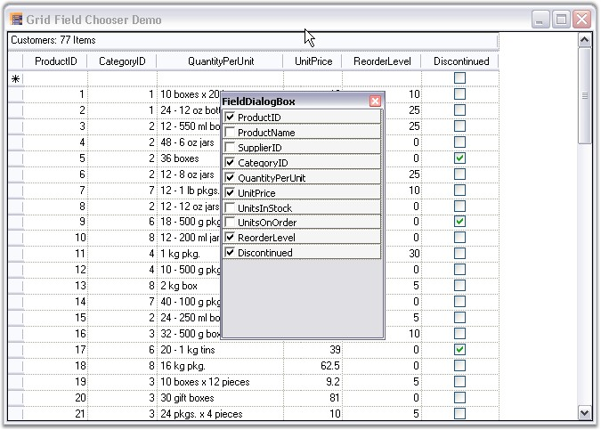

::: {style="DISPLAY: none"}
{#d2h_url_template}{#d2h_package_url style="WIDTH: 0px; DISPLAY: none; HEIGHT: 0px"}
:::

::: {.d2h_secondary_topic style="PADDING-BOTTOM: 10pt; MARGIN: 0pt; PADDING-LEFT: 0pt; PADDING-RIGHT: 0pt; PADDING-TOP: 0pt"}
##### Grid Field Chooser {#grid-field-chooser style="tab-stops: 0pt"}

[]{style="FONT-FAMILY: 'Trebuchet MS','sans-serif'; COLOR: #15428b; FONT-SIZE: 9pt"} 

The view of a grid can be customized based on column visibility by using a plug-in utility called Field Chooser. A Field Chooser can be associated to Grid Grouping control to add or remove columns from a grid. It can be done by intializing the FieldChooser class where the constructor takes a parameter as a Grid Grouping control object.

 

Enabling the Field Chooser allows the user to right-click on a column header and select Field Chooser menu item to view the Field Chooser dialog. This dialog would list all the column names with check boxes beside them. The required columns can be made visible in the gridby selecting the check box adjacent to the required column.

 

The following code example illustrates the usage of Field Chooser.

[]{style="FONT-FAMILY: 'Trebuchet MS','sans-serif'; COLOR: #15428b; FONT-SIZE: 9pt"} 

+------------------------------------------------------------------------------------------------------------------------------------------------------------------------------------------------------------------------------------------+
| **[\[C#\]]{style="FONT-FAMILY: 'Courier New'; COLOR: black"}**                                                                                                                                                                           |
|                                                                                                                                                                                                                                          |
| []{style="FONT-FAMILY: 'Courier New'; COLOR: black"}                                                                                                                                                                                     |
|                                                                                                                                                                                                                                          |
| [FieldChooser]{style="FONT-FAMILY: 'Courier New'; COLOR: #2b91af"}[ fchooser = [new]{style="COLOR: blue"} [FieldChooser]{style="COLOR: #2b91af"}([this]{style="COLOR: blue"}.gridGroupingControl1);]{style="FONT-FAMILY: 'Courier New'"} |
+------------------------------------------------------------------------------------------------------------------------------------------------------------------------------------------------------------------------------------------+

[]{style="FONT-FAMILY: 'Trebuchet MS','sans-serif'; COLOR: #15428b; FONT-SIZE: 9pt"} 

+----------------------------------------------------------------------------------------------------------------------------------------------------------------------------------------------------------------------------------------+
| **[\[VB.NET\]]{style="FONT-FAMILY: 'Courier New'; COLOR: black"}**                                                                                                                                                                     |
|                                                                                                                                                                                                                                        |
| []{style="FONT-FAMILY: 'Courier New'; COLOR: black"}                                                                                                                                                                                   |
|                                                                                                                                                                                                                                        |
| [Dim]{style="FONT-FAMILY: 'Courier New'; COLOR: blue"}[ fchooser [As]{style="COLOR: blue"} FieldChooser = [New]{style="COLOR: blue"} FieldChooser([Me]{style="COLOR: blue"}.gridGroupingControl1)]{style="FONT-FAMILY: 'Courier New'"} |
+----------------------------------------------------------------------------------------------------------------------------------------------------------------------------------------------------------------------------------------+

[]{style="FONT-FAMILY: 'Trebuchet MS','sans-serif'; COLOR: #15428b; FONT-SIZE: 9pt"} 

{border="0"}

[]{style="FONT-FAMILY: 'Trebuchet MS','sans-serif'; COLOR: #15428b; FONT-SIZE: 9pt"} 

*[Figure ]{style="FONT-SIZE: 9pt"}[350]{style="FONT-SIZE: 9pt"}[: Grid Grouping control with Field Chooser]{style="FONT-SIZE: 9pt"}*

 

For more details, refer the following sample:

 

***\<Install Location\>\\Syncfusion\\EssentialStudio\\\[Version Number\]\\Windows\\Grid.Grouping.Windows\\Samples\\2.0\\Grouping Grid Layout\\Grid Field Chooser Demo***

 

[]{#p461} 

[]{#related-topics}
:::
