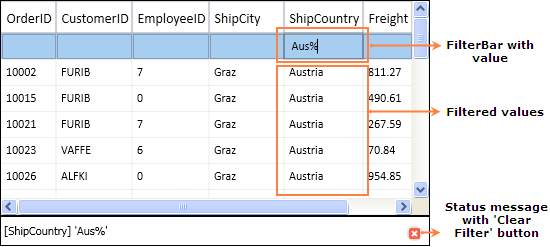

::: {style="DISPLAY: none"}
{#d2h_url_template}{#d2h_package_url style="WIDTH: 0px; DISPLAY: none; HEIGHT: 0px"}
:::

::::: {.d2h_secondary_topic style="PADDING-BOTTOM: 10pt; MARGIN: 0pt; PADDING-LEFT: 0pt; PADDING-RIGHT: 0pt; PADDING-TOP: 0pt"}
#### Grid FilterBar {#grid-filterbar style="tab-stops: 0pt"}

Essential Grid supports FilterBar, which filters the records with different expressions depending upon the Column type. The FilterBar will be displayed at the top of the Grid below the Header Row by setting the "ShowFilterBar" property to true in GridDataControl class. The filtering tokens are tabulated in the [[Tokens to filter the value]{.UGHyperlink}](ms-xhelp:///?Id=efcd7eec-74f0-4f92-964e-1610d3c69dfd) table.

 

Use Case Scenarios

FilterBar can be used for applications for which the user wants to filter the Grid at run time.

**[]{style="COLOR: #15428b"}** 

Adding FilterBar to an Application

This topic explains the implementation of the FilterBar in  an application. The following steps explain the implementation of FilterBar support in  an application.

 

1.   Creating an application

Create a WPF application and add GridDataControl to it.

2.   Setting the FilterBar Property

Set the FilterBar property to "true" for the GridDataControl object.  The Filter status message can be viewed by enabling the property ShowFilterStatusMessage.  The filtering mode can be set to Immediate or OnEnter by setting the Enum property GridDataFilterBarMode.  The following code snippet explains the implementation of the FilterBar.

**[]{style="FONT-FAMILY: 'Calibri','sans-serif'; FONT-SIZE: 11pt"}** 

+---------------------------------------------------------------------------------------------------------------------------------------------------------------------------------------------------------------------------------------------------------------------+
| [\[C#\]]{style="FONT-FAMILY: 'Courier New'; FONT-SIZE: 11pt"}                                                                                                                                                                                                       |
|                                                                                                                                                                                                                                                                     |
|                                                                                                                                                                                                                                                                     |
|                                                                                                                                                                                                                                                                     |
| [this]{style="FONT-FAMILY: 'Courier New'; COLOR: blue; FONT-SIZE: 9.5pt"}[.dataGrid.ShowFilterBar = [true]{style="COLOR: blue"};]{style="FONT-FAMILY: 'Courier New'; FONT-SIZE: 9.5pt"}                                                                             |
|                                                                                                                                                                                                                                                                     |
| [this]{style="FONT-FAMILY: Consolas; COLOR: blue; FONT-SIZE: 9.5pt"}[.dataGrid.ShowFilterStatusMessage = [true]{style="COLOR: blue"};]{style="FONT-FAMILY: Consolas; FONT-SIZE: 9.5pt"}                                                                             |
|                                                                                                                                                                                                                                                                     |
| [this]{style="FONT-FAMILY: Consolas; COLOR: blue; FONT-SIZE: 9.5pt"}[.dataGrid.FilterBarMode = [GridDataFilterBarMode]{style="COLOR: #2b91af"}.Immediate;]{style="FONT-FAMILY: Consolas; FONT-SIZE: 9.5pt"}                                                         |
|                                                                                                                                                                                                                                                                     |
| [//]{style="FONT-FAMILY: 'Courier New'; FONT-SIZE: 9.5pt"}[this]{style="FONT-FAMILY: Consolas; COLOR: blue; FONT-SIZE: 9.5pt"}[.dataGrid.FilterBarMode = [GridDataFilterBarMode]{style="COLOR: #2b91af"}.OnEnter;]{style="FONT-FAMILY: Consolas; FONT-SIZE: 9.5pt"} |
|                                                                                                                                                                                                                                                                     |
| **[]{style="FONT-FAMILY: 'Courier New'; FONT-SIZE: 9.5pt"}**                                                                                                                                                                                                        |
|                                                                                                                                                                                                                                                                     |
|                                                                                                                                                                                                                                                                     |
+---------------------------------------------------------------------------------------------------------------------------------------------------------------------------------------------------------------------------------------------------------------------+

**[]{style="FONT-FAMILY: 'Calibri','sans-serif'; FONT-SIZE: 11pt"}** 

+-------------------------------------------------------------------------------------------------------------------------------------------------------------------------------------------------------------------------------------------------------------------------------------------------+
| [\[VB\]]{style="FONT-FAMILY: 'Courier New'; FONT-SIZE: 11pt"}                                                                                                                                                                                                                                   |
|                                                                                                                                                                                                                                                                                                 |
|                                                                                                                                                                                                                                                                                                 |
|                                                                                                                                                                                                                                                                                                 |
| [Me]{style="FONT-FAMILY: 'Courier New'; COLOR: #0070c0; FONT-SIZE: 9.5pt"}[.dataGrid.ShowFilterBar = [True]{style="COLOR: #0070c0"}]{style="FONT-FAMILY: 'Courier New'; FONT-SIZE: 9.5pt"}                                                                                                      |
|                                                                                                                                                                                                                                                                                                 |
| [Me]{style="FONT-FAMILY: Consolas; COLOR: #0070c0; FONT-SIZE: 9.5pt"}[.dataGrid.ShowFilterStatusMessage = ]{style="FONT-FAMILY: Consolas; FONT-SIZE: 9.5pt"}[True]{style="FONT-FAMILY: 'Courier New'; COLOR: #0070c0; FONT-SIZE: 9.5pt"}**[]{style="FONT-FAMILY: Consolas; FONT-SIZE: 9.5pt"}** |
|                                                                                                                                                                                                                                                                                                 |
| [Me]{style="FONT-FAMILY: Consolas; COLOR: #0070c0; FONT-SIZE: 9.5pt"}[.dataGrid.FilterBarMode = [GridDataFilterBarMode]{style="COLOR: #0070c0"}.Immediate]{style="FONT-FAMILY: Consolas; FONT-SIZE: 9.5pt"}                                                                                     |
|                                                                                                                                                                                                                                                                                                 |
| [\']{style="FONT-FAMILY: Consolas; COLOR: #00b050; FONT-SIZE: 9.5pt"}[Me]{style="FONT-FAMILY: Consolas; COLOR: #0070c0; FONT-SIZE: 9.5pt"}[.dataGrid.FilterBarMode = [GridDataFilterBarMode]{style="COLOR: #0070c0"}.OnEnter]{style="FONT-FAMILY: Consolas; FONT-SIZE: 9.5pt"}                  |
|                                                                                                                                                                                                                                                                                                 |
|                                                                                                                                                                                                                                                                                                 |
+-------------------------------------------------------------------------------------------------------------------------------------------------------------------------------------------------------------------------------------------------------------------------------------------------+

**[]{style="FONT-FAMILY: 'Calibri','sans-serif'; FONT-SIZE: 11pt"}** 

3.   Run the application and use the filtering tokens in the FilterBar. The valid tokens are listed in[ ]{style="FONT-FAMILY: 'Calibri','sans-serif'; FONT-SIZE: 11pt"}[[Tokens to filter the value]{.UGHyperlink}](ms-xhelp:///?Id=f26f8491-0f3d-433d-a911-994ab236ccba)[ ]{style="FONT-FAMILY: 'Calibri','sans-serif'; FONT-SIZE: 11pt"}table. The following is a sample output of FilterBar implementation[.]{style="FONT-FAMILY: 'Calibri','sans-serif'; FONT-SIZE: 11pt"}

{border="0"}

Figure 176: FilterBar with ShowFilterStatusMessage Property set to true

*[]{style="COLOR: #002060"}* 

4.   Clearing the Filter

The Current filter value with the column name will be displayed at the bottom of the GridDataControl (just like status bar). It contains the button (red color) called "Clear Filter", which is used to clear the entire filter and show the default level records.

*[]{style="COLOR: #15428b"}* 

Tables for Properties, Methods, and Events

Properties

 

Table 40: FilterBar Support Table

::: {align="center"}
+-------------------------+---------------------------------------------------------------------------------------------------------------------------------------+-------------+---------------+-----------------------+
| Property                | Description                                                                                                                           | Data Type   | Default value | Class Name            |
+=========================+=======================================================================================================================================+=============+===============+=======================+
| ShowFilterBar           | Shows the FilterBar, if it is true.                                                                                                   | Boolean     | False         | GridDataControl       |
+-------------------------+---------------------------------------------------------------------------------------------------------------------------------------+-------------+---------------+-----------------------+
| ShowFilterStatusMessage | Shows the message at the bottom of the grid depending on the current Filter applied, if it is true.                                   | Boolean     | True          | GridDataControl       |
+-------------------------+---------------------------------------------------------------------------------------------------------------------------------------+-------------+---------------+-----------------------+
| FilterBarMode           | Filter result will be shown immediately if \"Immediately\" is set and will be shown on pressing the Enter key  if \"OnEnter\" is set  | Enum        | Immediate     | GridDataControl       |
|                         |                                                                                                                                       |             |               |                       |
|                         |                                                                                                                                       |             |               |                       |
+-------------------------+---------------------------------------------------------------------------------------------------------------------------------------+-------------+---------------+-----------------------+
| FilterBarMode           |  Filter result will be shown immediately if \"Immediately\" is set and will be shown on pressing the Enter key  if \"OnEnter\" is set | Enum        | Immediate     | GridDataVisibleColumn |
|                         |                                                                                                                                       |             |               |                       |
|                         |                                                                                                                                       |             |               |                       |
+-------------------------+---------------------------------------------------------------------------------------------------------------------------------------+-------------+---------------+-----------------------+
:::

[]{style="COLOR: #1f497d"} 

[Tokens to Filter the Value]{#TokenstoFiltertheValue}

[]{style="FONT-FAMILY: 'Myriad Pro','sans-serif'"} 

Table 41: FilterBar Support Table

::: {align="center"}
+-----------------+--------------------------------+--------------------+--------------------+
| Filter Token    | Examples                       | Description        | Used at            |
|                 |                                |                    |                    |
|                 | (should be used as like below) |                    |                    |
+-----------------+--------------------------------+--------------------+--------------------+
| \%              | value%                         | StartsWith         | AlphaNumeric       |
|                 +--------------------------------+--------------------+--------------------+
|                 | %value                         | EndsWith           | AlphaNumeric       |
+-----------------+--------------------------------+--------------------+--------------------+
| \#              | #value                         | Contains           | AlphaNumeric       |
+-----------------+--------------------------------+--------------------+--------------------+
| \<              | \<value                        | LessThan           | Numeric & DateTime |
+-----------------+--------------------------------+--------------------+--------------------+
| \<=             | \<=value                       | LessThanOrEqual    | Numeric & DateTime |
+-----------------+--------------------------------+--------------------+--------------------+
| \>              | \>value                        | GreaterThan        | Numeric & DateTime |
+-----------------+--------------------------------+--------------------+--------------------+
| \>=             | \>=value                       | GreaterThanOrEqual | Numeric & DateTime |
+-----------------+--------------------------------+--------------------+--------------------+
| =               | =value                         | Equals             | Numeric & DateTime |
+-----------------+--------------------------------+--------------------+--------------------+
| !               | !value                         | Not Equals         | Numeric & DateTime |
+-----------------+--------------------------------+--------------------+--------------------+
| and             | \>value and \<=value           | between            | Numeric & DateTime |
|                 |                                |                    |                    |
|                 | \>value and \<value            |                    |                    |
|                 |                                |                    |                    |
|                 | \>=value and \<value           |                    |                    |
|                 |                                |                    |                    |
|                 | \>=value and \<=value          |                    |                    |
+-----------------+--------------------------------+--------------------+--------------------+
| or              | \>value or \<=value            | between            | Numeric & DateTime |
|                 |                                |                    |                    |
|                 | \>value or \<value             |                    |                    |
|                 |                                |                    |                    |
|                 | \>=value or \<value            |                    |                    |
|                 |                                |                    |                    |
|                 | \>=value or \<=value           |                    |                    |
+-----------------+--------------------------------+--------------------+--------------------+
| 0               | 0                              | Equals             | Boolean            |
+-----------------+--------------------------------+--------------------+--------------------+
| 1               | 1                              | Equals             | Boolean            |
+-----------------+--------------------------------+--------------------+--------------------+
:::

 

\*values can be entered in any format (not case sensitive)

**[]{style="COLOR: #15428b"}** 

Sample Link

Refer to the samples in the shipped Sample Browser.

Go to Essential Studio WPF Sample Browser [à]{style="FONT-FAMILY: Wingdings"} Grid [à]{style="FONT-FAMILY: Wingdings"} GridDataControl-Advanced[à]{style="FONT-FAMILY: Wingdings"}FilterBarDemo.

 

More:

[ ]{#related-topics}

[{border="0" align="absMiddle"}Dropdown FilterBar](ms-xhelp:///?Id=311c5a2a-3711-4bc7-aa85-191fd9ff5170){style="TEXT-DECORATION: none"}
:::::
