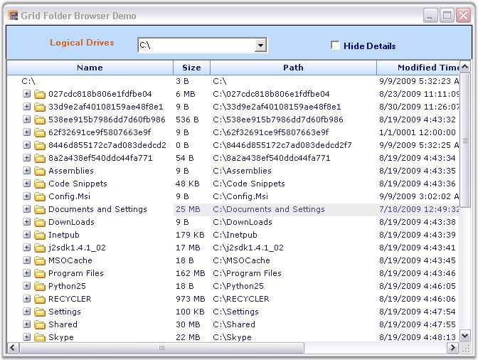

::: {style="DISPLAY: none"}
{#d2h_url_template}{#d2h_package_url style="WIDTH: 0px; DISPLAY: none; HEIGHT: 0px"}
:::

::: {.d2h_secondary_topic style="PADDING-BOTTOM: 10pt; MARGIN: 0pt; PADDING-LEFT: 0pt; PADDING-RIGHT: 0pt; PADDING-TOP: 0pt"}
##### Grid Folder Browser {#grid-folder-browser style="tab-stops: 0pt"}

[]{style="FONT-FAMILY: 'Trebuchet MS','sans-serif'; COLOR: #15428b; FONT-SIZE: 9pt"} 

The Essential Grid can be used to develop a powerful **TreeView** control owing to its flexibility. The tree nodes can be created through a custom **TreeCell** cell type. The **GridStaticCellModel** class is inherited to create this cell type. The plus/minus buttons of the tree nodes are selected by using the **ImageIndex** property.

 

**Example**

 

Let us consider the Grid Folder Browser sample which is available under the following installation path.

 

***\<Install Location\>\\Syncfusion\\EssentialStudio\\\[Version Number\]\\Windows\\Grid.Windows\\Samples\\2.0\\Product Showcase\\Grid Folder Browser Demo***

 

This sample operates the grid in virtual mode in order to populate the data dynamically on demand, i.e., when the tree is expanded. The QueryCellInfo, QueryColCount and QueryRowCount events must be handled in order to implement a virtual grid. These events provide basic information about the number of rows and columns and the values of the data.

 

The following code examples illustrates how to set the data from the data source.

[]{style="FONT-FAMILY: 'Trebuchet MS','sans-serif'; COLOR: #15428b; FONT-SIZE: 9pt"} 

1.   Using C#

[]{style="FONT-FAMILY: 'Trebuchet MS','sans-serif'; COLOR: #15428b; FONT-SIZE: 9pt"} 

+----------------------------------------------------------------------------------------------------------------------------------------------------------------------------------------------------------------+
| **[\[C#\]]{style="FONT-FAMILY: 'Courier New'; COLOR: black"}**                                                                                                                                                 |
|                                                                                                                                                                                                                |
| []{style="FONT-FAMILY: 'Courier New'; COLOR: black"}                                                                                                                                                           |
|                                                                                                                                                                                                                |
| [void]{style="FONT-FAMILY: 'Courier New'; COLOR: blue"}[ GridQueryCellInfo([object]{style="COLOR: blue"} sender, [GridQueryCellInfoEventArgs]{style="COLOR: #2b91af"} e) ]{style="FONT-FAMILY: 'Courier New'"} |
|                                                                                                                                                                                                                |
| [{]{style="FONT-FAMILY: 'Courier New'"}                                                                                                                                                                        |
|                                                                                                                                                                                                                |
| [if]{style="FONT-FAMILY: 'Courier New'; COLOR: blue"}[ (e.RowIndex \> 0 && e.ColIndex \> 0) ]{style="FONT-FAMILY: 'Courier New'"}                                                                              |
|                                                                                                                                                                                                                |
| [{ ]{style="FONT-FAMILY: 'Courier New'"}                                                                                                                                                                       |
|                                                                                                                                                                                                                |
| [e.Style.CellValue = externalData\[e.RowIndex - 1\].Items\[e.ColIndex - 1\]; ]{style="FONT-FAMILY: 'Courier New'"}                                                                                             |
|                                                                                                                                                                                                                |
| [if]{style="FONT-FAMILY: 'Courier New'; COLOR: blue"}[ (e.ColIndex == 1) ]{style="FONT-FAMILY: 'Courier New'"}                                                                                                 |
|                                                                                                                                                                                                                |
| [{]{style="FONT-FAMILY: 'Courier New'"}                                                                                                                                                                        |
|                                                                                                                                                                                                                |
| [e.Style.CellType = [\"TreeCell\"]{style="COLOR: #a31515"}; ]{style="FONT-FAMILY: 'Courier New'"}                                                                                                              |
|                                                                                                                                                                                                                |
| [e.Style.Tag = externalData\[e.RowIndex - 1\].IndentLevel; ]{style="FONT-FAMILY: 'Courier New'"}                                                                                                               |
|                                                                                                                                                                                                                |
| [e.Style.ImageIndex = ([int]{style="COLOR: blue"}) externalData\[e.RowIndex - 1\].ExpandState; ]{style="FONT-FAMILY: 'Courier New'"}                                                                           |
|                                                                                                                                                                                                                |
| [} ]{style="FONT-FAMILY: 'Courier New'"}                                                                                                                                                                       |
|                                                                                                                                                                                                                |
| [}]{style="FONT-FAMILY: 'Courier New'"}                                                                                                                                                                        |
|                                                                                                                                                                                                                |
| [e.Handled = [true]{style="COLOR: blue"};]{style="FONT-FAMILY: 'Courier New'"}                                                                                                                                 |
|                                                                                                                                                                                                                |
| [}]{style="FONT-FAMILY: 'Courier New'"}                                                                                                                                                                        |
+----------------------------------------------------------------------------------------------------------------------------------------------------------------------------------------------------------------+

[]{style="FONT-FAMILY: 'Trebuchet MS','sans-serif'; COLOR: #15428b; FONT-SIZE: 9pt"} 

2.   Using VB.NET

[]{style="FONT-FAMILY: 'Trebuchet MS','sans-serif'; COLOR: #15428b; FONT-SIZE: 9pt"} 

+---------------------------------------------------------------------------------------------------------------------------------------------------------------------------------------------------------------------------------------------------------------------------------------------------------------------------------+
| **[\[VB.NET\]]{style="FONT-FAMILY: 'Courier New'; COLOR: black"}**                                                                                                                                                                                                                                                              |
|                                                                                                                                                                                                                                                                                                                                 |
| []{style="FONT-FAMILY: 'Courier New'; COLOR: black"}                                                                                                                                                                                                                                                                            |
|                                                                                                                                                                                                                                                                                                                                 |
| [Private]{style="FONT-FAMILY: 'Courier New'; COLOR: blue"}[ [Sub]{style="COLOR: blue"} GridQueryCellInfo([ByVal]{style="COLOR: blue"} sender [As]{style="COLOR: blue"} [Object]{style="COLOR: blue"}, [ByVal]{style="COLOR: blue"} e [As]{style="COLOR: blue"} GridQueryCellInfoEventArgs)]{style="FONT-FAMILY: 'Courier New'"} |
|                                                                                                                                                                                                                                                                                                                                 |
| [If]{style="FONT-FAMILY: 'Courier New'; COLOR: blue"}[ e.RowIndex \> 0 [AndAlso]{style="COLOR: blue"} e.ColIndex \> 0 [Then]{style="COLOR: blue"}]{style="FONT-FAMILY: 'Courier New'"}                                                                                                                                          |
|                                                                                                                                                                                                                                                                                                                                 |
| [e.Style.CellValue = externalData(e.RowIndex - 1).Items(e.ColIndex - 1)]{style="FONT-FAMILY: 'Courier New'"}                                                                                                                                                                                                                    |
|                                                                                                                                                                                                                                                                                                                                 |
| [If]{style="FONT-FAMILY: 'Courier New'; COLOR: blue"}[ e.ColIndex = 1 [Then]{style="COLOR: blue"}]{style="FONT-FAMILY: 'Courier New'"}                                                                                                                                                                                          |
|                                                                                                                                                                                                                                                                                                                                 |
| [e.Style.CellType = [\"TreeCell\"]{style="COLOR: #a31515"}]{style="FONT-FAMILY: 'Courier New'"}                                                                                                                                                                                                                                 |
|                                                                                                                                                                                                                                                                                                                                 |
| [e.Style.Tag = externalData(e.RowIndex - 1).IndentLevel]{style="FONT-FAMILY: 'Courier New'"}                                                                                                                                                                                                                                    |
|                                                                                                                                                                                                                                                                                                                                 |
| [e.Style.ImageIndex = [CInt]{style="COLOR: blue"}(Fix(externalData(e.RowIndex - 1).ExpandState))]{style="FONT-FAMILY: 'Courier New'"}                                                                                                                                                                                           |
|                                                                                                                                                                                                                                                                                                                                 |
| [End]{style="FONT-FAMILY: 'Courier New'; COLOR: blue"}[ [If]{style="COLOR: blue"}]{style="FONT-FAMILY: 'Courier New'"}                                                                                                                                                                                                          |
|                                                                                                                                                                                                                                                                                                                                 |
| [End]{style="FONT-FAMILY: 'Courier New'; COLOR: blue"}[ [If]{style="COLOR: blue"}]{style="FONT-FAMILY: 'Courier New'"}                                                                                                                                                                                                          |
|                                                                                                                                                                                                                                                                                                                                 |
| [e.Handled = [True]{style="COLOR: blue"}]{style="FONT-FAMILY: 'Courier New'"}                                                                                                                                                                                                                                                   |
|                                                                                                                                                                                                                                                                                                                                 |
| [End]{style="FONT-FAMILY: 'Courier New'; COLOR: blue"}[ [Sub]{style="COLOR: blue"}]{style="FONT-FAMILY: 'Courier New'"}                                                                                                                                                                                                         |
+---------------------------------------------------------------------------------------------------------------------------------------------------------------------------------------------------------------------------------------------------------------------------------------------------------------------------------+

[]{style="FONT-FAMILY: 'Trebuchet MS','sans-serif'; COLOR: #15428b; FONT-SIZE: 9pt"} 

The implementation uses a CollapsibleDataSource class. This class makes use of a custom collection to hold a list of SampleData objects (Consider each of these objects as a row in the underlying grid). Each row carries information on a specific folder. Each SampleData object has an IndentValue property, an ExpandState property, and an Items string array that holds the different column values for this row. The column values display the folder details like the name of the folder, folder size and so on. This class also contains the InsertData method which retrieves the data of the inner subtree and inserts the data into the collection when a node is expanded.

[]{style="FONT-FAMILY: 'Trebuchet MS','sans-serif'; COLOR: #15428b; FONT-SIZE: 9pt"} 

{border="0"}

[]{style="FONT-FAMILY: 'Trebuchet MS','sans-serif'; COLOR: #15428b; FONT-SIZE: 9pt"} 

*[Figure ]{style="FONT-SIZE: 9pt"}[192]{style="FONT-SIZE: 9pt"}[: Grid Folder Browser Demo]{style="FONT-SIZE: 9pt"}*

 

[]{#p349} 

 

[]{#related-topics}
:::
