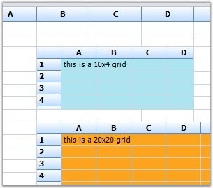

::: {style="DISPLAY: none"}
{#d2h_url_template}{#d2h_package_url style="WIDTH: 0px; DISPLAY: none; HEIGHT: 0px"}
:::

::: {.d2h_secondary_topic style="PADDING-BOTTOM: 10pt; MARGIN: 0pt; PADDING-LEFT: 0pt; PADDING-RIGHT: 0pt; PADDING-TOP: 0pt"}
##### GridInCell {#gridincell style="tab-stops: 0pt"}

[]{style="FONT-FAMILY: 'Trebuchet MS','sans-serif'; COLOR: #15428b; FONT-SIZE: 9pt"} 

The GridInCell cell type provide a covered range of cells to embed the grid, which is added as a control to the cells. The registered cell model will initialize the range by calculating the size of the grid control to be embedded, and add some style such as borders and scroll bar to have the control within the range.

 

The following code examples illustrate how to set the cell type to GridinCell.

[]{style="FONT-FAMILY: 'Trebuchet MS','sans-serif'; COLOR: #15428b; FONT-SIZE: 9pt"} 

1.   Using C#

[]{style="FONT-FAMILY: 'Trebuchet MS','sans-serif'; COLOR: #15428b; FONT-SIZE: 9pt"} 

+-------------------------------------------------------------------------------------------------------------------------------------------------------------------------------------------------+
| **[\[C#\]]{style="FONT-FAMILY: 'Courier New'; COLOR: black"}**                                                                                                                                  |
|                                                                                                                                                                                                 |
| []{style="FONT-FAMILY: 'Courier New'; COLOR: black"}                                                                                                                                            |
|                                                                                                                                                                                                 |
| [RegisterCellModel]{style="FONT-FAMILY: 'Courier New'; COLOR: #2b91af"}[.GridCellType(gridControl1, [CustomCellTypes]{style="COLOR: #2b91af"}.GridinCell);]{style="FONT-FAMILY: 'Courier New'"} |
|                                                                                                                                                                                                 |
| [gridControl1.BackColor = [Color]{style="COLOR: #2b91af"}.FromArgb(0xda, 0xe5, 0xf5);]{style="FONT-FAMILY: 'Courier New'"}                                                                      |
|                                                                                                                                                                                                 |
| [GridControl]{style="FONT-FAMILY: 'Courier New'; COLOR: #2b91af"}[ grid;]{style="FONT-FAMILY: 'Courier New'"}                                                                                   |
|                                                                                                                                                                                                 |
| []{style="FONT-FAMILY: 'Courier New'"}                                                                                                                                                          |
|                                                                                                                                                                                                 |
| [this]{style="FONT-FAMILY: 'Courier New'; COLOR: blue"}[.gridControl1\[3, 2\].CellType = [CustomCellTypes]{style="COLOR: #2b91af"}.GridinCell.ToString();]{style="FONT-FAMILY: 'Courier New'"}  |
|                                                                                                                                                                                                 |
| [this]{style="FONT-FAMILY: 'Courier New'; COLOR: blue"}[.gridControl1.CoveredRanges.Add([GridRangeInfo]{style="COLOR: #2b91af"}.Cells(3, 2, 7, 4));]{style="FONT-FAMILY: 'Courier New'"}        |
|                                                                                                                                                                                                 |
| [grid = [new]{style="COLOR: blue"} [CellEmbeddedGrid]{style="COLOR: #2b91af"}([this]{style="COLOR: blue"}.gridControl1);]{style="FONT-FAMILY: 'Courier New'"}                                   |
|                                                                                                                                                                                                 |
| [grid.BackColor = [Color]{style="COLOR: #2b91af"}.FromArgb(0xb4, 0xe7, 0xf2);]{style="FONT-FAMILY: 'Courier New'"}                                                                              |
|                                                                                                                                                                                                 |
| [grid.RowCount = 10;]{style="FONT-FAMILY: 'Courier New'"}                                                                                                                                       |
|                                                                                                                                                                                                 |
| [grid.ColCount = 4;]{style="FONT-FAMILY: 'Courier New'"}                                                                                                                                        |
|                                                                                                                                                                                                 |
| [grid\[1, 1\].Text = [\"this is a 10x4 grid\"]{style="COLOR: #a31515"};]{style="FONT-FAMILY: 'Courier New'"}                                                                                    |
|                                                                                                                                                                                                 |
| [grid.ThemesEnabled = [true]{style="COLOR: blue"};]{style="FONT-FAMILY: 'Courier New'"}                                                                                                         |
|                                                                                                                                                                                                 |
| [this]{style="FONT-FAMILY: 'Courier New'; COLOR: blue"}[.gridControl1\[3, 2\].Control = grid;]{style="FONT-FAMILY: 'Courier New'"}                                                              |
|                                                                                                                                                                                                 |
| [this]{style="FONT-FAMILY: 'Courier New'; COLOR: blue"}[.gridControl1.Controls.Add(grid);]{style="FONT-FAMILY: 'Courier New'"}                                                                  |
+-------------------------------------------------------------------------------------------------------------------------------------------------------------------------------------------------+

[]{style="FONT-FAMILY: 'Trebuchet MS','sans-serif'; COLOR: #15428b; FONT-SIZE: 9pt"} 

2.   Using VB.NET

[]{style="FONT-FAMILY: 'Trebuchet MS','sans-serif'; COLOR: #15428b; FONT-SIZE: 9pt"} 

+-----------------------------------------------------------------------------------------------------------------------------------------------------------------+
| **[\[VB.NET\]]{style="FONT-FAMILY: 'Courier New'; COLOR: black"}**                                                                                              |
|                                                                                                                                                                 |
| []{style="FONT-FAMILY: 'Courier New'; COLOR: black"}                                                                                                            |
|                                                                                                                                                                 |
| [RegisterCellModel.GridCellType([Me]{style="COLOR: blue"}.gridControl1, CustomCellTypes.GridinCell)]{style="FONT-FAMILY: 'Courier New'"}                        |
|                                                                                                                                                                 |
| [Dim]{style="FONT-FAMILY: 'Courier New'; COLOR: blue"}[ grid [As]{style="COLOR: blue"} GridControl]{style="FONT-FAMILY: 'Courier New'"}                         |
|                                                                                                                                                                 |
| []{style="FONT-FAMILY: 'Courier New'"}                                                                                                                          |
|                                                                                                                                                                 |
| []{style="FONT-FAMILY: 'Courier New'; COLOR: green"}                                                                                                            |
|                                                                                                                                                                 |
| [Me]{style="FONT-FAMILY: 'Courier New'; COLOR: blue"}[.gridControl1(3, 2).CellType = CustomCellTypes.GridinCell.ToString()]{style="FONT-FAMILY: 'Courier New'"} |
|                                                                                                                                                                 |
| [Me]{style="FONT-FAMILY: 'Courier New'; COLOR: blue"}[.gridControl1.CoveredRanges.Add(GridRangeInfo.Cells(3, 2, 7, 4))]{style="FONT-FAMILY: 'Courier New'"}     |
|                                                                                                                                                                 |
| [grid = [New]{style="COLOR: blue"} CellEmbeddedGrid([Me]{style="COLOR: blue"}.gridControl1)]{style="FONT-FAMILY: 'Courier New'"}                                |
|                                                                                                                                                                 |
| [grid.BackColor = Color.FromArgb(&HB4, &HE7, &HF2)]{style="FONT-FAMILY: 'Courier New'"}                                                                         |
|                                                                                                                                                                 |
| [grid.RowCount = 10]{style="FONT-FAMILY: 'Courier New'"}                                                                                                        |
|                                                                                                                                                                 |
| [grid.ColCount = 4]{style="FONT-FAMILY: 'Courier New'"}                                                                                                         |
|                                                                                                                                                                 |
| [grid(1, 1).Text = [\"this is a 10x4 grid\"]{style="COLOR: #a31515"}]{style="FONT-FAMILY: 'Courier New'"}                                                       |
|                                                                                                                                                                 |
| [grid.ThemesEnabled = [True]{style="COLOR: blue"}]{style="FONT-FAMILY: 'Courier New'"}                                                                          |
|                                                                                                                                                                 |
| [Me]{style="FONT-FAMILY: 'Courier New'; COLOR: blue"}[.gridControl1(3, 2).Control = grid]{style="FONT-FAMILY: 'Courier New'"}                                   |
|                                                                                                                                                                 |
| [Me]{style="FONT-FAMILY: 'Courier New'; COLOR: blue"}[.gridControl1.Controls.Add(grid)]{style="FONT-FAMILY: 'Courier New'"}                                     |
+-----------------------------------------------------------------------------------------------------------------------------------------------------------------+

[]{style="FONT-FAMILY: 'Trebuchet MS','sans-serif'; COLOR: #15428b; FONT-SIZE: 9pt"} 

{border="0"}

[]{style="FONT-FAMILY: 'Trebuchet MS','sans-serif'; COLOR: #15428b; FONT-SIZE: 9pt"} 

*[Figure ]{style="FONT-SIZE: 9pt"}[110]{style="FONT-SIZE: 9pt"}[: \"GridInCell\" Cells]{style="FONT-SIZE: 9pt"}*

 

[]{#p99} 

 

[]{#related-topics}
:::
