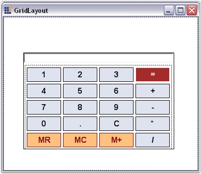

::: {style="DISPLAY: none"}
{#d2h_url_template}{#d2h_package_url style="WIDTH: 0px; DISPLAY: none; HEIGHT: 0px"}
:::

::: {.d2h_secondary_topic style="PADDING-BOTTOM: 10pt; MARGIN: 0pt; PADDING-LEFT: 0pt; PADDING-RIGHT: 0pt; PADDING-TOP: 0pt"}
#### GridLayout {#gridlayout style="tab-stops: 0pt"}

[]{style="COLOR: #15428b"} 

**GridLayout** is a Layout Manager that allows us to arrange the Child controls as in a grid containing rows and columns. Deriving from the Layout Manager base, the GridLayout inherits all the functionality that the Layout Manager type exposes. In its simplest form, this Layout Manager can be used to automatically arrange the Child components in one or more rows, as illustrated below.

[]{style="COLOR: #15428b"} 

{border="0"}

[]{style="COLOR: #15428b"} 

Figure 687: Calculator Control created using GridLayout

[]{style="COLOR: #15428b"} 

A Sample which demonstrates the GridLayout is available in the below sample installation path.

 

..My Documents\\Syncfusion\\EssentialStudio\\Version Number\\Windows\\Tools.Windows\\Samples\\2.0\\Layout Manager Package\\LayoutManagers

[]{style="COLOR: #15428b"} 

See Also

[]{style="COLOR: #15428b"} 

[Creating a Simple Layout]{.UGHyperlink}[, ]{.UGHyperlink}

More:

[ ]{#related-topics}

[{border="0" align="absMiddle"}Configuring GridLayout](ms-xhelp:///?Id=aed5b4aa-7225-4310-9917-2e7cca97c0a8){style="TEXT-DECORATION: none"}

[{border="0" align="absMiddle"}Configuring Child Controls](ms-xhelp:///?Id=4e8f5991-34f3-496c-8750-9a7b51d7d870){style="TEXT-DECORATION: none"}

[{border="0" align="absMiddle"}Rearranging the Controls laid out by GridLayout](ms-xhelp:///?Id=3223d7e1-135d-4309-ab80-47bc17ea27a7){style="TEXT-DECORATION: none"}
:::
