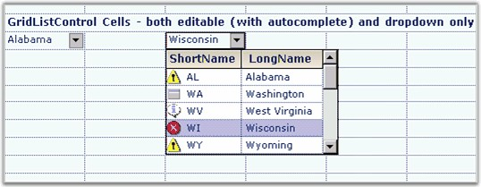

::: {style="DISPLAY: none"}
{#d2h_url_template}{#d2h_package_url style="WIDTH: 0px; DISPLAY: none; HEIGHT: 0px"}
:::

:::: {.d2h_secondary_topic style="PADDING-BOTTOM: 10pt; MARGIN: 0pt; PADDING-LEFT: 0pt; PADDING-RIGHT: 0pt; PADDING-TOP: 0pt"}
##### Grid List Control {#grid-list-control style="tab-stops: 0pt"}

[]{style="FONT-FAMILY: 'Trebuchet MS','sans-serif'; COLOR: #15428b; FONT-SIZE: 9pt"} 

The **GridListControl** cell type allows you to display a drop-down list that can contain multiple columns as an image. It uses **DataSource**, **DisplayMember** and **ValueMember** properties to control what is shown in the multiple columns. The DataSource member is generally stored in a parent style, and this member is then shared among grid cells which might use DisplayMember and ValueMember properties to customize their look if needed.

[]{style="FONT-FAMILY: 'Trebuchet MS','sans-serif'; COLOR: #15428b; FONT-SIZE: 9pt"} 

::: {align="center"}
  ------------------------ -------------------------------------------------------------------------------------------------------------------------
  GridStyleInfo Property   Description
  DisplayMember            Any object that implements either IList or IListSource. These include DataTable, DataView, or ArrayList objects.
  ValueMember              Indicates the column from the data source that is to be used for the value of the cell.
  ExclusiveChoiceList      Determines whether the user is required to select an item in the drop-down list.
  MultiColumn              Determines whether all the columns in the data source are displayed or if the single DisplayMember column is displayed.
  ------------------------ -------------------------------------------------------------------------------------------------------------------------
:::

[]{style="FONT-FAMILY: 'Trebuchet MS','sans-serif'; COLOR: #15428b; FONT-SIZE: 9pt"} 

Let us assume you have an ArrayList of US State objects. When you set the cell type to GridListControl, you will get the output as displayed in the screen shot.

[]{style="FONT-FAMILY: 'Trebuchet MS','sans-serif'; COLOR: #15428b; FONT-SIZE: 9pt"} 

+----------------------------------------------------------------------------------------------------------------------------------------------------------------------+
| **[\[C#\]]{style="FONT-FAMILY: 'Courier New'; COLOR: black"}**                                                                                                       |
|                                                                                                                                                                      |
| []{style="FONT-FAMILY: 'Courier New'; COLOR: black"}                                                                                                                 |
|                                                                                                                                                                      |
| [// Set up the data source.]{style="FONT-FAMILY: 'Courier New'; COLOR: green"}                                                                                       |
|                                                                                                                                                                      |
| [// Here \"USStates\" is an arraylist of state objects, each of which have the properties LongName and ShortName.]{style="FONT-FAMILY: 'Courier New'; COLOR: green"} |
|                                                                                                                                                                      |
| [gridControl1.TableStyle.DataSource = USStates;]{style="FONT-FAMILY: 'Courier New'"}                                                                                 |
|                                                                                                                                                                      |
| [gridControl1.TableStyle.DisplayMember = [\"LongName\"]{style="COLOR: #a31515"};]{style="FONT-FAMILY: 'Courier New'"}                                                |
|                                                                                                                                                                      |
| [gridControl1.TableStyle.ValueMember = [\"ShortName\"]{style="COLOR: #a31515"};]{style="FONT-FAMILY: 'Courier New'"}                                                 |
|                                                                                                                                                                      |
| []{style="FONT-FAMILY: 'Courier New'"}                                                                                                                               |
|                                                                                                                                                                      |
| [gridControl1\[rowIndex, colIndex + 2\].CellType = [\"GridListControl\"]{style="COLOR: #a31515"};]{style="FONT-FAMILY: 'Courier New'"}                               |
|                                                                                                                                                                      |
| [gridControl1\[rowIndex, colIndex + 2\].Text = [\"Wisconsin\"]{style="COLOR: #a31515"};]{style="FONT-FAMILY: 'Courier New'"}                                         |
|                                                                                                                                                                      |
| [gridControl1\[rowIndex, colIndex + 2\].ExclusiveChoiceList = [true]{style="COLOR: blue"};]{style="FONT-FAMILY: 'Courier New'"}                                      |
+----------------------------------------------------------------------------------------------------------------------------------------------------------------------+

[]{style="FONT-FAMILY: 'Trebuchet MS','sans-serif'; COLOR: #15428b; FONT-SIZE: 9pt"} 

+----------------------------------------------------------------------------------------------------------------------------------------------------------------------+
| **[\[VB.NET\]]{style="FONT-FAMILY: 'Courier New'; COLOR: black"}**                                                                                                   |
|                                                                                                                                                                      |
| []{style="FONT-FAMILY: 'Courier New'; COLOR: black"}                                                                                                                 |
|                                                                                                                                                                      |
| [\' Set up the data source.]{style="FONT-FAMILY: 'Courier New'; COLOR: green"}                                                                                       |
|                                                                                                                                                                      |
| [\' Here \"USStates\" is an arraylist of state objects each of which, have the properties LongName and ShortName.]{style="FONT-FAMILY: 'Courier New'; COLOR: green"} |
|                                                                                                                                                                      |
| [gridControl1.TableStyle.DataSource = USStates]{style="FONT-FAMILY: 'Courier New'"}                                                                                  |
|                                                                                                                                                                      |
| [gridControl1.TableStyle.DisplayMember = [\"LongName\"]{style="COLOR: #a31515"}]{style="FONT-FAMILY: 'Courier New'"}                                                 |
|                                                                                                                                                                      |
| [gridControl1.TableStyle.ValueMember = [\"ShortName\"]{style="COLOR: #a31515"}]{style="FONT-FAMILY: 'Courier New'"}                                                  |
|                                                                                                                                                                      |
| []{style="FONT-FAMILY: 'Courier New'; COLOR: #a31515"}                                                                                                               |
|                                                                                                                                                                      |
| [gridControl1(rowIndex, colIndex + 2).CellType = [\"GridListControl\"]{style="COLOR: #a31515"}]{style="FONT-FAMILY: 'Courier New'"}                                  |
|                                                                                                                                                                      |
| [gridControl1(rowIndex, colIndex + 2).Text = [\"Wisconsin\"]{style="COLOR: #a31515"}]{style="FONT-FAMILY: 'Courier New'"}                                            |
|                                                                                                                                                                      |
| [gridControl1(rowIndex, colIndex + 2).ExclusiveChoiceList = [True]{style="COLOR: blue"}]{style="FONT-FAMILY: 'Courier New'"}                                         |
+----------------------------------------------------------------------------------------------------------------------------------------------------------------------+

[]{style="FONT-FAMILY: 'Trebuchet MS','sans-serif'; COLOR: #15428b; FONT-SIZE: 9pt"} 

{border="0"}

[]{style="FONT-FAMILY: 'Trebuchet MS','sans-serif'; COLOR: #15428b; FONT-SIZE: 9pt"} 

Figure 81: Grid List Control Cells

[]{style="FONT-FAMILY: 'Trebuchet MS','sans-serif'; COLOR: #15428b; FONT-SIZE: 9pt"} 

A sample which demonstrates Grid List Control cell type is available in the following sample installation path.

***[]{style="FONT-FAMILY: 'Trebuchet MS','sans-serif'; COLOR: #15428b; FONT-SIZE: 9pt"}*** 

***C:\\Syncfusion\\EssentialStudio\\\[Version Number\]\\Windows\\Grid.Windows\\Samples\\2.0\\Grid List Control\\Grid List Control Demo***

 

[]{#p57} 

 

[]{#related-topics}
::::
