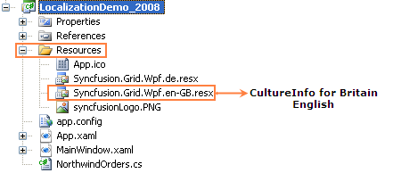
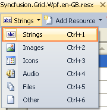
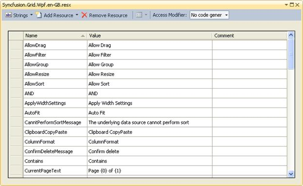

::: {style="DISPLAY: none"}
{#d2h_url_template}{#d2h_package_url style="WIDTH: 0px; DISPLAY: none; HEIGHT: 0px"}
:::

::::: {#nsbanner .d2h_main_nsbanner style="BORDER-BOTTOM: #999999 1px solid; POSITION: relative; PADDING-BOTTOM: 0px; BACKGROUND-COLOR: transparent; PADDING-LEFT: 0px; PADDING-RIGHT: 0px; DISPLAY: none; BORDER-TOP: #999999 1px solid; PADDING-TOP: 0px; LEFT: 0px"}
:::: {#TitleRow .d2h_main_titlerow style="PADDING-BOTTOM: 4px; BACKGROUND-COLOR: transparent; PADDING-LEFT: 22px; WIDTH: 100%; PADDING-RIGHT: 10px; DISPLAY: none; PADDING-TOP: 4px"}
::: {#ienav .d2h_main_ienav style="DISPLAY: none"}
{#D2HPrevious .D2HPreviousEnabled}  {#D2HNext .D2HNextEnabled}
:::
::::
:::::

::::: {#nstext .d2h_main_nstext style="PADDING-BOTTOM: 10px; BACKGROUND-COLOR: transparent; PADDING-LEFT: 22px; PADDING-RIGHT: 10px; HEIGHT: 100%; OVERFLOW: auto; PADDING-TOP: 5px" hasuserbackground="true" valign="bottom"}
::: {#d2h_breadcrumbs .d2h_breadcrumbs}
[Essential Studio User Guide Documentation](ms-xhelp:///?Id=12457748-09e3-4d74-a240-8e049cedf030){.d2h_breadcrumbsNormal}[ \> ]{.d2h_breadcrumbsLinkSeparator}[User Interface Edition](ms-xhelp:///?Id=c29296b7-531c-413b-a0ec-488ca1f7f669){.d2h_breadcrumbsNormal}[ \> ]{.d2h_breadcrumbsLinkSeparator}[Essential WPF](ms-xhelp:///?Id=7f4f82c5-151c-4262-94d0-75c4626c77bc){.d2h_breadcrumbsNormal}[ \> ]{.d2h_breadcrumbsLinkSeparator}[Essential Grid]{.d2h_breadcrumbsContentsOnly}[ \> ]{.d2h_breadcrumbsLinkSeparator}[Installation and Deployment](ms-xhelp:///?Id=094c35c7-db8e-4341-9619-16644b2a4e34){.d2h_breadcrumbsNormal}[ \> ]{.d2h_breadcrumbsLinkSeparator}[Grid WPF Controls](ms-xhelp:///?Id=1249c159-5431-465a-b1af-1cf1e5e90ac8){.d2h_breadcrumbsNormal}[ \> ]{.d2h_breadcrumbsLinkSeparator}[GridData Control](ms-xhelp:///?Id=e9aeb59d-d6ab-4862-87f7-4f169b1d763e){.d2h_breadcrumbsNormal}
:::

### Grid Localization Support {#grid-localization-support style="tab-stops: 0pt"}

Localization is the process of making your application multi-lingual, by formatting content according to cultures. This involves configuring the application for a specific language. Culture is the combination of language and the location (e.g. En-US is the culture for English spoken in  United States; En-GB is the culture for English spoken in  Great Britain). Syncfusion Grid allows you to set custom resource through the Resx file. The user can simply give the string values in the resource file for a specific culture and set the culture in the application. The given string values will be set to the Grid, which does not affect the Code Block of the Grid

**[]{style="COLOR: #15428b"}** 

[]{#_Use_Case_Scenarios}[]{#_Adding_<FEATURE_NAME>}[]{#_Adding_Localization_to}Adding Localization to an Application

The following steps explain the implementation of Localization support in applications.

[]{style="COLOR: #15428b"} 

Creating an Application

Create a WPF application and add GridDataControl to it.

[]{style="COLOR: #15428b"} 

Creating a Resource File

To create a Resource file:

 

1.   Create a folder named "Resources" in the application.

2.   Create a resource file (Resx file) and name it "Syncfusion.Grid.Wpf.\<*your culture info name*\>.resx" E.g. Syncfusion.Grid.Wpf.en-GB.resx.

3.   Use the prescribed naming convention as it is mandatory.

4.   The following screenshot explains the addition of a Resource File to the application.

 

{border="0"}

Figure 255: Adding Resource file to the Application.

 

5.   Select the String option in the Resource file. This is explained in the following screenshot.

[]{style="FONT-FAMILY: 'Myriad Pro','sans-serif'"} 

{border="0"}

Figure 256: Selecting and adding String Resources to the Resource file of the Application.

 

6.   Enter the "Name" and "Value" in the Resource file.

The String Property names used in the Grid are given in the Property table. This is explained in the following screenshot.

 

{border="0"}

Figure 257: Screenshot of the filled String Resources (Language: Britain English)

 

Setting the Culture Information in the Application

The culture information should be set in the application before the InitializeComponent() method is called. Now, the application is set to Britain English Culture info. The following code snippet explains the implementation of this.

*[]{style="COLOR: #15428b"}* 

+--------------------------------------------------------------------------------------------------------------------------------------------------------------------------------------------------------------------------------------------------------------------------------------------------+
| [\[C#\]]{style="FONT-FAMILY: 'Courier New'"}                                                                                                                                                                                                                                                     |
|                                                                                                                                                                                                                                                                                                  |
| **[]{style="FONT-FAMILY: 'Courier New'; FONT-SIZE: 9.5pt"}**                                                                                                                                                                                                                                     |
|                                                                                                                                                                                                                                                                                                  |
| [        [public]{style="COLOR: blue"} MainWindow()]{style="FONT-FAMILY: 'Courier New'; FONT-SIZE: 9.5pt"}                                                                                                                                                                                       |
|                                                                                                                                                                                                                                                                                                  |
| [        {]{style="FONT-FAMILY: 'Courier New'; FONT-SIZE: 9.5pt"}                                                                                                                                                                                                                                |
|                                                                                                                                                                                                                                                                                                  |
| [            System.Threading.[Thread]{style="COLOR: #2b91af"}.CurrentThread.CurrentUICulture = [new]{style="COLOR: blue"}               System.Globalization.[CultureInfo]{style="COLOR: #2b91af"}([\"en-GB\"]{style="COLOR: #a31515"});]{style="FONT-FAMILY: 'Courier New'; FONT-SIZE: 9.5pt"} |
|                                                                                                                                                                                                                                                                                                  |
| **[]{style="FONT-FAMILY: 'Courier New'; FONT-SIZE: 9.5pt"}**                                                                                                                                                                                                                                     |
|                                                                                                                                                                                                                                                                                                  |
| [            InitializeComponent();]{style="FONT-FAMILY: 'Courier New'; FONT-SIZE: 9.5pt"}                                                                                                                                                                                                       |
|                                                                                                                                                                                                                                                                                                  |
| [        }]{style="FONT-FAMILY: 'Courier New'; FONT-SIZE: 9.5pt"}                                                                                                                                                                                                                                |
|                                                                                                                                                                                                                                                                                                  |
|                                                                                                                                                                                                                                                                                                  |
+--------------------------------------------------------------------------------------------------------------------------------------------------------------------------------------------------------------------------------------------------------------------------------------------------+

 

[]{#_Properties}Properties

Table 47: Localization Property Table

::: {align="center"}
  Property                        Description                                          Type     Data Type
  ------------------------------- ---------------------------------------------------- -------- -----------
  AllowDrag                       Sets the string for AllowDrag property               static   string
  AllowDrag                       Sets the string for AllowDrag                        static   string
  AllowGroup                      Sets the string for AllowGroup                       static   string
  AllowResize                     Sets the string for AllowResize                      static   string
  AllowSort                       Sets the string for  AllowSort                       static   string
  AND                             Sets the string for AND                              static   string
  ApplyWidthSettings              Sets the string for ApplyWidthSettings               static   string
  AutoFit                         Sets the string for AutoFit                          static   string
  CanntPerformSortMessage         Sets the string for CanntPerformSortMessage          static   string
  ClipboardCopyPaste              Sets the string for ClipboardCopyPaste               static   string
  ColumnFormat                    Sets the string for ColumnFormat                     static   string
  ConfirmDeleteMessage            Sets the string for ConfirmDeleteMessage             static   string
  Contains                        Sets the string for Contains                         static   string
  CurrentPageText                 Sets the string for CurrentPageText                  static   string
  DeleteMessage                   Sets the string for DeleteMessage                    static   string
  DragDropText                    Sets the string for DragDropText                     static   string
  DynamicOptions                  Sets the string for DynamicOptions                   static   string
  EndsWith                        Sets the string for EndsWith                         static   string
  EnterFilterValue                Sets the string for EnterFilterValue                 static   string
  Equals                          Sets the string for Equals                           static   string
  First                           Sets the string for First                            static   string
  GreaterThan                     Sets the string for GreaterThan                      static   string
  GreaterThanOrEqual              Sets the string for GreaterThanOrEqual               static   string
  HCenter                         Sets the string for HCenter                          static   string
  HeaderText                      Sets the string for HeaderText                       static   string
  HLeft                           Sets the string for HLeft                            static   string
  Horizontal                      Sets the string for Horizontal                       static   string
  HRight                          Sets the string for HRight                           static   string
  HStretch                        Sets the string for HStretch                         static   string
  InvalidColumn                   Sets the string for InvalidColumn                    static   string
  InvalidDataTime                 Sets the string for InvalidDataTime                  static   string
  InvalidDataToFilter             Sets the string for InvalidDataToFilter              static   string
  IsReadOnly                      Sets the string for IsReadOnly                       static   string
  Last                            Sets the string for Last                             static   string
  LessThan                        Sets the string for LessThan                         static   string
  LessThanOrEqual                 Sets the string for LessThanOrEqual                  static   string
  MatchCase                       Sets the string for MatchCase                        static   string
  Next                            Sets the string for Next                             static   string
  NoMoreItemRemoveMessage         Sets the string for NoMoreItemRemoveMessage          static   string
  None                            Sets the string for None                             static   string
  NoRecordsfound                  Sets the string for NoRecordsfound                   static   string
  NotEnoughSpaceMessage           Sets the string for NotEnoughSpaceMessage            static   string
  NotEquals                       Sets the string for NotEquals                        static   string
  NotSupportDeletingItemMessage   Sets the string for  NotSupportDeletingItemMessage   static   string
  OR                              Sets the string for OR                               static   string
  PageSizes                       Sets the string for PageSizes                        static   string
  Previous                        Sets the string for Previous                         static   string
  PrintOutputColor                Sets the string for PrintOutputColor                 static   string
  PrintText                       Sets the string for PrintText                        static   string
  PrintZoom                       Sets the string for PrintZoom                        static   string
  SelectAllFilter                 Sets the string for SelectAllFilter                  static   string
  StartsWith                      Sets the string for StartsWith                       static   string
  TextAlignment                   Sets the string for TextAlignment                    static   string
  VBottom                         Sets the string for VBottom                          static   string
  VCenter                         Sets the string for VCenter                          static   string
  Vertical                        Sets the string for Vertical                         static   string
  VStretch                        Sets the string for VStretch                         static   string
  VTop                            Sets the string for VTop                             static   string
  Width                           Sets the string for Width                            static   string
  WidthOptions                    Sets the string for WidthOptions                     static   string
:::

**[]{style="FONT-FAMILY: 'Calibri','sans-serif'; COLOR: black"}** 

Sample Link

Refer to the sample in the shipped Sample Browser:

Essential Studio WPF Sample Browser [à]{style="FONT-FAMILY: Wingdings"} Grid [à]{style="FONT-FAMILY: Wingdings"} LocalizationSupport [à]{style="FONT-FAMILY: Wingdings"}LocalizationDemo[.]{style="COLOR: #0070c0"}

 

 

[]{#related-topics}
:::::
