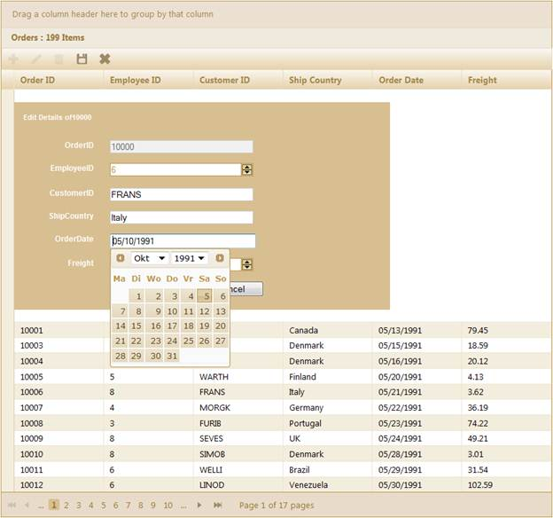
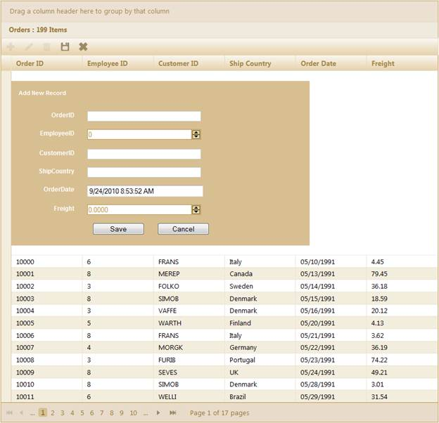
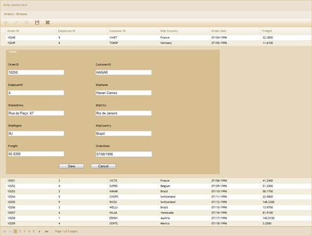
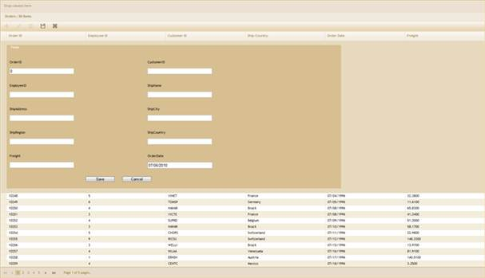

::: {style="DISPLAY: none"}
{#d2h_url_template}{#d2h_package_url style="WIDTH: 0px; DISPLAY: none; HEIGHT: 0px"}
:::

::: {.d2h_secondary_topic style="PADDING-BOTTOM: 10pt; MARGIN: 0pt; PADDING-LEFT: 0pt; PADDING-RIGHT: 0pt; PADDING-TOP: 0pt"}
##### GridMode Configuration {#gridmode-configuration style="tab-stops: 0pt"}

 

[·      ]{style="FONT-FAMILY: Symbol"}Essential Grid provides three modes for editing. To change the EditForm mode in editing, use the **EditMode()** method.

 

+---------------------------------------------------------------------------------------------------------------------------------------------------------------------------------------------------------------------------------------------------------------+
| **[View \[ASPX\]]{style="FONT-FAMILY: 'Courier New'"}**                                                                                                                                                                                                       |
|                                                                                                                                                                                                                                                               |
| [\<%]{style="FONT-FAMILY: 'Courier New'; BACKGROUND: yellow"}[=]{style="FONT-FAMILY: 'Courier New'; COLOR: blue"}[Html.Syncfusion().Grid\<[EditableOrder]{style="COLOR: #2b91af"}\>([\"Grid1\"]{style="COLOR: #a31515"})]{style="FONT-FAMILY: 'Courier New'"} |
|                                                                                                                                                                                                                                                               |
| [                         .ActionMode(ActionMode.JSON)]{style="FONT-FAMILY: 'Courier New'"}                                                                                                                                                                   |
|                                                                                                                                                                                                                                                               |
| [                         .Caption([\"Orders\"]{style="COLOR: #a31515"})                         ]{style="FONT-FAMILY: 'Courier New'"}                                                                                                                        |
|                                                                                                                                                                                                                                                               |
| [                        .Editing( edit=\>{]{style="FONT-FAMILY: 'Courier New'"}                                                                                                                                                                              |
|                                                                                                                                                                                                                                                               |
| **[edit.EditMode([GridEditMode]{style="COLOR: #2b91af"}.InlineForm);]{style="FONT-FAMILY: 'Courier New'"}**[                                         ]{style="FONT-FAMILY: 'Courier New'"}                                                                    |
|                                                                                                                                                                                                                                                               |
| [                        })                      ]{style="FONT-FAMILY: 'Courier New'"}                                                                                                                                                                        |
|                                                                                                                                                                                                                                                               |
| [    [%\>]{style="BACKGROUND: yellow"}]{style="FONT-FAMILY: 'Courier New'"}[]{style="FONT-FAMILY: 'Times New Roman','serif'; FONT-SIZE: 12pt"}                                                                                                                |
+---------------------------------------------------------------------------------------------------------------------------------------------------------------------------------------------------------------------------------------------------------------+

[]{style="FONT-FAMILY: 'Times New Roman','serif'; FONT-SIZE: 12pt"} 

+---------------------------------------------------------------------------------------------------------------------------------------------------------------------------------------------------------------------------------------------------------------+
| **[View \[cshtml\]]{style="FONT-FAMILY: 'Courier New'"}**                                                                                                                                                                                                     |
|                                                                                                                                                                                                                                                               |
| [\@{]{style="FONT-FAMILY: 'Courier New'; BACKGROUND: yellow"}[ ]{style="FONT-FAMILY: 'Courier New'; COLOR: blue"}[Html.Syncfusion().Grid\<[EditableOrder]{style="COLOR: #2b91af"}\>([\"Grid1\"]{style="COLOR: #a31515"})]{style="FONT-FAMILY: 'Courier New'"} |
|                                                                                                                                                                                                                                                               |
| [                         .ActionMode(ActionMode.JSON)]{style="FONT-FAMILY: 'Courier New'"}                                                                                                                                                                   |
|                                                                                                                                                                                                                                                               |
| [                         .Caption([\"Orders\"]{style="COLOR: #a31515"})                         ]{style="FONT-FAMILY: 'Courier New'"}                                                                                                                        |
|                                                                                                                                                                                                                                                               |
| [                        .Editing( edit=\>{]{style="FONT-FAMILY: 'Courier New'"}                                                                                                                                                                              |
|                                                                                                                                                                                                                                                               |
| **[edit.EditMode([GridEditMode]{style="COLOR: #2b91af"}.InlineForm);]{style="FONT-FAMILY: 'Courier New'"}**[                                         ]{style="FONT-FAMILY: 'Courier New'"}                                                                    |
|                                                                                                                                                                                                                                                               |
| [                        }).Render();                     ]{style="FONT-FAMILY: 'Courier New'"}                                                                                                                                                               |
|                                                                                                                                                                                                                                                               |
| [    [}]{style="BACKGROUND: yellow"}]{style="FONT-FAMILY: 'Courier New'"}[]{style="FONT-FAMILY: 'Times New Roman','serif'; FONT-SIZE: 12pt"}                                                                                                                  |
+---------------------------------------------------------------------------------------------------------------------------------------------------------------------------------------------------------------------------------------------------------------+

After configuring the edit mode as **InlineForm**, the grid will appear in the editing mode as displayed below.

{border="0"}

Figure 158: Grid with Inline Form Editing

[]{style="FONT-FAMILY: 'Times New Roman','serif'; FONT-SIZE: 12pt"} 

{border="0"}

Figure 159: Grid with Inline Form Insert Mode

*[]{style="FONT-SIZE: 9pt"}* 

[·      ]{style="FONT-FAMILY: Symbol"}To use the **Templateform** editing mode, follow the steps displayed below. 

Create the template in partial view, as shown in the following code sample.

+--------------------------------------------------------------------------------------------------------------------------------------------------------------------------------------------------------------------------------------------------------------------------------------------------+
| [\<]{style="FONT-FAMILY: 'Courier New'; COLOR: blue"}[fieldset]{style="FONT-FAMILY: 'Courier New'; COLOR: maroon"}[\>]{style="FONT-FAMILY: 'Courier New'; COLOR: blue"}[]{style="FONT-FAMILY: 'Courier New'"}                                                                                    |
|                                                                                                                                                                                                                                                                                                  |
| [    [\<]{style="COLOR: blue"}[legend]{style="COLOR: maroon"}[\>]{style="COLOR: blue"}Fields[\</]{style="COLOR: blue"}[legend]{style="COLOR: maroon"}[\>]{style="COLOR: blue"}]{style="FONT-FAMILY: 'Courier New'"}                                                                              |
|                                                                                                                                                                                                                                                                                                  |
| [    [\<]{style="COLOR: blue"}[div]{style="COLOR: maroon"} [class]{style="COLOR: red"}[=\"tablediv\"\>]{style="COLOR: blue"}]{style="FONT-FAMILY: 'Courier New'"}                                                                                                                                |
|                                                                                                                                                                                                                                                                                                  |
| [        [\<]{style="COLOR: blue"}[div]{style="COLOR: maroon"} [class]{style="COLOR: red"}[=\"rowdiv\"\>]{style="COLOR: blue"}]{style="FONT-FAMILY: 'Courier New'"}                                                                                                                              |
|                                                                                                                                                                                                                                                                                                  |
| [            [\<]{style="COLOR: blue"}[div]{style="COLOR: maroon"} [class]{style="COLOR: red"}[=\"celldiv\"]{style="COLOR: blue"} [style]{style="COLOR: red"}[=\"]{style="COLOR: blue"}[height]{style="COLOR: red"}[: auto\"\>]{style="COLOR: blue"}]{style="FONT-FAMILY: 'Courier New'"}        |
|                                                                                                                                                                                                                                                                                                  |
| [                [\<]{style="COLOR: blue"}[div]{style="COLOR: maroon"} [class]{style="COLOR: red"}[=\"editor-label\"\>]{style="COLOR: blue"}]{style="FONT-FAMILY: 'Courier New'"}                                                                                                                |
|                                                                                                                                                                                                                                                                                                  |
| [                    [\<%]{style="BACKGROUND: yellow"}[=]{style="COLOR: blue"} Html. LabelFor(model =\> model.OrderID) [%\>]{style="BACKGROUND: yellow"}]{style="FONT-FAMILY: 'Courier New'"}                                                                                                    |
|                                                                                                                                                                                                                                                                                                  |
| [                [\</]{style="COLOR: blue"}[div]{style="COLOR: maroon"}[\>]{style="COLOR: blue"}]{style="FONT-FAMILY: 'Courier New'"}                                                                                                                                                            |
|                                                                                                                                                                                                                                                                                                  |
| [                [\<]{style="COLOR: blue"}[div]{style="COLOR: maroon"} [class]{style="COLOR: red"}[=\"editor-field\"\>]{style="COLOR: blue"}]{style="FONT-FAMILY: 'Courier New'"}                                                                                                                |
|                                                                                                                                                                                                                                                                                                  |
| [                    [\<%]{style="BACKGROUND: yellow"}[=]{style="COLOR: blue"} Html. TextBoxFor(model =\> model.OrderID) [%\>]{style="BACKGROUND: yellow"}]{style="FONT-FAMILY: 'Courier New'"}                                                                                                  |
|                                                                                                                                                                                                                                                                                                  |
| [                    [\<%]{style="BACKGROUND: yellow"}[=]{style="COLOR: blue"} Html. ValidationMessageFor(model =\> model.OrderID) [%\>]{style="BACKGROUND: yellow"}]{style="FONT-FAMILY: 'Courier New'"}                                                                                        |
|                                                                                                                                                                                                                                                                                                  |
| [                [\</]{style="COLOR: blue"}[div]{style="COLOR: maroon"}[\>]{style="COLOR: blue"}]{style="FONT-FAMILY: 'Courier New'"}                                                                                                                                                            |
|                                                                                                                                                                                                                                                                                                  |
| [            [\</]{style="COLOR: blue"}[div]{style="COLOR: maroon"}[\>]{style="COLOR: blue"}]{style="FONT-FAMILY: 'Courier New'"}                                                                                                                                                                |
|                                                                                                                                                                                                                                                                                                  |
| [            [\<]{style="COLOR: blue"}[div]{style="COLOR: maroon"} [class]{style="COLOR: red"}[=\"celldiv\"]{style="COLOR: blue"} [style]{style="COLOR: red"}[=\"]{style="COLOR: blue"}[height]{style="COLOR: red"}[: auto\"\>]{style="COLOR: blue"}]{style="FONT-FAMILY: 'Courier New'"}        |
|                                                                                                                                                                                                                                                                                                  |
| [                [\<]{style="COLOR: blue"}[div]{style="COLOR: maroon"} [class]{style="COLOR: red"}[=\"editor-label\"\>]{style="COLOR: blue"}]{style="FONT-FAMILY: 'Courier New'"}                                                                                                                |
|                                                                                                                                                                                                                                                                                                  |
| [                    [\<%]{style="BACKGROUND: yellow"}[=]{style="COLOR: blue"} Html. LabelFor(model =\> model.CustomerID) [%\>]{style="BACKGROUND: yellow"}]{style="FONT-FAMILY: 'Courier New'"}                                                                                                 |
|                                                                                                                                                                                                                                                                                                  |
| [                [\</]{style="COLOR: blue"}[div]{style="COLOR: maroon"}[\>]{style="COLOR: blue"}]{style="FONT-FAMILY: 'Courier New'"}                                                                                                                                                            |
|                                                                                                                                                                                                                                                                                                  |
| [                [\<]{style="COLOR: blue"}[div]{style="COLOR: maroon"} [class]{style="COLOR: red"}[=\"editor-field\"\>]{style="COLOR: blue"}]{style="FONT-FAMILY: 'Courier New'"}                                                                                                                |
|                                                                                                                                                                                                                                                                                                  |
| [                    [\<%]{style="BACKGROUND: yellow"}[=]{style="COLOR: blue"} Html. TextBoxFor(model =\> model.CustomerID) [%\>]{style="BACKGROUND: yellow"}]{style="FONT-FAMILY: 'Courier New'"}                                                                                               |
|                                                                                                                                                                                                                                                                                                  |
| [                    [\<%]{style="BACKGROUND: yellow"}[=]{style="COLOR: blue"} Html. ValidationMessageFor(model =\> model.CustomerID) [%\>]{style="BACKGROUND: yellow"}]{style="FONT-FAMILY: 'Courier New'"}                                                                                     |
|                                                                                                                                                                                                                                                                                                  |
| [                [\</]{style="COLOR: blue"}[div]{style="COLOR: maroon"}[\>]{style="COLOR: blue"}]{style="FONT-FAMILY: 'Courier New'"}                                                                                                                                                            |
|                                                                                                                                                                                                                                                                                                  |
| [            [\</]{style="COLOR: blue"}[div]{style="COLOR: maroon"}[\>]{style="COLOR: blue"}]{style="FONT-FAMILY: 'Courier New'"}                                                                                                                                                                |
|                                                                                                                                                                                                                                                                                                  |
| [        [\</]{style="COLOR: blue"}[div]{style="COLOR: maroon"}[\>]{style="COLOR: blue"}]{style="FONT-FAMILY: 'Courier New'"}                                                                                                                                                                    |
|                                                                                                                                                                                                                                                                                                  |
| [        [\<]{style="COLOR: blue"}[div]{style="COLOR: maroon"} [class]{style="COLOR: red"}[=\"rowdiv\"\>]{style="COLOR: blue"}]{style="FONT-FAMILY: 'Courier New'"}                                                                                                                              |
|                                                                                                                                                                                                                                                                                                  |
| [            [\<]{style="COLOR: blue"}[div]{style="COLOR: maroon"} [class]{style="COLOR: red"}[=\"celldiv\"]{style="COLOR: blue"} [style]{style="COLOR: red"}[=\"]{style="COLOR: blue"}[height]{style="COLOR: red"}[: auto\"\>]{style="COLOR: blue"}]{style="FONT-FAMILY: 'Courier New'"}        |
|                                                                                                                                                                                                                                                                                                  |
| [                [\<]{style="COLOR: blue"}[div]{style="COLOR: maroon"} [class]{style="COLOR: red"}[=\"editor-label\"\>]{style="COLOR: blue"}]{style="FONT-FAMILY: 'Courier New'"}                                                                                                                |
|                                                                                                                                                                                                                                                                                                  |
| [                    [\<%]{style="BACKGROUND: yellow"}[=]{style="COLOR: blue"} Html. LabelFor(model =\> model.EmployeeID) [%\>]{style="BACKGROUND: yellow"}]{style="FONT-FAMILY: 'Courier New'"}                                                                                                 |
|                                                                                                                                                                                                                                                                                                  |
| [                [\</]{style="COLOR: blue"}[div]{style="COLOR: maroon"}[\>]{style="COLOR: blue"}]{style="FONT-FAMILY: 'Courier New'"}                                                                                                                                                            |
|                                                                                                                                                                                                                                                                                                  |
| [                [\<]{style="COLOR: blue"}[div]{style="COLOR: maroon"} [class]{style="COLOR: red"}[=\"editor-field\"\>]{style="COLOR: blue"}]{style="FONT-FAMILY: 'Courier New'"}                                                                                                                |
|                                                                                                                                                                                                                                                                                                  |
| [                    [\<%]{style="BACKGROUND: yellow"}[=]{style="COLOR: blue"} Html. TextBoxFor(model =\> model.EmployeeID) [%\>]{style="BACKGROUND: yellow"}]{style="FONT-FAMILY: 'Courier New'"}                                                                                               |
|                                                                                                                                                                                                                                                                                                  |
| [                    [\<%]{style="BACKGROUND: yellow"}[=]{style="COLOR: blue"} Html. ValidationMessageFor(model =\> model.EmployeeID) [%\>]{style="BACKGROUND: yellow"}]{style="FONT-FAMILY: 'Courier New'"}                                                                                     |
|                                                                                                                                                                                                                                                                                                  |
| [                [\</]{style="COLOR: blue"}[div]{style="COLOR: maroon"}[\>]{style="COLOR: blue"}]{style="FONT-FAMILY: 'Courier New'"}                                                                                                                                                            |
|                                                                                                                                                                                                                                                                                                  |
| [            [\</]{style="COLOR: blue"}[div]{style="COLOR: maroon"}[\>]{style="COLOR: blue"}]{style="FONT-FAMILY: 'Courier New'"}                                                                                                                                                                |
|                                                                                                                                                                                                                                                                                                  |
| [            [\<]{style="COLOR: blue"}[div]{style="COLOR: maroon"} [class]{style="COLOR: red"}[=\"celldiv\"]{style="COLOR: blue"} [style]{style="COLOR: red"}[=\"]{style="COLOR: blue"}[height]{style="COLOR: red"}[: auto\"\>]{style="COLOR: blue"}]{style="FONT-FAMILY: 'Courier New'"}        |
|                                                                                                                                                                                                                                                                                                  |
| [                [\<]{style="COLOR: blue"}[div]{style="COLOR: maroon"} [class]{style="COLOR: red"}[=\"editor-label\"\>]{style="COLOR: blue"}]{style="FONT-FAMILY: 'Courier New'"}                                                                                                                |
|                                                                                                                                                                                                                                                                                                  |
| [                    [\<%]{style="BACKGROUND: yellow"}[=]{style="COLOR: blue"} Html. LabelFor(model =\> model.ShipName) [%\>]{style="BACKGROUND: yellow"}]{style="FONT-FAMILY: 'Courier New'"}                                                                                                   |
|                                                                                                                                                                                                                                                                                                  |
| [                [\</]{style="COLOR: blue"}[div]{style="COLOR: maroon"}[\>]{style="COLOR: blue"}]{style="FONT-FAMILY: 'Courier New'"}                                                                                                                                                            |
|                                                                                                                                                                                                                                                                                                  |
| [                [\<]{style="COLOR: blue"}[div]{style="COLOR: maroon"} [class]{style="COLOR: red"}[=\"editor-field\"\>]{style="COLOR: blue"}]{style="FONT-FAMILY: 'Courier New'"}                                                                                                                |
|                                                                                                                                                                                                                                                                                                  |
| [                    [\<%]{style="BACKGROUND: yellow"}[=]{style="COLOR: blue"} Html. TextBoxFor(model =\> model.ShipName) [%\>]{style="BACKGROUND: yellow"}]{style="FONT-FAMILY: 'Courier New'"}                                                                                                 |
|                                                                                                                                                                                                                                                                                                  |
| [                    [\<%]{style="BACKGROUND: yellow"}[=]{style="COLOR: blue"} Html. ValidationMessageFor(model =\> model.ShipName) [%\>]{style="BACKGROUND: yellow"}]{style="FONT-FAMILY: 'Courier New'"}                                                                                       |
|                                                                                                                                                                                                                                                                                                  |
| [                [\</]{style="COLOR: blue"}[div]{style="COLOR: maroon"}[\>]{style="COLOR: blue"}]{style="FONT-FAMILY: 'Courier New'"}                                                                                                                                                            |
|                                                                                                                                                                                                                                                                                                  |
| [            [\</]{style="COLOR: blue"}[div]{style="COLOR: maroon"}[\>]{style="COLOR: blue"}]{style="FONT-FAMILY: 'Courier New'"}                                                                                                                                                                |
|                                                                                                                                                                                                                                                                                                  |
| [        [\</]{style="COLOR: blue"}[div]{style="COLOR: maroon"}[\>]{style="COLOR: blue"}]{style="FONT-FAMILY: 'Courier New'"}                                                                                                                                                                    |
|                                                                                                                                                                                                                                                                                                  |
| [        [\<]{style="COLOR: blue"}[div]{style="COLOR: maroon"} [class]{style="COLOR: red"}[=\"rowdiv\"\>]{style="COLOR: blue"}]{style="FONT-FAMILY: 'Courier New'"}                                                                                                                              |
|                                                                                                                                                                                                                                                                                                  |
| [            [\<]{style="COLOR: blue"}[div]{style="COLOR: maroon"} [class]{style="COLOR: red"}[=\"celldiv\"]{style="COLOR: blue"} [style]{style="COLOR: red"}[=\"]{style="COLOR: blue"}[height]{style="COLOR: red"}[: auto\"\>]{style="COLOR: blue"}]{style="FONT-FAMILY: 'Courier New'"}        |
|                                                                                                                                                                                                                                                                                                  |
| [                [\<]{style="COLOR: blue"}[div]{style="COLOR: maroon"} [class]{style="COLOR: red"}[=\"editor-label\"\>]{style="COLOR: blue"}]{style="FONT-FAMILY: 'Courier New'"}                                                                                                                |
|                                                                                                                                                                                                                                                                                                  |
| [                    [\<%]{style="BACKGROUND: yellow"}[=]{style="COLOR: blue"} Html. LabelFor(model =\> model.ShipAddress) [%\>]{style="BACKGROUND: yellow"}]{style="FONT-FAMILY: 'Courier New'"}                                                                                                |
|                                                                                                                                                                                                                                                                                                  |
| [                [\</]{style="COLOR: blue"}[div]{style="COLOR: maroon"}[\>]{style="COLOR: blue"}]{style="FONT-FAMILY: 'Courier New'"}                                                                                                                                                            |
|                                                                                                                                                                                                                                                                                                  |
| [                [\<]{style="COLOR: blue"}[div]{style="COLOR: maroon"} [class]{style="COLOR: red"}[=\"editor-field\"\>]{style="COLOR: blue"}]{style="FONT-FAMILY: 'Courier New'"}                                                                                                                |
|                                                                                                                                                                                                                                                                                                  |
| [                    [\<%]{style="BACKGROUND: yellow"}[=]{style="COLOR: blue"} Html. TextBoxFor(model =\> model.ShipAddress) [%\>]{style="BACKGROUND: yellow"}]{style="FONT-FAMILY: 'Courier New'"}                                                                                              |
|                                                                                                                                                                                                                                                                                                  |
| [                    [\<%]{style="BACKGROUND: yellow"}[=]{style="COLOR: blue"} Html. ValidationMessageFor(model =\> model.ShipAddress) [%\>]{style="BACKGROUND: yellow"}]{style="FONT-FAMILY: 'Courier New'"}                                                                                    |
|                                                                                                                                                                                                                                                                                                  |
| [                [\</]{style="COLOR: blue"}[div]{style="COLOR: maroon"}[\>]{style="COLOR: blue"}]{style="FONT-FAMILY: 'Courier New'"}                                                                                                                                                            |
|                                                                                                                                                                                                                                                                                                  |
| [            [\</]{style="COLOR: blue"}[div]{style="COLOR: maroon"}[\>]{style="COLOR: blue"}]{style="FONT-FAMILY: 'Courier New'"}                                                                                                                                                                |
|                                                                                                                                                                                                                                                                                                  |
| [            [\<]{style="COLOR: blue"}[div]{style="COLOR: maroon"} [class]{style="COLOR: red"}[=\"celldiv\"]{style="COLOR: blue"} [style]{style="COLOR: red"}[=\"]{style="COLOR: blue"}[height]{style="COLOR: red"}[: auto\"\>]{style="COLOR: blue"}]{style="FONT-FAMILY: 'Courier New'"}        |
|                                                                                                                                                                                                                                                                                                  |
| [                [\<]{style="COLOR: blue"}[div]{style="COLOR: maroon"} [class]{style="COLOR: red"}[=\"editor-label\"\>]{style="COLOR: blue"}]{style="FONT-FAMILY: 'Courier New'"}                                                                                                                |
|                                                                                                                                                                                                                                                                                                  |
| [                    [\<%]{style="BACKGROUND: yellow"}[=]{style="COLOR: blue"} Html. LabelFor(model =\> model.ShipCity) [%\>]{style="BACKGROUND: yellow"}]{style="FONT-FAMILY: 'Courier New'"}                                                                                                   |
|                                                                                                                                                                                                                                                                                                  |
| [                [\</]{style="COLOR: blue"}[div]{style="COLOR: maroon"}[\>]{style="COLOR: blue"}]{style="FONT-FAMILY: 'Courier New'"}                                                                                                                                                            |
|                                                                                                                                                                                                                                                                                                  |
| [                [\<]{style="COLOR: blue"}[div]{style="COLOR: maroon"} [class]{style="COLOR: red"}[=\"editor-field\"\>]{style="COLOR: blue"}]{style="FONT-FAMILY: 'Courier New'"}                                                                                                                |
|                                                                                                                                                                                                                                                                                                  |
| [                    [\<%]{style="BACKGROUND: yellow"}[=]{style="COLOR: blue"} Html. TextBoxFor(model =\> model.ShipCity) [%\>]{style="BACKGROUND: yellow"}]{style="FONT-FAMILY: 'Courier New'"}                                                                                                 |
|                                                                                                                                                                                                                                                                                                  |
| [                    [\<%]{style="BACKGROUND: yellow"}[=]{style="COLOR: blue"} Html. ValidationMessageFor(model =\> model.ShipCity) [%\>]{style="BACKGROUND: yellow"}]{style="FONT-FAMILY: 'Courier New'"}                                                                                       |
|                                                                                                                                                                                                                                                                                                  |
| [                [\</]{style="COLOR: blue"}[div]{style="COLOR: maroon"}[\>]{style="COLOR: blue"}]{style="FONT-FAMILY: 'Courier New'"}                                                                                                                                                            |
|                                                                                                                                                                                                                                                                                                  |
| [            [\</]{style="COLOR: blue"}[div]{style="COLOR: maroon"}[\>]{style="COLOR: blue"}]{style="FONT-FAMILY: 'Courier New'"}                                                                                                                                                                |
|                                                                                                                                                                                                                                                                                                  |
| [        [\</]{style="COLOR: blue"}[div]{style="COLOR: maroon"}[\>]{style="COLOR: blue"}]{style="FONT-FAMILY: 'Courier New'"}                                                                                                                                                                    |
|                                                                                                                                                                                                                                                                                                  |
| [        [\<]{style="COLOR: blue"}[div]{style="COLOR: maroon"} [class]{style="COLOR: red"}[=\"rowdiv\"\>]{style="COLOR: blue"}]{style="FONT-FAMILY: 'Courier New'"}                                                                                                                              |
|                                                                                                                                                                                                                                                                                                  |
| [            [\<]{style="COLOR: blue"}[div]{style="COLOR: maroon"} [class]{style="COLOR: red"}[=\"celldiv\"]{style="COLOR: blue"} [style]{style="COLOR: red"}[=\"]{style="COLOR: blue"}[height]{style="COLOR: red"}[: auto\"\>]{style="COLOR: blue"}]{style="FONT-FAMILY: 'Courier New'"}        |
|                                                                                                                                                                                                                                                                                                  |
| [                [\<]{style="COLOR: blue"}[div]{style="COLOR: maroon"} [class]{style="COLOR: red"}[=\"editor-label\"\>]{style="COLOR: blue"}]{style="FONT-FAMILY: 'Courier New'"}                                                                                                                |
|                                                                                                                                                                                                                                                                                                  |
| [                    [\<%]{style="BACKGROUND: yellow"}[=]{style="COLOR: blue"} Html. LabelFor(model =\> model.ShipRegion) [%\>]{style="BACKGROUND: yellow"}]{style="FONT-FAMILY: 'Courier New'"}                                                                                                 |
|                                                                                                                                                                                                                                                                                                  |
| [                [\</]{style="COLOR: blue"}[div]{style="COLOR: maroon"}[\>]{style="COLOR: blue"}]{style="FONT-FAMILY: 'Courier New'"}                                                                                                                                                            |
|                                                                                                                                                                                                                                                                                                  |
| [                [\<]{style="COLOR: blue"}[div]{style="COLOR: maroon"} [class]{style="COLOR: red"}[=\"editor-field\"\>]{style="COLOR: blue"}]{style="FONT-FAMILY: 'Courier New'"}                                                                                                                |
|                                                                                                                                                                                                                                                                                                  |
| [                    [\<%]{style="BACKGROUND: yellow"}[=]{style="COLOR: blue"} Html. TextBoxFor(model =\> model.ShipRegion) [%\>]{style="BACKGROUND: yellow"}]{style="FONT-FAMILY: 'Courier New'"}                                                                                               |
|                                                                                                                                                                                                                                                                                                  |
| [                    [\<%]{style="BACKGROUND: yellow"}[=]{style="COLOR: blue"} Html. ValidationMessageFor(model =\> model.ShipRegion) [%\>]{style="BACKGROUND: yellow"}]{style="FONT-FAMILY: 'Courier New'"}                                                                                     |
|                                                                                                                                                                                                                                                                                                  |
| [                [\</]{style="COLOR: blue"}[div]{style="COLOR: maroon"}[\>]{style="COLOR: blue"}]{style="FONT-FAMILY: 'Courier New'"}                                                                                                                                                            |
|                                                                                                                                                                                                                                                                                                  |
| [            [\</]{style="COLOR: blue"}[div]{style="COLOR: maroon"}[\>]{style="COLOR: blue"}]{style="FONT-FAMILY: 'Courier New'"}                                                                                                                                                                |
|                                                                                                                                                                                                                                                                                                  |
| [            [\<]{style="COLOR: blue"}[div]{style="COLOR: maroon"} [class]{style="COLOR: red"}[=\"celldiv\"]{style="COLOR: blue"} [style]{style="COLOR: red"}[=\"]{style="COLOR: blue"}[height]{style="COLOR: red"}[: auto\"\>]{style="COLOR: blue"}]{style="FONT-FAMILY: 'Courier New'"}        |
|                                                                                                                                                                                                                                                                                                  |
| [                [\<]{style="COLOR: blue"}[div]{style="COLOR: maroon"} [class]{style="COLOR: red"}[=\"editor-label\"\>]{style="COLOR: blue"}]{style="FONT-FAMILY: 'Courier New'"}                                                                                                                |
|                                                                                                                                                                                                                                                                                                  |
| [                    [\<%]{style="BACKGROUND: yellow"}[=]{style="COLOR: blue"} Html. LabelFor(model =\> model.ShipCountry) [%\>]{style="BACKGROUND: yellow"}]{style="FONT-FAMILY: 'Courier New'"}                                                                                                |
|                                                                                                                                                                                                                                                                                                  |
| [                [\</]{style="COLOR: blue"}[div]{style="COLOR: maroon"}[\>]{style="COLOR: blue"}]{style="FONT-FAMILY: 'Courier New'"}                                                                                                                                                            |
|                                                                                                                                                                                                                                                                                                  |
| [                [\<]{style="COLOR: blue"}[div]{style="COLOR: maroon"} [class]{style="COLOR: red"}[=\"editor-field\"\>]{style="COLOR: blue"}]{style="FONT-FAMILY: 'Courier New'"}                                                                                                                |
|                                                                                                                                                                                                                                                                                                  |
| [                    [\<%]{style="BACKGROUND: yellow"}[=]{style="COLOR: blue"} Html. TextBoxFor(model =\> model.ShipCountry) [%\>]{style="BACKGROUND: yellow"}]{style="FONT-FAMILY: 'Courier New'"}                                                                                              |
|                                                                                                                                                                                                                                                                                                  |
| [                    [\<%]{style="BACKGROUND: yellow"}[=]{style="COLOR: blue"} Html. ValidationMessageFor(model =\> model.ShipCountry) [%\>]{style="BACKGROUND: yellow"}]{style="FONT-FAMILY: 'Courier New'"}                                                                                    |
|                                                                                                                                                                                                                                                                                                  |
| [                [\</]{style="COLOR: blue"}[div]{style="COLOR: maroon"}[\>]{style="COLOR: blue"}]{style="FONT-FAMILY: 'Courier New'"}                                                                                                                                                            |
|                                                                                                                                                                                                                                                                                                  |
| [            [\</]{style="COLOR: blue"}[div]{style="COLOR: maroon"}[\>]{style="COLOR: blue"}]{style="FONT-FAMILY: 'Courier New'"}                                                                                                                                                                |
|                                                                                                                                                                                                                                                                                                  |
| [        [\</]{style="COLOR: blue"}[div]{style="COLOR: maroon"}[\>]{style="COLOR: blue"}]{style="FONT-FAMILY: 'Courier New'"}                                                                                                                                                                    |
|                                                                                                                                                                                                                                                                                                  |
| [        [\<]{style="COLOR: blue"}[div]{style="COLOR: maroon"} [class]{style="COLOR: red"}[=\"rowdiv\"\>]{style="COLOR: blue"}]{style="FONT-FAMILY: 'Courier New'"}                                                                                                                              |
|                                                                                                                                                                                                                                                                                                  |
| [            [\<]{style="COLOR: blue"}[div]{style="COLOR: maroon"} [class]{style="COLOR: red"}[=\"celldiv\"]{style="COLOR: blue"} [style]{style="COLOR: red"}[=\"]{style="COLOR: blue"}[height]{style="COLOR: red"}[: auto\"\>]{style="COLOR: blue"}]{style="FONT-FAMILY: 'Courier New'"}        |
|                                                                                                                                                                                                                                                                                                  |
| [                [\<]{style="COLOR: blue"}[div]{style="COLOR: maroon"} [class]{style="COLOR: red"}[=\"editor-label\"\>]{style="COLOR: blue"}]{style="FONT-FAMILY: 'Courier New'"}                                                                                                                |
|                                                                                                                                                                                                                                                                                                  |
| [                    [\<%]{style="BACKGROUND: yellow"}[=]{style="COLOR: blue"} Html. LabelFor(model =\> model.Freight) [%\>]{style="BACKGROUND: yellow"}]{style="FONT-FAMILY: 'Courier New'"}                                                                                                    |
|                                                                                                                                                                                                                                                                                                  |
| [                [\</]{style="COLOR: blue"}[div]{style="COLOR: maroon"}[\>]{style="COLOR: blue"}]{style="FONT-FAMILY: 'Courier New'"}                                                                                                                                                            |
|                                                                                                                                                                                                                                                                                                  |
| [                [\<]{style="COLOR: blue"}[div]{style="COLOR: maroon"} [class]{style="COLOR: red"}[=\"editor-field\"\>]{style="COLOR: blue"}]{style="FONT-FAMILY: 'Courier New'"}                                                                                                                |
|                                                                                                                                                                                                                                                                                                  |
| [                    [\<%]{style="BACKGROUND: yellow"}[=]{style="COLOR: blue"} Html. TextBoxFor(model =\> model.Freight) [%\>]{style="BACKGROUND: yellow"}]{style="FONT-FAMILY: 'Courier New'"}                                                                                                  |
|                                                                                                                                                                                                                                                                                                  |
| [                    [\<%]{style="BACKGROUND: yellow"}[=]{style="COLOR: blue"} Html. ValidationMessageFor(model =\> model.Freight) [%\>]{style="BACKGROUND: yellow"}]{style="FONT-FAMILY: 'Courier New'"}                                                                                        |
|                                                                                                                                                                                                                                                                                                  |
| [                [\</]{style="COLOR: blue"}[div]{style="COLOR: maroon"}[\>]{style="COLOR: blue"}]{style="FONT-FAMILY: 'Courier New'"}                                                                                                                                                            |
|                                                                                                                                                                                                                                                                                                  |
| [            [\</]{style="COLOR: blue"}[div]{style="COLOR: maroon"}[\>]{style="COLOR: blue"}]{style="FONT-FAMILY: 'Courier New'"}                                                                                                                                                                |
|                                                                                                                                                                                                                                                                                                  |
| [            [\<]{style="COLOR: blue"}[div]{style="COLOR: maroon"} [class]{style="COLOR: red"}[=\"celldiv\"]{style="COLOR: blue"} [style]{style="COLOR: red"}[=\"]{style="COLOR: blue"}[height]{style="COLOR: red"}[: auto\"\>]{style="COLOR: blue"}]{style="FONT-FAMILY: 'Courier New'"}        |
|                                                                                                                                                                                                                                                                                                  |
| [                [\<]{style="COLOR: blue"}[div]{style="COLOR: maroon"} [class]{style="COLOR: red"}[=\"editor-label\"\>]{style="COLOR: blue"}]{style="FONT-FAMILY: 'Courier New'"}                                                                                                                |
|                                                                                                                                                                                                                                                                                                  |
| [                    [\<%]{style="BACKGROUND: yellow"}[=]{style="COLOR: blue"} Html. LabelFor(model =\> model.OrderDate) [%\>]{style="BACKGROUND: yellow"}]{style="FONT-FAMILY: 'Courier New'"}                                                                                                  |
|                                                                                                                                                                                                                                                                                                  |
| [                [\</]{style="COLOR: blue"}[div]{style="COLOR: maroon"}[\>]{style="COLOR: blue"}]{style="FONT-FAMILY: 'Courier New'"}                                                                                                                                                            |
|                                                                                                                                                                                                                                                                                                  |
| [                [\<]{style="COLOR: blue"}[div]{style="COLOR: maroon"} [class]{style="COLOR: red"}[=\"editor-field\"\>]{style="COLOR: blue"}]{style="FONT-FAMILY: 'Courier New'"}                                                                                                                |
|                                                                                                                                                                                                                                                                                                  |
| [                    [\<%]{style="BACKGROUND: yellow"}[=]{style="COLOR: blue"} Html. TextBoxFor(model =\> model.OrderDate, [String]{style="COLOR: #2b91af"}.Format([\"{0:g}\"]{style="COLOR: #a31515"}, Model.OrderDate)) [%\>]{style="BACKGROUND: yellow"}]{style="FONT-FAMILY: 'Courier New'"} |
|                                                                                                                                                                                                                                                                                                  |
| [                    [\<%]{style="BACKGROUND: yellow"}[=]{style="COLOR: blue"} Html. ValidationMessageFor(model =\> model.OrderDate) [%\>]{style="BACKGROUND: yellow"}]{style="FONT-FAMILY: 'Courier New'"}                                                                                      |
|                                                                                                                                                                                                                                                                                                  |
| [                [\</]{style="COLOR: blue"}[div]{style="COLOR: maroon"}[\>]{style="COLOR: blue"}]{style="FONT-FAMILY: 'Courier New'"}                                                                                                                                                            |
|                                                                                                                                                                                                                                                                                                  |
| [            [\</]{style="COLOR: blue"}[div]{style="COLOR: maroon"}[\>]{style="COLOR: blue"}]{style="FONT-FAMILY: 'Courier New'"}                                                                                                                                                                |
|                                                                                                                                                                                                                                                                                                  |
| [        [\</]{style="COLOR: blue"}[div]{style="COLOR: maroon"}[\>]{style="COLOR: blue"}]{style="FONT-FAMILY: 'Courier New'"}                                                                                                                                                                    |
|                                                                                                                                                                                                                                                                                                  |
| [    [\</]{style="COLOR: blue"}[div]{style="COLOR: maroon"}[\>]{style="COLOR: blue"}]{style="FONT-FAMILY: 'Courier New'"}                                                                                                                                                                        |
|                                                                                                                                                                                                                                                                                                  |
| [\</]{style="FONT-FAMILY: 'Courier New'; COLOR: blue"}[fieldset]{style="FONT-FAMILY: 'Courier New'; COLOR: maroon"}[\>]{style="FONT-FAMILY: 'Courier New'; COLOR: blue"}[]{style="FONT-FAMILY: 'Times New Roman','serif'; FONT-SIZE: 12pt"}                                                      |
+--------------------------------------------------------------------------------------------------------------------------------------------------------------------------------------------------------------------------------------------------------------------------------------------------+

 

 

+-------------------------------------------------------------------------------------------------------------------------------------------------------------------------------------------------------------------------------------------------------------------------------------------+
| **[View \[Razor\]]{style="FONT-FAMILY: 'Courier New'"}**                                                                                                                                                                                                                                  |
|                                                                                                                                                                                                                                                                                           |
| [\<]{style="FONT-FAMILY: 'Courier New'; COLOR: blue"}[fieldset]{style="FONT-FAMILY: 'Courier New'; COLOR: maroon"}[\>]{style="FONT-FAMILY: 'Courier New'; COLOR: blue"}[]{style="FONT-FAMILY: 'Courier New'"}                                                                             |
|                                                                                                                                                                                                                                                                                           |
| [ [\<]{style="COLOR: blue"}[legend]{style="COLOR: maroon"}[\>]{style="COLOR: blue"}Fields[\</]{style="COLOR: blue"}[legend]{style="COLOR: maroon"}[\>]{style="COLOR: blue"}]{style="FONT-FAMILY: 'Courier New'"}                                                                          |
|                                                                                                                                                                                                                                                                                           |
| [   [\<]{style="COLOR: blue"}[div]{style="COLOR: maroon"} [class]{style="COLOR: red"}[=\"tablediv\"\>]{style="COLOR: blue"}]{style="FONT-FAMILY: 'Courier New'"}                                                                                                                          |
|                                                                                                                                                                                                                                                                                           |
| [      [\<]{style="COLOR: blue"}[div]{style="COLOR: maroon"} [class]{style="COLOR: red"}[=\"rowdiv\"\>]{style="COLOR: blue"}]{style="FONT-FAMILY: 'Courier New'"}                                                                                                                         |
|                                                                                                                                                                                                                                                                                           |
| [           [\<]{style="COLOR: blue"}[div]{style="COLOR: maroon"} [class]{style="COLOR: red"}[=\"celldiv\"]{style="COLOR: blue"} [style]{style="COLOR: red"}[=\"]{style="COLOR: blue"}[height]{style="COLOR: red"}[: auto\"\>]{style="COLOR: blue"}]{style="FONT-FAMILY: 'Courier New'"}  |
|                                                                                                                                                                                                                                                                                           |
| [                [\<]{style="COLOR: blue"}[div]{style="COLOR: maroon"} [class]{style="COLOR: red"}[=\"editor-label\"\>]{style="COLOR: blue"}]{style="FONT-FAMILY: 'Courier New'"}                                                                                                         |
|                                                                                                                                                                                                                                                                                           |
| [                    [@]{style="BACKGROUND: yellow"}Html.Syncfusion().LabelFor(model =\> model.OrderID) ]{style="FONT-FAMILY: 'Courier New'"}                                                                                                                                             |
|                                                                                                                                                                                                                                                                                           |
| [                [\</]{style="COLOR: blue"}[div]{style="COLOR: maroon"}[\>]{style="COLOR: blue"}]{style="FONT-FAMILY: 'Courier New'"}                                                                                                                                                     |
|                                                                                                                                                                                                                                                                                           |
| [                [\<]{style="COLOR: blue"}[div]{style="COLOR: maroon"} [class]{style="COLOR: red"}[=\"editor-field\"\>]{style="COLOR: blue"}]{style="FONT-FAMILY: 'Courier New'"}                                                                                                         |
|                                                                                                                                                                                                                                                                                           |
| [                   [@]{style="BACKGROUND: yellow"}Html.Syncfusion().TextBoxFor(model =\> model.OrderID) ]{style="FONT-FAMILY: 'Courier New'"}                                                                                                                                            |
|                                                                                                                                                                                                                                                                                           |
| [    [@]{style="BACKGROUND: yellow"}Html.Syncfusion().ValidationMessageFor(model =\> model.OrderID) ]{style="FONT-FAMILY: 'Courier New'"}                                                                                                                                                 |
|                                                                                                                                                                                                                                                                                           |
| [   [\</]{style="COLOR: blue"}[div]{style="COLOR: maroon"}[\>]{style="COLOR: blue"}]{style="FONT-FAMILY: 'Courier New'"}                                                                                                                                                                  |
|                                                                                                                                                                                                                                                                                           |
| [          [\</]{style="COLOR: blue"}[div]{style="COLOR: maroon"}[\>]{style="COLOR: blue"}]{style="FONT-FAMILY: 'Courier New'"}                                                                                                                                                           |
|                                                                                                                                                                                                                                                                                           |
| [          [\<]{style="COLOR: blue"}[div]{style="COLOR: maroon"} [class]{style="COLOR: red"}[=\"celldiv\"]{style="COLOR: blue"} [style]{style="COLOR: red"}[=\"]{style="COLOR: blue"}[height]{style="COLOR: red"}[: auto\"\>]{style="COLOR: blue"}]{style="FONT-FAMILY: 'Courier New'"}   |
|                                                                                                                                                                                                                                                                                           |
| [                [\<]{style="COLOR: blue"}[div]{style="COLOR: maroon"} [class]{style="COLOR: red"}[=\"editor-label\"\>]{style="COLOR: blue"}]{style="FONT-FAMILY: 'Courier New'"}                                                                                                         |
|                                                                                                                                                                                                                                                                                           |
| [                    [@]{style="BACKGROUND: yellow"}Html.Syncfusion().LabelFor(model =\> model.CustomerID) ]{style="FONT-FAMILY: 'Courier New'"}                                                                                                                                          |
|                                                                                                                                                                                                                                                                                           |
| [                [\</]{style="COLOR: blue"}[div]{style="COLOR: maroon"}[\>]{style="COLOR: blue"}]{style="FONT-FAMILY: 'Courier New'"}                                                                                                                                                     |
|                                                                                                                                                                                                                                                                                           |
| [                [\<]{style="COLOR: blue"}[div]{style="COLOR: maroon"} [class]{style="COLOR: red"}[=\"editor-field\"\>]{style="COLOR: blue"}]{style="FONT-FAMILY: 'Courier New'"}                                                                                                         |
|                                                                                                                                                                                                                                                                                           |
| [                    [@]{style="BACKGROUND: yellow"}Html.Syncfusion().TextBoxFor(model =\> model.CustomerID) ]{style="FONT-FAMILY: 'Courier New'"}                                                                                                                                        |
|                                                                                                                                                                                                                                                                                           |
| [                    [@]{style="BACKGROUND: yellow"}Html.Syncfusion().ValidationMessageFor(model =\> model.CustomerID) ]{style="FONT-FAMILY: 'Courier New'"}                                                                                                                              |
|                                                                                                                                                                                                                                                                                           |
| [                [\</]{style="COLOR: blue"}[div]{style="COLOR: maroon"}[\>]{style="COLOR: blue"}]{style="FONT-FAMILY: 'Courier New'"}                                                                                                                                                     |
|                                                                                                                                                                                                                                                                                           |
| [            [\</]{style="COLOR: blue"}[div]{style="COLOR: maroon"}[\>]{style="COLOR: blue"}]{style="FONT-FAMILY: 'Courier New'"}                                                                                                                                                         |
|                                                                                                                                                                                                                                                                                           |
| [        [\</]{style="COLOR: blue"}[div]{style="COLOR: maroon"}[\>]{style="COLOR: blue"}]{style="FONT-FAMILY: 'Courier New'"}                                                                                                                                                             |
|                                                                                                                                                                                                                                                                                           |
| [        [\<]{style="COLOR: blue"}[div]{style="COLOR: maroon"} [class]{style="COLOR: red"}[=\"rowdiv\"\>]{style="COLOR: blue"}]{style="FONT-FAMILY: 'Courier New'"}                                                                                                                       |
|                                                                                                                                                                                                                                                                                           |
| [            [\<]{style="COLOR: blue"}[div]{style="COLOR: maroon"} [class]{style="COLOR: red"}[=\"celldiv\"]{style="COLOR: blue"} [style]{style="COLOR: red"}[=\"]{style="COLOR: blue"}[height]{style="COLOR: red"}[: auto\"\>]{style="COLOR: blue"}]{style="FONT-FAMILY: 'Courier New'"} |
|                                                                                                                                                                                                                                                                                           |
| [                [\<]{style="COLOR: blue"}[div]{style="COLOR: maroon"} [class]{style="COLOR: red"}[=\"editor-label\"\>]{style="COLOR: blue"}]{style="FONT-FAMILY: 'Courier New'"}                                                                                                         |
|                                                                                                                                                                                                                                                                                           |
| [                    [@]{style="BACKGROUND: yellow"}Html.Syncfusion().LabelFor(model =\> model.EmployeeID) ]{style="FONT-FAMILY: 'Courier New'"}                                                                                                                                          |
|                                                                                                                                                                                                                                                                                           |
| [                [\</]{style="COLOR: blue"}[div]{style="COLOR: maroon"}[\>]{style="COLOR: blue"}]{style="FONT-FAMILY: 'Courier New'"}                                                                                                                                                     |
|                                                                                                                                                                                                                                                                                           |
| [                [\<]{style="COLOR: blue"}[div]{style="COLOR: maroon"} [class]{style="COLOR: red"}[=\"editor-field\"\>]{style="COLOR: blue"}]{style="FONT-FAMILY: 'Courier New'"}                                                                                                         |
|                                                                                                                                                                                                                                                                                           |
| [                    [@]{style="BACKGROUND: yellow"}Html.Syncfusion().TextBoxFor(model =\> model.EmployeeID) ]{style="FONT-FAMILY: 'Courier New'"}                                                                                                                                        |
|                                                                                                                                                                                                                                                                                           |
| [                    [@]{style="BACKGROUND: yellow"} Html.Syncfusion().ValidationMessageFor(model =\> model.EmployeeID)]{style="FONT-FAMILY: 'Courier New'"}                                                                                                                              |
|                                                                                                                                                                                                                                                                                           |
| [                [\</]{style="COLOR: blue"}[div]{style="COLOR: maroon"}[\>]{style="COLOR: blue"}]{style="FONT-FAMILY: 'Courier New'"}                                                                                                                                                     |
|                                                                                                                                                                                                                                                                                           |
| [            [\</]{style="COLOR: blue"}[div]{style="COLOR: maroon"}[\>]{style="COLOR: blue"}]{style="FONT-FAMILY: 'Courier New'"}                                                                                                                                                         |
|                                                                                                                                                                                                                                                                                           |
| [            [\<]{style="COLOR: blue"}[div]{style="COLOR: maroon"} [class]{style="COLOR: red"}[=\"celldiv\"]{style="COLOR: blue"} [style]{style="COLOR: red"}[=\"]{style="COLOR: blue"}[height]{style="COLOR: red"}[: auto\"\>]{style="COLOR: blue"}]{style="FONT-FAMILY: 'Courier New'"} |
|                                                                                                                                                                                                                                                                                           |
| [                [\<]{style="COLOR: blue"}[div]{style="COLOR: maroon"} [class]{style="COLOR: red"}[=\"editor-label\"\>]{style="COLOR: blue"}]{style="FONT-FAMILY: 'Courier New'"}                                                                                                         |
|                                                                                                                                                                                                                                                                                           |
| [                    [@]{style="BACKGROUND: yellow"}Html.Syncfusion().LabelFor(model =\> model.ShipName)]{style="FONT-FAMILY: 'Courier New'"}                                                                                                                                             |
|                                                                                                                                                                                                                                                                                           |
| [                [\</]{style="COLOR: blue"}[div]{style="COLOR: maroon"}[\>]{style="COLOR: blue"}]{style="FONT-FAMILY: 'Courier New'"}                                                                                                                                                     |
|                                                                                                                                                                                                                                                                                           |
| [                [\<]{style="COLOR: blue"}[div]{style="COLOR: maroon"} [class]{style="COLOR: red"}[=\"editor-field\"\>]{style="COLOR: blue"}]{style="FONT-FAMILY: 'Courier New'"}                                                                                                         |
|                                                                                                                                                                                                                                                                                           |
| [                   [@]{style="BACKGROUND: yellow"}Html.Syncfusion().TextBoxFor(model =\> model.ShipName) ]{style="FONT-FAMILY: 'Courier New'"}                                                                                                                                           |
|                                                                                                                                                                                                                                                                                           |
| [    [@]{style="BACKGROUND: yellow"}Html.Syncfusion().ValidationMessageFor(model =\> model.ShipName) ]{style="FONT-FAMILY: 'Courier New'"}                                                                                                                                                |
|                                                                                                                                                                                                                                                                                           |
| [ [\</]{style="COLOR: blue"}[div]{style="COLOR: maroon"}[\>]{style="COLOR: blue"}]{style="FONT-FAMILY: 'Courier New'"}                                                                                                                                                                    |
|                                                                                                                                                                                                                                                                                           |
| [            [\</]{style="COLOR: blue"}[div]{style="COLOR: maroon"}[\>]{style="COLOR: blue"}]{style="FONT-FAMILY: 'Courier New'"}                                                                                                                                                         |
|                                                                                                                                                                                                                                                                                           |
| [   [\</]{style="COLOR: blue"}[div]{style="COLOR: maroon"}[\>]{style="COLOR: blue"}]{style="FONT-FAMILY: 'Courier New'"}                                                                                                                                                                  |
|                                                                                                                                                                                                                                                                                           |
| [        [\<]{style="COLOR: blue"}[div]{style="COLOR: maroon"} [class]{style="COLOR: red"}[=\"rowdiv\"\>]{style="COLOR: blue"}]{style="FONT-FAMILY: 'Courier New'"}                                                                                                                       |
|                                                                                                                                                                                                                                                                                           |
| [            [\<]{style="COLOR: blue"}[div]{style="COLOR: maroon"} [class]{style="COLOR: red"}[=\"celldiv\"]{style="COLOR: blue"} [style]{style="COLOR: red"}[=\"]{style="COLOR: blue"}[height]{style="COLOR: red"}[: auto\"\>]{style="COLOR: blue"}]{style="FONT-FAMILY: 'Courier New'"} |
|                                                                                                                                                                                                                                                                                           |
| [                [\<]{style="COLOR: blue"}[div]{style="COLOR: maroon"} [class]{style="COLOR: red"}[=\"editor-label\"\>]{style="COLOR: blue"}]{style="FONT-FAMILY: 'Courier New'"}                                                                                                         |
|                                                                                                                                                                                                                                                                                           |
| [     [@]{style="BACKGROUND: yellow"}Html.Syncfusion().LabelFor(model =\> model.ShipAddress) ]{style="FONT-FAMILY: 'Courier New'"}                                                                                                                                                        |
|                                                                                                                                                                                                                                                                                           |
| [                [\</]{style="COLOR: blue"}[div]{style="COLOR: maroon"}[\>]{style="COLOR: blue"}]{style="FONT-FAMILY: 'Courier New'"}                                                                                                                                                     |
|                                                                                                                                                                                                                                                                                           |
| [                [\<]{style="COLOR: blue"}[div]{style="COLOR: maroon"} [class]{style="COLOR: red"}[=\"editor-field\"\>]{style="COLOR: blue"}]{style="FONT-FAMILY: 'Courier New'"}                                                                                                         |
|                                                                                                                                                                                                                                                                                           |
| [     [@]{style="BACKGROUND: yellow"}Html.Syncfusion().TextBoxFor(model =\> model.ShipAddress) ]{style="FONT-FAMILY: 'Courier New'"}                                                                                                                                                      |
|                                                                                                                                                                                                                                                                                           |
| [     [@]{style="BACKGROUND: yellow"}Html.Syncfusion().ValidationMessageFor(model =\> model.ShipAddress) ]{style="FONT-FAMILY: 'Courier New'"}                                                                                                                                            |
|                                                                                                                                                                                                                                                                                           |
| [                [\</]{style="COLOR: blue"}[div]{style="COLOR: maroon"}[\>]{style="COLOR: blue"}]{style="FONT-FAMILY: 'Courier New'"}                                                                                                                                                     |
|                                                                                                                                                                                                                                                                                           |
| [            [\</]{style="COLOR: blue"}[div]{style="COLOR: maroon"}[\>]{style="COLOR: blue"}]{style="FONT-FAMILY: 'Courier New'"}                                                                                                                                                         |
|                                                                                                                                                                                                                                                                                           |
| [            [\<]{style="COLOR: blue"}[div]{style="COLOR: maroon"} [class]{style="COLOR: red"}[=\"celldiv\"]{style="COLOR: blue"} [style]{style="COLOR: red"}[=\"]{style="COLOR: blue"}[height]{style="COLOR: red"}[: auto\"\>]{style="COLOR: blue"}]{style="FONT-FAMILY: 'Courier New'"} |
|                                                                                                                                                                                                                                                                                           |
| [                [\<]{style="COLOR: blue"}[div]{style="COLOR: maroon"} [class]{style="COLOR: red"}[=\"editor-label\"\>]{style="COLOR: blue"}]{style="FONT-FAMILY: 'Courier New'"}                                                                                                         |
|                                                                                                                                                                                                                                                                                           |
| [ [@]{style="BACKGROUND: yellow"}Html.Syncfusion().LabelFor(model =\> model.ShipCity) ]{style="FONT-FAMILY: 'Courier New'"}                                                                                                                                                               |
|                                                                                                                                                                                                                                                                                           |
| [                [\</]{style="COLOR: blue"}[div]{style="COLOR: maroon"}[\>]{style="COLOR: blue"}]{style="FONT-FAMILY: 'Courier New'"}                                                                                                                                                     |
|                                                                                                                                                                                                                                                                                           |
| [                [\<]{style="COLOR: blue"}[div]{style="COLOR: maroon"} [class]{style="COLOR: red"}[=\"editor-field\"\>]{style="COLOR: blue"}]{style="FONT-FAMILY: 'Courier New'"}                                                                                                         |
|                                                                                                                                                                                                                                                                                           |
| [                    [@]{style="BACKGROUND: yellow"}Html.Syncfusion().TextBoxFor(model =\> model.ShipCity) ]{style="FONT-FAMILY: 'Courier New'"}                                                                                                                                          |
|                                                                                                                                                                                                                                                                                           |
| [                    [@]{style="BACKGROUND: yellow"} Html.Syncfusion().ValidationMessageFor(model =\> model.ShipCity) ]{style="FONT-FAMILY: 'Courier New'"}                                                                                                                               |
|                                                                                                                                                                                                                                                                                           |
| [                [\</]{style="COLOR: blue"}[div]{style="COLOR: maroon"}[\>]{style="COLOR: blue"}]{style="FONT-FAMILY: 'Courier New'"}                                                                                                                                                     |
|                                                                                                                                                                                                                                                                                           |
| [            [\</]{style="COLOR: blue"}[div]{style="COLOR: maroon"}[\>]{style="COLOR: blue"}]{style="FONT-FAMILY: 'Courier New'"}                                                                                                                                                         |
|                                                                                                                                                                                                                                                                                           |
| [        [\</]{style="COLOR: blue"}[div]{style="COLOR: maroon"}[\>]{style="COLOR: blue"}]{style="FONT-FAMILY: 'Courier New'"}                                                                                                                                                             |
|                                                                                                                                                                                                                                                                                           |
| [        [\<]{style="COLOR: blue"}[div]{style="COLOR: maroon"} [class]{style="COLOR: red"}[=\"rowdiv\"\>]{style="COLOR: blue"}]{style="FONT-FAMILY: 'Courier New'"}                                                                                                                       |
|                                                                                                                                                                                                                                                                                           |
| [            [\<]{style="COLOR: blue"}[div]{style="COLOR: maroon"} [class]{style="COLOR: red"}[=\"celldiv\"]{style="COLOR: blue"} [style]{style="COLOR: red"}[=\"]{style="COLOR: blue"}[height]{style="COLOR: red"}[: auto\"\>]{style="COLOR: blue"}]{style="FONT-FAMILY: 'Courier New'"} |
|                                                                                                                                                                                                                                                                                           |
| [                [\<]{style="COLOR: blue"}[div]{style="COLOR: maroon"} [class]{style="COLOR: red"}[=\"editor-label\"\>]{style="COLOR: blue"}]{style="FONT-FAMILY: 'Courier New'"}                                                                                                         |
|                                                                                                                                                                                                                                                                                           |
| [                    [@]{style="BACKGROUND: yellow"}Html.Syncfusion().LabelFor(model =\> model.ShipRegion)]{style="FONT-FAMILY: 'Courier New'"}                                                                                                                                           |
|                                                                                                                                                                                                                                                                                           |
| [                [\</]{style="COLOR: blue"}[div]{style="COLOR: maroon"}[\>]{style="COLOR: blue"}]{style="FONT-FAMILY: 'Courier New'"}                                                                                                                                                     |
|                                                                                                                                                                                                                                                                                           |
| [                [\<]{style="COLOR: blue"}[div]{style="COLOR: maroon"} [class]{style="COLOR: red"}[=\"editor-field\"\>]{style="COLOR: blue"}]{style="FONT-FAMILY: 'Courier New'"}                                                                                                         |
|                                                                                                                                                                                                                                                                                           |
| [                    [@]{style="BACKGROUND: yellow"}Html.Syncfusion().TextBoxFor(model =\> model.ShipRegion) ]{style="FONT-FAMILY: 'Courier New'"}                                                                                                                                        |
|                                                                                                                                                                                                                                                                                           |
| [                    [@]{style="BACKGROUND: yellow"} Html.Syncfusion().ValidationMessageFor(model =\> model.ShipRegion) ]{style="FONT-FAMILY: 'Courier New'"}                                                                                                                             |
|                                                                                                                                                                                                                                                                                           |
| [                [\</]{style="COLOR: blue"}[div]{style="COLOR: maroon"}[\>]{style="COLOR: blue"}]{style="FONT-FAMILY: 'Courier New'"}                                                                                                                                                     |
|                                                                                                                                                                                                                                                                                           |
| [            [\</]{style="COLOR: blue"}[div]{style="COLOR: maroon"}[\>]{style="COLOR: blue"}]{style="FONT-FAMILY: 'Courier New'"}                                                                                                                                                         |
|                                                                                                                                                                                                                                                                                           |
| [            [\<]{style="COLOR: blue"}[div]{style="COLOR: maroon"} [class]{style="COLOR: red"}[=\"celldiv\"]{style="COLOR: blue"} [style]{style="COLOR: red"}[=\"]{style="COLOR: blue"}[height]{style="COLOR: red"}[: auto\"\>]{style="COLOR: blue"}]{style="FONT-FAMILY: 'Courier New'"} |
|                                                                                                                                                                                                                                                                                           |
| [                [\<]{style="COLOR: blue"}[div]{style="COLOR: maroon"} [class]{style="COLOR: red"}[=\"editor-label\"\>]{style="COLOR: blue"}]{style="FONT-FAMILY: 'Courier New'"}                                                                                                         |
|                                                                                                                                                                                                                                                                                           |
| [                    [@]{style="BACKGROUND: yellow"}Html.Syncfusion().LabelFor(model =\> model.ShipCountry) ]{style="FONT-FAMILY: 'Courier New'"}                                                                                                                                         |
|                                                                                                                                                                                                                                                                                           |
| [                [\</]{style="COLOR: blue"}[div]{style="COLOR: maroon"}[\>]{style="COLOR: blue"}]{style="FONT-FAMILY: 'Courier New'"}                                                                                                                                                     |
|                                                                                                                                                                                                                                                                                           |
| [                [\<]{style="COLOR: blue"}[div]{style="COLOR: maroon"} [class]{style="COLOR: red"}[=\"editor-field\"\>]{style="COLOR: blue"}]{style="FONT-FAMILY: 'Courier New'"}                                                                                                         |
|                                                                                                                                                                                                                                                                                           |
| [                    [@]{style="BACKGROUND: yellow"}Html.Syncfusion().TextBoxFor(model =\>model.ShipCountry) ]{style="FONT-FAMILY: 'Courier New'"}                                                                                                                                        |
|                                                                                                                                                                                                                                                                                           |
| [     [@]{style="BACKGROUND: yellow"}Html.Syncfusion().ValidationMessageFor(model =\> model.ShipCountry) ]{style="FONT-FAMILY: 'Courier New'"}                                                                                                                                            |
|                                                                                                                                                                                                                                                                                           |
| [                [\</]{style="COLOR: blue"}[div]{style="COLOR: maroon"}[\>]{style="COLOR: blue"}]{style="FONT-FAMILY: 'Courier New'"}                                                                                                                                                     |
|                                                                                                                                                                                                                                                                                           |
| [          [\</]{style="COLOR: blue"}[div]{style="COLOR: maroon"}[\>]{style="COLOR: blue"}]{style="FONT-FAMILY: 'Courier New'"}                                                                                                                                                           |
|                                                                                                                                                                                                                                                                                           |
| [        [\</]{style="COLOR: blue"}[div]{style="COLOR: maroon"}[\>]{style="COLOR: blue"}]{style="FONT-FAMILY: 'Courier New'"}                                                                                                                                                             |
|                                                                                                                                                                                                                                                                                           |
| [        [\<]{style="COLOR: blue"}[div]{style="COLOR: maroon"} [class]{style="COLOR: red"}[=\"rowdiv\"\>]{style="COLOR: blue"}]{style="FONT-FAMILY: 'Courier New'"}                                                                                                                       |
|                                                                                                                                                                                                                                                                                           |
| [            [\<]{style="COLOR: blue"}[div]{style="COLOR: maroon"} [class]{style="COLOR: red"}[=\"celldiv\"]{style="COLOR: blue"} [style]{style="COLOR: red"}[=\"]{style="COLOR: blue"}[height]{style="COLOR: red"}[: auto\"\>]{style="COLOR: blue"}]{style="FONT-FAMILY: 'Courier New'"} |
|                                                                                                                                                                                                                                                                                           |
| [                [\<]{style="COLOR: blue"}[div]{style="COLOR: maroon"} [class]{style="COLOR: red"}[=\"editor-label\"\>]{style="COLOR: blue"}]{style="FONT-FAMILY: 'Courier New'"}                                                                                                         |
|                                                                                                                                                                                                                                                                                           |
| [                    [@]{style="BACKGROUND: yellow"}Html.Syncfusion().LabelFor(model =\> model.Freight) ]{style="FONT-FAMILY: 'Courier New'"}                                                                                                                                             |
|                                                                                                                                                                                                                                                                                           |
| [                [\</]{style="COLOR: blue"}[div]{style="COLOR: maroon"}[\>]{style="COLOR: blue"}]{style="FONT-FAMILY: 'Courier New'"}                                                                                                                                                     |
|                                                                                                                                                                                                                                                                                           |
| [                [\<]{style="COLOR: blue"}[div]{style="COLOR: maroon"} [class]{style="COLOR: red"}[=\"editor-field\"\>]{style="COLOR: blue"}]{style="FONT-FAMILY: 'Courier New'"}                                                                                                         |
|                                                                                                                                                                                                                                                                                           |
| [                    [@]{style="BACKGROUND: yellow"}Html.Syncfusion().TextBoxFor(model =\> model.Freight) ]{style="FONT-FAMILY: 'Courier New'"}                                                                                                                                           |
|                                                                                                                                                                                                                                                                                           |
| [                    [@]{style="BACKGROUND: yellow"}Html.Syncfusion().ValidationMessageFor(model =\> model.Freight) ]{style="FONT-FAMILY: 'Courier New'"}                                                                                                                                 |
|                                                                                                                                                                                                                                                                                           |
| [                [\</]{style="COLOR: blue"}[div]{style="COLOR: maroon"}[\>]{style="COLOR: blue"}]{style="FONT-FAMILY: 'Courier New'"}                                                                                                                                                     |
|                                                                                                                                                                                                                                                                                           |
| [            [\</]{style="COLOR: blue"}[div]{style="COLOR: maroon"}[\>]{style="COLOR: blue"}]{style="FONT-FAMILY: 'Courier New'"}                                                                                                                                                         |
|                                                                                                                                                                                                                                                                                           |
| [            [\<]{style="COLOR: blue"}[div]{style="COLOR: maroon"} [class]{style="COLOR: red"}[=\"celldiv\"]{style="COLOR: blue"} [style]{style="COLOR: red"}[=\"]{style="COLOR: blue"}[height]{style="COLOR: red"}[: auto\"\>]{style="COLOR: blue"}]{style="FONT-FAMILY: 'Courier New'"} |
|                                                                                                                                                                                                                                                                                           |
| [                [\<]{style="COLOR: blue"}[div]{style="COLOR: maroon"} [class]{style="COLOR: red"}[=\"editor-label\"\>]{style="COLOR: blue"}]{style="FONT-FAMILY: 'Courier New'"}                                                                                                         |
|                                                                                                                                                                                                                                                                                           |
| [                    [@]{style="BACKGROUND: yellow"}Html.Syncfusion().LabelFor(model =\> model.OrderDate) ]{style="FONT-FAMILY: 'Courier New'"}                                                                                                                                           |
|                                                                                                                                                                                                                                                                                           |
| [                [\</]{style="COLOR: blue"}[div]{style="COLOR: maroon"}[\>]{style="COLOR: blue"}]{style="FONT-FAMILY: 'Courier New'"}                                                                                                                                                     |
|                                                                                                                                                                                                                                                                                           |
| [                [\<]{style="COLOR: blue"}[div]{style="COLOR: maroon"} [class]{style="COLOR: red"}[=\"editor-field\"\>]{style="COLOR: blue"}]{style="FONT-FAMILY: 'Courier New'"}                                                                                                         |
|                                                                                                                                                                                                                                                                                           |
| [                    [@]{style="BACKGROUND: yellow"}Html.Syncfusion().TextBoxFor(model =\> model.OrderDate,[String]{style="COLOR: #2b91af"}.Format([\"{0:g}\"]{style="COLOR: #a31515"}, Model.OrderDate)) ]{style="FONT-FAMILY: 'Courier New'"}                                           |
|                                                                                                                                                                                                                                                                                           |
| [                    [@]{style="BACKGROUND: yellow"}Html.Syncfusion().ValidationMessageFor(model =\> model.OrderDate)]{style="FONT-FAMILY: 'Courier New'"}                                                                                                                                |
|                                                                                                                                                                                                                                                                                           |
| [              [\</]{style="COLOR: blue"}[div]{style="COLOR: maroon"}[\>]{style="COLOR: blue"}]{style="FONT-FAMILY: 'Courier New'"}                                                                                                                                                       |
|                                                                                                                                                                                                                                                                                           |
| [            [\</]{style="COLOR: blue"}[div]{style="COLOR: maroon"}[\>]{style="COLOR: blue"}]{style="FONT-FAMILY: 'Courier New'"}                                                                                                                                                         |
|                                                                                                                                                                                                                                                                                           |
| [        [\</]{style="COLOR: blue"}[div]{style="COLOR: maroon"}[\>]{style="COLOR: blue"}]{style="FONT-FAMILY: 'Courier New'"}                                                                                                                                                             |
|                                                                                                                                                                                                                                                                                           |
| [    [\</]{style="COLOR: blue"}[div]{style="COLOR: maroon"}[\>]{style="COLOR: blue"}]{style="FONT-FAMILY: 'Courier New'"}                                                                                                                                                                 |
|                                                                                                                                                                                                                                                                                           |
| [\</]{style="FONT-FAMILY: 'Courier New'; COLOR: blue"}[fieldset]{style="FONT-FAMILY: 'Courier New'; COLOR: maroon"}[\>]{style="FONT-FAMILY: 'Courier New'; COLOR: blue"}[]{style="FONT-FAMILY: 'Courier New'"}                                                                            |
+-------------------------------------------------------------------------------------------------------------------------------------------------------------------------------------------------------------------------------------------------------------------------------------------+

[]{style="FONT-FAMILY: Consolas; COLOR: blue; FONT-SIZE: 9.5pt"} 

[]{style="FONT-FAMILY: Consolas; COLOR: blue; FONT-SIZE: 9.5pt"} 

{border="0"}***[Note: Don't specify the form in the template.]{style="LAYOUT-GRID-MODE: line; COLOR: black"}**[ ]{style="LAYOUT-GRID-MODE: line; FONT-FAMILY: 'Calibri','sans-serif'; COLOR: blue"}**[]{style="LAYOUT-GRID-MODE: line; FONT-FAMILY: 'Times New Roman','serif'; FONT-SIZE: 12pt"}***

a.  Configure the GridMode as **TemplateFormMode** and specify the partial view which contains the templates.

+-----------------------------------------------------------------------------------------------------------------------------------------------------------------------------------------------------------------------------------------------------------------------------------------------------------------------------------------------------------------------------------+
| **[View \[ASPX\][]{style="BACKGROUND: yellow"}]{style="FONT-FAMILY: 'Courier New'"}**                                                                                                                                                                                                                                                                                             |
|                                                                                                                                                                                                                                                                                                                                                                                   |
| [\<%]{style="FONT-FAMILY: 'Courier New'; BACKGROUND: yellow"}[=]{style="FONT-FAMILY: 'Courier New'; COLOR: blue"}[Html.Syncfusion().Grid\<[EditableOrder]{style="COLOR: #2b91af"}\>([\"Grid1\"]{style="COLOR: #a31515"})]{style="FONT-FAMILY: 'Courier New'"}                                                                                                                     |
|                                                                                                                                                                                                                                                                                                                                                                                   |
| [               .ActionMode(ActionMode.JSON)]{style="FONT-FAMILY: 'Courier New'"}                                                                                                                                                                                                                                                                                                 |
|                                                                                                                                                                                                                                                                                                                                                                                   |
| [                 .Caption([\"Orders\"]{style="COLOR: #a31515"})]{style="FONT-FAMILY: 'Courier New'"}                                                                                                                                                                                                                                                                             |
|                                                                                                                                                                                                                                                                                                                                                                                   |
| [                 .Editing( edit=\>{]{style="FONT-FAMILY: 'Courier New'"}                                                                                                                                                                                                                                                                                                         |
|                                                                                                                                                                                                                                                                                                                                                                                   |
| **[                            edit.EditMode([GridEditMode]{style="COLOR: #2b91af"}.InlineTemplateForm);]{style="FONT-FAMILY: 'Courier New'"}**[]{style="FONT-FAMILY: 'Courier New'"}                                                                                                                                                                                             |
|                                                                                                                                                                                                                                                                                                                                                                                   |
| **[                            edit.FormModeEditorTemplate([\"OrderEditorTemplate\"]{style="COLOR: #a31515"});[// Specify the partial view page which contains the templates.]{style="COLOR: green"}]{style="FONT-FAMILY: 'Courier New'"}**[                                                                        })                      ]{style="FONT-FAMILY: 'Courier New'"} |
|                                                                                                                                                                                                                                                                                                                                                                                   |
| [    [%\>]{style="BACKGROUND: yellow"}]{style="FONT-FAMILY: 'Courier New'"}[]{style="FONT-FAMILY: 'Times New Roman','serif'; FONT-SIZE: 12pt"}                                                                                                                                                                                                                                    |
+-----------------------------------------------------------------------------------------------------------------------------------------------------------------------------------------------------------------------------------------------------------------------------------------------------------------------------------------------------------------------------------+

[]{style="LINE-HEIGHT: 115%; FONT-FAMILY: 'Calibri','sans-serif'; FONT-SIZE: 11pt"} 

[]{style="LINE-HEIGHT: 115%; FONT-FAMILY: 'Calibri','sans-serif'; FONT-SIZE: 11pt"} 

+---------------------------------------------------------------------------------------------------------------------------------------------------------------------------------------------------------------------------------------------------------------------------------------------------------------------------------------------------------------------------------------------+
| **[View \[cshtml\]]{style="FONT-FAMILY: 'Courier New'"}**                                                                                                                                                                                                                                                                                                                                   |
|                                                                                                                                                                                                                                                                                                                                                                                             |
| [\@{]{style="FONT-FAMILY: 'Courier New'; BACKGROUND: yellow"}[ ]{style="FONT-FAMILY: 'Courier New'; COLOR: blue"}[Html.Syncfusion().Grid\<[EditableOrder]{style="COLOR: #2b91af"}\>([\"Grid1\"]{style="COLOR: #a31515"})]{style="FONT-FAMILY: 'Courier New'"}                                                                                                                               |
|                                                                                                                                                                                                                                                                                                                                                                                             |
| [               .ActionMode(ActionMode.JSON)]{style="FONT-FAMILY: 'Courier New'"}                                                                                                                                                                                                                                                                                                           |
|                                                                                                                                                                                                                                                                                                                                                                                             |
| [                 .Caption([\"Orders\"]{style="COLOR: #a31515"})]{style="FONT-FAMILY: 'Courier New'"}                                                                                                                                                                                                                                                                                       |
|                                                                                                                                                                                                                                                                                                                                                                                             |
| [                 .Editing( edit=\>{]{style="FONT-FAMILY: 'Courier New'"}                                                                                                                                                                                                                                                                                                                   |
|                                                                                                                                                                                                                                                                                                                                                                                             |
| **[                            edit.EditMode([GridEditMode]{style="COLOR: #2b91af"}.InlineTemplateForm);]{style="FONT-FAMILY: 'Courier New'"}**[]{style="FONT-FAMILY: 'Courier New'"}                                                                                                                                                                                                       |
|                                                                                                                                                                                                                                                                                                                                                                                             |
| **[                            edit.FormModeEditorTemplate([\"OrderEditorTemplate\"]{style="COLOR: #a31515"});[// Specify the partial view page which contains the templates.]{style="COLOR: green"}]{style="FONT-FAMILY: 'Courier New'"}**[                                                                        }).Render();                      ]{style="FONT-FAMILY: 'Courier New'"} |
|                                                                                                                                                                                                                                                                                                                                                                                             |
| [    [}]{style="BACKGROUND: yellow"}]{style="FONT-FAMILY: 'Courier New'"}[]{style="FONT-FAMILY: 'Times New Roman','serif'; FONT-SIZE: 12pt"}                                                                                                                                                                                                                                                |
+---------------------------------------------------------------------------------------------------------------------------------------------------------------------------------------------------------------------------------------------------------------------------------------------------------------------------------------------------------------------------------------------+

[]{style="LINE-HEIGHT: 115%; FONT-FAMILY: 'Calibri','sans-serif'; FONT-SIZE: 11pt"} 

{border="0"}[]{style="COLOR: gray"}

Figure 160: Grid with Inline Form Template Mode Editing

[]{style="COLOR: gray"} 

*[{border="0"}]{style="COLOR: gray"}[]{style="COLOR: gray"}*

Figure 161: Grid with Inline Form Template Mode Inserting

 

[]{#related-topics}
:::
