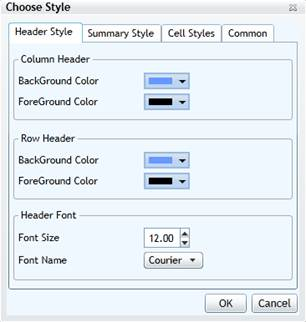
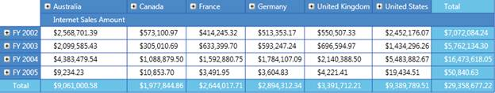

::: {style="DISPLAY: none"}
{#d2h_url_template}{#d2h_package_url style="WIDTH: 0px; DISPLAY: none; HEIGHT: 0px"}
:::

::::: {#nsbanner .d2h_main_nsbanner style="BORDER-BOTTOM: #999999 1px solid; POSITION: relative; PADDING-BOTTOM: 0px; BACKGROUND-COLOR: transparent; PADDING-LEFT: 0px; PADDING-RIGHT: 0px; DISPLAY: none; BORDER-TOP: #999999 1px solid; PADDING-TOP: 0px; LEFT: 0px"}
:::: {#TitleRow .d2h_main_titlerow style="PADDING-BOTTOM: 4px; BACKGROUND-COLOR: transparent; PADDING-LEFT: 22px; WIDTH: 100%; PADDING-RIGHT: 10px; DISPLAY: none; PADDING-TOP: 4px"}
::: {#ienav .d2h_main_ienav style="DISPLAY: none"}
{#D2HPrevious .D2HPreviousEnabled}  {#D2HNext .D2HNextEnabled}
:::
::::
:::::

:::: {#nstext .d2h_main_nstext style="PADDING-BOTTOM: 10px; BACKGROUND-COLOR: transparent; PADDING-LEFT: 22px; PADDING-RIGHT: 10px; HEIGHT: 100%; OVERFLOW: auto; PADDING-TOP: 5px" hasuserbackground="true" valign="bottom"}
::: {#d2h_breadcrumbs .d2h_breadcrumbs}
[Essential Studio User Guide Documentation](ms-xhelp:///?Id=12457748-09e3-4d74-a240-8e049cedf030){.d2h_breadcrumbsNormal}[ \> ]{.d2h_breadcrumbsLinkSeparator}[Business Intelligence Edition](ms-xhelp:///?Id=fdf33dd8-62b2-47b9-ad7b-fc50e590bca5){.d2h_breadcrumbsNormal}[ \> ]{.d2h_breadcrumbsLinkSeparator}[Essential BI Silverlight](ms-xhelp:///?Id=c006b39c-6aa2-4637-b7de-3e7b6cb3f9f9){.d2h_breadcrumbsNormal}[ \> ]{.d2h_breadcrumbsLinkSeparator}[Essential BI Grid]{.d2h_breadcrumbsContentsOnly}[ \> ]{.d2h_breadcrumbsLinkSeparator}[Concepts and Features](ms-xhelp:///?Id=6e49680f-da51-4b1f-9043-47e40b9c0684){.d2h_breadcrumbsNormal}[ \> ]{.d2h_breadcrumbsLinkSeparator}[Grid Styling](ms-xhelp:///?Id=3d3dd525-ece1-4957-bd0f-875dcb535d68){.d2h_breadcrumbsNormal}
:::

### Grid Style Dialog {#grid-style-dialog style="tab-stops: 0pt"}

The Grid Style Dialog is used to format the cells of the OlapGrid. Styling can be applied to the Column Header, Row Header, Summary cell, and value cell. The properties of the Header and Summary cells that can be formatted are as follows:

[·      ]{style="FONT-FAMILY: Symbol"}Background Color

[·      ]{style="FONT-FAMILY: Symbol"}Foreground Color

[·      ]{style="FONT-FAMILY: Symbol"}Font Name

[·      ]{style="FONT-FAMILY: Symbol"}Font Size

The properties of the Value cells that can be formatted are as follows:

[·      ]{style="FONT-FAMILY: Symbol"}Font Name

[·      ]{style="FONT-FAMILY: Symbol"}Font Style

[·      ]{style="FONT-FAMILY: Symbol"}Font Color

[·      ]{style="FONT-FAMILY: Symbol"}Font Size

[]{style="FONT-FAMILY: 'Calibri','sans-serif'; FONT-SIZE: 11pt"} 

{border="0"}

 

Figure 11: OlapGrid Style Dialog[]{style="FONT-FAMILY: 'Calibri','sans-serif'; FONT-SIZE: 11pt"}

 

The Grid line colour can also be changed by navigating to the Common tab and then selecting the Gridline color picker.

 

{border="0"}

 

Figure 12: Formatted OlapGrid[]{style="FONT-FAMILY: 'Calibri','sans-serif'; FONT-SIZE: 11pt"}

+----------------------------------------------------------------------------------------------------------------------------+
| **[\[C#\]]{style="FONT-FAMILY: 'Courier New'"}**                                                                           |
|                                                                                                                            |
| []{style="FONT-FAMILY: 'Courier New'"}                                                                                     |
|                                                                                                                            |
| [// To Display Style Dialog]{style="FONT-FAMILY: 'Courier New'; COLOR: green"}                                             |
|                                                                                                                            |
| [this]{style="FONT-FAMILY: 'Courier New'; COLOR: blue"}[.OlapGrid1.ShowStyleDialog();]{style="FONT-FAMILY: 'Courier New'"} |
|                                                                                                                            |
| []{style="FONT-FAMILY: 'Courier New'"}                                                                                     |
+----------------------------------------------------------------------------------------------------------------------------+

[]{style="FONT-FAMILY: Consolas"} 

+-------------------------------------------------------------------------------------------------------------------------+
| **[\[VB\]]{style="FONT-FAMILY: 'Courier New'"}**                                                                        |
|                                                                                                                         |
| []{style="FONT-FAMILY: 'Courier New'"}                                                                                  |
|                                                                                                                         |
| [\' To Display Style Dialog]{style="FONT-FAMILY: 'Courier New'; COLOR: green"}[]{style="FONT-FAMILY: 'Courier New'"}    |
|                                                                                                                         |
| [Me]{style="FONT-FAMILY: 'Courier New'; COLOR: blue"}[.OlapGrid1.ShowStyleDialog()]{style="FONT-FAMILY: 'Courier New'"} |
|                                                                                                                         |
| []{style="FONT-FAMILY: 'Courier New'"}                                                                                  |
+-------------------------------------------------------------------------------------------------------------------------+

[]{style="FONT-FAMILY: Consolas"} 

[]{#related-topics}
::::
