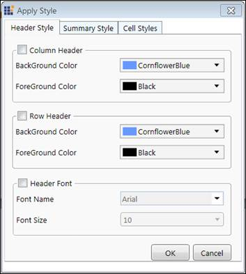

::: {style="DISPLAY: none"}
{#d2h_url_template} {#d2h_package_url style="WIDTH: 0px; DISPLAY: none; HEIGHT: 0px"}
:::

::::: {#nsbanner .d2h_main_nsbanner style="BORDER-BOTTOM: #999999 1px solid; POSITION: relative; PADDING-BOTTOM: 0px; BACKGROUND-COLOR: transparent; PADDING-LEFT: 0px; PADDING-RIGHT: 0px; DISPLAY: none; BORDER-TOP: #999999 1px solid; PADDING-TOP: 0px; LEFT: 0px"}
:::: {#TitleRow .d2h_main_titlerow style="PADDING-BOTTOM: 4px; BACKGROUND-COLOR: transparent; PADDING-LEFT: 22px; WIDTH: 100%; PADDING-RIGHT: 10px; DISPLAY: none; PADDING-TOP: 4px"}
::: {#ienav .d2h_main_ienav style="DISPLAY: none"}
{#D2HPrevious .D2HPreviousEnabled}  {#D2HNext .D2HNextEnabled}
:::
::::
:::::

:::: {#nstext .d2h_main_nstext style="PADDING-BOTTOM: 10px; BACKGROUND-COLOR: transparent; PADDING-LEFT: 22px; PADDING-RIGHT: 10px; HEIGHT: 100%; OVERFLOW: auto; PADDING-TOP: 5px" hasuserbackground="true" valign="bottom"}
::: {#d2h_breadcrumbs .d2h_breadcrumbs}
[Essential Studio User Guide Documentation](ms-xhelp:///?Id=12457748-09e3-4d74-a240-8e049cedf030){.d2h_breadcrumbsNormal} [ \> ]{.d2h_breadcrumbsLinkSeparator} [Business Intelligence Edition](ms-xhelp:///?Id=fdf33dd8-62b2-47b9-ad7b-fc50e590bca5){.d2h_breadcrumbsNormal} [ \> ]{.d2h_breadcrumbsLinkSeparator} [Essential BI WPF](ms-xhelp:///?Id=41e3d586-d922-4a01-8272-679fe4ae7343){.d2h_breadcrumbsNormal} [ \> ]{.d2h_breadcrumbsLinkSeparator} [Essential BI Grid]{.d2h_breadcrumbsContentsOnly} [ \> ]{.d2h_breadcrumbsLinkSeparator} [Concepts and Features](ms-xhelp:///?Id=ea758680-939d-4d65-8abe-8c3be198af29){.d2h_breadcrumbsNormal} [ \> ]{.d2h_breadcrumbsLinkSeparator} [Grid Styling](ms-xhelp:///?Id=3c17a3a2-5d3d-4690-b7aa-d989ebd2f03d){.d2h_breadcrumbsNormal}
:::

### Grid Style Dialog {#grid-style-dialog style="tab-stops: 0pt"}

 

The **Grid Style** Dialog is used to format the cells of **OlapGrid**. Styling can be applied to Column Header, Row Header, Summary cell and value cell. The following properties of **Header** and **Summary** cells can be formatted:

[·      ]{style="FONT-FAMILY: Symbol"}Background Color

[·      ]{style="FONT-FAMILY: Symbol"}Foreground Color

[·      ]{style="FONT-FAMILY: Symbol"}Font Name

[·      ]{style="FONT-FAMILY: Symbol"}Font Size

The following were the properties of Value cells that can be formatted:

[·      ]{style="FONT-FAMILY: Symbol"}Font Name

[·      ]{style="FONT-FAMILY: Symbol"}Font Style

[·      ]{style="FONT-FAMILY: Symbol"}Font Color

[·      ]{style="FONT-FAMILY: Symbol"}Font Size

 

{border="0"}

Figure 14: OlapGrid Style Dialog

**[]{style="COLOR: black; FONT-SIZE: 11pt"}**  

The following code snippet will launch the Grid style dialog:

 

+-----------------------------------------------------------------------+
| \[C#\]                                                                |
|                                                                       |
|                                                                       |
|                                                                       |
| [// To Display Style Dialog]{style="COLOR: green"}                    |
|                                                                       |
| [this]{style="COLOR: blue"}.OlapGrid1.ShowStyleDialog();              |
|                                                                       |
|                                                                       |
+-----------------------------------------------------------------------+

[]{style="FONT-SIZE: 11pt"} 

+-----------------------------------------------------------------------+
| \[VB\]                                                                |
|                                                                       |
|                                                                       |
|                                                                       |
| [\' To Display Style Dialog]{style="COLOR: green"}                    |
|                                                                       |
| [Me]{style="COLOR: blue"}.OlapGrid1.ShowStyleDialog()                 |
|                                                                       |
|                                                                       |
+-----------------------------------------------------------------------+

[]{#_Configuring_the_properties} []{style="FONT-SIZE: 11pt"} 

[]{#related-topics}
::::
