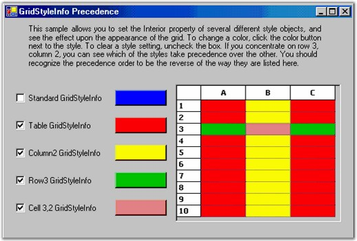
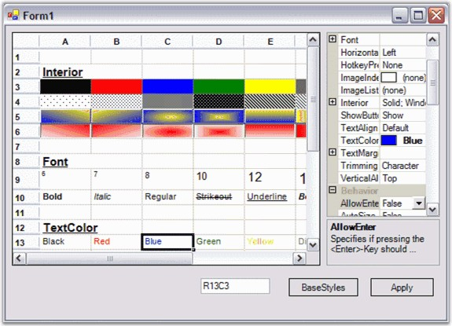
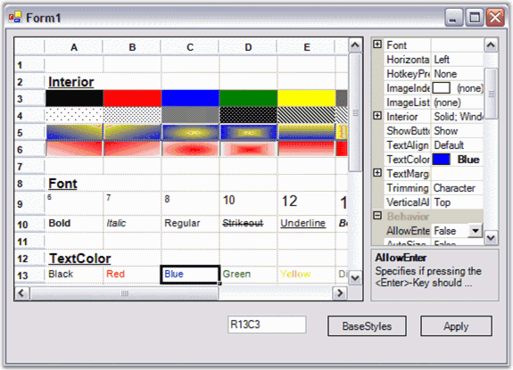
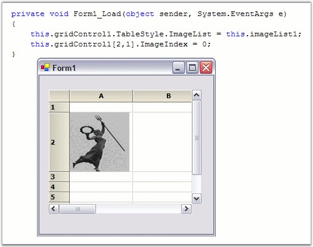
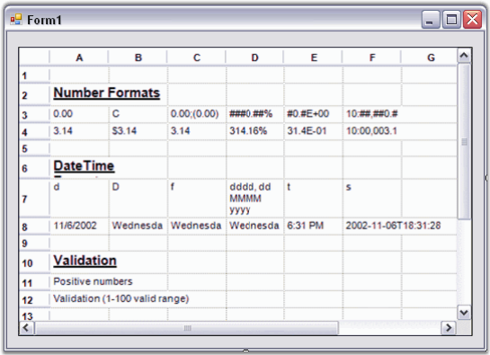

::: {style="DISPLAY: none"}
{#d2h_url_template}{#d2h_package_url style="WIDTH: 0px; DISPLAY: none; HEIGHT: 0px"}
:::

::::: {.d2h_secondary_topic style="PADDING-BOTTOM: 10pt; MARGIN: 0pt; PADDING-LEFT: 0pt; PADDING-RIGHT: 0pt; PADDING-TOP: 0pt"}
##### GridStyleInfo Class Overview {#gridstyleinfo-class-overview style="tab-stops: 0pt"}

[]{style="FONT-FAMILY: 'Trebuchet MS','sans-serif'; COLOR: #15428b; FONT-SIZE: 9pt"} 

Grid control can be thought of as a rectangular table of grid cells. Each cell contains distinct information and can be displayed independently of other cells. EssentiGrid uses **GridStyleInfo** objects to store state information about the appearance of a grid cell. So attributes like **font**, **backcolor**, **cellvalue** and **celltype** are all reflected in a single GridStyleInfo object.

 

Every cell in a grid may have such an object associated with it, giving the individual cell its unique appearance. It is not necessary that all cells should require fully populated GridStyleInfo objects stored in memory to function. And, for a given GridStyleInfo object, not all possible properties need to be populated in the object. So for example, a particular cell may or may not have a stored GridStyleInfo object, and if it does, this GridStyleInfo object may, or may not, contain a particular property such as Font.

[]{style="FONT-FAMILY: 'Trebuchet MS','sans-serif'; COLOR: #15428b; FONT-SIZE: 9pt"} 

In general, when Essential Grid needs a cell\'s state information, usually to draw the cell, it uses an inheritance process to generate a GridStyleInfo from several parent styles. The following parent styles are GridStyleInfo objects associated with particular grid entities:

[]{style="FONT-FAMILY: 'Trebuchet MS','sans-serif'; COLOR: #15428b; FONT-SIZE: 9pt"} 

[·      ]{style="FONT-FAMILY: Symbol"}**TableStyle** is a single GridStyleInfo object that is associated with the entire grid.

[·      ]{style="FONT-FAMILY: Symbol"}**RowStyles** are GridStyleInfo objects that are associated with each row.

[·      ]{style="FONT-FAMILY: Symbol"}**ColumnStyles** are GridStyleInfo objects that are associated with each column.

[]{style="FONT-FAMILY: 'Trebuchet MS','sans-serif'; COLOR: #15428b; FONT-SIZE: 9pt"} 

These three GridStyleInfo objects may not be fully populated, meaning that some properties may not have been set. However, there is a fourth parent style referred to as the **StandardStyle**, which is a fully populated style object, meaning every property has a setting in the StandardStyle.

 

So when Grid control needs to generate a composite GridStyleInfo object for a particular cell, it first looks at any property that may be specifically set in a stored cell GridStyleInfo (if one exists) for this cell. If there are properties not set in this cell-specific GridStyleInfo object, Grid control will then pick up the rowstyle GridStyleInfo for this cell. From this rowstyle, it will populate any property that was explicitly set in the RowStyle, and those that were not explicitly set in the cell-specific GridStyleInfo object. After adding on unset properties to the composite GridStyleInfo from the RowStyle, it does the same for the columnstyle, the tablestyle, and finally the standardstyle. In this manner, Grid control comes up with a fully populated composite GridStyleInfo object to use.

 

The following graphic illustrates the effect of using the GridStyleInfo inheritance to come up with the appearance of a cell 3, 2. Even though the BackColor property is set in each of the tablestyle, rowstyle and columnstyle objects, it is the cell specific style that determines the back color of the cell.

[]{style="FONT-FAMILY: 'Trebuchet MS','sans-serif'; COLOR: #15428b; FONT-SIZE: 9pt"} 

{border="0"}

**[]{style="FONT-FAMILY: 'Trebuchet MS','sans-serif'; COLOR: #15428b; FONT-SIZE: 9pt"}** 

*[Figure ]{style="FONT-SIZE: 9pt"}[92]{style="FONT-SIZE: 9pt"}[: GridStyleInfo]{style="FONT-SIZE: 9pt"}*

**[]{style="FONT-FAMILY: 'Trebuchet MS','sans-serif'; COLOR: #15428b; FONT-SIZE: 9pt"}** 

The next graphic shows the effect of removing the BackColor property from the cell specific style. In this case, it is the rowstyle that determines the back color setting for the displayed cell. If you remove the rowstyle setting for BackColor, then the columnstyle would contribute its BackColor property to determine the cell\'s displayed color. Run the GridStyleInfo sample to experiment using the different parent styles.

[]{style="FONT-FAMILY: 'Trebuchet MS','sans-serif'; COLOR: #15428b; FONT-SIZE: 9pt"} 

{border="0"}

**[]{style="FONT-FAMILY: 'Trebuchet MS','sans-serif'; COLOR: #15428b; FONT-SIZE: 9pt"}** 

*[Figure ]{style="FONT-SIZE: 9pt"}[93]{style="FONT-SIZE: 9pt"}[:: Removing BackColor from the Cell Specific Style]{style="FONT-SIZE: 9pt"}*

***[]{style="FONT-FAMILY: 'Trebuchet MS','sans-serif'; COLOR: #15428b; FONT-SIZE: 9pt"}*** 

See Also

[]{style="FONT-FAMILY: 'Trebuchet MS','sans-serif'; COLOR: #15428b; FONT-SIZE: 9pt"} 

[]{style="FONT-FAMILY: 'Trebuchet MS','sans-serif'; COLOR: black; FONT-SIZE: 9pt"} 

 

[]{#p69} 

 

###### []{#_Properties}[4.1.4.2.1.1  ]{style="FONT-WEIGHT: normal"}Properties[]{style="FONT-WEIGHT: normal"} {#properties style="tab-stops: 0pt"}

[]{style="FONT-FAMILY: 'Trebuchet MS','sans-serif'; COLOR: #15428b; FONT-SIZE: 9pt"} 

GridStyleInfo provides many properties to control the appearance and behavior of grid cells. The following table lists some of the properties.

[]{style="FONT-FAMILY: 'Trebuchet MS','sans-serif'; COLOR: #15428b; FONT-SIZE: 9pt"} 

::: {align="center"}
  ----------------------------------- -------------------------------------------------------
  GridStyleInfo Property              Description
  String GridStyleInfo.Text           Formatted string value of the cell.
  Object GridStyleInfo.CellValue      Value of the object stored in the cell.
  BrushInfo GridStyleInfo.BackColor   Back color of the cell.
  Color GridStyleInfo.TextColor       Color of the displayed text.
  GridFontInfo GridStyleInfo.Font     Font used to display the text.
  ImageList GridStyleInfo.ImageList   Holds a list of images for use by the cell.
  Int GridStyleInfo.ImageIndex        Picks a particular image from the ImageList property.
  ----------------------------------- -------------------------------------------------------
:::

[]{style="FONT-FAMILY: 'Trebuchet MS','sans-serif'; COLOR: #15428b; FONT-SIZE: 9pt"} 

::: {style="BORDER-BOTTOM: windowtext 1pt solid; BORDER-LEFT: medium none; PADDING-BOTTOM: 1pt; MARGIN-TOP: 9pt; PADDING-LEFT: 0pt; PADDING-RIGHT: 0pt; MARGIN-BOTTOM: 9pt; BORDER-TOP: windowtext 1pt solid; BORDER-RIGHT: medium none; PADDING-TOP: 1pt"}
{border="0"}Note: Refer the GridStyleInfo topic in the Essential Grid Class Reference for a complete description of all the GridStyleInfo class members.
:::

 

[]{#p70} 

 

[]{#_BackColor}4.1.4.2.1.1.1      BackColor

[]{style="FONT-FAMILY: 'Trebuchet MS','sans-serif'; COLOR: #15428b; FONT-SIZE: 9pt"} 

The **BackColor** property specifies the background color for the cell. If you want to use a special brush to get a gradient background, you can use the **Interior** property of GridStyleInfo to specify a brush that can be used to draw the cell background[.]{style="FONT-FAMILY: 'Segoe UI','sans-serif'; COLOR: black"}

[]{style="FONT-FAMILY: 'Trebuchet MS','sans-serif'; COLOR: black; FONT-SIZE: 9pt"} 

{border="0"}

[]{style="FONT-FAMILY: 'Trebuchet MS','sans-serif'; COLOR: #15428b; FONT-SIZE: 9pt"} 

*[Figure ]{style="FONT-SIZE: 9pt"}[94]{style="FONT-SIZE: 9pt"}[:: Interior Property]{style="FONT-SIZE: 9pt"}*

 

[]{#p71} 

 

4.1.4.2.1.1.2      GridFontInfo

[]{style="FONT-FAMILY: 'Trebuchet MS','sans-serif'; COLOR: #15428b; FONT-SIZE: 9pt"} 

The **GridFontInfo** class is an Essential Grid wrapper class for the standard **Systems.Drawing.Font** class. The **Font** property of the **GridStyleInfo** class specifies the font for the text displayed in the cell. The GridFontInfo class has special static members that enable you to easily modify font property members.

[]{style="FONT-FAMILY: 'Trebuchet MS','sans-serif'; COLOR: #15428b; FONT-SIZE: 9pt"} 

{border="0"}

[]{style="FONT-FAMILY: 'Trebuchet MS','sans-serif'; COLOR: #15428b; FONT-SIZE: 9pt"} 

*[Figure ]{style="FONT-SIZE: 9pt"}[95]{style="FONT-SIZE: 9pt"}[: GridFontInfo]{style="FONT-SIZE: 9pt"}*

 

[]{#p72} 

 

4.1.4.2.1.1.3      ImageList

[]{style="FONT-FAMILY: 'Trebuchet MS','sans-serif'; COLOR: #15428b; FONT-SIZE: 9pt"} 

The **ImageList** property holds a Systems.Windows.Forms.ImageList. Generally, there is one ImageList stored in a parent GridInfoStyle such as the **standardstyle** or the **tablestyle**. This single ImageList is shared by all cells in the grid through the **ImageIndex** property, which has been set on a cell-by-cell basis.

[]{style="FONT-FAMILY: 'Trebuchet MS','sans-serif'; COLOR: #15428b; FONT-SIZE: 9pt"} 

{border="0"}

[]{style="FONT-FAMILY: 'Trebuchet MS','sans-serif'; COLOR: #15428b; FONT-SIZE: 9pt"} 

*[Figure ]{style="FONT-SIZE: 9pt"}[96]{style="FONT-SIZE: 9pt"}[: Displaying an Image in a Cell by using ImageList and ImageIndex Properties]{style="FONT-SIZE: 9pt"}****[]{style="FONT-FAMILY: 'Trebuchet MS','sans-serif'; COLOR: #15428b; FONT-SIZE: 9pt"}***

 

[]{#p73} 

 

[]{#_Text_and_CellValue}4.1.4.2.1.1.4      Text and CellValue

[]{style="FONT-FAMILY: 'Trebuchet MS','sans-serif'; COLOR: #15428b; FONT-SIZE: 9pt"} 

The **Text** and **CellValue** properties are closely related. You can set the value of either by using the other. The major difference is that the Text property is a string and the CellValue property is an object. This means, for example, that you can assign a **DateTime** object to a cell value, but you cannot assign it to a text. Grid control generally sets the Text property by using the **CultureInfo** formatting on the CellValue property. The Text property can also be set directly through code.

[]{style="FONT-FAMILY: 'Trebuchet MS','sans-serif'; COLOR: #15428b; FONT-SIZE: 9pt"} 

{border="0"}

[]{style="FONT-FAMILY: 'Trebuchet MS','sans-serif'; COLOR: #15428b; FONT-SIZE: 9pt"} 

*[Figure ]{style="FONT-SIZE: 9pt"}[97]{style="FONT-SIZE: 9pt"}[: Text and Cell Value]{style="FONT-SIZE: 9pt"}*

 

[]{#p74} 

 

[]{#related-topics}
:::::
