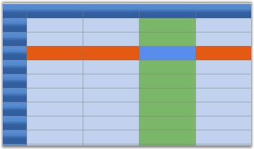

::: {style="DISPLAY: none"}
{#d2h_url_template}{#d2h_package_url style="WIDTH: 0px; DISPLAY: none; HEIGHT: 0px"}
:::

::: {.d2h_secondary_topic style="PADDING-BOTTOM: 10pt; MARGIN: 0pt; PADDING-LEFT: 0pt; PADDING-RIGHT: 0pt; PADDING-TOP: 0pt"}
##### GridStyleInfo class Overview {#gridstyleinfo-class-overview style="tab-stops: 0pt"}

An Essential Grid can be thought of as a rectangular table of grid cells. Each cell will contain distinct information and that can be displayed independently of other cells. Essential Grid uses GridStyleInfo  object to store state information about the appearance of a grid cell. So attributes like the type of font, the backgrou color, the cell value and the cell type are all reflected in a single GridStyleInfo object.

 

Every cell in a grid may have such an object associated with it, giving the individual cell its unique appearance. It is not necessary that all cells should require fully populated GridStyleInfo objects stored in memory to function. And, for a given GridStyleInfo object, not all possible properties need to be populated in the object. So for example, a particular cell may or may not have a stored GridStyleInfo object, and if it does, this GridStyleInfo object may, or may not, contain a particular property such as font.

 

In general, when Essential Grid needs a cell\'s state information, usually to draw the cell, it uses an inheritance process to generate a GridStyleInfo from several parent styles. These parent styles are GridStyleInfo objects associated with particular grid entities:

 

[·      ]{style="FONT-FAMILY: Symbol"}TableStyle is a single GridStyleInfo object associated with the entire grid.

[·      ]{style="FONT-FAMILY: Symbol"}RowStyles are GridStyleInfo objects associated with each row.

[·      ]{style="FONT-FAMILY: Symbol"}ColumnStyles are GridStyleInfo objects associated with each column.

 

These three GridStyleInfo objects may not be fully populated, meaning that some properties may not have been set. However, there is a fourth parent style referred to as the StandardStyle, which is a fully populated style object comprising settings for every property.

Hence, when Essential Grid needs to generate a composite GridStyleInfo object for a particular cell, it first looks at any property that may be specifically set in the GridStyleInfo (if one exists) for the current cell. If properties are not set in the cell-specific GridStyleInfo object, Essential Grid will then pick up the RowStyles for the cell and will populate any property that was explicitly set in the RowStyle and not set in the cell-specific GridStyleInfo object. After adding unset properties to the composite GridStyleInfo from the RowStyle, it does the same for the ColumnStyle, the TableStyle and finally the StandardStyle. In this manner, Essential Grid comes up with a fully populated composite GridStyleInfo object to use.

 

The following graphic illustrates the effect of using the GridStyleInfo inheritance to come up with the appearance of a cell. Even though the BackColor property is set in each of the table style, RowStyle and ColumnStyle objects, it is the cell specific style that determines the background color of cell.

 

{border="0"}

Figure 45: GridStyleInfo

[]{#related-topics}
:::
