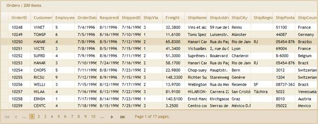

::: {style="DISPLAY: none"}
{#d2h_url_template}{#d2h_package_url style="WIDTH: 0px; DISPLAY: none; HEIGHT: 0px"}
:::

::: {.d2h_secondary_topic style="PADDING-BOTTOM: 10pt; MARGIN: 0pt; PADDING-LEFT: 0pt; PADDING-RIGHT: 0pt; PADDING-TOP: 0pt"}
#### Grid Template {#grid-template style="tab-stops: 0pt"}

To create a Grid Template using custom Syncfusion T4 Templates:

1.   [Open a new **Grid MVC Project** template, which is fully configured for Grid Control. Refer]{.BodyText1Char} to **[MVC Project Template]{style="COLOR: windowtext; TEXT-DECORATION: none; text-underline: none"}**.

2.   Now, in **Project** right click the **Home** folder and click **Add** followed by **View.** The following image illustrates this.

{border="0"}

Figure 22: Adding View

3.   Type the **View Name** and select the strongly typed view. Select the Model from **View Data** Class dropdownlist and then select **Grid Template**. 

4.   [The following image illustrates how to select the Grid Template.]{style="FONT-FAMILY: 'Myriad Pro','sans-serif'"}

{border="0"}

Figure 23: Selecting Grid Template

*[]{style="FONT-FAMILY: 'Arial','sans-serif'; FONT-SIZE: 9pt"}* 

5.   In Index.aspx file, all basic operations are enabled and all columns are mapped as shown below. It can be customized to enable or disable any feature.

{border="0"}

Figure 24: Grid rendered in View page using Template

[]{style="FONT-FAMILY: 'Arial','sans-serif'"} 

6.   As soon as you run your project, Grid will appear as shown below:

[]{style="FONT-FAMILY: 'Arial','sans-serif'"} 

{border="0"}

Figure 25: Grid created using CodeTemplate

7.   [Refer to ]{style="FONT-FAMILY: 'Myriad Pro','sans-serif'"}[[Grid MVC UG]{style="COLOR: windowtext; TEXT-DECORATION: none; text-underline: none"}](http://help.syncfusion.com/ug_83/User%20Interface/ASP.NET%20MVC/Grid/index.htm)[, for further customization.]{style="FONT-FAMILY: 'Myriad Pro','sans-serif'"}

[]{style="FONT-FAMILY: 'Myriad Pro','sans-serif'"} 

[]{#related-topics}
:::
