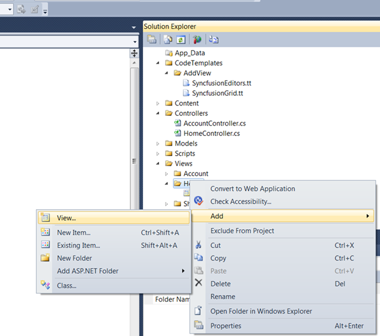
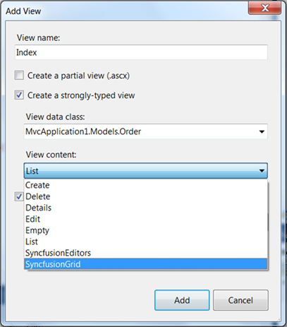
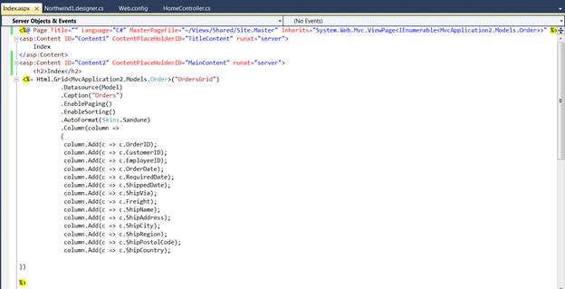

::: {style="DISPLAY: none"}
{#d2h_url_template}{#d2h_package_url style="WIDTH: 0px; DISPLAY: none; HEIGHT: 0px"}
:::

::: {.d2h_secondary_topic style="PADDING-BOTTOM: 10pt; MARGIN: 0pt; PADDING-LEFT: 0pt; PADDING-RIGHT: 0pt; PADDING-TOP: 0pt"}
#### Grid Template {#grid-template style="tab-stops: 0pt"}

To create a Grid template using custom Syncfusion T4 templates, follow the steps below.

1.   Open a new Grid MVC Project template which is fully configured for the Grid control. Refer to [MVC Project Template]{.UGHyperlink}[[ for additional information.]{style="COLOR: windowtext; TEXT-DECORATION: none; text-underline: none"}]{.UGHyperlink}

2.   In **Project**, right-click the **Home** folder and click **Add** followed by **View.** The image below illustrates this.

{border="0"}

Figure 23: Adding View

 

3.   Type a name for the view and select the **Create a strongly-typed view** check box. Select the model from the **View Data** **Class** drop-down list and then select the Grid template. 

 

The following image illustrates how to select the Grid template.

{border="0"}

Figure 24: Selecting Grid Template

*[]{style="FONT-SIZE: 9pt"}* 

4.   In the **Index.aspx** file, all basic operations are enabled and all columns are mapped as shown below. It can be customized to enable or disable any feature.

 

{border="0"}

Figure 25: Grid Rendered in View Page using Template

 

5.   As soon as you run your project, the Grid will appear as shown below.

 

{border="0"}

Figure 26: Grid Created using CodeTemplate

6.   Refer to the [[[Grid MVC UG]{style="COLOR: blue"}]{.underline}](http://help.syncfusion.com/ug_83/User%20Interface/ASP.NET%20MVC/Grid/index.htm) for further information on customization.

[]{#related-topics}
:::
