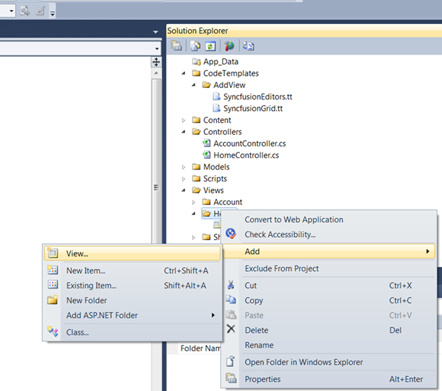
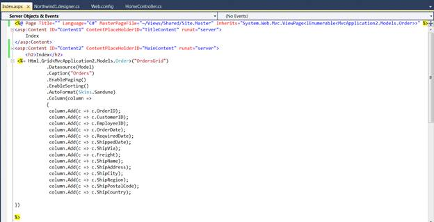
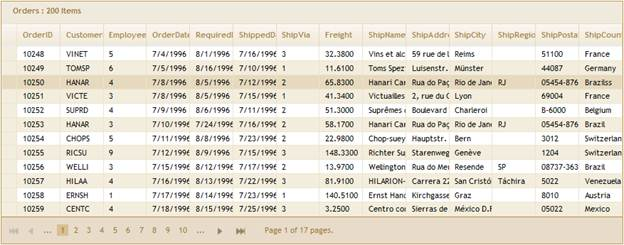

::: {style="DISPLAY: none"}
{#d2h_url_template}{#d2h_package_url style="WIDTH: 0px; DISPLAY: none; HEIGHT: 0px"}
:::

::: {.d2h_secondary_topic style="PADDING-BOTTOM: 10pt; MARGIN: 0pt; PADDING-LEFT: 0pt; PADDING-RIGHT: 0pt; PADDING-TOP: 0pt"}
#### Grid Template {#grid-template style="tab-stops: 0pt"}

To create a Grid Template using custom Syncfusion T4 Templates, follow the below steps.

[[10.  ]{style="TEXT-DECORATION: none; text-underline: none"}]{.UGHyperlink}Open a new Grid MVC Project template which is fully configured for Grid Control. Refer [MVC Project Template]{.UGHyperlink}[]{.UGHyperlink}

11.  Now, in Project right click **Home** folder and click **Add**, followed by **View.** The below image illustrates this.

{border="0"}

Figure 21: Adding View

12.  Type the View Name and select the strongly typed view. Select the Model from **View Data** Class dropdownlist and then select Grid Template. 

 

The following image illustrates how to select Grid Template.

{border="0"}

Figure 22: Selecting Grid Template

*[]{style="FONT-SIZE: 9pt"}* 

13.  In Index.aspx file, all basic operations are enabled and all columns are mapped like shown below. It can be customized to enable/disable any feature.

{border="0"}

Figure 23: Grid rendered in View page using Template

 

14.  As soon as run your project, Grid will appear as shown below.

 

{border="0"}

Figure 24: Grid created using CodeTemplate

15.  [Refer ]{style="FONT-FAMILY: 'Myriad Pro','sans-serif'"}[[Grid MVC UG]{.UGHyperlink}](http://help.syncfusion.com/ug_83/User%20Interface/ASP.NET%20MVC/Grid/index.htm)[, for further customization.]{style="FONT-FAMILY: 'Myriad Pro','sans-serif'"}

[]{#related-topics}
:::
