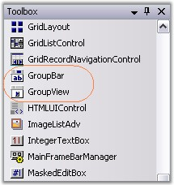

::: {style="DISPLAY: none"}
{#d2h_url_template}{#d2h_package_url style="WIDTH: 0px; DISPLAY: none; HEIGHT: 0px"}
:::

::::: {#nsbanner .d2h_main_nsbanner style="BORDER-BOTTOM: #999999 1px solid; POSITION: relative; PADDING-BOTTOM: 0px; BACKGROUND-COLOR: transparent; PADDING-LEFT: 0px; PADDING-RIGHT: 0px; DISPLAY: none; BORDER-TOP: #999999 1px solid; PADDING-TOP: 0px; LEFT: 0px"}
:::: {#TitleRow .d2h_main_titlerow style="PADDING-BOTTOM: 4px; BACKGROUND-COLOR: transparent; PADDING-LEFT: 22px; WIDTH: 100%; PADDING-RIGHT: 10px; DISPLAY: none; PADDING-TOP: 4px"}
::: {#ienav .d2h_main_ienav style="DISPLAY: none"}
{#D2HPrevious .D2HPreviousEnabled}  {#D2HNext .D2HNextEnabled}
:::
::::
:::::

:::: {#nstext .d2h_main_nstext style="PADDING-BOTTOM: 10px; BACKGROUND-COLOR: transparent; PADDING-LEFT: 22px; PADDING-RIGHT: 10px; HEIGHT: 100%; OVERFLOW: auto; PADDING-TOP: 5px" hasuserbackground="true" valign="bottom"}
::: {#d2h_breadcrumbs .d2h_breadcrumbs}
[Essential Studio User Guide Documentation](ms-xhelp:///?Id=12457748-09e3-4d74-a240-8e049cedf030){.d2h_breadcrumbsNormal}[ \> ]{.d2h_breadcrumbsLinkSeparator}[User Interface Edition](ms-xhelp:///?Id=c29296b7-531c-413b-a0ec-488ca1f7f669){.d2h_breadcrumbsNormal}[ \> ]{.d2h_breadcrumbsLinkSeparator}[Essential Windows](ms-xhelp:///?Id=e60759d8-47a4-4570-9d7a-16a68d63f2ea){.d2h_breadcrumbsNormal}[ \> ]{.d2h_breadcrumbsLinkSeparator}[Essential Tools]{.d2h_breadcrumbsContentsOnly}[ \> ]{.d2h_breadcrumbsLinkSeparator}[Tools Controls](ms-xhelp:///?Id=13c3c4f4-9d16-4b69-93f2-7e98eec67452){.d2h_breadcrumbsNormal}[ \> ]{.d2h_breadcrumbsLinkSeparator}[Navigation Package](ms-xhelp:///?Id=a57592e8-7db2-4cd9-ba89-c7ee92b60203){.d2h_breadcrumbsNormal}
:::

### GroupBar {#groupbar style="tab-stops: 0pt"}

[]{style="COLOR: #15428b"} 

The GroupBar and GroupView controls abide by the container-client model and are designed to work in perfect synchronization with each other.

 

The **GroupBar** class implements a tab-type container control similar to the Windows Forms TabControl that can serve as a host for other Windows Forms controls. Each control in the GroupBar is represented by a **GroupBar Item** and navigation between the different controls is accomplished by selecting the corresponding GroupBar Item. Only the selected control is displayed at any particular time.

 

The GroupBar may be used in combination with the GroupView control to implement clones of some of the popular UI components such as the Microsoft OutlookBar and the Visual Studio .NET toolbox window.

[]{style="COLOR: #15428b"} 

{border="0"}[]{style="FONT-FAMILY: 'Calibri','sans-serif'; FONT-SIZE: 11pt"}

 

Figure 852: GroupBar with GroupView Client Control

[]{style="COLOR: #15428b"} 

The **Essential Tools** **GroupBar control** displays multiple groups or tabs, each of which represents a client control that is hosted within the GroupBar.

 

The primary function of the GroupBar is to serve as a container for a group of functionally related controls while allowing only one selected control to be visible at any given time. Groups are implemented as instances of the **GroupBarItem** class and the collection can be accessed through the **GroupBar.GroupBarItems** property.

**[]{style="COLOR: #15428b"}** 

[]{#p589} 

 

More:

[ ]{#related-topics}

[{border="0" align="absMiddle"}Features Overview](ms-xhelp:///?Id=b4399271-de09-44b3-a6d6-e0271559a4e7){style="TEXT-DECORATION: none"}

[{border="0" align="absMiddle"}Control Overview](ms-xhelp:///?Id=eb4a90cd-8507-4a86-aa6f-eec170f5f988){style="TEXT-DECORATION: none"}

[{border="0" align="absMiddle"}Creating GroupBar](ms-xhelp:///?Id=8c004592-08d3-45bc-b750-fbfb9dae1ce3){style="TEXT-DECORATION: none"}

[{border="0" align="absMiddle"}Concepts and Features](ms-xhelp:///?Id=8feda6d5-8927-4cc7-b02a-32cfef477f3b){style="TEXT-DECORATION: none"}

[{border="0" align="absMiddle"}GroupBar Events](ms-xhelp:///?Id=685f0119-5f36-4067-91b8-c98fd6d02472){style="TEXT-DECORATION: none"}

[{border="0" align="absMiddle"}Frequently Asked Questions](ms-xhelp:///?Id=df9241b0-1dea-4ada-ac86-b4ccd8e6d40c){style="TEXT-DECORATION: none"}
::::
