::: {style="DISPLAY: none"}
{#d2h_url_template}{#d2h_package_url style="WIDTH: 0px; DISPLAY: none; HEIGHT: 0px"}
:::

:::::::: {.d2h_secondary_topic style="PADDING-BOTTOM: 10pt; MARGIN: 0pt; PADDING-LEFT: 0pt; PADDING-RIGHT: 0pt; PADDING-TOP: 0pt"}
##### GroupBar Items Settings {#groupbar-items-settings style="tab-stops: 0pt"}

[]{style="COLOR: #15428b"} 

This section discusses the various settings that can be applied to the GroupBar Items of the GroupBar control.

 

It includes the below given topics.

[]{style="COLOR: #15428b"} 

[]{style="COLOR: black"} 

 

###### 3.6.1.4.2.1 Text Settings {#text-settings style="tab-stops: 0pt"}

[]{style="COLOR: #15428b"} 

This section describes how text alignment can be done for the GroupBar Items.

[]{style="COLOR: #15428b"} 

Through Designer

[]{style="COLOR: #15428b"} 

The **TextAlign** property specifies the horizontal alignment of the GroupBar Item text[. ]{style="FONT-FAMILY: 'Times New Roman','serif'; FONT-SIZE: 12pt"}The text can be aligned to the Center, Left and Right. The default alignment is set to Center.

[]{style="COLOR: #15428b"} 

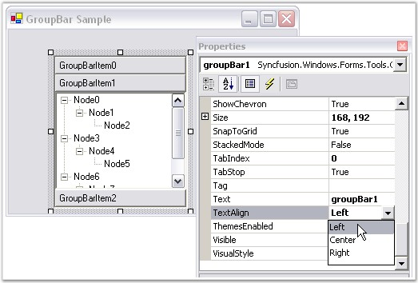{border="0"}[]{style="FONT-FAMILY: 'Calibri','sans-serif'; FONT-SIZE: 11pt"}

 

Figure 865: GroupBar with TextAlign = \"Left\"

[]{style="COLOR: #15428b"} 

Through Code

[]{style="COLOR: #4a5c8c; FONT-SIZE: 8pt"} 

+------------------------------------------------------------------------------------------------------------------------------------------------------------------------+
| **[\[C#\]]{style="FONT-FAMILY: 'Courier New'; COLOR: black"}**                                                                                                         |
|                                                                                                                                                                        |
| []{style="FONT-FAMILY: 'Courier New'; COLOR: black"}                                                                                                                   |
|                                                                                                                                                                        |
| [this]{style="FONT-FAMILY: 'Courier New'; COLOR: blue"}[.groupBar1.TextAlign = Syncfusion.Windows.Forms.Tools.TextAlignment.Left;]{style="FONT-FAMILY: 'Courier New'"} |
+------------------------------------------------------------------------------------------------------------------------------------------------------------------------+

[]{style="COLOR: #4a5c8c; FONT-SIZE: 8pt"} 

+---------------------------------------------------------------------------------------------------------------------------------------------------------------------+
| **[\[VB.NET\]]{style="FONT-FAMILY: 'Courier New'; COLOR: black"}**                                                                                                  |
|                                                                                                                                                                     |
| []{style="FONT-FAMILY: 'Courier New'; COLOR: black"}                                                                                                                |
|                                                                                                                                                                     |
| [Me]{style="FONT-FAMILY: 'Courier New'; COLOR: blue"}[.groupBar1.TextAlign = Syncfusion.Windows.Forms.Tools.TextAlignment.Left]{style="FONT-FAMILY: 'Courier New'"} |
+---------------------------------------------------------------------------------------------------------------------------------------------------------------------+

[]{style="COLOR: #15428b"} 

In-Place Renaming

[]{style="COLOR: #4a5c8c; FONT-SIZE: 8pt"} 

Users are allowed to rename GroupBar Items at run-time using the code snippet given below.

[]{style="COLOR: #15428b"} 

+-----------------------------------------------------------------------------------------------------------------------------------+
| **[\[C#\]]{style="FONT-FAMILY: 'Courier New'; COLOR: black"}**                                                                    |
|                                                                                                                                   |
| []{style="FONT-FAMILY: 'Courier New'; COLOR: black"}                                                                              |
|                                                                                                                                   |
| [// index: index of the GroupBar Item to be renamed.]{style="FONT-FAMILY: 'Courier New'; COLOR: green"}                           |
|                                                                                                                                   |
| [this]{style="FONT-FAMILY: 'Courier New'; COLOR: blue"}[.groupBar1.InplaceRenameItem(index);]{style="FONT-FAMILY: 'Courier New'"} |
+-----------------------------------------------------------------------------------------------------------------------------------+

[]{style="COLOR: #4a5c8c; FONT-SIZE: 8pt"} 

+--------------------------------------------------------------------------------------------------------------------------------+
| **[\[VB.NET\]]{style="FONT-FAMILY: 'Courier New'; COLOR: black"}**                                                             |
|                                                                                                                                |
| []{style="FONT-FAMILY: 'Courier New'; COLOR: black"}                                                                           |
|                                                                                                                                |
| [\' index: index of the GroupBar Item to be renamed.]{style="FONT-FAMILY: 'Courier New'; COLOR: green"}                        |
|                                                                                                                                |
| [Me]{style="FONT-FAMILY: 'Courier New'; COLOR: blue"}[.groupBar1.InplaceRenameItem(index)]{style="FONT-FAMILY: 'Courier New'"} |
+--------------------------------------------------------------------------------------------------------------------------------+

[]{style="COLOR: #15428b"} 

The method associated with this property is given below.

[]{style="COLOR: #15428b"} 

::: {align="center"}
  ------------------------- -----------------------------------------------
  Method                    Description
  CancelInplaceRenameItem   Cancels an in-place edit that is in progress.
  ------------------------- -----------------------------------------------
:::

 

 

[]{#p601} 

 

###### 3.6.1.4.2.2 Image Settings {#image-settings style="tab-stops: 0pt"}

[]{style="COLOR: #15428b"} 

This section describes the image settings available for GroupBar Items.

[]{style="COLOR: #15428b"} 

Large images can be set for GroupBar Items using the following properties.

[]{style="COLOR: #15428b"} 

::: {align="center"}
  ----------------------- ------------------------------------------------------------------------------------
  GroupBarItem Property   Description
  LargeImageMode          Specifies whether large images can be set for the GroupBar Item\'s client control.
  Image                   Specifies the image for the GroupBar Item\'s client control.
  ----------------------- ------------------------------------------------------------------------------------
:::

[]{style="COLOR: #15428b"} 

+--------------------------------------------------------------------------------------------------------------------------------------------------------------------------------------------------------------------------------------------------+
| **[\[C#\]]{style="FONT-FAMILY: 'Courier New'; COLOR: black"}**                                                                                                                                                                                   |
|                                                                                                                                                                                                                                                  |
| []{style="FONT-FAMILY: 'Courier New'; COLOR: black"}                                                                                                                                                                                             |
|                                                                                                                                                                                                                                                  |
| [this]{style="FONT-FAMILY: 'Courier New'; COLOR: blue"}[.groupBarItem1.LargeImageMode = [true]{style="COLOR: blue"};]{style="FONT-FAMILY: 'Courier New'"}                                                                                        |
|                                                                                                                                                                                                                                                  |
| [this]{style="FONT-FAMILY: 'Courier New'; COLOR: blue"}[.groupBarItem1.Image = ((System.Drawing.Image)(resources.GetObject(\"groupBarItem1.Image\")));   ]{style="FONT-FAMILY: 'Courier New'"}[            ]{style="FONT-FAMILY: 'Courier New'"} |
+--------------------------------------------------------------------------------------------------------------------------------------------------------------------------------------------------------------------------------------------------+

[]{style="COLOR: #4a5c8c; FONT-SIZE: 8pt"} 

+-----------------------------------------------------------------------------------------------------------------------------------------------------------------------------------------------------------------------------------------------+
| **[\[VB.NET\]]{style="FONT-FAMILY: 'Courier New'; COLOR: black"}**                                                                                                                                                                            |
|                                                                                                                                                                                                                                               |
| []{style="FONT-FAMILY: 'Courier New'; COLOR: black"}                                                                                                                                                                                          |
|                                                                                                                                                                                                                                               |
| [Me]{style="FONT-FAMILY: 'Courier New'; COLOR: blue"}[.groupBarItem1.LargeImageMode = [True]{style="COLOR: blue"}]{style="FONT-FAMILY: 'Courier New'"}                                                                                        |
|                                                                                                                                                                                                                                               |
| [Me]{style="FONT-FAMILY: 'Courier New'; COLOR: blue"}[.groupBarItem1.Image = ([CType]{style="COLOR: blue"}(resources.GetObject([\"groupBarItem1.Image\"]{style="COLOR: maroon"}), System.Drawing.Image))]{style="FONT-FAMILY: 'Courier New'"} |
+-----------------------------------------------------------------------------------------------------------------------------------------------------------------------------------------------------------------------------------------------+

[]{style="COLOR: #15428b"} 

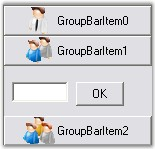{border="0"}[]{style="FONT-FAMILY: 'Calibri','sans-serif'; FONT-SIZE: 11pt"}

 

Figure 866: Large Images displayed on the Headers of GroupBar Items

[]{style="COLOR: #15428b"} 

Users can also display the selected GroupBar Item\'s image on the header of the Stacked GroupBar. This can be achieved by setting the **ShowItemImageInHeader** property to \'True\'.

[]{style="COLOR: #15428b"} 

+--------------------------------------------------------------------------------------------------------------------------------------------------------------+
| **[\[C#\]]{style="FONT-FAMILY: 'Courier New'; COLOR: black"}**                                                                                               |
|                                                                                                                                                              |
| []{style="FONT-FAMILY: 'Courier New'; COLOR: black"}                                                                                                         |
|                                                                                                                                                              |
| [this]{style="FONT-FAMILY: 'Courier New'; COLOR: blue"}[.groupBar1.ShowItemImageInHeader = [true]{style="COLOR: blue"};]{style="FONT-FAMILY: 'Courier New'"} |
+--------------------------------------------------------------------------------------------------------------------------------------------------------------+

[]{style="COLOR: #4a5c8c; FONT-SIZE: 8pt"} 

+-----------------------------------------------------------------------------------------------------------------------------------------------------------+
| **[\[VB.NET\]]{style="FONT-FAMILY: 'Courier New'; COLOR: black"}**                                                                                        |
|                                                                                                                                                           |
| []{style="FONT-FAMILY: 'Courier New'; COLOR: black"}                                                                                                      |
|                                                                                                                                                           |
| [Me]{style="FONT-FAMILY: 'Courier New'; COLOR: blue"}[.groupBar1.ShowItemImageInHeader = [True]{style="COLOR: blue"}]{style="FONT-FAMILY: 'Courier New'"} |
+-----------------------------------------------------------------------------------------------------------------------------------------------------------+

[]{style="COLOR: #15428b"} 

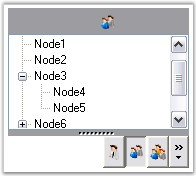{border="0"}[]{style="FONT-FAMILY: 'Calibri','sans-serif'; FONT-SIZE: 11pt"}

 

Figure 867: Image displayed on the Header of the Stacked GroupBar

 

 

[]{#p602} 

 

###### 3.6.1.4.2.3 GroupBar Items Customization {#groupbar-items-customization style="tab-stops: 0pt"}

[]{style="COLOR: #4a5c8c; FONT-SIZE: 8pt"} 

The following table lists the properties related to the GroupBar Items.

[]{style="COLOR: #15428b"} 

::: {align="center"}
  ------------------- ------------------------------------------------------------------------------------------------------------------
  GroupBar Property   Description
  BarHighlight        Specifies the value which indicates whether to highlight the GroupBar Item when the mouse cursor hovers over it.
  FlatLook            Specifies whether to draw GroupBar Items with the control\'s borders without a 3-dimensional edge.
  ------------------- ------------------------------------------------------------------------------------------------------------------
:::

[]{style="COLOR: #4a5c8c; FONT-SIZE: 8pt"} 

+-----------------------------------------------------------------------------------------------------------------------------------------------------+
| **[\[C#\]]{style="FONT-FAMILY: 'Courier New'; COLOR: black"}**                                                                                      |
|                                                                                                                                                     |
| []{style="FONT-FAMILY: 'Courier New'; COLOR: black"}                                                                                                |
|                                                                                                                                                     |
| [this]{style="FONT-FAMILY: 'Courier New'; COLOR: blue"}[.groupBar1.BarHighlight = [true]{style="COLOR: blue"};]{style="FONT-FAMILY: 'Courier New'"} |
|                                                                                                                                                     |
| [this]{style="FONT-FAMILY: 'Courier New'; COLOR: blue"}[.groupBar1.FlatLook = [true]{style="COLOR: blue"};]{style="FONT-FAMILY: 'Courier New'"}     |
+-----------------------------------------------------------------------------------------------------------------------------------------------------+

[]{style="COLOR: #15428b"} 

+--------------------------------------------------------------------------------------------------------------------------------------------------+
| **[\[VB.NET\]]{style="FONT-FAMILY: 'Courier New'; COLOR: black"}**                                                                               |
|                                                                                                                                                  |
| []{style="FONT-FAMILY: 'Courier New'; COLOR: black"}                                                                                             |
|                                                                                                                                                  |
| [Me]{style="FONT-FAMILY: 'Courier New'; COLOR: blue"}[.groupBar1.BarHighlight = [True]{style="COLOR: blue"}]{style="FONT-FAMILY: 'Courier New'"} |
|                                                                                                                                                  |
| [Me]{style="FONT-FAMILY: 'Courier New'; COLOR: blue"}[.groupBar1.FlatLook = [True]{style="COLOR: blue"}]{style="FONT-FAMILY: 'Courier New'"}     |
+--------------------------------------------------------------------------------------------------------------------------------------------------+

[]{style="COLOR: #15428b"} 

The control provides highlighting effect for the GroupBar Item when the mouse is hovered over it by setting the **BarHighlight** property to \'True\'.

[]{style="COLOR: #15428b"} 

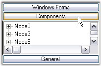{border="0"}[]{style="FONT-FAMILY: 'Calibri','sans-serif'; FONT-SIZE: 11pt"}

 

Figure 868: \'Components\' Item Highlighted in the GroupBar

[]{style="COLOR: #15428b"} 

 The border of the GroupBar Items can be changed by drawing the border without 3-dimensional edge which can be attained by setting the **FlatLook** property to \'True\'.

[]{style="COLOR: #15428b"} 

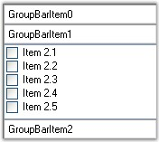{border="0"}[]{style="FONT-FAMILY: 'Calibri','sans-serif'; FONT-SIZE: 11pt"}

 

Figure 869: Flat Look of GroupBar Items

 

 

[]{#p603} 

 

###### 3.6.1.4.2.4 Integrating Child Controls to the GroupBar Items {#integrating-child-controls-to-the-groupbar-items style="tab-stops: 0pt"}

[]{style="COLOR: #15428b"} 

GroupBar Item can host any control in it\'s client area. To host more than one control, place the controls in the panel and then drop the panel inside the GroupBar Item container.

[]{style="COLOR: #15428b"} 

In this section, the following controls are added as Child controls to the GroupBar Items.

[]{style="COLOR: #15428b"} 

[]{style="COLOR: black"} 

[]{#p604} 

3.6.1.4.2.4.1      TreeView as Child Control

[]{style="COLOR: #4a5c8c; FONT-SIZE: 8pt"} 

You can add a TreeView control to the GroupBar by clicking on a particular group say GroupBarItem1 by activating it and then dragging-and-dropping the TreeView control onto the GroupBar\'s client region. You can repeat this process for all groups in the control.

 

Individual GroupBar Item properties such as Text, Image and ForeColor can be set using the **GroupBar Item Collection Editor**. To do this, first select the **GroupBar.GroupBarItems** to bring up the collection editor and select each item to assign the property values.

 

The default GroupBar properties will display the control in the regular mode using the standard visual style. You can now use the property browser to set the appropriate Appearance and Behavior settings to tailor the GroupBar\'s interface to suit the application\'s requirement.

[]{style="COLOR: #15428b"} 

+--------------------------------------------------------------------------------------------------------------------------------------------------------------------------------------------------+
| **[\[C#\]]{style="FONT-FAMILY: 'Courier New'; COLOR: black"}**                                                                                                                                   |
|                                                                                                                                                                                                  |
| []{style="FONT-FAMILY: 'Courier New'; COLOR: black"}                                                                                                                                             |
|                                                                                                                                                                                                  |
| [this]{style="FONT-FAMILY: 'Courier New'; COLOR: blue"}[.groupBar1 = [new]{style="COLOR: blue"} Syncfusion.Windows.Forms.Tools.GroupBar();]{style="FONT-FAMILY: 'Courier New'"}                  |
|                                                                                                                                                                                                  |
| [this]{style="FONT-FAMILY: 'Courier New'; COLOR: blue"}[.groupBarItem1 = [new]{style="COLOR: blue"} Syncfusion.Windows.Forms.Tools.GroupBarItem();]{style="FONT-FAMILY: 'Courier New'"}          |
|                                                                                                                                                                                                  |
| [this]{style="FONT-FAMILY: 'Courier New'; COLOR: blue"}[.groupBarItem2 = [new]{style="COLOR: blue"} Syncfusion.Windows.Forms.Tools.GroupBarItem();]{style="FONT-FAMILY: 'Courier New'"}          |
|                                                                                                                                                                                                  |
| [this]{style="FONT-FAMILY: 'Courier New'; COLOR: blue"}[.treeView1 = [new]{style="COLOR: blue"} System.Windows.Forms.TreeView();]{style="FONT-FAMILY: 'Courier New'"}                            |
|                                                                                                                                                                                                  |
| []{style="FONT-FAMILY: 'Courier New'"}                                                                                                                                                           |
|                                                                                                                                                                                                  |
| [// groupBarItem1 has no client control.]{style="FONT-FAMILY: 'Courier New'; COLOR: green"}                                                                                                      |
|                                                                                                                                                                                                  |
| [this]{style="FONT-FAMILY: 'Courier New'; COLOR: blue"}[.groupBarItem1.Client = [null]{style="COLOR: blue"};]{style="FONT-FAMILY: 'Courier New'"}                                                |
|                                                                                                                                                                                                  |
| []{style="FONT-FAMILY: 'Courier New'"}                                                                                                                                                           |
|                                                                                                                                                                                                  |
| [// TreeView control attached as a client control to groupBarItem2.]{style="FONT-FAMILY: 'Courier New'; COLOR: green"}                                                                           |
|                                                                                                                                                                                                  |
| [this]{style="FONT-FAMILY: 'Courier New'; COLOR: blue"}[.groupBarItem2.Client = [this]{style="COLOR: blue"}.treeView1;]{style="FONT-FAMILY: 'Courier New'"}                                      |
|                                                                                                                                                                                                  |
| []{style="FONT-FAMILY: 'Courier New'"}                                                                                                                                                           |
|                                                                                                                                                                                                  |
| [// Nodes are added to the TreeView Control.]{style="FONT-FAMILY: 'Courier New'; COLOR: green"}                                                                                                  |
|                                                                                                                                                                                                  |
| [this]{style="FONT-FAMILY: 'Courier New'; COLOR: blue"}[.treeView1.Nodes.AddRange([new]{style="COLOR: blue"} System.Windows.Forms.TreeNode\[\]{treeNode2});]{style="FONT-FAMILY: 'Courier New'"} |
+--------------------------------------------------------------------------------------------------------------------------------------------------------------------------------------------------+

[]{style="COLOR: #15428b"} 

+----------------------------------------------------------------------------------------------------------------------------------------------------------------------------------------------+
| **[\[VB.NET\]]{style="FONT-FAMILY: 'Courier New'; COLOR: black"}**                                                                                                                           |
|                                                                                                                                                                                              |
| []{style="FONT-FAMILY: 'Courier New'; COLOR: black"}                                                                                                                                         |
|                                                                                                                                                                                              |
| [Me]{style="FONT-FAMILY: 'Courier New'; COLOR: blue"}[.groupBar1 = [New]{style="COLOR: blue"} Syncfusion.Windows.Forms.Tools.GroupBar()]{style="FONT-FAMILY: 'Courier New'"}                 |
|                                                                                                                                                                                              |
| [Me]{style="FONT-FAMILY: 'Courier New'; COLOR: blue"}[.groupBarItem1 = [New]{style="COLOR: blue"} Syncfusion.Windows.Forms.Tools.GroupBarItem()]{style="FONT-FAMILY: 'Courier New'"}         |
|                                                                                                                                                                                              |
| [Me]{style="FONT-FAMILY: 'Courier New'; COLOR: blue"}[.groupBarItem2 = [New]{style="COLOR: blue"} Syncfusion.Windows.Forms.Tools.GroupBarItem()]{style="FONT-FAMILY: 'Courier New'"}         |
|                                                                                                                                                                                              |
| [Me]{style="FONT-FAMILY: 'Courier New'; COLOR: blue"}[.treeView1 = [New]{style="COLOR: blue"} System.Windows.Forms.TreeView()]{style="FONT-FAMILY: 'Courier New'"}                           |
|                                                                                                                                                                                              |
| []{style="FONT-FAMILY: 'Courier New'"}                                                                                                                                                       |
|                                                                                                                                                                                              |
| [\' groupBarItem1 has no client control.]{style="FONT-FAMILY: 'Courier New'; COLOR: green"}                                                                                                  |
|                                                                                                                                                                                              |
| [Me]{style="FONT-FAMILY: 'Courier New'; COLOR: blue"}[.groupBarItem1.Client = [Nothing]{style="COLOR: blue"}]{style="FONT-FAMILY: 'Courier New'"}                                            |
|                                                                                                                                                                                              |
| []{style="FONT-FAMILY: 'Courier New'; COLOR: blue"}                                                                                                                                          |
|                                                                                                                                                                                              |
| [\' TreeView control attached as a client control to groupBarItem2.]{style="FONT-FAMILY: 'Courier New'; COLOR: green"}                                                                       |
|                                                                                                                                                                                              |
| [Me]{style="FONT-FAMILY: 'Courier New'; COLOR: blue"}[.groupBarItem2.Client = [Me]{style="COLOR: blue"}.treeView1]{style="FONT-FAMILY: 'Courier New'"}                                       |
|                                                                                                                                                                                              |
| []{style="FONT-FAMILY: 'Courier New'"}                                                                                                                                                       |
|                                                                                                                                                                                              |
| [\' Nodes are added to the TreeView Control.]{style="FONT-FAMILY: 'Courier New'; COLOR: green"}                                                                                              |
|                                                                                                                                                                                              |
| [Me]{style="FONT-FAMILY: 'Courier New'; COLOR: blue"}[.treeView1.Nodes.AddRange([New]{style="COLOR: blue"} System.Windows.Forms.TreeNode() {treeNode2})]{style="FONT-FAMILY: 'Courier New'"} |
+----------------------------------------------------------------------------------------------------------------------------------------------------------------------------------------------+

[]{style="COLOR: #15428b"} 

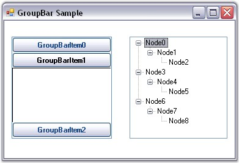{border="0"}[]{style="FONT-FAMILY: 'Calibri','sans-serif'; FONT-SIZE: 11pt"}

 

Figure 870: Adding a TreeView Control to the GroupBar

[]{style="COLOR: #15428b"} 

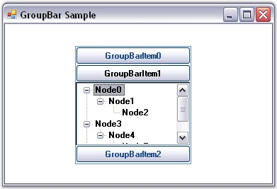{border="0"}

[]{style="COLOR: #15428b"} 

Figure 871: TreeView Control added to GroupBarItem1

 

 

 

[]{#p605} 

 

3.6.1.4.2.4.2      GroupView as Child Control

[]{style="COLOR: #4a5c8c; FONT-SIZE: 8pt"} 

GroupView control can be added as a Child control to the GroupBar Item by dragging-and-dropping the control onto the GroupBar\'s client region and adding GroupView Items using the **GroupView Item Collection Editor**.

[]{style="COLOR: #15428b"} 

+------------------------------------------------------------------------------------------------------------------------------------------------------------------------------------------------------------------------------------------------------------------------------------------------------+
| **[\[C#\]]{style="FONT-FAMILY: 'Courier New'; COLOR: black"}**                                                                                                                                                                                                                                       |
|                                                                                                                                                                                                                                                                                                      |
| []{style="FONT-FAMILY: 'Courier New'; COLOR: black"}                                                                                                                                                                                                                                                 |
|                                                                                                                                                                                                                                                                                                      |
| [this]{style="FONT-FAMILY: 'Courier New'; COLOR: blue"}[.groupBar1 = [new]{style="COLOR: blue"} Syncfusion.Windows.Forms.Tools.GroupBar();]{style="FONT-FAMILY: 'Courier New'"}                                                                                                                      |
|                                                                                                                                                                                                                                                                                                      |
| [this]{style="FONT-FAMILY: 'Courier New'; COLOR: blue"}[.groupBarItem1 = [new]{style="COLOR: blue"} Syncfusion.Windows.Forms.Tools.GroupBarItem();]{style="FONT-FAMILY: 'Courier New'"}                                                                                                              |
|                                                                                                                                                                                                                                                                                                      |
| [this]{style="FONT-FAMILY: 'Courier New'; COLOR: blue"}[.groupBarItem2 = [new]{style="COLOR: blue"} Syncfusion.Windows.Forms.Tools.GroupBarItem();]{style="FONT-FAMILY: 'Courier New'"}                                                                                                              |
|                                                                                                                                                                                                                                                                                                      |
| [this]{style="FONT-FAMILY: 'Courier New'; COLOR: blue"}[.groupView1 = [new]{style="COLOR: blue"} Syncfusion.Windows.Forms.Tools.GroupView();]{style="FONT-FAMILY: 'Courier New'"}                                                                                                                    |
|                                                                                                                                                                                                                                                                                                      |
| [                   ]{style="FONT-FAMILY: 'Courier New'"}                                                                                                                                                                                                                                            |
|                                                                                                                                                                                                                                                                                                      |
| [// groupBarItem1 has no client control.]{style="FONT-FAMILY: 'Courier New'; COLOR: green"}                                                                                                                                                                                                          |
|                                                                                                                                                                                                                                                                                                      |
| [this]{style="FONT-FAMILY: 'Courier New'; COLOR: blue"}[.groupBarItem1.Client = [null]{style="COLOR: blue"};]{style="FONT-FAMILY: 'Courier New'"}                                                                                                                                                    |
|                                                                                                                                                                                                                                                                                                      |
| []{style="FONT-FAMILY: 'Courier New'"}                                                                                                                                                                                                                                                               |
|                                                                                                                                                                                                                                                                                                      |
| [// GroupView control attached as a client control to groupBarItem2.]{style="FONT-FAMILY: 'Courier New'; COLOR: green"}                                                                                                                                                                              |
|                                                                                                                                                                                                                                                                                                      |
| [this]{style="FONT-FAMILY: 'Courier New'; COLOR: blue"}[.groupBarItem2.Client = [this]{style="COLOR: blue"}.groupView1;]{style="FONT-FAMILY: 'Courier New'"}                                                                                                                                         |
|                                                                                                                                                                                                                                                                                                      |
| []{style="FONT-FAMILY: 'Courier New'; COLOR: blue"}                                                                                                                                                                                                                                                  |
|                                                                                                                                                                                                                                                                                                      |
| [// Items are added to the GroupView Control and their text is edited.]{style="FONT-FAMILY: 'Courier New'; COLOR: green"}                                                                                                                                                                            |
|                                                                                                                                                                                                                                                                                                      |
| [this]{style="FONT-FAMILY: 'Courier New'; COLOR: blue"}[.groupView1.GroupViewItems.AddRange([new]{style="COLOR: blue"} Syncfusion.Windows.Forms.Tools.GroupViewItem\[\] {]{style="FONT-FAMILY: 'Courier New'"}                                                                                       |
|                                                                                                                                                                                                                                                                                                      |
| [new]{style="FONT-FAMILY: 'Courier New'; COLOR: blue"}[ Syncfusion.Windows.Forms.Tools.GroupViewItem([\"GroupViewItem0\"]{style="COLOR: maroon"}, -1, [true]{style="COLOR: blue"}, [null]{style="COLOR: blue"}, [\"GroupViewItem0\"]{style="COLOR: maroon"}),]{style="FONT-FAMILY: 'Courier New'"}   |
|                                                                                                                                                                                                                                                                                                      |
| [new]{style="FONT-FAMILY: 'Courier New'; COLOR: blue"}[ Syncfusion.Windows.Forms.Tools.GroupViewItem([\"GroupViewItem1\"]{style="COLOR: maroon"}, -1, [true]{style="COLOR: blue"}, [null]{style="COLOR: blue"}, [\"GroupViewItem1\"]{style="COLOR: maroon"})});]{style="FONT-FAMILY: 'Courier New'"} |
+------------------------------------------------------------------------------------------------------------------------------------------------------------------------------------------------------------------------------------------------------------------------------------------------------+

[]{style="COLOR: #15428b"} 

+------------------------------------------------------------------------------------------------------------------------------------------------------------------------------------------------------------------------------------------------------------------------------------------------------------------------------------------------------------------------------------------------------------------------------------------------------------------------------------------------------------------------------------------------------------------------------------------------------------------------------------------------------------------------------------+
| **[\[VB.NET\]]{style="FONT-FAMILY: 'Courier New'; COLOR: black"}**                                                                                                                                                                                                                                                                                                                                                                                                                                                                                                                                                                                                                 |
|                                                                                                                                                                                                                                                                                                                                                                                                                                                                                                                                                                                                                                                                                    |
| []{style="FONT-FAMILY: 'Courier New'; COLOR: blue"}                                                                                                                                                                                                                                                                                                                                                                                                                                                                                                                                                                                                                                |
|                                                                                                                                                                                                                                                                                                                                                                                                                                                                                                                                                                                                                                                                                    |
| [Me]{style="FONT-FAMILY: 'Courier New'; COLOR: blue"}[.groupBar1 = [New]{style="COLOR: blue"} Syncfusion.Windows.Forms.Tools.GroupBar()]{style="FONT-FAMILY: 'Courier New'"}                                                                                                                                                                                                                                                                                                                                                                                                                                                                                                       |
|                                                                                                                                                                                                                                                                                                                                                                                                                                                                                                                                                                                                                                                                                    |
| [Me]{style="FONT-FAMILY: 'Courier New'; COLOR: blue"}[.groupBarItem1 = [New]{style="COLOR: blue"} Syncfusion.Windows.Forms.Tools.GroupBarItem()]{style="FONT-FAMILY: 'Courier New'"}                                                                                                                                                                                                                                                                                                                                                                                                                                                                                               |
|                                                                                                                                                                                                                                                                                                                                                                                                                                                                                                                                                                                                                                                                                    |
| [Me]{style="FONT-FAMILY: 'Courier New'; COLOR: blue"}[.groupBarItem2 = [New]{style="COLOR: blue"} Syncfusion.Windows.Forms.Tools.GroupBarItem()]{style="FONT-FAMILY: 'Courier New'"}                                                                                                                                                                                                                                                                                                                                                                                                                                                                                               |
|                                                                                                                                                                                                                                                                                                                                                                                                                                                                                                                                                                                                                                                                                    |
| [Me]{style="FONT-FAMILY: 'Courier New'; COLOR: blue"}[.groupView1 = [New]{style="COLOR: blue"} Syncfusion.Windows.Forms.Tools.GroupView()]{style="FONT-FAMILY: 'Courier New'"}                                                                                                                                                                                                                                                                                                                                                                                                                                                                                                     |
|                                                                                                                                                                                                                                                                                                                                                                                                                                                                                                                                                                                                                                                                                    |
| [   ]{style="FONT-FAMILY: 'Courier New'"}                                                                                                                                                                                                                                                                                                                                                                                                                                                                                                                                                                                                                                          |
|                                                                                                                                                                                                                                                                                                                                                                                                                                                                                                                                                                                                                                                                                    |
| [\' groupBarItem1 has no client control. ]{style="FONT-FAMILY: 'Courier New'; COLOR: green"}                                                                                                                                                                                                                                                                                                                                                                                                                                                                                                                                                                                       |
|                                                                                                                                                                                                                                                                                                                                                                                                                                                                                                                                                                                                                                                                                    |
| [Me]{style="FONT-FAMILY: 'Courier New'; COLOR: blue"}[.groupBarItem1.Client = [Nothing]{style="COLOR: blue"}]{style="FONT-FAMILY: 'Courier New'"}                                                                                                                                                                                                                                                                                                                                                                                                                                                                                                                                  |
|                                                                                                                                                                                                                                                                                                                                                                                                                                                                                                                                                                                                                                                                                    |
| []{style="FONT-FAMILY: 'Courier New'; COLOR: blue"}                                                                                                                                                                                                                                                                                                                                                                                                                                                                                                                                                                                                                                |
|                                                                                                                                                                                                                                                                                                                                                                                                                                                                                                                                                                                                                                                                                    |
| [\' GroupView control attached as a client control to groupBarItem2.]{style="FONT-FAMILY: 'Courier New'; COLOR: green"}                                                                                                                                                                                                                                                                                                                                                                                                                                                                                                                                                            |
|                                                                                                                                                                                                                                                                                                                                                                                                                                                                                                                                                                                                                                                                                    |
| [Me]{style="FONT-FAMILY: 'Courier New'; COLOR: blue"}[.groupBarItem2.Client = [Me]{style="COLOR: blue"}.groupView1]{style="FONT-FAMILY: 'Courier New'"}                                                                                                                                                                                                                                                                                                                                                                                                                                                                                                                            |
|                                                                                                                                                                                                                                                                                                                                                                                                                                                                                                                                                                                                                                                                                    |
| []{style="FONT-FAMILY: 'Courier New'; COLOR: maroon"}                                                                                                                                                                                                                                                                                                                                                                                                                                                                                                                                                                                                                              |
|                                                                                                                                                                                                                                                                                                                                                                                                                                                                                                                                                                                                                                                                                    |
| [\' Items are added to the GroupView Control and their text is edited.]{style="FONT-FAMILY: 'Courier New'; COLOR: green"}                                                                                                                                                                                                                                                                                                                                                                                                                                                                                                                                                          |
|                                                                                                                                                                                                                                                                                                                                                                                                                                                                                                                                                                                                                                                                                    |
| [Me]{style="FONT-FAMILY: 'Courier New'; COLOR: blue"}[.groupView1.GroupViewItems.AddRange([New]{style="COLOR: blue"} Syncfusion.Windows.Forms.Tools.GroupViewItem() {[New]{style="COLOR: blue"} Syncfusion.Windows.Forms.Tools.GroupViewItem([\"GroupViewItem0\"]{style="COLOR: maroon"}, -1, [True]{style="COLOR: blue"}, [Nothing]{style="COLOR: blue"}, [\"GroupViewItem0\"]{style="COLOR: maroon"}), [New]{style="COLOR: blue"} Syncfusion.Windows.Forms.Tools.GroupViewItem([\"GroupViewItem1\"]{style="COLOR: maroon"}, -1, [True]{style="COLOR: blue"}, [Nothing]{style="COLOR: blue"}, [\"GroupViewItem1\"]{style="COLOR: maroon"})})]{style="FONT-FAMILY: 'Courier New'"} |
+------------------------------------------------------------------------------------------------------------------------------------------------------------------------------------------------------------------------------------------------------------------------------------------------------------------------------------------------------------------------------------------------------------------------------------------------------------------------------------------------------------------------------------------------------------------------------------------------------------------------------------------------------------------------------------+

[]{style="COLOR: #15428b"} 

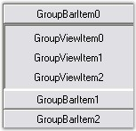{border="0"}[]{style="FONT-FAMILY: 'Calibri','sans-serif'; FONT-SIZE: 11pt"}

 

Figure 872: GroupView control added to the GroupBarItem0

 

 

 

[]{#p606} 

 

3.6.1.4.2.4.3      GroupBar as Child Control

[]{style="COLOR: #4a5c8c; FONT-SIZE: 8pt"} 

GroupBar control itself can be placed in the client region of the GroupBar Item. This is called **Nested GroupBar**.

[]{style="FONT-FAMILY: 'Verdana','sans-serif'; COLOR: #4a5c8c; FONT-SIZE: 8pt"} 

The following step-by-step procedure helps you to create Nested GroupBars.

[]{style="COLOR: #15428b"} 

1.   Drag and drop the GroupBar1 control from the toolbox onto the form, add GroupBar Items using the **GroupBar Item Collection Editor**, drag and drop the GroupView control and add GroupView Items using the **GroupView Item Collection Editor**. Associate the GroupView control inside the client area of the GroupBar Item.

[]{style="COLOR: #15428b"} 

The below screen shot shows the GroupBar with four GroupBar Items named as Windows Forms, Components, General and Nested GroupBar.

[]{style="COLOR: #15428b"} 

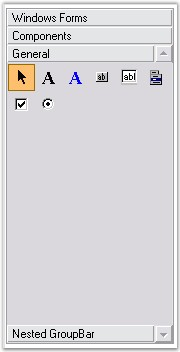{border="0"}[]{style="FONT-FAMILY: 'Calibri','sans-serif'; FONT-SIZE: 11pt"}

 

Figure 873: GroupBar1 with Four GroupBar Items

[]{style="COLOR: #15428b"} 

2.   Drag and drop another GroupBar2 control from the toolbox and add the GroupBar Items (Personal, Work and Contacts) using the **GroupBar Item Collection Editor** and add the GroupView control with GroupView Items (Vendors, Metrics, Trend, Sales and Sales 2 for the GroupBar Item Work) to each GroupBar Item using the **GroupView Item Collection Editor**.

[]{style="COLOR: #15428b"} 

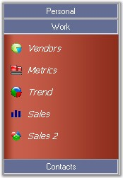{border="0"}[]{style="FONT-FAMILY: 'Calibri','sans-serif'; FONT-SIZE: 11pt"}

 

Figure 874: GroupBar2 with Three GroupBar Items

[]{style="COLOR: #15428b"} 

3.   Add GroupBar2 as child control to the GroupBar1 by doing a drag and drop operation.

[]{style="COLOR: #15428b"} 

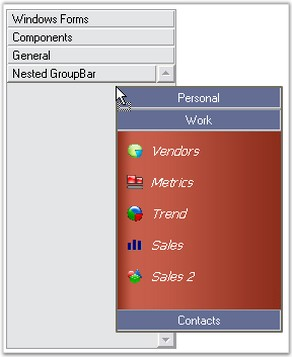{border="0"}[]{style="FONT-FAMILY: 'Calibri','sans-serif'; FONT-SIZE: 11pt"}

 

Figure 875: Adding GroupBar2 as Child Control to GroupBar1

[]{style="COLOR: #15428b"} 

The following screen shot shows the Nested GroupBars.

[]{style="COLOR: #15428b"} 

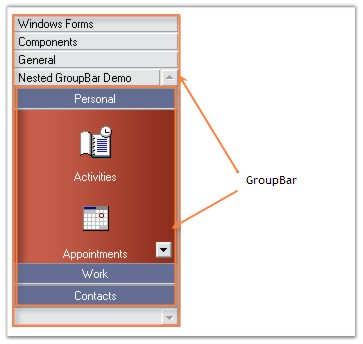{border="0"}[]{style="FONT-FAMILY: 'Calibri','sans-serif'; FONT-SIZE: 11pt"}

 

Figure 876: Nested GroupBars

[]{style="COLOR: #15428b"} 

+-------------------------------------------------------------------------------------------------------------------------------------------------------------------------------------------------------------+
| **[\[C#\]]{style="FONT-FAMILY: 'Courier New'; COLOR: black"}**                                                                                                                                              |
|                                                                                                                                                                                                             |
| []{style="FONT-FAMILY: 'Courier New'; COLOR: black"}                                                                                                                                                        |
|                                                                                                                                                                                                             |
| [this]{style="FONT-FAMILY: 'Courier New'; COLOR: blue"}[.groupBar1 = [new]{style="COLOR: blue"} Syncfusion.Windows.Forms.Tools.GroupBar();]{style="FONT-FAMILY: 'Courier New'"}                             |
|                                                                                                                                                                                                             |
| [this]{style="FONT-FAMILY: 'Courier New'; COLOR: blue"}[.groupBarItem1 = [new]{style="COLOR: blue"} Syncfusion.Windows.Forms.Tools.GroupBarItem();]{style="FONT-FAMILY: 'Courier New'"}                     |
|                                                                                                                                                                                                             |
| [this]{style="FONT-FAMILY: 'Courier New'; COLOR: blue"}[.groupBarItem2 = [new]{style="COLOR: blue"} Syncfusion.Windows.Forms.Tools.GroupBarItem();]{style="FONT-FAMILY: 'Courier New'"}                     |
|                                                                                                                                                                                                             |
| [this]{style="FONT-FAMILY: 'Courier New'; COLOR: blue"}[.groupBar2 = [new]{style="COLOR: blue"} Syncfusion.Windows.Forms.Tools.GroupBar();]{style="FONT-FAMILY: 'Courier New'"}                             |
|                                                                                                                                                                                                             |
| [this]{style="FONT-FAMILY: 'Courier New'; COLOR: blue"}[.groupBarItem3 = [new]{style="COLOR: blue"} Syncfusion.Windows.Forms.Tools.GroupBarItem();]{style="FONT-FAMILY: 'Courier New'"}                     |
|                                                                                                                                                                                                             |
| [this]{style="FONT-FAMILY: 'Courier New'; COLOR: blue"}[.groupBarItem4 = [new]{style="COLOR: blue"} Syncfusion.Windows.Forms.Tools.GroupBarItem();]{style="FONT-FAMILY: 'Courier New'"}                     |
|                                                                                                                                                                                                             |
| [         ]{style="FONT-FAMILY: 'Courier New'"}                                                                                                                                                             |
|                                                                                                                                                                                                             |
| [// groupBarItem1 has no client control.]{style="FONT-FAMILY: 'Courier New'; COLOR: green"}                                                                                                                 |
|                                                                                                                                                                                                             |
| [this]{style="FONT-FAMILY: 'Courier New'; COLOR: blue"}[.groupBarItem1.Client = [null]{style="COLOR: blue"};]{style="FONT-FAMILY: 'Courier New'"}                                                           |
|                                                                                                                                                                                                             |
| [            ]{style="FONT-FAMILY: 'Courier New'"}                                                                                                                                                          |
|                                                                                                                                                                                                             |
| [// GroupBar control attached as a client control to groupBarItem2.]{style="FONT-FAMILY: 'Courier New'; COLOR: green"}                                                                                      |
|                                                                                                                                                                                                             |
| [this]{style="FONT-FAMILY: 'Courier New'; COLOR: blue"}[.groupBarItem2.Client = [this]{style="COLOR: blue"}.groupBar2;]{style="FONT-FAMILY: 'Courier New'"}                                                 |
|                                                                                                                                                                                                             |
| []{style="FONT-FAMILY: 'Courier New'"}                                                                                                                                                                      |
|                                                                                                                                                                                                             |
| [// Items are added to the GroupBar Control.]{style="FONT-FAMILY: 'Courier New'; COLOR: green"}                                                                                                             |
|                                                                                                                                                                                                             |
| [this]{style="FONT-FAMILY: 'Courier New'; COLOR: blue"}[.groupBar2.GroupBarItems.AddRange([new]{style="COLOR: blue"} Syncfusion.Windows.Forms.Tools.GroupBarItem\[\] {]{style="FONT-FAMILY: 'Courier New'"} |
|                                                                                                                                                                                                             |
| [this]{style="FONT-FAMILY: 'Courier New'; COLOR: blue"}[.groupBarItem3,]{style="FONT-FAMILY: 'Courier New'"}                                                                                                |
|                                                                                                                                                                                                             |
| [this]{style="FONT-FAMILY: 'Courier New'; COLOR: blue"}[.groupBarItem4});]{style="FONT-FAMILY: 'Courier New'"}                                                                                              |
+-------------------------------------------------------------------------------------------------------------------------------------------------------------------------------------------------------------+

[]{style="COLOR: #15428b"} 

+-------------------------------------------------------------------------------------------------------------------------------------------------------------------------------------------------------------------------------------------------------------------------------------------+
| **[\[VB.NET\]]{style="FONT-FAMILY: 'Courier New'; COLOR: black"}**                                                                                                                                                                                                                        |
|                                                                                                                                                                                                                                                                                           |
| []{style="FONT-FAMILY: 'Courier New'; COLOR: black"}                                                                                                                                                                                                                                      |
|                                                                                                                                                                                                                                                                                           |
| [Me]{style="FONT-FAMILY: 'Courier New'; COLOR: blue"}[.groupBar1 = [New]{style="COLOR: blue"} Syncfusion.Windows.Forms.Tools.GroupBar()]{style="FONT-FAMILY: 'Courier New'"}                                                                                                              |
|                                                                                                                                                                                                                                                                                           |
| [Me]{style="FONT-FAMILY: 'Courier New'; COLOR: blue"}[.groupBarItem1 = [New]{style="COLOR: blue"} Syncfusion.Windows.Forms.Tools.GroupBarItem()]{style="FONT-FAMILY: 'Courier New'"}                                                                                                      |
|                                                                                                                                                                                                                                                                                           |
| [Me]{style="FONT-FAMILY: 'Courier New'; COLOR: blue"}[.groupBarItem2 = [New]{style="COLOR: blue"} Syncfusion.Windows.Forms.Tools.GroupBarItem()]{style="FONT-FAMILY: 'Courier New'"}                                                                                                      |
|                                                                                                                                                                                                                                                                                           |
| [Me]{style="FONT-FAMILY: 'Courier New'; COLOR: blue"}[.groupBar2 = [New]{style="COLOR: blue"} Syncfusion.Windows.Forms.Tools.GroupBar()]{style="FONT-FAMILY: 'Courier New'"}                                                                                                              |
|                                                                                                                                                                                                                                                                                           |
| [Me]{style="FONT-FAMILY: 'Courier New'; COLOR: blue"}[.groupBarItem3 = [New]{style="COLOR: blue"} Syncfusion.Windows.Forms.Tools.GroupBarItem()]{style="FONT-FAMILY: 'Courier New'"}                                                                                                      |
|                                                                                                                                                                                                                                                                                           |
| [Me]{style="FONT-FAMILY: 'Courier New'; COLOR: blue"}[.groupBarItem4 = [New]{style="COLOR: blue"} Syncfusion.Windows.Forms.Tools.GroupBarItem()]{style="FONT-FAMILY: 'Courier New'"}                                                                                                      |
|                                                                                                                                                                                                                                                                                           |
| [     ]{style="FONT-FAMILY: 'Courier New'"}                                                                                                                                                                                                                                               |
|                                                                                                                                                                                                                                                                                           |
| [\' groupBarItem1 has no client control.]{style="FONT-FAMILY: 'Courier New'; COLOR: green"}                                                                                                                                                                                               |
|                                                                                                                                                                                                                                                                                           |
| [Me]{style="FONT-FAMILY: 'Courier New'; COLOR: blue"}[.groupBarItem1.Client = [Nothing]{style="COLOR: blue"}]{style="FONT-FAMILY: 'Courier New'"}                                                                                                                                         |
|                                                                                                                                                                                                                                                                                           |
| []{style="FONT-FAMILY: 'Courier New'; COLOR: maroon"}                                                                                                                                                                                                                                     |
|                                                                                                                                                                                                                                                                                           |
| [\' GroupBar control attached as a client control to groupBarItem2.]{style="FONT-FAMILY: 'Courier New'; COLOR: green"}                                                                                                                                                                    |
|                                                                                                                                                                                                                                                                                           |
| [Me]{style="FONT-FAMILY: 'Courier New'; COLOR: blue"}[.groupBarItem2.Client = [Me]{style="COLOR: blue"}.groupBar2]{style="FONT-FAMILY: 'Courier New'"}                                                                                                                                    |
|                                                                                                                                                                                                                                                                                           |
| []{style="FONT-FAMILY: 'Courier New'; COLOR: maroon"}                                                                                                                                                                                                                                     |
|                                                                                                                                                                                                                                                                                           |
| [\' Items are added to the GroupBar Control.]{style="FONT-FAMILY: 'Courier New'; COLOR: green"}                                                                                                                                                                                           |
|                                                                                                                                                                                                                                                                                           |
| [Me]{style="FONT-FAMILY: 'Courier New'; COLOR: blue"}[.groupBar2.GroupBarItems.AddRange([New]{style="COLOR: blue"} Syncfusion.Windows.Forms.Tools.GroupBarItem() {[Me]{style="COLOR: blue"}.groupBarItem3, [Me]{style="COLOR: blue"}.groupBarItem4})]{style="FONT-FAMILY: 'Courier New'"} |
+-------------------------------------------------------------------------------------------------------------------------------------------------------------------------------------------------------------------------------------------------------------------------------------------+

 

 

[]{#p607} 

 

###### 3.6.1.4.2.5 GroupBarItem Popup {#groupbaritem-popup style="tab-stops: 0pt"}

[]{style="COLOR: #15428b"} 

The below properties controls the appearance and behavior of the GroupBarItem popup.

[]{style="COLOR: #15428b"} 

::: {align="center"}
  ------------------- --------------------------------------------------------------------------------------
  GroupBar Property   Description
  PopupAutoClose      Indicates whether popup is closed after clicking an item.
  PopupClientSize     Indicates the initial size of the popup for the GroupBarItem client.
  PopupResizeMode     Gets or sets the popup\'s resize mode. It can be horizontal, vertical, Both or None.
  ShowPopupGripper    Specifies whether to show or hide the popup gripper.
  ------------------- --------------------------------------------------------------------------------------
:::

[]{style="COLOR: #15428b"} 

[]{style="COLOR: #15428b"} 

::: {align="center"}
  ------------------- ------------------------------------------
  GroupBar Property   Description
  HidePopup           Calling this method will hide the popup.
  ------------------- ------------------------------------------
:::

[]{style="COLOR: #15428b"} 

+-----------------------------------------------------------------------------------------------------------------------------------------------------------------------------------------------------------+
| **[\[C#\]]{style="FONT-FAMILY: 'Courier New'; COLOR: black"}**                                                                                                                                            |
|                                                                                                                                                                                                           |
| []{style="FONT-FAMILY: 'Courier New'; COLOR: black"}                                                                                                                                                      |
|                                                                                                                                                                                                           |
| [this]{style="FONT-FAMILY: 'Courier New'; COLOR: blue"}[.groupBar1.PopupClientSize = [new]{style="COLOR: blue"} System.Drawing.[Size]{style="COLOR: teal"}(5, 6);]{style="FONT-FAMILY: 'Courier New'"}    |
|                                                                                                                                                                                                           |
| [this]{style="FONT-FAMILY: 'Courier New'; COLOR: blue"}[.groupBar1.PopupResizeMode = Syncfusion.Windows.Forms.Tools.[PopupResizeMode]{style="COLOR: teal"}.Vertical;]{style="FONT-FAMILY: 'Courier New'"} |
|                                                                                                                                                                                                           |
| [this]{style="FONT-FAMILY: 'Courier New'; COLOR: blue"}[.groupBar1.PopupAutoClose = [true]{style="COLOR: blue"};]{style="FONT-FAMILY: 'Courier New'"}                                                     |
|                                                                                                                                                                                                           |
| [this]{style="FONT-FAMILY: 'Courier New'; COLOR: blue"}[.groupBar1.ShowPopupGripper = [true]{style="COLOR: blue"};]{style="FONT-FAMILY: 'Courier New'"}                                                   |
|                                                                                                                                                                                                           |
| []{style="FONT-FAMILY: 'Courier New'"}                                                                                                                                                                    |
|                                                                                                                                                                                                           |
| [this]{style="FONT-FAMILY: 'Courier New'; COLOR: blue"}[.groupBar1.HidePopup();]{style="FONT-FAMILY: 'Courier New'"}                                                                                      |
+-----------------------------------------------------------------------------------------------------------------------------------------------------------------------------------------------------------+

[]{style="COLOR: #15428b"} 

+----------------------------------------------------------------------------------------------------------------------------------------------------------------------------------+
| **[\[VB.NET\]]{style="FONT-FAMILY: 'Courier New'; COLOR: black"}**                                                                                                               |
|                                                                                                                                                                                  |
| []{style="FONT-FAMILY: 'Courier New'; COLOR: black"}                                                                                                                             |
|                                                                                                                                                                                  |
| [Me]{style="FONT-FAMILY: 'Courier New'; COLOR: blue"}[.groupBar1.PopupClientSize = [New]{style="COLOR: blue"} System.Drawing.Size(5, 6) ]{style="FONT-FAMILY: 'Courier New'"}    |
|                                                                                                                                                                                  |
| [Me]{style="FONT-FAMILY: 'Courier New'; COLOR: blue"}[.groupBar1.PopupResizeMode = Syncfusion.Windows.Forms.Tools.PopupResizeMode.Vertical ]{style="FONT-FAMILY: 'Courier New'"} |
|                                                                                                                                                                                  |
| [Me]{style="FONT-FAMILY: 'Courier New'; COLOR: blue"}[.groupBar1.PopupAutoClose = [True]{style="COLOR: blue"} ]{style="FONT-FAMILY: 'Courier New'"}                              |
|                                                                                                                                                                                  |
| [Me]{style="FONT-FAMILY: 'Courier New'; COLOR: blue"}[.groupBar1.ShowPopupGripper = [True]{style="COLOR: blue"} ]{style="FONT-FAMILY: 'Courier New'"}                            |
|                                                                                                                                                                                  |
| []{style="FONT-FAMILY: 'Courier New'"}                                                                                                                                           |
|                                                                                                                                                                                  |
| [Me]{style="FONT-FAMILY: 'Courier New'; COLOR: blue"}[.groupBar1.HidePopup()]{style="FONT-FAMILY: 'Courier New'"}                                                                |
+----------------------------------------------------------------------------------------------------------------------------------------------------------------------------------+

 

 

 

[]{#p608} 

 

[]{#related-topics}
::::::::
