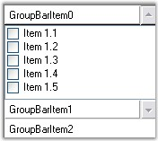
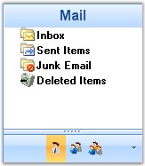
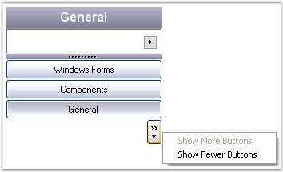
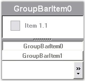

::: {style="DISPLAY: none"}
{#d2h_url_template}{#d2h_package_url style="WIDTH: 0px; DISPLAY: none; HEIGHT: 0px"}
:::

:::::::::: {.d2h_secondary_topic style="PADDING-BOTTOM: 10pt; MARGIN: 0pt; PADDING-LEFT: 0pt; PADDING-RIGHT: 0pt; PADDING-TOP: 0pt"}
##### GroupBar Settings {#groupbar-settings style="tab-stops: 0pt"}

[]{style="COLOR: #15428b"} 

The look and feel of the GroupBar can be controlled through the appearance properties of the control. These properties are discussed in detail in the below topics.

[]{style="COLOR: #15428b"} 

 

###### 3.6.1.4.1.1 Integrated Scrolling {#integrated-scrolling style="tab-stops: 0pt"}

[]{style="COLOR: #15428b"} 

Scroll buttons can be included for the client controls in the GroupBar by setting the **IntegratedScrolling** property to \'True\'**.**

[]{style="COLOR: #15428b"} 

::: {align="center"}
  --------------------- ---------------------------------------------------------------------------------------------------------------------------------------------------------------------------------------------------
  GroupBar Property     Description
  IntegratedScrolling   Draws a set of scroll thumbs on the GroupBar. This mode is used for creating a VS.NET toolbox type interface where the GroupBar provides the scrolling support for the GroupView client controls.
  --------------------- ---------------------------------------------------------------------------------------------------------------------------------------------------------------------------------------------------
:::

[]{style="COLOR: #15428b"} 

+------------------------------------------------------------------------------------------------------------------------------------------------------------+
| **[\[C#\]]{style="FONT-FAMILY: 'Courier New'; COLOR: black"}**                                                                                             |
|                                                                                                                                                            |
| []{style="FONT-FAMILY: 'Courier New'; COLOR: black"}                                                                                                       |
|                                                                                                                                                            |
| [this]{style="FONT-FAMILY: 'Courier New'; COLOR: blue"}[.groupBar1.IntegratedScrolling = [true]{style="COLOR: blue"};]{style="FONT-FAMILY: 'Courier New'"} |
+------------------------------------------------------------------------------------------------------------------------------------------------------------+

[]{style="COLOR: #4a5c8c; FONT-SIZE: 8pt"} 

+----------------------------------------------------------------------------------------------------------------------------------------------------------+
| **[\[VB.NET\]]{style="FONT-FAMILY: 'Courier New'; COLOR: black"}**                                                                                       |
|                                                                                                                                                          |
| []{style="FONT-FAMILY: 'Courier New'; COLOR: black"}                                                                                                     |
|                                                                                                                                                          |
| [Me]{style="FONT-FAMILY: 'Courier New'; COLOR: blue"}[.groupBar1.IntegratedScrolling = [True]{style="COLOR: blue"} ]{style="FONT-FAMILY: 'Courier New'"} |
+----------------------------------------------------------------------------------------------------------------------------------------------------------+

[]{style="COLOR: #15428b"} 

{border="0"}[]{style="FONT-FAMILY: 'Calibri','sans-serif'; FONT-SIZE: 11pt"}

 

Figure 861: GroupBar with Integrated Scrolling

 

 

[]{#p597} 

 

###### []{#_StackedGroupBar}3.6.1.4.1.2 StackedGroupBar {#stackedgroupbar style="tab-stops: 0pt"}

[]{style="COLOR: #15428b"} 

The following are the properties available for GroupBar Items when the GroupBar is in the Stacked Mode. The Stacked Mode can be enabled by setting the **StackedMode** property to \'True\'.

[]{style="COLOR: #15428b"} 

::: {align="center"}
  ----------------------- ---------------------------------------------------------------------------------------------------------------------------
  GroupBarItem Property   Description
  InNavigationPane        Specifies the value which determines whether the GroupBar Item should be added to the GroupBar\'s navigation pane or not.
  NavigationPaneIcon      The icon representing the GroupBar\'s item in the navigation pane.
  NavigationPaneImage     Gets / sets the image representing the GroupBar\'s item in the navigation pane.
  ShowChevron             Gets / sets the value indicating whether the chevron button on the navigation panel is shown or not.
  ----------------------- ---------------------------------------------------------------------------------------------------------------------------
:::

[]{style="COLOR: #15428b"} 

+-------------------------------------------------------------------------------------------------------------------------------------------------------------------------------------------------------------------------------------------------------------------------+
| **[\[C#\]]{style="FONT-FAMILY: 'Courier New'; COLOR: black"}**[ ]{style="FONT-FAMILY: 'Courier New'"}                                                                                                                                                                   |
|                                                                                                                                                                                                                                                                         |
| []{style="FONT-FAMILY: 'Courier New'; COLOR: blue"}                                                                                                                                                                                                                     |
|                                                                                                                                                                                                                                                                         |
| [// StackeMode set to true.]{style="FONT-FAMILY: 'Courier New'; COLOR: green"}                                                                                                                                                                                          |
|                                                                                                                                                                                                                                                                         |
| [this]{style="FONT-FAMILY: 'Courier New'; COLOR: blue"}[.groupBarItem1.InNavigationPane = [true]{style="COLOR: blue"};]{style="FONT-FAMILY: 'Courier New'"}                                                                                                             |
|                                                                                                                                                                                                                                                                         |
| [this]{style="FONT-FAMILY: 'Courier New'; COLOR: blue"}[.groupBarItem1.NavigationPaneIcon = ((System.Drawing.[Icon]{style="COLOR: teal"})(resources.GetObject([\"groupBarItem1.NavigationPaneIcon\"]{style="COLOR: maroon"})));]{style="FONT-FAMILY: 'Courier New'"}    |
|                                                                                                                                                                                                                                                                         |
| [this]{style="FONT-FAMILY: 'Courier New'; COLOR: blue"}[.groupBarItem1.NavigationPaneImage = ((System.Drawing.[Image]{style="COLOR: teal"})(resources.GetObject([\"groupBarItem1.NavigationPaneImage\"]{style="COLOR: maroon"})));]{style="FONT-FAMILY: 'Courier New'"} |
+-------------------------------------------------------------------------------------------------------------------------------------------------------------------------------------------------------------------------------------------------------------------------+

[]{style="COLOR: #15428b"} 

+--------------------------------------------------------------------------------------------------------------------------------------------------------------------------------------------------------------------------------------------------------------------------------+
| **[\[VB.NET\]]{style="FONT-FAMILY: 'Courier New'; COLOR: black"}**                                                                                                                                                                                                             |
|                                                                                                                                                                                                                                                                                |
| []{style="FONT-FAMILY: 'Courier New'; COLOR: black"}                                                                                                                                                                                                                           |
|                                                                                                                                                                                                                                                                                |
| [\' StackeMode set to true.]{style="FONT-FAMILY: 'Courier New'; COLOR: green"}                                                                                                                                                                                                 |
|                                                                                                                                                                                                                                                                                |
| [Me]{style="FONT-FAMILY: 'Courier New'; COLOR: blue"}[.groupBarItem1.InNavigationPane = [True]{style="COLOR: blue"}]{style="FONT-FAMILY: 'Courier New'"}                                                                                                                       |
|                                                                                                                                                                                                                                                                                |
| [Me]{style="FONT-FAMILY: 'Courier New'; COLOR: blue"}[.groupBarItem1.NavigationPaneIcon = [DirectCast]{style="COLOR: blue"}((Resources.GetObject([\"groupBarItem1.NavigationPaneIcon\"]{style="COLOR: maroon"})), System.Drawing.Icon)]{style="FONT-FAMILY: 'Courier New'"}    |
|                                                                                                                                                                                                                                                                                |
| [Me]{style="FONT-FAMILY: 'Courier New'; COLOR: blue"}[.groupBarItem1.NavigationPaneImage = [DirectCast]{style="COLOR: blue"}((Resources.GetObject([\"groupBarItem1.NavigationPaneImage\"]{style="COLOR: maroon"})), System.Drawing.Image)]{style="FONT-FAMILY: 'Courier New'"} |
+--------------------------------------------------------------------------------------------------------------------------------------------------------------------------------------------------------------------------------------------------------------------------------+

[]{style="COLOR: #15428b"} 

If you want to display an icon or image for the GroupBar Item displayed in the GroupBar\'s navigation pane, set the**InNavigationPane** property to \'True\' and associate icons or images with the **NavigationPaneIcon** and **NavigationPaneImage** properties respectively.

[]{style="COLOR: #15428b"} 

{border="0"}[]{style="FONT-FAMILY: 'Calibri','sans-serif'; FONT-SIZE: 11pt"}

 

Figure 862: StackedGroupBar with GroupBar Items in its Navigation Pane

[]{style="COLOR: #15428b"} 

Stacked GroupBar Item automatically shows the **Chevron**, which can be made invisible by setting the **ShowChevron** property to \'False\'.

[]{style="COLOR: #15428b"} 

{border="0"}[]{style="FONT-FAMILY: 'Calibri','sans-serif'; FONT-SIZE: 11pt"}

 

Figure 863: Chevron shown when GroupBar is in Stacked Mode

[]{style="COLOR: #15428b"} 

::: {style="BORDER-BOTTOM: windowtext 1pt solid; BORDER-LEFT: medium none; PADDING-BOTTOM: 1pt; MARGIN-TOP: 9pt; PADDING-LEFT: 0pt; PADDING-RIGHT: 0pt; MARGIN-BOTTOM: 9pt; BORDER-TOP: windowtext 1pt solid; BORDER-RIGHT: medium none; PADDING-TOP: 1pt"}
{border="0"} Note : You should set LargeImageMode of GroupBarItem to \'True\' to display the item images in the GroupBar\'s navigation pane.
:::

[]{style="COLOR: #15428b"} 

Navigation Pane

[]{style="COLOR: #4a5c8c; FONT-SIZE: 8pt"} 

The following table lists the properties related to the Navigation Pane.

[]{style="COLOR: #15428b"} 

::: {align="center"}
  --------------------------- ----------------------------------------------------------------------------------------------------------------------------------------------------------------
  GroupBar Property           Description
  NavigationPaneButtonWidth   Specifies the width of the GroupBar Items displayed in the navigation pane. This property will be available only when StackedMode property is set to \'True\'.
  NavigationPaneHeight        Specifies the height of the GroupBar Navigation pane. This property will be available only when StackedMode property is set to \'True\'.
  --------------------------- ----------------------------------------------------------------------------------------------------------------------------------------------------------------
:::

[]{style="COLOR: #15428b"} 

+-----------------------------------------------------------------------------------------------------------------------------------------+
| **[\[C#\]]{style="FONT-FAMILY: 'Courier New'; COLOR: black"}**                                                                          |
|                                                                                                                                         |
| []{style="FONT-FAMILY: 'Courier New'"}                                                                                                  |
|                                                                                                                                         |
| [// StackeMode set to true.]{style="FONT-FAMILY: 'Courier New'; COLOR: green"}                                                          |
|                                                                                                                                         |
| [this]{style="FONT-FAMILY: 'Courier New'; COLOR: blue"}[.groupBar1.NavigationPaneButtonWidth = 25;]{style="FONT-FAMILY: 'Courier New'"} |
|                                                                                                                                         |
| [this]{style="FONT-FAMILY: 'Courier New'; COLOR: blue"}[.groupBar1.NavigationPaneHeight = 35;]{style="FONT-FAMILY: 'Courier New'"}      |
+-----------------------------------------------------------------------------------------------------------------------------------------+

[]{style="COLOR: #15428b"} 

+--------------------------------------------------------------------------------------------------------------------------------------+
| **[\[VB.NET\]]{style="FONT-FAMILY: 'Courier New'; COLOR: black"}**                                                                   |
|                                                                                                                                      |
| **[]{style="FONT-FAMILY: 'Courier New'; COLOR: black"}**                                                                             |
|                                                                                                                                      |
| [\' StackeMode set to true.]{style="FONT-FAMILY: 'Courier New'; COLOR: green"}                                                       |
|                                                                                                                                      |
| [Me]{style="FONT-FAMILY: 'Courier New'; COLOR: blue"}[.groupBar1.NavigationPaneButtonWidth = 25]{style="FONT-FAMILY: 'Courier New'"} |
|                                                                                                                                      |
| [Me]{style="FONT-FAMILY: 'Courier New'; COLOR: blue"}[.groupBar1.NavigationPaneHeight = 35]{style="FONT-FAMILY: 'Courier New'"}      |
+--------------------------------------------------------------------------------------------------------------------------------------+

[]{style="COLOR: #15428b"} 

The Navigation Pane is displayed when the GroupBar is in the Stacked Mode. It\'s height and width can be adjusted by setting the **NavigationPaneButtonWidth** and **NavigationPaneHeight** properties to integer values.

[]{style="COLOR: #15428b"} 

{border="0"}[]{style="FONT-FAMILY: 'Calibri','sans-serif'; FONT-SIZE: 11pt"}

 

Figure 864: GroupBar with NavigationPaneButtonWidth = \"25\" and

NavigationPaneHeight = \"35\"

 

 

[]{#p598} 

 

###### 3.6.1.4.1.3 Collapse / Expand Settings {#collapse-expand-settings style="tab-stops: 0pt"}

[]{style="COLOR: #15428b"} 

This section discusses settings of a groupbar in its collapsed state.

**[]{style="COLOR: #15428b"}** 

::: {style="BORDER-BOTTOM: windowtext 1pt solid; BORDER-LEFT: medium none; PADDING-BOTTOM: 1pt; MARGIN-TOP: 9pt; PADDING-LEFT: 0pt; PADDING-RIGHT: 0pt; MARGIN-BOTTOM: 9pt; BORDER-TOP: windowtext 1pt solid; BORDER-RIGHT: medium none; PADDING-TOP: 1pt"}
{border="0"} Note: AllowCollapse property should be set to true to effect the below settings.
:::

[]{style="COLOR: #15428b"} 

::: {align="center"}
  ----------------------- -----------------------------------------------------------------
  GroupBarItem Property   Description
  Collapsed               Indicates whether this groupbar is collapsed.
  CollapsedText           Gets or sets the text in collapsed client area of the groupbar.
  CollapsedWidth          Indicates the width of the collapsed GroupBar.
  ----------------------- -----------------------------------------------------------------
:::

[]{style="COLOR: #15428b"} 

+-----------------------------------------------------------------------------------------------------------------------------------------------------------------------------------------------+
| **[\[C#\]]{style="FONT-FAMILY: 'Courier New'; COLOR: black"}**[ ]{style="FONT-FAMILY: 'Courier New'"}                                                                                         |
|                                                                                                                                                                                               |
| []{style="FONT-FAMILY: 'Courier New'; COLOR: blue"}                                                                                                                                           |
|                                                                                                                                                                                               |
| [this]{style="FONT-FAMILY: 'Courier New'; COLOR: blue"}[.groupBar1.AllowCollapse = [true]{style="COLOR: blue"}[;]{style="COLOR: black"}]{style="FONT-FAMILY: 'Courier New'"}                  |
|                                                                                                                                                                                               |
| [this]{style="FONT-FAMILY: 'Courier New'; COLOR: blue"}[.groupBar1.Collapsed = [true]{style="COLOR: blue"}[;]{style="COLOR: black"}]{style="FONT-FAMILY: 'Courier New'"}                      |
|                                                                                                                                                                                               |
| [this]{style="FONT-FAMILY: 'Courier New'; COLOR: blue"}[.groupBar1.CollapsedText = [\"Navigation Pane\"]{style="COLOR: maroon"}[;]{style="COLOR: black"}]{style="FONT-FAMILY: 'Courier New'"} |
|                                                                                                                                                                                               |
| [this]{style="FONT-FAMILY: 'Courier New'; COLOR: blue"}[.groupBar1.CollapsedWidth = 45;]{style="FONT-FAMILY: 'Courier New'"}                                                                  |
+-----------------------------------------------------------------------------------------------------------------------------------------------------------------------------------------------+

[]{style="COLOR: #15428b"} 

+--------------------------------------------------------------------------------------------------------------------------------------------------------------------+
| **[\[VB.NET\]]{style="FONT-FAMILY: 'Courier New'; COLOR: black"}**                                                                                                 |
|                                                                                                                                                                    |
| []{style="FONT-FAMILY: 'Courier New'; COLOR: blue"}                                                                                                                |
|                                                                                                                                                                    |
| [Me]{style="FONT-FAMILY: 'Courier New'; COLOR: blue"}[.groupBar1.AllowCollapse = [True]{style="COLOR: blue"}]{style="FONT-FAMILY: 'Courier New'"}                  |
|                                                                                                                                                                    |
| [Me]{style="FONT-FAMILY: 'Courier New'; COLOR: blue"}[.groupBar1.Collapsed = [True]{style="COLOR: blue"}]{style="FONT-FAMILY: 'Courier New'"}                      |
|                                                                                                                                                                    |
| [Me]{style="FONT-FAMILY: 'Courier New'; COLOR: blue"}[.groupBar1.CollapsedText = [\"Navigation Pane\"]{style="COLOR: maroon"}]{style="FONT-FAMILY: 'Courier New'"} |
|                                                                                                                                                                    |
| [this]{style="FONT-FAMILY: 'Courier New'; COLOR: blue"}[.groupBar1.CollapsedWidth = 45;]{style="FONT-FAMILY: 'Courier New'"}                                       |
+--------------------------------------------------------------------------------------------------------------------------------------------------------------------+

[]{style="COLOR: #15428b"} 

Image for collapse / Expand States

[]{style="COLOR: #15428b"} 

The below properties set images for the collapse button based on the button states.

[]{style="COLOR: #15428b"} 

::: {align="center"}
  ----------------------- ------------------------------------------------------------------
  GroupBarItem Property   Description
  CollapseImage           Gets or sets the image of the collapse button in expanded state.
  ExpandImage             Gets or sets the image of the collapse button.
  ----------------------- ------------------------------------------------------------------
:::

[]{style="COLOR: #15428b"} 

+--------------------------------------------------------------------------------------------------------------------------------------------------------------------------------------------------------------------------------------------------------------------------+
| **[\[C#\]]{style="FONT-FAMILY: 'Courier New'; COLOR: black"}**[ ]{style="FONT-FAMILY: 'Courier New'"}                                                                                                                                                                    |
|                                                                                                                                                                                                                                                                          |
| []{style="FONT-FAMILY: 'Courier New'; COLOR: blue"}                                                                                                                                                                                                                      |
|                                                                                                                                                                                                                                                                          |
| [this]{style="FONT-FAMILY: 'Courier New'; COLOR: blue"}[.groupBar1.CollapseImage = ((System.Drawing.[Image]{style="COLOR: teal"})(resources.GetObject([\"groupBar1.CollapseImage\"]{style="COLOR: maroon"})));]{style="FONT-FAMILY: 'Courier New'"}                      |
|                                                                                                                                                                                                                                                                          |
| [this]{style="FONT-FAMILY: 'Courier New'; COLOR: blue"}[.groupBar1.ExpandImage = ((System.Drawing.[Image]{style="COLOR: teal"})(resources.GetObject([\"groupBar1.]{style="COLOR: maroon"}ExpandImage[\"]{style="COLOR: maroon"})));]{style="FONT-FAMILY: 'Courier New'"} |
+--------------------------------------------------------------------------------------------------------------------------------------------------------------------------------------------------------------------------------------------------------------------------+

[]{style="COLOR: #15428b"} 

+----------------------------------------------------------------------------------------------------------------------------------------------------------------------------------------------------------------------------------------------------------------------------------+
| **[\[VB.NET\]]{style="FONT-FAMILY: 'Courier New'; COLOR: black"}**                                                                                                                                                                                                               |
|                                                                                                                                                                                                                                                                                  |
| []{style="FONT-FAMILY: 'Courier New'; COLOR: blue"}                                                                                                                                                                                                                              |
|                                                                                                                                                                                                                                                                                  |
| [Me]{style="FONT-FAMILY: 'Courier New'; COLOR: blue"}[.groupBar1.CollapseImage = [DirectCast]{style="COLOR: blue"}((resources.GetObject([\"groupBar1.CollapseImage\"]{style="COLOR: maroon"})), System.Drawing.Image) ]{style="FONT-FAMILY: 'Courier New'"}                      |
|                                                                                                                                                                                                                                                                                  |
| [Me]{style="FONT-FAMILY: 'Courier New'; COLOR: blue"}[.groupBar1.ExpandImage = [DirectCast]{style="COLOR: blue"}((resources.GetObject([\"groupBar1.]{style="COLOR: maroon"}ExpandImage[\"]{style="COLOR: maroon"})), System.Drawing.Image) ]{style="FONT-FAMILY: 'Courier New'"} |
+----------------------------------------------------------------------------------------------------------------------------------------------------------------------------------------------------------------------------------------------------------------------------------+

 

 

[]{#p599} 

 

[]{#related-topics}
::::::::::
