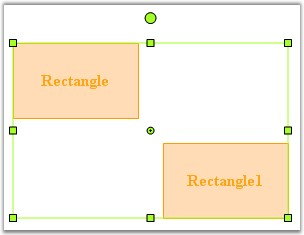

::: {style="DISPLAY: none"}
{#d2h_url_template}{#d2h_package_url style="WIDTH: 0px; DISPLAY: none; HEIGHT: 0px"}
:::

::::: {#nsbanner .d2h_main_nsbanner style="BORDER-BOTTOM: #999999 1px solid; POSITION: relative; PADDING-BOTTOM: 0px; BACKGROUND-COLOR: transparent; PADDING-LEFT: 0px; PADDING-RIGHT: 0px; DISPLAY: none; BORDER-TOP: #999999 1px solid; PADDING-TOP: 0px; LEFT: 0px"}
:::: {#TitleRow .d2h_main_titlerow style="PADDING-BOTTOM: 4px; BACKGROUND-COLOR: transparent; PADDING-LEFT: 22px; WIDTH: 100%; PADDING-RIGHT: 10px; DISPLAY: none; PADDING-TOP: 4px"}
::: {#ienav .d2h_main_ienav style="DISPLAY: none"}
{#D2HPrevious .D2HPreviousEnabled}  {#D2HNext .D2HNextEnabled}
:::
::::
:::::

:::: {#nstext .d2h_main_nstext style="PADDING-BOTTOM: 10px; BACKGROUND-COLOR: transparent; PADDING-LEFT: 22px; PADDING-RIGHT: 10px; HEIGHT: 100%; OVERFLOW: auto; PADDING-TOP: 5px" hasuserbackground="true" valign="bottom"}
::: {#d2h_breadcrumbs .d2h_breadcrumbs}
[Essential Studio User Guide Documentation](ms-xhelp:///?Id=12457748-09e3-4d74-a240-8e049cedf030){.d2h_breadcrumbsNormal}[ \> ]{.d2h_breadcrumbsLinkSeparator}[User Interface Edition](ms-xhelp:///?Id=c29296b7-531c-413b-a0ec-488ca1f7f669){.d2h_breadcrumbsNormal}[ \> ]{.d2h_breadcrumbsLinkSeparator}[Essential ASP.NET](ms-xhelp:///?Id=25c35330-c127-4dad-9a92-ed79dc7261a6){.d2h_breadcrumbsNormal}[ \> ]{.d2h_breadcrumbsLinkSeparator}[Essential Diagram]{.d2h_breadcrumbsContentsOnly}[ \> ]{.d2h_breadcrumbsLinkSeparator}[Concepts and Features](ms-xhelp:///?Id=f9aa55fb-f8cf-43da-a8be-de231dc0d949){.d2h_breadcrumbsNormal}[ \> ]{.d2h_breadcrumbsLinkSeparator}[Customizing Nodes](ms-xhelp:///?Id=6887642a-3dc2-43d2-b390-e5e87128cad1){.d2h_breadcrumbsNormal}
:::

### Grouping[]{style="FONT-SIZE: 9pt"} {#grouping style="tab-stops: 0pt"}

[]{style="FONT-FAMILY: 'Trebuchet MS','sans-serif'; COLOR: #15428b; FONT-SIZE: 9pt"} 

A group is a node that acts as a transparent container for other nodes. A group is a composite node that controls a set of child nodes. The bounding rectangle of a group is the union of the bounds of its children. The group renders itself by iterating through its children and rendering them. Child nodes cannot be selected or manipulated individually. Members of the group are added and removed through the ICompositeNode interface.

 

The below code snippet creates a group with two nodes.

[]{style="FONT-FAMILY: 'Trebuchet MS','sans-serif'; COLOR: #15428b; FONT-SIZE: 9pt"} 

+----------------------------------------------------------------------------------------------------------------------------------------------------------------------------------------------------------------------------------------------------------+
| **[\[C#\]]{style="FONT-FAMILY: 'Courier New'; COLOR: black"}**                                                                                                                                                                                           |
|                                                                                                                                                                                                                                                          |
| []{style="FONT-FAMILY: 'Courier New'; COLOR: black"}                                                                                                                                                                                                     |
|                                                                                                                                                                                                                                                          |
| [//Node 1]{style="FONT-FAMILY: 'Courier New'; COLOR: green"}                                                                                                                                                                                             |
|                                                                                                                                                                                                                                                          |
| [Syncfusion.Windows.Forms.Diagram.[Rectangle]{style="COLOR: teal"} nodeRect = [new]{style="COLOR: blue"} Syncfusion.Windows.Forms.Diagram.[Rectangle]{style="COLOR: teal"}(50, 100, 125, 75);]{style="FONT-FAMILY: 'Courier New'"}                       |
|                                                                                                                                                                                                                                                          |
| [nodeRect.FillStyle.Color = [Color]{style="COLOR: teal"}.FromArgb(255, 223, 189);]{style="FONT-FAMILY: 'Courier New'"}                                                                                                                                   |
|                                                                                                                                                                                                                                                          |
| [nodeRect.LineStyle.LineColor = [Color]{style="COLOR: teal"}.Orange;]{style="FONT-FAMILY: 'Courier New'"}                                                                                                                                                |
|                                                                                                                                                                                                                                                          |
| [Syncfusion.Windows.Forms.Diagram.[Label]{style="COLOR: teal"} lbl = [new]{style="COLOR: blue"} Syncfusion.Windows.Forms.Diagram.[Label]{style="COLOR: teal"}(nodeRect, [\"Rectangle\"]{style="COLOR: maroon"});]{style="FONT-FAMILY: 'Courier New'"}    |
|                                                                                                                                                                                                                                                          |
| [lbl.FontStyle.Size = 12;]{style="FONT-FAMILY: 'Courier New'"}                                                                                                                                                                                           |
|                                                                                                                                                                                                                                                          |
| [lbl.FontStyle.Bold = [true]{style="COLOR: blue"};]{style="FONT-FAMILY: 'Courier New'"}                                                                                                                                                                  |
|                                                                                                                                                                                                                                                          |
| [nodeRect.Labels.Add(lbl);]{style="FONT-FAMILY: 'Courier New'"}                                                                                                                                                                                          |
|                                                                                                                                                                                                                                                          |
| []{style="FONT-FAMILY: 'Courier New'"}                                                                                                                                                                                                                   |
|                                                                                                                                                                                                                                                          |
| [//Node 2]{style="FONT-FAMILY: 'Courier New'; COLOR: green"}                                                                                                                                                                                             |
|                                                                                                                                                                                                                                                          |
| [Syncfusion.Windows.Forms.Diagram.[Rectangle]{style="COLOR: teal"} nodeRect1 = [new]{style="COLOR: blue"} Syncfusion.Windows.Forms.Diagram.[Rectangle]{style="COLOR: teal"}(150, 100, 125, 75);]{style="FONT-FAMILY: 'Courier New'"}                     |
|                                                                                                                                                                                                                                                          |
| [nodeRect1.FillStyle.Color = [Color]{style="COLOR: teal"}.FromArgb(255, 223, 189);]{style="FONT-FAMILY: 'Courier New'"}                                                                                                                                  |
|                                                                                                                                                                                                                                                          |
| [nodeRect1.LineStyle.LineColor = [Color]{style="COLOR: teal"}.Orange;]{style="FONT-FAMILY: 'Courier New'"}                                                                                                                                               |
|                                                                                                                                                                                                                                                          |
| [Syncfusion.Windows.Forms.Diagram.[Label]{style="COLOR: teal"} lbl1 = [new]{style="COLOR: blue"} Syncfusion.Windows.Forms.Diagram.[Label]{style="COLOR: teal"}(nodeRect1, [\"Rectangle1\"]{style="COLOR: maroon"});]{style="FONT-FAMILY: 'Courier New'"} |
|                                                                                                                                                                                                                                                          |
| [lbl1.FontStyle.Size = 12;]{style="FONT-FAMILY: 'Courier New'"}                                                                                                                                                                                          |
|                                                                                                                                                                                                                                                          |
| [lbl1.FontStyle.Bold = [true]{style="COLOR: blue"};]{style="FONT-FAMILY: 'Courier New'"}                                                                                                                                                                 |
|                                                                                                                                                                                                                                                          |
| [nodeRect1.Labels.Add(lbl1);]{style="FONT-FAMILY: 'Courier New'"}                                                                                                                                                                                        |
|                                                                                                                                                                                                                                                          |
| []{style="FONT-FAMILY: 'Courier New'"}                                                                                                                                                                                                                   |
|                                                                                                                                                                                                                                                          |
| [//Grouping Nodes]{style="FONT-FAMILY: 'Courier New'; COLOR: green"}                                                                                                                                                                                     |
|                                                                                                                                                                                                                                                          |
| [Syncfusion.Windows.Forms.Diagram.[Group]{style="COLOR: teal"} grp = [new]{style="COLOR: blue"} [Group]{style="COLOR: teal"}();]{style="FONT-FAMILY: 'Courier New'"}                                                                                     |
|                                                                                                                                                                                                                                                          |
| [grp.AppendChild(nodeRect);]{style="FONT-FAMILY: 'Courier New'"}                                                                                                                                                                                         |
|                                                                                                                                                                                                                                                          |
| [grp.AppendChild(nodeRect1);]{style="FONT-FAMILY: 'Courier New'"}                                                                                                                                                                                        |
|                                                                                                                                                                                                                                                          |
| [this]{style="FONT-FAMILY: 'Courier New'; COLOR: blue"}[.DiagramWebControl1.Model.AppendChild(grp);]{style="FONT-FAMILY: 'Courier New'"}                                                                                                                 |
+----------------------------------------------------------------------------------------------------------------------------------------------------------------------------------------------------------------------------------------------------------+

[]{style="FONT-FAMILY: 'Trebuchet MS','sans-serif'; COLOR: #15428b; FONT-SIZE: 9pt"} 

+--------------------------------------------------------------------------------------------------------------------------------------------------------------------------------------------------------------------------------------------------------------------------------------------+
| **[\[VB.NET\]]{style="FONT-FAMILY: 'Courier New'; COLOR: black"}**                                                                                                                                                                                                                         |
|                                                                                                                                                                                                                                                                                            |
| **[]{style="FONT-FAMILY: 'Courier New'; COLOR: black"}**                                                                                                                                                                                                                                   |
|                                                                                                                                                                                                                                                                                            |
| [\'Node 1]{style="FONT-FAMILY: 'Courier New'; COLOR: green"}                                                                                                                                                                                                                               |
|                                                                                                                                                                                                                                                                                            |
| [Dim]{style="FONT-FAMILY: 'Courier New'; COLOR: blue"}[ nodeRect [As]{style="COLOR: blue"} Syncfusion.Windows.Forms.Diagram.Rectangle = [New]{style="COLOR: blue"} Syncfusion.Windows.Forms.Diagram.Rectangle(50, 100, 125, 75)]{style="FONT-FAMILY: 'Courier New'"}                       |
|                                                                                                                                                                                                                                                                                            |
| [nodeRect.FillStyle.Color = Color.FromArgb(255, 223, 189)]{style="FONT-FAMILY: 'Courier New'"}                                                                                                                                                                                             |
|                                                                                                                                                                                                                                                                                            |
| [nodeRect.LineStyle.LineColor = Color.Orange]{style="FONT-FAMILY: 'Courier New'"}                                                                                                                                                                                                          |
|                                                                                                                                                                                                                                                                                            |
| [Dim ]{style="FONT-FAMILY: 'Courier New'; COLOR: blue"}[lbl [As]{style="COLOR: blue"} Syncfusion.Windows.Forms.Diagram.Label = [New]{style="COLOR: blue"} Syncfusion.Windows.Forms.Diagram.Label(nodeRect, [\"Rectangle\"]{style="COLOR: maroon"})]{style="FONT-FAMILY: 'Courier New'"}    |
|                                                                                                                                                                                                                                                                                            |
| [lbl.FontStyle.Size = 12]{style="FONT-FAMILY: 'Courier New'"}                                                                                                                                                                                                                              |
|                                                                                                                                                                                                                                                                                            |
| [lbl.FontStyle.Bold = [True]{style="COLOR: blue"}]{style="FONT-FAMILY: 'Courier New'"}                                                                                                                                                                                                     |
|                                                                                                                                                                                                                                                                                            |
| [nodeRect.Labels.Add(lbl)]{style="FONT-FAMILY: 'Courier New'"}                                                                                                                                                                                                                             |
|                                                                                                                                                                                                                                                                                            |
| []{style="FONT-FAMILY: 'Courier New'"}                                                                                                                                                                                                                                                     |
|                                                                                                                                                                                                                                                                                            |
| [\'Node 2]{style="FONT-FAMILY: 'Courier New'; COLOR: green"}                                                                                                                                                                                                                               |
|                                                                                                                                                                                                                                                                                            |
| [Dim]{style="FONT-FAMILY: 'Courier New'; COLOR: blue"}[ nodeRect1 [As]{style="COLOR: blue"} Syncfusion.Windows.Forms.Diagram.Rectangle = [New]{style="COLOR: blue"} Syncfusion.Windows.Forms.Diagram.Rectangle(150, 100, 125, 75)]{style="FONT-FAMILY: 'Courier New'"}                     |
|                                                                                                                                                                                                                                                                                            |
| [nodeRect1.FillStyle.Color = Color.FromArgb(255, 223, 189)]{style="FONT-FAMILY: 'Courier New'"}                                                                                                                                                                                            |
|                                                                                                                                                                                                                                                                                            |
| [nodeRect1.LineStyle.LineColor = Color.Orange]{style="FONT-FAMILY: 'Courier New'"}                                                                                                                                                                                                         |
|                                                                                                                                                                                                                                                                                            |
| [Dim]{style="FONT-FAMILY: 'Courier New'; COLOR: blue"}[ lbl1 [As]{style="COLOR: blue"} Syncfusion.Windows.Forms.Diagram.Label = [New]{style="COLOR: blue"} Syncfusion.Windows.Forms.Diagram.Label(nodeRect1, [\"Rectangle1\"]{style="COLOR: maroon"})]{style="FONT-FAMILY: 'Courier New'"} |
|                                                                                                                                                                                                                                                                                            |
| [lbl1.FontStyle.Size = 12]{style="FONT-FAMILY: 'Courier New'"}                                                                                                                                                                                                                             |
|                                                                                                                                                                                                                                                                                            |
| [lbl1.FontStyle.Bold = [True]{style="COLOR: blue"}]{style="FONT-FAMILY: 'Courier New'"}                                                                                                                                                                                                    |
|                                                                                                                                                                                                                                                                                            |
| [nodeRect1.Labels.Add(lbl1)]{style="FONT-FAMILY: 'Courier New'"}                                                                                                                                                                                                                           |
|                                                                                                                                                                                                                                                                                            |
| []{style="FONT-FAMILY: 'Courier New'"}                                                                                                                                                                                                                                                     |
|                                                                                                                                                                                                                                                                                            |
| [\'Grouping Nodes]{style="FONT-FAMILY: 'Courier New'; COLOR: green"}                                                                                                                                                                                                                       |
|                                                                                                                                                                                                                                                                                            |
| [Dim]{style="FONT-FAMILY: 'Courier New'; COLOR: blue"}[ grp [As]{style="COLOR: blue"} Syncfusion.Windows.Forms.Diagram.Group = [New]{style="COLOR: blue"} Syncfusion.Windows.Forms.Diagram.Group()]{style="FONT-FAMILY: 'Courier New'"}                                                    |
|                                                                                                                                                                                                                                                                                            |
| [grp.AppendChild(nodeRect)]{style="FONT-FAMILY: 'Courier New'"}                                                                                                                                                                                                                            |
|                                                                                                                                                                                                                                                                                            |
| [grp.AppendChild(nodeRect1)]{style="FONT-FAMILY: 'Courier New'"}                                                                                                                                                                                                                           |
|                                                                                                                                                                                                                                                                                            |
| [Me]{style="FONT-FAMILY: 'Courier New'; COLOR: blue"}[.DiagramWebControl1.Model.AppendChild(grp)]{style="FONT-FAMILY: 'Courier New'"}                                                                                                                                                      |
+--------------------------------------------------------------------------------------------------------------------------------------------------------------------------------------------------------------------------------------------------------------------------------------------+

[]{style="FONT-FAMILY: 'Trebuchet MS','sans-serif'; COLOR: #15428b; FONT-SIZE: 9pt"} 

{border="0"}

[]{style="FONT-FAMILY: 'Trebuchet MS','sans-serif'; COLOR: #15428b; FONT-SIZE: 9pt"} 

Figure 16: Selecting a Group in a Diagram

 

[]{#related-topics}
::::
