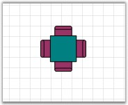

::: {style="DISPLAY: none"}
{#d2h_url_template}{#d2h_package_url style="WIDTH: 0px; DISPLAY: none; HEIGHT: 0px"}
:::

::::: {#nsbanner .d2h_main_nsbanner style="BORDER-BOTTOM: #999999 1px solid; POSITION: relative; PADDING-BOTTOM: 0px; BACKGROUND-COLOR: transparent; PADDING-LEFT: 0px; PADDING-RIGHT: 0px; DISPLAY: none; BORDER-TOP: #999999 1px solid; PADDING-TOP: 0px; LEFT: 0px"}
:::: {#TitleRow .d2h_main_titlerow style="PADDING-BOTTOM: 4px; BACKGROUND-COLOR: transparent; PADDING-LEFT: 22px; WIDTH: 100%; PADDING-RIGHT: 10px; DISPLAY: none; PADDING-TOP: 4px"}
::: {#ienav .d2h_main_ienav style="DISPLAY: none"}
{#D2HPrevious .D2HPreviousEnabled}  {#D2HNext .D2HNextEnabled}
:::
::::
:::::

:::: {#nstext .d2h_main_nstext style="PADDING-BOTTOM: 10px; BACKGROUND-COLOR: transparent; PADDING-LEFT: 22px; PADDING-RIGHT: 10px; HEIGHT: 100%; OVERFLOW: auto; PADDING-TOP: 5px" hasuserbackground="true" valign="bottom"}
::: {#d2h_breadcrumbs .d2h_breadcrumbs}
[Essential Studio User Guide Documentation](ms-xhelp:///?Id=12457748-09e3-4d74-a240-8e049cedf030){.d2h_breadcrumbsNormal}[ \> ]{.d2h_breadcrumbsLinkSeparator}[User Interface Edition](ms-xhelp:///?Id=c29296b7-531c-413b-a0ec-488ca1f7f669){.d2h_breadcrumbsNormal}[ \> ]{.d2h_breadcrumbsLinkSeparator}[Essential Windows](ms-xhelp:///?Id=e60759d8-47a4-4570-9d7a-16a68d63f2ea){.d2h_breadcrumbsNormal}[ \> ]{.d2h_breadcrumbsLinkSeparator}[Essential Diagram]{.d2h_breadcrumbsContentsOnly}[ \> ]{.d2h_breadcrumbsLinkSeparator}[Concepts And Features](ms-xhelp:///?Id=008cec4b-5177-4859-8616-c062751d8fb6){.d2h_breadcrumbsNormal}[ \> ]{.d2h_breadcrumbsLinkSeparator}[Advanced Features](ms-xhelp:///?Id=f661be94-4825-49a2-ac75-df5e8495098e){.d2h_breadcrumbsNormal}
:::

### Grouping {#grouping style="tab-stops: 0pt"}

[]{style="FONT-FAMILY: 'Trebuchet MS','sans-serif'; COLOR: #15428b; FONT-SIZE: 9pt"} 

A group is a node that acts as a transparent container for other nodes. A group is a composite node that controls a set of child nodes. The bounding rectangle of a group is the union of the bounds of its children. The group renders itself by iterating through its children and rendering them. Child nodes cannot be selected or manipulated individually. Members of the group are added and removed through the ICompositeNode interface.

 

There are two ways available to add a Group in diagram control:

 

1\. Add the children to the group manually with the help of Group class methods. The below code snippet creates a group with two nodes.

[]{style="FONT-FAMILY: 'Trebuchet MS','sans-serif'; COLOR: #15428b; FONT-SIZE: 9pt"} 

+-----------------------------------------------------------------------------------------------------------------------------------------------------------------------------------------------------------------------------+
| **[\[C#\]]{style="FONT-FAMILY: 'Courier New'; COLOR: black; FONT-SIZE: 9pt"}**                                                                                                                                              |
|                                                                                                                                                                                                                             |
| []{style="FONT-FAMILY: 'Courier New'; FONT-SIZE: 9pt"}                                                                                                                                                                      |
|                                                                                                                                                                                                                             |
| [//Node 1]{style="FONT-FAMILY: 'Courier New'; COLOR: green; FONT-SIZE: 9pt"}                                                                                                                                                |
|                                                                                                                                                                                                                             |
| []{style="FONT-FAMILY: 'Courier New'; COLOR: green; FONT-SIZE: 9pt"}                                                                                                                                                        |
|                                                                                                                                                                                                                             |
| [Syncfusion.Windows.Forms.Diagram.Rectangle nodeRect = [new]{style="COLOR: blue"} Syncfusion.Windows.Forms.Diagram.Rectangle(50, 100, 125, 75);]{style="FONT-FAMILY: 'Courier New'; FONT-SIZE: 9pt"}                        |
|                                                                                                                                                                                                                             |
| [nodeRect.FillStyle.Color = Color.FromArgb(255, 223, 189);]{style="FONT-FAMILY: 'Courier New'; FONT-SIZE: 9pt"}                                                                                                             |
|                                                                                                                                                                                                                             |
| [nodeRect.LineStyle.LineColor = Color.Orange;]{style="FONT-FAMILY: 'Courier New'; FONT-SIZE: 9pt"}                                                                                                                          |
|                                                                                                                                                                                                                             |
| [Syncfusion.Windows.Forms.Diagram.Label lbl = [new]{style="COLOR: blue"} Syncfusion.Windows.Forms.Diagram.Label(nodeRect, [\"Rectangle\"]{style="COLOR: #a31515"});]{style="FONT-FAMILY: 'Courier New'; FONT-SIZE: 9pt"}    |
|                                                                                                                                                                                                                             |
| [lbl.FontStyle.Size = 12;]{style="FONT-FAMILY: 'Courier New'; FONT-SIZE: 9pt"}                                                                                                                                              |
|                                                                                                                                                                                                                             |
| [lbl.FontStyle.Bold = [true]{style="COLOR: blue"};]{style="FONT-FAMILY: 'Courier New'; FONT-SIZE: 9pt"}                                                                                                                     |
|                                                                                                                                                                                                                             |
| [nodeRect.Labels.Add(lbl);]{style="FONT-FAMILY: 'Courier New'; FONT-SIZE: 9pt"}                                                                                                                                             |
|                                                                                                                                                                                                                             |
| []{style="FONT-FAMILY: 'Courier New'; FONT-SIZE: 9pt"}                                                                                                                                                                      |
|                                                                                                                                                                                                                             |
| [//Node 2]{style="FONT-FAMILY: 'Courier New'; COLOR: green; FONT-SIZE: 9pt"}                                                                                                                                                |
|                                                                                                                                                                                                                             |
| [Syncfusion.Windows.Forms.Diagram.Rectangle nodeRect1 = [new]{style="COLOR: blue"} Syncfusion.Windows.Forms.Diagram.Rectangle(150, 100, 125, 75);]{style="FONT-FAMILY: 'Courier New'; FONT-SIZE: 9pt"}                      |
|                                                                                                                                                                                                                             |
| [nodeRect1.FillStyle.Color = Color.FromArgb(255, 223, 189);]{style="FONT-FAMILY: 'Courier New'; FONT-SIZE: 9pt"}                                                                                                            |
|                                                                                                                                                                                                                             |
| [nodeRect1.LineStyle.LineColor = Color.Orange;]{style="FONT-FAMILY: 'Courier New'; FONT-SIZE: 9pt"}                                                                                                                         |
|                                                                                                                                                                                                                             |
| [Syncfusion.Windows.Forms.Diagram.Label lbl1 = [new]{style="COLOR: blue"} Syncfusion.Windows.Forms.Diagram.Label(nodeRect1, [\"Rectangle1\"]{style="COLOR: #a31515"});]{style="FONT-FAMILY: 'Courier New'; FONT-SIZE: 9pt"} |
|                                                                                                                                                                                                                             |
| [lbl1.FontStyle.Size = 12;]{style="FONT-FAMILY: 'Courier New'; FONT-SIZE: 9pt"}                                                                                                                                             |
|                                                                                                                                                                                                                             |
| [lbl1.FontStyle.Bold = [true]{style="COLOR: blue"};]{style="FONT-FAMILY: 'Courier New'; FONT-SIZE: 9pt"}                                                                                                                    |
|                                                                                                                                                                                                                             |
| [nodeRect1.Labels.Add(lbl1);]{style="FONT-FAMILY: 'Courier New'; FONT-SIZE: 9pt"}                                                                                                                                           |
|                                                                                                                                                                                                                             |
| []{style="FONT-FAMILY: 'Courier New'; FONT-SIZE: 9pt"}                                                                                                                                                                      |
|                                                                                                                                                                                                                             |
| [//Grouping Nodes]{style="FONT-FAMILY: 'Courier New'; COLOR: green; FONT-SIZE: 9pt"}                                                                                                                                        |
|                                                                                                                                                                                                                             |
| [Syncfusion.Windows.Forms.Diagram.Group grp = [new]{style="COLOR: blue"} Group();]{style="FONT-FAMILY: 'Courier New'; FONT-SIZE: 9pt"}                                                                                      |
|                                                                                                                                                                                                                             |
| [grp.AppendChild(nodeRect);]{style="FONT-FAMILY: 'Courier New'; FONT-SIZE: 9pt"}                                                                                                                                            |
|                                                                                                                                                                                                                             |
| [grp.AppendChild(nodeRect1);]{style="FONT-FAMILY: 'Courier New'; FONT-SIZE: 9pt"}                                                                                                                                           |
|                                                                                                                                                                                                                             |
| [this]{style="FONT-FAMILY: 'Courier New'; COLOR: blue; FONT-SIZE: 9pt"}[.DiagramWebControl1.Model.AppendChild(grp);]{style="FONT-FAMILY: 'Courier New'; FONT-SIZE: 9pt"}                                                    |
+-----------------------------------------------------------------------------------------------------------------------------------------------------------------------------------------------------------------------------+

[]{style="FONT-FAMILY: 'Trebuchet MS','sans-serif'; COLOR: #15428b; FONT-SIZE: 9pt"} 

2\. Diagram control support two direct methods for Grouping and UnGrouping as follows.

**[]{style="FONT-FAMILY: 'Trebuchet MS','sans-serif'; COLOR: #15428b; FONT-SIZE: 9pt"}** 

+----------------------------------------------------------------------------------------------------------------------------------------------------------------------------------------------------------------------+
| **[\[C#\]]{style="FONT-FAMILY: 'Courier New'; COLOR: black; FONT-SIZE: 9pt"}**                                                                                                                                       |
|                                                                                                                                                                                                                      |
| []{style="FONT-FAMILY: 'Courier New'; FONT-SIZE: 9pt"}                                                                                                                                                               |
|                                                                                                                                                                                                                      |
| [this]{style="FONT-FAMILY: 'Courier New'; COLOR: blue; FONT-SIZE: 9pt"}[.diagram1.Controller.Group();     [//Method to Group the nodes]{style="COLOR: green"}]{style="FONT-FAMILY: 'Courier New'; FONT-SIZE: 9pt"}   |
|                                                                                                                                                                                                                      |
| [this]{style="FONT-FAMILY: 'Courier New'; COLOR: blue; FONT-SIZE: 9pt"}[.diagram1.Controller.UnGroup();   [//Method to UnGroup the nodes]{style="COLOR: green"}]{style="FONT-FAMILY: 'Courier New'; FONT-SIZE: 9pt"} |
+----------------------------------------------------------------------------------------------------------------------------------------------------------------------------------------------------------------------+

[]{style="FONT-FAMILY: 'Courier New'"} 

How to access the child nodes in a Group, and how to delete / remove the node

**[]{style="FONT-FAMILY: 'Trebuchet MS','sans-serif'; COLOR: #15428b"}** 

The first step is to check whether the node is a Group.

[]{style="FONT-FAMILY: 'Trebuchet MS','sans-serif'; COLOR: #15428b; FONT-SIZE: 9pt"} 

+------------------------------------------------------------------------------------------------------------------------------------+
| **[\[C#\]]{style="FONT-FAMILY: 'Courier New'; COLOR: black"}**                                                                     |
|                                                                                                                                    |
| **[]{style="FONT-FAMILY: 'Courier New'; COLOR: black"}**                                                                           |
|                                                                                                                                    |
| [if]{style="FONT-FAMILY: 'Courier New'; COLOR: blue"}[ (node [is]{style="COLOR: blue"} Group)]{style="FONT-FAMILY: 'Courier New'"} |
|                                                                                                                                    |
| [{]{style="FONT-FAMILY: 'Courier New'"}                                                                                            |
|                                                                                                                                    |
| [    [// Your code here]{style="COLOR: green"}]{style="FONT-FAMILY: 'Courier New'"}                                                |
|                                                                                                                                    |
| [}]{style="FONT-FAMILY: 'Courier New'"}                                                                                            |
+------------------------------------------------------------------------------------------------------------------------------------+

[]{style="FONT-FAMILY: 'Courier New'"} 

If the node is a Group, then following are some special methods.

[]{style="FONT-FAMILY: 'Trebuchet MS','sans-serif'; COLOR: #15428b; FONT-SIZE: 9pt"} 

+---------------------------------------------------------------------------------------------------------------------------------------------------------------------------------------------+
| **[\[C#\]]{style="FONT-FAMILY: 'Courier New'; COLOR: black"}**                                                                                                                              |
|                                                                                                                                                                                             |
| []{style="FONT-FAMILY: 'Courier New'"}                                                                                                                                                      |
|                                                                                                                                                                                             |
| [public]{style="FONT-FAMILY: 'Courier New'; COLOR: blue"}[ Node GetChild([int]{style="COLOR: blue"} childIndex);]{style="FONT-FAMILY: 'Courier New'"}                                       |
|                                                                                                                                                                                             |
| [public]{style="FONT-FAMILY: 'Courier New'; COLOR: blue"}[ Node GetChildByName([string]{style="COLOR: blue"} childName);]{style="FONT-FAMILY: 'Courier New'"}                               |
|                                                                                                                                                                                             |
| [public]{style="FONT-FAMILY: 'Courier New'; COLOR: blue"}[ [void]{style="COLOR: blue"} RemoveAllChildren();]{style="FONT-FAMILY: 'Courier New'"}                                            |
|                                                                                                                                                                                             |
| [public]{style="FONT-FAMILY: 'Courier New'; COLOR: blue"}[ [bool]{style="COLOR: blue"} RemoveChild([int]{style="COLOR: blue"} childIndex);]{style="FONT-FAMILY: 'Courier New'"}             |
|                                                                                                                                                                                             |
| [public]{style="FONT-FAMILY: 'Courier New'; COLOR: blue"}[ [bool]{style="COLOR: blue"} RemoveChild(Node nodeToRemove);]{style="FONT-FAMILY: 'Courier New'"}                                 |
|                                                                                                                                                                                             |
| [public]{style="FONT-FAMILY: 'Courier New'; COLOR: blue"}[ [void]{style="COLOR: blue"} InsertChild(Node child, [int]{style="COLOR: blue"} childIndex);]{style="FONT-FAMILY: 'Courier New'"} |
+---------------------------------------------------------------------------------------------------------------------------------------------------------------------------------------------+

[]{style="FONT-FAMILY: 'Trebuchet MS','sans-serif'; COLOR: #15428b; FONT-SIZE: 9pt"} 

Also, Group has an int **ChildCount** property, which returns the child count in a Group. To delete the first element in a Group, use the below code.

[]{style="FONT-FAMILY: 'Trebuchet MS','sans-serif'; COLOR: #15428b; FONT-SIZE: 9pt"} 

+-------------------------------------------------------------------------------------------------------------------------------------------------------------+
| **[\[C#\]]{style="FONT-FAMILY: 'Courier New'; COLOR: black"}**                                                                                              |
|                                                                                                                                                             |
| []{style="FONT-FAMILY: 'Courier New'"}                                                                                                                      |
|                                                                                                                                                             |
| [foreach]{style="FONT-FAMILY: 'Courier New'; COLOR: blue"}[ (Node node [in]{style="COLOR: blue"} Diagram1.Model.Nodes)]{style="FONT-FAMILY: 'Courier New'"} |
|                                                                                                                                                             |
| [{]{style="FONT-FAMILY: 'Courier New'"}                                                                                                                     |
|                                                                                                                                                             |
| [    [if]{style="COLOR: blue"} (node [is]{style="COLOR: blue"} Group) [// Check for Group]{style="COLOR: green"}]{style="FONT-FAMILY: 'Courier New'"}       |
|                                                                                                                                                             |
| [    {]{style="FONT-FAMILY: 'Courier New'"}                                                                                                                 |
|                                                                                                                                                             |
| [        Group groupNode = (Group)node;]{style="FONT-FAMILY: 'Courier New'"}                                                                                |
|                                                                                                                                                             |
| [        [if]{style="COLOR: blue"} (groupNode.ChildCount \> 0) [// Group has sub nodes]{style="COLOR: green"}]{style="FONT-FAMILY: 'Courier New'"}          |
|                                                                                                                                                             |
| [        {]{style="FONT-FAMILY: 'Courier New'"}                                                                                                             |
|                                                                                                                                                             |
| [            Node nodeToRemove = groupNode.GetChild(0);]{style="FONT-FAMILY: 'Courier New'"}                                                                |
|                                                                                                                                                             |
| [            groupNode.RemoveChild(nodeToRemove);]{style="FONT-FAMILY: 'Courier New'"}                                                                      |
|                                                                                                                                                             |
| []{style="FONT-FAMILY: 'Courier New'"}                                                                                                                      |
|                                                                                                                                                             |
| [        }]{style="FONT-FAMILY: 'Courier New'"}                                                                                                             |
|                                                                                                                                                             |
| [    }]{style="FONT-FAMILY: 'Courier New'"}                                                                                                                 |
|                                                                                                                                                             |
| [}]{style="FONT-FAMILY: 'Courier New'"}                                                                                                                     |
+-------------------------------------------------------------------------------------------------------------------------------------------------------------+

[]{style="FONT-FAMILY: 'Trebuchet MS','sans-serif'; COLOR: #15428b; FONT-SIZE: 9pt"} 

{border="0"}

Figure 85: Group Node

More:

[ ]{#related-topics}

[{border="0" align="absMiddle"}Positioning nodes in Group](ms-xhelp:///?Id=839e2806-47b6-4a70-a51c-daf25b80c8dd){style="TEXT-DECORATION: none"}
::::
