::: {style="DISPLAY: none"}
{#d2h_url_template}{#d2h_package_url style="WIDTH: 0px; DISPLAY: none; HEIGHT: 0px"}
:::

:::::::::::: {.d2h_secondary_topic style="PADDING-BOTTOM: 10pt; MARGIN: 0pt; PADDING-LEFT: 0pt; PADDING-RIGHT: 0pt; PADDING-TOP: 0pt"}
##### Grouping {#grouping style="tab-stops: 0pt"}

[]{style="FONT-FAMILY: 'Trebuchet MS','sans-serif'; COLOR: #15428b; FONT-SIZE: 9pt"} 

A Group represents a collection of records that belong to a category. The Grid Grouping control allows the user to group the data by one or more columns. When grouping is applied, the data will be organized into a hierarchical structure based on the matching field values. The records having identical values in the grouped column will be combined to form a group. Each group is identified by its GroupCaptionSection that can be expanded to bring the underlying records into view. The GroupCaptionSection carries the information about a particular group like the group name, number of items(records) in the group, etc. It also contains plus / minus buttons that allows the user to expand / collapse the groups individually. By default, a grid table has one group.

 

**GroupedColumns Collection**

 

The **GroupedColumns** collection defines the fields to group by and the sort order. The collection can have multiple entries resulting in nested groups. The GroupedColumns collection of grouping grid can be accessed via its TableDescriptor. The collection consists of various properties, methods and events that allows the user to manage the elements in it.

[]{style="FONT-FAMILY: 'Verdana','sans-serif'; FONT-SIZE: 8pt"} 

**Adding Data Groups**

 

**[Simple Grouping]{style="FONT-FAMILY: 'Segoe UI','sans-serif'"}**

**[]{style="FONT-FAMILY: 'Verdana','sans-serif'; COLOR: #4a5c8c; FONT-SIZE: 8pt"}** 

The data can be grouped by adding the column name to the **TableDesriptor.GroupedColumns** property.

[]{style="FONT-FAMILY: 'Trebuchet MS','sans-serif'; COLOR: #15428b; FONT-SIZE: 9pt"} 

+---------------------------------------------------------------------------------------------------------------------------------------------------------------------------------------------+
| **[\[C#\]]{style="FONT-FAMILY: 'Courier New'; COLOR: black"}**                                                                                                                              |
|                                                                                                                                                                                             |
| []{style="FONT-FAMILY: 'Courier New'; COLOR: black"}                                                                                                                                        |
|                                                                                                                                                                                             |
| [this]{style="FONT-FAMILY: 'Courier New'; COLOR: blue"}[.gridGroupingControl1.TableDescriptor.GroupedColumns.Add([\"Title\"]{style="COLOR: #a31515"});]{style="FONT-FAMILY: 'Courier New'"} |
+---------------------------------------------------------------------------------------------------------------------------------------------------------------------------------------------+

[]{style="FONT-FAMILY: 'Trebuchet MS','sans-serif'; COLOR: #15428b; FONT-SIZE: 9pt"} 

+------------------------------------------------------------------------------------------------------------------------------------------------------------------------------------------+
| **[\[VB.NET\]]{style="FONT-FAMILY: 'Courier New'; COLOR: black"}**                                                                                                                       |
|                                                                                                                                                                                          |
| []{style="FONT-FAMILY: 'Courier New'; COLOR: black"}                                                                                                                                     |
|                                                                                                                                                                                          |
| [Me]{style="FONT-FAMILY: 'Courier New'; COLOR: blue"}[.gridGroupingControl1.TableDescriptor.GroupedColumns.Add([\"Title\"]{style="COLOR: #a31515"})]{style="FONT-FAMILY: 'Courier New'"} |
+------------------------------------------------------------------------------------------------------------------------------------------------------------------------------------------+

[]{style="FONT-FAMILY: 'Trebuchet MS','sans-serif'; COLOR: #15428b; FONT-SIZE: 9pt"} 

The below grid displays the data columns from the **Employees** Table grouped by the values of **Title** field.

[]{style="FONT-FAMILY: 'Trebuchet MS','sans-serif'; COLOR: #15428b; FONT-SIZE: 9pt"} 

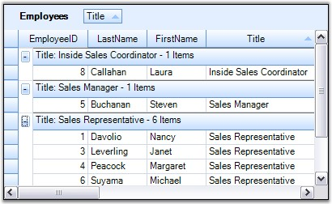{border="0"}

[]{style="FONT-FAMILY: 'Trebuchet MS','sans-serif'; COLOR: #15428b; FONT-SIZE: 9pt"} 

*[Figure ]{style="FONT-SIZE: 9pt"}[268]{style="FONT-SIZE: 9pt"}[: ListSortDirection]{style="FONT-SIZE: 9pt"}*

**[]{style="FONT-FAMILY: 'Trebuchet MS','sans-serif'; COLOR: #15428b; FONT-SIZE: 9pt"}** 

By default, the grouping of a column sorts the records in the ascending order of their GroupedColumn values. It is possible to specify the sort order while grouping. The code below arrange the data in the descending order of their Title field values.

[]{style="FONT-FAMILY: 'Trebuchet MS','sans-serif'; COLOR: #15428b; FONT-SIZE: 9pt"} 

+-----------------------------------------------------------------------------------------------------------------------------------------------------------------------------------------------------------------------------------------------------+
| **[\[C#\]]{style="FONT-FAMILY: 'Courier New'; COLOR: black"}**                                                                                                                                                                                      |
|                                                                                                                                                                                                                                                     |
| []{style="FONT-FAMILY: 'Courier New'; COLOR: black"}                                                                                                                                                                                                |
|                                                                                                                                                                                                                                                     |
| [this]{style="FONT-FAMILY: 'Courier New'; COLOR: blue"}[.gridGroupingControl1.TableDescriptor.GroupedColumns.Add([\"Title\"]{style="COLOR: #a31515"}, [ListSortDirection]{style="COLOR: #2b91af"}.Descending);]{style="FONT-FAMILY: 'Courier New'"} |
+-----------------------------------------------------------------------------------------------------------------------------------------------------------------------------------------------------------------------------------------------------+

[]{style="FONT-FAMILY: 'Trebuchet MS','sans-serif'; COLOR: #15428b; FONT-SIZE: 9pt"} 

+------------------------------------------------------------------------------------------------------------------------------------------------------------------------------------------------------------------------+
| **[\[VB.NET\]]{style="FONT-FAMILY: 'Courier New'; COLOR: black"}**                                                                                                                                                     |
|                                                                                                                                                                                                                        |
| []{style="FONT-FAMILY: 'Courier New'; COLOR: black"}                                                                                                                                                                   |
|                                                                                                                                                                                                                        |
| [Me]{style="FONT-FAMILY: 'Courier New'; COLOR: blue"}[.gridGroupingControl1.TableDescriptor.GroupedColumns.Add([\"Title\"]{style="COLOR: #a31515"}, ListSortDirection.Descending)]{style="FONT-FAMILY: 'Courier New'"} |
+------------------------------------------------------------------------------------------------------------------------------------------------------------------------------------------------------------------------+

[]{style="FONT-FAMILY: 'Trebuchet MS','sans-serif'; COLOR: #15428b; FONT-SIZE: 9pt"} 

The below screenshot reflects this process.

[]{style="FONT-FAMILY: 'Trebuchet MS','sans-serif'; COLOR: #15428b; FONT-SIZE: 9pt"} 

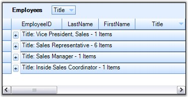{border="0"}

[]{style="FONT-FAMILY: 'Trebuchet MS','sans-serif'; COLOR: #15428b; FONT-SIZE: 9pt"} 

*[Figure ]{style="FONT-SIZE: 9pt"}[269]{style="FONT-SIZE: 9pt"}[: Nested Tables Grouping]{style="FONT-SIZE: 9pt"}*

**[]{style="FONT-FAMILY: 'Trebuchet MS','sans-serif'; COLOR: #15428b; FONT-SIZE: 9pt"}** 

When multiple tables are used in nested manner, a child table can also be grouped by getting access to the GroupedColumns property of the desired ChildTableDescriptor. The code below shows this process.

[]{style="FONT-FAMILY: 'Trebuchet MS','sans-serif'; COLOR: #15428b; FONT-SIZE: 9pt"} 

+------------------------------------------------------------------------------------------------------------------------------------------------------------------------------------------------------------------------------------------------------------------------------------------------+
| **[\[C#\]]{style="FONT-FAMILY: 'Courier New'; COLOR: black"}**                                                                                                                                                                                                                                 |
|                                                                                                                                                                                                                                                                                                |
| []{style="FONT-FAMILY: 'Courier New'; COLOR: green"}                                                                                                                                                                                                                                           |
|                                                                                                                                                                                                                                                                                                |
| [this]{style="FONT-FAMILY: 'Courier New'; COLOR: blue"}[.gridGroupingControl1.TableDescriptor.Relations\[0\].ChildTableDescriptor.GroupedColumns.Add([\"CategoryName\"]{style="COLOR: #a31515"}, [ListSortDirection]{style="COLOR: #2b91af"}.Descending);]{style="FONT-FAMILY: 'Courier New'"} |
+------------------------------------------------------------------------------------------------------------------------------------------------------------------------------------------------------------------------------------------------------------------------------------------------+

[]{style="FONT-FAMILY: 'Trebuchet MS','sans-serif'; COLOR: #15428b; FONT-SIZE: 9pt"} 

+-----------------------------------------------------------------------------------------------------------------------------------------------------------------------------------------------------------------------------------------------------------------+
| **[\[VB.NET\]]{style="FONT-FAMILY: 'Courier New'; COLOR: black"}**                                                                                                                                                                                              |
|                                                                                                                                                                                                                                                                 |
| []{style="FONT-FAMILY: 'Courier New'; COLOR: green"}                                                                                                                                                                                                            |
|                                                                                                                                                                                                                                                                 |
| [Me]{style="FONT-FAMILY: 'Courier New'; COLOR: blue"}[.gridGroupingControl1.TableDescriptor.Relations(0).ChildTableDescriptor.GroupedColumns.Add([\"CategoryName\"]{style="COLOR: #a31515"}, ListSortDirection.Descending)]{style="FONT-FAMILY: 'Courier New'"} |
+-----------------------------------------------------------------------------------------------------------------------------------------------------------------------------------------------------------------------------------------------------------------+

[]{style="FONT-FAMILY: 'Trebuchet MS','sans-serif'; COLOR: #15428b; FONT-SIZE: 9pt"} 

::: {style="BORDER-BOTTOM: windowtext 1pt solid; BORDER-LEFT: medium none; PADDING-BOTTOM: 1pt; MARGIN-TOP: 9pt; PADDING-LEFT: 0pt; PADDING-RIGHT: 0pt; MARGIN-BOTTOM: 9pt; BORDER-TOP: windowtext 1pt solid; BORDER-RIGHT: medium none; PADDING-TOP: 1pt"}
{border="0"}Note: For more details, refer the following browser sample:

\<Install Location\>\\Syncfusion\\EssentialStudio\\\[Version Number\]\\Windows\\Grid.Grouping.Windows\\Samples\\2.0\\Grouping\\Grouping Demo
:::

[]{style="FONT-FAMILY: 'Trebuchet MS','sans-serif'; COLOR: #15428b; FONT-SIZE: 9pt"} 

[]{style="FONT-FAMILY: 'Trebuchet MS','sans-serif'; COLOR: #15428b; FONT-SIZE: 9pt"} 

Multi Column Grouping

**[]{style="COLOR: #4a5c8c; FONT-SIZE: 8pt"}** 

Grid Grouping control provides inbuilt support to group the data by more than one column. It is as simple as adding the column names to the GroupedColumns collection. With multicolumn grouping, the grouping grid organizes the data in a hierarchical structure showing groups in different levels. In the below image, you see the Employees data grouped by Title and Country columns.

[]{style="FONT-FAMILY: 'Trebuchet MS','sans-serif'; COLOR: #15428b; FONT-SIZE: 9pt"} 

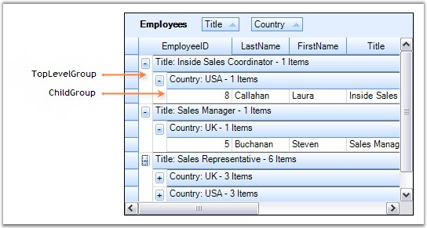{border="0"}

[]{style="FONT-FAMILY: 'Trebuchet MS','sans-serif'; COLOR: #15428b; FONT-SIZE: 9pt"} 

*[Figure ]{style="FONT-SIZE: 9pt"}[270]{style="FONT-SIZE: 9pt"}[: Multi Column Grouping]{style="FONT-SIZE: 9pt"}*

**[]{style="COLOR: navy; FONT-SIZE: 9pt"}** 

::: {style="BORDER-BOTTOM: windowtext 1pt solid; BORDER-LEFT: medium none; PADDING-BOTTOM: 1pt; MARGIN-TOP: 9pt; PADDING-LEFT: 0pt; PADDING-RIGHT: 0pt; MARGIN-BOTTOM: 9pt; BORDER-TOP: windowtext 1pt solid; BORDER-RIGHT: medium none; PADDING-TOP: 1pt"}
[{border="0"}]{style="COLOR: navy"}Note: For more details, refer the following browser sample:

\<Install Location\>\\Syncfusion\\EssentialStudio\\\[Version Number\]\\Windows\\Grid.Grouping.Windows\\Samples\\2.0\\Grouping\\Multi Column Grouping Demo
:::

[]{style="FONT-FAMILY: 'Trebuchet MS','sans-serif'; COLOR: #15428b; FONT-SIZE: 9pt"} 

Grouping Through Designer

[]{style="FONT-FAMILY: 'Verdana','sans-serif'; COLOR: #4a5c8c; FONT-SIZE: 8pt"} 

[The Grouping can also be done at design time. After binding the dataset to the grouping grid, open the TableDescriptor node in the property grid of the Grid Grouping control. In that, accessing the GroupedColumns property will open the SortColumnDescriptorCollection Editor. Clicking the Add button will add an existing column from the dataset. By using the drop down Name, you can change the column by which you want to group the table data. You can also specify the sort order for that column using the SortDirection property.]{style="FONT-SIZE: 9pt"}

[]{style="FONT-SIZE: 9pt"} 

[The below image depicts this process.]{style="FONT-SIZE: 9pt"}

[]{style="FONT-FAMILY: 'Trebuchet MS','sans-serif'; COLOR: #15428b; FONT-SIZE: 9pt"} 

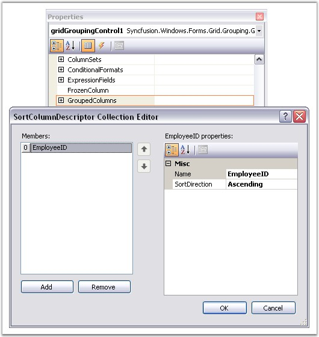{border="0"}

**[]{style="FONT-FAMILY: 'Segoe UI','sans-serif'; COLOR: #15428b; FONT-SIZE: 9pt"}** 

*[Figure ]{style="FONT-SIZE: 9pt"}[271]{style="FONT-SIZE: 9pt"}[: Design Time Grouping]{style="FONT-SIZE: 9pt"}*

[]{style="FONT-FAMILY: 'Trebuchet MS','sans-serif'; COLOR: #15428b; FONT-SIZE: 9pt"} 

Using GroupDropArea

 

The table data can also be grouped simply by dragging the desired column header and dropping it into the GroupDropArea. Removing the column header from the drop area will ungroup the data. You can also be able to change the grouping order by a simple drag and drop action on the column headers.

 

For more information on GroupDropArea, refer [GroupDropArea]{.UGHyperlink}.

[]{style="FONT-FAMILY: 'Trebuchet MS','sans-serif'; COLOR: #15428b; FONT-SIZE: 9pt"} 

Preventing a Column from Grouping

**[]{style="FONT-FAMILY: 'Trebuchet MS','sans-serif'; COLOR: #15428b"}** 

To disallow a column being grouped by, the **AllowGroupByColumn** property should be set to False for that column. This property determines whether the grid can be grouped by a column when the user drags the column to the GroupDropArea.

[]{style="FONT-SIZE: 8pt"} 

+----------------------------------------------------------------------------------------------------------------------------------------------------------------------------------------------------+
| **[\[C#\]]{style="FONT-FAMILY: 'Courier New'; COLOR: black"}**                                                                                                                                     |
|                                                                                                                                                                                                    |
| []{style="FONT-FAMILY: 'Courier New'; COLOR: black"}                                                                                                                                               |
|                                                                                                                                                                                                    |
| [this]{style="FONT-FAMILY: 'Courier New'; COLOR: blue"}[.gridGroupingControl1.TableDescriptor.Columns\[0\].AllowGroupByColumn = [false]{style="COLOR: blue"};]{style="FONT-FAMILY: 'Courier New'"} |
+----------------------------------------------------------------------------------------------------------------------------------------------------------------------------------------------------+

[]{style="FONT-FAMILY: 'Trebuchet MS','sans-serif'; COLOR: #15428b; FONT-SIZE: 9pt"} 

+-----------------------------------------------------------------------------------------------------------------------------------------------------------------------------------------------+
| **[\[VB.NET\]]{style="FONT-FAMILY: 'Courier New'; COLOR: black"}**                                                                                                                            |
|                                                                                                                                                                                               |
| []{style="FONT-FAMILY: 'Courier New'; COLOR: black"}                                                                                                                                          |
|                                                                                                                                                                                               |
| [Me]{style="FONT-FAMILY: 'Courier New'; COLOR: blue"}[.gridGroupingControl1.TableDescriptor.Columns(0).AllowGroupByColumn = [False]{style="COLOR: blue"}]{style="FONT-FAMILY: 'Courier New'"} |
+-----------------------------------------------------------------------------------------------------------------------------------------------------------------------------------------------+

[]{style="FONT-FAMILY: 'Trebuchet MS','sans-serif'; COLOR: #15428b; FONT-SIZE: 9pt"} 

Clearing Groups

[]{style="FONT-FAMILY: 'Verdana','sans-serif'; COLOR: #4a5c8c; FONT-SIZE: 8pt"} 

The GroupedColumns.Clear() method will remove all the elements from the GroupedColumns Collection and hence the data will get ungrouped.

**[]{style="FONT-FAMILY: 'Trebuchet MS','sans-serif'; COLOR: #15428b; FONT-SIZE: 9pt"}** 

+------------------------------------------------------------------------------------------------------------------------------------------------------------+
| **[\[C#\]]{style="FONT-FAMILY: 'Courier New'; COLOR: black"}**                                                                                             |
|                                                                                                                                                            |
| []{style="FONT-FAMILY: 'Courier New'; COLOR: black"}                                                                                                       |
|                                                                                                                                                            |
| [this]{style="FONT-FAMILY: 'Courier New'; COLOR: blue"}[.gridGroupingControl1.TableDescriptor.GroupedColumns.Clear();]{style="FONT-FAMILY: 'Courier New'"} |
+------------------------------------------------------------------------------------------------------------------------------------------------------------+

[]{style="FONT-FAMILY: 'Trebuchet MS','sans-serif'; COLOR: #15428b; FONT-SIZE: 9pt"} 

+---------------------------------------------------------------------------------------------------------------------------------------------------------+
| **[\[VB.NET\]]{style="FONT-FAMILY: 'Courier New'; COLOR: black"}**                                                                                      |
|                                                                                                                                                         |
| []{style="FONT-FAMILY: 'Courier New'; COLOR: #15428b"}                                                                                                  |
|                                                                                                                                                         |
| [Me]{style="FONT-FAMILY: 'Courier New'; COLOR: blue"}[.gridGroupingControl1.TableDescriptor.GroupedColumns.Clear()]{style="FONT-FAMILY: 'Courier New'"} |
+---------------------------------------------------------------------------------------------------------------------------------------------------------+

**[]{style="COLOR: navy; FONT-SIZE: 8pt"}** 

Removing a given Group

[]{style="FONT-FAMILY: 'Verdana','sans-serif'; COLOR: #4a5c8c; FONT-SIZE: 8pt"} 

The GroupedColumns property provide two methods to remove a specific group from the collection. Remove() method deletes the column with a given name from the GroupedColumns collection. As a result, the table data is ungrouped by that column. The RemoveAt() method deletes the element at the specified index from the collection.

**[]{style="FONT-FAMILY: 'Trebuchet MS','sans-serif'; COLOR: #15428b; FONT-SIZE: 9pt"}** 

+------------------------------------------------------------------------------------------------------------------------------------------------------------------------------------------------+
| **[\[C#\]]{style="FONT-FAMILY: 'Courier New'; COLOR: black"}**                                                                                                                                 |
|                                                                                                                                                                                                |
| []{style="FONT-FAMILY: 'Courier New'; COLOR: black"}                                                                                                                                           |
|                                                                                                                                                                                                |
| [// Removes the first element.]{style="FONT-FAMILY: 'Courier New'; COLOR: green"}                                                                                                              |
|                                                                                                                                                                                                |
| [this]{style="FONT-FAMILY: 'Courier New'; COLOR: blue"}[.gridGroupingControl1.TableDescriptor.GroupedColumns.RemoveAt(0);]{style="FONT-FAMILY: 'Courier New'"}                                 |
|                                                                                                                                                                                                |
| []{style="FONT-FAMILY: 'Courier New'"}                                                                                                                                                         |
|                                                                                                                                                                                                |
| [// Removes the Title element from the columns collection.]{style="FONT-FAMILY: 'Courier New'; COLOR: green"}                                                                                  |
|                                                                                                                                                                                                |
| [this]{style="FONT-FAMILY: 'Courier New'; COLOR: blue"}[.gridGroupingControl1.TableDescriptor.GroupedColumns.Remove([\"Title\"]{style="COLOR: #a31515"});]{style="FONT-FAMILY: 'Courier New'"} |
+------------------------------------------------------------------------------------------------------------------------------------------------------------------------------------------------+

[]{style="FONT-FAMILY: 'Trebuchet MS','sans-serif'; COLOR: #15428b; FONT-SIZE: 9pt"} 

+---------------------------------------------------------------------------------------------------------------------------------------------------------------------------------------------+
| **[\[VB.NET\]]{style="FONT-FAMILY: 'Courier New'; COLOR: black"}**                                                                                                                          |
|                                                                                                                                                                                             |
| []{style="FONT-FAMILY: 'Courier New'; COLOR: #15428b"}                                                                                                                                      |
|                                                                                                                                                                                             |
| [\' Removes the first element.]{style="FONT-FAMILY: 'Courier New'; COLOR: green"}                                                                                                           |
|                                                                                                                                                                                             |
| [Me]{style="FONT-FAMILY: 'Courier New'; COLOR: blue"}[.gridGroupingControl1.TableDescriptor.GroupedColumns.RemoveAt(0)]{style="FONT-FAMILY: 'Courier New'"}                                 |
|                                                                                                                                                                                             |
| []{style="FONT-FAMILY: 'Courier New'"}                                                                                                                                                      |
|                                                                                                                                                                                             |
| [\' Removes the Title element from the columns collection.]{style="FONT-FAMILY: 'Courier New'; COLOR: green"}                                                                               |
|                                                                                                                                                                                             |
| [Me]{style="FONT-FAMILY: 'Courier New'; COLOR: blue"}[.gridGroupingControl1.TableDescriptor.GroupedColumns.Remove([\"Title\"]{style="COLOR: #a31515"})]{style="FONT-FAMILY: 'Courier New'"} |
+---------------------------------------------------------------------------------------------------------------------------------------------------------------------------------------------+

 

[]{#p416} 

 

###### 4.3.4.3.1.1 GroupDropArea {#groupdroparea style="tab-stops: 0pt"}

[]{style="FONT-FAMILY: 'Trebuchet MS','sans-serif'; COLOR: #15428b; FONT-SIZE: 9pt"} 

**GroupDropArea** provides a drop panel onto which the user can drag and drop the column headers to group the table data by those columns. Its visibility can be controlled by the **ShowGroupDropArea** property. Once it is set to true, a Drop Panel will be added at the top of the grouping grid.

 

Following code example illustrates how to enable the Group Drop Area.

[]{style="FONT-FAMILY: 'Trebuchet MS','sans-serif'; COLOR: #15428b; FONT-SIZE: 9pt"} 

+---------------------------------------------------------------------------------------------------------------------------------------------------------------------+
| **[\[C#\]]{style="FONT-FAMILY: 'Courier New'; COLOR: black"}**                                                                                                      |
|                                                                                                                                                                     |
| []{style="FONT-FAMILY: 'Courier New'; COLOR: #15428b"}                                                                                                              |
|                                                                                                                                                                     |
| [this]{style="FONT-FAMILY: 'Courier New'; COLOR: blue"}[.gridGroupingControl1.ShowGroupDropArea = [true]{style="COLOR: blue"};]{style="FONT-FAMILY: 'Courier New'"} |
+---------------------------------------------------------------------------------------------------------------------------------------------------------------------+

[]{style="FONT-FAMILY: 'Trebuchet MS','sans-serif'; COLOR: #15428b; FONT-SIZE: 9pt"} 

+------------------------------------------------------------------------------------------------------------------------------------------------------------------+
| **[\[VB.NET\]]{style="FONT-FAMILY: 'Courier New'; COLOR: black"}**                                                                                               |
|                                                                                                                                                                  |
| []{style="FONT-FAMILY: 'Courier New'; COLOR: #15428b"}                                                                                                           |
|                                                                                                                                                                  |
| [Me]{style="FONT-FAMILY: 'Courier New'; COLOR: blue"}[.gridGroupingControl1.ShowGroupDropArea = [True]{style="COLOR: blue"}]{style="FONT-FAMILY: 'Courier New'"} |
+------------------------------------------------------------------------------------------------------------------------------------------------------------------+

[]{style="FONT-FAMILY: 'Trebuchet MS','sans-serif'; COLOR: #15428b; FONT-SIZE: 9pt"} 

Here are the runtime screens showing the effect of setting the ShowGroupDropArea property.

[]{style="FONT-FAMILY: 'Trebuchet MS','sans-serif'; COLOR: #15428b; FONT-SIZE: 9pt"} 

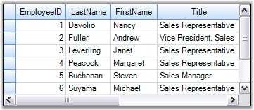{border="0"}

**[]{style="FONT-FAMILY: 'Trebuchet MS','sans-serif'; COLOR: #15428b; FONT-SIZE: 9pt"}** 

*[Figure ]{style="FONT-SIZE: 9pt"}[272]{style="FONT-SIZE: 9pt"}[: Startup Grid without GroupDropArea]{style="FONT-SIZE: 9pt"}*

**[]{style="FONT-FAMILY: 'Trebuchet MS','sans-serif'; COLOR: #15428b; FONT-SIZE: 9pt"}** 

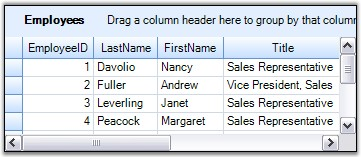{border="0"}

**[]{style="FONT-FAMILY: 'Trebuchet MS','sans-serif'; COLOR: #15428b; FONT-SIZE: 9pt"}** 

*[Figure ]{style="FONT-SIZE: 9pt"}[273]{style="FONT-SIZE: 9pt"}[: Grid with GroupDropArea]{style="FONT-SIZE: 9pt"}*

**[]{style="FONT-FAMILY: 'Trebuchet MS','sans-serif'; COLOR: #15428b; FONT-SIZE: 9pt"}** 

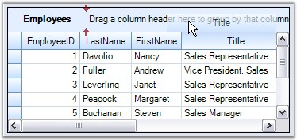{border="0"}

**[]{style="FONT-FAMILY: 'Trebuchet MS','sans-serif'; COLOR: #15428b; FONT-SIZE: 9pt"}** 

*[Figure ]{style="FONT-SIZE: 9pt"}[274]{style="FONT-SIZE: 9pt"}[: Drag & Drop Title column header to the Drop Area]{style="FONT-SIZE: 9pt"}*

**[]{style="FONT-FAMILY: 'Trebuchet MS','sans-serif'; COLOR: #15428b; FONT-SIZE: 9pt"}** 

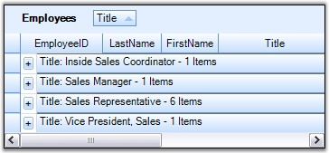{border="0"}

**[]{style="FONT-FAMILY: 'Trebuchet MS','sans-serif'; COLOR: #15428b; FONT-SIZE: 9pt"}** 

*[Figure ]{style="FONT-SIZE: 9pt"}[275]{style="FONT-SIZE: 9pt"}[: Grouped Grid by Title Column]{style="FONT-SIZE: 9pt"}*

**[]{style="FONT-FAMILY: 'Trebuchet MS','sans-serif'; COLOR: #15428b; FONT-SIZE: 9pt"}** 

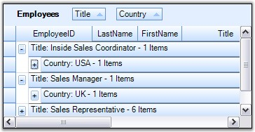{border="0"}

**[]{style="FONT-FAMILY: 'Trebuchet MS','sans-serif'; COLOR: #15428b; FONT-SIZE: 9pt"}** 

*[Figure ]{style="FONT-SIZE: 9pt"}[276]{style="FONT-SIZE: 9pt"}[: GroupDropArea with Multiple Column Headers]{style="FONT-SIZE: 9pt"}****[]{style="FONT-FAMILY: 'Trebuchet MS','sans-serif'; COLOR: #15428b; FONT-SIZE: 9pt"}***

**[]{style="FONT-FAMILY: 'Trebuchet MS','sans-serif'; COLOR: #15428b; FONT-SIZE: 9pt"}** 

See Also

[]{style="FONT-FAMILY: 'Trebuchet MS','sans-serif'; COLOR: #15428b; FONT-SIZE: 9pt"} 

[]{#p417}[]{#_Adding_GroupDropArea}4.3.4.3.1.1.1      Adding GroupDropArea

[]{style="FONT-FAMILY: 'Trebuchet MS','sans-serif'; COLOR: #15428b; FONT-SIZE: 9pt"} 

ShowGroupDropArea property will enable the GroupDropArea only for the table at the top level. When nested tables are used, the drop areas for the child tables need to be added at run time. It is achieved by calling the **AddGroupDropArea** method, by specifying the respective child table name in its parameter.

 

In this example, the grid is bound to a hierarchical dataset containing three tables Categories, Products and OrderDetails. The following code examples illustrate how to add the group drop area for the child tables Products and OrderDetails.

[]{style="FONT-FAMILY: 'Trebuchet MS','sans-serif'; COLOR: #15428b; FONT-SIZE: 9pt"} 

+---------------------------------------------------------------------------------------------------------------------------------------------------------------------------+
| **[\[C#\]]{style="FONT-FAMILY: 'Courier New'; COLOR: black"}**                                                                                                            |
|                                                                                                                                                                           |
| []{style="FONT-FAMILY: 'Courier New'; COLOR: black"}                                                                                                                      |
|                                                                                                                                                                           |
| [// ShowGroupDropArea adds Group Drop Area for the parent Categories table.]{style="FONT-FAMILY: 'Courier New'; COLOR: green"}                                            |
|                                                                                                                                                                           |
| [this]{style="FONT-FAMILY: 'Courier New'; COLOR: blue"}[.gridGroupingControl1.ShowGroupDropArea = [true]{style="COLOR: blue"};]{style="FONT-FAMILY: 'Courier New'"}       |
|                                                                                                                                                                           |
| []{style="FONT-FAMILY: 'Courier New'"}                                                                                                                                    |
|                                                                                                                                                                           |
| [// Adding Group Drop Areas for nested tables.]{style="FONT-FAMILY: 'Courier New'; COLOR: green"}                                                                         |
|                                                                                                                                                                           |
| [this]{style="FONT-FAMILY: 'Courier New'; COLOR: blue"}[.groupingGrid1.AddGroupDropArea([\"Products\"]{style="COLOR: #a31515"});]{style="FONT-FAMILY: 'Courier New'"}     |
|                                                                                                                                                                           |
| [this]{style="FONT-FAMILY: 'Courier New'; COLOR: blue"}[.groupingGrid1.AddGroupDropArea([\"OrderDetails\"]{style="COLOR: #a31515"});]{style="FONT-FAMILY: 'Courier New'"} |
+---------------------------------------------------------------------------------------------------------------------------------------------------------------------------+

[]{style="FONT-FAMILY: 'Trebuchet MS','sans-serif'; COLOR: #15428b; FONT-SIZE: 9pt"} 

+-------------------------------------------------------------------------------------------------------------------------------------------------------------------------------+
| **[\[VB.NET\]]{style="FONT-FAMILY: 'Courier New'; COLOR: black"}**                                                                                                            |
|                                                                                                                                                                               |
| []{style="FONT-FAMILY: 'Courier New'; COLOR: #15428b"}                                                                                                                        |
|                                                                                                                                                                               |
| [\' ShowGroupDropArea adds Group Drop Area for the parent Categories table.]{style="FONT-FAMILY: 'Courier New'; COLOR: green"}                                                |
|                                                                                                                                                                               |
| [Me]{style="FONT-FAMILY: 'Courier New'; COLOR: blue"}[.gridGroupingControl1.ShowGroupDropArea = [True]{style="COLOR: blue"}]{style="FONT-FAMILY: 'Courier New'"}              |
|                                                                                                                                                                               |
| []{style="FONT-FAMILY: 'Courier New'; COLOR: blue"}                                                                                                                           |
|                                                                                                                                                                               |
| [\' Adding Group Drop Areas for nested tables.]{style="FONT-FAMILY: 'Courier New'; COLOR: green"}                                                                             |
|                                                                                                                                                                               |
| [Me]{style="FONT-FAMILY: 'Courier New'; COLOR: blue"}[.gridGroupingControl1.AddGroupDropArea([\"Products\"]{style="COLOR: #a31515"})]{style="FONT-FAMILY: 'Courier New'"}     |
|                                                                                                                                                                               |
| [Me]{style="FONT-FAMILY: 'Courier New'; COLOR: blue"}[.gridGroupingControl1.AddGroupDropArea([\"OrderDetails\"]{style="COLOR: #a31515"})]{style="FONT-FAMILY: 'Courier New'"} |
+-------------------------------------------------------------------------------------------------------------------------------------------------------------------------------+

[]{style="FONT-FAMILY: 'Trebuchet MS','sans-serif'; COLOR: #15428b; FONT-SIZE: 9pt"} 

Given below is a sample screenshot.

[]{style="FONT-FAMILY: 'Trebuchet MS','sans-serif'; COLOR: #15428b; FONT-SIZE: 9pt"} 

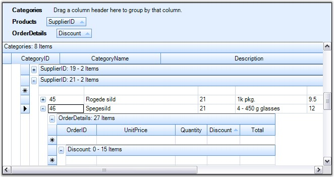{border="0"}

[]{style="FONT-FAMILY: 'Trebuchet MS','sans-serif'; COLOR: #15428b; FONT-SIZE: 9pt"} 

*[Figure ]{style="FONT-SIZE: 9pt"}[277]{style="FONT-SIZE: 9pt"}[: Adding Group Drop Areas to the Child Tables (Product and OrderDetails)]{style="FONT-SIZE: 9pt"}*

 

[]{#p418} 

 

4.3.4.3.1.1.2      Customizing GroupDropArea

[]{style="FONT-FAMILY: 'Trebuchet MS','sans-serif'; COLOR: #15428b; FONT-SIZE: 9pt"} 

Grid Group Drop Area is made up of a collection of Grid controls packed in a panel named GroupDropPanel. A Splitter provides the insulation between the Group Drop Panel and the Grid Table Panel by using which the size of the Drop Panel can be adjusted at run time. While formatting the Group Drop Area, the user should take care of these controls too.

[]{style="FONT-FAMILY: 'Trebuchet MS','sans-serif'; COLOR: #15428b; FONT-SIZE: 9pt"} 

Properties affecting GroupDropArea

**[]{style="FONT-FAMILY: 'Trebuchet MS','sans-serif'; COLOR: #15428b; FONT-SIZE: 9pt"}** 

The table given below lists the properties that allow you to customize the look and feel of the Grid Group Drop Area.

[]{style="FONT-FAMILY: 'Trebuchet MS','sans-serif'; COLOR: #15428b; FONT-SIZE: 9pt"} 

::: {align="center"}
  ---------------------------------------- -----------------------------------------------------------
  Property                                 Description
  gridGroupingControl1.GridGroupDropArea   Lists the properties & events to customize the drop area.
  gridGroupingControl1.GroupDropPanel      Lets the user to control the drop panel behavior.
  gridGroupingControl1.Splitter            Provides the splitter related properties.
  ---------------------------------------- -----------------------------------------------------------
:::

[]{style="FONT-FAMILY: 'Trebuchet MS','sans-serif'; COLOR: #15428b; FONT-SIZE: 9pt"} 

Example

[]{style="FONT-SIZE: 9pt"} 

[In this example, the grouping grid is built with hierarchical dataset created at runtime. The formatting of the Group Drop Area can be controlled by handling the PrepareViewStyleInfo event for each of the grids in the Group Drop Panel.]{style="FONT-SIZE: 9pt"}

[]{style="FONT-FAMILY: 'Trebuchet MS','sans-serif'; COLOR: #15428b; FONT-SIZE: 9pt"} 

1.   Formatting of the Splitter and GroupDropPanel.

[]{style="FONT-FAMILY: 'Trebuchet MS','sans-serif'; COLOR: #15428b; FONT-SIZE: 9pt"} 

+--------------------------------------------------------------------------------------------------------------------------------------------------------------------------------------------+
| **[\[C#\]]{style="FONT-FAMILY: 'Courier New'; COLOR: black"}**                                                                                                                             |
|                                                                                                                                                                                            |
| []{style="FONT-FAMILY: 'Courier New'; COLOR: #15428b"}                                                                                                                                     |
|                                                                                                                                                                                            |
| [// Splitter Color.]{style="FONT-FAMILY: 'Courier New'; COLOR: green"}                                                                                                                     |
|                                                                                                                                                                                            |
| [this]{style="FONT-FAMILY: 'Courier New'; COLOR: blue"}[.gridGroupingControl1.Splitter.BackColor = [Color]{style="COLOR: #2b91af"}.Red;]{style="FONT-FAMILY: 'Courier New'"}               |
|                                                                                                                                                                                            |
| []{style="FONT-FAMILY: 'Courier New'"}                                                                                                                                                     |
|                                                                                                                                                                                            |
| [// Panel Color.               ]{style="FONT-FAMILY: 'Courier New'; COLOR: green"}                                                                                                         |
|                                                                                                                                                                                            |
| [this]{style="FONT-FAMILY: 'Courier New'; COLOR: blue"}[.gridGroupingControl1.GroupDropPanel.BackColor = [Color]{style="COLOR: #2b91af"}.YellowGreen;]{style="FONT-FAMILY: 'Courier New'"} |
+--------------------------------------------------------------------------------------------------------------------------------------------------------------------------------------------+

[]{style="FONT-FAMILY: 'Trebuchet MS','sans-serif'; COLOR: #15428b; FONT-SIZE: 9pt"} 

+----------------------------------------------------------------------------------------------------------------------------------------------------------------------------------------------+
| **[\[VB.NET\]]{style="FONT-FAMILY: 'Courier New'; COLOR: black"}**                                                                                                                           |
|                                                                                                                                                                                              |
| []{style="FONT-FAMILY: 'Courier New'; COLOR: #15428b"}                                                                                                                                       |
|                                                                                                                                                                                              |
| [\' Splitter Color.]{style="FONT-FAMILY: 'Courier New'; COLOR: green"}                                                                                                                       |
|                                                                                                                                                                                              |
| [Private]{style="FONT-FAMILY: 'Courier New'; COLOR: blue"}[ [Me]{style="COLOR: blue"}.gridGroupingControl1.Splitter.BackColor = Color.Red]{style="FONT-FAMILY: 'Courier New'"}               |
|                                                                                                                                                                                              |
| []{style="FONT-FAMILY: 'Courier New'"}                                                                                                                                                       |
|                                                                                                                                                                                              |
| [\' Panel Color.          ]{style="FONT-FAMILY: 'Courier New'; COLOR: green"}                                                                                                                |
|                                                                                                                                                                                              |
| [Private]{style="FONT-FAMILY: 'Courier New'; COLOR: blue"}[ [Me]{style="COLOR: blue"}.gridGroupingControl1.GroupDropPanel.BackColor = Color.YellowGreen]{style="FONT-FAMILY: 'Courier New'"} |
+----------------------------------------------------------------------------------------------------------------------------------------------------------------------------------------------+

[]{style="FONT-FAMILY: 'Trebuchet MS','sans-serif'; COLOR: #15428b; FONT-SIZE: 9pt"} 

2.   The PrepareViewStyleInfo event for each of the grids can be hooked by looping through the controls in the panel.

[]{style="FONT-FAMILY: 'Trebuchet MS','sans-serif'; COLOR: #15428b; FONT-SIZE: 9pt"} 

+---------------------------------------------------------------------------------------------------------------------------------------------------------------------------------------------------------------------------------------------+
| **[\[C#\]]{style="FONT-FAMILY: 'Courier New'; COLOR: black"}**                                                                                                                                                                              |
|                                                                                                                                                                                                                                             |
| []{style="FONT-FAMILY: 'Courier New'; COLOR: black"}                                                                                                                                                                                        |
|                                                                                                                                                                                                                                             |
| [foreach]{style="FONT-FAMILY: 'Courier New'; COLOR: blue"}[ ([Control]{style="COLOR: #2b91af"} ctl [in]{style="COLOR: blue"} [this]{style="COLOR: blue"}.gridGroupingControl1.GroupDropPanel.Controls)]{style="FONT-FAMILY: 'Courier New'"} |
|                                                                                                                                                                                                                                             |
| [{]{style="FONT-FAMILY: 'Courier New'"}                                                                                                                                                                                                     |
|                                                                                                                                                                                                                                             |
| [    [GridGroupDropArea]{style="COLOR: #2b91af"} groupDropArea = ctl [as]{style="COLOR: blue"} [GridGroupDropArea]{style="COLOR: #2b91af"};]{style="FONT-FAMILY: 'Courier New'"}                                                            |
|                                                                                                                                                                                                                                             |
| []{style="FONT-FAMILY: 'Courier New'"}                                                                                                                                                                                                      |
|                                                                                                                                                                                                                                             |
| [    [switch]{style="COLOR: blue"} (groupDropArea.Model.Table.TableDescriptor.Name)]{style="FONT-FAMILY: 'Courier New'"}                                                                                                                    |
|                                                                                                                                                                                                                                             |
| [    {]{style="FONT-FAMILY: 'Courier New'"}                                                                                                                                                                                                 |
|                                                                                                                                                                                                                                             |
| [        [case]{style="COLOR: blue"} [\"ParentTable\"]{style="COLOR: #a31515"}:]{style="FONT-FAMILY: 'Courier New'"}                                                                                                                        |
|                                                                                                                                                                                                                                             |
| [        groupDropArea.Model.ColCount = 80;]{style="FONT-FAMILY: 'Courier New'"}                                                                                                                                                            |
|                                                                                                                                                                                                                                             |
| [        groupDropArea.PrepareViewStyleInfo += [new]{style="COLOR: blue"} [GridPrepareViewStyleInfoEventHandler]{style="COLOR: #2b91af"}(ParentTable_PrepareViewStyleInfo);]{style="FONT-FAMILY: 'Courier New'"}                            |
|                                                                                                                                                                                                                                             |
| [        [break]{style="COLOR: blue"};]{style="FONT-FAMILY: 'Courier New'"}                                                                                                                                                                 |
|                                                                                                                                                                                                                                             |
| []{style="FONT-FAMILY: 'Courier New'"}                                                                                                                                                                                                      |
|                                                                                                                                                                                                                                             |
| [        [case]{style="COLOR: blue"} [\"ChildTable\"]{style="COLOR: #a31515"}:]{style="FONT-FAMILY: 'Courier New'"}                                                                                                                         |
|                                                                                                                                                                                                                                             |
| [        groupDropArea.Model.ColCount = 80;]{style="FONT-FAMILY: 'Courier New'"}                                                                                                                                                            |
|                                                                                                                                                                                                                                             |
| [        groupDropArea.PrepareViewStyleInfo += [new]{style="COLOR: blue"} [GridPrepareViewStyleInfoEventHandler]{style="COLOR: #2b91af"}(ChildTable_PrepareViewStyleInfo);]{style="FONT-FAMILY: 'Courier New'"}                             |
|                                                                                                                                                                                                                                             |
| [        [break]{style="COLOR: blue"};]{style="FONT-FAMILY: 'Courier New'"}                                                                                                                                                                 |
|                                                                                                                                                                                                                                             |
| [    }]{style="FONT-FAMILY: 'Courier New'"}                                                                                                                                                                                                 |
|                                                                                                                                                                                                                                             |
| [}]{style="FONT-FAMILY: 'Courier New'"}                                                                                                                                                                                                     |
+---------------------------------------------------------------------------------------------------------------------------------------------------------------------------------------------------------------------------------------------+

[]{style="FONT-FAMILY: 'Trebuchet MS','sans-serif'; COLOR: #15428b; FONT-SIZE: 9pt"} 

+-------------------------------------------------------------------------------------------------------------------------------------------------------------------------------------------------------------------------------+
| **[\[VB.NET\]]{style="FONT-FAMILY: 'Courier New'; COLOR: black"}**                                                                                                                                                            |
|                                                                                                                                                                                                                               |
| []{style="FONT-FAMILY: 'Courier New'; COLOR: black"}                                                                                                                                                                          |
|                                                                                                                                                                                                                               |
| [Dim]{style="FONT-FAMILY: 'Courier New'; COLOR: blue"}[ ctl [As]{style="COLOR: blue"} Control]{style="FONT-FAMILY: 'Courier New'"}                                                                                            |
|                                                                                                                                                                                                                               |
| [For]{style="FONT-FAMILY: 'Courier New'; COLOR: blue"}[ [Each]{style="COLOR: blue"} ctl [In]{style="COLOR: blue"} [Me]{style="COLOR: blue"}.gridGroupingControl1.GroupDropPanel.Controls]{style="FONT-FAMILY: 'Courier New'"} |
|                                                                                                                                                                                                                               |
| [Dim]{style="FONT-FAMILY: 'Courier New'; COLOR: blue"}[ groupDropArea [As]{style="COLOR: blue"} GridGroupDropArea = ctl]{style="FONT-FAMILY: 'Courier New'"}                                                                  |
|                                                                                                                                                                                                                               |
| [Select]{style="FONT-FAMILY: 'Courier New'; COLOR: blue"}[ [Case]{style="COLOR: blue"} groupDropArea.Model.Table.TableDescriptor.Name]{style="FONT-FAMILY: 'Courier New'"}                                                    |
|                                                                                                                                                                                                                               |
| [Case]{style="FONT-FAMILY: 'Courier New'; COLOR: blue"}[ [\"ParentTable\"]{style="COLOR: #a31515"}]{style="FONT-FAMILY: 'Courier New'"}                                                                                       |
|                                                                                                                                                                                                                               |
| [groupDropArea.Model.ColCount = 80]{style="FONT-FAMILY: 'Courier New'"}                                                                                                                                                       |
|                                                                                                                                                                                                                               |
| [AddHandler]{style="FONT-FAMILY: 'Courier New'; COLOR: blue"}[ groupDropArea.PrepareViewStyleInfo, [AddressOf]{style="COLOR: blue"} ParentTable_PrepareViewStyleInfo]{style="FONT-FAMILY: 'Courier New'"}                     |
|                                                                                                                                                                                                                               |
| []{style="FONT-FAMILY: 'Courier New'"}                                                                                                                                                                                        |
|                                                                                                                                                                                                                               |
| [Case]{style="FONT-FAMILY: 'Courier New'; COLOR: blue"}[ [\"ChildTable\"]{style="COLOR: #a31515"}]{style="FONT-FAMILY: 'Courier New'"}                                                                                        |
|                                                                                                                                                                                                                               |
| [groupDropArea.Model.ColCount = 80]{style="FONT-FAMILY: 'Courier New'"}                                                                                                                                                       |
|                                                                                                                                                                                                                               |
| [AddHandler]{style="FONT-FAMILY: 'Courier New'; COLOR: blue"}[ groupDropArea.PrepareViewStyleInfo, [AddressOf]{style="COLOR: blue"} ChildTable_PrepareViewStyleInfo]{style="FONT-FAMILY: 'Courier New'"}                      |
|                                                                                                                                                                                                                               |
| [End]{style="FONT-FAMILY: 'Courier New'; COLOR: blue"}[ [Select]{style="COLOR: blue"}]{style="FONT-FAMILY: 'Courier New'"}                                                                                                    |
|                                                                                                                                                                                                                               |
| [Next]{style="FONT-FAMILY: 'Courier New'; COLOR: blue"}[ ctl]{style="FONT-FAMILY: 'Courier New'"}                                                                                                                             |
+-------------------------------------------------------------------------------------------------------------------------------------------------------------------------------------------------------------------------------+

[]{style="FONT-FAMILY: 'Trebuchet MS','sans-serif'; COLOR: #15428b; FONT-SIZE: 9pt"} 

3.   Setting the style properties in the PrepareViewStyleInfo event.

[]{style="FONT-FAMILY: 'Trebuchet MS','sans-serif'; COLOR: #15428b; FONT-SIZE: 9pt"} 

+--------------------------------------------------------------------------------------------------------------------------------------------------------------------------------------------------------------------------------------------------------------------+
| **[\[C#\]]{style="FONT-FAMILY: 'Courier New'; COLOR: black"}**                                                                                                                                                                                                     |
|                                                                                                                                                                                                                                                                    |
| []{style="FONT-FAMILY: 'Courier New'; COLOR: black"}                                                                                                                                                                                                               |
|                                                                                                                                                                                                                                                                    |
| [private]{style="FONT-FAMILY: 'Courier New'; COLOR: blue"}[ [void]{style="COLOR: blue"} ParentTable_PrepareViewStyleInfo([object]{style="COLOR: blue"} sender, [GridPrepareViewStyleInfoEventArgs]{style="COLOR: #2b91af"} e)]{style="FONT-FAMILY: 'Courier New'"} |
|                                                                                                                                                                                                                                                                    |
| [{]{style="FONT-FAMILY: 'Courier New'"}                                                                                                                                                                                                                            |
|                                                                                                                                                                                                                                                                    |
| [    [// Setting color to the text displaying the table name.]{style="COLOR: green"}]{style="FONT-FAMILY: 'Courier New'"}                                                                                                                                          |
|                                                                                                                                                                                                                                                                    |
| [    [if]{style="COLOR: blue"} (e.ColIndex == 2 && e.RowIndex == 2)]{style="FONT-FAMILY: 'Courier New'"}                                                                                                                                                           |
|                                                                                                                                                                                                                                                                    |
| [    {]{style="FONT-FAMILY: 'Courier New'"}                                                                                                                                                                                                                        |
|                                                                                                                                                                                                                                                                    |
| [        e.Style.Text = [\"ParentTable\"]{style="COLOR: #a31515"};]{style="FONT-FAMILY: 'Courier New'"}                                                                                                                                                            |
|                                                                                                                                                                                                                                                                    |
| [        e.Style.Font.Bold = [true]{style="COLOR: blue"};]{style="FONT-FAMILY: 'Courier New'"}                                                                                                                                                                     |
|                                                                                                                                                                                                                                                                    |
| [        e.Style.BackColor = [Color]{style="COLOR: #2b91af"}.YellowGreen;]{style="FONT-FAMILY: 'Courier New'"}                                                                                                                                                     |
|                                                                                                                                                                                                                                                                    |
| [        e.Style.TextColor = [Color]{style="COLOR: #2b91af"}.Blue;               ]{style="FONT-FAMILY: 'Courier New'"}                                                                                                                                             |
|                                                                                                                                                                                                                                                                    |
| [        e.Style.CellType = [\"Static\"]{style="COLOR: #a31515"};]{style="FONT-FAMILY: 'Courier New'"}                                                                                                                                                             |
|                                                                                                                                                                                                                                                                    |
| [        e.Style.HorizontalAlignment = [GridHorizontalAlignment]{style="COLOR: #2b91af"}.Left;                       ]{style="FONT-FAMILY: 'Courier New'"}                                                                                                         |
|                                                                                                                                                                                                                                                                    |
| [        e.Style.Enabled = [false]{style="COLOR: blue"};]{style="FONT-FAMILY: 'Courier New'"}                                                                                                                                                                      |
|                                                                                                                                                                                                                                                                    |
| [    }]{style="FONT-FAMILY: 'Courier New'"}                                                                                                                                                                                                                        |
|                                                                                                                                                                                                                                                                    |
| [    [// Setting color to the drop area.]{style="COLOR: green"}]{style="FONT-FAMILY: 'Courier New'"}                                                                                                                                                               |
|                                                                                                                                                                                                                                                                    |
| [    [else]{style="COLOR: blue"} [if]{style="COLOR: blue"} (e.Style.Text.StartsWith([\"Drag a\"]{style="COLOR: #a31515"}))]{style="FONT-FAMILY: 'Courier New'"}                                                                                                    |
|                                                                                                                                                                                                                                                                    |
| [    {]{style="FONT-FAMILY: 'Courier New'"}                                                                                                                                                                                                                        |
|                                                                                                                                                                                                                                                                    |
| [        e.Style.Text = [\"Drag and Drop Parent Table Column headers\"]{style="COLOR: #a31515"};]{style="FONT-FAMILY: 'Courier New'"}                                                                                                                              |
|                                                                                                                                                                                                                                                                    |
| [        e.Style.BackColor = [Color]{style="COLOR: #2b91af"}.White;]{style="FONT-FAMILY: 'Courier New'"}                                                                                                                                                           |
|                                                                                                                                                                                                                                                                    |
| [    }       ]{style="FONT-FAMILY: 'Courier New'"}                                                                                                                                                                                                                 |
|                                                                                                                                                                                                                                                                    |
| [    [// Setting color to the dropped columns.]{style="COLOR: green"}]{style="FONT-FAMILY: 'Courier New'"}                                                                                                                                                         |
|                                                                                                                                                                                                                                                                    |
| [    [else]{style="COLOR: blue"} [if]{style="COLOR: blue"} (e.Style.Text.StartsWith([\"Par\"]{style="COLOR: #a31515"}))]{style="FONT-FAMILY: 'Courier New'"}                                                                                                       |
|                                                                                                                                                                                                                                                                    |
| [    {]{style="FONT-FAMILY: 'Courier New'"}                                                                                                                                                                                                                        |
|                                                                                                                                                                                                                                                                    |
| [        e.Style.BackColor = [Color]{style="COLOR: #2b91af"}.Tomato;                   ]{style="FONT-FAMILY: 'Courier New'"}                                                                                                                                       |
|                                                                                                                                                                                                                                                                    |
| [        e.Style.Themed = [false]{style="COLOR: blue"};]{style="FONT-FAMILY: 'Courier New'"}                                                                                                                                                                       |
|                                                                                                                                                                                                                                                                    |
| [    }]{style="FONT-FAMILY: 'Courier New'"}                                                                                                                                                                                                                        |
|                                                                                                                                                                                                                                                                    |
| [    [// Setting color to the remaining part.]{style="COLOR: green"}]{style="FONT-FAMILY: 'Courier New'"}                                                                                                                                                          |
|                                                                                                                                                                                                                                                                    |
| [    [else]{style="COLOR: blue"}]{style="FONT-FAMILY: 'Courier New'"}                                                                                                                                                                                              |
|                                                                                                                                                                                                                                                                    |
| [    e.Style.BackColor = [Color]{style="COLOR: #2b91af"}.YellowGreen;                  ]{style="FONT-FAMILY: 'Courier New'"}                                                                                                                                       |
|                                                                                                                                                                                                                                                                    |
| [}]{style="FONT-FAMILY: 'Courier New'"}                                                                                                                                                                                                                            |
|                                                                                                                                                                                                                                                                    |
| []{style="FONT-FAMILY: 'Courier New'"}                                                                                                                                                                                                                             |
|                                                                                                                                                                                                                                                                    |
| [private]{style="FONT-FAMILY: 'Courier New'; COLOR: blue"}[ [void]{style="COLOR: blue"} ChildTable_PrepareViewStyleInfo([object]{style="COLOR: blue"} sender, [GridPrepareViewStyleInfoEventArgs]{style="COLOR: #2b91af"} e)]{style="FONT-FAMILY: 'Courier New'"}  |
|                                                                                                                                                                                                                                                                    |
| [{]{style="FONT-FAMILY: 'Courier New'"}                                                                                                                                                                                                                            |
|                                                                                                                                                                                                                                                                    |
| [    [// Setting color to the text displaying the table name.]{style="COLOR: green"}]{style="FONT-FAMILY: 'Courier New'"}                                                                                                                                          |
|                                                                                                                                                                                                                                                                    |
| [    [if]{style="COLOR: blue"} (e.ColIndex == 2 && e.RowIndex == 2)]{style="FONT-FAMILY: 'Courier New'"}                                                                                                                                                           |
|                                                                                                                                                                                                                                                                    |
| [    {]{style="FONT-FAMILY: 'Courier New'"}                                                                                                                                                                                                                        |
|                                                                                                                                                                                                                                                                    |
| [        e.Style.Text = [\"ChildTable \"]{style="COLOR: #a31515"};]{style="FONT-FAMILY: 'Courier New'"}                                                                                                                                                            |
|                                                                                                                                                                                                                                                                    |
| [        e.Style.Font.Bold = [true]{style="COLOR: blue"};]{style="FONT-FAMILY: 'Courier New'"}                                                                                                                                                                     |
|                                                                                                                                                                                                                                                                    |
| [        e.Style.BackColor = [Color]{style="COLOR: #2b91af"}.YellowGreen;]{style="FONT-FAMILY: 'Courier New'"}                                                                                                                                                     |
|                                                                                                                                                                                                                                                                    |
| [        e.Style.TextColor = [Color]{style="COLOR: #2b91af"}.Yellow; ]{style="FONT-FAMILY: 'Courier New'"}                                                                                                                                                         |
|                                                                                                                                                                                                                                                                    |
| [        e.Style.CellType = [\"Static\"]{style="COLOR: #a31515"};]{style="FONT-FAMILY: 'Courier New'"}                                                                                                                                                             |
|                                                                                                                                                                                                                                                                    |
| [        e.Style.HorizontalAlignment = [GridHorizontalAlignment]{style="COLOR: #2b91af"}.Left;                       ]{style="FONT-FAMILY: 'Courier New'"}                                                                                                         |
|                                                                                                                                                                                                                                                                    |
| [        e.Style.Enabled = [false]{style="COLOR: blue"};]{style="FONT-FAMILY: 'Courier New'"}                                                                                                                                                                      |
|                                                                                                                                                                                                                                                                    |
| [    }]{style="FONT-FAMILY: 'Courier New'"}                                                                                                                                                                                                                        |
|                                                                                                                                                                                                                                                                    |
| [    [// Setting color to the drop area.]{style="COLOR: green"}]{style="FONT-FAMILY: 'Courier New'"}                                                                                                                                                               |
|                                                                                                                                                                                                                                                                    |
| [    [else]{style="COLOR: blue"} [if]{style="COLOR: blue"} (e.Style.Text.StartsWith([\"Drag a\"]{style="COLOR: #a31515"}))]{style="FONT-FAMILY: 'Courier New'"}                                                                                                    |
|                                                                                                                                                                                                                                                                    |
| [    {]{style="FONT-FAMILY: 'Courier New'"}                                                                                                                                                                                                                        |
|                                                                                                                                                                                                                                                                    |
| [        e.Style.Text = [\"Drag and Drop Parent Table Column headers\"]{style="COLOR: #a31515"};]{style="FONT-FAMILY: 'Courier New'"}                                                                                                                              |
|                                                                                                                                                                                                                                                                    |
| [        e.Style.BackColor = [Color]{style="COLOR: #2b91af"}.Orange;]{style="FONT-FAMILY: 'Courier New'"}                                                                                                                                                          |
|                                                                                                                                                                                                                                                                    |
| [        e.Style.TextColor = [Color]{style="COLOR: #2b91af"}.White;]{style="FONT-FAMILY: 'Courier New'"}                                                                                                                                                           |
|                                                                                                                                                                                                                                                                    |
| [    }]{style="FONT-FAMILY: 'Courier New'"}                                                                                                                                                                                                                        |
|                                                                                                                                                                                                                                                                    |
| [    [// Setting color to the dropped columns.]{style="COLOR: green"}]{style="FONT-FAMILY: 'Courier New'"}                                                                                                                                                         |
|                                                                                                                                                                                                                                                                    |
| [    [else]{style="COLOR: blue"} [if]{style="COLOR: blue"} (e.Style.Text.StartsWith([\"Child\"]{style="COLOR: #a31515"}))]{style="FONT-FAMILY: 'Courier New'"}                                                                                                     |
|                                                                                                                                                                                                                                                                    |
| [    {]{style="FONT-FAMILY: 'Courier New'"}                                                                                                                                                                                                                        |
|                                                                                                                                                                                                                                                                    |
| [        e.Style.BackColor = [Color]{style="COLOR: #2b91af"}.Orange;]{style="FONT-FAMILY: 'Courier New'"}                                                                                                                                                          |
|                                                                                                                                                                                                                                                                    |
| [        e.Style.TextColor = [Color]{style="COLOR: #2b91af"}.White;]{style="FONT-FAMILY: 'Courier New'"}                                                                                                                                                           |
|                                                                                                                                                                                                                                                                    |
| [        e.Style.Themed = [false]{style="COLOR: blue"};]{style="FONT-FAMILY: 'Courier New'"}                                                                                                                                                                       |
|                                                                                                                                                                                                                                                                    |
| [    }]{style="FONT-FAMILY: 'Courier New'"}                                                                                                                                                                                                                        |
|                                                                                                                                                                                                                                                                    |
| [    [// Setting color to the remaining part.]{style="COLOR: green"}]{style="FONT-FAMILY: 'Courier New'"}                                                                                                                                                          |
|                                                                                                                                                                                                                                                                    |
| [    [else]{style="COLOR: blue"}]{style="FONT-FAMILY: 'Courier New'"}                                                                                                                                                                                              |
|                                                                                                                                                                                                                                                                    |
| [    e.Style.BackColor = [Color]{style="COLOR: #2b91af"}.YellowGreen;                  ]{style="FONT-FAMILY: 'Courier New'"}                                                                                                                                       |
|                                                                                                                                                                                                                                                                    |
| [}]{style="FONT-FAMILY: 'Courier New'"}                                                                                                                                                                                                                            |
+--------------------------------------------------------------------------------------------------------------------------------------------------------------------------------------------------------------------------------------------------------------------+

[]{style="FONT-FAMILY: 'Trebuchet MS','sans-serif'; COLOR: #15428b; FONT-SIZE: 9pt"} 

+-------------------------------------------------------------------------------------------------------------------------------------------------------------------------------------------------------------------------------------------------------------------------------------------------------------------------------------------------------+
| **[\[VB.NET\]]{style="FONT-FAMILY: 'Courier New'; COLOR: black"}**                                                                                                                                                                                                                                                                                    |
|                                                                                                                                                                                                                                                                                                                                                       |
| []{style="FONT-FAMILY: 'Courier New'; COLOR: #15428b"}                                                                                                                                                                                                                                                                                                |
|                                                                                                                                                                                                                                                                                                                                                       |
| [Private]{style="FONT-FAMILY: 'Courier New'; COLOR: blue"}[ [Sub]{style="COLOR: blue"} ParentTable_PrepareViewStyleInfo([ByVal]{style="COLOR: blue"} sender [As]{style="COLOR: blue"} [Object]{style="COLOR: blue"}, [ByVal]{style="COLOR: blue"} e [As]{style="COLOR: blue"} GridPrepareViewStyleInfoEventArgs)]{style="FONT-FAMILY: 'Courier New'"} |
|                                                                                                                                                                                                                                                                                                                                                       |
| []{style="FONT-FAMILY: 'Courier New'; COLOR: green"}                                                                                                                                                                                                                                                                                                  |
|                                                                                                                                                                                                                                                                                                                                                       |
| [\' Setting color to the text displaying the table name.]{style="FONT-FAMILY: 'Courier New'; COLOR: green"}                                                                                                                                                                                                                                           |
|                                                                                                                                                                                                                                                                                                                                                       |
| [If]{style="FONT-FAMILY: 'Courier New'; COLOR: blue"}[ e.ColIndex = 2 [AndAlso]{style="COLOR: blue"} e.RowIndex = 2 [Then]{style="COLOR: blue"}]{style="FONT-FAMILY: 'Courier New'"}                                                                                                                                                                  |
|                                                                                                                                                                                                                                                                                                                                                       |
| [e.Style.Text = [\"ParentTable\"]{style="COLOR: #a31515"}]{style="FONT-FAMILY: 'Courier New'"}                                                                                                                                                                                                                                                        |
|                                                                                                                                                                                                                                                                                                                                                       |
| [e.Style.Font.Bold = [True]{style="COLOR: blue"}]{style="FONT-FAMILY: 'Courier New'"}                                                                                                                                                                                                                                                                 |
|                                                                                                                                                                                                                                                                                                                                                       |
| [e.Style.BackColor = Color.YellowGreen]{style="FONT-FAMILY: 'Courier New'"}                                                                                                                                                                                                                                                                           |
|                                                                                                                                                                                                                                                                                                                                                       |
| [e.Style.TextColor = Color.Blue]{style="FONT-FAMILY: 'Courier New'"}                                                                                                                                                                                                                                                                                  |
|                                                                                                                                                                                                                                                                                                                                                       |
| [e.Style.CellType = [\"Static\"]{style="COLOR: #a31515"}]{style="FONT-FAMILY: 'Courier New'"}                                                                                                                                                                                                                                                         |
|                                                                                                                                                                                                                                                                                                                                                       |
| [e.Style.HorizontalAlignment = GridHorizontalAlignment.Left]{style="FONT-FAMILY: 'Courier New'"}                                                                                                                                                                                                                                                      |
|                                                                                                                                                                                                                                                                                                                                                       |
| [e.Style.Enabled = [False]{style="COLOR: blue"}]{style="FONT-FAMILY: 'Courier New'"}                                                                                                                                                                                                                                                                  |
|                                                                                                                                                                                                                                                                                                                                                       |
| []{style="FONT-FAMILY: 'Courier New'; COLOR: green"}                                                                                                                                                                                                                                                                                                  |
|                                                                                                                                                                                                                                                                                                                                                       |
| [\' Setting color to the drop area.]{style="FONT-FAMILY: 'Courier New'; COLOR: green"}                                                                                                                                                                                                                                                                |
|                                                                                                                                                                                                                                                                                                                                                       |
| [ElseIf]{style="FONT-FAMILY: 'Courier New'; COLOR: blue"}[ e.Style.Text.StartsWith([\"Drag a\"]{style="COLOR: #a31515"}) [Then]{style="COLOR: blue"}]{style="FONT-FAMILY: 'Courier New'"}                                                                                                                                                             |
|                                                                                                                                                                                                                                                                                                                                                       |
| [e.Style.Text = [\"Drag and Drop Parent Table Column headers\"]{style="COLOR: #a31515"}]{style="FONT-FAMILY: 'Courier New'"}                                                                                                                                                                                                                          |
|                                                                                                                                                                                                                                                                                                                                                       |
| [e.Style.BackColor = Color.White]{style="FONT-FAMILY: 'Courier New'"}                                                                                                                                                                                                                                                                                 |
|                                                                                                                                                                                                                                                                                                                                                       |
| []{style="FONT-FAMILY: 'Courier New'; COLOR: green"}                                                                                                                                                                                                                                                                                                  |
|                                                                                                                                                                                                                                                                                                                                                       |
| [\' Setting color to the dropped columns.]{style="FONT-FAMILY: 'Courier New'; COLOR: green"}                                                                                                                                                                                                                                                          |
|                                                                                                                                                                                                                                                                                                                                                       |
| [ElseIf]{style="FONT-FAMILY: 'Courier New'; COLOR: blue"}[ e.Style.Text.StartsWith([\"Par\"]{style="COLOR: #a31515"}) [Then]{style="COLOR: blue"}]{style="FONT-FAMILY: 'Courier New'"}                                                                                                                                                                |
|                                                                                                                                                                                                                                                                                                                                                       |
| [e.Style.BackColor = Color.Tomato]{style="FONT-FAMILY: 'Courier New'"}                                                                                                                                                                                                                                                                                |
|                                                                                                                                                                                                                                                                                                                                                       |
| [e.Style.Themed = [False]{style="COLOR: blue"}]{style="FONT-FAMILY: 'Courier New'"}                                                                                                                                                                                                                                                                   |
|                                                                                                                                                                                                                                                                                                                                                       |
| []{style="FONT-FAMILY: 'Courier New'; COLOR: blue"}                                                                                                                                                                                                                                                                                                   |
|                                                                                                                                                                                                                                                                                                                                                       |
| [\' Setting color to the remaining part.]{style="FONT-FAMILY: 'Courier New'; COLOR: green"}                                                                                                                                                                                                                                                           |
|                                                                                                                                                                                                                                                                                                                                                       |
| [Else]{style="FONT-FAMILY: 'Courier New'; COLOR: blue"}                                                                                                                                                                                                                                                                                               |
|                                                                                                                                                                                                                                                                                                                                                       |
| [e.Style.BackColor = Color.YellowGreen]{style="FONT-FAMILY: 'Courier New'"}                                                                                                                                                                                                                                                                           |
|                                                                                                                                                                                                                                                                                                                                                       |
| [End]{style="FONT-FAMILY: 'Courier New'; COLOR: blue"}[ [If]{style="COLOR: blue"}]{style="FONT-FAMILY: 'Courier New'"}                                                                                                                                                                                                                                |
|                                                                                                                                                                                                                                                                                                                                                       |
| [End]{style="FONT-FAMILY: 'Courier New'; COLOR: blue"}[ [Sub]{style="COLOR: blue"}]{style="FONT-FAMILY: 'Courier New'"}                                                                                                                                                                                                                               |
|                                                                                                                                                                                                                                                                                                                                                       |
| []{style="FONT-FAMILY: 'Courier New'; COLOR: green"}                                                                                                                                                                                                                                                                                                  |
|                                                                                                                                                                                                                                                                                                                                                       |
| [Private]{style="FONT-FAMILY: 'Courier New'; COLOR: blue"}[ [Sub]{style="COLOR: blue"} ChildTable_PrepareViewStyleInfo([ByVal]{style="COLOR: blue"} sender [As]{style="COLOR: blue"} [Object]{style="COLOR: blue"}, [ByVal]{style="COLOR: blue"} e [As]{style="COLOR: blue"} GridPrepareViewStyleInfoEventArgs)]{style="FONT-FAMILY: 'Courier New'"}  |
|                                                                                                                                                                                                                                                                                                                                                       |
| [            ]{style="FONT-FAMILY: 'Courier New'"}                                                                                                                                                                                                                                                                                                    |
|                                                                                                                                                                                                                                                                                                                                                       |
| [\' Setting color to the text displaying the table name.]{style="FONT-FAMILY: 'Courier New'; COLOR: green"}                                                                                                                                                                                                                                           |
|                                                                                                                                                                                                                                                                                                                                                       |
| [If]{style="FONT-FAMILY: 'Courier New'; COLOR: blue"}[ e.ColIndex = 2 [AndAlso]{style="COLOR: blue"} e.RowIndex = 2 [Then]{style="COLOR: blue"}]{style="FONT-FAMILY: 'Courier New'"}                                                                                                                                                                  |
|                                                                                                                                                                                                                                                                                                                                                       |
| [e.Style.Text = [\"ChildTable \"]{style="COLOR: #a31515"}]{style="FONT-FAMILY: 'Courier New'"}                                                                                                                                                                                                                                                        |
|                                                                                                                                                                                                                                                                                                                                                       |
| [e.Style.Font.Bold = [True]{style="COLOR: blue"}]{style="FONT-FAMILY: 'Courier New'"}                                                                                                                                                                                                                                                                 |
|                                                                                                                                                                                                                                                                                                                                                       |
| [e.Style.BackColor = Color.YellowGreen]{style="FONT-FAMILY: 'Courier New'"}                                                                                                                                                                                                                                                                           |
|                                                                                                                                                                                                                                                                                                                                                       |
| [e.Style.TextColor = Color.Yellow]{style="FONT-FAMILY: 'Courier New'"}                                                                                                                                                                                                                                                                                |
|                                                                                                                                                                                                                                                                                                                                                       |
| [e.Style.CellType = [\"Static\"]{style="COLOR: #a31515"}]{style="FONT-FAMILY: 'Courier New'"}                                                                                                                                                                                                                                                         |
|                                                                                                                                                                                                                                                                                                                                                       |
| [e.Style.HorizontalAlignment = GridHorizontalAlignment.Left]{style="FONT-FAMILY: 'Courier New'"}                                                                                                                                                                                                                                                      |
|                                                                                                                                                                                                                                                                                                                                                       |
| [e.Style.Enabled = [False]{style="COLOR: blue"}]{style="FONT-FAMILY: 'Courier New'"}                                                                                                                                                                                                                                                                  |
|                                                                                                                                                                                                                                                                                                                                                       |
| []{style="FONT-FAMILY: 'Courier New'; COLOR: blue"}                                                                                                                                                                                                                                                                                                   |
|                                                                                                                                                                                                                                                                                                                                                       |
| [\' Setting color to the drop area.]{style="FONT-FAMILY: 'Courier New'; COLOR: green"}                                                                                                                                                                                                                                                                |
|                                                                                                                                                                                                                                                                                                                                                       |
| [ElseIf]{style="FONT-FAMILY: 'Courier New'; COLOR: blue"}[ e.Style.Text.StartsWith([\"Drag a\"]{style="COLOR: #a31515"}) [Then]{style="COLOR: blue"}]{style="FONT-FAMILY: 'Courier New'"}                                                                                                                                                             |
|                                                                                                                                                                                                                                                                                                                                                       |
| [e.Style.Text = [\"Drag and Drop Parent Table Column headers\"]{style="COLOR: #a31515"}]{style="FONT-FAMILY: 'Courier New'"}                                                                                                                                                                                                                          |
|                                                                                                                                                                                                                                                                                                                                                       |
| [e.Style.BackColor = Color.Orange]{style="FONT-FAMILY: 'Courier New'"}                                                                                                                                                                                                                                                                                |
|                                                                                                                                                                                                                                                                                                                                                       |
| [e.Style.TextColor = Color.White]{style="FONT-FAMILY: 'Courier New'"}                                                                                                                                                                                                                                                                                 |
|                                                                                                                                                                                                                                                                                                                                                       |
| []{style="FONT-FAMILY: 'Courier New'"}                                                                                                                                                                                                                                                                                                                |
|                                                                                                                                                                                                                                                                                                                                                       |
| [\' Setting color to the dropped columns.]{style="FONT-FAMILY: 'Courier New'; COLOR: green"}                                                                                                                                                                                                                                                          |
|                                                                                                                                                                                                                                                                                                                                                       |
| [ElseIf]{style="FONT-FAMILY: 'Courier New'; COLOR: blue"}[ e.Style.Text.StartsWith([\"Child\"]{style="COLOR: #a31515"}) [Then]{style="COLOR: blue"}]{style="FONT-FAMILY: 'Courier New'"}                                                                                                                                                              |
|                                                                                                                                                                                                                                                                                                                                                       |
| [e.Style.BackColor = Color.Orange]{style="FONT-FAMILY: 'Courier New'"}                                                                                                                                                                                                                                                                                |
|                                                                                                                                                                                                                                                                                                                                                       |
| [e.Style.TextColor = Color.White]{style="FONT-FAMILY: 'Courier New'"}                                                                                                                                                                                                                                                                                 |
|                                                                                                                                                                                                                                                                                                                                                       |
| [e.Style.Themed = [False]{style="COLOR: blue"}]{style="FONT-FAMILY: 'Courier New'"}                                                                                                                                                                                                                                                                   |
|                                                                                                                                                                                                                                                                                                                                                       |
| []{style="FONT-FAMILY: 'Courier New'; COLOR: blue"}                                                                                                                                                                                                                                                                                                   |
|                                                                                                                                                                                                                                                                                                                                                       |
| [\' Setting color to the remaining part.]{style="FONT-FAMILY: 'Courier New'; COLOR: green"}                                                                                                                                                                                                                                                           |
|                                                                                                                                                                                                                                                                                                                                                       |
| [Else]{style="FONT-FAMILY: 'Courier New'; COLOR: blue"}                                                                                                                                                                                                                                                                                               |
|                                                                                                                                                                                                                                                                                                                                                       |
| [e.Style.BackColor = Color.YellowGreen]{style="FONT-FAMILY: 'Courier New'"}                                                                                                                                                                                                                                                                           |
|                                                                                                                                                                                                                                                                                                                                                       |
| [End]{style="FONT-FAMILY: 'Courier New'; COLOR: blue"}[ [If]{style="COLOR: blue"}]{style="FONT-FAMILY: 'Courier New'"}                                                                                                                                                                                                                                |
|                                                                                                                                                                                                                                                                                                                                                       |
| [End]{style="FONT-FAMILY: 'Courier New'; COLOR: blue"}[ [Sub]{style="COLOR: blue"}]{style="FONT-FAMILY: 'Courier New'"}                                                                                                                                                                                                                               |
+-------------------------------------------------------------------------------------------------------------------------------------------------------------------------------------------------------------------------------------------------------------------------------------------------------------------------------------------------------+

[]{style="FONT-FAMILY: 'Trebuchet MS','sans-serif'; COLOR: #15428b; FONT-SIZE: 9pt"} 

4.   Here is a sample output.

[]{style="FONT-FAMILY: 'Trebuchet MS','sans-serif'; COLOR: #15428b; FONT-SIZE: 9pt"} 

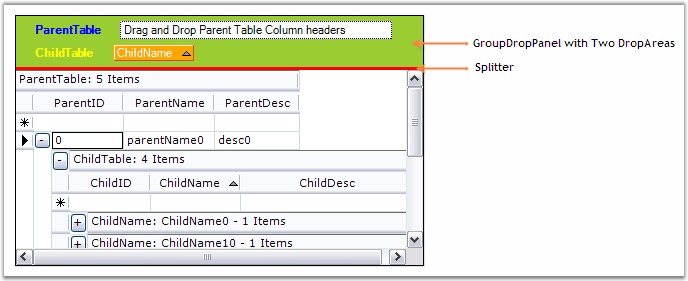{border="0"}

[]{style="FONT-FAMILY: 'Trebuchet MS','sans-serif'; COLOR: #15428b; FONT-SIZE: 9pt"} 

*[Figure ]{style="FONT-SIZE: 9pt"}[278]{style="FONT-SIZE: 9pt"}[: Formatting the Group Drop Area by using the PreviewViewStyleInfo Event]{style="FONT-SIZE: 9pt"}*

 

[]{#p419} 

 

###### 4.3.4.3.1.2 GroupByOptions {#groupbyoptions style="tab-stops: 0pt"}

[]{style="FONT-FAMILY: 'Trebuchet MS','sans-serif'; COLOR: #15428b; FONT-SIZE: 9pt"} 

Grid Grouping control provides a number of options that allows you to control the look and behavior of the groups. You can control the caption text, where and if AddNew row will be displayed and whether captions, headers, footers, preview rows and summaries will be displayed.

 

**The GridGroupOptionsStyleInfo class**

 

The **GridGroupOptionsStyleInfo** class, derives **StyleInfoBase**, defines the properties to control the look and feel of the groups. A grouping grid distinguishes between three different kinds of group options which are listed below.

[]{style="FONT-SIZE: 8pt"} 

::: {align="center"}
  ------------------------- ---------------------------------------------------------------------------
  Group Option              Description
  TopLevelGroupOptions      Lets you control the look & behavior of top level group.
  ChildGroupOptions         Lets you control the look & behavior of child groups.
  NestedTableGroupOptions   Lets you control the look & behavior of groups in nested child relations.
  ------------------------- ---------------------------------------------------------------------------
:::

**[]{style="COLOR: #4a5c8c; FONT-SIZE: 9pt"}** 

Properties for the Group Options

 

[The table below describes the properties defined in the GridGroupOptionsStyleInfo class. These properties are available for all kinds of Group Options.]{style="FONT-SIZE: 9pt"}

[]{style="FONT-SIZE: 8pt"} 

::: {align="center"}
  ------------------------------- --------------------------------------------------------------------------------------------------------------
  Group Option                    Description
  CaptionText                     Lets you control the caption text that is displayed.
  ShowCaption                     Indicates whether a caption row is visible.
  ShowCaptionPlusMinus            Indicates whether a plus/minus cell is to be displayed next to the caption.
  ShowAddNewBeforeDetails         When true, AddNew record is shown at the top of a group.
  ShowAddNewAfterDetails          When true, AddNew record is shown at the bottom of a group.
  ShowColumnHeaders               Indicates whether the column headers are visible.
  ShowEmptyGroups                 Indicates whether a preview is visible when the group is collapsed.
  ShowGroupHeader                 Indicates whether a header is visible.
  ShowGroupFooter                 Indicates whether a footer is visible.
  ShowGroupPreview                Indicates whether a preview is visible when the group is collapsed.
  ShowSummaries                   Indicates whether summaries are visible.
  ShowGroupSummaryWhenCollapsed   Indicates whether summary items are visible when the group is collapsed.
  ShowFilterBar                   Indicates whether a filter bar is visible.
  ShowStackedHeaders              Indicates whether the stacked headers are visible.
  ShowGroupIndentAsCoveredRange   Indicates whether to treat all the indent cells for a group as a single covered cell.
  ShowCaptionSummaryCells         Indicates whether a group caption should display summaries in columns instead of only one large caption bar.
  ------------------------------- --------------------------------------------------------------------------------------------------------------
:::

[]{style="FONT-SIZE: 8pt"} 

[Next chapter]{.UGHyperlink}[ ]{style="FONT-SIZE: 8pt"}in this section discuss these properties in detail with a suitable example.

 

[]{#p420} 

 

[]{#_Working_with_Group}4.3.4.3.1.2.1      Working with Group Elements

[]{style="FONT-FAMILY: 'Trebuchet MS','sans-serif'; COLOR: #15428b; FONT-SIZE: 9pt"} 

This section explores the various properties that can be used to manipulate the different group elements.

[]{style="FONT-FAMILY: 'Verdana','sans-serif'; FONT-SIZE: 8pt"} 

**Group Headers and Footers**

**[]{style="FONT-FAMILY: 'Verdana','sans-serif'; COLOR: #4a5c8c"}** 

The headers and footers of a group can be used to display any information that is common to all the elements of that group. You can toggle the display of these headers and footers, by using the below given boolean properties.

[]{style="FONT-SIZE: 8pt"} 

[·      ]{style="FONT-FAMILY: Symbol"}\<GroupOptions\>.ShowGroupHeader

[·      ]{style="FONT-FAMILY: Symbol"}\<GroupOptions\>.ShowGroupFooter

[]{style="FONT-SIZE: 8pt"} 

where the **\<GroupOptions\>** can be any one of the following: **TopLevelGroupOptions** to affect only the top most group, **ChildGroupOptions** to affect the child groups or **NestedTableGroupOptions** to affect the groups in nested tables.

 

You can also able to set the header / footer attributes such as HeaderSectionHeight and FooterSectionHeight, by using the below given properties.

[]{style="FONT-SIZE: 8pt"} 

[·      ]{style="FONT-FAMILY: Symbol"}TableOptions.GroupHeaderSectionHeight

[·      ]{style="FONT-FAMILY: Symbol"}TableOptions.GroupFooterSectionHeight

[]{style="FONT-SIZE: 8pt"} 

Group headers and footers can be populated by handling the **QueryCellStyleInfo** event wherein you can check for the Header / Footer cell type and provide the data.

[]{style="FONT-FAMILY: 'Trebuchet MS','sans-serif'; COLOR: #15428b; FONT-SIZE: 9pt"} 

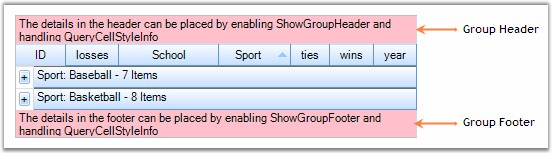{border="0"}

[]{style="FONT-FAMILY: 'Trebuchet MS','sans-serif'; COLOR: #15428b; FONT-SIZE: 9pt"} 

*[Figure ]{style="FONT-SIZE: 9pt"}[279]{style="FONT-SIZE: 9pt"}[: Group Header and Footer]{style="FONT-SIZE: 9pt"}*

[]{style="FONT-FAMILY: 'Trebuchet MS','sans-serif'; COLOR: #15428b; FONT-SIZE: 9pt"} 

GroupPreviewRows

[]{style="FONT-SIZE: 9pt"} 

[GroupPreviewSection is the suitable place when you want to display memo fields or add custom notes for a given group. It can be enabled by setting the]{style="FONT-SIZE: 9pt"}[ ]{style="FONT-FAMILY: 'Verdana','sans-serif'; FONT-SIZE: 8pt"}[\<GroupOptions\>.ShowGroupPreview property to True. You can adjust the size of the preview row through the TableOptions.GroupPreviewSectionHeight property. The QueryCellStyleInfo event can be used to populate the preview rows.]{style="FONT-SIZE: 9pt"}

[]{style="FONT-FAMILY: 'Trebuchet MS','sans-serif'; COLOR: #15428b; FONT-SIZE: 9pt"} 

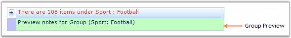{border="0"}

***[]{style="FONT-FAMILY: 'Trebuchet MS','sans-serif'; COLOR: #15428b; FONT-SIZE: 9pt"}*** 

*[Figure ]{style="FONT-SIZE: 9pt"}[280]{style="FONT-SIZE: 9pt"}[: Group Preview Section]{style="FONT-SIZE: 9pt"}*

[]{style="FONT-FAMILY: 'Trebuchet MS','sans-serif'; COLOR: #15428b; FONT-SIZE: 9pt"} 

AddNew Records

[]{style="FONT-FAMILY: 'Verdana','sans-serif'; COLOR: #4a5c8c; FONT-SIZE: 9pt"} 

[Each group can optionally have an AddNew row where you can provide the values for a new record. Once a new record is entered, the record will be sorted into the existing record set and will be assigned a group\'s category automatically. The visibility of the AddNewRecord can be controlled through the following two boolean properties.]{style="FONT-SIZE: 9pt"}

[]{style="FONT-SIZE: 8pt"} 

[·      ]{style="FONT-FAMILY: Symbol"}\<GroupOptions\>.ShowAddNewRecordBeforeDetails - adds the AddNew row at the top of a group.

[·      ]{style="FONT-FAMILY: Symbol"}\<GroupOptions\>.ShowAddNewRecordAfterDetails - adds the AddNew row at the bottom of a group.

[]{style="FONT-FAMILY: 'Trebuchet MS','sans-serif'; COLOR: #15428b; FONT-SIZE: 9pt"} 

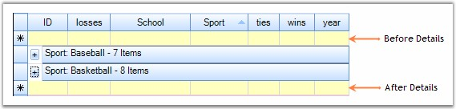{border="0"}

***[]{style="FONT-FAMILY: 'Trebuchet MS','sans-serif'; COLOR: #15428b; FONT-SIZE: 9pt"}*** 

*[Figure ]{style="FONT-SIZE: 9pt"}[281]{style="FONT-SIZE: 9pt"}[: AddNew Rows ]{style="FONT-SIZE: 9pt"}*

[]{style="FONT-FAMILY: 'Trebuchet MS','sans-serif'; COLOR: #15428b; FONT-SIZE: 9pt"} 

GroupCaptionSection

[]{style="FONT-FAMILY: 'Verdana','sans-serif'; COLOR: #4a5c8c; FONT-SIZE: 9pt"} 

[This is the first section within a group that provides a caption bar above the column headers. The GroupCaptionRows are unbound rows that are created only to combine the records into a group. By default, they display the group category and the number of items in that group. The following properties can be used to control the CaptionSection display.]{style="FONT-SIZE: 9pt"}

[]{style="FONT-SIZE: 8pt"} 

[·      ]{style="FONT-FAMILY: Symbol"}**\<GroupOptions\>.ShowCaption** - enables the display of caption section; True by default.

[·      ]{style="FONT-FAMILY: Symbol"}**\<GroupOptions\>.CaptionText** - used to get / set the caption text.

[]{style="FONT-FAMILY: 'Trebuchet MS','sans-serif'; COLOR: #15428b; FONT-SIZE: 9pt"} 

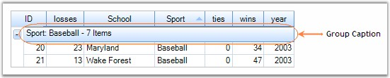{border="0"}

***[]{style="FONT-FAMILY: 'Trebuchet MS','sans-serif'; COLOR: #15428b; FONT-SIZE: 9pt"}*** 

*[Figure ]{style="FONT-SIZE: 9pt"}[282]{style="FONT-SIZE: 9pt"}[: Group Caption Section ]{style="FONT-SIZE: 9pt"}*

 

**CaptionText Tokens**

 

The following table lists the available token formats for **\<GroupOptions\>.CaptionText**.

**[]{style="FONT-SIZE: 8pt"}** 

::: {align="center"}
  ------------------- -------------------------------------------------------------------------------------
  Token               Description
  {TableName}         Displays the CaptionSection.ParentTableDescriptor.Name.
  {CategoryName}      Displays the CaptionSection.ParentGroup.Name.
  {CategoryCaption}   Displays the Header Text of the column that this group belongs to.
  {Category}          Displays the CaptionSection.ParentGroup.Category.
  {RecordCount}       Displays the CaptionSection.ParentGroup.GetFilteredRecordCount().
  Summary Tokens      Allows you to display any item you enter as a Summary Column. See discussion below.
  ------------------- -------------------------------------------------------------------------------------
:::

**[]{style="FONT-SIZE: 8pt"}** 

Custom Summary Tokens

[Any summary item you add can be included in the CaptionText. You have the option of hiding summaries, so it is possible to add summaries only for the purpose of displaying values in the CaptionText. If you have added a summary row named Row1, and a Summary columns named Column1, then you can also use the value of this summary item in the caption with the token {Row1.Column1}. ]{style="FONT-SIZE: 9pt"}

[]{style="FONT-FAMILY: 'Verdana','sans-serif'; FONT-SIZE: 8pt"} 

Example

[]{style="FONT-FAMILY: 'Verdana','sans-serif'; COLOR: navy; FONT-SIZE: 9pt"} 

[Here is a sample implementation that illustrates the usage of the above properties.]{style="FONT-SIZE: 9pt"}

[]{style="FONT-FAMILY: 'Trebuchet MS','sans-serif'; FONT-SIZE: 9pt"} 

5.   Set up a Grid Grouping control and bind a data source into it.

 

6.   Setup the necessary Group Options as required.

[]{style="FONT-FAMILY: 'Trebuchet MS','sans-serif'; FONT-SIZE: 9pt"} 

+---------------------------------------------------------------------------------------------------------------------------------------------------------------------------------------------------------------------------------------------------+
| **[\[C#\]]{style="FONT-FAMILY: 'Courier New'; COLOR: black"}**                                                                                                                                                                                    |
|                                                                                                                                                                                                                                                   |
| []{style="FONT-FAMILY: 'Courier New'; COLOR: black"}                                                                                                                                                                                              |
|                                                                                                                                                                                                                                                   |
| [// Group Options Settings.]{style="FONT-FAMILY: 'Courier New'; COLOR: green"}                                                                                                                                                                    |
|                                                                                                                                                                                                                                                   |
| [this]{style="FONT-FAMILY: 'Courier New'; COLOR: blue"}[.gridGroupingControl1.ShowGroupDropArea = [true]{style="COLOR: blue"};]{style="FONT-FAMILY: 'Courier New'"}                                                                               |
|                                                                                                                                                                                                                                                   |
| [this]{style="FONT-FAMILY: 'Courier New'; COLOR: blue"}[.gridGroupingControl1.TopLevelGroupOptions.ShowGroupHeader = [true]{style="COLOR: blue"};]{style="FONT-FAMILY: 'Courier New'"}                                                            |
|                                                                                                                                                                                                                                                   |
| [this]{style="FONT-FAMILY: 'Courier New'; COLOR: blue"}[.gridGroupingControl1.TopLevelGroupOptions.ShowGroupFooter = [true]{style="COLOR: blue"};]{style="FONT-FAMILY: 'Courier New'"}                                                            |
|                                                                                                                                                                                                                                                   |
| [this]{style="FONT-FAMILY: 'Courier New'; COLOR: blue"}[.gridGroupingControl1.TopLevelGroupOptions.ShowCaption = [true]{style="COLOR: blue"};]{style="FONT-FAMILY: 'Courier New'"}                                                                |
|                                                                                                                                                                                                                                                   |
| [this]{style="FONT-FAMILY: 'Courier New'; COLOR: blue"}[.gridGroupingControl1.TopLevelGroupOptions.ShowGroupPreview = [true]{style="COLOR: blue"};]{style="FONT-FAMILY: 'Courier New'"}                                                           |
|                                                                                                                                                                                                                                                   |
| [this]{style="FONT-FAMILY: 'Courier New'; COLOR: blue"}[.gridGroupingControl1.ChildGroupOptions.ShowGroupPreview = [true]{style="COLOR: blue"};]{style="FONT-FAMILY: 'Courier New'"}                                                              |
|                                                                                                                                                                                                                                                   |
| [this]{style="FONT-FAMILY: 'Courier New'; COLOR: blue"}[.gridGroupingControl1.TableOptions.GroupFooterSectionHeight = 30;]{style="FONT-FAMILY: 'Courier New'"}                                                                                    |
|                                                                                                                                                                                                                                                   |
| [this]{style="FONT-FAMILY: 'Courier New'; COLOR: blue"}[.gridGroupingControl1.TableOptions.GroupHeaderSectionHeight = 30;]{style="FONT-FAMILY: 'Courier New'"}                                                                                    |
|                                                                                                                                                                                                                                                   |
| [this]{style="FONT-FAMILY: 'Courier New'; COLOR: blue"}[.gridGroupingControl1.TableOptions.GroupPreviewSectionHeight = 25;]{style="FONT-FAMILY: 'Courier New'"}                                                                                   |
|                                                                                                                                                                                                                                                   |
| [this]{style="FONT-FAMILY: 'Courier New'; COLOR: blue"}[.gridGroupingControl1.TopLevelGroupOptions.ShowAddNewRecordBeforeDetails = [true]{style="COLOR: blue"};]{style="FONT-FAMILY: 'Courier New'"}                                              |
|                                                                                                                                                                                                                                                   |
| [this]{style="FONT-FAMILY: 'Courier New'; COLOR: blue"}[.gridGroupingControl1.TopLevelGroupOptions.ShowAddNewRecordAfterDetails = [true]{style="COLOR: blue"};]{style="FONT-FAMILY: 'Courier New'"}                                               |
|                                                                                                                                                                                                                                                   |
| [this]{style="FONT-FAMILY: 'Courier New'; COLOR: blue"}[.gridGroupingControl1.ChildGroupOptions.CaptionText = [\"There are {RecordCount} items under {CategoryName} : {Category}\"]{style="COLOR: #a31515"};]{style="FONT-FAMILY: 'Courier New'"} |
+---------------------------------------------------------------------------------------------------------------------------------------------------------------------------------------------------------------------------------------------------+

[]{style="FONT-FAMILY: 'Trebuchet MS','sans-serif'; COLOR: #15428b; FONT-SIZE: 9pt"} 

+------------------------------------------------------------------------------------------------------------------------------------------------------------------------------------------------------------------------------------------------+
| **[\[VB.NET\]]{style="FONT-FAMILY: 'Courier New'; COLOR: black"}**                                                                                                                                                                             |
|                                                                                                                                                                                                                                                |
| []{style="FONT-FAMILY: 'Courier New'; COLOR: green"}                                                                                                                                                                                           |
|                                                                                                                                                                                                                                                |
| [\' Group Options Settings.]{style="FONT-FAMILY: 'Courier New'; COLOR: green"}                                                                                                                                                                 |
|                                                                                                                                                                                                                                                |
| [Me]{style="FONT-FAMILY: 'Courier New'; COLOR: blue"}[.gridGroupingControl1.ShowGroupDropArea = [True]{style="COLOR: blue"}]{style="FONT-FAMILY: 'Courier New'"}                                                                               |
|                                                                                                                                                                                                                                                |
| [Me]{style="FONT-FAMILY: 'Courier New'; COLOR: blue"}[.gridGroupingControl1.TopLevelGroupOptions.ShowGroupHeader = [True]{style="COLOR: blue"}]{style="FONT-FAMILY: 'Courier New'"}                                                            |
|                                                                                                                                                                                                                                                |
| [Me]{style="FONT-FAMILY: 'Courier New'; COLOR: blue"}[.gridGroupingControl1.TopLevelGroupOptions.ShowGroupFooter = [True]{style="COLOR: blue"}]{style="FONT-FAMILY: 'Courier New'"}                                                            |
|                                                                                                                                                                                                                                                |
| [Me]{style="FONT-FAMILY: 'Courier New'; COLOR: blue"}[.gridGroupingControl1.TopLevelGroupOptions.ShowCaption = [True]{style="COLOR: blue"}]{style="FONT-FAMILY: 'Courier New'"}                                                                |
|                                                                                                                                                                                                                                                |
| [Me]{style="FONT-FAMILY: 'Courier New'; COLOR: blue"}[.gridGroupingControl1.TopLevelGroupOptions.ShowGroupPreview = [True]{style="COLOR: blue"}]{style="FONT-FAMILY: 'Courier New'"}                                                           |
|                                                                                                                                                                                                                                                |
| [Me]{style="FONT-FAMILY: 'Courier New'; COLOR: blue"}[.gridGroupingControl1.ChildGroupOptions.ShowGroupPreview = [True]{style="COLOR: blue"}]{style="FONT-FAMILY: 'Courier New'"}                                                              |
|                                                                                                                                                                                                                                                |
| [Me]{style="FONT-FAMILY: 'Courier New'; COLOR: blue"}[.gridGroupingControl1.TableOptions.GroupFooterSectionHeight = 30]{style="FONT-FAMILY: 'Courier New'"}                                                                                    |
|                                                                                                                                                                                                                                                |
| [Me]{style="FONT-FAMILY: 'Courier New'; COLOR: blue"}[.gridGroupingControl1.TableOptions.GroupHeaderSectionHeight = 30]{style="FONT-FAMILY: 'Courier New'"}                                                                                    |
|                                                                                                                                                                                                                                                |
| [Me]{style="FONT-FAMILY: 'Courier New'; COLOR: blue"}[.gridGroupingControl1.TableOptions.GroupPreviewSectionHeight = 25]{style="FONT-FAMILY: 'Courier New'"}                                                                                   |
|                                                                                                                                                                                                                                                |
| [Me]{style="FONT-FAMILY: 'Courier New'; COLOR: blue"}[.gridGroupingControl1.TopLevelGroupOptions.ShowAddNewRecordBeforeDetails = [True]{style="COLOR: blue"}]{style="FONT-FAMILY: 'Courier New'"}                                              |
|                                                                                                                                                                                                                                                |
| [Me]{style="FONT-FAMILY: 'Courier New'; COLOR: blue"}[.gridGroupingControl1.TopLevelGroupOptions.ShowAddNewRecordAfterDetails = [True]{style="COLOR: blue"}]{style="FONT-FAMILY: 'Courier New'"}                                               |
|                                                                                                                                                                                                                                                |
| [Me]{style="FONT-FAMILY: 'Courier New'; COLOR: blue"}[.gridGroupingControl1.ChildGroupOptions.CaptionText = [\"There are {RecordCount} items under {CategoryName} : {Category}\"]{style="COLOR: #a31515"}]{style="FONT-FAMILY: 'Courier New'"} |
+------------------------------------------------------------------------------------------------------------------------------------------------------------------------------------------------------------------------------------------------+

[]{style="FONT-FAMILY: 'Trebuchet MS','sans-serif'; COLOR: #15428b; FONT-SIZE: 9pt"} 

7.   Handle the QueryCellStyleInfo event to manipulate the group elements.

[]{style="FONT-SIZE: 8pt"} 

+--------------------------------------------------------------------------------------------------------------------------------------------------------------------------------------------------------------------------------------------------------------------------------------------+
| **[\[C#\]]{style="FONT-FAMILY: 'Courier New'; COLOR: black"}**                                                                                                                                                                                                                             |
|                                                                                                                                                                                                                                                                                            |
| []{style="FONT-FAMILY: 'Courier New'; COLOR: black"}                                                                                                                                                                                                                                       |
|                                                                                                                                                                                                                                                                                            |
| [this]{style="FONT-FAMILY: 'Courier New'; COLOR: blue"}[.gridGroupingControl1.QueryCellStyleInfo += [new]{style="COLOR: blue"} [GridTableCellStyleInfoEventHandler]{style="COLOR: #2b91af"}(gridGroupingControl1_QueryCellStyleInfo);]{style="FONT-FAMILY: 'Courier New'"}                 |
|                                                                                                                                                                                                                                                                                            |
| []{style="FONT-FAMILY: 'Courier New'"}                                                                                                                                                                                                                                                     |
|                                                                                                                                                                                                                                                                                            |
| [void]{style="FONT-FAMILY: 'Courier New'; COLOR: blue"}[ gridGroupingControl1_QueryCellStyleInfo([object]{style="COLOR: blue"} sender, [GridTableCellStyleInfoEventArgs]{style="COLOR: #2b91af"} e)]{style="FONT-FAMILY: 'Courier New'"}                                                   |
|                                                                                                                                                                                                                                                                                            |
| [{]{style="FONT-FAMILY: 'Courier New'"}                                                                                                                                                                                                                                                    |
|                                                                                                                                                                                                                                                                                            |
| [    [if]{style="COLOR: blue"} (e.TableCellIdentity.TableCellType == [GridTableCellType]{style="COLOR: #2b91af"}.GroupFooterSectionCell \|\| e.TableCellIdentity.TableCellType == [GridTableCellType]{style="COLOR: #2b91af"}.GroupHeaderSectionCell)]{style="FONT-FAMILY: 'Courier New'"} |
|                                                                                                                                                                                                                                                                                            |
| [    {]{style="FONT-FAMILY: 'Courier New'"}                                                                                                                                                                                                                                                |
|                                                                                                                                                                                                                                                                                            |
| [        e.Style.Enabled = [false]{style="COLOR: blue"};]{style="FONT-FAMILY: 'Courier New'"}                                                                                                                                                                                              |
|                                                                                                                                                                                                                                                                                            |
| [        [if]{style="COLOR: blue"} (e.TableCellIdentity.TableCellType == [GridTableCellType]{style="COLOR: #2b91af"}.GroupFooterSectionCell)]{style="FONT-FAMILY: 'Courier New'"}                                                                                                          |
|                                                                                                                                                                                                                                                                                            |
| [        e.Style.Text = [\"The details in the footer can be placed by enabling ShowGroupFooter and handling QueryCellStyleInfo\"]{style="COLOR: #a31515"};]{style="FONT-FAMILY: 'Courier New'"}                                                                                            |
|                                                                                                                                                                                                                                                                                            |
| [        [if]{style="COLOR: blue"} (e.TableCellIdentity.TableCellType == [GridTableCellType]{style="COLOR: #2b91af"}.GroupHeaderSectionCell)]{style="FONT-FAMILY: 'Courier New'"}                                                                                                          |
|                                                                                                                                                                                                                                                                                            |
| [        e.Style.Text = [\"The details in the header can be placed by enabling ShowGroupHeader and handling QueryCellStyleInfo\"]{style="COLOR: #a31515"};]{style="FONT-FAMILY: 'Courier New'"}                                                                                            |
|                                                                                                                                                                                                                                                                                            |
| [    }]{style="FONT-FAMILY: 'Courier New'"}                                                                                                                                                                                                                                                |
|                                                                                                                                                                                                                                                                                            |
| []{style="FONT-FAMILY: 'Courier New'"}                                                                                                                                                                                                                                                     |
|                                                                                                                                                                                                                                                                                            |
| [    [if]{style="COLOR: blue"} (e.TableCellIdentity.TableCellType == [GridTableCellType]{style="COLOR: #2b91af"}.GroupPreviewCell)]{style="FONT-FAMILY: 'Courier New'"}                                                                                                                    |
|                                                                                                                                                                                                                                                                                            |
| [    {]{style="FONT-FAMILY: 'Courier New'"}                                                                                                                                                                                                                                                |
|                                                                                                                                                                                                                                                                                            |
| [        [Element]{style="COLOR: #2b91af"} el = e.TableCellIdentity.DisplayElement;]{style="FONT-FAMILY: 'Courier New'"}                                                                                                                                                                   |
|                                                                                                                                                                                                                                                                                            |
| [        e.Style.CellValue = [\"Preview notes for Group (\"]{style="COLOR: #a31515"} + el.ParentGroup.Name + [\": \"]{style="COLOR: #a31515"} + el.ParentGroup.Category.ToString() + [\")\"]{style="COLOR: #a31515"};]{style="FONT-FAMILY: 'Courier New'"}                                 |
|                                                                                                                                                                                                                                                                                            |
| [    }]{style="FONT-FAMILY: 'Courier New'"}                                                                                                                                                                                                                                                |
|                                                                                                                                                                                                                                                                                            |
| [}]{style="FONT-FAMILY: 'Courier New'"}                                                                                                                                                                                                                                                    |
+--------------------------------------------------------------------------------------------------------------------------------------------------------------------------------------------------------------------------------------------------------------------------------------------+

[]{style="FONT-FAMILY: 'Trebuchet MS','sans-serif'; COLOR: #15428b; FONT-SIZE: 9pt"} 

+-----------------------------------------------------------------------------------------------------------------------------------------------------------------------------------------------------------------------------------------------------------------------------------------------------------------------------------------------------------------------------------------------------------------------------------+
| **[\[VB.NET\]]{style="FONT-FAMILY: 'Courier New'; COLOR: black"}**                                                                                                                                                                                                                                                                                                                                                                |
|                                                                                                                                                                                                                                                                                                                                                                                                                                   |
| []{style="FONT-FAMILY: 'Courier New'; COLOR: black"}                                                                                                                                                                                                                                                                                                                                                                              |
|                                                                                                                                                                                                                                                                                                                                                                                                                                   |
| [Private]{style="FONT-FAMILY: 'Courier New'; COLOR: blue"}[ [Sub]{style="COLOR: blue"} gridGroupingControl1_QueryCellStyleInfo([ByVal]{style="COLOR: blue"} sender [As]{style="COLOR: blue"} [Object]{style="COLOR: blue"}, [ByVal]{style="COLOR: blue"} e [As]{style="COLOR: blue"} GridTableCellStyleInfoEventArgs) [Handles]{style="COLOR: blue"} gridGroupingControl1.QueryCellStyleInfo]{style="FONT-FAMILY: 'Courier New'"} |
|                                                                                                                                                                                                                                                                                                                                                                                                                                   |
| []{style="FONT-FAMILY: 'Courier New'"}                                                                                                                                                                                                                                                                                                                                                                                            |
|                                                                                                                                                                                                                                                                                                                                                                                                                                   |
| [If]{style="FONT-FAMILY: 'Courier New'; COLOR: blue"}[ e.TableCellIdentity.TableCellType = GridTableCellType.GroupFooterSectionCell [OrElse]{style="COLOR: blue"} e.TableCellIdentity.TableCellType = GridTableCellType.GroupHeaderSectionCell [Then]{style="COLOR: blue"}]{style="FONT-FAMILY: 'Courier New'"}                                                                                                                   |
|                                                                                                                                                                                                                                                                                                                                                                                                                                   |
| [e.Style.Enabled = [False]{style="COLOR: blue"}]{style="FONT-FAMILY: 'Courier New'"}                                                                                                                                                                                                                                                                                                                                              |
|                                                                                                                                                                                                                                                                                                                                                                                                                                   |
| [If]{style="FONT-FAMILY: 'Courier New'; COLOR: blue"}[ e.TableCellIdentity.TableCellType = GridTableCellType.GroupFooterSectionCell [Then]{style="COLOR: blue"}]{style="FONT-FAMILY: 'Courier New'"}                                                                                                                                                                                                                              |
|                                                                                                                                                                                                                                                                                                                                                                                                                                   |
| [e.Style.Text = [\"The details in the footer can be placed by enabling ShowGroupFooter and handling QueryCellStyleInfo\"]{style="COLOR: #a31515"}]{style="FONT-FAMILY: 'Courier New'"}                                                                                                                                                                                                                                            |
|                                                                                                                                                                                                                                                                                                                                                                                                                                   |
| [End]{style="FONT-FAMILY: 'Courier New'; COLOR: blue"}[ [If]{style="COLOR: blue"}]{style="FONT-FAMILY: 'Courier New'"}                                                                                                                                                                                                                                                                                                            |
|                                                                                                                                                                                                                                                                                                                                                                                                                                   |
| [If]{style="FONT-FAMILY: 'Courier New'; COLOR: blue"}[ e.TableCellIdentity.TableCellType = GridTableCellType.GroupHeaderSectionCell [Then]{style="COLOR: blue"}]{style="FONT-FAMILY: 'Courier New'"}                                                                                                                                                                                                                              |
|                                                                                                                                                                                                                                                                                                                                                                                                                                   |
| [e.Style.Text = [\"The details in the header can be placed by enabling ShowGroupHeader and handling QueryCellStyleInfo\"]{style="COLOR: #a31515"}]{style="FONT-FAMILY: 'Courier New'"}                                                                                                                                                                                                                                            |
|                                                                                                                                                                                                                                                                                                                                                                                                                                   |
| [End]{style="FONT-FAMILY: 'Courier New'; COLOR: blue"}[ [If]{style="COLOR: blue"}]{style="FONT-FAMILY: 'Courier New'"}                                                                                                                                                                                                                                                                                                            |
|                                                                                                                                                                                                                                                                                                                                                                                                                                   |
| [End]{style="FONT-FAMILY: 'Courier New'; COLOR: blue"}[ [If]{style="COLOR: blue"}]{style="FONT-FAMILY: 'Courier New'"}                                                                                                                                                                                                                                                                                                            |
|                                                                                                                                                                                                                                                                                                                                                                                                                                   |
| []{style="FONT-FAMILY: 'Courier New'; COLOR: blue"}                                                                                                                                                                                                                                                                                                                                                                               |
|                                                                                                                                                                                                                                                                                                                                                                                                                                   |
| [If]{style="FONT-FAMILY: 'Courier New'; COLOR: blue"}[ e.TableCellIdentity.TableCellType = GridTableCellType.GroupPreviewCell [Then]{style="COLOR: blue"}]{style="FONT-FAMILY: 'Courier New'"}                                                                                                                                                                                                                                    |
|                                                                                                                                                                                                                                                                                                                                                                                                                                   |
| [Dim]{style="FONT-FAMILY: 'Courier New'; COLOR: blue"}[ el [As]{style="COLOR: blue"} Element = e.TableCellIdentity.DisplayElement]{style="FONT-FAMILY: 'Courier New'"}                                                                                                                                                                                                                                                            |
|                                                                                                                                                                                                                                                                                                                                                                                                                                   |
| [e.Style.CellValue = [\"Preview notes for Group (\"]{style="COLOR: #a31515"} & el.ParentGroup.Name & [\": \"]{style="COLOR: #a31515"} & el.ParentGroup.Category.ToString() & [\")\"]{style="COLOR: #a31515"}]{style="FONT-FAMILY: 'Courier New'"}                                                                                                                                                                                 |
|                                                                                                                                                                                                                                                                                                                                                                                                                                   |
| [End]{style="FONT-FAMILY: 'Courier New'; COLOR: blue"}[ [If]{style="COLOR: blue"}]{style="FONT-FAMILY: 'Courier New'"}                                                                                                                                                                                                                                                                                                            |
|                                                                                                                                                                                                                                                                                                                                                                                                                                   |
| [End]{style="FONT-FAMILY: 'Courier New'; COLOR: blue"}[ [Sub]{style="COLOR: blue"}]{style="FONT-FAMILY: 'Courier New'"}                                                                                                                                                                                                                                                                                                           |
+-----------------------------------------------------------------------------------------------------------------------------------------------------------------------------------------------------------------------------------------------------------------------------------------------------------------------------------------------------------------------------------------------------------------------------------+

[]{style="FONT-FAMILY: 'Trebuchet MS','sans-serif'; COLOR: #15428b; FONT-SIZE: 9pt"} 

8.   You can control the appearance of different group elements by using the **Appearance** property.

[]{style="FONT-FAMILY: 'Trebuchet MS','sans-serif'; COLOR: #15428b; FONT-SIZE: 9pt"} 

+---------------------------------------------------------------------------------------------------------------------------------------------------------------------------------------------------------------------------------------------------------------+
| **[\[C#\]]{style="FONT-FAMILY: 'Courier New'; COLOR: black"}**                                                                                                                                                                                                |
|                                                                                                                                                                                                                                                               |
| []{style="FONT-FAMILY: 'Courier New'; COLOR: black"}                                                                                                                                                                                                          |
|                                                                                                                                                                                                                                                               |
| [this]{style="FONT-FAMILY: 'Courier New'; COLOR: blue"}[.gridGroupingControl1.Appearance.AddNewRecordFieldCell.Interior = [new]{style="COLOR: blue"} BrushInfo([Color]{style="COLOR: #2b91af"}.FromArgb(255, 255, 192));]{style="FONT-FAMILY: 'Courier New'"} |
|                                                                                                                                                                                                                                                               |
| [this]{style="FONT-FAMILY: 'Courier New'; COLOR: blue"}[.gridGroupingControl1.Appearance.GroupCaptionCell.Interior = [new]{style="COLOR: blue"} BrushInfo([SystemColors]{style="COLOR: #2b91af"}.Control);]{style="FONT-FAMILY: 'Courier New'"}               |
|                                                                                                                                                                                                                                                               |
| [this]{style="FONT-FAMILY: 'Courier New'; COLOR: blue"}[.gridGroupingControl1.Appearance.GroupCaptionCell.TextColor = [Color]{style="COLOR: #2b91af"}.FromArgb(192, 64, 0);]{style="FONT-FAMILY: 'Courier New'"}                                              |
|                                                                                                                                                                                                                                                               |
| [this]{style="FONT-FAMILY: 'Courier New'; COLOR: blue"}[.gridGroupingControl1.Appearance.GroupFooterSectionCell.Interior = [new]{style="COLOR: blue"} BrushInfo([Color]{style="COLOR: #2b91af"}.Pink);]{style="FONT-FAMILY: 'Courier New'"}                   |
|                                                                                                                                                                                                                                                               |
| [this]{style="FONT-FAMILY: 'Courier New'; COLOR: blue"}[.gridGroupingControl1.Appearance.GroupHeaderSectionCell.Interior = [new]{style="COLOR: blue"} BrushInfo([Color]{style="COLOR: #2b91af"}.Pink);]{style="FONT-FAMILY: 'Courier New'"}                   |
|                                                                                                                                                                                                                                                               |
| [this]{style="FONT-FAMILY: 'Courier New'; COLOR: blue"}[.gridGroupingControl1.Appearance.GroupIndentCell.Interior = [new]{style="COLOR: blue"} BrushInfo([Color]{style="COLOR: #2b91af"}.FromArgb(192, 192, 255));]{style="FONT-FAMILY: 'Courier New'"}       |
|                                                                                                                                                                                                                                                               |
| [this]{style="FONT-FAMILY: 'Courier New'; COLOR: blue"}[.gridGroupingControl1.Appearance.GroupPreviewCell.Interior = [new]{style="COLOR: blue"} BrushInfo([Color]{style="COLOR: #2b91af"}.FromArgb(192, 255, 192));]{style="FONT-FAMILY: 'Courier New'"}      |
+---------------------------------------------------------------------------------------------------------------------------------------------------------------------------------------------------------------------------------------------------------------+

[]{style="FONT-FAMILY: 'Trebuchet MS','sans-serif'; COLOR: #15428b; FONT-SIZE: 9pt"} 

+----------------------------------------------------------------------------------------------------------------------------------------------------------------------------------------------------------------------------------+
| **[\[VB.NET\]]{style="FONT-FAMILY: 'Courier New'; COLOR: black"}**                                                                                                                                                               |
|                                                                                                                                                                                                                                  |
| []{style="FONT-FAMILY: 'Courier New'; COLOR: black"}                                                                                                                                                                             |
|                                                                                                                                                                                                                                  |
| [Me]{style="FONT-FAMILY: 'Courier New'; COLOR: blue"}[.gridGroupingControl1.Appearance.AddNewRecordFieldCell.Interior = [New]{style="COLOR: blue"} BrushInfo(Color.FromArgb(255, 255, 192))]{style="FONT-FAMILY: 'Courier New'"} |
|                                                                                                                                                                                                                                  |
| [Me]{style="FONT-FAMILY: 'Courier New'; COLOR: blue"}[.gridGroupingControl1.Appearance.GroupCaptionCell.Interior = [New]{style="COLOR: blue"} BrushInfo(SystemColors.Control)]{style="FONT-FAMILY: 'Courier New'"}               |
|                                                                                                                                                                                                                                  |
| [Me]{style="FONT-FAMILY: 'Courier New'; COLOR: blue"}[.gridGroupingControl1.Appearance.GroupCaptionCell.TextColor = Color.FromArgb(192, 64, 0)]{style="FONT-FAMILY: 'Courier New'"}                                              |
|                                                                                                                                                                                                                                  |
| [Me]{style="FONT-FAMILY: 'Courier New'; COLOR: blue"}[.gridGroupingControl1.Appearance.GroupFooterSectionCell.Interior = [New]{style="COLOR: blue"} BrushInfo(Color.Pink)]{style="FONT-FAMILY: 'Courier New'"}                   |
|                                                                                                                                                                                                                                  |
| [Me]{style="FONT-FAMILY: 'Courier New'; COLOR: blue"}[.gridGroupingControl1.Appearance.GroupHeaderSectionCell.Interior = [New]{style="COLOR: blue"} BrushInfo(Color.Pink)]{style="FONT-FAMILY: 'Courier New'"}                   |
|                                                                                                                                                                                                                                  |
| [Me]{style="FONT-FAMILY: 'Courier New'; COLOR: blue"}[.gridGroupingControl1.Appearance.GroupIndentCell.Interior = [New]{style="COLOR: blue"} BrushInfo(Color.FromArgb(192, 192, 255))]{style="FONT-FAMILY: 'Courier New'"}       |
|                                                                                                                                                                                                                                  |
| [Me]{style="FONT-FAMILY: 'Courier New'; COLOR: blue"}[.gridGroupingControl1.Appearance.GroupPreviewCell.Interior = [New]{style="COLOR: blue"} BrushInfo(Color.FromArgb(192, 255, 192))]{style="FONT-FAMILY: 'Courier New'"}      |
+----------------------------------------------------------------------------------------------------------------------------------------------------------------------------------------------------------------------------------+

[]{style="FONT-FAMILY: 'Trebuchet MS','sans-serif'; COLOR: #15428b; FONT-SIZE: 9pt"} 

9.   Run the sample and group the table against any data column. Here is a sample screen shot that shows the grouped grid against \'Sport\' column.

[]{style="FONT-FAMILY: 'Trebuchet MS','sans-serif'; COLOR: #15428b; FONT-SIZE: 9pt"} 

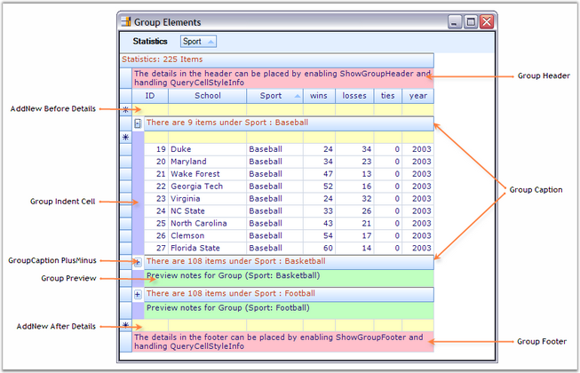{border="0"}

***[]{style="FONT-FAMILY: 'Trebuchet MS','sans-serif'; COLOR: #15428b; FONT-SIZE: 9pt"}*** 

*[Figure ]{style="FONT-SIZE: 9pt"}[283]{style="FONT-SIZE: 9pt"}[: Manipulation and Customization of Group Elements]{style="FONT-SIZE: 9pt"}*

[]{style="FONT-FAMILY: 'Trebuchet MS','sans-serif'; COLOR: #15428b; FONT-SIZE: 9pt"} 

::: {style="BORDER-BOTTOM: windowtext 1pt solid; BORDER-LEFT: medium none; PADDING-BOTTOM: 1pt; MARGIN-TOP: 9pt; PADDING-LEFT: 0pt; PADDING-RIGHT: 0pt; MARGIN-BOTTOM: 9pt; BORDER-TOP: windowtext 1pt solid; BORDER-RIGHT: medium none; PADDING-TOP: 1pt"}
{border="0"}Note: For more details, refer the following browser samples:
:::

::: {style="BORDER-BOTTOM: windowtext 1pt solid; BORDER-LEFT: medium none; PADDING-BOTTOM: 1pt; MARGIN: 9pt 0pt 9pt 18pt; PADDING-LEFT: 0pt; PADDING-RIGHT: 0pt; BORDER-TOP: windowtext 1pt solid; BORDER-RIGHT: medium none; PADDING-TOP: 1pt"}
***[·    ]{style="FONT-FAMILY: Symbol"}***\<Install Location\>\\Syncfusion\\EssentialStudio\\\[Version Number\]\\Windows\\Grid.Grouping.Windows\\Samples\\2.0\\Grouping Grid Options\\Top-Level-Group Options Demo

***[·    ]{style="FONT-FAMILY: Symbol"}***\<Install Location\>\\Syncfusion\\EssentialStudio\\\[Version Number\]\\Windows\\Grid.Grouping.Windows\\Samples\\2.0\\Grouping Grid Options\\Child-Group Options Demo

***[·    ]{style="FONT-FAMILY: Symbol"}***\<Install Location\>\\Syncfusion\\EssentialStudio\\\[Version Number\]\\Window\\Grid.Grouping.Windows\\Samples\\2.0\\Grouping Grid Options\\Nested-Table Group Options Demo
:::

 

[]{#p421} 

 

4.3.4.3.1.2.2      Working with Groups

[]{style="FONT-FAMILY: 'Trebuchet MS','sans-serif'; COLOR: #15428b; FONT-SIZE: 9pt"} 

This section best demonstrates how to work with the group rows and also shows how the groups are organized into a grouping grid. The Grouping Grid architecture can be viewed as a binary where the different grid elements like group rows, summary rows, filter rows, etc. form the nodes of the tree having the data records at the bottom as leaf nodes. A group can be a final node with records or it can be a node with nested groups rooting a sub tree.

 

This lesson will guide you the ways to access the individual groups in a collection, to retrieve all the groups, to expand/collapse groups and will discuss some of the properties and events used to process the groups.

 

**Expanding/Collapsing Groups**

 

All the groups can be expanded as well as collapsed at once by calling the respective methods, **Table.ExpandAllGroups** and **Table.CollapseAllGroups**. To expand or collapse a specific group, set **Group.IsExpanded** property to true or false respectively. Following code example illustrates this.

[]{style="FONT-FAMILY: 'Trebuchet MS','sans-serif'; COLOR: #15428b; FONT-SIZE: 9pt"} 

+-----------------------------------------------------------------------------------------------------------------------------------------------------------------------------------------------+
| **[\[C#\]]{style="FONT-FAMILY: 'Courier New'; COLOR: black"}**                                                                                                                                |
|                                                                                                                                                                                               |
| []{style="FONT-FAMILY: 'Courier New'; COLOR: black"}                                                                                                                                          |
|                                                                                                                                                                                               |
| [// Expands all groups.]{style="FONT-FAMILY: 'Courier New'; COLOR: green"}                                                                                                                    |
|                                                                                                                                                                                               |
| [this]{style="FONT-FAMILY: 'Courier New'; COLOR: blue"}[.gridGroupingControl1.Table.ExpandAllGroups();]{style="FONT-FAMILY: 'Courier New'"}                                                   |
|                                                                                                                                                                                               |
| []{style="FONT-FAMILY: 'Courier New'; COLOR: green"}                                                                                                                                          |
|                                                                                                                                                                                               |
| [// Collapse all groups.]{style="FONT-FAMILY: 'Courier New'; COLOR: green"}                                                                                                                   |
|                                                                                                                                                                                               |
| [this]{style="FONT-FAMILY: 'Courier New'; COLOR: blue"}[.gridGroupingControl1.Table.CollapseAllGroups();]{style="FONT-FAMILY: 'Courier New'"}                                                 |
|                                                                                                                                                                                               |
| []{style="FONT-FAMILY: 'Courier New'; COLOR: green"}                                                                                                                                          |
|                                                                                                                                                                                               |
| [// Expand the group with index 3.]{style="FONT-FAMILY: 'Courier New'; COLOR: green"}                                                                                                         |
|                                                                                                                                                                                               |
| [this]{style="FONT-FAMILY: 'Courier New'; COLOR: blue"}[.gridGroupingControl1.Table.TopLevelGroup.Groups\[3\].IsExpanded = [true]{style="COLOR: blue"};]{style="FONT-FAMILY: 'Courier New'"}  |
|                                                                                                                                                                                               |
| []{style="FONT-FAMILY: 'Courier New'; COLOR: green"}                                                                                                                                          |
|                                                                                                                                                                                               |
| [// Collapse the group with index 4.]{style="FONT-FAMILY: 'Courier New'; COLOR: green"}                                                                                                       |
|                                                                                                                                                                                               |
| [this]{style="FONT-FAMILY: 'Courier New'; COLOR: blue"}[.gridGroupingControl1.Table.TopLevelGroup.Groups\[4\].IsExpanded = [false]{style="COLOR: blue"};]{style="FONT-FAMILY: 'Courier New'"} |
+-----------------------------------------------------------------------------------------------------------------------------------------------------------------------------------------------+

[]{style="FONT-FAMILY: 'Trebuchet MS','sans-serif'; COLOR: #15428b; FONT-SIZE: 9pt"} 

+------------------------------------------------------------------------------------------------------------------------------------------------------------------------------------------+
| **[\[VB.NET\]]{style="FONT-FAMILY: 'Courier New'; COLOR: black"}**                                                                                                                       |
|                                                                                                                                                                                          |
| []{style="FONT-FAMILY: 'Courier New'; COLOR: black"}                                                                                                                                     |
|                                                                                                                                                                                          |
| []{style="FONT-FAMILY: 'Courier New'; COLOR: black"}                                                                                                                                     |
|                                                                                                                                                                                          |
| [\' Expands all groups.]{style="FONT-FAMILY: 'Courier New'; COLOR: green"}                                                                                                               |
|                                                                                                                                                                                          |
| [Me]{style="FONT-FAMILY: 'Courier New'; COLOR: blue"}[.gridGroupingControl1.Table.ExpandAllGroups()]{style="FONT-FAMILY: 'Courier New'"}                                                 |
|                                                                                                                                                                                          |
| []{style="FONT-FAMILY: 'Courier New'; COLOR: green"}                                                                                                                                     |
|                                                                                                                                                                                          |
| [\' Collapse all groups.]{style="FONT-FAMILY: 'Courier New'; COLOR: green"}                                                                                                              |
|                                                                                                                                                                                          |
| [Me]{style="FONT-FAMILY: 'Courier New'; COLOR: blue"}[.gridGroupingControl1.Table.CollapseAllGroups()]{style="FONT-FAMILY: 'Courier New'"}                                               |
|                                                                                                                                                                                          |
| []{style="FONT-FAMILY: 'Courier New'; COLOR: green"}                                                                                                                                     |
|                                                                                                                                                                                          |
| [\' Expand the group with index 3.]{style="FONT-FAMILY: 'Courier New'; COLOR: green"}                                                                                                    |
|                                                                                                                                                                                          |
| [Me]{style="FONT-FAMILY: 'Courier New'; COLOR: blue"}[.gridGroupingControl1.Table.TopLevelGroup.Groups(3).IsExpanded = [True]{style="COLOR: blue"}]{style="FONT-FAMILY: 'Courier New'"}  |
|                                                                                                                                                                                          |
| []{style="FONT-FAMILY: 'Courier New'; COLOR: green"}                                                                                                                                     |
|                                                                                                                                                                                          |
| [\' Collapse the group with index 4.]{style="FONT-FAMILY: 'Courier New'; COLOR: green"}                                                                                                  |
|                                                                                                                                                                                          |
| [Me]{style="FONT-FAMILY: 'Courier New'; COLOR: blue"}[.gridGroupingControl1.Table.TopLevelGroup.Groups(4).IsExpanded = [False]{style="COLOR: blue"}]{style="FONT-FAMILY: 'Courier New'"} |
+------------------------------------------------------------------------------------------------------------------------------------------------------------------------------------------+

[]{style="FONT-SIZE: 8pt"} 

Accessing a Given Group

 

The Table.TopLevelGroup.Groups collection maintains the details of the individual groups in this collection which can be used to retrieve the details of any group.

[]{style="FONT-SIZE: 9pt"} 

Below code lets you access the details of a group with the category Sport. It also defines a method named IterateGroup that is used to iterate through the records and also the nested groups in a given group. It provides you with the group details such as the level of the group, number of items in that group, its category, and so on.

[]{style="FONT-SIZE: 9pt"} 

Accessing all the groups

 

Table.TopLevelGroup is the main topmost group in a grouping grid. It forms the root node of the group hierarchy where its categorized records and the nested groups form the child nodes. To access all the groups, you can make use of the same IterateThrough method by passing the TopLevelGroup as the method parameter. Then this method will loop through the categorized records and nested groups of the top level group and will print the details of all the groups.

[]{style="FONT-SIZE: 8pt"} 

+---------------------------------------------------------------------------------------------------------------------------------------------------------------------------------------------------------------------------+
| **[\[C#\]]{style="FONT-FAMILY: 'Courier New'; COLOR: black"}**                                                                                                                                                            |
|                                                                                                                                                                                                                           |
| []{style="FONT-FAMILY: 'Courier New'; COLOR: black"}                                                                                                                                                                      |
|                                                                                                                                                                                                                           |
| [// Call IterateThrough method for a given group.]{style="FONT-FAMILY: 'Courier New'; COLOR: green"}                                                                                                                      |
|                                                                                                                                                                                                                           |
| [Group]{style="FONT-FAMILY: 'Courier New'; COLOR: #2b91af"}[ g = [this]{style="COLOR: blue"}.gridGroupingControl1.Table.TopLevelGroup.Groups\[[\"Sport\"]{style="COLOR: #a31515"}\];]{style="FONT-FAMILY: 'Courier New'"} |
|                                                                                                                                                                                                                           |
| [IterateGroup(g);]{style="FONT-FAMILY: 'Courier New'"}                                                                                                                                                                    |
|                                                                                                                                                                                                                           |
| []{style="FONT-FAMILY: 'Courier New'"}                                                                                                                                                                                    |
|                                                                                                                                                                                                                           |
| [// Call IterateThrough method for all the groups in a grid table.]{style="FONT-FAMILY: 'Courier New'; COLOR: green"}                                                                                                     |
|                                                                                                                                                                                                                           |
| [IterateGroup([this]{style="COLOR: blue"}.gridGroupingControl1.Table.TopLevelGroup);]{style="FONT-FAMILY: 'Courier New'"}                                                                                                 |
|                                                                                                                                                                                                                           |
| []{style="FONT-FAMILY: 'Courier New'"}                                                                                                                                                                                    |
|                                                                                                                                                                                                                           |
| [// IterateThrough method iterates through the records and the nested groups.]{style="FONT-FAMILY: 'Courier New'; COLOR: green"}                                                                                          |
|                                                                                                                                                                                                                           |
| [public]{style="FONT-FAMILY: 'Courier New'; COLOR: blue"}[ [void]{style="COLOR: blue"} IterateThrough([Group]{style="COLOR: #2b91af"} g)]{style="FONT-FAMILY: 'Courier New'"}                                             |
|                                                                                                                                                                                                                           |
| [{]{style="FONT-FAMILY: 'Courier New'"}                                                                                                                                                                                   |
|                                                                                                                                                                                                                           |
| [    System.Diagnostics.[Trace]{style="COLOR: #2b91af"}.WriteLine([\"GroupLevel = \"]{style="COLOR: #a31515"}+g.GroupLevel);]{style="FONT-FAMILY: 'Courier New'"}                                                         |
|                                                                                                                                                                                                                           |
| [    System.Diagnostics.[Trace]{style="COLOR: #2b91af"}.WriteLine(g.Info);]{style="FONT-FAMILY: 'Courier New'"}                                                                                                           |
|                                                                                                                                                                                                                           |
| [    [foreach]{style="COLOR: blue"}([Record]{style="COLOR: #2b91af"} r [in]{style="COLOR: blue"} g.Records)]{style="FONT-FAMILY: 'Courier New'"}                                                                          |
|                                                                                                                                                                                                                           |
| [    {]{style="FONT-FAMILY: 'Courier New'"}                                                                                                                                                                               |
|                                                                                                                                                                                                                           |
| [        System.Diagnostics.[Trace]{style="COLOR: #2b91af"}.WriteLine(r.Info);]{style="FONT-FAMILY: 'Courier New'"}                                                                                                       |
|                                                                                                                                                                                                                           |
| [    }]{style="FONT-FAMILY: 'Courier New'"}                                                                                                                                                                               |
|                                                                                                                                                                                                                           |
| []{style="FONT-FAMILY: 'Courier New'"}                                                                                                                                                                                    |
|                                                                                                                                                                                                                           |
| [    [foreach]{style="COLOR: blue"}([Group]{style="COLOR: #2b91af"} gr [in]{style="COLOR: blue"} g.Groups)]{style="FONT-FAMILY: 'Courier New'"}                                                                           |
|                                                                                                                                                                                                                           |
| [    {]{style="FONT-FAMILY: 'Courier New'"}                                                                                                                                                                               |
|                                                                                                                                                                                                                           |
| [        IterateGroup(gr);]{style="FONT-FAMILY: 'Courier New'"}                                                                                                                                                           |
|                                                                                                                                                                                                                           |
| [    }]{style="FONT-FAMILY: 'Courier New'"}                                                                                                                                                                               |
|                                                                                                                                                                                                                           |
| [}]{style="FONT-FAMILY: 'Courier New'"}                                                                                                                                                                                   |
+---------------------------------------------------------------------------------------------------------------------------------------------------------------------------------------------------------------------------+

[]{style="FONT-FAMILY: 'Trebuchet MS','sans-serif'; COLOR: #15428b; FONT-SIZE: 9pt"} 

+-----------------------------------------------------------------------------------------------------------------------------------------------------------------------------------------------------------+
| **[\[VB.NET\]]{style="FONT-FAMILY: 'Courier New'; COLOR: black"}**                                                                                                                                        |
|                                                                                                                                                                                                           |
| []{style="FONT-FAMILY: 'Courier New'; COLOR: black"}                                                                                                                                                      |
|                                                                                                                                                                                                           |
| [\' Call IterateThrough method for a given group.]{style="FONT-FAMILY: 'Courier New'; COLOR: green"}                                                                                                      |
|                                                                                                                                                                                                           |
| [Dim ]{style="FONT-FAMILY: 'Courier New'; COLOR: blue"}[g[ As ]{style="COLOR: blue"}Group]{style="FONT-FAMILY: 'Courier New'"}                                                                            |
|                                                                                                                                                                                                           |
| [g =[ Me]{style="COLOR: blue"}.gridGroupingControl1.Table.TopLevelGroup.Groups([\"Sport\"]{style="COLOR: #a31515"})]{style="FONT-FAMILY: 'Courier New'"}                                                  |
|                                                                                                                                                                                                           |
| [IterateThrough(g)]{style="FONT-FAMILY: 'Courier New'"}                                                                                                                                                   |
|                                                                                                                                                                                                           |
| []{style="FONT-FAMILY: 'Courier New'"}                                                                                                                                                                    |
|                                                                                                                                                                                                           |
| [\' Call IterateThrough method for all the groups in a grid table.]{style="FONT-FAMILY: 'Courier New'; COLOR: green"}                                                                                     |
|                                                                                                                                                                                                           |
| [IterateThrough([Me]{style="COLOR: blue"}.gridGroupingControl1.Table.TopLevelGroup)]{style="FONT-FAMILY: 'Courier New'"}                                                                                  |
|                                                                                                                                                                                                           |
| []{style="FONT-FAMILY: 'Courier New'"}                                                                                                                                                                    |
|                                                                                                                                                                                                           |
| [\'IterateThrough method iterates through the records and the nested groups.]{style="FONT-FAMILY: 'Courier New'; COLOR: green"}                                                                           |
|                                                                                                                                                                                                           |
| [Public]{style="FONT-FAMILY: 'Courier New'; COLOR: blue"}[ [Sub]{style="COLOR: blue"} IterateThrough([ByVal]{style="COLOR: blue"} g [As]{style="COLOR: blue"} Group)]{style="FONT-FAMILY: 'Courier New'"} |
|                                                                                                                                                                                                           |
| [System.Diagnostics.Trace.WriteLine([\"GroupLevel = \"]{style="COLOR: #a31515"}+ g.GroupLevel.ToString())]{style="FONT-FAMILY: 'Courier New'"}                                                            |
|                                                                                                                                                                                                           |
| [System.Diagnostics.Trace.WriteLine(g.Info)]{style="FONT-FAMILY: 'Courier New'"}                                                                                                                          |
|                                                                                                                                                                                                           |
| [For]{style="FONT-FAMILY: 'Courier New'; COLOR: blue"}[ [Each]{style="COLOR: blue"} r [As]{style="COLOR: blue"} Record [In]{style="COLOR: blue"} g.Records]{style="FONT-FAMILY: 'Courier New'"}           |
|                                                                                                                                                                                                           |
| [System.Diagnostics.Trace.WriteLine(r.Info)]{style="FONT-FAMILY: 'Courier New'"}                                                                                                                          |
|                                                                                                                                                                                                           |
| [Next]{style="FONT-FAMILY: 'Courier New'; COLOR: blue"}[ r]{style="FONT-FAMILY: 'Courier New'"}                                                                                                           |
|                                                                                                                                                                                                           |
| [For]{style="FONT-FAMILY: 'Courier New'; COLOR: blue"}[ [Each]{style="COLOR: blue"} gr [As]{style="COLOR: blue"} Group [In]{style="COLOR: blue"} g.Groups]{style="FONT-FAMILY: 'Courier New'"}            |
|                                                                                                                                                                                                           |
| [IterateThrough(gr)]{style="FONT-FAMILY: 'Courier New'"}                                                                                                                                                  |
|                                                                                                                                                                                                           |
| [Next]{style="FONT-FAMILY: 'Courier New'; COLOR: blue"}[ gr]{style="FONT-FAMILY: 'Courier New'"}                                                                                                          |
|                                                                                                                                                                                                           |
| [End]{style="FONT-FAMILY: 'Courier New'; COLOR: blue"}[ [Sub]{style="COLOR: blue"}]{style="FONT-FAMILY: 'Courier New'"}                                                                                   |
+-----------------------------------------------------------------------------------------------------------------------------------------------------------------------------------------------------------+

[]{style="FONT-FAMILY: 'Trebuchet MS','sans-serif'; COLOR: #15428b; FONT-SIZE: 9pt"} 

Accessing the group for a given record

 

It is the grid.Table object that provides access to the records and the grouped elements. The Table.Records collection returns a read only collection of the data records. The following code can be used to get access to the group for a particular record. Record.ParentGroup property is used to obtain the group that a record belongs to.

[]{style="FONT-SIZE: 8pt"} 

+-------------------------------------------------------------------------------------------------------------------------------------------------------------------------------------------+
| **[\[C#\]]{style="FONT-FAMILY: 'Courier New'; COLOR: black"}**                                                                                                                            |
|                                                                                                                                                                                           |
| []{style="FONT-FAMILY: 'Courier New'; COLOR: black"}                                                                                                                                      |
|                                                                                                                                                                                           |
| [System.Diagnostics.[Trace]{style="COLOR: #2b91af"}.WriteLine([this]{style="COLOR: blue"}.gridGroupingControl1.Table.Records\[3\].ParentGroup.Info);]{style="FONT-FAMILY: 'Courier New'"} |
+-------------------------------------------------------------------------------------------------------------------------------------------------------------------------------------------+

[]{style="FONT-FAMILY: 'Trebuchet MS','sans-serif'; COLOR: #15428b; FONT-SIZE: 9pt"} 

+------------------------------------------------------------------------------------------------------------------------------------------------------------+
| **[\[VB.NET\]]{style="FONT-FAMILY: 'Courier New'; COLOR: black"}**                                                                                         |
|                                                                                                                                                            |
| []{style="FONT-FAMILY: 'Courier New'; COLOR: black"}                                                                                                       |
|                                                                                                                                                            |
| [System.Diagnostics.Trace.WriteLine([Me]{style="COLOR: blue"}.gridGroupingControl1.Table.Records(3).ParentGroup.Info)]{style="FONT-FAMILY: 'Courier New'"} |
+------------------------------------------------------------------------------------------------------------------------------------------------------------+

 

[]{#p422} 

 

4.3.4.3.1.2.3      Events

[]{style="FONT-FAMILY: 'Trebuchet MS','sans-serif'; COLOR: #15428b; FONT-SIZE: 9pt"} 

This section discusses some of the important events that could be handled to catch the grouping actions. Below is a list of such events.

**[]{style="FONT-FAMILY: 'Trebuchet MS','sans-serif'; COLOR: #15428b; FONT-SIZE: 9pt"}** 

::: {align="center"}
  ------------------------- --------------------------------------------------------
  Event                     Description
  GroupedColumns_Changing   Occurs before a property in the collection is changed.
  GroupedColumns_Changed    Occurs after a property in the collection was changed.
  GroupExpanding            Occurs before a group is expanded.
  GroupExpanded             Occurs after a group was expanded.
  GroupCollapsing           Occurs before a group is collapsed.
  GroupCollapsed            Occurs after a group was collapsed.
  SortingItemsInGroup       Occurs before the records for a group are sorted.
  SortedItemsInGroup        Occurs after the records for a group were sorted.
  ------------------------- --------------------------------------------------------
:::

**[]{style="COLOR: #4a5c8c; FONT-SIZE: 9pt"}** 

Example

[]{style="FONT-FAMILY: 'Verdana','sans-serif'; COLOR: #4a5c8c"} 

The GroupedColumns Changing/Changed events get fired when the list is modified i.e. when any item is added, removed or modified. It accepts an argument of type ListPropertyChangedEventArgs that lets you check the reason for a list change. The reason could be of ItemAdded, ItemInserted, ItemRemoved, ItemModified, ItemMoved, ItemPropertyChanged or the whole collection is modified.

 

The following code examples show you how to capture the events.\
\
[]{style="FONT-FAMILY: 'Verdana','sans-serif'; FONT-SIZE: 8pt"}

+----------------------------------------------------------------------------------------------------------------------------------------------------------------------------------------------------------------------------------------------------+
| **[\[C#\]]{style="FONT-FAMILY: 'Courier New'; COLOR: black"}**                                                                                                                                                                                     |
|                                                                                                                                                                                                                                                    |
| []{style="FONT-FAMILY: 'Courier New'; COLOR: black"}                                                                                                                                                                                               |
|                                                                                                                                                                                                                                                    |
| [// Subscribe to the events.]{style="FONT-FAMILY: 'Courier New'; COLOR: green"}                                                                                                                                                                    |
|                                                                                                                                                                                                                                                    |
| [this]{style="FONT-FAMILY: 'Courier New'; COLOR: blue"}[.gridGroupingControl1.TableDescriptor.GroupedColumns.Changing += [new]{style="COLOR: blue"} ListPropertyChangedEventHandler(GroupedColumns_Changing);]{style="FONT-FAMILY: 'Courier New'"} |
|                                                                                                                                                                                                                                                    |
| [this]{style="FONT-FAMILY: 'Courier New'; COLOR: blue"}[.gridGroupingControl1.TableDescriptor.GroupedColumns.Changed += [new]{style="COLOR: blue"} ListPropertyChangedEventHandler(GroupedColumns_Changed);]{style="FONT-FAMILY: 'Courier New'"}   |
|                                                                                                                                                                                                                                                    |
| []{style="FONT-FAMILY: 'Courier New'"}                                                                                                                                                                                                             |
|                                                                                                                                                                                                                                                    |
| [// Event Handlers.]{style="FONT-FAMILY: 'Courier New'; COLOR: green"}                                                                                                                                                                             |
|                                                                                                                                                                                                                                                    |
| [// GroupedColumns_Changing event.]{style="FONT-FAMILY: 'Courier New'; COLOR: green"}                                                                                                                                                              |
|                                                                                                                                                                                                                                                    |
| [void]{style="FONT-FAMILY: 'Courier New'; COLOR: blue"}[ GroupedColumns_Changing([object]{style="COLOR: blue"} sender, ListPropertyChangedEventArgs e)]{style="FONT-FAMILY: 'Courier New'"}                                                        |
|                                                                                                                                                                                                                                                    |
| [{]{style="FONT-FAMILY: 'Courier New'"}                                                                                                                                                                                                            |
|                                                                                                                                                                                                                                                    |
| [SortColumnDescriptor]{style="FONT-FAMILY: 'Courier New'; COLOR: #2b91af"}[ scd = e.Item [as]{style="COLOR: blue"} [SortColumnDescriptor]{style="COLOR: #2b91af"};]{style="FONT-FAMILY: 'Courier New'"}                                            |
|                                                                                                                                                                                                                                                    |
| [if]{style="FONT-FAMILY: 'Courier New'; COLOR: blue"}[ (e.Action == Syncfusion.Collections.[ListPropertyChangedType]{style="COLOR: #2b91af"}.Insert)]{style="FONT-FAMILY: 'Courier New'"}                                                          |
|                                                                                                                                                                                                                                                    |
| [Console]{style="FONT-FAMILY: 'Courier New'; COLOR: #2b91af"}[.WriteLine([\"Column Added - {0}\"]{style="COLOR: #a31515"}, scd.Name);]{style="FONT-FAMILY: 'Courier New'"}                                                                         |
|                                                                                                                                                                                                                                                    |
| [}]{style="FONT-FAMILY: 'Courier New'"}                                                                                                                                                                                                            |
|                                                                                                                                                                                                                                                    |
| []{style="FONT-FAMILY: 'Courier New'; COLOR: green"}                                                                                                                                                                                               |
|                                                                                                                                                                                                                                                    |
| [// GroupedColumns_Changed event.]{style="FONT-FAMILY: 'Courier New'; COLOR: green"}                                                                                                                                                               |
|                                                                                                                                                                                                                                                    |
| [void]{style="FONT-FAMILY: 'Courier New'; COLOR: blue"}[ GroupedColumns_Changed([object]{style="COLOR: blue"} sender, ListPropertyChangedEventArgs e)]{style="FONT-FAMILY: 'Courier New'"}                                                         |
|                                                                                                                                                                                                                                                    |
| [{]{style="FONT-FAMILY: 'Courier New'"}                                                                                                                                                                                                            |
|                                                                                                                                                                                                                                                    |
| [SortColumnDescriptor]{style="FONT-FAMILY: 'Courier New'; COLOR: #2b91af"}[ scd = e.Item [as]{style="COLOR: blue"} [SortColumnDescriptor]{style="COLOR: #2b91af"};]{style="FONT-FAMILY: 'Courier New'"}                                            |
|                                                                                                                                                                                                                                                    |
| [if]{style="FONT-FAMILY: 'Courier New'; COLOR: blue"}[ (e.Action == Syncfusion.Collections.[ListPropertyChangedType]{style="COLOR: #2b91af"}.Remove)]{style="FONT-FAMILY: 'Courier New'"}                                                          |
|                                                                                                                                                                                                                                                    |
| [Console]{style="FONT-FAMILY: 'Courier New'; COLOR: #2b91af"}[.WriteLine([\"Column Removed - {0}\"]{style="COLOR: #a31515"}, scd.Name);]{style="FONT-FAMILY: 'Courier New'"}                                                                       |
|                                                                                                                                                                                                                                                    |
| [}]{style="FONT-FAMILY: 'Courier New'"}                                                                                                                                                                                                            |
+----------------------------------------------------------------------------------------------------------------------------------------------------------------------------------------------------------------------------------------------------+

[]{style="FONT-FAMILY: 'Trebuchet MS','sans-serif'; COLOR: #15428b; FONT-SIZE: 9pt"} 

+-----------------------------------------------------------------------------------------------------------------------------------------------------------------------------------------------------------------------------------------------------------------------------------------------------------------------------------------+
| **[\[VB.NET\]]{style="FONT-FAMILY: 'Courier New'; COLOR: black"}**                                                                                                                                                                                                                                                                      |
|                                                                                                                                                                                                                                                                                                                                         |
| []{style="FONT-FAMILY: 'Courier New'; COLOR: green"}                                                                                                                                                                                                                                                                                    |
|                                                                                                                                                                                                                                                                                                                                         |
| [\' Subscribe to the events.]{style="FONT-FAMILY: 'Courier New'; COLOR: green"}                                                                                                                                                                                                                                                         |
|                                                                                                                                                                                                                                                                                                                                         |
| [AddHandler]{style="FONT-FAMILY: 'Courier New'; COLOR: blue"}[ gridGroupingControl1.TableDescriptor.GroupedColumns.Changing, [AddressOf]{style="COLOR: blue"} GroupedColumns_Changing]{style="FONT-FAMILY: 'Courier New'"}                                                                                                              |
|                                                                                                                                                                                                                                                                                                                                         |
| []{style="FONT-FAMILY: 'Courier New'; COLOR: blue"}                                                                                                                                                                                                                                                                                     |
|                                                                                                                                                                                                                                                                                                                                         |
| [\' Event Handlers.]{style="FONT-FAMILY: 'Courier New'; COLOR: green"}                                                                                                                                                                                                                                                                  |
|                                                                                                                                                                                                                                                                                                                                         |
| [\' GroupedColumns_Changing event.]{style="FONT-FAMILY: 'Courier New'; COLOR: green"}                                                                                                                                                                                                                                                   |
|                                                                                                                                                                                                                                                                                                                                         |
| [Private]{style="FONT-FAMILY: 'Courier New'; COLOR: blue"}[ [Sub]{style="COLOR: blue"} GroupedColumns_Changed([ByVal]{style="COLOR: blue"} sender [As]{style="COLOR: blue"} [Object]{style="COLOR: blue"}, [ByVal]{style="COLOR: blue"} e [As]{style="COLOR: blue"} ListPropertyChangedEventArgs)]{style="FONT-FAMILY: 'Courier New'"}  |
|                                                                                                                                                                                                                                                                                                                                         |
| [Dim]{style="FONT-FAMILY: 'Courier New'; COLOR: blue"}[ scd [As]{style="COLOR: blue"} SortColumnDescriptor = [CType]{style="COLOR: blue"}(e.Item, SortColumnDescriptor)]{style="FONT-FAMILY: 'Courier New'"}                                                                                                                            |
|                                                                                                                                                                                                                                                                                                                                         |
| [If]{style="FONT-FAMILY: 'Courier New'; COLOR: blue"}[ e.Action = ListPropertyChangedType.Insert [Then]{style="COLOR: blue"}]{style="FONT-FAMILY: 'Courier New'"}                                                                                                                                                                       |
|                                                                                                                                                                                                                                                                                                                                         |
| [Console.WriteLine([\"Column Added - {0}\"]{style="COLOR: #a31515"} + scd.Name)]{style="FONT-FAMILY: 'Courier New'"}                                                                                                                                                                                                                    |
|                                                                                                                                                                                                                                                                                                                                         |
| [End]{style="FONT-FAMILY: 'Courier New'; COLOR: blue"}[ [If]{style="COLOR: blue"}]{style="FONT-FAMILY: 'Courier New'"}                                                                                                                                                                                                                  |
|                                                                                                                                                                                                                                                                                                                                         |
| [End]{style="FONT-FAMILY: 'Courier New'; COLOR: blue"}[ [Sub]{style="COLOR: blue"}]{style="FONT-FAMILY: 'Courier New'"}                                                                                                                                                                                                                 |
|                                                                                                                                                                                                                                                                                                                                         |
| []{style="FONT-FAMILY: 'Courier New'; COLOR: blue"}                                                                                                                                                                                                                                                                                     |
|                                                                                                                                                                                                                                                                                                                                         |
| [\' GroupedColumns_Changed event.]{style="FONT-FAMILY: 'Courier New'; COLOR: green"}                                                                                                                                                                                                                                                    |
|                                                                                                                                                                                                                                                                                                                                         |
| [Private]{style="FONT-FAMILY: 'Courier New'; COLOR: blue"}[ [Sub]{style="COLOR: blue"} GroupedColumns_Changing([ByVal]{style="COLOR: blue"} sender [As]{style="COLOR: blue"} [Object]{style="COLOR: blue"}, [ByVal]{style="COLOR: blue"} e [As]{style="COLOR: blue"} ListPropertyChangedEventArgs)]{style="FONT-FAMILY: 'Courier New'"} |
|                                                                                                                                                                                                                                                                                                                                         |
| [Dim]{style="FONT-FAMILY: 'Courier New'; COLOR: blue"}[ scd [As]{style="COLOR: blue"} SortColumnDescriptor = [CType]{style="COLOR: blue"}(e.Item, SortColumnDescriptor)]{style="FONT-FAMILY: 'Courier New'"}                                                                                                                            |
|                                                                                                                                                                                                                                                                                                                                         |
| [If]{style="FONT-FAMILY: 'Courier New'; COLOR: blue"}[ e.Action = ListPropertyChangedType.Remove [Then]{style="COLOR: blue"}]{style="FONT-FAMILY: 'Courier New'"}                                                                                                                                                                       |
|                                                                                                                                                                                                                                                                                                                                         |
| [Console.WriteLine([\"Column Removed - {0}\"]{style="COLOR: #a31515"} + scd.Name)]{style="FONT-FAMILY: 'Courier New'"}                                                                                                                                                                                                                  |
|                                                                                                                                                                                                                                                                                                                                         |
| [End]{style="FONT-FAMILY: 'Courier New'; COLOR: blue"}[ [If]{style="COLOR: blue"}]{style="FONT-FAMILY: 'Courier New'"}                                                                                                                                                                                                                  |
|                                                                                                                                                                                                                                                                                                                                         |
| [End]{style="FONT-FAMILY: 'Courier New'; COLOR: blue"}[ [Sub]{style="COLOR: blue"}]{style="FONT-FAMILY: 'Courier New'"}                                                                                                                                                                                                                 |
+-----------------------------------------------------------------------------------------------------------------------------------------------------------------------------------------------------------------------------------------------------------------------------------------------------------------------------------------+

 

The[ ]{style="FONT-SIZE: 8pt"}[GroupExpanding]{.UGHyperlink}/[GroupExpanded]{.UGHyperlink} and [GroupCollapsing]{.UGHyperlink}/[GroupCollapsed]{.UGHyperlink} event handlers are best to use when you want to do some actions as a result of the group operations, GroupExpand and GroupCollapse.

 

The[ ]{.UGHyperlink}[SortingItemsInGroup]{.UGHyperlink} and [SortedItemsInGroup]{.UGHyperlink} events are raised when the records for a group are sorted. The grid should have at least one group for these events to occur. It does have no relationship with normal sorting. It occurs only when a grouped column is sorted.

 

**Tracking the changes in Nested Table**

[]{style="FONT-FAMILY: 'Verdana','sans-serif'; FONT-SIZE: 8pt"} 

It is possible to get notified of the changes in other table descriptor other than the default table. This can be achieved by listening to the **Engine.PropertyChanging** event and using the **GetNestedChildTableDescriptorEvent** method. This method lets you get the information about a change in the table descriptor of the nested child table. For example, when a column was changed in a nested table, the above method allows you to get the details such as the table descriptor of the affected table and the original EventArgs which was raised in response to the column changes(eg. ColumnsChanged event). Once you have the event data, you can then check for whether just the width of the column has changed or if other settings were changed.

 

Following code example illustrates the usage of this method.

[]{style="FONT-SIZE: 8pt"} 

+----------------------------------------------------------------------------------------------------------------------------------------------------------------------------------------------------------------------------------------------------------------------------------------------+
| **[\[C#\]]{style="FONT-FAMILY: 'Courier New'; COLOR: black"}**                                                                                                                                                                                                                               |
|                                                                                                                                                                                                                                                                                              |
| []{style="FONT-FAMILY: 'Courier New'; COLOR: black"}                                                                                                                                                                                                                                         |
|                                                                                                                                                                                                                                                                                              |
| [protected]{style="FONT-FAMILY: 'Courier New'; COLOR: blue"}[ [override]{style="COLOR: blue"} [void]{style="COLOR: blue"} Engine_PropertyChanging([object]{style="COLOR: blue"} sender, [DescriptorPropertyChangedEventArgs]{style="COLOR: #2b91af"} e)]{style="FONT-FAMILY: 'Courier New'"} |
|                                                                                                                                                                                                                                                                                              |
| [{]{style="FONT-FAMILY: 'Courier New'"}                                                                                                                                                                                                                                                      |
|                                                                                                                                                                                                                                                                                              |
| [if]{style="FONT-FAMILY: 'Courier New'; COLOR: blue"}[ (e.PropertyName == [\"TableDescriptor\"]{style="COLOR: #a31515"})]{style="FONT-FAMILY: 'Courier New'"}                                                                                                                                |
|                                                                                                                                                                                                                                                                                              |
| [{]{style="FONT-FAMILY: 'Courier New'"}                                                                                                                                                                                                                                                      |
|                                                                                                                                                                                                                                                                                              |
| [TableDescriptor]{style="FONT-FAMILY: 'Courier New'; COLOR: #2b91af"}[ tableDescriptor = (([Engine]{style="COLOR: #2b91af"}) sender).TableDescriptor;]{style="FONT-FAMILY: 'Courier New'"}                                                                                                   |
|                                                                                                                                                                                                                                                                                              |
| [e = ([DescriptorPropertyChangedEventArgs]{style="COLOR: #2b91af"}) e.Inner;]{style="FONT-FAMILY: 'Courier New'"}                                                                                                                                                                            |
|                                                                                                                                                                                                                                                                                              |
| []{style="FONT-FAMILY: 'Courier New'"}                                                                                                                                                                                                                                                       |
|                                                                                                                                                                                                                                                                                              |
| [if]{style="FONT-FAMILY: 'Courier New'; COLOR: blue"}[ (e.PropertyName == [\"Relations\"]{style="COLOR: #a31515"})]{style="FONT-FAMILY: 'Courier New'"}                                                                                                                                      |
|                                                                                                                                                                                                                                                                                              |
| [e = e.GetNestedChildTableDescriptorEvent([ref]{style="COLOR: blue"} tableDescriptor);]{style="FONT-FAMILY: 'Courier New'"}                                                                                                                                                                  |
|                                                                                                                                                                                                                                                                                              |
| []{style="FONT-FAMILY: 'Courier New'"}                                                                                                                                                                                                                                                       |
|                                                                                                                                                                                                                                                                                              |
| [if]{style="FONT-FAMILY: 'Courier New'; COLOR: blue"}[ (e.PropertyName == [\"Columns\"]{style="COLOR: #a31515"})]{style="FONT-FAMILY: 'Courier New'"}                                                                                                                                        |
|                                                                                                                                                                                                                                                                                              |
| [{]{style="FONT-FAMILY: 'Courier New'"}                                                                                                                                                                                                                                                      |
|                                                                                                                                                                                                                                                                                              |
| [ListPropertyChangedEventArgs le = (ListPropertyChangedEventArgs) e.Inner;]{style="FONT-FAMILY: 'Courier New'"}                                                                                                                                                                              |
|                                                                                                                                                                                                                                                                                              |
| [if]{style="FONT-FAMILY: 'Courier New'; COLOR: blue"}[ (le.Action == ListPropertyChangedType.ItemPropertyChanged)]{style="FONT-FAMILY: 'Courier New'"}                                                                                                                                       |
|                                                                                                                                                                                                                                                                                              |
| [{]{style="FONT-FAMILY: 'Courier New'"}                                                                                                                                                                                                                                                      |
|                                                                                                                                                                                                                                                                                              |
| [if]{style="FONT-FAMILY: 'Courier New'; COLOR: blue"}[ (le.Property == [\"Appearance\"]{style="COLOR: #a31515"} \|\| le.Property == [\"Width\"]{style="COLOR: #a31515"}]{style="FONT-FAMILY: 'Courier New'"}                                                                                 |
|                                                                                                                                                                                                                                                                                              |
| [\|\| le.Property == [\"ReadOnly\"]{style="COLOR: #a31515"} \|\| le.Property == [\"HeaderText\"]{style="COLOR: #a31515"}]{style="FONT-FAMILY: 'Courier New'"}                                                                                                                                |
|                                                                                                                                                                                                                                                                                              |
| [\|\| le.Action == ListPropertyChangedType.Remove]{style="FONT-FAMILY: 'Courier New'"}                                                                                                                                                                                                       |
|                                                                                                                                                                                                                                                                                              |
| [\|\| le.Action == ListPropertyChangedType.Move]{style="FONT-FAMILY: 'Courier New'"}                                                                                                                                                                                                         |
|                                                                                                                                                                                                                                                                                              |
| [\|\| le.Property == [\"AllowFilter\"]{style="COLOR: #a31515"})]{style="FONT-FAMILY: 'Courier New'"}                                                                                                                                                                                         |
|                                                                                                                                                                                                                                                                                              |
| [{]{style="FONT-FAMILY: 'Courier New'"}                                                                                                                                                                                                                                                      |
|                                                                                                                                                                                                                                                                                              |
| [return]{style="FONT-FAMILY: 'Courier New'; COLOR: blue"}[;]{style="FONT-FAMILY: 'Courier New'"}                                                                                                                                                                                             |
|                                                                                                                                                                                                                                                                                              |
| [}]{style="FONT-FAMILY: 'Courier New'"}                                                                                                                                                                                                                                                      |
|                                                                                                                                                                                                                                                                                              |
| [}]{style="FONT-FAMILY: 'Courier New'"}                                                                                                                                                                                                                                                      |
|                                                                                                                                                                                                                                                                                              |
| [}]{style="FONT-FAMILY: 'Courier New'"}                                                                                                                                                                                                                                                      |
|                                                                                                                                                                                                                                                                                              |
| [}]{style="FONT-FAMILY: 'Courier New'"}                                                                                                                                                                                                                                                      |
|                                                                                                                                                                                                                                                                                              |
| [else]{style="FONT-FAMILY: 'Courier New'; COLOR: blue"}[ [if]{style="COLOR: blue"} (e.PropertyName == [\"Appearance\"]{style="COLOR: #a31515"})]{style="FONT-FAMILY: 'Courier New'"}                                                                                                         |
|                                                                                                                                                                                                                                                                                              |
| [{]{style="FONT-FAMILY: 'Courier New'"}                                                                                                                                                                                                                                                      |
|                                                                                                                                                                                                                                                                                              |
| [// Base class will end edit mode, which is not necessary.]{style="FONT-FAMILY: 'Courier New'; COLOR: green"}                                                                                                                                                                                |
|                                                                                                                                                                                                                                                                                              |
| [return]{style="FONT-FAMILY: 'Courier New'; COLOR: blue"}[;]{style="FONT-FAMILY: 'Courier New'"}                                                                                                                                                                                             |
|                                                                                                                                                                                                                                                                                              |
| [}]{style="FONT-FAMILY: 'Courier New'"}                                                                                                                                                                                                                                                      |
|                                                                                                                                                                                                                                                                                              |
| [base]{style="FONT-FAMILY: 'Courier New'; COLOR: blue"}[.Engine_PropertyChanging (sender, e);]{style="FONT-FAMILY: 'Courier New'"}                                                                                                                                                           |
|                                                                                                                                                                                                                                                                                              |
| [}]{style="FONT-FAMILY: 'Courier New'"}                                                                                                                                                                                                                                                      |
+----------------------------------------------------------------------------------------------------------------------------------------------------------------------------------------------------------------------------------------------------------------------------------------------+

[]{style="FONT-FAMILY: 'Trebuchet MS','sans-serif'; COLOR: #15428b; FONT-SIZE: 9pt"} 

+------------------------------------------------------------------------------------------------------------------------------------------------------------------------------------------------------------------------------------------------------------------------------------------------------------------------------------------------------------------------------------------------------------------------------------------------------------------------------------------------------------------------------------------------------------------------------------------------------------------------------------------------------------------------------+
| **[\[VB.NET\]]{style="FONT-FAMILY: 'Courier New'; COLOR: black"}**                                                                                                                                                                                                                                                                                                                                                                                                                                                                                                                                                                                                           |
|                                                                                                                                                                                                                                                                                                                                                                                                                                                                                                                                                                                                                                                                              |
| []{style="FONT-FAMILY: 'Courier New'"}                                                                                                                                                                                                                                                                                                                                                                                                                                                                                                                                                                                                                                       |
|                                                                                                                                                                                                                                                                                                                                                                                                                                                                                                                                                                                                                                                                              |
| [Protected]{style="FONT-FAMILY: 'Courier New'; COLOR: blue"}[ [Overrides]{style="COLOR: blue"} [Sub]{style="COLOR: blue"} Engine_PropertyChanging([ByVal]{style="COLOR: blue"} sender [As]{style="COLOR: blue"} [Object]{style="COLOR: blue"}, [ByVal]{style="COLOR: blue"} e [As]{style="COLOR: blue"} DescriptorPropertyChangedEventArgs)]{style="FONT-FAMILY: 'Courier New'"}                                                                                                                                                                                                                                                                                             |
|                                                                                                                                                                                                                                                                                                                                                                                                                                                                                                                                                                                                                                                                              |
| [If]{style="FONT-FAMILY: 'Courier New'; COLOR: blue"}[ e.PropertyName = [\"TableDescriptor\"]{style="COLOR: #a31515"} [Then]{style="COLOR: blue"}]{style="FONT-FAMILY: 'Courier New'"}                                                                                                                                                                                                                                                                                                                                                                                                                                                                                       |
|                                                                                                                                                                                                                                                                                                                                                                                                                                                                                                                                                                                                                                                                              |
| [Dim]{style="FONT-FAMILY: 'Courier New'; COLOR: blue"}[ tableDescriptor [As]{style="COLOR: blue"} TableDescriptor = ([CType]{style="COLOR: blue"}(sender, Engine)).TableDescriptor]{style="FONT-FAMILY: 'Courier New'"}                                                                                                                                                                                                                                                                                                                                                                                                                                                      |
|                                                                                                                                                                                                                                                                                                                                                                                                                                                                                                                                                                                                                                                                              |
| [e = [CType]{style="COLOR: blue"}(e.Inner, DescriptorPropertyChangedEventArgs)]{style="FONT-FAMILY: 'Courier New'"}                                                                                                                                                                                                                                                                                                                                                                                                                                                                                                                                                          |
|                                                                                                                                                                                                                                                                                                                                                                                                                                                                                                                                                                                                                                                                              |
| []{style="FONT-FAMILY: 'Courier New'; COLOR: blue"}                                                                                                                                                                                                                                                                                                                                                                                                                                                                                                                                                                                                                          |
|                                                                                                                                                                                                                                                                                                                                                                                                                                                                                                                                                                                                                                                                              |
| [If]{style="FONT-FAMILY: 'Courier New'; COLOR: blue"}[ e.PropertyName = [\"Relations\"]{style="COLOR: #a31515"} [Then]{style="COLOR: blue"}]{style="FONT-FAMILY: 'Courier New'"}                                                                                                                                                                                                                                                                                                                                                                                                                                                                                             |
|                                                                                                                                                                                                                                                                                                                                                                                                                                                                                                                                                                                                                                                                              |
| [e = e.GetNestedChildTableDescriptorEvent(tableDescriptor)]{style="FONT-FAMILY: 'Courier New'"}                                                                                                                                                                                                                                                                                                                                                                                                                                                                                                                                                                              |
|                                                                                                                                                                                                                                                                                                                                                                                                                                                                                                                                                                                                                                                                              |
| [End]{style="FONT-FAMILY: 'Courier New'; COLOR: blue"}[ [If]{style="COLOR: blue"}]{style="FONT-FAMILY: 'Courier New'"}                                                                                                                                                                                                                                                                                                                                                                                                                                                                                                                                                       |
|                                                                                                                                                                                                                                                                                                                                                                                                                                                                                                                                                                                                                                                                              |
| []{style="FONT-FAMILY: 'Courier New'; COLOR: blue"}                                                                                                                                                                                                                                                                                                                                                                                                                                                                                                                                                                                                                          |
|                                                                                                                                                                                                                                                                                                                                                                                                                                                                                                                                                                                                                                                                              |
| [If]{style="FONT-FAMILY: 'Courier New'; COLOR: blue"}[ e.PropertyName = [\"Columns\"]{style="COLOR: #a31515"} [Then]{style="COLOR: blue"}]{style="FONT-FAMILY: 'Courier New'"}                                                                                                                                                                                                                                                                                                                                                                                                                                                                                               |
|                                                                                                                                                                                                                                                                                                                                                                                                                                                                                                                                                                                                                                                                              |
| [Dim]{style="FONT-FAMILY: 'Courier New'; COLOR: blue"}[ le [As]{style="COLOR: blue"} ListPropertyChangedEventArgs = [CType]{style="COLOR: blue"}(e.Inner, ListPropertyChangedEventArgs)]{style="FONT-FAMILY: 'Courier New'"}                                                                                                                                                                                                                                                                                                                                                                                                                                                 |
|                                                                                                                                                                                                                                                                                                                                                                                                                                                                                                                                                                                                                                                                              |
| [If]{style="FONT-FAMILY: 'Courier New'; COLOR: blue"}[ le.Action = ListPropertyChangedType.ItemPropertyChanged [Then]{style="COLOR: blue"}]{style="FONT-FAMILY: 'Courier New'"}                                                                                                                                                                                                                                                                                                                                                                                                                                                                                              |
|                                                                                                                                                                                                                                                                                                                                                                                                                                                                                                                                                                                                                                                                              |
| [If]{style="FONT-FAMILY: 'Courier New'; COLOR: blue"}[ le.Property = [\"Appearance\"]{style="COLOR: #a31515"} [OrElse]{style="COLOR: blue"} le.Property = [\"Width\"]{style="COLOR: #a31515"} [OrElse]{style="COLOR: blue"} le.Property = [\"ReadOnly\"]{style="COLOR: #a31515"} [OrElse]{style="COLOR: blue"} le.Property = [\"HeaderText\"]{style="COLOR: #a31515"} [OrElse]{style="COLOR: blue"} le.Action = ListPropertyChangedType.Remove [OrElse]{style="COLOR: blue"} le.Action = ListPropertyChangedType.Move [OrElse]{style="COLOR: blue"} le.Property = [\"AllowFilter\"]{style="COLOR: #a31515"} [Then]{style="COLOR: blue"}]{style="FONT-FAMILY: 'Courier New'"} |
|                                                                                                                                                                                                                                                                                                                                                                                                                                                                                                                                                                                                                                                                              |
| [Return]{style="FONT-FAMILY: 'Courier New'; COLOR: blue"}                                                                                                                                                                                                                                                                                                                                                                                                                                                                                                                                                                                                                    |
|                                                                                                                                                                                                                                                                                                                                                                                                                                                                                                                                                                                                                                                                              |
| [End]{style="FONT-FAMILY: 'Courier New'; COLOR: blue"}[ [If]{style="COLOR: blue"}]{style="FONT-FAMILY: 'Courier New'"}                                                                                                                                                                                                                                                                                                                                                                                                                                                                                                                                                       |
|                                                                                                                                                                                                                                                                                                                                                                                                                                                                                                                                                                                                                                                                              |
| [End]{style="FONT-FAMILY: 'Courier New'; COLOR: blue"}[ [If]{style="COLOR: blue"}]{style="FONT-FAMILY: 'Courier New'"}                                                                                                                                                                                                                                                                                                                                                                                                                                                                                                                                                       |
|                                                                                                                                                                                                                                                                                                                                                                                                                                                                                                                                                                                                                                                                              |
| [End]{style="FONT-FAMILY: 'Courier New'; COLOR: blue"}[ [If]{style="COLOR: blue"}]{style="FONT-FAMILY: 'Courier New'"}                                                                                                                                                                                                                                                                                                                                                                                                                                                                                                                                                       |
|                                                                                                                                                                                                                                                                                                                                                                                                                                                                                                                                                                                                                                                                              |
| []{style="FONT-FAMILY: 'Courier New'; COLOR: blue"}                                                                                                                                                                                                                                                                                                                                                                                                                                                                                                                                                                                                                          |
|                                                                                                                                                                                                                                                                                                                                                                                                                                                                                                                                                                                                                                                                              |
| [ElseIf]{style="FONT-FAMILY: 'Courier New'; COLOR: blue"}[ e.PropertyName = [\"Appearance\"]{style="COLOR: #a31515"} [Then]{style="COLOR: blue"}]{style="FONT-FAMILY: 'Courier New'"}                                                                                                                                                                                                                                                                                                                                                                                                                                                                                        |
|                                                                                                                                                                                                                                                                                                                                                                                                                                                                                                                                                                                                                                                                              |
| []{style="FONT-FAMILY: 'Courier New'; COLOR: green"}                                                                                                                                                                                                                                                                                                                                                                                                                                                                                                                                                                                                                         |
|                                                                                                                                                                                                                                                                                                                                                                                                                                                                                                                                                                                                                                                                              |
| [\' Base class will end edit mode, which is not necessary.]{style="FONT-FAMILY: 'Courier New'; COLOR: green"}                                                                                                                                                                                                                                                                                                                                                                                                                                                                                                                                                                |
|                                                                                                                                                                                                                                                                                                                                                                                                                                                                                                                                                                                                                                                                              |
| [Return]{style="FONT-FAMILY: 'Courier New'; COLOR: blue"}                                                                                                                                                                                                                                                                                                                                                                                                                                                                                                                                                                                                                    |
|                                                                                                                                                                                                                                                                                                                                                                                                                                                                                                                                                                                                                                                                              |
| [End]{style="FONT-FAMILY: 'Courier New'; COLOR: blue"}[ [If]{style="COLOR: blue"}]{style="FONT-FAMILY: 'Courier New'"}                                                                                                                                                                                                                                                                                                                                                                                                                                                                                                                                                       |
|                                                                                                                                                                                                                                                                                                                                                                                                                                                                                                                                                                                                                                                                              |
| []{style="FONT-FAMILY: 'Courier New'; COLOR: blue"}                                                                                                                                                                                                                                                                                                                                                                                                                                                                                                                                                                                                                          |
|                                                                                                                                                                                                                                                                                                                                                                                                                                                                                                                                                                                                                                                                              |
| [MyBase]{style="FONT-FAMILY: 'Courier New'; COLOR: blue"}[.Engine_PropertyChanging(sender, e)]{style="FONT-FAMILY: 'Courier New'"}                                                                                                                                                                                                                                                                                                                                                                                                                                                                                                                                           |
|                                                                                                                                                                                                                                                                                                                                                                                                                                                                                                                                                                                                                                                                              |
| [End]{style="FONT-FAMILY: 'Courier New'; COLOR: blue"}[ [Sub]{style="COLOR: blue"}]{style="FONT-FAMILY: 'Courier New'"}                                                                                                                                                                                                                                                                                                                                                                                                                                                                                                                                                      |
+------------------------------------------------------------------------------------------------------------------------------------------------------------------------------------------------------------------------------------------------------------------------------------------------------------------------------------------------------------------------------------------------------------------------------------------------------------------------------------------------------------------------------------------------------------------------------------------------------------------------------------------------------------------------------+

 

[]{#p423} 

 

[]{#related-topics}
::::::::::::
