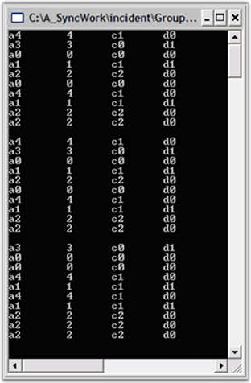

::: {style="DISPLAY: none"}
{#d2h_url_template}{#d2h_package_url style="WIDTH: 0px; DISPLAY: none; HEIGHT: 0px"}
:::

::::: {#nsbanner .d2h_main_nsbanner style="BORDER-BOTTOM: #999999 1px solid; POSITION: relative; PADDING-BOTTOM: 0px; BACKGROUND-COLOR: transparent; PADDING-LEFT: 0px; PADDING-RIGHT: 0px; DISPLAY: none; BORDER-TOP: #999999 1px solid; PADDING-TOP: 0px; LEFT: 0px"}
:::: {#TitleRow .d2h_main_titlerow style="PADDING-BOTTOM: 4px; BACKGROUND-COLOR: transparent; PADDING-LEFT: 22px; WIDTH: 100%; PADDING-RIGHT: 10px; DISPLAY: none; PADDING-TOP: 4px"}
::: {#ienav .d2h_main_ienav style="DISPLAY: none"}
{#D2HPrevious .D2HPreviousEnabled}  {#D2HNext .D2HNextEnabled}
:::
::::
:::::

::::: {#nstext .d2h_main_nstext style="PADDING-BOTTOM: 10px; BACKGROUND-COLOR: transparent; PADDING-LEFT: 22px; PADDING-RIGHT: 10px; HEIGHT: 100%; OVERFLOW: auto; PADDING-TOP: 5px" hasuserbackground="true" valign="bottom"}
::: {#d2h_breadcrumbs .d2h_breadcrumbs}
[Essential Studio User Guide Documentation](ms-xhelp:///?Id=12457748-09e3-4d74-a240-8e049cedf030){.d2h_breadcrumbsNormal}[ \> ]{.d2h_breadcrumbsLinkSeparator}[Reporting Edition](ms-xhelp:///?Id=027aa5b6-6676-4f93-ad23-c20e8c45792e){.d2h_breadcrumbsNormal}[ \> ]{.d2h_breadcrumbsLinkSeparator}[Essential Grouping](ms-xhelp:///?Id=37faf36d-c8f0-4c7d-90e1-39deecb620a6){.d2h_breadcrumbsNormal}[ \> ]{.d2h_breadcrumbsLinkSeparator}[Concepts and Features](ms-xhelp:///?Id=c4c7c491-8a85-4ab1-829b-adb3b3ed1a4c){.d2h_breadcrumbsNormal}[ \> ]{.d2h_breadcrumbsLinkSeparator}[Using Grouping](ms-xhelp:///?Id=601b05d8-27b2-4084-a7be-dc09b2a19251){.d2h_breadcrumbsNormal}
:::

### Grouping a Table {#grouping-a-table style="tab-stops: 0pt"}

 

In this lesson, you will start working with the **Grouping.Engine** object to see how to apply a grouping to the data as well as summarize the data. In the [[[Data Binding]{style="COLOR: blue"}]{.underline}](ms-xhelp:///?Id=2c3fe673-8356-4c6f-9ab8-e154932d0b07) section, you used the **grouping.Engine.Table.Records** collection to access the data in the Grouping.Engine object. The **grouping.Engine.Table** property is the property of the Grouping.Engine that holds the actual data needed by Essential Grouping.

[]{style="FONT-FAMILY: 'Trebuchet MS','sans-serif'"} 

[You will now look at the property that holds the schema information that is associated with the data, i.e., the **grouping.Engine.TableDescriptor** property. For example, the **TableDescriptor.Columns** property holds a collection of ColumnDescriptor objects that define the schema information on the columns in the data. ]{style="FONT-FAMILY: 'Trebuchet MS','sans-serif'"}

[]{style="FONT-FAMILY: 'Trebuchet MS','sans-serif'"} 

::: {style="BORDER-BOTTOM: windowtext 1pt solid; BORDER-LEFT: medium none; PADDING-BOTTOM: 1pt; MARGIN-TOP: 9pt; PADDING-LEFT: 0pt; PADDING-RIGHT: 0pt; MARGIN-BOTTOM: 9pt; BORDER-TOP: windowtext 1pt solid; BORDER-RIGHT: medium none; PADDING-TOP: 1pt"}
Note: Here, the columns correspond to the public properties in our sample MyObject class, A, B, C, and D.
:::

[]{style="FONT-FAMILY: 'Trebuchet MS','sans-serif'; COLOR: #15428b; FONT-SIZE: 9pt"} 

We will now continue using the same sample created in the [[[previous]{style="COLOR: blue"}]{.underline}](ms-xhelp:///?Id=2c3fe673-8356-4c6f-9ab8-e154932d0b07) section and add the corresponding code at the bottom of the Main method.

[]{style="FONT-FAMILY: 'Trebuchet MS','sans-serif'; COLOR: #15428b; FONT-SIZE: 9pt"} 

1.   To group the \'MyObject\' ArrayList by a particular property, say property C, you have to add only the property name (\"C\") to the **grouping.Engine.TableDescriptor.GroupedColumns** collections. Add the following code snippet to the bottom of the **Main** method.

[]{style="FONT-FAMILY: 'Trebuchet MS','sans-serif'; COLOR: #15428b; FONT-SIZE: 9pt"} 

+------------------------------------------------------------------------------------------------------------------------------------------------------------------------------------------------------------------------------------------------------------------------------------------+
| **[\[C#\]]{style="FONT-FAMILY: 'Courier New'; COLOR: black"}**                                                                                                                                                                                                                           |
|                                                                                                                                                                                                                                                                                          |
| []{style="COLOR: black"}                                                                                                                                                                                                                                                                 |
|                                                                                                                                                                                                                                                                                          |
| [// Group on property C.]{style="FONT-FAMILY: 'Courier New'; COLOR: green"}                                                                                                                                                                                                              |
|                                                                                                                                                                                                                                                                                          |
| [groupingEngine.TableDescriptor.GroupedColumns.Add(\"C\");]{style="FONT-FAMILY: 'Courier New'; COLOR: black"}                                                                                                                                                                            |
|                                                                                                                                                                                                                                                                                          |
| [        ]{style="FONT-FAMILY: 'Courier New'; COLOR: black"}                                                                                                                                                                                                                             |
|                                                                                                                                                                                                                                                                                          |
| [// Display the records in the engine after grouping.]{style="FONT-FAMILY: 'Courier New'; COLOR: green"}                                                                                                                                                                                 |
|                                                                                                                                                                                                                                                                                          |
| [foreach]{style="FONT-FAMILY: 'Courier New'; COLOR: blue"}[(Record rec ]{style="FONT-FAMILY: 'Courier New'; COLOR: black"}[in]{style="FONT-FAMILY: 'Courier New'; COLOR: blue"}[ groupingEngine.Table.Records)]{style="FONT-FAMILY: 'Courier New'; COLOR: black"}                        |
|                                                                                                                                                                                                                                                                                          |
| [{]{style="FONT-FAMILY: 'Courier New'; COLOR: black"}                                                                                                                                                                                                                                    |
|                                                                                                                                                                                                                                                                                          |
| [       MyObject obj = rec.GetData() ]{style="FONT-FAMILY: 'Courier New'; COLOR: black"}[as]{style="FONT-FAMILY: 'Courier New'; COLOR: blue"}[ MyObject;]{style="FONT-FAMILY: 'Courier New'; COLOR: black"}                                                                              |
|                                                                                                                                                                                                                                                                                          |
| [       ]{style="FONT-FAMILY: 'Courier New'; COLOR: black"}[if]{style="FONT-FAMILY: 'Courier New'; COLOR: blue"}[(obj != ]{style="FONT-FAMILY: 'Courier New'; COLOR: black"}[null]{style="FONT-FAMILY: 'Courier New'; COLOR: blue"}[)]{style="FONT-FAMILY: 'Courier New'; COLOR: black"} |
|                                                                                                                                                                                                                                                                                          |
| [       {]{style="FONT-FAMILY: 'Courier New'; COLOR: black"}                                                                                                                                                                                                                             |
|                                                                                                                                                                                                                                                                                          |
| [         Console.WriteLine(obj);]{style="FONT-FAMILY: 'Courier New'; COLOR: black"}                                                                                                                                                                                                     |
|                                                                                                                                                                                                                                                                                          |
| [       }]{style="FONT-FAMILY: 'Courier New'; COLOR: black"}                                                                                                                                                                                                                             |
|                                                                                                                                                                                                                                                                                          |
| [}]{style="FONT-FAMILY: 'Courier New'; COLOR: black"}                                                                                                                                                                                                                                    |
+------------------------------------------------------------------------------------------------------------------------------------------------------------------------------------------------------------------------------------------------------------------------------------------+

[]{style="FONT-FAMILY: 'Trebuchet MS','sans-serif'; COLOR: #15428b; FONT-SIZE: 9pt"} 

+-----------------------------------------------------------------------------------------------------------------------------------------------------------------------------------------------------------------------------------------------------------------------------------------------------------------------------------------------------------------------------------------------------------------------------------+
| **[\[VB.NET\]]{style="FONT-FAMILY: 'Courier New'; COLOR: black"}**                                                                                                                                                                                                                                                                                                                                                                |
|                                                                                                                                                                                                                                                                                                                                                                                                                                   |
| []{style="COLOR: black"}                                                                                                                                                                                                                                                                                                                                                                                                          |
|                                                                                                                                                                                                                                                                                                                                                                                                                                   |
| [\' Group on property C.]{style="FONT-FAMILY: 'Courier New'; COLOR: green"}                                                                                                                                                                                                                                                                                                                                                       |
|                                                                                                                                                                                                                                                                                                                                                                                                                                   |
| [groupingEngine.TableDescriptor.GroupedColumns.Add(\"C\")]{style="FONT-FAMILY: 'Courier New'; COLOR: black"}                                                                                                                                                                                                                                                                                                                      |
|                                                                                                                                                                                                                                                                                                                                                                                                                                   |
| []{style="FONT-FAMILY: 'Courier New'; COLOR: black"}                                                                                                                                                                                                                                                                                                                                                                              |
|                                                                                                                                                                                                                                                                                                                                                                                                                                   |
| [\' Display the records in the engine after grouping.]{style="FONT-FAMILY: 'Courier New'; COLOR: green"}                                                                                                                                                                                                                                                                                                                          |
|                                                                                                                                                                                                                                                                                                                                                                                                                                   |
| [For Each]{style="FONT-FAMILY: 'Courier New'; COLOR: blue"}[ rec ]{style="FONT-FAMILY: 'Courier New'; COLOR: black"}[In]{style="FONT-FAMILY: 'Courier New'; COLOR: blue"}[ groupingEngine.Table.Records]{style="FONT-FAMILY: 'Courier New'; COLOR: black"}                                                                                                                                                                        |
|                                                                                                                                                                                                                                                                                                                                                                                                                                   |
| [    ]{style="FONT-FAMILY: 'Courier New'; COLOR: black"}[Dim]{style="FONT-FAMILY: 'Courier New'; COLOR: blue"}[ obj ]{style="FONT-FAMILY: 'Courier New'; COLOR: black"}[As]{style="FONT-FAMILY: 'Courier New'; COLOR: blue"}[ MyObject = ]{style="FONT-FAMILY: 'Courier New'; COLOR: black"}[CType]{style="FONT-FAMILY: 'Courier New'; COLOR: blue"}[(rec.GetData(), MyObject)]{style="FONT-FAMILY: 'Courier New'; COLOR: black"} |
|                                                                                                                                                                                                                                                                                                                                                                                                                                   |
| [    ]{style="FONT-FAMILY: 'Courier New'; COLOR: black"}[If Not]{style="FONT-FAMILY: 'Courier New'; COLOR: blue"}[ (obj ]{style="FONT-FAMILY: 'Courier New'; COLOR: black"}[Is Nothing]{style="FONT-FAMILY: 'Courier New'; COLOR: blue"}[) ]{style="FONT-FAMILY: 'Courier New'; COLOR: black"}[Then]{style="FONT-FAMILY: 'Courier New'; COLOR: blue"}                                                                             |
|                                                                                                                                                                                                                                                                                                                                                                                                                                   |
| [           Console.WriteLine(obj)]{style="FONT-FAMILY: 'Courier New'; COLOR: black"}                                                                                                                                                                                                                                                                                                                                             |
|                                                                                                                                                                                                                                                                                                                                                                                                                                   |
| [   ]{style="FONT-FAMILY: 'Courier New'; COLOR: black"}[ End If]{style="FONT-FAMILY: 'Courier New'; COLOR: blue"}                                                                                                                                                                                                                                                                                                                 |
|                                                                                                                                                                                                                                                                                                                                                                                                                                   |
| [Next]{style="FONT-FAMILY: 'Courier New'; COLOR: blue"}[ rec]{style="FONT-FAMILY: 'Courier New'; COLOR: black"}                                                                                                                                                                                                                                                                                                                   |
+-----------------------------------------------------------------------------------------------------------------------------------------------------------------------------------------------------------------------------------------------------------------------------------------------------------------------------------------------------------------------------------------------------------------------------------+

[]{style="FONT-FAMILY: 'Trebuchet MS','sans-serif'; COLOR: #15428b; FONT-SIZE: 9pt"} 

2.   After running the code from step 1, a screen similar to the one below will be displayed. Note that the bottom list displayed is now sorted by **column C**. This is a one side effect of grouping by column C.

[]{style="FONT-FAMILY: 'Trebuchet MS','sans-serif'; COLOR: #15428b; FONT-SIZE: 9pt"} 

[]{style="FONT-FAMILY: 'Trebuchet MS','sans-serif'; COLOR: #15428b; FONT-SIZE: 9pt"} 

{border="0"}

Figure 14: Display After Grouping by Property C

More:

[ ]{#related-topics}

[{border="0" align="absMiddle"}The Grouping.TableDescriptor Class](ms-xhelp:///?Id=2b9a359f-7a53-44ca-96ce-f4c91d80b161){style="TEXT-DECORATION: none"}
:::::
