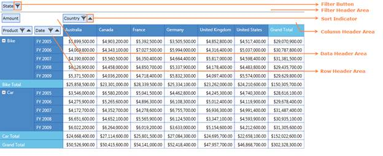
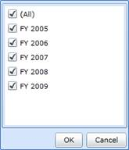
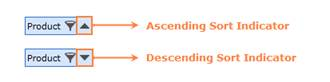

::: {style="DISPLAY: none"}
{#d2h_url_template}{#d2h_package_url style="WIDTH: 0px; DISPLAY: none; HEIGHT: 0px"}
:::

::::: {#nsbanner .d2h_main_nsbanner style="BORDER-BOTTOM: #999999 1px solid; POSITION: relative; PADDING-BOTTOM: 0px; BACKGROUND-COLOR: transparent; PADDING-LEFT: 0px; PADDING-RIGHT: 0px; DISPLAY: none; BORDER-TOP: #999999 1px solid; PADDING-TOP: 0px; LEFT: 0px"}
:::: {#TitleRow .d2h_main_titlerow style="PADDING-BOTTOM: 4px; BACKGROUND-COLOR: transparent; PADDING-LEFT: 22px; WIDTH: 100%; PADDING-RIGHT: 10px; DISPLAY: none; PADDING-TOP: 4px"}
::: {#ienav .d2h_main_ienav style="DISPLAY: none"}
{#D2HPrevious .D2HPreviousEnabled}  {#D2HNext .D2HNextEnabled}
:::
::::
:::::

::::::: {#nstext .d2h_main_nstext style="PADDING-BOTTOM: 10px; BACKGROUND-COLOR: transparent; PADDING-LEFT: 22px; PADDING-RIGHT: 10px; HEIGHT: 100%; OVERFLOW: auto; PADDING-TOP: 5px" hasuserbackground="true" valign="bottom"}
::: {#d2h_breadcrumbs .d2h_breadcrumbs}
[Essential Studio User Guide Documentation](ms-xhelp:///?Id=12457748-09e3-4d74-a240-8e049cedf030){.d2h_breadcrumbsNormal}[ \> ]{.d2h_breadcrumbsLinkSeparator}[Business Intelligence Edition](ms-xhelp:///?Id=fdf33dd8-62b2-47b9-ad7b-fc50e590bca5){.d2h_breadcrumbsNormal}[ \> ]{.d2h_breadcrumbsLinkSeparator}[Essential BI Silverlight](ms-xhelp:///?Id=c006b39c-6aa2-4637-b7de-3e7b6cb3f9f9){.d2h_breadcrumbsNormal}[ \> ]{.d2h_breadcrumbsLinkSeparator}[Essential Pivot Grid]{.d2h_breadcrumbsContentsOnly}[ \> ]{.d2h_breadcrumbsLinkSeparator}[Features](ms-xhelp:///?Id=9d7968f1-d52c-4e79-a6ae-fb01305e9f98){.d2h_breadcrumbsNormal}
:::

## Grouping Bar {#grouping-bar style="tab-stops: 0pt"}

 

The PivotGrid Grouping Bar enables drag and drop feature of fields between different areas like Column, row, value and filter. By using the Grouping Bar, users can add, rearrange, or remove fields to show data in a PivotGrid exactly the way they want. It consists of the following:

 

[·      ]{style="FONT-FAMILY: Symbol"}FilterHeader Area

[·      ]{style="FONT-FAMILY: Symbol"}DataHeader Area

[·      ]{style="FONT-FAMILY: Symbol"}ColumnHeader Area

[·      ]{style="FONT-FAMILY: Symbol"}RowHeader Area

 

The Field headers identify fields in the pivot grid. A field header contains:

[·      ]{style="FONT-FAMILY: Symbol"}A caption string which identifies the field\'s content;

[·      ]{style="FONT-FAMILY: Symbol"}A sort indicator which identifies the sort order applied to the field\'s values;

[·      ]{style="FONT-FAMILY: Symbol"}A filter button which end-users can use to filter field values.

 

The headers of all visible fields are contained within header areas. The headers of row and column fields are displayed within the row header and column header areas, respectively. The headers of data fields are displayed within the data header area.

 

Use Case Scenarios

 

At times User may expect the Grid to perform sorting and filtering at run-time.

 

Adding Grouping Bar

 

By default, Grouping Bar is enabled. It can be disabled by the following property of **PivotGridControl**,

 

+-----------------------------------------------------------------------------------------------------------------------------------------------------------------------------------------------------------------+
| **[\[XAML\]]{style="FONT-FAMILY: 'Courier New'"}**                                                                                                                                                              |
|                                                                                                                                                                                                                 |
| [\<]{style="FONT-FAMILY: 'Courier New'; COLOR: blue"}[syncfusion[:]{style="COLOR: blue"}PivotGrid [ShowGroupingBar]{style="COLOR: red"}[=\"False\"\>]{style="COLOR: blue"}]{style="FONT-FAMILY: 'Courier New'"} |
|                                                                                                                                                                                                                 |
| [\</]{style="FONT-FAMILY: 'Courier New'; COLOR: blue"}[syncfusion[:]{style="COLOR: blue"}PivotGrid[\>]{style="COLOR: blue"}]{style="FONT-FAMILY: 'Courier New'"}                                                |
|                                                                                                                                                                                                                 |
| []{style="FONT-FAMILY: 'Courier New'"}                                                                                                                                                                          |
+-----------------------------------------------------------------------------------------------------------------------------------------------------------------------------------------------------------------+

 

+----------------------------------------------------------------------------------------------------------------------------------------------------------+
| **[\[C#\]]{style="FONT-FAMILY: 'Courier New'"}**                                                                                                         |
|                                                                                                                                                          |
| [// Disable GridGroupingBar ]{style="FONT-FAMILY: 'Courier New'"}                                                                                        |
|                                                                                                                                                          |
| [this]{style="FONT-FAMILY: 'Courier New'; COLOR: blue"}[.PivotGrid1.ShowGroupingBar = [false]{style="COLOR: blue"};]{style="FONT-FAMILY: 'Courier New'"} |
|                                                                                                                                                          |
| []{style="LINE-HEIGHT: 115%; FONT-FAMILY: 'Courier New'; FONT-SIZE: 9pt"}                                                                                |
+----------------------------------------------------------------------------------------------------------------------------------------------------------+

 

+-------------------------------------------------------------------------------------------------------------------------------------------------------+
| **[\[VB\]]{style="FONT-FAMILY: 'Courier New'"}**                                                                                                      |
|                                                                                                                                                       |
| [\' Disable GridGroupingBar ]{style="FONT-FAMILY: 'Courier New'"}                                                                                     |
|                                                                                                                                                       |
| [Me]{style="FONT-FAMILY: 'Courier New'; COLOR: blue"}[.PivotGrid1.ShowGroupingBar = [False]{style="COLOR: blue"}]{style="FONT-FAMILY: 'Courier New'"} |
+-------------------------------------------------------------------------------------------------------------------------------------------------------+

 

{border="0"}

Figure 20: PivotGrid Grouping Bar

Filtering

 

Filtering of data displays only a subset of data that meets criteria that users specify and hides data that they don't want to be displayed. The Items present in the **FilterHeaderArea**, **ColumnHeaderArea** and **RowHeaderArea** provides the option of filtering which is represented as a Funnel symbol on it. On clicking, it opens a filter popup which displays a list of elements through which filtering can be applied.

 

{border="0"}

Figure 21: Filter Popup

Sorting

 

Sorting data enables you to quickly visualize and understand your data better, organize and find the data that you want, and ultimately make more effective decisions. By default, PivotGrid will populate the data in ascending order. Sorting order can be changed clicking on the item present in the **RowHeaderArea** and **ColumnHeaderArea**. The Sort indicator present in the item represents the Sort type whether it is ascending sort or descending sort.

 

{border="0"}

Figure 22: Sort Indicator

 

Properties

Table 1: PivotGridControl Table

::: {align="center"}
  ------------------------------------------- --------------------------------------------------------------------------------------------- -------------------------------------- -------------------------------- ------------------------------
  Property                                    Description                                                                                   Type                                   Data Type                        Reference links
  ShowGroupingBar[]{style="COLOR: #c00000"}   Gets or sets a value indicating whether to Show/Hide GroupingBar []{style="COLOR: #c00000"}   Dependency[]{style="COLOR: #c00000"}   bool[]{style="COLOR: #c00000"}   NA[]{style="COLOR: #c00000"}
  ------------------------------------------- --------------------------------------------------------------------------------------------- -------------------------------------- -------------------------------- ------------------------------
:::

 

Table 2: GroupingBar Table

::: {align="center"}
  ------------------------------------------ ----------------------------------------------------------------------------------------------------------------------------------------------- -------------------------------------- ------------------------------------ ------------------------------
  Property                                   Description                                                                                                                                     Type                                   Data Type                            Reference links
  AllowFiltering[]{style="COLOR: #c00000"}   Gets or sets a value indicating whether to allow filtering of elements []{style="COLOR: #c00000"}                                               Dependency[]{style="COLOR: #c00000"}   bool[]{style="COLOR: #c00000"}       NA[]{style="COLOR: #c00000"}
  AllowSorting                               Gets or sets a value indicating whether to allow sorting of elements                                                                            Dependency                             bool                                 NA
  ColumnHeaderArea                           Gets or sets the Column header area of Grouping bar which represents the  PivotColumns                                                          Normal                                 PivotGroupingItemsControl            NA
  DataHeaderArea                             Gets or sets the Data header area of the Grouping bar which represents the PivotComputationInfo                                                 Normal                                 PivotGroupingItemsControl            NA
  FilterHeaderArea                           Gets or sets the Filter header area of Grouping bar which represents the Filters                                                                Normal                                 PivotGroupingItemsControl            NA
  FilterPopup                                Gets or sets the Filter Popup which will be displayed if Filter button is clicked on any of the Column/Row/Filter header area item              Normal                                 FilterPopup                          NA
  Filters                                    Gets or sets the collection of Filter Items                                                                                                     Normal                                 ObservableCollection\<FilterItem\>   NA
  GridControl                                Gets or sets the PivotGridControl                                                                                                               Normal                                 PivotGridControl                     NA
  IndicatorBackground                        Gets or sets the Background for Indicator popup which is displayed when any of the Item present in PivotGroupingItems control is dragged over   Normal                                 Brush                                NA
  ItemsBackground                            Gets or sets the background of PivotGroupingItemsControl Item                                                                                   Normal                                 Brush                                NA
  ItemsBorderBrush                           Gets or sets the Border brush of PivotGroupingItemsControl Item                                                                                 Normal                                 Brush                                NA
  ------------------------------------------ ----------------------------------------------------------------------------------------------------------------------------------------------- -------------------------------------- ------------------------------------ ------------------------------
:::

 

Events

 

::: {align="center"}
  ------------------- ----------------------------------------------- ----------- ----------- -----------------
  Event               Description                                     Arguments   Type        Reference links
  GroupingBarLoaded   Handles the loaded event of Grid Grouping Bar   NA          EventArgs   NA
  ------------------- ----------------------------------------------- ----------- ----------- -----------------
:::

 

Sample Link

To access a Conditional Formatting sample:

1.   Open the Syncfusion Dashboard.

2.   Click Business Intelligence.

3.   Click the **Silverlight** drop-down list, and select **Explore Samples**.

4.   Navigate to Syncfusion.PivotAnalysis.Silverlight.Samples -\> Syncfusion.PivotAnalysis.Silverlight.Samples -\> Samples -\> GroupingBarDemo.

 

More:

[ ]{#related-topics}

[{border="0" align="absMiddle"}Disable Grouping by Specific Fields](ms-xhelp:///?Id=5bc8d430-c783-4e48-a049-2af45b1d0bc5){style="TEXT-DECORATION: none"}
:::::::
