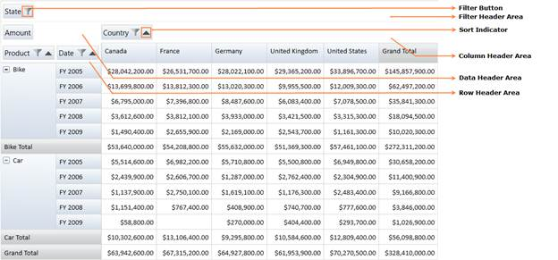
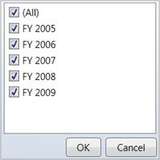
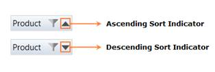

::: {style="DISPLAY: none"}
{#d2h_url_template} {#d2h_package_url style="WIDTH: 0px; DISPLAY: none; HEIGHT: 0px"}
:::

::: {.d2h_secondary_topic style="PADDING-BOTTOM: 10pt; MARGIN: 0pt; PADDING-LEFT: 0pt; PADDING-RIGHT: 0pt; PADDING-TOP: 0pt"}
#### Grouping Bar {#grouping-bar style="tab-stops: 0pt"}

The PivotGrid Grouping Bar enables the drag and drop feature of fields between different areas like column, row, value and filter. By using the Grouping Bar, you can add, rearrange, or remove fields to show data in a PivotGrid exactly the way they want. It consists of the following:

[·      ]{style="FONT-FAMILY: Symbol"}FilterHeader Area

[·      ]{style="FONT-FAMILY: Symbol"}DataHeader Area

[·      ]{style="FONT-FAMILY: Symbol"}ColumnHeader Area

[·      ]{style="FONT-FAMILY: Symbol"}RowHeader Area

The Field headers identify fields in the pivot grid. A field header contains:

[·      ]{style="FONT-FAMILY: Symbol"}a caption string which identifies the field\'s content

[·      ]{style="FONT-FAMILY: Symbol"}a sort indicator which identifies the sort order applied to the field\'s values

[·      ]{style="FONT-FAMILY: Symbol"}a filter button which end-users can use to filter field values

The headers of all visible fields are contained within header areas. The headers of row and column fields are displayed within the row header and column header areas, respectively. The headers of data fields are displayed within the data header area.

[]{style="FONT-FAMILY: 'Trebuchet MS','sans-serif'; COLOR: #15428b; FONT-SIZE: 9pt"} 

Use Case Scenarios

At times, you may expect the Grid to perform sorting and filtering at run-time.

**[]{style="FONT-FAMILY: 'Trebuchet MS','sans-serif'; COLOR: #15428b; FONT-SIZE: 9pt"}**  

Adding Grouping Bar

By default, Grouping Bar is enabled. It can be disabled by setting **ShowGroupingBar** property of PivotGrid to False.

 

+---------------------------------------------------------------------------------------------------------------------------------------------------------------------------------------------------------------------------------------------------------------------------------------------------------------------------------------------------------------------------------------------------------------------------------------------------------------------------------------------------------------------------------------------------------------------------------------------------------------------------------------------------------------------------------------------------------------------------------------------------------------------------------------------------------------------------------------------------------------------------------------------------------------------------------------------------------------------------------------------------------------------------------------------------------------------------------------------+
| **[\[XAML\]]{style="FONT-FAMILY: 'Courier New'"}**                                                                                                                                                                                                                                                                                                                                                                                                                                                                                                                                                                                                                                                                                                                                                                                                                                                                                                                                                                                                                                          |
|                                                                                                                                                                                                                                                                                                                                                                                                                                                                                                                                                                                                                                                                                                                                                                                                                                                                                                                                                                                                                                                                                             |
| [\<]{style="FONT-FAMILY: 'Courier New'; COLOR: blue"} [syncfusion]{style="FONT-FAMILY: 'Courier New'; COLOR: #a31515"} [:]{style="FONT-FAMILY: 'Courier New'; COLOR: blue"} [PivotGrid]{style="FONT-FAMILY: 'Courier New'; COLOR: #a31515"} [\>]{style="FONT-FAMILY: 'Courier New'; COLOR: blue"}                                                                                                                                                                                                                                                                                                                                                                                                                                                                                                                                                                                                                                                                                                                                                                                           |
|                                                                                                                                                                                                                                                                                                                                                                                                                                                                                                                                                                                                                                                                                                                                                                                                                                                                                                                                                                                                                                                                                             |
| [  ]{style="FONT-FAMILY: 'Courier New'; COLOR: #a31515"} [\<!\--Adding PivotRows\--\>]{style="FONT-FAMILY: 'Courier New'; COLOR: green"} []{style="FONT-FAMILY: 'Courier New'"}                                                                                                                                                                                                                                                                                                                                                                                                                                                                                                                                                                                                                                                                                                                                                                                                                                                                                                             |
|                                                                                                                                                                                                                                                                                                                                                                                                                                                                                                                                                                                                                                                                                                                                                                                                                                                                                                                                                                                                                                                                                             |
| [   ]{style="FONT-FAMILY: 'Courier New'; COLOR: #a31515"} [\<]{style="FONT-FAMILY: 'Courier New'; COLOR: blue"} [syncfusion]{style="FONT-FAMILY: 'Courier New'; COLOR: #a31515"} [:]{style="FONT-FAMILY: 'Courier New'; COLOR: blue"} [PivotGridControl.PivotRows]{style="FONT-FAMILY: 'Courier New'; COLOR: #a31515"} [\>]{style="FONT-FAMILY: 'Courier New'; COLOR: blue"} []{style="FONT-FAMILY: 'Courier New'"}                                                                                                                                                                                                                                                                                                                                                                                                                                                                                                                                                                                                                                                                         |
|                                                                                                                                                                                                                                                                                                                                                                                                                                                                                                                                                                                                                                                                                                                                                                                                                                                                                                                                                                                                                                                                                             |
| [     ]{style="FONT-FAMILY: 'Courier New'; COLOR: #a31515"} [\<]{style="FONT-FAMILY: 'Courier New'; COLOR: blue"} [syncfusion]{style="FONT-FAMILY: 'Courier New'; COLOR: #a31515"} [:]{style="FONT-FAMILY: 'Courier New'; COLOR: blue"} [PivotItem]{style="FONT-FAMILY: 'Courier New'; COLOR: #a31515"} [ FieldMappingName]{style="FONT-FAMILY: 'Courier New'; COLOR: red"} [=\"Product\"]{style="FONT-FAMILY: 'Courier New'; COLOR: blue"} [ FieldHeader]{style="FONT-FAMILY: 'Courier New'; COLOR: red"} [=\"Product\"]{style="FONT-FAMILY: 'Courier New'; COLOR: blue"} [ TotalHeader]{style="FONT-FAMILY: 'Courier New'; COLOR: red"} [=\"Total\"/\>]{style="FONT-FAMILY: 'Courier New'; COLOR: blue"} []{style="FONT-FAMILY: 'Courier New'"}                                                                                                                                                                                                                                                                                                                                           |
|                                                                                                                                                                                                                                                                                                                                                                                                                                                                                                                                                                                                                                                                                                                                                                                                                                                                                                                                                                                                                                                                                             |
| [     ]{style="FONT-FAMILY: 'Courier New'; COLOR: #a31515"} [\<]{style="FONT-FAMILY: 'Courier New'; COLOR: blue"} [syncfusion]{style="FONT-FAMILY: 'Courier New'; COLOR: #a31515"} [:]{style="FONT-FAMILY: 'Courier New'; COLOR: blue"} [PivotItem]{style="FONT-FAMILY: 'Courier New'; COLOR: #a31515"} [ FieldMappingName]{style="FONT-FAMILY: 'Courier New'; COLOR: red"} [=\"Date\"]{style="FONT-FAMILY: 'Courier New'; COLOR: blue"} [ FieldHeader]{style="FONT-FAMILY: 'Courier New'; COLOR: red"} [=\"Date\"]{style="FONT-FAMILY: 'Courier New'; COLOR: blue"} [ TotalHeader]{style="FONT-FAMILY: 'Courier New'; COLOR: red"} [=\"Total\"/\>]{style="FONT-FAMILY: 'Courier New'; COLOR: blue"} []{style="FONT-FAMILY: 'Courier New'"}                                                                                                                                                                                                                                                                                                                                                 |
|                                                                                                                                                                                                                                                                                                                                                                                                                                                                                                                                                                                                                                                                                                                                                                                                                                                                                                                                                                                                                                                                                             |
| [   ]{style="FONT-FAMILY: 'Courier New'; COLOR: #a31515"} [\</]{style="FONT-FAMILY: 'Courier New'; COLOR: blue"} [syncfusion]{style="FONT-FAMILY: 'Courier New'; COLOR: #a31515"} [:]{style="FONT-FAMILY: 'Courier New'; COLOR: blue"} [PivotGridControl.PivotRows]{style="FONT-FAMILY: 'Courier New'; COLOR: #a31515"} [\>]{style="FONT-FAMILY: 'Courier New'; COLOR: blue"} []{style="FONT-FAMILY: 'Courier New'"}                                                                                                                                                                                                                                                                                                                                                                                                                                                                                                                                                                                                                                                                        |
|                                                                                                                                                                                                                                                                                                                                                                                                                                                                                                                                                                                                                                                                                                                                                                                                                                                                                                                                                                                                                                                                                             |
| [   ]{style="FONT-FAMILY: 'Courier New'; COLOR: #a31515"} [\<!\--Adding PivotColumns\--\>]{style="FONT-FAMILY: 'Courier New'; COLOR: green"} []{style="FONT-FAMILY: 'Courier New'"}                                                                                                                                                                                                                                                                                                                                                                                                                                                                                                                                                                                                                                                                                                                                                                                                                                                                                                         |
|                                                                                                                                                                                                                                                                                                                                                                                                                                                                                                                                                                                                                                                                                                                                                                                                                                                                                                                                                                                                                                                                                             |
| [   ]{style="FONT-FAMILY: 'Courier New'; COLOR: #a31515"} [\<]{style="FONT-FAMILY: 'Courier New'; COLOR: blue"} [syncfusion]{style="FONT-FAMILY: 'Courier New'; COLOR: #a31515"} [:]{style="FONT-FAMILY: 'Courier New'; COLOR: blue"} [PivotGridControl.PivotColumns]{style="FONT-FAMILY: 'Courier New'; COLOR: #a31515"} [\>]{style="FONT-FAMILY: 'Courier New'; COLOR: blue"} []{style="FONT-FAMILY: 'Courier New'"}                                                                                                                                                                                                                                                                                                                                                                                                                                                                                                                                                                                                                                                                      |
|                                                                                                                                                                                                                                                                                                                                                                                                                                                                                                                                                                                                                                                                                                                                                                                                                                                                                                                                                                                                                                                                                             |
| [     ]{style="FONT-FAMILY: 'Courier New'; COLOR: #a31515"} [\<]{style="FONT-FAMILY: 'Courier New'; COLOR: blue"} [syncfusion]{style="FONT-FAMILY: 'Courier New'; COLOR: #a31515"} [:]{style="FONT-FAMILY: 'Courier New'; COLOR: blue"} [PivotItem]{style="FONT-FAMILY: 'Courier New'; COLOR: #a31515"} [ FieldMappingName]{style="FONT-FAMILY: 'Courier New'; COLOR: red"} [=\"Country\"]{style="FONT-FAMILY: 'Courier New'; COLOR: blue"} [ FieldHeader]{style="FONT-FAMILY: 'Courier New'; COLOR: red"} [=\"Country\"]{style="FONT-FAMILY: 'Courier New'; COLOR: blue"} [ TotalHeader]{style="FONT-FAMILY: 'Courier New'; COLOR: red"} [=\"Total\"/\>]{style="FONT-FAMILY: 'Courier New'; COLOR: blue"} []{style="FONT-FAMILY: 'Courier New'"}                                                                                                                                                                                                                                                                                                                                           |
|                                                                                                                                                                                                                                                                                                                                                                                                                                                                                                                                                                                                                                                                                                                                                                                                                                                                                                                                                                                                                                                                                             |
| [     ]{style="FONT-FAMILY: 'Courier New'; COLOR: #a31515"} [\<]{style="FONT-FAMILY: 'Courier New'; COLOR: blue"} [syncfusion]{style="FONT-FAMILY: 'Courier New'; COLOR: #a31515"} [:]{style="FONT-FAMILY: 'Courier New'; COLOR: blue"} [PivotItem]{style="FONT-FAMILY: 'Courier New'; COLOR: #a31515"} [ FieldMappingName]{style="FONT-FAMILY: 'Courier New'; COLOR: red"} [=\"State\"]{style="FONT-FAMILY: 'Courier New'; COLOR: blue"} [ FieldHeader]{style="FONT-FAMILY: 'Courier New'; COLOR: red"} [=\"State\"]{style="FONT-FAMILY: 'Courier New'; COLOR: blue"} [ TotalHeader]{style="FONT-FAMILY: 'Courier New'; COLOR: red"} [=\"Total\"/\>]{style="FONT-FAMILY: 'Courier New'; COLOR: blue"} []{style="FONT-FAMILY: 'Courier New'"}                                                                                                                                                                                                                                                                                                                                               |
|                                                                                                                                                                                                                                                                                                                                                                                                                                                                                                                                                                                                                                                                                                                                                                                                                                                                                                                                                                                                                                                                                             |
| [   ]{style="FONT-FAMILY: 'Courier New'; COLOR: #a31515"} [\</]{style="FONT-FAMILY: 'Courier New'; COLOR: blue"} [syncfusion]{style="FONT-FAMILY: 'Courier New'; COLOR: #a31515"} [:]{style="FONT-FAMILY: 'Courier New'; COLOR: blue"} [PivotGridControl.PivotColumns]{style="FONT-FAMILY: 'Courier New'; COLOR: #a31515"} [\>]{style="FONT-FAMILY: 'Courier New'; COLOR: blue"} []{style="FONT-FAMILY: 'Courier New'"}                                                                                                                                                                                                                                                                                                                                                                                                                                                                                                                                                                                                                                                                     |
|                                                                                                                                                                                                                                                                                                                                                                                                                                                                                                                                                                                                                                                                                                                                                                                                                                                                                                                                                                                                                                                                                             |
| [   ]{style="FONT-FAMILY: 'Courier New'; COLOR: #a31515"} [\<!\--Adding PivotCalculations\--\>]{style="FONT-FAMILY: 'Courier New'; COLOR: green"} []{style="FONT-FAMILY: 'Courier New'"}                                                                                                                                                                                                                                                                                                                                                                                                                                                                                                                                                                                                                                                                                                                                                                                                                                                                                                    |
|                                                                                                                                                                                                                                                                                                                                                                                                                                                                                                                                                                                                                                                                                                                                                                                                                                                                                                                                                                                                                                                                                             |
| [     ]{style="FONT-FAMILY: 'Courier New'; COLOR: #a31515"} [\<]{style="FONT-FAMILY: 'Courier New'; COLOR: blue"} [syncfusion]{style="FONT-FAMILY: 'Courier New'; COLOR: #a31515"} [:]{style="FONT-FAMILY: 'Courier New'; COLOR: blue"} [PivotGridControl.PivotCalculations]{style="FONT-FAMILY: 'Courier New'; COLOR: #a31515"} [\>]{style="FONT-FAMILY: 'Courier New'; COLOR: blue"} []{style="FONT-FAMILY: 'Courier New'"}                                                                                                                                                                                                                                                                                                                                                                                                                                                                                                                                                                                                                                                               |
|                                                                                                                                                                                                                                                                                                                                                                                                                                                                                                                                                                                                                                                                                                                                                                                                                                                                                                                                                                                                                                                                                             |
| [       ]{style="FONT-FAMILY: 'Courier New'; COLOR: #a31515"} [\<]{style="FONT-FAMILY: 'Courier New'; COLOR: blue"} [syncfusion]{style="FONT-FAMILY: 'Courier New'; COLOR: #a31515"} [:]{style="FONT-FAMILY: 'Courier New'; COLOR: blue"} [PivotComputationInfo]{style="FONT-FAMILY: 'Courier New'; COLOR: #a31515"} [ CalculationName]{style="FONT-FAMILY: 'Courier New'; COLOR: red"} [ = \"Total\"]{style="FONT-FAMILY: 'Courier New'; COLOR: blue"} [ Description]{style="FONT-FAMILY: 'Courier New'; COLOR: red"} []{style="FONT-FAMILY: 'Courier New'; COLOR: blue"} [= \"Summation of values\"]{style="FONT-FAMILY: 'Courier New'; COLOR: blue"} [ FieldName]{style="FONT-FAMILY: 'Courier New'; COLOR: red"} [ = \"Amount\"]{style="FONT-FAMILY: 'Courier New'; COLOR: blue"} [ Format]{style="FONT-FAMILY: 'Courier New'; COLOR: red"} [ = \"C\"]{style="FONT-FAMILY: 'Courier New'; COLOR: blue"} [ SummaryType]{style="FONT-FAMILY: 'Courier New'; COLOR: red"} [=\"DoubleTotalSum\"/\>]{style="FONT-FAMILY: 'Courier New'; COLOR: blue"} []{style="FONT-FAMILY: 'Courier New'"} |
|                                                                                                                                                                                                                                                                                                                                                                                                                                                                                                                                                                                                                                                                                                                                                                                                                                                                                                                                                                                                                                                                                             |
| [       ]{style="FONT-FAMILY: 'Courier New'; COLOR: #a31515"} [\<]{style="FONT-FAMILY: 'Courier New'; COLOR: blue"} [syncfusion]{style="FONT-FAMILY: 'Courier New'; COLOR: #a31515"} [:]{style="FONT-FAMILY: 'Courier New'; COLOR: blue"} [PivotComputationInfo]{style="FONT-FAMILY: 'Courier New'; COLOR: #a31515"} [ CalculationName]{style="FONT-FAMILY: 'Courier New'; COLOR: red"} [ = \"Total\"]{style="FONT-FAMILY: 'Courier New'; COLOR: blue"} [ Description]{style="FONT-FAMILY: 'Courier New'; COLOR: red"} [ = \"Summation of values\"]{style="FONT-FAMILY: 'Courier New'; COLOR: blue"} [ FieldName]{style="FONT-FAMILY: 'Courier New'; COLOR: red"} [ = \"Quantity\"]{style="FONT-FAMILY: 'Courier New'; COLOR: blue"} [ Format]{style="FONT-FAMILY: 'Courier New'; COLOR: red"} [ = \"#,##0\"/\>]{style="FONT-FAMILY: 'Courier New'; COLOR: blue"} []{style="FONT-FAMILY: 'Courier New'"}                                                                                                                                                                                    |
|                                                                                                                                                                                                                                                                                                                                                                                                                                                                                                                                                                                                                                                                                                                                                                                                                                                                                                                                                                                                                                                                                             |
| [     ]{style="FONT-FAMILY: 'Courier New'; COLOR: #a31515"} [\</]{style="FONT-FAMILY: 'Courier New'; COLOR: blue"} [syncfusion]{style="FONT-FAMILY: 'Courier New'; COLOR: #a31515"} [:]{style="FONT-FAMILY: 'Courier New'; COLOR: blue"} [PivotGridControl.PivotCalculations]{style="FONT-FAMILY: 'Courier New'; COLOR: #a31515"} [\>]{style="FONT-FAMILY: 'Courier New'; COLOR: blue"} []{style="FONT-FAMILY: 'Courier New'; COLOR: #a31515"}                                                                                                                                                                                                                                                                                                                                                                                                                                                                                                                                                                                                                                              |
|                                                                                                                                                                                                                                                                                                                                                                                                                                                                                                                                                                                                                                                                                                                                                                                                                                                                                                                                                                                                                                                                                             |
| [\</]{style="FONT-FAMILY: 'Courier New'; COLOR: blue"} [syncfusion]{style="FONT-FAMILY: 'Courier New'; COLOR: #a31515"} [:]{style="FONT-FAMILY: 'Courier New'; COLOR: blue"} [PivotGrid]{style="FONT-FAMILY: 'Courier New'; COLOR: #a31515"} [\>]{style="FONT-FAMILY: 'Courier New'; COLOR: blue"}                                                                                                                                                                                                                                                                                                                                                                                                                                                                                                                                                                                                                                                                                                                                                                                          |
|                                                                                                                                                                                                                                                                                                                                                                                                                                                                                                                                                                                                                                                                                                                                                                                                                                                                                                                                                                                                                                                                                             |
|                                                                                                                                                                                                                                                                                                                                                                                                                                                                                                                                                                                                                                                                                                                                                                                                                                                                                                                                                                                                                                                                                             |
+---------------------------------------------------------------------------------------------------------------------------------------------------------------------------------------------------------------------------------------------------------------------------------------------------------------------------------------------------------------------------------------------------------------------------------------------------------------------------------------------------------------------------------------------------------------------------------------------------------------------------------------------------------------------------------------------------------------------------------------------------------------------------------------------------------------------------------------------------------------------------------------------------------------------------------------------------------------------------------------------------------------------------------------------------------------------------------------------+

[]{style="COLOR: #c00000"} 

+----------------------------------------------------------------------------------------------------------------------------------------------------------------------------------------------------------------------------------------------------------------------------------------------------------+
| **[\[C#\]]{style="FONT-FAMILY: 'Courier New'"}**                                                                                                                                                                                                                                                         |
|                                                                                                                                                                                                                                                                                                          |
| [// Instantiating PivotGridControl.]{style="FONT-FAMILY: 'Courier New'; COLOR: green"} []{style="FONT-FAMILY: 'Courier New'"}                                                                                                                                                                            |
|                                                                                                                                                                                                                                                                                                          |
| [PivotGridControl]{style="FONT-FAMILY: 'Courier New'; COLOR: #2b91af"} [ pivotGridControl1 = [new]{style="COLOR: blue"}[PivotGridControl]{style="COLOR: #2b91af"}();]{style="FONT-FAMILY: 'Courier New'"}                                                                                                |
|                                                                                                                                                                                                                                                                                                          |
| [// Adding PivotRows.]{style="FONT-FAMILY: 'Courier New'; COLOR: green"} []{style="FONT-FAMILY: 'Courier New'"}                                                                                                                                                                                          |
|                                                                                                                                                                                                                                                                                                          |
| [pivotGridControl1.PivotRows.Add([new]{style="COLOR: blue"}[PivotItem]{style="COLOR: #2b91af"} { FieldHeader = [\"Product\"]{style="COLOR: #a31515"} });]{style="FONT-FAMILY: 'Courier New'"}                                                                                                            |
|                                                                                                                                                                                                                                                                                                          |
| [pivotGridControl1.PivotColumns.Add([new]{style="COLOR: blue"}[PivotItem]{style="COLOR: #2b91af"} { FieldHeader = [\"Date\"]{style="COLOR: #a31515"} });]{style="FONT-FAMILY: 'Courier New'"}                                                                                                            |
|                                                                                                                                                                                                                                                                                                          |
| [// Adding PivotColumns.]{style="FONT-FAMILY: 'Courier New'; COLOR: green"} []{style="FONT-FAMILY: 'Courier New'"}                                                                                                                                                                                       |
|                                                                                                                                                                                                                                                                                                          |
| [pivotGridControl1.PivotColumns.Add([new]{style="COLOR: blue"}[PivotItem]{style="COLOR: #2b91af"} { FieldHeader = [\"Country\"]{style="COLOR: #a31515"} });]{style="FONT-FAMILY: 'Courier New'"}                                                                                                         |
|                                                                                                                                                                                                                                                                                                          |
| [pivotGridControl1.PivotColumns.Add([new]{style="COLOR: blue"}[PivotItem]{style="COLOR: #2b91af"} { FieldHeader = [\"State\"]{style="COLOR: #a31515"} });]{style="FONT-FAMILY: 'Courier New'"}                                                                                                           |
|                                                                                                                                                                                                                                                                                                          |
| [// Adding PivotCalculations.]{style="FONT-FAMILY: 'Courier New'; COLOR: green"} []{style="FONT-FAMILY: 'Courier New'"}                                                                                                                                                                                  |
|                                                                                                                                                                                                                                                                                                          |
| [pivotGridControl1.PivotCalculations.Add([new]{style="COLOR: blue"}[PivotComputationInfo]{style="COLOR: #2b91af"} { FieldName=[\"Amount\"]{style="COLOR: #a31515"} , Format=[\"C\"]{style="COLOR: #a31515"}});]{style="FONT-FAMILY: 'Courier New'"}                                                      |
|                                                                                                                                                                                                                                                                                                          |
| [pivotGridControl1.PivotCalculations.Add([new]{style="COLOR: blue"}[PivotComputationInfo]{style="COLOR: #2b91af"} { FieldName = [\"Quantity\"]{style="COLOR: #a31515"}, Format = [\"#,##0\"]{style="COLOR: #a31515"} });]{style="FONT-FAMILY: 'Courier New'"} **[]{style="FONT-FAMILY: 'Courier New'"}** |
|                                                                                                                                                                                                                                                                                                          |
| []{style="FONT-FAMILY: Consolas; FONT-SIZE: 9pt"}                                                                                                                                                                                                                                                        |
+----------------------------------------------------------------------------------------------------------------------------------------------------------------------------------------------------------------------------------------------------------------------------------------------------------+

[]{style="COLOR: #c00000"} 

+-------------------------------------------------------------------------------------------------------------------------------------------------------------------------------------------------------------+
| **[\[VB\]]{style="FONT-FAMILY: 'Courier New'"}**                                                                                                                                                            |
|                                                                                                                                                                                                             |
| [\' Instantiating PivotGridControl.]{style="FONT-FAMILY: 'Courier New'; COLOR: green"} []{style="FONT-FAMILY: 'Courier New'"}                                                                               |
|                                                                                                                                                                                                             |
| [Dim]{style="FONT-FAMILY: 'Courier New'; COLOR: blue"} [ pivotGridControl1 [As]{style="COLOR: blue"} PivotGridControl = [New]{style="COLOR: blue"} PivotGridControl()]{style="FONT-FAMILY: 'Courier New'"}  |
|                                                                                                                                                                                                             |
| [\' Adding PivotRows.]{style="FONT-FAMILY: 'Courier New'; COLOR: green"} []{style="FONT-FAMILY: 'Courier New'"}                                                                                             |
|                                                                                                                                                                                                             |
| [pivotGridControl1.PivotRows.Add([New]{style="COLOR: blue"} PivotItem [With]{style="COLOR: blue"} {.FieldHeader = \"Product\"})]{style="FONT-FAMILY: 'Courier New'"}                                        |
|                                                                                                                                                                                                             |
| [pivotGridControl1.PivotColumns.Add([New]{style="COLOR: blue"} PivotItem [With]{style="COLOR: blue"} {.FieldHeader = \"Date\"})]{style="FONT-FAMILY: 'Courier New'"}                                        |
|                                                                                                                                                                                                             |
| [\' Adding PivotColumns.]{style="FONT-FAMILY: 'Courier New'; COLOR: green"} []{style="FONT-FAMILY: 'Courier New'"}                                                                                          |
|                                                                                                                                                                                                             |
| [pivotGridControl1.PivotColumns.Add([New]{style="COLOR: blue"} PivotItem [With]{style="COLOR: blue"} {.FieldHeader = \"Country\"})]{style="FONT-FAMILY: 'Courier New'"}                                     |
|                                                                                                                                                                                                             |
| [pivotGridControl1.PivotColumns.Add([New]{style="COLOR: blue"} PivotItem [With]{style="COLOR: blue"} {.FieldHeader = \"State\"})]{style="FONT-FAMILY: 'Courier New'"}                                       |
|                                                                                                                                                                                                             |
| [\' Adding PivotCalculations.]{style="FONT-FAMILY: 'Courier New'; COLOR: green"} []{style="FONT-FAMILY: 'Courier New'"}                                                                                     |
|                                                                                                                                                                                                             |
| [pivotGridControl1.PivotCalculations.Add([New]{style="COLOR: blue"} PivotComputationInfo [With]{style="COLOR: blue"} {.FieldName=\"Amount\", .Format=\"C\"})]{style="FONT-FAMILY: 'Courier New'"}           |
|                                                                                                                                                                                                             |
| [pivotGridControl1.PivotCalculations.Add([New]{style="COLOR: blue"} PivotComputationInfo [With]{style="COLOR: blue"} {.FieldName = \"Quantity\", .Format = \"#,##0\"})]{style="FONT-FAMILY: 'Courier New'"} |
|                                                                                                                                                                                                             |
| **[]{style="FONT-FAMILY: 'Courier New'"}**                                                                                                                                                                  |
+-------------------------------------------------------------------------------------------------------------------------------------------------------------------------------------------------------------+

[]{style="COLOR: #c00000"} 

{border="0"}

 

Figure 11: PivotGrid Grouping Bar

Filtering

Filtering of data displays only a subset of data that meets criteria specified by you and hides data that you don't want to get displayed. The Items present in the FilterHeaderArea, ColumnHeaderArea and RowHeaderArea provides the option of run-time filtering which is represented as a Funnel symbol on it. On clicking, it opens a filter popup which displays a list of elements through which filtering can be applied.

[]{style="FONT-FAMILY: 'Trebuchet MS','sans-serif'; COLOR: #15428b; FONT-SIZE: 9pt"} 

{border="0"}

 

Figure 12: Filter Popup

 

+-------------------------------------------------------------------------------------------------------------------------------------------+
| **[\[C#\]]{style="FONT-FAMILY: 'Courier New'"}**                                                                                          |
|                                                                                                                                           |
| [// Disabling Filtering.]{style="FONT-FAMILY: 'Courier New'; COLOR: green"} []{style="FONT-FAMILY: 'Courier New'"}                        |
|                                                                                                                                           |
| [pivotGridControl1.GroupingBar.AllowFiltering = [false]{style="COLOR: blue"};[]{style="COLOR: blue"}]{style="FONT-FAMILY: 'Courier New'"} |
|                                                                                                                                           |
| []{style="FONT-FAMILY: Consolas; FONT-SIZE: 9pt"}                                                                                         |
+-------------------------------------------------------------------------------------------------------------------------------------------+

 

+--------------------------------------------------------------------------------------------------------------------------------------------------------------------------+
| **[\[VB\]]{style="FONT-FAMILY: 'Courier New'"}**                                                                                                                         |
|                                                                                                                                                                          |
| [// Disabling Filtering.]{style="FONT-FAMILY: 'Courier New'; COLOR: green"} **[]{style="FONT-FAMILY: 'Courier New'"}**                                                   |
|                                                                                                                                                                          |
| [pivotGridControl1.GroupingBar.AllowFiltering = [False]{style="COLOR: blue"}]{style="FONT-FAMILY: 'Courier New'"} []{style="FONT-FAMILY: 'Courier New'; FONT-SIZE: 9pt"} |
|                                                                                                                                                                          |
| []{style="FONT-FAMILY: Consolas; FONT-SIZE: 9pt"}                                                                                                                        |
+--------------------------------------------------------------------------------------------------------------------------------------------------------------------------+

[[]{style="TEXT-DECORATION: none"}]{.underline}  

The above code snippets disable Filtering in Grouping Bar.

[[ []{style="TEXT-DECORATION: none"} ]{style="FONT-FAMILY: 'Trebuchet MS','sans-serif'; COLOR: #15428b; FONT-SIZE: 9pt"}]{.underline}  

Sorting

Sorting data enables you to quickly visualize, organize and understand the data better., It also enables you to find data that you want, and ultimately helps to make more effective decisions. By default, PivotGrid will populate the data in ascending order. Sorting order can be changed clicking on the item present in the RowHeaderArea and ColumnHeaderArea. The Sort indicator present in the item represents the Sort type whether it is ascending sort or descending sort.

The following image illustrates the Sort indicator with Sort types.

{border="0"}

Figure 13: Sort Indicator

 

+-----------------------------------------------------------------------------------------------------------------------------------------+
| **[\[C#\]]{style="FONT-FAMILY: 'Courier New'"}**                                                                                        |
|                                                                                                                                         |
| [// Disabling Sorting.]{style="FONT-FAMILY: 'Courier New'; COLOR: green"} []{style="FONT-FAMILY: 'Courier New'"}                        |
|                                                                                                                                         |
| [pivotGridControl1.GroupingBar.AllowSorting = [false]{style="COLOR: blue"};[]{style="COLOR: blue"}]{style="FONT-FAMILY: 'Courier New'"} |
+-----------------------------------------------------------------------------------------------------------------------------------------+

 

+----------------------------------------------------------------------------------------------------------------------+
| **[\[VB\]]{style="FONT-FAMILY: 'Courier New'"}**                                                                     |
|                                                                                                                      |
| [// Disabling Sorting.]{style="FONT-FAMILY: 'Courier New'; COLOR: green"} **[]{style="FONT-FAMILY: 'Courier New'"}** |
|                                                                                                                      |
| [pivotGridControl1.GroupingBar.AllowSorting = [False]{style="COLOR: blue"}]{style="FONT-FAMILY: 'Courier New'"}      |
|                                                                                                                      |
| []{style="FONT-FAMILY: 'Courier New'"}                                                                               |
+----------------------------------------------------------------------------------------------------------------------+

The above code snippets disable Sorting in Grouping Bar.

[]{style="FONT-FAMILY: 'Trebuchet MS','sans-serif'; COLOR: #15428b; FONT-SIZE: 9pt"} 

Sample Link

..\\..\\ Syncfusion\\BI\\WPF\\PivotAnalysis.WPF\\Samples\\Grouping\\Grid GroupingBar Demo

More:

[ ]{#related-topics}

[{border="0" align="absMiddle"}Disable Grouping by Specific Fields](ms-xhelp:///?Id=53932a10-2f48-48d5-a76f-1fd6a897dc29){style="TEXT-DECORATION: none"}
:::
