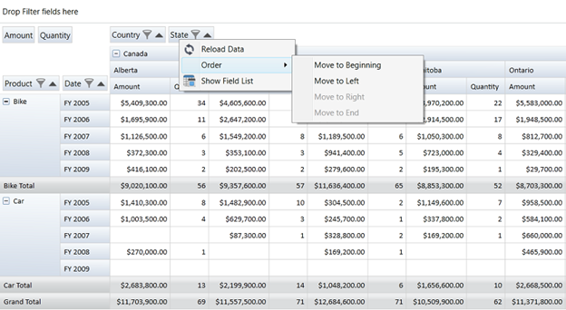

::: {style="DISPLAY: none"}
{#d2h_url_template} {#d2h_package_url style="WIDTH: 0px; DISPLAY: none; HEIGHT: 0px"}
:::

::: {.d2h_secondary_topic style="PADDING-BOTTOM: 10pt; MARGIN: 0pt; PADDING-LEFT: 0pt; PADDING-RIGHT: 0pt; PADDING-TOP: 0pt"}
#### Grouping Bar Context Menu {#grouping-bar-context-menu style="tab-stops: 0pt"}

The Grouping bar context menu consists of the following menu items:

1.   Reload Data - Refresh the Grid with the Current Item source

2.   Show Field List - Launches the PivotGrid Field List

The following are the menu items present in the context menu of Grouping bar items:

1.   Reload Data - Refresh the Grid with the Current Item Source

2.   Order -- It is used to change the position of the item present in the Grouping bar. It contains the following sub menu items:

[]{style="FONT-FAMILY: 'Trebuchet MS','sans-serif'; COLOR: #15428b; FONT-SIZE: 9pt"} 

a.   Move to Beginning - Moves the current item to the first position

b.   Move to Left - Moves the current item one step towards its left

c.   Move to Right - Moves the current item one step towards its right

d.   Move to End - Moves the current item to the last position

[]{style="FONT-FAMILY: 'Trebuchet MS','sans-serif'; COLOR: #15428b; FONT-SIZE: 9pt"} 

3.   Show Field List - Launches the PivotGrid Field List

**[]{style="FONT-FAMILY: 'Trebuchet MS','sans-serif'; COLOR: #15428b; FONT-SIZE: 9pt"}**  

Use Case Scenarios

This feature is useful for applications related to Stock Market where the data will change from time to time and users can refresh the grid using the context menu.

**[]{style="FONT-FAMILY: 'Trebuchet MS','sans-serif'; COLOR: #15428b; FONT-SIZE: 9pt"}**  

Adding Grouping Bar Context Menu

 

{border="0"}

 

Figure 27: Grouping Bar Context Menu

**[]{style="FONT-FAMILY: 'Trebuchet MS','sans-serif'; COLOR: #15428b; FONT-SIZE: 9pt"}**  

Sample Link

To access a Conditional Formatting sample:

1.   Open the Syncfusion Dashboard.

2.   Click **Business Intelligence**.

3.   Click the **WPF** drop-down list, and select **Explore Samples**.

4.   Navigate to **PivotAnalysis.WPF** -\> **Samples** -\> **Grouping Bar** -\> **Context Menu Demo**.

[]{style="FONT-FAMILY: 'Trebuchet MS','sans-serif'; COLOR: #15428b; FONT-SIZE: 9pt"} 

[]{#related-topics}
:::
