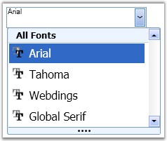

::: {style="DISPLAY: none"}
{#d2h_url_template}{#d2h_package_url style="WIDTH: 0px; DISPLAY: none; HEIGHT: 0px"}
:::

::: {.d2h_secondary_topic style="PADDING-BOTTOM: 10pt; MARGIN: 0pt; PADDING-LEFT: 0pt; PADDING-RIGHT: 0pt; PADDING-TOP: 0pt"}
##### Grouping Fonts {#grouping-fonts style="tab-stops: 0pt"}

 

Collections are maintained for recently used fonts, theme fonts and so on. You can also create a custom collection. The following lines of code are used to add the selected font to the recently used collection.

 

+--------------------------------------------------------------------------------------------------------------------------------------+
| **[\[C#\]]{style="FONT-FAMILY: 'Courier New'; COLOR: black; FONT-SIZE: 9pt"}**                                                       |
|                                                                                                                                      |
| []{style="FONT-FAMILY: 'Courier New'; FONT-SIZE: 9pt"}                                                                               |
|                                                                                                                                      |
| [fontlistcombobox1.RecentlyUsedFonts.Add(fontlistcombobox1.SelectedFontFamily);]{style="FONT-FAMILY: 'Courier New'; FONT-SIZE: 9pt"} |
+--------------------------------------------------------------------------------------------------------------------------------------+

 

You can create custom collections for the FontListComboBox and assign it as the source for the FontListComboBox. The following code snippet is used to create a new collection and assign the collection as the source for the FontListComboBox.

 

+--------------------------------------------------------------------------------------------------------------------------------------------------------------------------------------------------------------------------------+
| **[\[C#\]]{style="FONT-FAMILY: 'Courier New'; COLOR: black; FONT-SIZE: 9pt"}**                                                                                                                                                 |
|                                                                                                                                                                                                                                |
| []{style="FONT-FAMILY: 'Courier New'; COLOR: black; FONT-SIZE: 9pt"}                                                                                                                                                           |
|                                                                                                                                                                                                                                |
| [FontCollection]{style="FONT-FAMILY: 'Courier New'; COLOR: #2b91af; FONT-SIZE: 9pt"}[ collection = [new]{style="COLOR: blue"} [FontCollection]{style="COLOR: #2b91af"}();]{style="FONT-FAMILY: 'Courier New'; FONT-SIZE: 9pt"} |
|                                                                                                                                                                                                                                |
| [collection.Add([new]{style="COLOR: blue"} FontFamily([\"Arial\"]{style="COLOR: #a31515"}));]{style="FONT-FAMILY: 'Courier New'; FONT-SIZE: 9pt"}                                                                              |
|                                                                                                                                                                                                                                |
| [collection.Add([new]{style="COLOR: blue"} FontFamily([\"Tahoma\"]{style="COLOR: #a31515"}));]{style="FONT-FAMILY: 'Courier New'; FONT-SIZE: 9pt"}                                                                             |
|                                                                                                                                                                                                                                |
| [collection.Add([new]{style="COLOR: blue"} FontFamily([\"Webdings\"]{style="COLOR: #a31515"}));]{style="FONT-FAMILY: 'Courier New'; FONT-SIZE: 9pt"}                                                                           |
|                                                                                                                                                                                                                                |
| [collection.Add([new]{style="COLOR: blue"} FontFamily([\"Global Serif\"]{style="COLOR: #a31515"}));]{style="FONT-FAMILY: 'Courier New'; FONT-SIZE: 9pt"}                                                                       |
|                                                                                                                                                                                                                                |
| [fontlistcombobox1.FontsSource = collection;]{style="FONT-FAMILY: 'Courier New'; FONT-SIZE: 9pt"}                                                                                                                              |
+--------------------------------------------------------------------------------------------------------------------------------------------------------------------------------------------------------------------------------+

[]{style="FONT-FAMILY: 'Trebuchet MS','sans-serif'; COLOR: #15428b; FONT-SIZE: 9pt"} 

{border="0"}

Figure 491: Custom Collection set as the Source for the FontListComboBox

 

[]{#p279} 

[]{#related-topics}
:::
