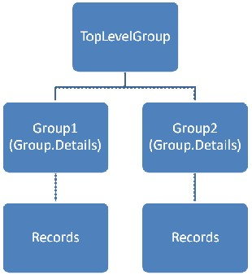
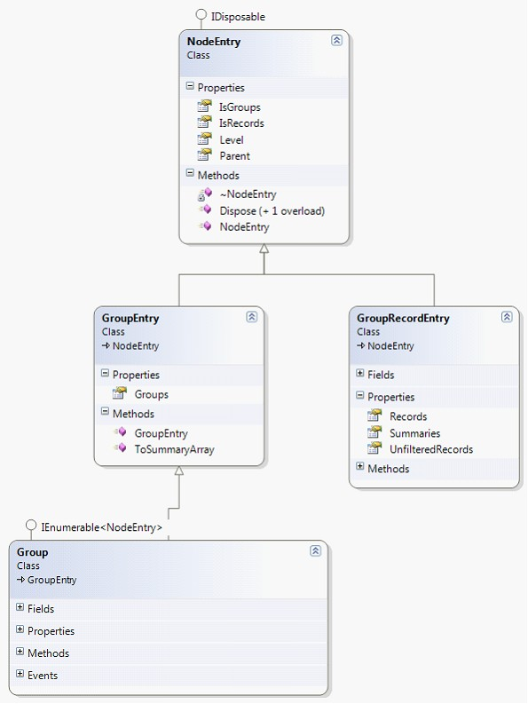

::: {style="DISPLAY: none"}
{#d2h_url_template}{#d2h_package_url style="WIDTH: 0px; DISPLAY: none; HEIGHT: 0px"}
:::

::: {.d2h_secondary_topic style="PADDING-BOTTOM: 10pt; MARGIN: 0pt; PADDING-LEFT: 0pt; PADDING-RIGHT: 0pt; PADDING-TOP: 0pt"}
##### Grouping in ICollectionViewAdv {#grouping-in-icollectionviewadv style="tab-stops: 0pt"}

To specify groups, add GroupDescriptions to ICollectionViewAdv.GroupDescriptions. The sample below is a code snippet that shows adding groups to Northwind database.

 

+-------------------------------------------------------------------------------------------------------------------------------------------------------------------------------------------------------------------------------------+
| [\[C#\]]{style="FONT-FAMILY: 'Courier New'; COLOR: black"}                                                                                                                                                                          |
|                                                                                                                                                                                                                                     |
| []{style="FONT-FAMILY: 'Courier New'; COLOR: black"}                                                                                                                                                                                |
|                                                                                                                                                                                                                                     |
| [var]{style="FONT-FAMILY: 'Courier New'; COLOR: blue"}[ northwind = [new]{style="COLOR: blue"} [Northwind]{style="COLOR: #2b91af"}([\"Data Source = Northwind.sdf\"]{style="COLOR: #a31515"});]{style="FONT-FAMILY: 'Courier New'"} |
|                                                                                                                                                                                                                                     |
| [var]{style="FONT-FAMILY: 'Courier New'; COLOR: blue"}[ orders = northwind.Orders;]{style="FONT-FAMILY: 'Courier New'"}                                                                                                             |
|                                                                                                                                                                                                                                     |
| [var]{style="FONT-FAMILY: 'Courier New'; COLOR: blue"}[ queryableCollectionView = [new]{style="COLOR: blue"} [QueryableCollectionView]{style="COLOR: #2b91af"}(orders);]{style="FONT-FAMILY: 'Courier New'"}                        |
|                                                                                                                                                                                                                                     |
| [queryableCollectionView.GroupDescriptions.Add([new]{style="COLOR: blue"} [PropertyGroupDescription]{style="COLOR: #2b91af"}([\"ShipCountry\"]{style="COLOR: #a31515"}));]{style="FONT-FAMILY: 'Courier New'"}                      |
|                                                                                                                                                                                                                                     |
| [queryableCollectionView.GroupDescriptions.Add([new]{style="COLOR: blue"} [PropertyGroupDescription]{style="COLOR: #2b91af"}([\"ShipCity\"]{style="COLOR: #a31515"}));]{style="FONT-FAMILY: 'Courier New'"}                         |
+-------------------------------------------------------------------------------------------------------------------------------------------------------------------------------------------------------------------------------------+

 

The grouping values are stored in a binary tree structure in the ICollectionViewAdv.TopLevelGroup. The visual graph of the TopLevelGroup is as follows:

 

{border="0"}

[]{style="FONT-FAMILY: 'Times New Roman','serif'"} 

Figure 138: TopLevelGroup - Visual Graph

***[]{style="COLOR: #15428b"}*** 

The class diagram for the structure above is as follows:

[]{style="COLOR: #15428b"} 

{border="0"}

Figure 139: Class Diagram

[]{style="FONT-FAMILY: 'Times New Roman','serif'"} 

[·      ]{style="FONT-FAMILY: Symbol"}NodeEntry -- It is the base class for all the nodes in the binary tree.

[·      ]{style="FONT-FAMILY: Symbol"}GroupEntry -- Contains a list of groups.

[·      ]{style="FONT-FAMILY: Symbol"}GroupRecordEntry -- Contains a list of records.

[·      ]{style="FONT-FAMILY: Symbol"}Group -- Extended Group entry that has implementation for populating and structuring the groups and its sub- groups. It can store both a list of Groups or Records. If the Group is a BottomLevelGroup then the Group.Details would contain the GroupRecordEntry.

**[]{style="COLOR: #15428b"}** 

Iterating through the whole structure

 

The TopLevelGroup is an extended Group class. Iteration through the whole structure can be performed by looping through the structure using a foreach loop, since the Group already has an Enumerator implemented.

 

+-------------------------------------------------------------------------------------------------------------------------------------------------------------------------------------------------------------------------------------+
| [\[C#\]]{style="FONT-FAMILY: 'Courier New'; COLOR: black"}                                                                                                                                                                          |
|                                                                                                                                                                                                                                     |
| []{style="FONT-FAMILY: 'Courier New'; COLOR: black"}                                                                                                                                                                                |
|                                                                                                                                                                                                                                     |
| [var]{style="FONT-FAMILY: 'Courier New'; COLOR: blue"}[ northwind = [new]{style="COLOR: blue"} [Northwind]{style="COLOR: #2b91af"}([\"Data Source = Northwind.sdf\"]{style="COLOR: #a31515"});]{style="FONT-FAMILY: 'Courier New'"} |
|                                                                                                                                                                                                                                     |
| [var]{style="FONT-FAMILY: 'Courier New'; COLOR: blue"}[ orders = northwind.Orders;]{style="FONT-FAMILY: 'Courier New'"}                                                                                                             |
|                                                                                                                                                                                                                                     |
| [var]{style="FONT-FAMILY: 'Courier New'; COLOR: blue"}[ queryableCollectionView = [new]{style="COLOR: blue"} [QueryableCollectionView]{style="COLOR: #2b91af"}(orders);]{style="FONT-FAMILY: 'Courier New'"}                        |
|                                                                                                                                                                                                                                     |
| [queryableCollectionView.GroupDescriptions.Add([new]{style="COLOR: blue"} [PropertyGroupDescription]{style="COLOR: #2b91af"}([\"ShipCountry\"]{style="COLOR: #a31515"}));]{style="FONT-FAMILY: 'Courier New'"}                      |
|                                                                                                                                                                                                                                     |
| [foreach]{style="FONT-FAMILY: 'Courier New'; COLOR: blue"}[ ([var]{style="COLOR: blue"} nodeEntry [in]{style="COLOR: blue"} queryableCollectionView.TopLevelGroup)]{style="FONT-FAMILY: 'Courier New'"}                             |
|                                                                                                                                                                                                                                     |
| [{]{style="FONT-FAMILY: 'Courier New'"}                                                                                                                                                                                             |
|                                                                                                                                                                                                                                     |
| [    [Console]{style="COLOR: #2b91af"}.WriteLine(nodeEntry);]{style="FONT-FAMILY: 'Courier New'"}                                                                                                                                   |
|                                                                                                                                                                                                                                     |
| [}]{style="FONT-FAMILY: 'Courier New'"}                                                                                                                                                                                             |
+-------------------------------------------------------------------------------------------------------------------------------------------------------------------------------------------------------------------------------------+

          

[]{#related-topics}
:::
