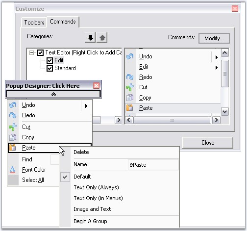
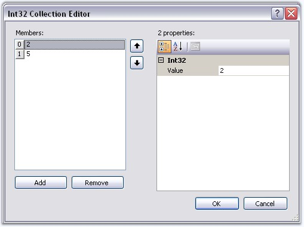
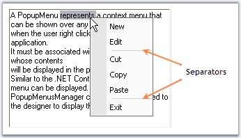

::: {style="DISPLAY: none"}
{#d2h_url_template}{#d2h_package_url style="WIDTH: 0px; DISPLAY: none; HEIGHT: 0px"}
:::

::: {.d2h_secondary_topic style="PADDING-BOTTOM: 10pt; MARGIN: 0pt; PADDING-LEFT: 0pt; PADDING-RIGHT: 0pt; PADDING-TOP: 0pt"}
##### Grouping Items in a Popup Menu {#grouping-items-in-a-popup-menu style="tab-stops: 0pt"}

[]{style="COLOR: #15428b"} 

This topic will guide on how to group the menu items by inserting separator(s), in a popup menu with and without BarManager.

 

If the ParentBarItem associated with the popup menu is contained within a BarManager, drop-down the popup menu from the Popup Form, right click on an item and select **Begin A Group** from the context menu.

[]{style="COLOR: #15428b"} 

{border="0"}

[]{style="COLOR: #15428b"} 

Figure 818: Adding Separator for a PopupMenu or Grouping item contained within a BarManager

[]{style="COLOR: #15428b"} 

If the ParentBarItem is not contained within a BarManager, edit the **SeparatorIndices** property of the ParentBarItem indicating the item indices in the items list where you want the separators to be introduced.

[]{style="COLOR: #15428b"} 

{border="0"}

**[]{style="COLOR: #15428b"}** 

Figure 819: Adding Separators through the SeparatorIndices Collection Editor when BarManager is Not Used

[]{style="COLOR: #15428b"} 

{border="0"}

[]{style="COLOR: #15428b"} 

Figure 820: Separators after BarItem2 and BarItem5

**[]{style="COLOR: #15428b"}** 

We can also group the items using BeginGroupAt and RemoveGroupAt methods. Click [here]{style="COLOR: black"} to know more.

[]{style="COLOR: #15428b"} 

See Also

**[]{style="COLOR: #15428b"}** 

[[·      ]{style="FONT-FAMILY: Symbol; TEXT-DECORATION: none; text-underline: none"}]{.UGHyperlink}[Associating Popup Menu To a Control]{.UGHyperlink}[]{.UGHyperlink}

[[·      ]{style="FONT-FAMILY: Symbol; TEXT-DECORATION: none; text-underline: none"}]{.UGHyperlink}[Adding and filling a popup menu]{.UGHyperlink}[]{.UGHyperlink}

[[·      ]{style="FONT-FAMILY: Symbol; TEXT-DECORATION: none; text-underline: none"}]{.UGHyperlink}[How to programmatically begin a group or remove an existing group in a popup menu]{.UGHyperlink}[]{.UGHyperlink}

[[·      ]{style="FONT-FAMILY: Symbol; TEXT-DECORATION: none; text-underline: none"}]{.UGHyperlink}[How to programmatically show a Popup Menu]{.UGHyperlink}[]{.UGHyperlink}

[]{#related-topics}
:::
