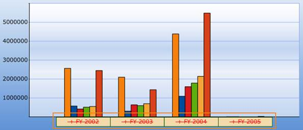

::: {style="DISPLAY: none"}
{#d2h_url_template}{#d2h_package_url style="WIDTH: 0px; DISPLAY: none; HEIGHT: 0px"}
:::

::: {.d2h_secondary_topic style="PADDING-BOTTOM: 10pt; MARGIN: 0pt; PADDING-LEFT: 0pt; PADDING-RIGHT: 0pt; PADDING-TOP: 0pt"}
#### Grouping Label Customization {#grouping-label-customization style="tab-stops: 0pt"}

 

The font family, font size and font style of the grouping label can be set through the LabelFont property.

 

+---------------------------------------------------------------------------------------------------------------------------------------------------------------------------------------------------------------------------------------------------------------------------+
| **[\[C#\]]{style="FONT-FAMILY: 'Courier New'"}**                                                                                                                                                                                                                          |
|                                                                                                                                                                                                                                                                           |
| [this]{style="FONT-FAMILY: 'Courier New'; COLOR: blue"}[.olapChart1.LabelFont = [new]{style="COLOR: blue"} [Font]{style="COLOR: #2b91af"}([\"Verdana\"]{style="COLOR: #a31515"}, 7f, [FontStyle]{style="COLOR: #2b91af"}.Strikeout);]{style="FONT-FAMILY: 'Courier New'"} |
|                                                                                                                                                                                                                                                                           |
| [this]{style="FONT-FAMILY: 'Courier New'; COLOR: blue"}[.olapChart1.LabelForeColor = [Color]{style="COLOR: #2b91af"}.Red;]{style="FONT-FAMILY: 'Courier New'"}                                                                                                            |
|                                                                                                                                                                                                                                                                           |
| [this]{style="FONT-FAMILY: 'Courier New'; COLOR: blue"}[.olapChart1.LabelBackColor = [Color]{style="COLOR: #2b91af"}.Wheat;]{style="FONT-FAMILY: 'Courier New'"}                                                                                                          |
|                                                                                                                                                                                                                                                                           |
| [this]{style="FONT-FAMILY: 'Courier New'; COLOR: blue"}[.olapChart1.LabelsBorderColor = [Color]{style="COLOR: #2b91af"}.DarkGreen;]{style="FONT-FAMILY: 'Courier New'"}[]{style="FONT-FAMILY: 'Calibri','sans-serif'"}                                                    |
+---------------------------------------------------------------------------------------------------------------------------------------------------------------------------------------------------------------------------------------------------------------------------+

[]{style="FONT-FAMILY: 'Calibri','sans-serif'"} 

+----------------------------------------------------------------------------------------------------------------------------------------------------------------------------------------------------------------------------------------------+
| **[\[VB\]]{style="FONT-FAMILY: 'Courier New'"}**                                                                                                                                                                                             |
|                                                                                                                                                                                                                                              |
| [Me]{style="FONT-FAMILY: 'Courier New'; COLOR: blue"}[.olapChart1.LabelFont = [New]{style="COLOR: blue"} Font([\"Verdana\"]{style="COLOR: #a31515"}, 7f, [FontStyle]{style="COLOR: #2b91af"}.Strikeout)]{style="FONT-FAMILY: 'Courier New'"} |
|                                                                                                                                                                                                                                              |
| [Me]{style="FONT-FAMILY: 'Courier New'; COLOR: blue"}[.olapChart1.LabelForeColor = [Color]{style="COLOR: #2b91af"}.Red]{style="FONT-FAMILY: 'Courier New'"}                                                                                  |
|                                                                                                                                                                                                                                              |
| [Me]{style="FONT-FAMILY: 'Courier New'; COLOR: blue"}[.olapChart1.LabelBackColor = [Color]{style="COLOR: #2b91af"}.Wheat]{style="FONT-FAMILY: 'Courier New'"}                                                                                |
|                                                                                                                                                                                                                                              |
| [Me]{style="FONT-FAMILY: 'Courier New'; COLOR: blue"}[.olapChart1.LabelsBorderColor = [Color]{style="COLOR: #2b91af"}.DarkGreen]{style="FONT-FAMILY: 'Courier New'"}[]{style="FONT-FAMILY: 'Calibri','sans-serif'"}                          |
+----------------------------------------------------------------------------------------------------------------------------------------------------------------------------------------------------------------------------------------------+

 

{border="0"}

 

Figure 9: Grouping label customization

[]{#related-topics}
:::
